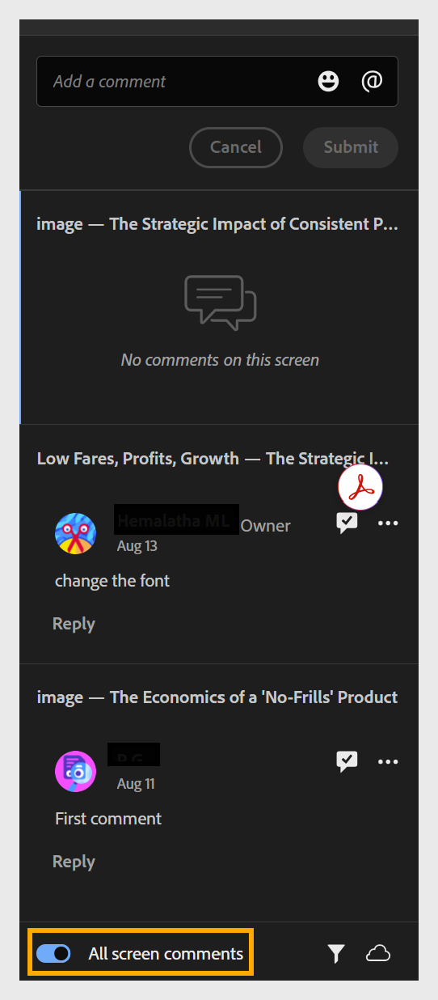

# Revisar e comentar em um projeto compartilhado

Quando um projeto é compartilhado para revisão, você acessa o curso como revisor por meio do link compartilhado pelo autor.

1. Abra o link de revisão compartilhado com você.

2. No painel **Comentários** à direita, selecione qualquer componente do curso que precise de alterações. O nome do componente aparece na parte superior do campo de comentário, para que o feedback permaneça vinculado à parte direita do curso. Adicione seu comentário abaixo dele.

   

   No painel **Comentários**, você pode:
   * Adicione, edite, exclua, responda e resolva comentários.
   * Exiba comentários de outros revisores.
   * Use **@** para mencionar o proprietário do projeto ou outro revisor (somente se você entrou com sua Adobe ID).
   * Adicione emojis aos comentários.
   * Exibir todos os comentários no curso: por padrão, o painel Comentários mostra comentários somente do componente do curso que você está visualizando no momento. Ative a opção Todos os comentários na tela para exibir todos os comentários no projeto inteiro, independentemente do componente ou tela em que você está.

   

   * Filtre comentários por **Revisores**, **Tempo** e pelo status **Resolvido**.

   

3. Selecione **Enviar** para postar seu comentário ou **Cancelar** para descartá-lo.

## Denunciar conteúdo ofensivo

Se você encontrar conteúdo que viole os [Termos de uso](https://www.adobe.com/legal/terms.html) do Adobe ao revisar um curso do Compositor de conteúdo compartilhado, poderá denunciá-lo.

Selecione **Relatório** no canto superior direito e preencha o formulário. Como alternativa, você pode denunciar abuso via email para [abuse@adobe.com](mailto:abuse@adobe.com). 

