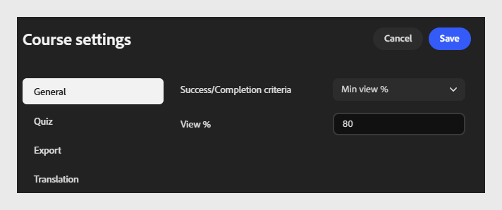

# Definir critérios de conclusão e êxito

## Critérios para conclusão

**Critérios de conclusão**: selecione a lista suspensa e escolha quando o curso está marcado para ser concluído.

- **Iniciar:** marca a conclusão do curso assim que um aluno o abre, independentemente do quanto ele visualiza.
  

- A **exibição Mínima %:** marca a conclusão do curso quando um aluno exibe a porcentagem especificada do conteúdo do curso.
  

- **Quiz: marca o curso concluído com base na atividade de questionário do aluno. Selecione uma condição de quiz:**

  - **Na tentativa:** marca o término assim que o aluno faz o teste, independentemente do resultado.

  - **Na aprovação:** marca a conclusão somente quando o aluno é aprovado no quiz.

  - **Aprovação ou limite atingido:** marca a conclusão quando o aluno é aprovado ou atinge o número máximo de tentativas permitidas, o que ocorrer primeiro.
    

## Critérios de sucesso

**Os** critérios de sucesso determinam se um aluno foi marcado como aprovado ou reprovado após realizar o curso. Diferentemente dos critérios de conclusão, os critérios de sucesso são baseados em pontuação.

>[!NOTE]
>
>As opções disponíveis dependem da versão do SCORM selecionada em **Configurações de exportação**. Se você selecionar **SCORM 1.2**, os critérios de conclusão e êxito serão combinados em uma única configuração. Se você selecionar **SCORM 2004**, os critérios de conclusão e êxito aparecerão como configurações separadas, conforme descrito abaixo.*

- **Critérios de sucesso**: selecione a lista suspensa e escolha como o curso avalia o sucesso.

- **Iniciar:** marca o aluno como aprovado simplesmente ao iniciar o curso.
  

- **Exibição mínima %**: marca o aluno como aprovado depois que ele exibe a porcentagem especificada de conteúdo. Por exemplo, insira 80 para exigir que os alunos vejam pelo menos 80% do curso.
  

- **Quiz:** marca o aluno como aprovado ou reprovado com base no fato de a pontuação do quiz corresponder ao limite de pontuação de aprovação. Selecione uma condição de quiz:

  - **Na tentativa: marca como bem-sucedido assim que o aluno tenta o quiz.**

  - **Na aprovação: marca como bem-sucedido somente quando o aluno é aprovado no quiz.**

  - **Aprovação ou limite atingido: marca como bem-sucedido quando o aluno é aprovado ou atinge o máximo de tentativas permitidas.**

  

>[!NOTE]
>
>Um aluno pode concluir um curso, mas ainda assim reprovar, por exemplo, se terminar todo o conteúdo, mas não obter a pontuação alta suficiente no quiz. Os critérios de conclusão e sucesso são independentes; defina ambos cuidadosamente com base em como deseja que o progresso do aluno e o desempenho sejam controlados. Ao selecionar o Quiz para qualquer um dos critérios, configure as repetições do quiz e a pontuação de aprovação na guia **Configurações do quiz**.

## Por que os critérios de conclusão e sucesso são importantes para a geração de relatórios

- Os critérios de conclusão controlam quando o status de um aluno é alterado para Concluído em transcrições do ALM, painéis de conclusão e qualquer exportação de conformidade ou auditoria extraída do LMS - eles medem o progresso, não o desempenho.

- Critérios de sucesso controlam o valor Aprovado/Reprovado registrado junto com o status de conclusão - o valor do qual a maioria dos relatórios de conformidade e certificação depende.

- Se os critérios de conclusão e êxito também estiverem configurados na biblioteca de conteúdo do **Adobe Learning Manager** para o mesmo módulo, essas configurações terão precedência sobre as definidas no Compositor de conteúdo. Decida com antecedência qual produto deve ser proprietário dessas regras e evite definir valores conflitantes em ambos os locais.

- Corresponda os critérios ao que você precisa comprovar: a % de início ou a % mínima de exibição são suficientes para o conteúdo de conscientização, enquanto os critérios baseados no quiz fornecem um registro defensável de que um aluno demonstrou conhecimento, não apenas de que abriu o curso.
