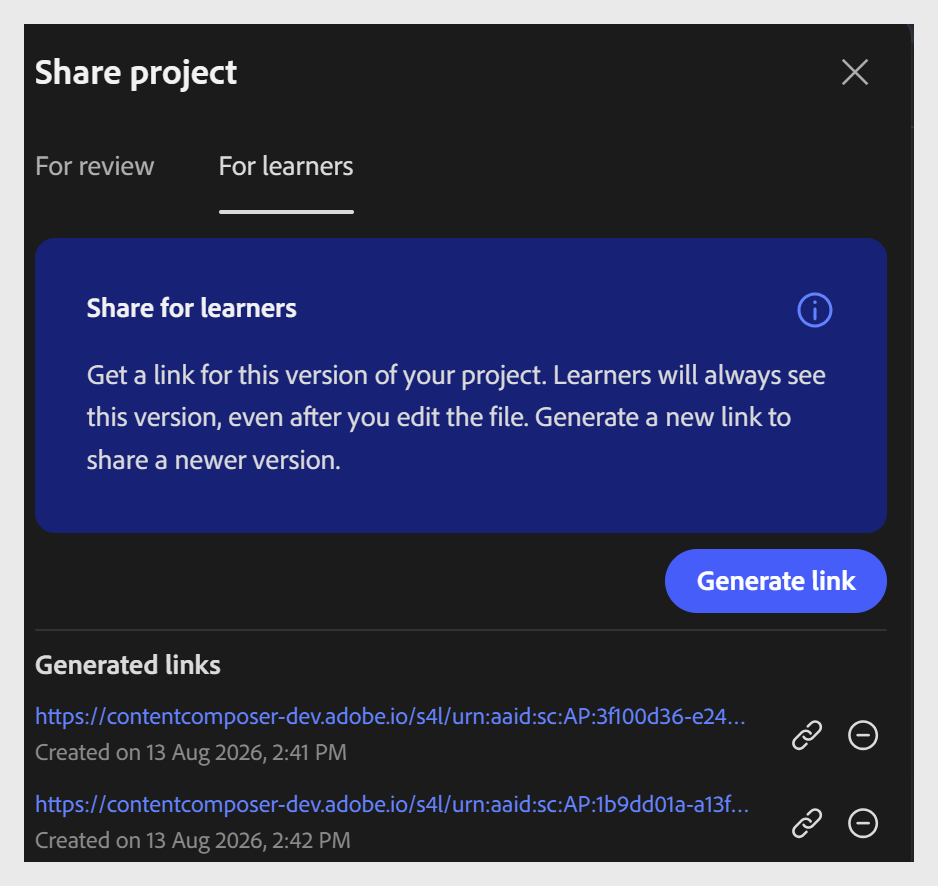

# Compartilhar um curso com os alunos

Compartilhar com os alunos fornece acesso direto ao curso sem exigir uma conexão ou logon do LMS. Isso é útil quando você deseja que os alunos visualizem ou concluam um curso rapidamente, por exemplo, durante uma sessão de treinamento piloto, informal ou antes que o curso seja publicado na Adobe Learning Manager para inscrição formal e acompanhamento.

1. Selecione **Compartilhar** na barra de ferramentas superior.

2. Selecione a guia **Para alunos**.

3. Selecione **Gerar link** para criar um link de acesso do aluno.

   

4. Compartilhe o link com seus alunos.

>[!IMPORTANT]
>
>Os links do aluno são específicos da versão. Sempre que atualizar o curso, gere e compartilhe um novo link para que os alunos acessem a versão mais recente. O link anterior continua a mostrar a versão anterior.
>
>O acesso do aluno não inclui o painel de comentários. Os alunos não podem adicionar comentários ou interagir com o fluxo de trabalho de revisão.

