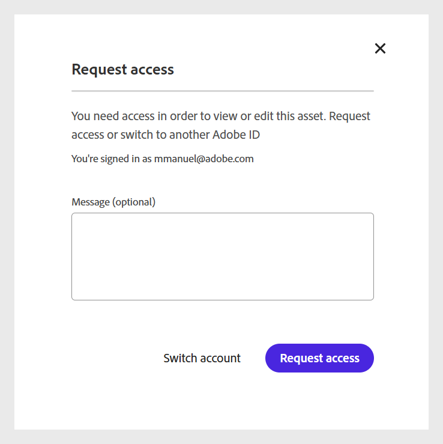

# Compartilhar projeto para revisão

O Compositor de conteúdo permite compartilhar um projeto com revisores ou alunos sem exigir que eles instalem o aplicativo, fornecendo uma maneira rápida e estruturada de coletar feedback e obter aprovação antes da publicação.

Como autor, você pode convidar revisores por nome ou email, controlar exatamente quem tem acesso e revogar esse acesso a qualquer momento. Os revisores podem abrir o link compartilhado, adicionar comentários diretamente em qualquer componente do curso e até mesmo tentar o quiz final sem afetar as pontuações gravadas, para que possam visualizar a experiência completa do aluno.

Os comentários permanecem organizados e acionáveis: revisores e proprietários podem responder, resolver, filtrar e mencionar um ao outro em comentários, todos no mesmo painel, seja revisando externamente ou trabalhando dentro do projeto. Depois de tratar do feedback e atualizar o projeto.

Para compartilhar um projeto para revisão:

1. Selecione **Para revisão**.

   

2. Insira os nomes ou endereços de email dos revisores no campo **Convidar pessoas**.

   
3. Revise quem tem acesso para confirmar se apenas as pessoas convidadas podem acessar o projeto.

4. Selecione **Convidar como comentarista** para adicionar revisores por nome ou email. É possível adicionar quantos revisores forem necessários. Ou selecione **Copiar link** para copiar a URL de revisão e compartilhá-la diretamente com os revisores que já têm acesso. Há duas maneiras separadas de compartilhar o projeto.

   

## Remover o acesso de um revisor

Você pode remover um revisor da lista de pessoas que têm acesso ao projeto. Se esse revisor tentar abrir o projeto novamente usando um link compartilhado anteriormente.

Você tem a opção de remover um comentarista selecionado. Quando um comentarista é removido da lista de pessoas que têm acesso ao documento.

Para remover o acesso:

* Selecione o nome do revisor e escolha Remover nas opções exibidas.

* Se o revisor tentar acessar o documento com um link compartilhado anteriormente. A mensagem Acesso negado é exibida.

  

## Solicitar acesso

Se você tentar abrir um projeto compartilhado ao qual não tem mais acesso, deverá solicitar acesso para poder visualizá-lo. Isso pode acontecer, por exemplo, se o proprietário removeu você ou se você estiver abrindo o link com uma Adobe ID diferente. Em ambos os casos, você verá uma tela Acesso negado.

* Selecione **Solicitar acesso** para solicitar permissão ao proprietário para revisar o projeto e adicionar comentários.

  

* O proprietário do projeto recebe uma notificação com o nome do revisor que está solicitando acesso.