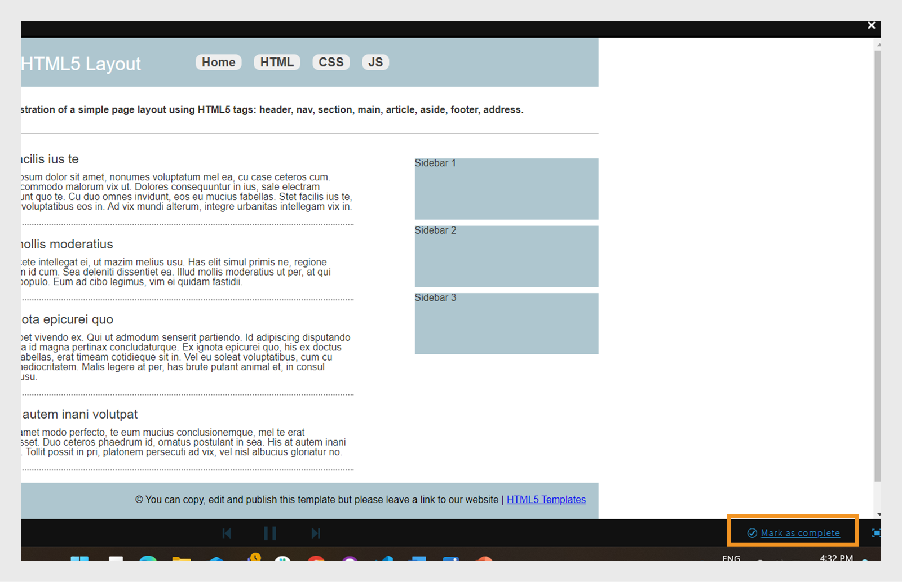

# Biblioteca de conteúdo

Saiba como criar conteúdo para que se ajuste aos cursos como conteúdo de aprendizado em ritmo individualizado.

## Biblioteca de conteúdo {#contentlibrary}

O conteúdo é o elemento essencial de um curso. Os autores criam uma biblioteca de conteúdo que possa se ajustar aos cursos como conteúdo de aprendizado em ritmo individualizado. Somente os autores têm acesso a esta biblioteca de conteúdo.

## Tipos de conteúdo suportados {#supported}

Você pode carregar o conteúdo interativo e estático para a mesma biblioteca.

A tabela abaixo mostra os tipos de arquivos interativos e estáticos que você pode carregar na biblioteca.

<table>
 <tbody>
  <tr>
   <td>
    
<b>Conteúdo interativo</b>
</td>
   <td>
    
<b>Tipo de conteúdo</b>
</td>
   <td>
    
<b>Extensões</b>
</td>
  </tr>
  <tr>
   <td>
    
 
</td>
   <td>
    

    <ul>
     <li>SCORM 1.2</li>
     <li>SCORM 2004</li>
     <li>AICC</li>
     <li>TinCan</li>
    </ul>
    

</td>
   <td>
    
zip
</td>
  </tr>
  <tr>
   <td>
    
<b>Conteúdo estático</b>
</td>
   <td>
    
<b>Tipo de conteúdo</b>
</td>
   <td>
    
<b>Extensões</b>
</td>
  </tr>
  <tr>
   <td>
    
 
</td>
   <td>
    
Vídeo
</td>
   <td>
    
mp4, wmv, 3gp, 3g2, 3gp2, asf, avi, f4v h264, mpe, mpeg, mpg, mpg2, m4v, mov, wmv
</td>
  </tr>
  <tr>
   <td>
    
 
</td>
   <td>
    
Áudio
</td>
   <td>
    
mp3, wav, aac, m4a, wma, vorbis, pcm, eac3, amr, ac3
</td>
  </tr>
  <tr>
   <td>
    
 
</td>
   <td>
    
PDF
</td>
   <td>
    
pdf
</td>
  </tr>
  <tr>
   <td>
    
 
</td>
   <td>
    
MS PowerPoint
</td>
   <td>
    
pptx, ppt
</td>
  </tr>
  <tr>
   <td>
    
 
</td>
   <td>
    
MS Word
</td>
   <td>
    
docx, doc
</td>
  </tr>
  <tr>
   <td>
    
 
</td>
   <td>
    
MS Excel
</td>
   <td>
    
xlsx, xls
</td>
  </tr>
  <tr>
   <td>
    
 
</td>
   <td>
    
HTML
</td>
   <td>
    
html ou htm
</td>
  </tr>
 </tbody>
</table>

## Adicionar conteúdo novo à biblioteca {#addnewcontentinthelibrary}

**Os autores** podem adicionar conteúdo em ALM. Há dois tipos de conteúdo na ALM: **[!UICONTROL Conteúdo]** e **[!UICONTROL Quiz]**. Para saber como adicionar conteúdo, consulte [Adicionar conteúdo](content-library.md#addstaticcontent) estático e [Criar um quiz](content-library.md##createaquiz).

## Adicionar conteúdo estático {#addstaticcontent}

1. Selecione **[!UICONTROL Biblioteca]** de conteúdo no painel esquerdo depois de fazer logon como **Autor** e selecionar **[!UICONTROL Adicionar]**.

   Como alternativa, você pode selecionar **[!UICONTROL Criar conteúdo]** na **[!UICONTROL página Introdução]** .

1. **[!UICONTROL No campo Nome]**, digite um nome para o conteúdo que deseja carregar.
1. **[!UICONTROL No campo Descrição]**, digite a descrição do conteúdo. Certifique-se de que a descrição que deseja inserir seja pertinente. O limite de caracteres é de 400 caracteres.
1. Para adicionar o conteúdo, selecione **[!UICONTROL Adicionar arquivo]** de conteúdo e faça upload do arquivo de recurso. Ao adicionar conteúdo em vários idiomas, não é possível combinar conteúdo interativo e estático em um único grupo. Todo o conteúdo de todos os idiomas devem ser estáticos ou todo o conteúdo deve ser interativo.

   Se quiser substituir o conteúdo, você poderá trocar um conteúdo estático por outro conteúdo estático. O mesmo se aplica ao conteúdo interativo.

1. **[!UICONTROL No campo Duração]**, você pode digitar opcionalmente o tempo esperado que um aluno gastaria nesse módulo. A duração está em minutos.

   Se o aluno marcar um curso como concluído, calcularemos o tempo de aprendizado com base na duração especificada. Se o aluno consumir o conteúdo no reprodutor, o tempo gasto no reprodutor será adicionado ao tempo de aprendizado gasto. Se o tempo de conteúdo real for menor do que a duração especificada, o reprodutor exibirá o tempo de conteúdo em que se encontra. Nenhuma alteração é feita neste caso.

1. **[!UICONTROL No campo Marcas]**, digite as marcas do conteúdo carregado para que seu conteúdo se torne detectável.

   Um autor pode usar essas tags para procurar o conteúdo enquanto adiciona o conteúdo ao curso.

### Adicionar tipo de arquivo HTML5 na biblioteca de conteúdo

Os autores podem adicionar o conteúdo HTML5 como um arquivo .zip ao conteúdo em ritmo personalizado. A pasta .zip deve conter um arquivo HTML nomeado `index.html`. Se houver vários arquivos HTML, eles devem ser vinculados, com o arquivo principal nomeado `index.html`. Os alunos podem exibir o conteúdo HTML5 no Fluidic Player. O autor pode adicionar este conteúdo HTML5 ao módulo de ritmo próprio de um curso e definir os critérios de conclusão. Os autores podem definir os critérios para concluir o curso em HTML de duas maneiras:

* O aluno pode marcá-lo como completo sozinho.
* Ele será marcado como concluído assim que iniciarem o curso.

Para adicionar o tipo de arquivo HTML (.zip) à biblioteca de conteúdo, siga estas etapas.

1. No aplicativo do autor, selecione **[!UICONTROL Criar conteúdo]** na página inicial.
1. **[!UICONTROL Na tela Biblioteca]** de conteúdo, selecione **[!UICONTROL Adicionar]** > **[!UICONTROL conteúdo]**.
1. Digite o nome e a descrição do conteúdo.
1. Selecione a opção **[!UICONTROL Adicionar arquivo]** de conteúdo, depois navegue e selecione os arquivos HTML (compactados como uma pasta).
1. Após o conteúdo adicionado, você poderá visualizar o conteúdo na **[!UICONTROL seção Biblioteca]** de conteúdo.
1. Selecione o conteúdo HTML e selecione **[!UICONTROL Editar]**.
1. Selecione uma das seguintes opções na opção **[!UICONTROL Critérios]** de conclusão.
   * **[!UICONTROL Ao iniciar o conteúdo]**: o curso será marcado como concluído automaticamente quando o aluno iniciar.
   * **[!UICONTROL Marcas do aluno concluídas]**: o aluno tem a opção de marcar o curso como concluído no Fluidic Player.

   
   _Critérios de conclusão_

1. Selecione **[!UICONTROL Salvar]**.
1. Crie um curso adicionando este conteúdo.  Para obter mais informações, consulte [Criação, modificação e publicação de cursos](/help/migrated/authors/feature-summary/courses.md).

No aplicativo do aluno, se um autor seleciona critérios de seleção como **[!UICONTROL Ao iniciar o conteúdo]**, então o curso marcará como concluído quando o aluno iniciar. Quando um autor escolhe marcas do aluno concluídas ****, o aluno terá a opção de marcar o curso como concluído.

_Marcas do aluno concluídas_

### Controle de versão {#versioning}

A biblioteca de conteúdo também faz controle de versão dos conteúdos carregados. Caso faça alguma alteração no conteúdo, como alterar uma apresentação do PowerPoint e reenviar o PPT à biblioteca, o número da versão será incrementado em um. Isso ajuda a acompanhar as alterações no seu conteúdo.

## Adicionar conteúdo interativo {#addinteractivecontent}

1. Selecione **[!UICONTROL Biblioteca]** de conteúdo no painel esquerdo depois de fazer logon como **Autor** e selecionar **[!UICONTROL Adicionar]**.

   Como alternativa, você pode selecionar **[!UICONTROL Criar conteúdo]** na **[!UICONTROL página Introdução]** .

1. **[!UICONTROL No campo Nome]**, digite um nome para o conteúdo que deseja carregar.
1. **[!UICONTROL No campo Descrição]**, digite a descrição do conteúdo.

   >[!NOTE]
   >
   >Certifique-se de que a descrição que deseja inserir seja pertinente. O limite de caracteres é de 245 caracteres.

1. Para adicionar o conteúdo, selecione **[!UICONTROL Adicionar arquivo]** de conteúdo e faça upload do arquivo de recurso. Ao adicionar conteúdo em vários idiomas, não é possível combinar conteúdo interativo e estático em um único grupo. Todo o conteúdo de todos os idiomas devem ser estáticos ou todo o conteúdo deve ser interativo.

* [Tipos de arquivo suportados](content-library.md#supported)

  O conteúdo interativo pode ser um projeto publicado em SCORM, AICC ou Captivate. O arquivo deve ser compactado em zip.

  Você também pode adicionar conteúdo HTML gerado a partir do Captivate, Presenter ou Presenter Video Express.

1. O Learning Manager aceita legendas para conteúdo de vídeo carregado no Learning Manager. Agora, os autores podem fazer upload do arquivo que contém legendas, junto com o arquivo de vídeo.

   Em seguida, os alunos podem visualizar as legendas durante a reprodução do módulo de vídeo.

   O formato suportado é [Faixas de texto de vídeo da Web (webVTT).](https://www.w3.org/TR/webvtt1/)

   O suporte a legendas está disponível para conteúdo de vídeo carregado na biblioteca de conteúdo do Learning Manager.

   Como autor, ao fazer upload de um conteúdo de vídeo ou áudio, você também pode fazer upload do arquivo VTT que contém as legendas.

   As legendas aparecem no Fluidic Player. As legendas também são compatíveis com [os padrões](https://www.w3.org/TR/WCAG20/) WCAG2.0.

   Ao adicionar um conteúdo de vídeo à biblioteca, você também pode adicionar o arquivo VTT, que **deve** ser um arquivo válido.

   

   *Adicionar um arquivo webvtt*

   O arquivo VTT carregado corresponde à versão existente do conteúdo. Assim, o arquivo webVTT carregado não é vinculado à versão anterior do conteúdo.

   Caso esteja criando o conteúdo em idiomas diferentes, você pode fazer upload de um arquivo webVTT diferente para cada idioma. Os alunos poderão ver as legendas correspondentes ao idioma selecionado durante a reprodução.

   >[!NOTE]
   >
   >   Um arquivo VTT suporta um idioma. Para oferecer suporte a vários idiomas, carregue vários arquivos de vídeo para cada idioma do conteúdo e faça upload de seus respectivos arquivos VTT para cada arquivo de vídeo.

   Como autor, toda vez que você altera o conteúdo, vídeo ou áudio, o Gerenciador de aprendizagem solicita um novo arquivo vtt.

   Depois de adicionar esse conteúdo a um curso e ao visualizar o curso como aluno, você pode ver as legendas no vídeo.

   No reprodutor, alterne o botão CC no Fluidic Player para exibir ou ocultar as legendas.

   A mesma exibição está presente no **aplicativo do aluno**, bem como na **Visualização como aluno**.

   **Ao adicionar, atualizar ou excluir** o arquivo vtt, você receberá uma notificação.
O suporte a WebVTT não está disponível para:

   1. Comunicados em vídeo.
   1. Vídeo reproduzido no conteúdo de e-learning. Isso é impulsionado pelo conteúdo.
   1. Vídeo carregado no Aprendizado social.
   1. Vídeo criado no aplicativo de desktop Learning Manager.
   1. Conteúdo de vídeo criado usando o processo de migração.
   1. Reprodução de vídeo no aplicativo móvel no modo offline.

1. **[!UICONTROL No campo Duração]**, você pode digitar opcionalmente o tempo esperado que um aluno gastaria neste módulo. A duração está em minutos.
1. **[!UICONTROL No campo Marcas, insira]** as tags do conteúdo carregado para que seu conteúdo se torne detectável.

### Suporte para catálogo compartilhado

Se uma conta de vendedor compartilha um catálogo que contém os cursos, e os cursos contêm módulos, áudio ou vídeo com legendas, os cursos devem se comportar da mesma forma na conta do comprador.

A propagação do módulo deve funcionar corretamente da conta do vendedor para a conta do comprador. Isso pode incluir - editar/excluir/adicionar o arquivo vtt no módulo.

Depois de carregar o conteúdo, você verá uma notificação clicando no ícone de sino no canto superior direito da página. Sempre que modificar um conteúdo e reenviá-lo, você receberá uma notificação. Se as alterações foram feitas por você, somente você receberá a notificação, outros autores não.

## Crie um questionário {#createaquiz}

Crie avaliações no Adobe Learning Manager com a nova ferramenta de criação de quiz na página Biblioteca de conteúdo. As avaliações criadas se tornam parte da Biblioteca de conteúdo e podem ser adicionadas a uma pasta &quot;pública&quot; para reutilização do curso.

1. Selecione Biblioteca de conteúdo no painel esquerdo.
1. No canto superior direito da tela, selecione **Adicionar > quiz**.
1. Na página Criar quiz, digite o nome e a descrição do quiz.
1. Na seção Conteúdo do quiz, selecione **Adicionar pergunta do quiz**.
1. Na caixa de diálogo Pergunta do quiz, selecione o tipo de pergunta. Há três tipos de perguntas:
   * Pergunta de múltipla escolha
   * Verdadeiro ou falso
   * Preencher o espaço em branco
1. Insira a pergunta e selecione a resposta correta.
1. Defina os pontos para o quiz.
1. Se quiser que a pergunta seja respondida corretamente para passar no quiz, marque a caixa de seleção **É obrigatório responder corretamente para passar no quiz**.
1. Selecione **Salvar e fechar**.
1. Insira os pontos para ser aprovado no quiz no campo critérios **de Aprovação**.
1. Se você quiser que um aluno veja uma resposta correta, ative a opção Alternar **mostrar respostas corretas** para os alunos após o quiz.
1. Se você quiser que as perguntas e respostas apareçam aleatoriamente, ative as opções:
   * Tornar ordem de perguntas aleatória
   * Tornar ordem da opção de resposta aleatória
1. Especifique uma pasta para adicionar o quiz e disponibilizá-lo para todos os autores.
1. **No campo Duração**, especifique o tempo que o aluno deve gastar no quiz.
1. Especifique uma marca de formatação da lista de marcas já criadas.
1. Adicione um logotipo e plano de fundo ao quiz.
1. No canto superior direito da página, selecione **Publicar**.

Para adicionar quizzes em um idioma diferente, siga as etapas a seguir:

1. Para adicionar o quiz para idiomas diferentes, selecione a **guia Adicionar novo idioma** e escolha os idiomas necessários. Usando essa abordagem, você pode adicionar suporte multilíngue ao conteúdo.

   

   *Adicionar novo idioma para um conteúdo*

1. Repita o processo de upload de conteúdo para os novos idiomas.
1. Para remover um idioma, selecione a **[!UICONTROL guia Adicionar novo idioma]** e limpe a seleção.

   Depois de fazer as alterações, clique **[!UICONTROL em Salvar]**. Na biblioteca, o novo conteúdo já estará disponível para realização.

O quiz é adicionado à **[!UICONTROL Biblioteca]** de conteúdo. Como qualquer conteúdo da Biblioteca de conteúdo, você pode desativar um quiz e excluí-lo.

## Adicionar à pasta {#add-folder}

Depois que um administrador cria as pastas de conteúdo, você, autor, pode fazer upload de um conteúdo em uma pasta de conteúdo, de modo que o conteúdo seja visível somente para você ou para um grupo selecionado de autores na conta. Você também pode tornar o conteúdo público e torná-lo visível para todos os autores na conta.

**Uso de exemplo**

Por exemplo, as agências querem manter o controle total do conteúdo e alguém com vista para o conteúdo deve ter acesso a todo o conteúdo. Ao mesmo tempo, os criadores de conteúdo nas agências devem ter acesso apenas a seu próprio conteúdo e, em alguns casos, ao acesso a outro conteúdo.

A biblioteca de conteúdo com conteúdo existente (ou seja, conteúdo carregado antes de configurar pastas de conteúdo) é definida como **pasta** pública. Essa pasta não pode ser descontinuada ou excluída. O conteúdo que faz parte da pasta pública é acessível a todos os tipos de autores. Uma vez que as pastas de conteúdo são configuradas, os autores padrão e os autores personalizados devem selecionar a pasta onde o conteúdo deve ser colocado, ao fazer upload do novo conteúdo.

>[!NOTE]
>
>Pastas públicas e privadas são mutuamente exclusivas. Isso significa que o conteúdo **não pode** ser associado a pastas públicas e privadas ao mesmo tempo. Ela pode ser associada a pastas **públicas ou** pode ser associada a uma ou mais pastas privadas em qualquer momento.

Ao adicionar um conteúdo, você pode escolher a pasta onde o conteúdo ficará.

*Adicionar conteúdo à pasta*

Se escolher **Público**, o conteúdo ficará visível para todos os autores. Por padrão, todo o conteúdo existente na conta que não fazem parte de nenhuma pasta estará na pasta pública.

Observe que as pastas de conteúdo são apenas compartimentos virtuais para vincular o conteúdo. Caso um conteúdo seja colocado em duas pastas, significa que o arquivo de conteúdo sempre é um único, mas vinculado a várias pastas. Assim, no caso de o conteúdo ser atualizado pelo autor-1 personalizado que tem acesso à pasta-1 personalizada, o mesmo conteúdo atualizado também refletirá na pasta personalizada-2 acessada pelo custom-author-2.

Na Biblioteca de conteúdo, há duas opções para gerenciar as pastas de conteúdo:

**Todas as pastas**

É uma lista que exibe todas as pastas que foram criadas na conta.

*Exibir todas as pastas*

**Todos os autores**

É uma lista que exibe os autores que criaram conteúdo e o carregaram na biblioteca.

*Exibir todos os autores*

Isso está disponível **somente** quando um administrador cria uma nova pasta.

## Mover o conteúdo para a pasta {#movecontenttofolder}

Para mover um conteúdo de pasta pública para qualquer pasta privada,

1. Selecione **pasta pública** na lista suspensa Todas as **pastas** .

   

   *Exibir todo o conteúdo carregado*

1. Escolha o conteúdo que deseja mover para uma pasta. Em seguida, clique **[!UICONTROL em Ações]** > **[!UICONTROL Organizar conteúdo]** > **[!UICONTROL mover conteúdo para a pasta]**.

   

   *Mover um conteúdo selecionado para a pasta*

1. Escolha a pasta para a qual deseja mover o conteúdo. Clique em **[!UICONTROL Mover]**.

## Copiar conteúdo para a pasta {#copycontenttofolder}

Copiar uma pasta significa que você estaria adicionando uma tag à pasta. A operação copiar não criará cópias do conteúdo, mas adicionará apenas uma associação com pastas especificadas.

*Copiar uma pasta*

## Desvincular pasta {#unlinkfolder}

Desvincular significa remover o conteúdo da pasta selecionada.

O conteúdo pode ser desvinculado de uma pasta **especificada SOMENTE** se também estiver associado a outras pastas. Se o conteúdo estiver sendo desvinculado, é associado apenas a uma pasta, em vez disso, é recomendável usar a operação MOVER.

>[!NOTE]
>
>Inicialmente, o menu Organizar, em Ações, está desativado. Para usá-lo, primeiro selecione uma pasta na lista suspensa de pastas.

*Desvincular uma pasta*

## Adicionar conteúdo em diferentes idiomas {#addcontentfordifferentlanguages}

1. Para adicionar o conteúdo para idiomas diferentes, clique na **guia Adicionar novo idioma** e escolha os idiomas necessários. Usando essa abordagem, você pode adicionar suporte multilíngue ao conteúdo.

   

   *Adicionar novo idioma para um conteúdo*

1. Repita o processo de upload de conteúdo para os novos idiomas.
1. Se quiser remover um idioma, clique na guia Adicionar novo idioma e desmarque sua seleção.

   Depois de fazer as alterações, clique em Salvar. Na biblioteca, o novo conteúdo já estará disponível para realização.

## Definir critérios de conclusão {#setcompletioncriteria}

<table>
 <tbody>
  <tr>
   <td>
    
<b>Conteúdo estático</b>
</td>
   <td>
    
<b>Conteúdo interativo</b>
</td>
  </tr>
  <tr>
   <td>
    
Só é possível definir critérios de <b>conclusão</b> do conteúdo nas opções a seguir:

    <ul>
     <li>Ao iniciar o conteúdo</li>
     <li>Com base na porcentagem mínima obrigatória</li>
    </ul></td>
   <td>
    
É possível definir critérios de <b>conclusão</b> e <b>êxito</b> do conteúdo nas opções a seguir:

    <ul>
     <li>Ao iniciar o conteúdo</li>
     <li>Com base na porcentagem mínima obrigatória</li>
     <li>Em questionário aprovado ou nas opções de tentativas</li>
    </ul>
    
<b>OBSERVAÇÃO:</b> somente conteúdo HTML do Captivate, do Presenter Video Express ou do Presenter pode ser editado.
</td>
  </tr>
 </tbody>
</table>

Depois de adicionar o conteúdo, você pode modificar os critérios de conclusão do conteúdo.

No Gerenciador de aprendizado, as medalhas e habilidades são concedidas com base no êxito e na conclusão. Se o aluno concluiu um curso sem êxito, ele não receberá a medalha e habilidade correspondentes ao objeto de aprendizado.

Por exemplo, se você usou o Adobe Captivate para criar o curso e definiu parâmetros de aprendizado na caixa de diálogo Preferências, essas configurações migrarão para o Learning Manager nas opções de Critérios de conclusão.

Na seção Critérios de conclusão, você pode definir as opções a seguir:

**Ao iniciar o conteúdo:** ao ativar essa opção, você define como critério de conclusão do conteúdo um aluno abrir o conteúdo.

**Com base na porcentagem mínima obrigatória:** defina um porcentagem mínima de realização do curso pelo aluno. Por exemplo, se você definir a porcentagem como 50, seu aluno poderá realizar 50% do conteúdo e ainda atender aos critérios de conclusão.

**Questionário:** escolha um dos critérios a seguir:

* **Questionário aprovado:** o status é indicado como Concluído apenas se o aluno for aprovado no questionário.
* **Questionário realizado:** o status é indicado como Concluído se os alunos realizarem o questionário, tanto se forem aprovados ou não no questionário.
* **Questionário aprovado ou limite atingido:** o status é indicado como Concluído se os alunos forem aprovados no questionário ou esgotarem as tentativas. Por exemplo, se o número de tentativas definidas no curso for dois e:

   * Se os alunos fizerem a primeira tentativa e forem aprovados, o status será informado como Completo e Aprovado.
   * Se os alunos fizerem a primeira tentativa e forem reprovados, o status será informado como Incompleto e Reprovado, pois o limite de tentativas ainda não será atingido.
   * Se os alunos retomou o quiz e forem reprovados, o status será informado como Completo e Reprovado.
   * Se os alunos tentarem fazer o quiz novamente e forem aprovados, o status será informado como Completo e Aprovado.

## Definir critérios de êxito {#setsuccesscriteria}

Da mesma forma, você pode definir os critérios de êxito no curso. Um critério de sucesso indica o desempenho de um aluno como Aprovado ou Reprovado. Se o curso foi criado no Captivate, você pode definir os critérios de êxito do curso na caixa de diálogo Preferências, conforme mostrado a seguir:

Por exemplo, você carregou um módulo com um questionário. Agora, você definiu os Critérios de conclusão para esse módulo como Ao iniciar o conteúdo e os Critérios de êxito como Questionário aprovado.

Se o aluno tiver iniciado o curso e reprovado no questionário, o curso será marcado como Concluído, mas os Critérios de êxito só serão atendidos quando o aluno for aprovado no questionário.

## Opções de filtro do conteúdo {#contentfilteroptions}

### Classificar pela data {#sortaccordingtodate}

Organize o conteúdo de acordo com a última modificação feita nele. Você pode classificar o conteúdo em ordem crescente ou decrescente.

*Classificar o conteúdo por data*

### Classificar pelo uso {#sortaccordingtousage}

Organize o conteúdo de acordo com o conteúdo que está sendo usado em qualquer curso. Na lista suspensa Tipo, escolha Em uso ou Não usado.

*Classificar conteúdo por uso*

## Pesquisar conteúdo {#searchforcontent}

Na Biblioteca de conteúdo, você pode pesquisar um conteúdo escolhendo o nome do conteúdo ou as marcas associadas ao conteúdo.

Na Barra de pesquisa, insira o nome de um curso ou uma marca e você poderá ver as recomendações.

<!---->

## Retirar conteúdo {#retirecontent}

Uma vez que um conteúdo é publicado, ele não pode ser excluído. Você precisa retirar o conteúdo primeiro. Ao marcar um conteúdo como Retirado, o conteúdo não é mais visível aos alunos. O conteúdo também é movido para a seção Retirado. Você pode mover o conteúdo para o estado publicado depois.

Para retirar conteúdo, siga estas etapas:

* Na Biblioteca de conteúdo, selecione o conteúdo que deseja retirar.
* Selecione Ação > Retirar.

O conteúdo que está sendo usado nos objetos de aprendizado não é afetado. Os alunos podem continuar acessando o conteúdo.

>[!NOTE]
>
>Você também pode adicionar conteúdo da seção Retirado ]**, navegue até a**[!UICONTROL  Biblioteca ]**de conteúdo >**[!UICONTROL  Retirado ]**e selecione**[!UICONTROL  Adicionar conteúdo ]**.**[!UICONTROL  Para obter mais detalhes, consulte [Adicionar conteúdo](content-library.md#addstaticcontent) estático.

## Republicar conteúdo retirado {#republishretiredcontent}

Depois de retirar um conteúdo, você pode republicar o conteúdo e fazer com que ele apareça na lista Publicado. Por exemplo, se você retirou a versão 1 de um conteúdo e quiser substituí-lo pela versão 2, você pode, por exemplo, mover version1.pptx para a lista publicada e atualizar o arquivo com version2.pptx. O novo arquivo se torna disponível para realização em vários cursos.

Para republicar o conteúdo retirado,

1. Vá até a guia **Retirado** e selecione o conteúdo que deseja republicar.
1. Selecione **Ação** > **Publicar novamente**.

O conteúdo agora aparece na lista Publicado.

## Excluir conteúdo {#deletecontent}

Depois de ter retirado um conteúdo, você pode excluí-lo.

* Vá até a guia Retirado e selecione o conteúdo que deseja excluir.
* Selecione Ação > Excluir.

Observe que os cursos existentes que usarem o conteúdo excluído da biblioteca de conteúdo, continuarão usando esse conteúdo.

## Perguntas frequentes {#frequentlyaskedquestions}

+++ Como fazer upload de um conteúdo SCORM no Adobe Learning Manager?

Crie um curso de e-learning compatível com SCORM em qualquer ferramenta, como o Adobe Captivate, e publique o conteúdo como um arquivo zip. Em seguida, no Gerenciador de aprendizagem, faça upload do arquivo zip no catálogo e defina os critérios de conclusão e de sucesso.
+++

+++Como faço o upload de uma nova versão do mesmo conteúdo para o Gerenciador de aprendizagem?

No Gerenciador de aprendizagem, a biblioteca de conteúdo também mantém versões do conteúdo carregado. Se você fizer qualquer alteração no conteúdo, por exemplo, uma apresentação do PowerPoint e recarregar a apresentação na biblioteca, o número da versão será incrementado em uma. Isso ajuda a acompanhar as alterações no conteúdo. Uma nova versão do conteúdo pode ser aplicada a todos os objetos de aprendizado simultaneamente ou você pode aplicar atualizações individuais a cada curso.
+++

+++Como editar os detalhes de um curso em um idioma diferente?
Depois de adicionar um idioma ou idiomas, conforme descrito em uma seção anterior, clique em cada guia de idioma e adicione/edite as informações do curso.

&lt;!----->
+++
