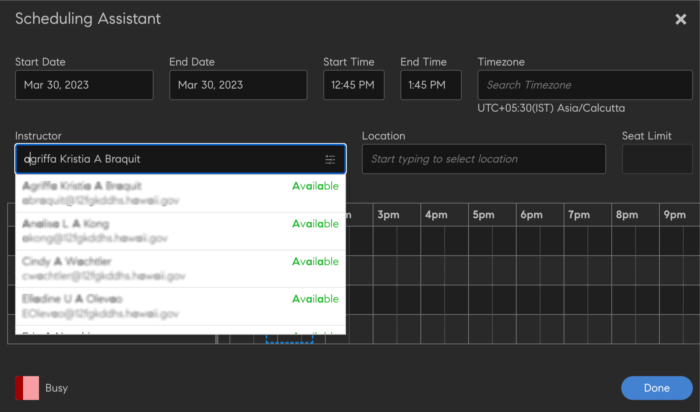

# Criar, modificar e publicar cursos

Para saber como criar cursos, certificações e programas de aprendizado no Learning Manager, leia este artigo.

Os autores podem criar objetos de aprendizado, como cursos, certificações e planos de aprendizado. Os alunos podem consumir esses objetos de aprendizado, enquanto os administradores podem acompanhar o progresso dos alunos.

## Cursos no Learning Manager {#coursesincaptivateprime}

O Adobe Learning Manager permite que os autores criem cursos usando um ou mais módulos relacionados a treinamento virtual, treinamento em ritmo individualizado, treinamento em sala de aula e atividades. Os administradores podem usar esses cursos para criar instâncias do curso, inscrever alunos, atribuir medalhas e ativar feedback para esses cursos. Eles também podem criar programas de aprendizado, planos de aprendizado e certificações usando esses cursos.

Os autores podem usar o conteúdo de e-learning criado com qualquer ferramenta de e-Learning. Outros formatos suportados pelo curso incluem arquivos de vídeo, PDF, doc, docx, PPT e PPTX.

## Criar um curso - Fluxo de trabalho básico {#createacoursebasicworkflow}

Para criar um curso, siga as etapas abaixo:

1. Faça logon no Adobe Learning Manager como autor porque somente os autores têm os direitos para criar cursos. Agora, na página Introdução, clique em **[!UICONTROL Criar cursos]**.
1. Na guia **Visão geral do curso** insira o nome do curso. Agora, insira uma breve descrição para este curso, que é exibida no cartão do curso. A descrição não deve ter mais de 140 caracteres. Em seguida, insira a visão geral detalhada do curso, que é exibida na página Detalhes do curso. A descrição não deve exceder 1.500 caracteres.

   Como autor, você pode ver a descrição dos módulos ao adicionar o módulo a um curso.

1. Para disponibilizar seu curso em outros idiomas, clique em Adicionar novo idioma no canto superior esquerdo da página. Selecione o idioma ou idiomas nos quais deseja disponibilizar o curso. Clique em **[!UICONTROL Salvar]**. Para obter mais informações, consulte [Adicionar conteúdo para diferentes idiomas](/help/migrated/authors/feature-summary/content-library.md).
1. **Modificar configurações do curso**-

   1. Na página Configurações do curso, escolha uma habilidade para o curso. Na lista suspensa Habilidade, escolha a habilidade necessária. Em seguida, na lista suspensa Nível, escolha o nível necessário.
   1. Escolha as habilidades do curso, o nível e defina os créditos para a habilidade. Adicione mais habilidades, se necessário.
   1. Na guia **Tipo de inscrição** selecione o tipo de inscrição.

   Estes são os tipos de inscrições:

   * **Gerente indicado:** Somente os gerentes podem indicar esses cursos. Um aluno não pode se inscrever nesses tipos de cursos.
   * **Gerente aprovado:** Os gerentes aprovam esses cursos. Os alunos podem se inscrever nesses cursos, mas não são inscritos diretamente nesses tipos de cursos sem a aprovação do gerente. Uma solicitação de notificação será enviada para os gerentes quando os alunos se inscreverem nesses tipos de cursos. Após a aprovação do gerente, esses cursos são listados como inscritos para os alunos.
   * **Autoinscrição:** Os alunos podem se inscrever diretamente nesses tipos de cursos.

1. Para salvar as alterações, clique em **[!UICONTROL Salvar]**. Para publicar o curso, clique em **[!UICONTROL Publicar]**.

## Criar um curso - Fluxo de trabalho avançado {#createacourseadvancedworkflow}

1. Faça logon no Adobe Learning Manager como autor porque somente os autores têm os direitos para criar cursos. Agora, na página Introdução, clique em **[!UICONTROL Criar cursos]**.
1. Na guia **Visão geral do curso** insira o nome do curso. Agora, insira uma breve descrição para este curso, que é exibida no cartão do curso. A descrição não deve ter mais de 140 caracteres. Em seguida, insira a visão geral detalhada do curso, que é exibida na página Detalhes do curso. A descrição não deve exceder 1.500 caracteres.
1. Para disponibilizar seu curso em outros idiomas, clique em Adicionar novo idioma no canto superior esquerdo da página. Selecione o idioma ou idiomas nos quais deseja disponibilizar o curso. Clique em **[!UICONTROL Salvar]**. Para obter mais informações, consulte [Adicionar conteúdo para diferentes idiomas](/help/migrated/authors/feature-summary/content-library.md).
1. **Modificar configurações do curso**-

   1. Na página Configurações do curso, escolha uma habilidade para o curso. Na lista suspensa Habilidade, escolha a habilidade necessária. Em seguida, na lista suspensa Nível, escolha o nível necessário.
   1. Escolha as habilidades do curso, o nível e defina os créditos para a habilidade. Adicione mais habilidades, se necessário.
   1. Na guia **Tipo de inscrição** selecione o tipo de inscrição.

   Estes são os tipos de inscrições:

   * **Gerente indicado:** Somente os gerentes podem indicar esses cursos. Um aluno não pode se inscrever nesses tipos de cursos.
   * **Gerente aprovado:** Os gerentes aprovam esses cursos. Os alunos podem se inscrever nesses cursos, mas não são inscritos diretamente nesses tipos de cursos sem a aprovação do gerente. Uma solicitação de notificação será enviada para os gerentes quando os alunos se inscreverem nesses tipos de cursos. Após a aprovação do gerente, esses cursos são listados como inscritos para os alunos.
   * **Autoinscrição:** Os alunos podem se inscrever diretamente nesses tipos de cursos.

1. Escolha se deseja definir um preço para o curso ou torná-lo gratuito. Se quiser tornar o curso pago, escolha a opção **[!UICONTROL Pago]** e especifique um preço. O preço então aparece no cartão do curso e na página de visão geral do curso de um aluno.

   OBSERVAÇÃO: isso é ativado somente quando o conector do Adobe Commerce está configurado.

1. Se quiser fornecer a capacidade de os alunos cancelarem suas inscrições no curso, ative a caixa de seleção **Os alunos podem cancelar suas inscrições**.
1. **Configuração da Instância**

   Se você ativar essa opção, os alunos que estão no estado Em andamento poderão visitar outras instâncias e se inscrever lá. Um aluno pode manter o progresso da instância anterior.

   Depois de publicar o curso, se você voltar à página Configurações, a opção não pode mais ser editada.

   Você pode ativar a opção para os seguintes tipos de curso:

   * Espaçamento automático
   * Sala de aula
   * Atividade
   * Mesclado

   Observação: Ao duplicar um curso, se você tiver ativado a opção Configuração de instância no curso de origem, a opção permanecerá desativada no curso de destino.

   **Não há suporte para a Opção de Instância para**:

   * Cursos pagos
   * Cursos do tipo inscrição indicados pelo gerente.

   A configuração de troca de instância não será propagada para contas entre parceiros se compartilhada pelo catálogo. A opção permanece desativada no curso de destino.

1. **Várias inscrições**

   Usando isso, você pode inscrever alunos em mais de uma instância do curso em um ou diferentes períodos.

   Ativar a alternância **Inscrição múltipla** para alternar entre várias inscrições no curso de um aluno. Se você habilitou a Opção de Instância, não poderá usar a Inscrição Múltipla.

1. Selecione os cursos de pré-requisito que devem ser concluídos antes de iniciar o curso. Clique no campo Cursos e escolha uma opção na lista de cursos.
1. Ative o **Habilitar** **Pré-requisitos** se quiser que os cursos de pré-requisito se tornem obrigatórios.
1. Adicione palavras-chave como tags relacionadas ao seu curso. Essas tags ajudam os alunos a localizar o curso facilmente durante a pesquisa. Todas essas tags são adicionadas automaticamente com base nos módulos que adicionamos. Se você tiver outras tags que deseja adicionar a este curso, insira-as.
1. Adicione palavras-chave como tags relacionadas ao seu curso. Essas tags ajudam os alunos a localizar o curso facilmente durante a pesquisa. Todas essas tags são adicionadas automaticamente com base nos módulos que adicionamos. Se você tiver outras tags que deseja adicionar a este curso, insira-as.
1. No campo Desativação automática, selecione uma data em que o curso será desativado. O administrador deve ativar a opção Desativação automática primeiro.
1. Para salvar as alterações, clique em **[!UICONTROL Salvar]**. Para publicar o curso, clique em **[!UICONTROL Publicar]**.

## Pontos de gamificação

Você pode alocar pontos de gamificação nos níveis do curso e da instância do curso. Com isso, você pode conceder pontos a diferentes cursos ou instâncias. Os alunos são incentivados a fazer cursos específicos ou preferem uma instância específica do curso em vez de outras.

1. No nível da instância do curso, selecione **[!UICONTROL Pontos de gamificação]**.


*Definir pontos para gamificação*

1. Selecionar **[!UICONTROL Editar]**.
1. Se você selecionar Usar configurações do nível do curso, as seguintes opções serão exibidas:

   * **[!UICONTROL Na conclusão]**: selecione essa alternância se deseja que o aluno obtenha 100 pontos quando concluir um curso.
   * **Mais regras**

      * **[!UICONTROL Conclusão antecipada]**: Se você selecionar isso, os primeiros 30 alunos receberão 100 pontos ao concluir um curso.
      * **[!UICONTROL Conclusão oportuna]**: Se você selecionar isso, os alunos receberão 100 pontos se concluírem um curso dentro de 999 dias.

1. Se você selecionar **[!UICONTROL Usar configurações personalizadas]**, as seguintes opções são exibidas:

   * **[!UICONTROL Na conclusão]**: selecione essa alternância se deseja que o aluno obtenha 100 pontos quando concluir um curso.
   * **Mais regras**

      * **[!UICONTROL Conclusão antecipada]**: se você selecionar essa opção, poderá determinar quantos alunos receberão os pontos especificados.
      * **[!UICONTROL Conclusão oportuna]**: se você selecionar essa opção, poderá determinar o número de pontos que os alunos serão premiados se concluírem um curso em um período especificado.

   

   *Definir a conclusão antecipada e pontual*

1. Selecionar **[!UICONTROL Salvar]**.

## Agregar recursos de aprendizado

Um autor pode decidir se deseja agregar os recursos de aprendizado no nível do Plano de aprendizado ou deixá-los permanecer em um nível de curso individual.

Como autor, selecione **[!UICONTROL Caminho de Aprendizado]** > **[!UICONTROL Configurações]**. Clique em **[!UICONTROL Editar]**.

No menu **[!UICONTROL Recursos]** , a caixa de seleção, Mostrar recursos constituintes do curso agregados no nível do Caminho de Aprendizado, quando ativada exibe se os recursos presentes no nível do curso seriam exibidos no nível do Caminho de Aprendizado.

>[!NOTE]
>
>Na página Configurações de um caminho de aprendizado, um administrador também pode ativar essa opção, que exibe os recursos presentes no nível do curso que seriam exibidos no nível do caminho de aprendizado.

## Assistente de Agendamento

Gerenciar conflitos na reserva de instrutores e salas de aula. Se quiser saber em que hora e data qualquer professor está disponível antes de atribuí-lo ao curso, use o Assistente de programação.

Ao criar um curso, para um curso de VC ou CR, clique em Assistente de agendamento.


*Iniciar assistente de agendamento*

A janela Assistente de programação é aberta.


*A janela do Assistente de Agendamento*

No Assistente de Agendamento, você pode:

* Pesquise professores por seus nomes.
* Pesquisar instrutores por suas habilidades.

### Pesquisar professores por seus nomes

No campo Professor, digite o nome do professor ou procure um nome parcial de professor. Uma lista de professores é exibida, na qual você pode escolher um professor.



*Pesquisar professores*

Vários professores podem ser selecionados, mas apenas um professor pode ser atribuído por vez. A hora selecionada será destacada na janela de conflito de tempo. Próximo ao professor, um ícone de cruz é exibido e você pode clicar para remover o professor.


*Pesquisar vários professores*

### Pesquisar instrutores por habilidades

Pesquise um professor com uma ou várias habilidades. A pesquisa usa o operador AND.

As habilidades podem ser pesquisadas apenas pelo nome parcial ou completo da habilidade, não pelo nível da habilidade.

No Assistente, insira o nome do professor, o local e o limite de vagas.

Além disso, você pode pesquisar habilidades, que seriam exibidas depois de clicar no ícone de filtro presente no lado direito da caixa de pesquisa do professor. A imagem abaixo mostra o botão.


*Pesquisar professores por habilidades*

### Filtro de grupo de usuários

Selecione o filtro no campo Professor. Existe um **[!UICONTROL Grupo de usuários]** filtrar um autor ou autor personalizado pode encontrar o professor certo usando os valores no grupo de usuários.

Se ambos os filtros forem aplicados, uma lista de professores será exibida com os que pertencem ao grupo de usuários e as habilidades selecionadas.

Isso se aplica ao Assistente de agendamento na página Cursos ou instâncias.


*Filtrar por grupos de usuários*

### Página Instância

Você também pode acessar o Assistente de Programação na página Instância, conforme mostrado abaixo.

O Assistente de agendamento também está disponível na página Instância para administradores e administrador/autor personalizado.


*Página Programar instrutores a partir de Instâncias*

### Procurar um local

Você pode pesquisar um local especificando o nome da sala de aula e o nome da região do local no módulo e nas páginas do Assistente de programação.

## Formatação Rich Text

Ao criar um curso, programa de aprendizado, certificação ou ajuda de tarefa, os autores podem inserir diferentes tipos de conteúdo, como texto, imagem ou aplicar várias opções de formatação de texto.

Ao criar um curso, você pode ver o Editor de Rich Text no campo Visão geral do curso. Você pode formatar o conteúdo, adicionar imagens, adicionar hiperlinks etc.


*Iniciar o Editor de Rich Text*

Da mesma forma, você pode usar o Editor de Rich Text para modificar a descrição ao criar um:

**Programa de aprendizado**


*Usar o Editor de Rich Text para um programa de aprendizado*

**Certificação**


*Usar o Editor de Rich Text para uma certificação*

**Ajuda de tarefa**


*Usar o Editor de Rich Text para uma ajuda de tarefa*

Além disso, você pode usar o Editor de Rich Text para outros idiomas.

## Suporte a descrição de rich text para interface de usuário sem periféricos

### Por que a CSS é necessária?

O rich text é composto de marcação HTML. A renderização da marcação como está resultaria no estilo padrão aplicado pelo navegador. Isso geralmente não dá certo com as diretrizes de estilo da empresa. Uma CSS é necessária para atender às diretrizes.

### Estilo padrão

A folha de estilos de CSS anexada contém o estilo aplicado pelo Learning Manager. O estilo é ajustado considerando a maioria dos casos de uso. Baixe o arquivo CSS anexado e importe-o para o seu aplicativo da Web de acordo com as suas convenções e sistema de compilação. As classes CSS definidas contêm espaços para nome na classe ql-editor e não interferem nos estilos existentes.

### Personalizar estilos

O estilo padrão pode não atender às necessidades de todos. As personalizações podem ser feitas ao substituir a CSS fornecida. Todo o estilo é delimitado sob o ql-editor como seletores descendentes. São usadas as seguintes classes:

* Recuo: **li.ql-indents-$number**. $number varia de 1 a 9
* tamanho: **ql-size-small**, **ql-size-large**, **ql-size-huge**

* alinhamento: **ql-align-center**, **ql-align-reason**, **ql-align-right**

* cor: **ql-color-$color**. $color = branco, vermelho, laranja, amarelo, verde, azul, roxo
* fundo: **ql-bg-$color**. $color = preto, vermelho, laranja, amarelo, verde, azul, roxo
* tags html: p, ol, ul, pre, blockquote, h1, h2, h3, h4, h5, h6

[Arquivo CSS a ser usado para personalização.](assets/ql-headless.css)

### ALTERAÇÕES DA API PARA ATIVAR A RENDERIZAÇÃO DE VISÕES GERAIS DO RICH TEXT

Quando os clientes criam uma interface sem periféricos, eles precisam exibir os objetos de aprendizado na interface de usuário personalizada que estão desenvolvendo. Para fazer isso, geralmente se usa o [GET /learningObjects](https://learningmanagereu.adobe.com/docs/primeapi/v2/#!/learning_object/get_learningObjects) API exposta. Agora que o Learning Manager oferece suporte à captura de “rich text” para o campo de visão geral, o modelo de dados dos objetos de aprendizado nas respostas da API também expõe o mesmo. Consulte o campo chamado “richTextOverview” no fragmento do modelo na resposta da API abaixo. Observe também que o campo exposto anteriormente (”visão geral”) permanece inalterado para compatibilidade com versões anteriores.

```
{ 
 "data": [ 
 { 
 "id": "string", 
 "type": "string", 
 "attributes": { 
 … 
 "localizedMetadata": [ 
 { 
 "description": "string", 
 "locale": "string", 
 "name": "string", 
 "overview": "string", 
 "richTextOverview": "string" 
 } 
 ], 
 … 
 }, 
 "relationships": { 
 … 
 } 
 } 
 } 
 ] 
} 
```

Os clientes que já estão usando o campo de visão geral não são afetados em sua interface sem periféricos e verão apenas texto sem formatação como antes. Se os clientes quiserem aproveitar a visão geral do rich text, eles precisarão criar visões gerais formatadas para seus objetos de aprendizado na interface do autor e, depois disso, o Learning Manager também começará a retornar a visão geral do rich text, além do texto sem formatação (como antes) no modelo de resposta da API.

No entanto, para renderizar esse rich text na interface do usuário, o cliente precisará incluir um CSS. Isso é explicado detalhadamente nas seções a seguir.

## Permitir várias tentativas {#allowmultipleattempts}

Depois que o administrador tiver ativado várias tentativas, como autor, você pode configurar várias tentativas para um módulo de e-learning interativo em um nível de curso ou módulo.


*Configurar várias tentativas para um módulo de e-learning interativo*

<table>
 <tbody>
  <tr>
   <td>
    <p><b>Opção</b></p></td>
   <td>
    <p><b>Descrição</b></p></td>
  </tr>
  <tr>
   <td>
    <p>Definir tentativas em</p></td>
   <td>
    <p>Você pode definir o número de tentativas para um módulo como infinito ou fornecer um limite definido.<span style="font-size: 0.8125rem;">As informações da tentativa serão exibidas ao aluno assim que estiverem ativadas. O aluno pode optar por tentar novamente o módulo clicando no botão “Tentar novamente”.</span></p></td>
  </tr>
  <tr>
   <td>
    <p>Interromper nova tentativa depois que o módulo for concluído ou aprovado</p></td>
   <td>
    <p>Para configurar quando impedir que os alunos selecionem a opção de nova tentativa, ative a caixa de seleção “Interromper nova tentativa depois que o módulo for concluído ou aprovado”. A opção “Repetir” será removida da exibição do aluno assim que ele concluir o módulo com êxito.</p></td>
  </tr>
  <tr>
   <td>
    <p>Bloquear módulo entre tentativas 0:0:1 Formato: Dias/Horas/Minutos</p></td>
   <td>
    <p>Você pode bloquear os módulos por um tempo específico entre as tentativas, marcando a caixa de seleção "<b>Bloquear módulo entre tentativas 0:0:1 Formato: Dias/Horas/Minutos</b>“. Quando um módulo está bloqueado, o aluno não pode visitar o módulo até que o tempo de bloqueio fornecido expire. </p>
    <p>Você pode definir os critérios finais de uma tentativa selecionando o '<b>Reprodutor fechar</b>' ou '<b>Conclusão</b>' caixas de seleção.</p></td>
  </tr>
  <tr>
   <td>
    <p>Fechamento do reprodutor</p></td>
   <td>
    <p>Cada inicialização do módulo é tratada como uma nova tentativa se os critérios forem selecionados como '<b>Fechamento do reprodutor</b>'. Um aluno é solicitado com detalhes de bloqueio do módulo e detalhes da tentativa de fechar o reprodutor.</p></td>
  </tr>
  <tr>
   <td>
    <p>Conclusão</p></td>
   <td>
    <p>Se o fim de uma tentativa for baseado em <b>Conclusão</b>depois, será calculado com base nos critérios de sucesso do conteúdo. Os alunos não têm permissão para tentar novamente o módulo até que o conteúdo envie as informações de conclusão. O bloqueio do módulo e os detalhes da tentativa são comunicados ao aluno assim que uma tentativa é encerrada.</p></td>
  </tr>
  <tr>
   <td>
    <p>Definir limite de tempo para concluir o módulo</p></td>
   <td>
    <p>Os autores podem definir um limite de tempo para concluir um módulo marcando a caixa de seleção "<b>Definir limite de tempo para concluir o módulo</b>“.</p>
    <p>Cada inicialização do reprodutor é considerada uma nova tentativa e o aluno é solicitado com os detalhes de tempo durante a inicialização.</p>
    <p><b>Observação:</b><span style="font-size: 0.8125rem;">A tentativa será encerrada automaticamente assim que o tempo decorrer. Fechar o reprodutor também irá encerrar a tentativa atual.</span></p></td>
  </tr>
  <tr>
   <td>
    <p>Várias tentativas no nível do módulo</p></td>
   <td>
    <p>Selecionar uma tentativa em 'Nível do módulo' na lista suspensa 'Definir tentativa em' permite configurar as opções no nível do módulo individual.</p></td>
  </tr>
 </tbody>
</table>

## Módulos do curso {#coursemodules}

### Adicionar módulos {#addmodules}

Agora você pode adicionar módulos de Conteúdo, Pré-trabalho e Teste. **Conteúdo** módulos são os principais módulos que compõem o curso. **Pré-trabalho** os módulos incluem algumas informações básicas, que podem ajudar os alunos a se preparar para o curso. Esses módulos não são obrigatórios para que os alunos concluam. **Teste** os módulos ajudam os alunos a ignorar o conteúdo e fazer o teste se já estiverem cientes do conteúdo e quiserem fazer o teste para atender aos requisitos de conformidade.

Para adicionar um módulo de conteúdo, execute as etapas abaixo:

1. Clique em **[!UICONTROL Adicionar Módulos]**. Você pode ver quatro opções para adicionar módulos. A primeira opção é adicionar módulos de ritmo individualizado. Esses são os módulos que você cria e adiciona à biblioteca do módulo no Adobe Learning Manager. Essa segunda opção é configurar a Sala de aula virtual. O terceiro é configurar um Módulo de sala de aula, e o quarto é o Módulo de atividade.

   

   *Adicionar um módulo a um curso*

   **Módulo de ritmo individualizado:** Nesse modo, você pode iniciar e concluir um módulo de curso no seu próprio ritmo. Você pode definir sua própria programação.

   Depois de clicar na opção, você pode ver a lista de módulos de ritmo individualizado que já foram adicionados à biblioteca do módulo. Aqui você pode percorrer a lista e selecionar os que deseja adicionar ou pode procurar os módulos digitando o nome do módulo no campo de pesquisa ou as tags do módulo.

   Depois de selecionar os módulos, clique em **[!UICONTROL Adicionar]**. Esses módulos agora aparecem na seção Conteúdo.

   Também é possível reorganizar os módulos. Arraste qualquer módulo, mova-o para cima ou para baixo e organize os módulos em uma sequência adequada.

   **Módulo de sala de aula virtual:** Nesse modo, os alunos podem participar de palestras on-line ao vivo, facilitadas por um professor treinado. Insira o título, a descrição e defina a duração da sessão. Você também pode especificar o URL da conferência e os professores para conduzir a sessão. Para salvar as alterações, clique em **[!UICONTROL Concluído]**.

   

   *Adicionar um módulo VC*

   Ao criar um curso usando a caixa de diálogo de configuração de sala de aula virtual, defina o **Sistema de Conferência** à conexão de equipes que você criou. Selecione se deseja um organizador de reunião para o evento.

   Se você selecionar **Sim** para um organizador de reunião, você deve inserir o nome do organizador. Digite o nome e selecione o organizador.

   **Ignorando Lobby**

   * Se você selecionar **Sim**, qualquer aluno pode participar da reunião.
   * Se você selecionar **Não**, uma solicitação é enviada ao organizador para permitir ou impedir que o aluno participe da reunião.

   **Observação:** Um aluno deve estar disponível em Microsoft Teams. No entanto, o aluno pode participar do Learning Manager como convidado.

   **Módulo de sala de aula:** Nesse modo, os alunos participam de palestras presenciais, facilitadas por um professor treinado. Insira o título, a descrição e defina a duração da sessão. Você também pode especificar o local da classe e os professores para conduzir a sessão. Para salvar as alterações, clique em **[!UICONTROL Concluído]**.

   

   *Adicionar um módulo de sala de aula*

   Ao criar um curso, na caixa de diálogo de configuração de sala de aula virtual, defina o sistema de conferência para a conexão Microsoft Teams que você criou. Selecione se deseja um organizador de reunião para o evento.

   Se você selecionar Sim para um organizador de reunião, você deve inserir o nome do organizador. Digite o nome do organizador e selecione o organizador.

   **Ignorando Lobby**

   * Se você selecionar Sim, qualquer aluno pode participar da reunião.
   * Se você selecionar Não, uma solicitação é enviada ao organizador para permitir ou impedir que o aluno participe da reunião.

   **Observação:** Se um aluno quiser participar de Microsoft Teams como convidado, ele deve inserir o e-mail. O e-mail deve estar presente no Learning Manager.

   **Módulo de atividade:** Nesse modo, os alunos devem concluir um conjunto de atividades, como workshops, exercícios, questionário e outras atividades de aprendizado. Insira o título, a descrição e o URL externo para referência. Para salvar as alterações, clique em **[!UICONTROL Concluído]**.

   

   *Adicionar um módulo de atividade*

   Você pode especificar a duração ao adicionar um módulo de atividade em um curso para o tipo de atividade Envio de arquivo e módulos baseados em xAPI.

1. Da mesma forma, adicione módulos para os modos Pré-trabalho e Teste.
1. Escolha o tipo de sequenciamento para os módulos como Ordenado ou Não ordenado de acordo com a sua preferência.

   Se você escolher **Ordenado**, os módulos serão exibidos na mesma sequência em que foram criados. Se você escolher **Não ordenado**, os módulos não são sequenciados. Os alunos podem concluir os módulos em qualquer ordem.

1. Na lista suspensa Módulos obrigatórios, escolha o número de módulos que o aluno deve fazer para concluir o curso.
1. Adicione uma imagem de capa e a imagem do banner do curso. Os catálogos são criados pelo administrador. Para obter mais informações, consulte [Catálogos](/help/migrated/administrators/feature-summary/catalogs.md).

   **Observação:** As dimensões recomendadas são:

   * **Imagem da capa:** 300 px x 300 px
   * **Imagem do banner:** 1600 px x 140 px

1. No canto superior direito da página, clique em **[!UICONTROL Salvar]**.

## Lista de verificação {#create-checklist}

A avaliação é um aspecto importante de qualquer LMS. Avaliações on-line são uma das principais maneiras de avaliar a compreensão de um aluno de um tópico. Mas muitas vezes, é necessário avaliar a compreensão de uma pessoa enquanto ela está no trabalho, observando-a realizar as tarefas necessárias.

Considere funcionários de lojas ou funcionários de armazéns em avaliação para as tarefas que devem realizar no dia a dia. Podem ser os passos realizados para reparar uma máquina de café ou os passos envolvidos na embalagem de um material. Os professores podem avaliar funcionários para tais tarefas com base em uma lista de verificação e avaliá-los como Aprovado ou Reprovado na atividade de avaliação.

### Criar uma lista de verificação {#createachecklist}

Somente um autor pode criar uma lista de verificação. Uma lista de verificação é um tipo de módulo Atividade. Ao configurar um módulo de Atividade, você, um Autor, pode selecionar uma Atividade como **Lista de verificação**, conforme mostrado abaixo:


*Criar uma lista de verificação*

Depois de escolher a opção **Lista de verificação**, você verá algumas opções adicionais.

**Tipo de lista de verificação:** Escolha qualquer opção, **Sim/Não** ou **1 a 5**. Se você escolher Sim/Não, a lista de verificação conterá perguntas que só poderão ser respondidas com Sim ou Não. Se você escolher 1-5, verá uma lista de verificação Likert, na qual poderá atribuir uma nota a uma escala de cinco pontos.

**Critérios de aprovação:**

<table>
 <tbody>
  <tr>
   <td>
    <p>Se você escolheu <b>Sim/Não</b>, então...</p></td>
   <td>
    <p>Se você escolheu <b>1 a 5</b>, então...</p></td>
  </tr>
  <tr>
   <td>
    <p>Defina os critérios de aprovação como o número de respostas como Sim. Por exemplo, se você inserir 3, o aluno passará no curso, se receber pelo menos três <b>Sim </b>respostas, quando avaliadas por um professor.</p></td>
   <td>
    <p>Defina os critérios de aprovação como um limite entre 1 e 5. Por exemplo, se você inserir 2 e 4, o aluno passará no curso, se atingir pelo menos <b>dois </b>avaliações com pontuação maior ou igual a <b>quatro</b>.</p></td>
  </tr>
 </tbody>
</table>

Escolha um ou mais professores que avaliarão o aluno.

Além disso, se você tiver algo para comentar ou uma nota, poderá adicioná-la na **Nota ao professor** campo de texto.

Agora, adicione as perguntas da lista de verificação. Clique em **[!UICONTROL Adicionar]**. Você só pode adicionar até 150 perguntas.


*Adicionar perguntas da lista de verificação*

Para adicionar mais perguntas, clique em **[!UICONTROL Adicionar mais]**.

Salve as alterações, adicione o módulo e publique o curso.

### Adicionar habilidades {#addskills}

Nesta página, insira os seguintes detalhes:

1. Escolha as habilidades do curso, o nível e defina os créditos para a habilidade. Adicione mais habilidades, se necessário.

   

   *Adicionar habilidades a um curso*

1. Escolha o tipo de inscrição. Estas são as opções:

   * **Gerente indicado:** Somente os gerentes podem indicar esses cursos. Um aluno não pode se inscrever nesses tipos de cursos.
   * **Gerente aprovado:** Os gerentes aprovam esses cursos. Os alunos podem se inscrever nesses cursos, mas não são inscritos diretamente nesses tipos de cursos sem a aprovação do gerente. Uma solicitação de notificação será enviada para os gerentes quando os alunos se inscreverem nesses tipos de cursos. Após a aprovação do gerente, esses cursos são listados como inscritos para os alunos.
   * **Autoinscrição:** Os alunos podem se inscrever diretamente nesses tipos de cursos.

1. Se quiser fornecer a capacidade de os alunos cancelarem suas inscrições no curso, ative a caixa de seleção **Os alunos podem cancelar suas inscrições**.
1. Selecione os cursos de pré-requisito que devem ser concluídos antes de iniciar o curso. Clique no campo Cursos e escolha uma opção na lista de cursos.

   

   *Adicionar cursos de pré-requisito*

1. Ative o **Pré-requisitos** se quiser que os cursos de pré-requisito se tornem obrigatórios.
1. Adicione palavras-chave como tags relacionadas ao seu curso. Essas tags ajudam os alunos a localizar o curso facilmente durante a pesquisa. Todas essas tags são adicionadas automaticamente com base nos módulos que adicionamos. Se você tiver outras tags que deseja adicionar a este curso, insira-as.
1. Adicione os perfis do público-alvo deste curso clicando na área de texto e escolhendo os perfis nas sugestões.
1. Adicione arquivos de recursos ao seu curso como material extra. Arraste seus materiais, como arquivos de texto, vídeo ou áudio.
1. Agora este curso estará disponível para esses alunos com esses perfis como um curso recomendado. Você também pode anexar recursos adicionais para seus alunos nesta seção. Os alunos poderão baixar esses arquivos para referência posterior. Quando terminar de fazer todas essas alterações, clique em **[!UICONTROL Salvar]** no canto superior direito. Isso salvará o curso como rascunho. Seu curso é salvo como rascunho, por padrão.

## Atribuir professores para módulos {#assigninstructorsformodules}

1. Depois de criar módulos para o curso, você pode atribuir professores aos módulos. No painel Autor, clique em **[!UICONTROL Catálogo de cursos]**.
1. Clique no curso cujo módulo você deseja atribuir aos professores.
1. Na guia **Adicionar Módulos** clique no módulo ao qual deseja atribuir um professor.
1. No menu **Professor** especifique o nome do usuário ao qual você deseja atribuir a função de professor.

   

   *Atribuir uma função de professor a um usuário*

1. Para republicar o curso com as atualizações, clique em **[!UICONTROL Republicar]**.

## Lista de verificação de observação

Um módulo Lista de verificação agora pode ser revisado por gerentes, além de professores. Os gerentes de pessoas, bem como os gerentes não hierárquicos, como gerentes de loja ou gerentes de local, podem revisar e concluir a lista de verificação.

Os autores do curso podem adicionar gerentes de pessoas, bem como gerentes não hierárquicos (se aplicável) como revisores selecionando essas opções de função na seção “Revisores” ao configurar um módulo Lista de verificação. Isso pode ser feito em um nível de instância do curso.


*Adicionar revisores em um módulo de atividade*

Selecionando o &quot;**[!UICONTROL +Gerentes]**&quot; permitirá automaticamente que o gerente de um aluno na hierarquia da organização revise a lista de verificação. Você não precisa pesquisar e adicionar nomes de gerentes individualmente.

Se o administrador da conta tiver configurado funções de gerente não hierárquicas (como gerentes de local ou gerentes de site) usando a opção Campos Ativos, essas funções de gerente estarão disponíveis para você selecionar e permitir que elas revisem a lista de verificação.

Você não precisa pesquisar e adicionar nomes de gerentes individualmente. Quando os alunos se inscrevem no curso da lista de verificação, ele enviará automaticamente uma notificação aos gerentes/gerentes de loja para revisão junto com qualquer professor selecionado. Esse fluxo de trabalho facilita para os autores não mencionarem os nomes de gerentes individuais.

Na captura de tela de exemplo fornecida acima, selecione o &quot;**[!UICONTROL +Gerenciadores de armazenamento]**&quot; permitirá automaticamente que o gerente não hierárquico alinhado ao aluno revise a lista de verificação. Observe que “store” aqui será substituído pelo campo ativo definido pelo administrador.

As atualizações no módulo de lista de verificação também incluem notificações para professores e gerentes quando um aluno está inscrito em um curso que tem um módulo de lista de verificação. O revisor recebe uma notificação no centro de notificações do Learning Manager e no painel do professor/gerente informando que a ação da lista de verificação está vencida.

<!---->

O revisor poderá exibir informações sobre todos os itens de revisão de listas de verificação pendentes no menu Listas de verificação, bem como no menu Notificações quando fizer logon como professor/gerente.


*Aprovações para certificação*

Depois de clicar em Revisar lista de verificação, o revisor pode concluir a avaliação.


*Revisar itens de revisão de listas de verificação pendentes*

Os relatórios podem ser baixados em listas de verificação, que incluem informações detalhadas sobre a avaliação do aluno, o nome do revisor, a função e o e-mail.

O relatório de lista de verificação csv tem os campos novos e atualizados:

* Nome do revisor em vez do nome do professor
* E-mail do revisor em vez de E-mail do professor
* Função do revisor: os valores possíveis são Gerente, Gerente de armazenamento/local, Professor

## Visualizar um curso {#previewacourse}

Depois que o curso é criado e salvo como rascunho, você pode visualizar o curso como aluno e publicá-lo para disponibilizá-lo no catálogo do curso.

Para visualizar o curso, clique em **[!UICONTROL Visualizar como aluno]**.


*Visualizar um curso como aluno*

Isso abre o curso **Visão geral** página para você, onde você pode ver os módulos, a ordem e outros detalhes relacionados ao curso.


*Exibir módulos e outros detalhes relacionados*

Para ver como os alunos podem experimentar este curso, clique em cada um destes módulos para começar a reproduzi-lo. Isso começa a reproduzir o curso no Fluidic Player.

## Publicar um curso {#publishacourse}

Depois de visualizar o curso como um aluno, você pode publicá-lo para que fique disponível para os alunos consumirem. Observe que o curso ainda está no modo de rascunho.

Um ciclo de vida típico do curso tem a seguinte aparência:

* **Rascunho** - Quando um autor termina de criar um curso e o salva. Nesse estado, o curso ainda não está disponível para os alunos.
* **Publicado** - Quando um autor termina de publicar um curso. Nesse estado, o curso está disponível para os alunos se inscreverem. Você também pode editar um curso nesse estado.
* **Retirado** - Depois de publicar um curso, um autor pode movê-lo para um estado Retirado se o autor não quiser que o curso apareça no catálogo de cursos dos alunos.
* **Excluído** - Um curso no estado Excluído é aquele que foi removido completamente do aplicativo Adobe Learning Manager. Somente os autores podem excluir cursos quando estão nos estados Rascunho ou Retirado.


*Fluxo de trabalho do ciclo de vida de um curso*

Para publicar o curso que você criou, clique em **[!UICONTROL Publicar]** no canto superior direito da página.


*Publicar um curso*

Na mensagem pop-up de confirmação exibida, clique em **[!UICONTROL OK]**.

O curso agora está disponível no catálogo do curso.

## Exibir um curso {#viewacourse}

Como autor, você pode exibir uma lista de todos os cursos disponíveis. Para exibir todos os cursos na conta do Learning Manager, clique em Catálogo de cursos. Para exibir todos os cursos criados por você no Learning Manager, clique em **[!UICONTROL Meus cursos]**.

No cartão do curso, passe o mouse sobre as opções e clique em **[!UICONTROL Exibir curso]**.


*Exibir um curso*

A janela de informações do curso é exibida. O curso está em modo somente leitura. Para modificar o curso, clique em **[!UICONTROL Editar]**.

## Desativar um curso {#retireacourse}

Se você retirar um curso, não poderá inscrever novos alunos no curso. Os alunos que já estão inscritos podem fazer o curso.

Para desativar um curso, no cartão do curso, passe o mouse sobre as opções e clique em Remover curso.


*Desativar um curso*

Na janela pop-up de confirmação exibida, clique em **[!UICONTROL Sim]**.

## Duplicar um curso {#duplicateacourse}

Você pode criar uma cópia do curso e, em seguida, modificá-lo. Se quiser fazer backup do seu curso, você pode duplicar o curso.

## Pesquisar cursos {#searchforcourses}

O Adobe Learning Manager permite encontrar mais facilmente os cursos da sua escolha. Você pode pesquisar seus cursos das seguintes maneiras:

**Campo de pesquisa:** Clique na barra de pesquisa no canto superior direito da **Catálogo de cursos** página. Digite o nome do curso ou qualquer palavra-chave associada aos seus cursos. Você também pode pesquisar usando as tags adicionadas durante a criação do curso. As tags podem ser pesquisadas no campo Cursos de pesquisa, o que significa que as tags são exibidas no campo de pesquisa conforme você digita.


*Pesquisar cursos*

**Filtrar lista de cursos:** Você pode filtrar os cursos por estado, como Todos, Publicado, Rascunho e Retirado. Com base na sua escolha, você pode exibir a lista filtrada de cursos e selecionar os cursos necessários.

Como autor, você também pode classificar os cursos para localizar melhor o curso necessário. Clique em **[!UICONTROL Classificar por]** e escolha ordem alfabética crescente, ordem alfabética decrescente, data de criação do curso, data de atualização do curso e eficácia dos cursos.


*Filtrar lista de cursos*

## Inscrever alunos em um curso {#enrolllearnersinacourse}

Para inscrever alunos nos cursos ou permitir que os gerentes nomeiem alunos para os cursos, você deve alternar para o modo Administrador, pois somente os administradores têm os direitos de inscrever alunos nos cursos.

Para alternar para o modo de administração,

1. Clique na sua foto do perfil e selecione Administrador.
1. No modo de administração, clique em **[!UICONTROL Cursos]** no painel esquerdo. Nesta página, você pode ver todos os cursos criados por todos os autores na sua conta do Learning Manager.
1. Para inscrever os alunos, passe o mouse sobre o cartão do curso e veja a opção **Inscrever alunos**. Clique nessa opção.

   

   *Inscrever alunos em um curso*

1. Na caixa de diálogo Inscrever alunos, no canto superior direito, você pode ver a opção **Instância padrão** está selecionado. Assim que um curso é criado por um autor, uma instância padrão do curso é criada.

   

   *Exibir instância padrão de um curso*

1. Comece a digitar o nome de um aluno no campo Incluir alunos e escolha um aluno. Você também pode adicionar grupos de usuários aqui. Se quiser inscrever todos os alunos na sua conta do Learning Manager, comece a digitar todos. Você também pode inscrever alunos em uma equipe.

   

   *Adicionar alunos a um curso*

1. Se quiser excluir qualquer aluno do curso, insira o nome do aluno no campo **Excluir alunos** campo.
1. Depois de inscrever os alunos, clique em **[!UICONTROL Continuar]**. Na caixa de diálogo Inscrever Alunos, você pode exibir o resumo da inscrição.

   

   *Exibir resumo de inscrição no curso*

1. Para inscrever todos os alunos no curso, clique em **[!UICONTROL Inscrever-se]**. Agora, esses alunos foram inscritos com sucesso neste curso. Os alunos recebem uma notificação para seguir em frente e fazer o curso. Para inscrever mais alunos, repita o procedimento de inscrição.

## Alterações na página Instância do curso para módulos do Connect VC {#connect-vc}

Ao recuperar um curso do Connect, você pode criar dois tipos de salas:

* Dinâmico
* Persistente

Um URL persistente sempre é corrigido. Mas, para usuários que não têm o Connect e sua própria sala de reunião, eles devem usar uma sala de reunião dinâmica no tempo de execução. As pessoas podem, então, ingressar em sua reunião.


*Opções de sala de reunião dinâmica*

Agora você pode alterar o url da sala persistente no **Instância do curso** página.

<!--|  |  |
|---|---|-->

## Cancelar a inscrição dos alunos em um curso {#unenrolllearnersfromacourse}

Ao criar um curso, um autor pode ativar a opção **Os alunos podem cancelar suas inscrições**, para que os alunos que estão fazendo o curso possam cancelar a inscrição no curso.

Um administrador também pode cancelar a inscrição dos alunos no curso.


*Cancelar a inscrição dos alunos em um curso*

Para obter mais informações, consulte [Cancelando a inscrição dos alunos](/help/migrated/administrators/feature-summary/courses.md).

## Adicionar módulos de curso para Captivate e Presenter {#addcoursemodulesforcaptivateandpresenter}

Você também pode publicar módulos de curso no Learning Manager a partir do software Adobe Captivate e Adobe Presenter usando o menu Publicar.

1. No Captivate, clique em **[!UICONTROL Publicar]** > **[!UICONTROL Publicar no Learning Manager]**.
1. Forneça o nome de subdomínio ou a ID de e-mail e clique em **[!UICONTROL Enviar]**. Se você tiver várias contas, será solicitado que você escolha a conta.
1. Faça logon com credenciais de Adobe. Se você não tiver uma ID de Adobe, clique em **[!UICONTROL Criar conta]**. Após a autorização, você será direcionado para a página de publicação do módulo.
1. Forneça todas as informações básicas sobre o módulo e clique em Publicar.

Você pode ver o módulo publicado na página de módulos do Learning Manager. Para obter mais informações, consulte [Publicar projeto no Adobe Learning Manager](https://helpx.adobe.com/captivate/classic/publish-project-to-captivate-prime.html).

## Eficácia do curso {#courseeffectiveness}

A pontuação de eficácia do curso ajuda os autores a avaliar os cursos que não estão funcionando de acordo com as necessidades dos alunos e modificá-los adequadamente. A eficácia do curso é avaliada para entender a utilidade de um curso para o aluno. É uma combinação dos resultados do feedback do aluno sobre o conteúdo do curso. O curso testa os resultados de um aluno e o feedback do gerente avaliando um aluno com base no aprendizado do curso.

Entrada **Meus cursos**, um autor pode visualizar a classificação de eficácia do curso nas miniaturas do curso, conforme mostrado na captura de tela abaixo. Você pode ver a classificação deste curso como 100.

<!---->

O valor da classificação de eficácia do curso é obtido considerando os valores de feedback N1, N2 e N3. Para exibir a divisão de cada feedback, clique no valor da eficácia do curso. Um menu pop-up é exibido conforme mostrado abaixo.


*Cálculo da eficácia do curso*

Neste instantâneo de amostra, 1 em 1 usuário recebeu todos os três tipos de feedback, portanto, a pontuação é 100/100. Nesta tabela, você pode entender o feedback ausente para melhorar a eficácia geral. Para ver como a eficácia do curso é calculada, clique na seta para baixo no canto inferior direito do menu pop-up.

<!---->

Conforme o gráfico circular mostrado acima, o gerente atribui mais peso ao feedback N3.

## Programas de aprendizado e certificações {#certificationsandlearningprograms}

O autor e o administrador podem criar certificações e programas de aprendizado para os alunos no aplicativo Autor. Na página inicial, clique em Certificações ou Programas de aprendizado para criar os respectivos objetos de aprendizado.

Para saber como criar e gerenciar certificações e programas de aprendizado, consulte  [Certificações](/help/migrated/administrators/feature-summary/certifications.md) e  [Programas de aprendizado](/help/migrated/administrators/feature-summary/learning-programs.md).

## Cursos obrigatórios para certificação externa {#mandatorycoursesforexternalcertification}

Nas versões anteriores do Learning Manager, para que um certificado fosse concluído, não era obrigatória a conclusão do curso do aluno na certificação externa.

Agora, é possível fazer cursos obrigatórios ativando a opção **Definir cursos necessários como obrigatórios para a conclusão do certificado** na guia Currículo.


*Definir cursos obrigatórios para concluir um certificado*

Quando os cursos são definidos como obrigatórios:

* A página de envio do gerente lista os alunos somente depois que eles concluírem os cursos.
* O aluno só pode carregar um arquivo após concluir o curso.

## Perguntas frequentes {#frequentlyaskedquestions}

+++Como remover “procurar indicação do gerente” para um curso?

Execute as seguintes etapas:

1. Faça logon no Learning Manager como Autor.
1. Abra o curso.
1. No painel esquerdo, clique em **[!UICONTROL Configurações]** > **[!UICONTROL Editar]**.
1. Na guia **Tipo de inscrição** , altere o tipo de inscrição de **Gerente Indicado** até **Gerente Aprovado** ou **Autoinscrição**.

1. Depois de alterar o tipo de inscrição, republique o curso.

+++

+++Como combinar cursos?

Você pode combinar cursos por meio de um programa de aprendizado.

1. Faça logon no Learning Manager como administrador.
1. No painel esquerdo, clique em **[!UICONTROL Programas de aprendizado]**.
1. Para adicionar um programa de aprendizado, clique em **[!UICONTROL Adicionar]**.
1. Insira os detalhes do Programa de aprendizado e, para salvá-lo, clique em **[!UICONTROL Salvar]**.
1. Depois de criar o Programa de aprendizado, clique em **[!UICONTROL Catálogo]**.
1. Em um cartão do curso, clique em **[!UICONTROL Adicionar]**, conforme mostrado abaixo. Repita o processo para quantos cursos quiser adicionar ao Programa de aprendizado.


Depois de adicionar todos os cursos necessários no Programa de aprendizado, clique em **[!UICONTROL Publicar]**.

Em um Programa de aprendizado, você só pode adicionar cursos com autoinscrição, e não cursos indicados ou aprovados pelo gerente. Esse é um comportamento padrão no Learning Manager.

+++

+++Como garantir que nem todos os cursos estejam visíveis para todos os alunos?

Você pode fazer isso por meio de catálogos. Um catálogo padrão contém todos os cursos adicionados ao Learning Manager por padrão.

Você deve desabilitar o catálogo padrão e criar catálogos personalizados.

1. Faça logon no Learning Manager como administrador.
1. No painel esquerdo, clique em **[!UICONTROL Catálogos]**.
1. Criar um catálogo clicando em **[!UICONTROL Criar]**. Insira os detalhes e clique em **[!UICONTROL Salvar]**.

1. Nas opções do catálogo recém-criado, você pode selecionar diferentes tipos de aprendizado que podem ser adicionados, por exemplo, programa de aprendizado, certificação ou curso.
1. Na seção Programa de aprendizado, clique em **[!UICONTROL Adicionar conteúdo]**.
1. No painel esquerdo, clique em **[!UICONTROL Compartilhar internamente]** ou **[!UICONTROL Compartilhar Externamente]** dependendo do público que você deseja direcionar.

1. Para adicionar um grupo de usuários, clique em **[!UICONTROL Adicionar grupos de usuários]**.
1. Na página Catálogos, desative a opção **D[!UICONTROL Catálogo padrão]** e ative o catálogo que você criou.


+++

+++Como se reinscrever em um curso concluído?

A conclusão de um curso não pode ser revertida. Um aluno **não pode ser reinscrito** para um curso concluído.

+++

+++Como os alunos podem visualizar um curso mesmo depois de concluí-lo?

Um aluno pode visualizar um curso após a conclusão clicando no botão Rever no curso.

Execute as etapas abaixo:

1. Faça logon como aluno.
1. Abra o curso que você concluiu.
1. Clique em **[!UICONTROL Revisar]**.

+++

+++Como adicionar um arquivo de recurso no curso?

Ao criar um curso, você pode adicionar arquivos de vídeo, áudio, pdf ou texto ao curso que são relevantes para o curso, para que o aluno possa acessar material de treinamento adicional.


+++

+++Como definir várias tentativas no módulo?

**Pré-requisito:** O administrador deve ativar a opção **Várias tentativas** pol. **Configurações > Geral** no aplicativo do administrador.

Como autor, na página de visão geral do curso, ative a opção **Permitir várias tentativas**.

Para obter mais informações, consulte o [em várias tentativas](courses.md#Allowmultipleattempts).

+++

+++É possível baixar o conteúdo que foi carregado no Adobe Learning Manager para modificar o conteúdo?

Não, o conteúdo carregado no Learning Manager é um arquivo zip publicado e não é o arquivo de origem. Portanto, mesmo que o conteúdo seja baixado, ele não pode ser editado em uma ferramenta de criação. Seria necessário um arquivo de origem para editar o conteúdo.

+++

