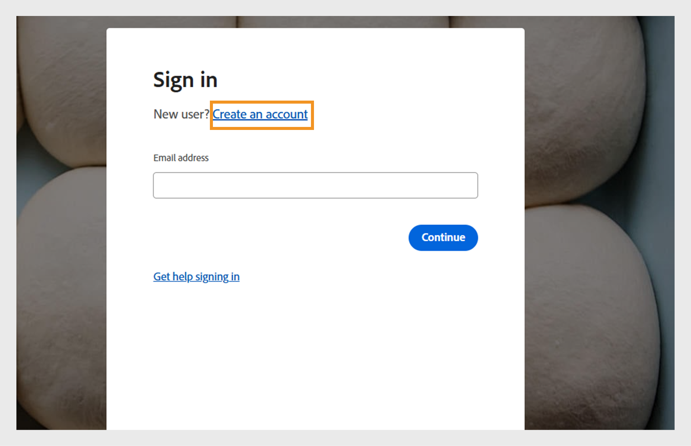
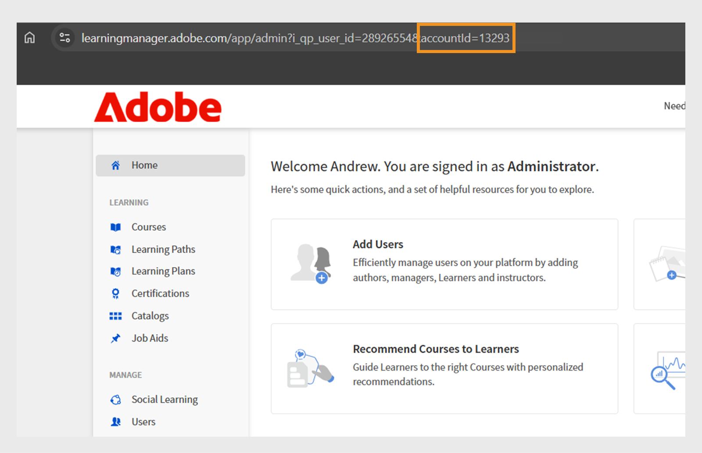

# Criar uma conta de avaliação no Adobe Learning Manager

Você pode configurar facilmente uma conta de avaliação gratuita de 30 dias no Adobe Learning Manager para explorar recursos e testar fluxos de trabalho de aprendizado. Este guia explica por onde começar, como se inscrever e como localizar os detalhes da sua conta depois de configurado.

Para criar uma conta de avaliação:

1. Vá para o [Adobe Learning Manager](https://business.adobe.com/br/products/learning-manager/adobe-learning-manager.html).
2. Selecione a **[!UICONTROL Avaliação gratuita de 30 dias]**.

   

3. Selecione **[!UICONTROL Criar uma conta]** na página de logon.

   

4. Digite seu **[!UICONTROL endereço de email]** e sua **[!UICONTROL senha]**.

   

5. Digite os seguintes detalhes e selecione **[!UICONTROL Criar conta]**:
   * Nome
   * Sobrenome
   * Data de nascimento

   

6. Digite e preencha o formulário com os detalhes necessários para configurar sua conta de avaliação.
7. Após a configuração, encontre a ID da sua conta no URL do seu URL do Adobe Learning Manager.

   

