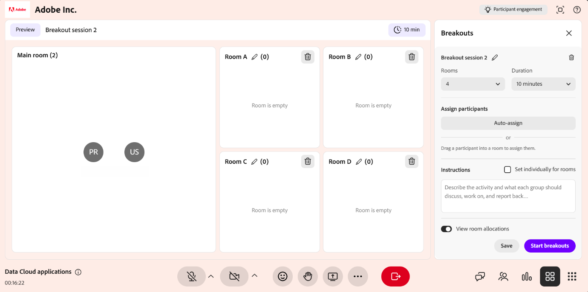

# Sobre os breakouts

As salas para sessão de grupo permitem que os professores dividam uma sessão do Live Hub em grupos menores. Os alunos participam dessas salas para discussões, atividades ou colaboração e retornam automaticamente à sessão principal quando a atividade termina. As salas para sessão de grupo são úteis para brainstorming, atividades em grupo e aprendizado focado.

Os professores podem criar e gerenciar salas para sessão de grupo, atribuir alunos e orientar atividades usando instruções. Durante a sessão, os professores podem monitorar a atividade da sala, exibir resumos de discussões em tempo real e fornecer suporte quando necessário.

Os alunos colaboram em suas salas atribuídas, participam de discussões e permanecem alinhados à atividade usando instruções e resumos compartilhados.

Após a sessão, os professores podem revisar as discussões e os resultados dos debates por meio de relatórios de sessão e do painel de sessão, permitindo uma melhor análise e acompanhamento.

## Benefícios das sessões de debate

* **Incentiva a colaboração**:Participants que pode colaborar em grupos menores para discussões e atividades focadas.

* **Visibilidade da sala em tempo real**: os professores podem monitorar o envolvimento, a participação e as solicitações de ajuda nas salas sem interromper os participantes.

* **Insights de discussão viabilizados por IA**: os resumos em tempo real ajudam os professores a entender rapidamente as discussões em todas as salas e orientar as atividades de forma eficaz.

* **Diretrizes de atividades estruturadas**: forneça instruções para orientar os alunos durante as atividades de grupo.

* **Gerenciamento flexível de participantes**: os participantes podem ser atribuídos e ajustados facilmente para oferecer suporte a diferentes formatos de aprendizado.

* **Insights e relatórios pós-sessão**: os professores podem revisar resumos, relatórios e dados de sessão no painel Sessão para analisar resultados e melhorar futuras sessões.

## Terminologia da sessão de interrupção

Estes termos explicam como as sessões de grupo funcionam e como os participantes interagem durante as atividades.

| **Termo** | **Descrição** |
|----|----|
| **Sessão de grupo** | Uma sessão temporária em uma sala de aula virtual, onde os participantes são divididos em grupos menores para discussões ou atividades focadas. |
| **Sala para sessão de grupo** | São grupos menores em uma sessão de grupo em que os alunos são divididos para participar de uma atividade específica. |
| **Instruções para sessão de grupo** | O professor atribui a tarefa ou discussão aos participantes em uma sala de sessão de grupo. |
| **Relatório de interrupção** | Uma medida do envolvimento de um aluno durante uma sessão de debate, usada pelos professores para monitorar e avaliar os níveis de participação. |

## Fluxo de trabalho de sessão de interrupção

A sessão de grupo segue um fluxo estruturado que inclui configuração, colaboração em tempo real e conclusão da sessão.

### Configurar sessão de breakout

Antes de iniciar uma sessão de grupo, os professores criam e configuram as salas de grupo de acordo com os requisitos da sessão.

* Defina o número de salas para sessão de grupo.

* Atribua alunos a salas de forma automática ou manual arrastando e soltando participantes.

* Adicione instruções de atividade para orientar os alunos.

Essa configuração garante que os alunos estejam organizados e alinhados à atividade antes do início da sessão.

### Durante a sessão de breakout

Depois que a sessão de grupo é iniciada, os alunos são movidos para suas salas atribuídas para colaborar na atividade especificada.

* Os alunos interagem e participam de suas salas de sessão de grupo.

* Os professores podem monitorar a atividade da sala, acompanhar a participação e responder às solicitações de ajuda.

* Os professores podem exibir resumos de discussões em tempo real e participar de salas para orientar os alunos quando necessário.

Essa fase tem como foco a colaboração e a participação ativa.

### Após a sessão de breakout

Quando a sessão de grupo termina, todos os participantes são automaticamente movidos de volta para a sala principal.

* Os alunos retornam à exibição da sessão principal.

* Os professores podem revisar resumos gerais de atividades, resultados e sessões por meio dos relatórios.

* Os professores podem criar uma sessão duplicada para reutilizar a mesma configuração para atividades futuras.

Isso marca a conclusão da atividade de interrupção e permite a revisão pós-sessão.

## Funções e permissões

As salas para sessão de grupo estão disponíveis para professores e alunos. As ações e controles disponíveis no painel variam com base na função do usuário na sala de aula virtual.

| **Professores** | **Alunos** |
|----|----|
| [Criar uma sessão de breakout](../getting-started-with-live-hub/create-and-manage-breakout-rooms.md#create-a-breakout-session) | [Ingressar na sala de sessão de grupo](../getting-started-with-live-hub/participate-in-a-breakout-session.md#join-your-breakout-room) |
| [Criar uma sessão de breakout](../getting-started-with-live-hub/create-and-manage-breakout-rooms.md#design-a-breakout-session) | [Exibir as instruções da atividade](../getting-started-with-live-hub/participate-in-a-breakout-session.md#view-the-activity-instructions) |
| [Iniciar uma sessão de breakout](../getting-started-with-live-hub/create-and-manage-breakout-rooms.md#start-a-breakout-session) | [Colabore com o seu grupo](../getting-started-with-live-hub/participate-in-a-breakout-session.md#collaborate-with-your-group) |
| [Gerenciar sessões de debate](../getting-started-with-live-hub/create-and-manage-breakout-rooms.md#manage-breakout-sessions) | [Receber mensagens do seu professor](../getting-started-with-live-hub/participate-in-a-breakout-session.md#receive-messages-from-your-instructor) |
| [Gerenciar atividades em uma sessão de breakout ativa](../getting-started-with-live-hub/create-and-manage-breakout-rooms.md#manage-activities-in-an-active-breakout-session) | [Pedir ajuda](../getting-started-with-live-hub/participate-in-a-breakout-session.md#ask-for-help) |
| [Usar ferramentas de colaboração em salas para sessão de grupo](../getting-started-with-live-hub/create-and-manage-breakout-rooms.md#use-collaboration-tools-in-breakout-rooms) | [Retornar à sala principal](../getting-started-with-live-hub/participate-in-a-breakout-session.md#return-to-the-main-room) |
| [Encerrar uma sessão de breakout](../getting-started-with-live-hub/create-and-manage-breakout-rooms.md#end-a-breakout-session) | [Exibir o resumo da sua sala](../getting-started-with-live-hub/participate-in-a-breakout-session.md#view-your-room-summary) |
| [Exibir um relatório de sessão de interrupção](../getting-started-with-live-hub/create-and-manage-breakout-rooms.md#view-a-breakout-session-report) | |
| [Estender uma sessão de breakout](../getting-started-with-live-hub/create-and-manage-breakout-rooms.md#extend-a-breakout-session) | |
