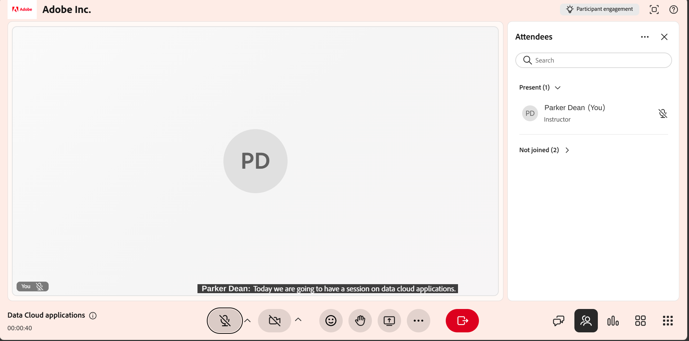

As legendas codificadas transcrevem o conteúdo falado em tempo real durante uma sessão do Live Hub. Os participantes veem o texto falado na tela à medida que a conversa acontece. As legendas são úteis quando o áudio não está claro, por exemplo, em ambientes ruidosos ou quando os participantes preferem ler junto. As legendas codificadas são especialmente úteis em situações em que o áudio não é claro, como em ambientes ruidosos ou quando os participantes preferem ler junto com a discussão.

## Como funcionam as legendas codificadas

Em uma sessão do Live Hub, as legendas codificadas são geradas automaticamente. As legendas são exibidas em um painel dedicado e atualizadas continuamente conforme os participantes falam. Professores e Alunos podem exibir legendas.

Cada participante pode mostrar ou ocultar legendas da maneira que preferir. A alteração dessa configuração não afeta outros participantes.

*Interface do Live Hub mostrando as legendas codificadas na sessão*

## Funções e permissões

O recurso **legendas ocultas** está disponível para professores e alunos em uma sessão do Live Hub. As ações disponíveis variam de acordo com a função do usuário.

| **Professores** | **Alunos** |
|----|----|
| [Exibir legendas codificadas](../getting-started-with-live-hub/manage-closed-captions-as-an-instructor.md#display-closed-captions) | [Exibir legendas codificadas](../getting-started-with-live-hub/manage-closed-captions-as-a-learner.md#display-closed-captions) |
| [Alterar a aparência das legendas codificadas](../getting-started-with-live-hub/manage-closed-captions-as-an-instructor.md#change-the-appearance-of-closed-captions) | [Alterar a aparência das legendas codificadas](../getting-started-with-live-hub/manage-closed-captions-as-a-learner.md#change-the-appearance-of-closed-captions) |