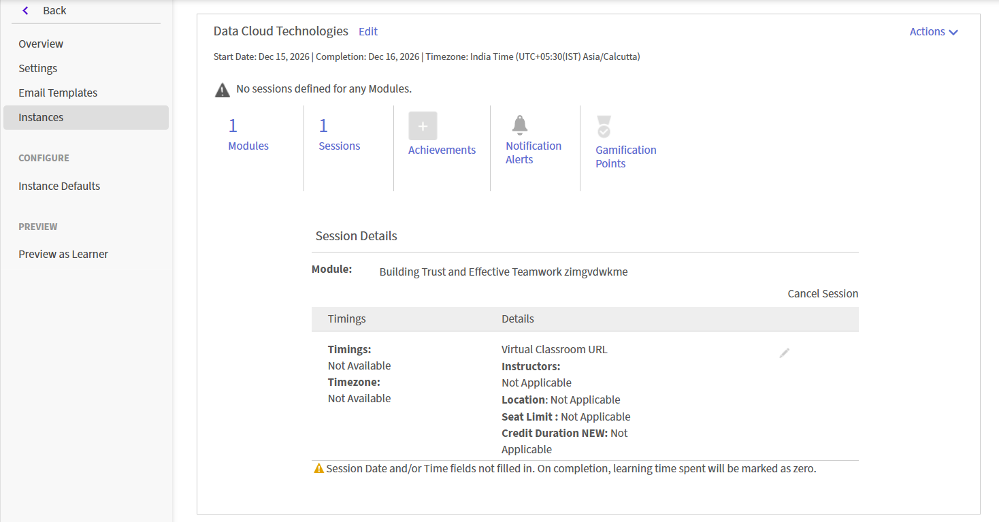

# Criar uma sessão do Live Hub (Beta)

Use o Live Hub para fornecer treinamento ao vivo liderado por instrutores em um curso do Adobe Learning Manager. Você pode combinar sessões do Live Hub com conteúdo de ritmo individualizado para criar uma experiência de aprendizado combinada.

Ao adicionar um módulo de sala de aula virtual a um curso, selecione a ferramenta de treinamento virtual que hospedará a sessão ao vivo. Você pode escolher **Hub dinâmico**, solução de treinamento virtual habilitado por IA Adobe ou usar um provedor externo, como o **Adobe Connect**.

>[!NOTE]
>
> O Live Hub aparece como uma opção da Ferramenta de treinamento virtual ao vivo somente se o administrador o tiver ativado nas configurações do Live Hub. Se não estiver ativado, use um provedor externo, como o Adobe Connect. Exiba [Habilitar o Live Hub](../administrators/feature-summary/enable-live-hub.md) para obter mais informações.

Ao criar um curso do Live Hub, você pode:

* Adicione uma ou mais sessões do Live Hub a um curso.

* Selecione os professores manualmente ou use as recomendações do professor assistido por IA.

* Configure o curso com uma única instância padrão ou crie várias instâncias para diferentes agendas ou públicos-alvo.

Este artigo explica como criar um curso do Live Hub, atribuir professores e configurar instâncias do curso.

## Criar um curso do Live Hub

Uma instância padrão é criada automaticamente quando você adiciona um módulo de Sala de aula virtual. Isso é útil quando você deseja distribuir uma única sessão ou uma programação padrão para todos os alunos.

Para criar um curso do Live Hub:

1. Faça logon no Adobe Learning Manager como autor.

1. Selecione **Criar Cursos**.

1. Na página **Catálogo do curso**, selecione **Adicionar** e insira os seguintes detalhes:

   1. Nome do curso

   1. Breve descrição

   
   *Insira o nome do curso e uma breve descrição antes de adicionar módulos ao curso.*

1. Selecione **Conteúdo** > **Adicionar Módulos** na seção **Módulos**.   A janela pop-up **Selecionar tipo de módulo** é exibida.

1. Selecione **Sala de aula virtual** e insira os detalhes do curso, incluindo título, descrição, fuso horário, data de início e término e hora de início e término.

1. Selecione o **Hub do Live** nas **Ferramentas de Treinamento Virtual do Live**.

   
   *Selecione o Live Hub para habilitar recomendações de instrutor com IA para a sessão.*

1. Adicione professores usando uma das seguintes opções:

   1. Insira os nomes dos professores no campo **Professores**.

   1. Selecione **Localizar professores que usam IA** para exibir professores com IA recomendada. Exiba [Adicionar professores usando o Localizador de professores](#add-instructors-using-instructor-finder) para obter mais informações.

1. Selecione **Adicionar** > **Salvar**.

1. Selecione as habilidades necessárias na seção **Habilidades do curso**.

1. Selecione o **Nível de habilidade** e revise ou atualize o **Máximo de créditos**.

   
   *Atribua uma habilidade e um nível de habilidade para definir os créditos que os alunos ganham ao concluir o curso.*

1. Selecione **Salvar** > **Publish**. O curso é criado com sucesso no Adobe Learning Manager.

## Criar uma instância do curso

Um administrador pode criar uma ou mais instâncias de um curso para oferecê-lo a diferentes públicos, agendas ou locais. Cada instância tem seus próprios detalhes de sessão, portanto, você pode atribuir diferentes professores, recomendações do localizador de professores e tempos a cada instância do mesmo curso.

Para criar uma instância do curso:

1. Faça logon no Adobe Learning Manager como autor.

1. Abra o curso e selecione **Instâncias** no painel esquerdo.

   
   *A Instância Padrão é criada automaticamente quando você adiciona um módulo de Sala de Aula Virtual.*

1. Selecione **Adicionar Nova Instância**.

1. Insira o **Nome da Instância**, **Data de Início** e **Prazo de Conclusão**. Selecione **Mostrar Mais Opções** para definir configurações adicionais.

   
   *Insira um nome de instância, uma data de início e um prazo de conclusão para criar uma nova instância do curso.*

1. Selecione **Salvar**.   A nova instância foi adicionada à lista **Instâncias**.

   
   *A nova instância aparece junto com a Instância Padrão na lista Instâncias.*

1. Selecione o número em **Sessões** para exibir os **Detalhes da Sessão**.

   
   *Os detalhes da sessão mostram que campos de tempo, professor e local ainda precisam ser configurados.*

1. Selecione o ícone de edição (lápis) ao lado dos detalhes da sessão para abrir o painel de configuração de sessão.

   
   *Configure o agendamento, o professor e o local para uma instância de sessão específica.*

1. No campo **Professores**, insira nomes manualmente ou selecione **Localizar professores usando IA** para professores recomendados por IA. Exiba [Adicionar professores usando o Localizador de professores](#add-instructors-using-instructor-finder) para obter mais informações.

1. Insira os detalhes do **Local** e selecione **Salvar**. A sessão é atualizada com os horários configurados, o professor e os detalhes do local.

## Adicionar professores usando o Localizador de professores

Em vez de pesquisar e adicionar professores manualmente, use o **Localizador de instrutores** para receber recomendações de instrutor com IA para a sessão. O Localizador de instrutores faz a correspondência dos instrutores com base nos detalhes do curso e nas habilidades necessárias, ao mesmo tempo em que considera o calendário de feriados da organização, a disponibilidade do instrutor e a utilização do instrutor para sugerir os instrutores mais adequados. Exiba [Adicionar e gerenciar professores](./instructor-management.md) para obter mais informações.

>[!NOTE]
>
> O Localizador de instrutores aparece somente se o seu administrador tiver ativado o Assistente do localizador de instrutores nas configurações do Live Hub. Exiba [Habilitar o Live Hub](../administrators/feature-summary/enable-live-hub.md) para obter mais informações.

Para adicionar professores usando o Localizador do professor:

1. Navegue até a seção **Professores** no módulo **Sala de Aula Virtual**.

1. Selecione **Localizar professores usando IA**.   O painel **Assistente do AI** é aberto no lado direito.

   
   *Use o painel Assistente do AI para obter as recomendações do professor e de horário com base nos detalhes da sessão.*

1. Revise a lista de professores recomendados.

1. Navegue até o professor que deseja atribuir e selecione **Adicionar**.   O professor selecionado é adicionado ao campo **Professores** como uma marca.

## Inscrever alunos no curso

Os alunos podem ser inscritos em um curso do Live Hub das duas seguintes maneiras:

1. Um **administrador** inscreve alunos no curso com base nos requisitos da organização. Exiba [Criar instâncias do curso e programações de aprendizado](https://experienceleague.adobe.com/pt-br/docs/learning-manager/using/admin/courses) para obter mais informações.

1. Os alunos podem se inscrever diretamente no curso pela página **Catálogo**. Se o curso estiver configurado para autoinscrição, os alunos serão inscritos imediatamente e poderão acessar o curso em **Meus aprendizados**. Exiba [Meus Aprendizados](https://experienceleague.adobe.com/pt-br/docs/learning-manager/using/learner/courses) para obter mais informações.

Após a inscrição, os alunos são adicionados ao curso e recebem uma notificação em sua conta da Adobe Learning Manager. Dependendo das configurações de notificação por e-mail da conta, os alunos também podem receber um convite para participar do curso por e-mail.

## Personalizar identidade visual da sala do Live Hub

Os administradores podem personalizar a aparência de salas do Live Hub para alinhá-la à marca da sua organização. Use as configurações de **Temas** no Adobe Learning Manager para aplicar cores da marca, logotipos e estilo visual nas sessões do Live Hub.

A marca personalizada ajuda a criar uma experiência de aprendizado consistente e garante que as sessões de treinamento ao vivo reflitam a identidade da sua organização.

Para obter mais informações sobre como configurar temas, consulte o artigo [Temas de cores](../administrators/feature-summary/themes.md#color-themes).
