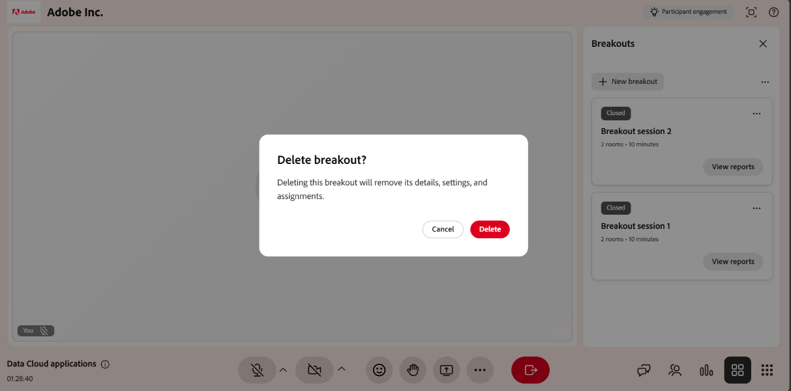

# Criar e gerenciar sessões de grupo

Os professores podem dividir uma sessão do Live Hub em grupos menores e interativos para atividades e discussões focadas. Você pode criar salas para sessão de grupo, atribuir alunos de forma automática ou manual, definir instruções de atividade e controlar por quanto tempo a sessão é executada. Enquanto uma sessão de grupo está ativa, você pode monitorar salas com resumos gerados por IA, participar de uma sala para compartilhar sua tela ou bate-papo e estender a sessão.

Este guia percorre todas as ações de sala de sessão de grupo disponíveis para os professores, desde a criação de uma sala até a revisão do relatório de sessão.

## Criar uma sessão de breakout

As sessões de grupo dividem uma sala de aula virtual em grupos interativos menores. Siga estas etapas para criar uma.

Para criar uma sessão de breakout:

1. Selecione  na barra de controle.

   
   *Interface do Live Hub mostrando o painel Saída.*

1. Selecione **Configurar uma sessão de breakout**.

O painel Debates é aberto. Aqui, você pode configurar salas para sessão de grupo, atribuir alunos e gerenciar configurações de sessão de grupo.

>[!NOTE]
>Se a sessão de interrupção não for iniciada, consulte o [Guia de solução de problemas do Live Hub](../kb/troubleshooting-guide-for-live-hub.md#breakout-session-issues) para obter uma lista de mensagens de erro comuns e como resolvê-las.

## Criar uma sessão de breakout

Antes de iniciar uma sessão de grupo, configure salas, atribua alunos e defina os detalhes da atividade usando o painel **Grupo**. A configuração adequada ajuda a posicionar os alunos corretamente e a entender o objetivo de cada atividade de grupo.

Para criar uma sessão de breakout:

1. Selecione  na barra de controle.   O painel Debates é aberto.

   
   *Painel de breakouts mostrando as opções para configurar as salas de sessão de grupo.*

1. Configure as salas para sessão de grupo usando as seguintes opções:

| **Opção** | **Descrição** |
|----|----|
| Editar ícone | Selecione o ícone de edição para renomear a sessão de breakout. |
| **Salas** | Defina o número de salas para sessão de grupo usando os controles de aumento ou diminuição. O máximo é **10** salas. |
| **Duração** | Defina por quanto tempo a sessão de breakout será executada. A duração mínima é de **5 minutos** e o máximo é de **60 minutos**. |
| **Atribuir participantes** | Selecione **Atribuição automática** para atribuir automaticamente participantes a salas. Você também pode arrastar e soltar um aluno para movê-lo para uma sala diferente. |
| **Definir individualmente para salas** | Personalize as instruções separadamente para cada sala de sessão de grupo. |
| **Instruções** | Descreva a atividade e descreva o resultado esperado para a sessão de breakout. |
| **Exibir alocações de sala** | Visualize como os alunos serão distribuídos nas salas de sessão de grupo antes do início da sessão. |
| **Iniciar separações** | Inicie a sessão de grupo e mova os alunos para as salas atribuídas a eles. |
| Ícone Descartar | Descartar a configuração de breakout atual sem salvar as alterações. |

1. Selecione **Salvar**.   A sessão de breakout aparece no painel **Breakouts** com uma tag **New**.

## Iniciar uma sessão de breakout

Depois que a sessão de grupo é configurada e salva, ela aparece no painel **Debates**. Inicie a sessão para mover os alunos para suas salas atribuídas.

Para iniciar uma sessão de breakout:

1. Abra o painel **Debates**.

1. Navegue até a sessão de grupo com a marca **Nova**.

1. Selecione **Iniciar breakouts**.   Uma notificação mostra **Começando em 5 segundos**, e os alunos são movidos para suas salas de sessão de grupo atribuídas com a configuração aplicada.

   
   *Selecione Iniciar breakouts para iniciar a sessão de breakout.*

## Gerenciar sessões de debate

Depois de salvar uma sessão de grupo, ela aparecerá no painel **Grupos**. Cada sessão salva mostra seu status (**Novo** ou **Fechado**), o número de salas e a duração. Neste painel, você pode editar, duplicar ou excluir uma sessão conforme necessário.

### Editar uma sessão de breakout

Use esta opção para atualizar uma configuração de breakout existente. A edição está disponível para sessões com o status **Novo**.

Para editar uma sessão de breakout:

1. Abra o painel **Debates**.

1. Navegue até a sessão de breakout que você deseja alterar.

1. Selecione o ícone de edição (lápis) na sessão.

   
   *Selecione o ícone Editar (lápis) para atualizar a configuração da sessão de breakout.*

1. Atualize a configuração conforme necessário, como número de salas, duração ou as instruções.

1. Selecione **Salvar**.

### Duplicar uma sessão de breakout

Reutilizar uma configuração de breakout existente duplicando uma sessão criada anteriormente.

Para duplicar uma sessão:

1. Abra o painel **Debates**.

1. Navegue até a sessão de breakout que você deseja duplicar.

1. Selecione as mais opções (**...**) na sessão.

   
   *O menu Mais opções mostra ações duplicadas.*

1. Selecione **Duplicar**.

Uma nova sessão é criada com a mesma configuração de sala, atribuições de participantes, instruções e duração. A sala de sessão de grupo copiada aparece na parte superior do painel com o status **Novo** e um nome como **Sessão de grupo 1 (Cópia)**.

### Excluir uma sessão de breakout

Use esta opção para remover uma sessão de breakout que não é mais necessária.

Para excluir uma sessão de breakout:

1. Abra o painel **Debates**.

1. Navegue até a sessão de breakout salva.

1. Selecione as mais opções (**...**) na sessão.

1. Selecione **Excluir**.   Uma janela pop-up de confirmação é exibida.

   
   *Selecione Excluir na janela pop-up de confirmação para excluir uma sessão de breakout.*

1. Selecione **Excluir**.

## Gerenciar atividades em uma sessão de grupo ativa

Durante uma sessão de grupo ativa, os professores podem monitorar a atividade da sala, comunicar-se com os alunos e colaborar com os participantes ingressando em salas de grupo individuais. A maioria das ferramentas de colaboração disponíveis na sessão principal, como o Bate-papo, o Compartilhamento de tela e o Quadro branco, também estão disponíveis em salas de sessão de grupo e funcionam da mesma maneira.

### Exibir resumos gerados por IA das salas para sessão de grupo

Os professores podem exibir resumos das discussões gerados por IA em cada sala de sessão de grupo para monitorar as conversas com os participantes, avaliar o alinhamento com a atividade e decidir quando ingressar em uma sala. Os resumos são atualizados automaticamente ao longo da sessão conforme as discussões se desenrolam.

>[!NOTE]
>
>Uma sala precisa de pelo menos 60 segundos de discussão para que um resumo possa ser gerado. As salas com menos atividade não mostrarão um resumo na janela Verificar sala.

Para exibir resumos:

1. Navegue até a sala que deseja revisar.

1. Selecione **Verificar Sala**.   Uma janela pop-up **Verificar sala** é exibida com o resumo da sala.

   
   *A janela pop-up Verificar Sala exibe o resumo da sala.*

1. (Opcional) Selecione outra sala. O resumo é atualizado para exibir detalhes da sala selecionada.

### Usar ferramentas de colaboração em salas para sessão de grupo

Depois de ingressar em uma sala de sessão de grupo, os professores podem usar as mesmas ferramentas de colaboração que estão disponíveis na sessão principal para orientar e interagir com os alunos. Você pode:

* Converse com os alunos para responder a perguntas e facilitar as discussões. Exiba [Sobre o painel de Chat](./about-the-chat-panel.md) para obter mais informações.

* Compartilhe sua tela ou apresentações para explicar conceitos ou demonstrar tarefas. Exiba [Sobre o compartilhamento de tela](./about-the-screen-sharing.md) para obter mais informações.

* Colabore usando o quadro de comunicações para brainstorming, anotações e atividades interativas. Exiba [Sobre o quadro de comunicações](./about-the-whiteboard.md) para obter mais informações.

## Encerrar uma sessão de breakout

Você pode encerrar a sessão de breakout a qualquer momento.

1. Navegue até o painel **Debates**.

1. Selecione **Encerrar detalhamentos** na sessão de detalhamento ativa.   Todos os alunos são movidos de volta para a sala principal e a sessão de grupo termina para todos os participantes.

   
   *Sessão de grupo 2 mostrando opções de Encerrar grupo para encerrar a sessão de grupo.*

## Exibir um relatório de sessão de breakout

Após o término da sessão de breakout, você pode acessar o relatório da sessão de breakout para analisar a atividade e a participação da sessão. O relatório inclui detalhes do participante, resumos específicos da sala de discussões de grupo, instruções compartilhadas com os participantes e uma visão geral da duração e do engajamento da sessão.

>[!NOTE]
>
>As salas com menos de 60 segundos de discussão não têm um resumo incluído no relatório.

Para exibir um relatório de sessão de breakout:

1. Navegue até a sessão de detalhamento fechada no painel **Detalhes**.

1. Selecione **Exibir relatórios**.   A janela pop-up do relatório Breakouts é aberta com o relatório de salas.

   
   *Janela pop-up de relatórios de interrupções mostrando o relatório de salas para sessão de grupo.*

Todos os insights de sessão de detalhamento também estão disponíveis no **Painel de sessão**, onde você pode revisar resumos, analisar participação e acompanhar os resultados da sessão após a sessão. Exiba [Componentes do painel da Sessão](./components-of-the-session-dashboard.md) para obter mais informações.

## Estender uma sessão de breakout

Se for necessário mais tempo, você poderá estender a sessão de detalhamento enquanto ela estiver ativa selecionando **Estender o tempo em 2 minutos** nos controles de detalhamento para aumentar a duração da sessão. Você pode estender a sessão até duas vezes durante cada sessão de breakout. A duração atualizada é aplicada imediatamente, permitindo que os alunos continuem suas atividades sem interrupção.
