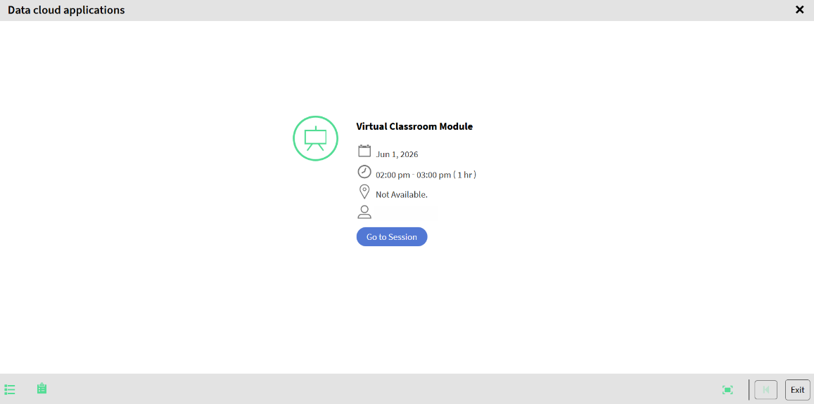

# Participar de uma sessão do Live Hub (Beta) como aluno

Os alunos ingressam em uma sessão do Live Hub diretamente do curso em que estão inscritos. Depois de ingressar, você participa do treinamento ao vivo por meio de bate-papo, pesquisas, questionários, quadros brancos e salas para sessão de grupo.

## Ingressar na sessão

1. Entre no Adobe Learning Manager.

1. Navegue até **Meus aprendizados**.

1. Selecione o curso inscrito.

   
   *Selecione Ir para Sessão para abrir a tela de pré-ingresso do Live Hub.*

1. Selecione **Iniciar** > **Ir para sessão**. A interface de ingresso no Live Hub é aberta.

1. (Opcional) Teste o microfone e aplique o plano de fundo virtual. Consulte [Configurar a tela de pré-ingresso no Live Hub](./setup-pre-join-screen-in-live-hub.md) para obter mais informações.

1. Selecione **Ingressar**.
