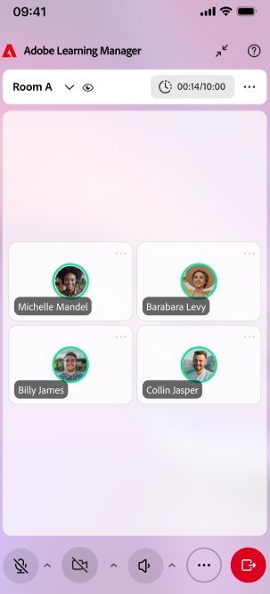

# Use o Live Hub (Beta) em dispositivos móveis como aluno

Use o aplicativo móvel Adobe Learning Manager para ingressar e participar de sessões do Live Hub diretamente do seu dispositivo iOS ou Android. Durante uma sessão, você pode interagir com professores e participantes, responder a pesquisas e questionários, colaborar em salas para sessão de grupo e acessar conteúdo compartilhado diretamente do dispositivo móvel.

>[!NOTE]
>
> O aplicativo para dispositivos móveis é compatível com os principais recursos de participação do Live Hub. Alguns recursos disponíveis na experiência de desktop não estão disponíveis em dispositivos móveis. Para obter uma lista completa de recursos compatíveis na área de trabalho, exiba [Introdução ao Live Hub](./getting-started-live-hub.md).

## Experiência do aluno em dispositivos móveis

A tabela a seguir resume os recursos do Live Hub disponíveis para os alunos no aplicativo móvel.

| **Recurso** | **Experiência móvel** |
|----|----|
| Ingressar em sessões | Participe de sessões do Live Hub usando o aplicativo para dispositivos móveis da Adobe Learning Manager. |
| Áudio e vídeo | Ative ou desative o microfone e a câmera e selecione os dispositivos de áudio disponíveis. |
| Bate-papo e perguntas | Participe de conversas de chat e envie perguntas durante a sessão. |
| Reações e aumento da mão | Envie reações e levante a mão para interagir com o professor. |
| Pesquisas | Responder pesquisas publicadas durante a sessão. |
| Questionários | Tente questionários iniciados pelo professor. |
| Salas para sessão de grupo | Participe de salas para sessão de grupo atribuídas, colabore com outros participantes, solicite assistência ao professor e veja resumos de sessões de grupo. |
| Quadro de comunicações e conteúdo compartilhado | Exiba e interaja com o conteúdo compartilhado durante a sessão. |
| Miro boards | Exibir placas secundárias compartilhadas pelo professor. |
| Legendas ocultas | Ative ou desative legendas codificadas durante a sessão. |
| Compartilhamento de tela | Exiba o conteúdo compartilhado por professores ou participantes. |
| Gravações de sessão | Acesse as gravações quando elas forem disponibilizadas após a sessão. |

## Ingressar em uma sessão do Live Hub

Ingresse na sua sessão agendada do Live Hub usando o aplicativo móvel da Adobe Learning Manager.

Antes de ingressar, você pode revisar as configurações da câmera, do microfone e do dispositivo de áudio para garantir que estejam definidas corretamente.

*Revise as configurações da câmera, do microfone e do dispositivo de áudio antes de ingressar em uma sessão do Live Hub no dispositivo móvel.*

>[!NOTE]
>
> Fundos virtuais e efeitos de desfoque de fundo não são suportados no aplicativo móvel.

## Navegar na interface da sessão

Depois de ingressar em uma sessão, a exibição da sessão principal exibe os blocos de vídeo do participante ou conteúdo compartilhado junto com controles para comunicação e participação.

Use os controles de sessão para:

* Ative ou desative o microfone.

* Ative ou desative sua câmera.

* Levante a mão.

* Envie reações.

* Acesse o bate-papo e as perguntas.

* Participe de pesquisas e questionários.

* Participe das atividades da sala de sessão de grupo.

* Saia da sessão.

## Usar legendas codificadas

As legendas codificadas ajudam a seguir o conteúdo falado durante uma sessão.

Você pode ativar ou desativar as legendas a qualquer momento enquanto participa de uma sessão do Live Hub.

>[!NOTE]
>
> As opções de formatação de legenda, como tamanho da fonte e estilos de exibição, não estão disponíveis no aplicativo para dispositivos móveis.

## Fazer perguntas no bate-papo

Use o painel Bate-papo para se comunicar com professores e outros participantes.

Você pode:

* Publique mensagens no bate-papo da sessão.

* Exibir mensagens de professores e participantes.

* Envie perguntas durante a sessão.

* Revise as respostas fornecidas pelo professor.

## Responder pesquisas

Quando um professor inicia uma pesquisa, ela aparece automaticamente na sessão.

*Responda a uma pesquisa diretamente no aplicativo para dispositivos móveis da Adobe Learning Manager.*

Você pode enviar sua resposta diretamente do aplicativo móvel. Dependendo de como a pesquisa está configurada, você também poderá exibir os resultados da pesquisa após responder.

## Tentar questionários

Quando um professor inicia um quiz, você pode concluí-lo no dispositivo móvel sem sair da sessão.

Os resultados do quiz e a visibilidade da resposta dependem das configurações definidas pelo professor.

## Participar de salas para sessão de grupo

Se salas para sessão de grupo forem usadas durante uma sessão, o professor atribuirá você a uma sala.

*Exibição da sala de sessão de grupo mostrando opções de colaboração disponíveis em dispositivos móveis.*

Em uma sala de sessão de grupo, você pode:

* Colabore com outros participantes.

* Participe das atividades de grupo.

* Solicite assistência ao professor.

* Revise os resumos de breakout quando disponíveis.

As atribuições e o tempo da sala de sessão de grupo são gerenciados pelo professor.

## Exibir conteúdo compartilhado

Durante uma sessão, os professores podem compartilhar apresentações, quadros brancos, painéis secundários ou outro conteúdo. Você pode exibir o conteúdo compartilhado diretamente no aplicativo para dispositivos móveis e acompanhar discussões e atividades.

*Exiba o conteúdo compartilhado por um professor diretamente no aplicativo móvel.*

## Sair de uma sessão

Quando estiver pronto para sair da sessão, selecione **Sair**.

*Selecione Sair para sair da sessão do aplicativo móvel.*

Depois de sair, você será solicitado a fornecer feedback sobre sua experiência de sessão.
