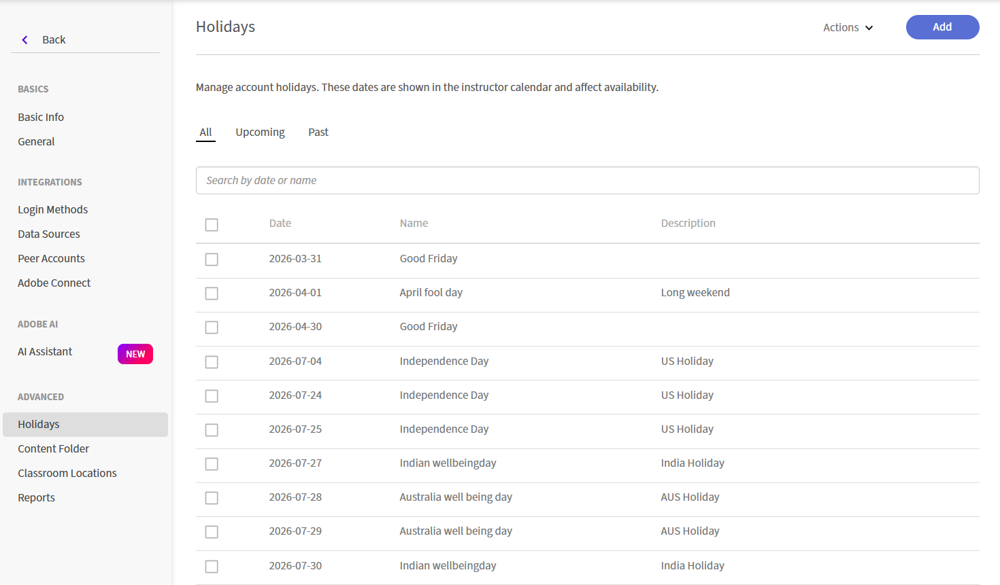

# Gerenciar Feriados

Use a configuração **Feriados** para definir feriados em toda a organização no Adobe Learning Manager. Os feriados aparecem no calendário do professor como dias não úteis, afetando a disponibilidade do professor ao agendar sessões do Live Hub.

Você pode adicionar feriados individualmente ou importar vários feriados usando um arquivo CSV. Depois que você adicionar feriados, eles aparecerão na página **Feriados**, onde você poderá exibi-los, pesquisá-los e gerenciá-los.

## Acessar as configurações de Feriado

Para acessar as configurações de **Feriados**:

1. Entre no Adobe Learning Manager.

1. Selecione **Configurações** em **Configurar**.

1. Navegue até a seção **Avançado** no painel de navegação esquerdo.

   
   *Navegue até a seção Avançado no painel de navegação esquerdo para localizar Feriados.*

1. Selecione **Feriados**. A página **Feriados** é exibida.

## Adicionar feriados

Use a opção **Adicionar feriado** para criar um único feriado ou importar vários feriados de um arquivo CSV.

1. Selecione **Adicionar** no canto superior direito da página **Feriados**. A janela pop-up Adicionar feriados é exibida.

1. Selecione uma das seguintes opções:

   1. Adicionar um único feriado

   1. Adicionar feriados em massa (carregar CSV)

### Adicionar um único feriado

Para adicionar um feriado manualmente:

1. Selecione **Adicionar um único feriado**.

1. Selecione **Data** e insira o nome do feriado.

1. (Opcional) Insira uma descrição.

   
   *Selecione uma data, insira o nome do feriado e, opcionalmente, adicione uma descrição.*

1. Selecione **Salvar**. O feriado é adicionado à lista.

### Adicionar feriados em massa

Use um arquivo CSV para adicionar vários feriados de uma só vez.

1. Selecione **Adicionar feriados em massa (Carregar CSV)**.

1. Selecione **Baixar modelo CSV** de amostra e adicione os detalhes de feriado ao arquivo.

   
   *Baixe o modelo CSV de amostra e carregue o arquivo concluído.*

1. Arraste o arquivo CSV para a área de upload ou selecione a área de upload para procurar e selecionar o arquivo.

1. Selecione **Salvar**. Os feriados são importados e adicionados à lista.
