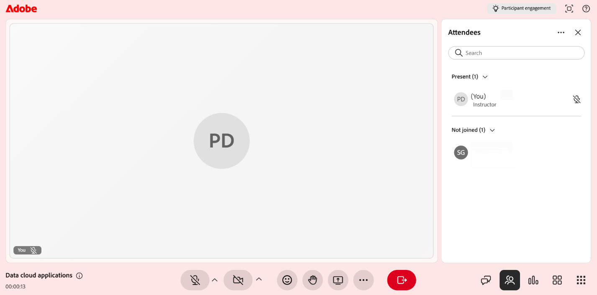

# Gerenciar o painel Participantes

Use o painel **Participantes** para exibir e gerenciar os participantes de uma sessão do Live Hub. O painel exibe uma lista de participantes em tempo real, incluindo os alunos que ingressaram na sessão e os inscritos, mas ainda não ingressaram. Ela também mostra a função de cada participante e o status da interação.

Como professor, você pode usar o painel Participantes para gerenciar a participação do aluno, configurar as permissões de participante e moderar as interações durante a sessão. Você pode executar ações como silenciar microfones, abaixar mãos levantadas, enviar mensagens privadas e remover alunos da sessão.

Este artigo explica como acessar o painel Participantes e gerenciar alunos durante uma sessão do Live Hub.

## Exibir o painel Participantes

O painel **Participantes** mostra todos na sessão. Para abri-lo, selecione  na barra de controle. O painel lista todos os alunos e atualizações automaticamente à medida que os participantes participam ou saem.

Visão Geral do Painel de 
*Interface do Live Hub mostrando o painel Participantes.*

As seguintes opções estão disponíveis no painel:

| **Opção** | **Descrição** |
|----|----|
| **Pesquisa** | Digite o campo **Pesquisar** para localizar um participante. A lista filtra conforme você digita. |
| **Presente** | Mostra os alunos atualmente na sessão, juntamente com suas funções (por exemplo, professor) e status do microfone. O número entre parênteses indica quantos estão presentes. |
| **Não ingressou** | Mostra os alunos inscritos na sessão que ainda não ingressaram. Selecione a seta para expandir a lista. |

## Configurações do painel Participantes

Para gerenciar as preferências do participante:

1. Selecione **Mais opções ()** no painel **Participantes**.

1. Você pode executar as seguintes ações disponíveis:

   1. **Diminuir todas as mãos**: baixe todas as mãos levantadas para os participantes.

   1. **Silenciar todos os participantes**: silenciar os microfones de todos os participantes.

   1. **Desativar câmera para todos os participantes**: desativar as câmeras de todos os participantes.

## Gerenciar alunos durante a sessão

O painel **Participantes** permite gerenciar alunos individuais durante a sessão. Você pode moderar interações e tomar ações rápidas para um aluno específico quando necessário, como silenciar o microfone, abaixar uma mão levantada, enviar uma mensagem privada ou exibir o perfil dele, ajudando a manter um ambiente de aprendizado organizado.

Para atualizar as permissões do aluno:

1. Navegue até o aluno no painel **Participantes**.

1. Selecione o ícone de **Mais opções ( µ)** ao lado do nome do aluno.

   
   *Menu de mais opções mostrando as ações do aluno no painel Participantes.*

1. Selecione uma das seguintes ações:

| **Ação** | **Descrição** |
|----|----|
| **Sem som** | Desativa o microfone do aluno. |
| **Mão baixa** | Remove o indicador de mão levantada do aluno. |
| **Enviar uma mensagem privada** | Abre um bate-papo privado com o aluno. |
| **Remover da sessão** | Remove o aluno da sessão. |
| **Exibir perfil** | Exibe as informações do perfil do aluno. |
