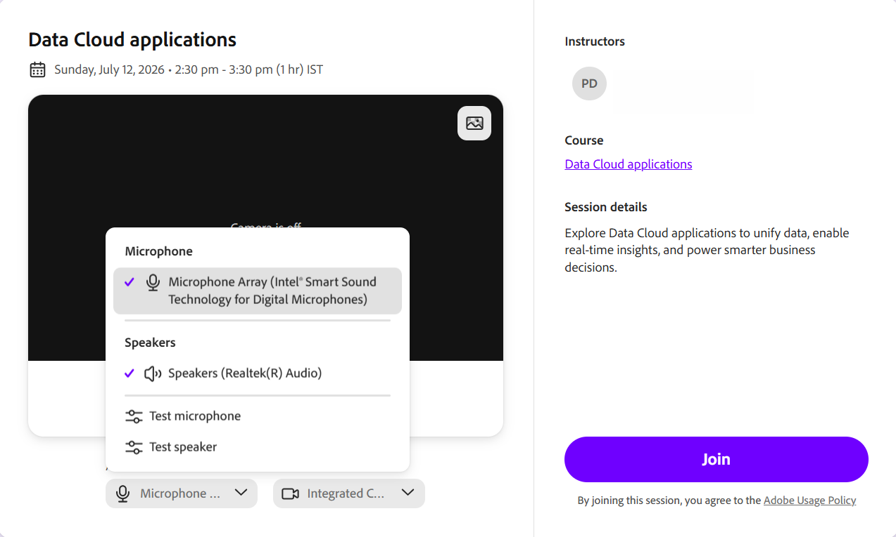

# Configurar a tela de pré-ingresso

Uma sessão do Live Hub no Adobe Learning Manager é um treinamento ao vivo, ministrado por instrutor, que os professores e alunos frequentam juntos em uma sala de aula virtual. Durante uma sessão, os participantes podem conversar, responder a enquetes e questionários, colaborar em um quadro de comunicações e participar de salas de debate para discussões em grupos menores.

Este artigo explica como uma sessão funciona do início ao fim e percorre a configuração compartilhada que se aplica a todos, independentemente da função.

## O que você verá na tela de pré-ingresso

A tela de pré-ingresso é onde o professor e o aluno chegam antes de entrar na sala de aula. Ele mostra os detalhes da sessão e oferece controles de áudio e câmera para que você possa verificar tudo que funciona primeiro. Quando a tela é carregada, um breve indicador de carregamento pode aparecer enquanto as informações da sessão são recuperadas. Você pode revisar o título da sessão ou o nome do módulo, o professor, o curso e a descrição da sessão.

### Permitir permissões do navegador

Na primeira vez que você ingressar em uma sessão de um novo navegador ou dispositivo, o navegador solicitará que você conceda acesso ao microfone e à câmera. Este prompt é exibido antes do carregamento da pré-visualização do áudio e do vídeo. Até você permitir o acesso, os controles de áudio e câmera poderão exibir **Não é possível acessar o microfone** ou **Não é possível acessar a câmera**.

Quando solicitado pelo navegador, selecione **Permitir** para habilitar o acesso ao microfone e à câmera. Depois que a permissão for concedida, você poderá visualizar e definir as configurações de áudio e vídeo antes de ingressar na sessão.

*Selecione Permitir quando o navegador solicitar acesso ao microfone e à câmera.*

### Configurar controles de áudio

O microfone e o alto-falante são selecionados automaticamente. Use o controle de áudio na tela de pré-ingresso para confirmar se eles funcionam ou alternam para um dispositivo diferente.

Para testar o microfone e o alto-falante:

1. Selecione o **Microfone** na tela de pré-ingresso. A lista suspensa **Microfone** é exibida.

   
   *Selecione o menu suspenso Microfone para alternar dispositivos ou testar o microfone e o alto-falante.*

1. (Opcional) Selecione **Testar microfone** para verificar se o microfone está funcionando.

1. (Opcional) Selecione **Testar alto-falante** para verificar a saída do alto-falante.

### Alterar o plano de fundo da câmera

Use o menu **Câmera** na tela de pré-ingresso para aplicar um plano de fundo virtual.

Para alterar o plano de fundo:

1. Selecione o menu suspenso **Câmera**. O menu suspenso **Câmera** é exibido.

   
   *Selecione o menu suspenso Câmera e, em seguida, selecione Editar fundo para escolher um fundo virtual.*

1. Selecione **Editar plano de fundo** e escolha um plano de fundo virtual. A visualização é atualizada imediatamente.
