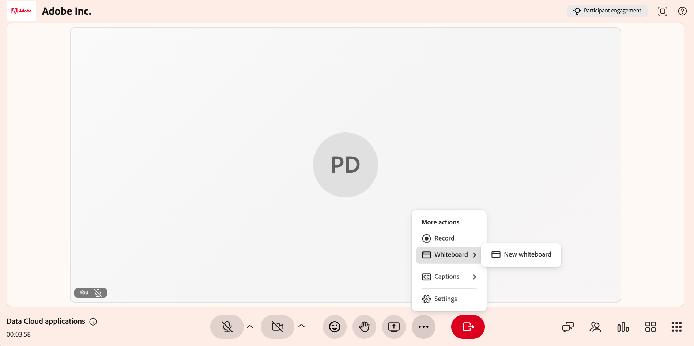
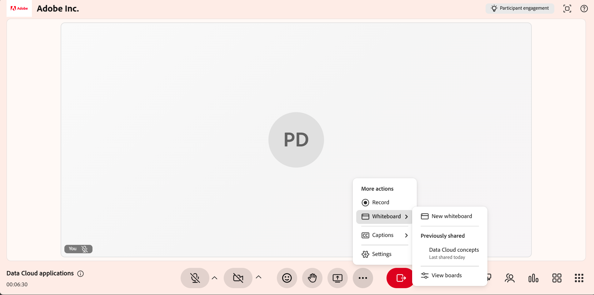
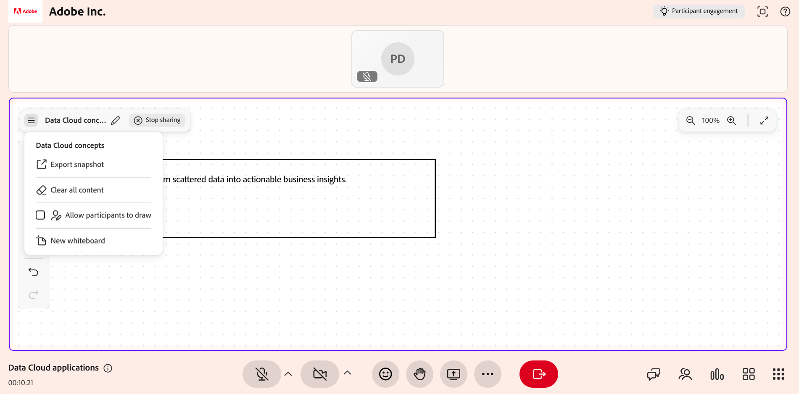

# Compartilhar um quadro de comunicações

Use o quadro de comunicações em uma sessão do Live Hub para explicar visualmente conceitos, anotar conteúdo e colaborar com os alunos em tempo real. Como professor, você pode criar um novo quadro de comunicações ou reabrir um existente, adicionar desenhos, formas e texto e gerenciar vários painéis durante uma sessão.

Você também pode renomear quadros, exportar um quadro de comunicações como imagem, permitir que os alunos colaborem no quadro e abrir quadros de comunicações externos, como Miro.

Este artigo explica como criar, gerenciar, compartilhar e exportar quadros de comunicações em uma sessão do Live Hub.

## Compartilhar um novo quadro de comunicações

Inicie um novo quadro de comunicações quando quiser que uma tela nova apresente ideias, explicações ou diagramas durante uma sessão ao vivo.

Para compartilhar um novo quadro de comunicações:

1. Na barra de controle de sessão, selecione **Mais opções**.

1. Selecione **Compartilhar quadro de comunicações**.

1. Selecione **Novo quadro de comunicações**. Um novo quadro de comunicações é aberto e fica visível para todos os participantes da sessão.

   
   A interface do *Live Hub mostra as opções de compartilhamento de um quadro de comunicações.*

## Reabrir um quadro de comunicações

Você pode abrir um quadro de comunicações existente para acessar o conteúdo compartilhado anteriormente durante a sessão. Isso permite continuar as discussões ou desenvolver explicações anteriores sem recomeçar.

Para reabrir um quadro de comunicações:

1. Selecione **Mais opções**.

1. Selecione **Compartilhar quadro de comunicações**.

1. Selecione o quadro de comunicações na lista de quadros de comunicações disponíveis. O quadro de comunicações selecionado é aberto e fica visível para todos os alunos.

   
   *Opções de compartilhamento de quadros de comunicações exibindo a lista de quadros de comunicações existentes disponíveis.*

>[!NOTE]
>
> Você também pode abrir quadros brancos compartilhados anteriormente pelo menu **Mais** no quadro de comunicações.

## Usar ferramentas do quadro branco

As ferramentas do quadro de comunicações permitem criar explicações visuais, desenhar, adicionar formas, inserir texto e fazer anotações durante uma sessão ao vivo.

*Interface do quadro de comunicações mostrando as ferramentas do quadro de comunicações.*

Use as seguintes ferramentas do quadro de comunicações para criar e anotar conteúdo durante a sessão:

| **Referência de ferramenta** | **Descrição** |
|----|----|
| **Selecionar** | Selecione formas ou texto no quadro de comunicações. Depois de selecionar um objeto, você pode movê-lo, redimensioná-lo, girá-lo, duplicá-lo ou excluí-lo. |
| **Panorâmica** | Arraste na tela para navegar e exibir diferentes áreas do quadro de comunicações. |
| **Marcador** | Desenhe traços à mão livre na tela do quadro branco. Use o seletor de cores e as opções de thickness de traçado para personalizar o desenho. |
| **Forma** | Adicione formas geométricas, como retângulos, círculos, setas e linhas. Arraste na tela para desenhar uma forma. Ajuste a cor de preenchimento, a borda e o thickness. |
| **Texto** | Adicione rótulos de texto, notas ou explicações ao quadro de comunicações. Selecione a tela para inserir texto. Use opções de formatação, como tamanho de fonte, estilo e cor. |
| **Borracha** | Remova traçados ou objetos do quadro de comunicações. Para desenhos, a borracha permite a remoção parcial. Para formas ou texto, o objeto inteiro é removido. |
| **Desfazer** | Reverta a ação mais recente executada no quadro de avisos, como desenhar, adicionar texto, inserir formas ou excluir objetos. Selecione **Desfazer** várias vezes para reverter várias ações em sequência. |
| **Refazer** | Restaure a ação mais recente que foi desfeita no quadro de comunicações. Selecione **Refazer** para reaplicar ações que foram revertidas anteriormente usando **Desfazer**. |

## Limpar todo o conteúdo do quadro de comunicações

Limpe o quadro de comunicações para remover todos os desenhos, formas e texto, e comece com uma tela em branco.

Para limpar o quadro de comunicações:

1. Navegue até o canto superior esquerdo do quadro de comunicações.

1. Selecione **Mais opções**.

1. Selecione **Limpar todo o conteúdo**. Todo o conteúdo do quadro de comunicações é removido.

   
   *Menu Mais mostrando as opções para limpar todo o conteúdo do quadro de comunicações.*

Você pode usar **Desfazer** para restaurar o conteúdo limpo.

## Gerenciar quadros de comunicações existentes

Os professores podem criar, organizar e controlar vários quadros brancos durante uma sessão do Live Hub usando o painel **Quadros brancos**. Este painel ajuda a analisar quadros brancos disponíveis e realizar ações em massa, como limpar ou excluir quadros.

Para gerenciar placas existentes:

1. Selecione **Mais opções** na barra de controle.

1. Selecione **Compartilhar quadro de comunicações**.

1. Selecione **Exibir painéis**. O painel **Quadros de comunicações** é aberto e exibe todos os quadros de comunicações criados na sessão.

   
   *Painel de quadros mostrando as opções para gerenciar os painéis existentes.*

### Ações disponíveis no painel Quadros de comunicações

No painel **Quadros de comunicações**, os professores podem executar as seguintes ações:

| **Ação** | **Descrição** |
|----|----|
| **Compartilhar** | Compartilhar o quadro de comunicações selecionado. |
| **Excluir** | Exclua permanentemente o quadro de comunicações atual do painel **Quadros de comunicações**. |
| **Excluir tudo** | Exclua permanentemente todos os quadros de comunicações listados no painel **Quadros de comunicações**. |

## Renomear um quadro de comunicações

Renomeie um quadro de comunicações diretamente da interface do quadro de comunicações para identificar melhor seu conteúdo durante uma sessão.

Para renomear um quadro de comunicações:

1. Selecione **Compartilhar** no painel **Quadros brancos**.

1. Na barra de ferramentas do quadro de comunicações, selecione o ícone **Editar** (lápis) ao lado do nome do quadro de comunicações.

1. Insira um novo nome e selecione o ícone da marca de seleção. O quadro de comunicações é renomeado com o nome atualizado.

   
   *Renomeie a opção de quadro de comunicações na interface do quadro de comunicações.*

## Exportar instantâneo do quadro de comunicações como imagem

Os professores podem exportar o conteúdo do quadro de comunicações como uma imagem para capturar as principais discussões, diagramas ou anotações criados durante uma sessão.

Para exportar um instantâneo do quadro de comunicações:

1. Navegue até o canto superior esquerdo do quadro de comunicações.

1. Selecione **Mais opções**.

1. Selecione **Exportar instantâneo**. O conteúdo do quadro de comunicações é exportado como uma imagem do **PNG** e baixado no sistema local.

   
   *Menu Mais mostrando as opções para exportar o quadro de comunicações como imagem.*

## Permitir que os participantes editem o quadro de comunicações

Você também pode permitir que os participantes desenhem e interajam com o quadro de comunicações durante uma sessão. Permitir que os participantes acessem quadros brancos suporta colaboração, debate e participação ativa.

Para conceder acesso para editar quadros brancos:

1. Navegue até o canto superior esquerdo do quadro de comunicações.

1. Selecione **Mais opções**.

1. Habilitar **Permitir que os participantes desenhem**. Os participantes agora podem desenhar no quadro de comunicações, adicionar formas, inserir texto e usar todas as ferramentas de anotação disponíveis.

   
   *Menu de Mais Opções mostrando controles para permitir que os alunos editem o quadro de comunicações.*

## Compartilhar Miro e outros quadros brancos externos

Os professores podem compartilhar quadros brancos de terceiros, como Miro, em uma sessão do Live Hub.

Para compartilhar uma micro placa:

1. Selecione **Mais aplicativos** na barra de controle.

1. Selecione **Miro**.

1. Faça logon em sua conta de Miro.

   
   *Menu Mais aplicativos mostrando as opções para compartilhar o quadro de Miro.*

1. Na página do projeto Miro, selecione o painel que deseja compartilhar.

Os alunos podem exibir o quadro de miro compartilhado com base na configuração da sessão, mas não podem abrir ou compartilhar os quadros de miro.
