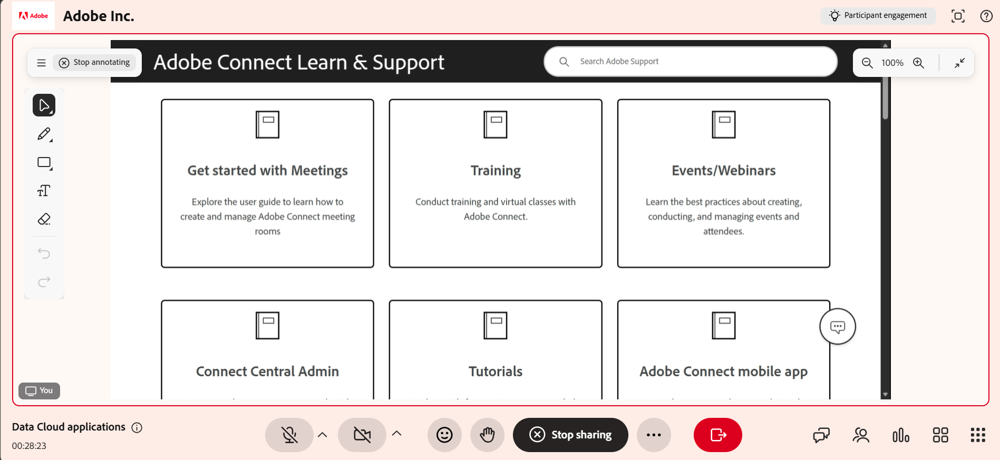

# Compartilhar sua tela como professor

O compartilhamento de tela permite que você apresente conteúdo do seu dispositivo aos participantes durante uma sessão do Live Hub. Compartilhe uma guia do navegador, uma janela do aplicativo ou a tela inteira para demonstrar fluxos de trabalho, entregar apresentações e orientar os alunos por meio de tarefas em tempo real.

É possível aprimorar as apresentações exibindo até dois conteúdos lado a lado na Visualização dividida, usando um quadro de avisos com conteúdo compartilhado e fazendo anotações diretamente na tela para enfatizar as informações principais. Você também pode permitir que os alunos compartilhem suas telas enquanto mantêm o controle sobre a sessão.

Este artigo explica como compartilhar sua tela, fazer anotações no conteúdo, usar a Exibição dividida e gerenciar o compartilhamento de tela do aluno no Live Hub.

## Compartilhar sua tela em uma sessão

Você pode iniciar o compartilhamento de tela durante uma sessão para apresentar conteúdo a todos os participantes em tempo real. Isso permite demonstrar aplicativos, orientar fluxos de trabalho ou entregar apresentações diretamente do seu dispositivo.

Siga estas etapas para compartilhar sua tela:

1. Selecione  na barra de controle. Uma janela pop-up é exibida.

1. Selecione uma das seguintes opções:

   1. **Guia Chrome**: compartilhar uma guia do navegador.

   1. **Janela**: compartilhar um aplicativo específico.

   1. **Tela inteira**: compartilhe sua tela inteira.

   
   *Janela pop-up de compartilhamento de tela mostrando várias opções para compartilhar sua tela.*

1. (Opcional) Habilite **Também compartilhar áudio da guia** para incluir áudio da guia compartilhada.

1. Selecione o conteúdo que deseja compartilhar.

1. Selecione **Compartilhar**. O conteúdo selecionado é exibido a todos os alunos.

Você pode compartilhar até dois conteúdos durante uma sessão. Quando conteúdo adicional é compartilhado, o layout se ajusta automaticamente para exibi-los em conjunto.

### Parar compartilhamento de tela

Para parar de compartilhar sua tela, selecione **Parar compartilhamento** na interface de tela compartilhada.

*Barra de controle mostrando a opção de parar o compartilhamento de tela.*

O compartilhamento de tela na sessão é encerrado e o conteúdo compartilhado é removido da interface da sala.

## Compartilhar vários conteúdos em uma sessão

A Sala de aula virtual oferece suporte à visualização dividida quando vários tipos de conteúdo são compartilhados durante uma sessão. Isso permite que os professores apresentem mais de um tipo de conteúdo ao mesmo tempo, como um compartilhamento de tela, quadro de comunicações ou painel de envolvimento.

### Como funciona a exibição dividida

Quando vários conteúdos estiverem ativos:

* Podem ser exibidos no máximo dois conteúdos de cada vez.

* Um conteúdo é exibido na área do palco principal.

* O outro conteúdo aparece em uma exibição secundária.

* Quando um novo conteúdo é compartilhado, o conteúdo existente pode ser movido para a exibição secundária.

>[!NOTE]
>
> Os painéis de envolvimento, como pesquisas, são priorizados e aparecem primeiro na exibição dividida.

### Alternar para exibição única

Quando vários conteúdos são exibidos, os professores podem alternar o foco para um único conteúdo.

Para alternar para uma exibição única:

1. Selecione o conteúdo que você deseja colocar em foco.

1. Escolha **Maximizar**. O conteúdo selecionado aparece no palco principal, enquanto o conteúdo restante se move para uma visualização secundária.

## Usar o compartilhamento de tela com um quadro de comunicações

Você pode executar o compartilhamento de tela juntamente com um quadro de comunicações durante uma sessão para apresentar conteúdo ao adicionar explicações ou anotações.

Quando um quadro de comunicações é compartilhado durante um compartilhamento de tela ativo, ou quando o compartilhamento de tela começa enquanto um quadro de comunicações já está ativo, a sessão muda automaticamente para a exibição dividida.

Para usar o compartilhamento de tela com um quadro de comunicações:

1. Compartilhe sua tela.

1. Selecione o ícone do quadro de comunicações na barra de controle.

1. Selecione **Compartilhar quadro de comunicações**. Ambos os conteúdos aparecem na exibição dividida.

   
   *A interface do Live Hub mostra uma exibição dividida com o quadro de comunicações à esquerda e o conteúdo compartilhado à direita.*

Para alternar o foco entre o quadro de comunicações e a tela compartilhada:

1. Selecione o conteúdo que deseja exibir.

1. Selecione **Maximizar**. O conteúdo selecionado é movido para o palco principal. O outro conteúdo é movido para uma exibição secundária.

   
   A interface do *Live Hub mostra uma exibição dividida com o quadro de comunicações e o conteúdo compartilhado maximizados na parte inferior da interface.*

## Anotar conteúdo compartilhado

Você pode fazer anotações no conteúdo compartilhado durante uma sessão para destacar informações importantes, explicar conceitos ou orientar visualmente os alunos. As anotações são aplicadas a um instantâneo da tela compartilhada. Elas são projetadas para explicações em tempo real e fornecem uma experiência focada e livre de distrações.

Ao compartilhar sua tela, selecione o ícone Anotar (caneta) no canto superior direito da interface de compartilhamento de tela. As ferramentas de anotação são exibidas automaticamente na interface de compartilhamento de tela.

### Usar ferramentas de anotação

Uma barra de ferramentas de anotação é exibida quando você começa a fazer anotações.

*A interface do Live Hub mostra a barra de ferramentas de anotação para interagir com o conteúdo compartilhado.*

A barra de ferramentas de anotação fornece as seguintes opções:

| **Ferramenta** | **Descrição** |
|----|----|
| **Selecionar** | Gerenciar anotações existentes. Você pode mover, redimensionar, duplicar ou excluir elementos de anotação. |
| **Desenhar** | Crie desenhos à mão livre. É possível ajustar o thickness e a cor do traçado. |
| **Formas** | Adicione formas estruturadas, como retângulos ou círculos. É possível personalizar as propriedades de traçado e preenchimento. |
| **Texto** | Adicione rótulos ou explicações. É possível formatar o texto e ajustar sua posição. |
| **Borracha** | Remova anotações da tela. Você pode apagar elementos individuais ou limpar todas as anotações. |
| **Parar de fazer anotações** | Saia do modo de anotação e retome o compartilhamento de tela. Todas as anotações são descartadas. |
| **Desfazer** | Reverte a ação mais recente. |
| **Refazer** | Reaplique a ação desfeita anteriormente. |

## Permitir que os participantes compartilhem sua tela

Você pode permitir que os participantes compartilhem suas telas durante uma sessão. Isso permite apresentar conteúdo, demonstrar fluxos de trabalho ou dar suporte a discussões.

Quando o compartilhamento de tela está ativado para alunos:

* Os alunos podem iniciar o compartilhamento de tela a partir dos controles de sessão.

* Somente um compartilhamento de tela pode estar ativo por vez.

* Os professores mantêm controle total sobre o compartilhamento de tela durante a sessão.
