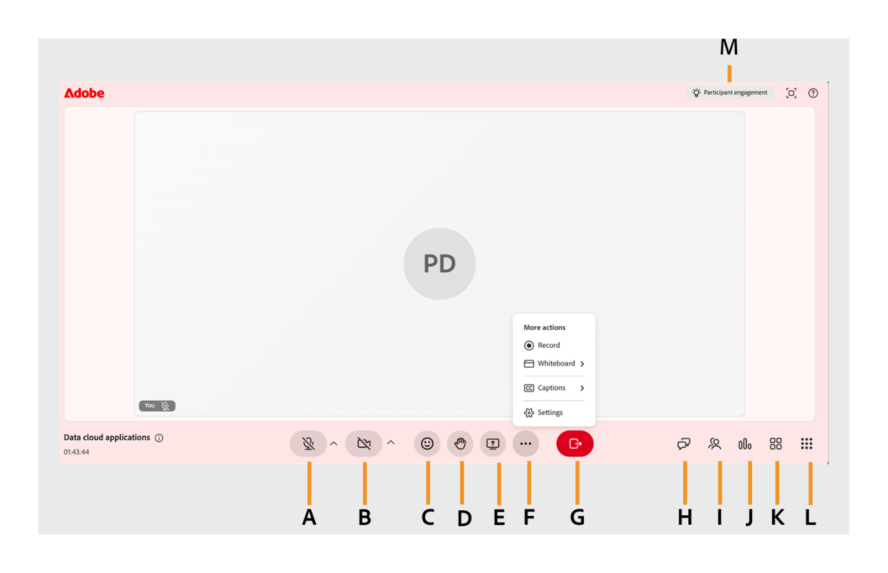

# Entenda o layout do Live Hub (Beta)

No Adobe Learning Manager Live Hub, a sala de sessão foi projetada para ajudar professores e alunos a colaborar de forma eficaz durante as sessões ao vivo. O layout inclui vários painéis e controles que permitem gerenciar áudio, vídeo, participantes e interações em tempo real.

Este artigo fornece uma visão geral da interface do Live Hub e seu layout. Ele explica os diferentes componentes da sala, como o painel de controle, o painel Participantes e outros elementos importantes, com referências rotuladas para ajudar você a navegar na interface.

*A: Controles de microfone, B: Opções de câmera, C: Reações, D: Levantar mão, E: Compartilhar tela, F: Mais ações, G: Sair da sessão, H: Painel de bate-papo, I: Painel Participantes, J: Sondagens e questionários, K: Saída, L: Mais aplicativos, M: Engajamento do participante.*

## Principais componentes do layout de sala de aula

O layout do Live Hub é organizado em painéis e barras de ferramentas que ajudam professores e alunos a interagir, colaborar e gerenciar a sessão de forma eficaz.

### Barra de controle (barra de ferramentas inferior)

A barra de controle fornece acesso rápido aos seguintes controles e configurações na sessão.

* **Controles de microfone**: ative ou desative o microfone durante a sessão. Isso está disponível para professores e alunos. Exiba a [tela de pré-ingresso da configuração](./setup-pre-join-screen-in-live-hub.md) para obter mais informações.

* **Controles de vídeo**: habilite ou desabilite sua câmera.Isso está disponível para professores e alunos. Exiba a [tela de pré-ingresso da configuração](./setup-pre-join-screen-in-live-hub.md) para obter mais informações.

* **Reações**: use emojis e respostas rápidas para interagir durante a sessão. Isso está disponível para professores e alunos. Veja [Sobre o movimento levantar a mão e enviar reações](./about-raise-hand-and-reactions.md) para obter mais informações.

* **Levantar a mão**: indique que você deseja fazer uma pergunta ou falar. Isso está disponível para professores e alunos. Veja [Sobre o movimento levantar a mão e enviar reações](./about-raise-hand-and-reactions.md) para obter mais informações.

* **Compartilhar tela**: apresente sua tela durante a sessão (com base em permissões). Isso está disponível para professores e alunos. Exiba [Sobre o compartilhamento de tela](./about-the-screen-sharing.md) para obter mais informações.

* **Mais ações**: acesse as seguintes ferramentas e configurações adicionais:

  * **Legendas**: ative ou desative as legendas ativas para exibir conteúdo falado como texto durante a sessão. Exiba [Legendas ocultas](./closed-captions-in-live-hub.md) para obter mais informações.

  * **Quadro de comunicações**: abra o quadro de comunicações para colaborar visualmente desenhando, escrevendo ou anotando com outros participantes. Exiba [Sobre o quadro de comunicações](./about-the-whiteboard.md) para obter mais informações.

  * **Configurações da sala**: defina as configurações da sessão, incluindo **permissões de participante**, **Gravação**, **IA** e as opções de **Privacidade**, para controlar o acesso do participante, as preferências de gravação, os recursos de IA e a visibilidade do participante. Exiba [Gerenciar configurações da sala como professor](./manage-settings.md) para obter mais informações.

### Painel Pesquisas e questionários

O painel Pesquisas e questionários ajuda os professores a impulsionar a participação e medir a compreensão do aluno ao longo da sessão. Você pode:

Crie pesquisas interativas para coletar feedback do aluno, coletar opiniões e incentivar a participação ativa durante a sessão. Visualize respostas em tempo real para orientar discussões e adaptar sua entrega conforme necessário. Exiba [Sobre as pesquisas](./about-the-polls.md) para obter mais informações.

Crie questionários para avaliar a compreensão do aluno, medir a retenção de conhecimento e controlar a conclusão. Monitore o progresso do aluno e as respostas do quiz em tempo real para identificar áreas que podem exigir instruções adicionais. Exiba [Sobre o quiz](./about-the-quiz.md) para obter mais informações.

### Painel Participantes

O painel Participantes lista todos os participantes da sessão. Você pode:

* Exibir participantes inscritos, incluindo participantes presentes e ausentes.

* Identifique as funções do participante, como professor ou aluno.

* Procurar participantes.

* Monitore a participação em tempo real.

Isso está disponível para professores e alunos.

Exiba [Sobre o painel Participantes](./about-the-attendees-panel.md) para obter mais informações.

### Painel Bate-papo

O painel Chat permite a comunicação em tempo real entre os participantes. Você pode:

* Enviar e receber mensagens durante a sessão.

* Faça perguntas ou responda a discussões.

* Interaja com os participantes.

Isso está disponível para professores e alunos.

Exiba [Sobre o painel de Chat](./about-the-chat-panel.md) para obter mais informações.

### Painel Saída

O painel Saída permite que os professores dividam os participantes em grupos menores para discussões focadas e atividades colaborativas. Você pode:

* Crie e gerencie salas para sessão de grupo durante a sessão.

* Atribuir participantes a grupos de forma automática ou manual.

* Alterne entre salas para monitorar e oferecer suporte a cada grupo.

* Traga todos os participantes de volta à sessão principal quando a atividade terminar.

Isso está disponível para professores e alunos.

Exiba [Sobre os detalhamentos](./about-the-breakouts.md) para obter mais informações.

### Mais aplicativos

Abra **Mais aplicativos** para acessar ferramentas integradas que estendem a colaboração durante a sessão. Aqui, você pode iniciar o aplicativo **Mirro** para trabalhar em conjunto em um quadro visual compartilhado em tempo real. Com a Miro board, você pode:

* Faça brainstorming de ideias em uma tela compartilhada e infinita.

* Adicione notas adesivas, formas e diagramas à medida que a sessão avança.

* Colabore visualmente com todos os participantes sem sair da sessão.

Exiba [Sobre o quadro de comunicações](./about-the-whiteboard.md) para obter mais informações.

### Compromisso do participante

O envolvimento do participante ajuda a monitorar a atividade e o envolvimento dos participantes em tempo real durante a sessão. Você pode:

* Exibir os níveis gerais de envolvimento do aluno.

* Monitore a participação com base em interações, como respostas, reações e atividades.

* Identifique se os alunos estão ativamente envolvidos ou precisam de atenção.

Exiba [Acompanhar o envolvimento do participante](./track-the-participant-engagement.md) para obter mais informações.