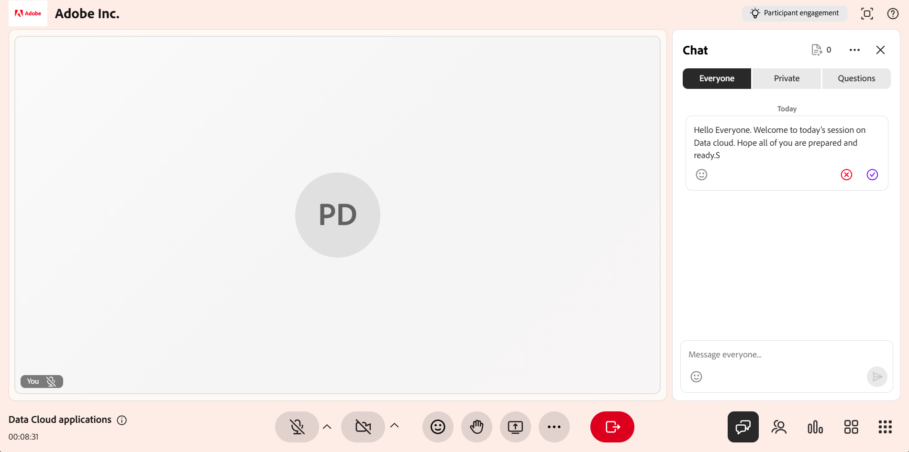
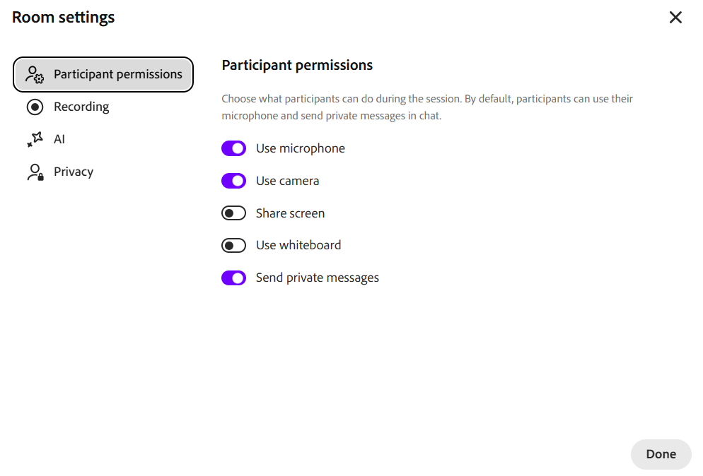

# Usar o painel Bate-papo como professor

Como professor, o painel Chat é o hub para gerenciar a comunicação durante uma sessão do Live Hub. Em um único painel, você pode acompanhar a discussão pública, manter conversas privadas e analisar as perguntas que a IA detecta no bate-papo. Você também pode moderar a conversa e responder com assistência de IA.

Este artigo aborda as ações disponíveis para os professores no painel Bate-papo, desde o acesso ao painel até o gerenciamento de mensagens e configurações.

## Acessar o painel de Bate-papo

Use o painel Bate-papo para gerenciar conversas, responder a alunos e monitorar perguntas durante uma sessão. O painel fornece acesso a discussões públicas, privadas e baseadas em perguntas em um só lugar.

Siga estas etapas para acessar o painel Chat:

1. Ingresse na sessão do Live Hub.

1. Selecione  na barra de controle. O painel Chat é aberto com a guia **Todos** selecionada por padrão, permitindo que você inicie ou participe de uma conversa em andamento.

1. Selecione uma das seguintes opções conforme necessário:

   1. Todos

   1. Privado

   1. Perguntas

   Guia Todos do 
   *O painel Chat abre a guia Todos, onde você pode seguir a conversa pública e alternar para as guias Privado e Perguntas.*

1. Digite sua mensagem e selecione **Enviar**.

## Configurações do painel de bate-papo

O painel de Bate-papo oferece opções para gerenciar conversas e personalizar sua experiência de bate-papo durante uma sessão. Você pode limpar mensagens, controlar notificações e ajustar o tamanho do texto conforme necessário.

*Menu de configurações do painel de bate-papo.*

As seguintes opções estão disponíveis nas configurações do painel de bate-papo:

| **Opção** | **Descrição** |
|----|----|
| **Limpar todos os chats** | Remove todas as mensagens do painel de chat. |
| **Desabilitar notificações de chat** | Desativa as notificações de bate-papo da sessão. |
| **Tamanho do texto** | Ajusta o tamanho das mensagens de chat para melhor legibilidade. As opções disponíveis são **Pequeno**, **Médio** e **Grande**. |

## Responder a mensagens de bate-papo

O recurso de resposta permite responder diretamente a uma mensagem específica, ajudando a manter o contexto durante as discussões e facilitando o acompanhamento das conversas.

Para responder a uma mensagem no chat:

1. Passe o mouse sobre a mensagem que você deseja responder.

1. Selecione **Responder**.

   
   *Selecione Responder em uma mensagem para responder diretamente a ela e manter a conversa no contexto.*

1. Digite sua resposta no campo de entrada da mensagem.

1. Selecione **Enviar**.

A resposta exibe um trecho da mensagem original junto com a resposta, ajudando os participantes a entender o contexto da conversa.

### Reagir a uma mensagem

Você também pode reagir a mensagens para confirmar ou responder rapidamente sem digitar uma resposta. Passe o mouse sobre uma mensagem e selecione uma reação. A reação selecionada aparece abaixo da mensagem e é visível para outros participantes no bate-papo.

*Uma reação aparece abaixo da mensagem e é visível para todos no bate-papo.*

## Editar as mensagens de bate-papo

O recurso de edição de mensagens permite atualizar uma mensagem após enviá-la, ajudando a corrigir ou refinar sua resposta.

Para editar uma mensagem no chat:

1. Passe o mouse sobre a mensagem que deseja editar.

1. Selecione **Editar**.

   
   *Selecione Editar para atualizar uma mensagem que você já enviou.*

1. Atualize a mensagem no campo de entrada.

1. Selecione **Salvar** para aplicar as alterações ou **Cancelar** para descartá-las.

A mensagem atualizada substitui a mensagem original no bate-papo e está marcada como **Editada**.

## Mencionar participantes nas mensagens de bate-papo

O recurso de marcação no painel Bate-papo permite que você aborde um aluno específico diretamente durante uma sessão. O uso de tags chama a atenção para a mensagem e melhora a visibilidade do aluno mencionado, especialmente durante as discussões ativas.

Para mencionar um aluno no chat:

1. No campo de entrada da mensagem, digite **@**.

1. Selecione o nome do participante na lista.

   
   *Digite @ para preencher a lista de participantes e selecionar o nome na lista.*

1. Digite sua mensagem.

1. Selecione **Enviar**.

O aluno marcado receberá uma notificação, e seu nome será destacado na mensagem para melhor visibilidade.

## Iniciar um chat privado

A guia **Particular** no painel de chat permite que você tenha mensagens privadas sem interromper a discussão pública. Você pode iniciar um novo bate-papo, continuar as conversas existentes ou se comunicar com alunos específicos.

Para iniciar um bate-papo privado:

1. Selecione a guia **Particular**. Uma lista de participantes é exibida.

   
   *A guia Particular lista os participantes para que você possa enviar mensagens somente aos professores ou a um aluno individual.*

1. Você pode fazer o seguinte:

   1. Selecione **Somente professores** na parte superior da lista para enviar mensagens para outros professores. As mensagens são visíveis apenas para professores.

   1. Selecione um aluno individual para iniciar uma conversa privada.

1. Digite sua mensagem e selecione **Enviar**. As mensagens são visíveis apenas para você e para o participante selecionado.

### Desativar bate-papo privado para alunos

Por padrão, os alunos podem conversar de forma privada com outros participantes. Como professor, você pode controlar se os alunos podem usar o bate-papo privado durante uma sessão.

Para desativar o bate-papo privado para alunos:

1. Abra **Configurações da sala**.

1. Selecione **Permissões do participante**.

   
   *Desative a opção Enviar mensagens privadas nas permissões de Participante para impedir que os alunos conversem em particular.*

1. Desabilitar **Enviar mensagens privadas**.

1. Selecione **Concluído**.

Uma vez desativado, os alunos não poderão mais iniciar ou participar de conversas privadas.

## Rascunho de respostas para perguntas de participantes com IA

A guia **Perguntas** ajuda os professores a gerenciar e responder às perguntas do aluno com mais eficiência. A IA detecta automaticamente perguntas do bate-papo e fornece respostas sugeridas para auxiliar os professores durante a sessão.

Para gerar uma resposta assistida por IA:

1. Navegue até a guia **Perguntas**.

1. Passe o mouse sobre a pergunta detectada.

1. Selecione **Rascunho de resposta usando IA**.

   
   *Selecione a resposta de rascunho usando IA para gerar uma resposta sugerida para uma pergunta detectada.*

1. (Opcional) Revise e edite a resposta sugerida.

1. Selecione **Enviar**.

A resposta gerada por IA é adicionada ao bate-papo e pode ser modificada antes de enviar para garantir a precisão e a relevância.

>[!NOTE]
>Se a pergunta não for coberta pelo conteúdo de referência carregado, o assistente do AI pode indicar uma mensagem de erro em vez de gerar uma resposta. Consulte o [Guia de solução de problemas do Live Hub](../kb/troubleshooting-guide-for-live-hub.md#answer-generation-toast-issues) para obter detalhes.

### Faça upload de arquivos para obter melhores respostas

Você também pode fazer upload de arquivos de referência para melhorar a precisão e a relevância das respostas geradas por IA.

Para carregar um arquivo:

1. Navegue até o canto superior direito do painel Chat.

   
   *Abra Fazer upload de referências de conteúdo para adicionar arquivos que ajudam a IA a gerar respostas mais precisas.*

1. Selecione **Carregar referências de conteúdo**. Uma janela pop-up de **conteúdo de referência QnA** é exibida.

1. Selecione **Procurar arquivos**.

   
   *Selecione Procurar arquivos na janela de conteúdo de referência QnA para carregar um arquivo de referência do sistema.*

1. Faça upload do arquivo do seu sistema.

A IA usa o conteúdo carregado para gerar respostas mais precisas e relevantes a perguntas na guia **Todos**.

>[!NOTE]
>Se o carregamento falhar ou o arquivo for rejeitado, consulte o [Guia de solução de problemas do Live Hub](../kb/troubleshooting-guide-for-live-hub.md#upload-content-issues) para obter uma lista de mensagens de erro comuns e como resolvê-las.

## Excluir mensagens

A opção excluir mensagem permite remover mensagens do bate-papo para manter as discussões focadas e relevantes. Você pode excluir suas próprias mensagens que não sejam relevantes para o tópico ou que causem interrupção na discussão.

*Exclua suas próprias mensagens para manter a discussão focada e relevante.*
