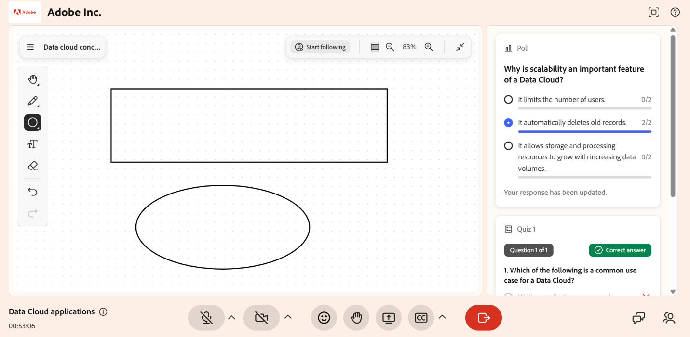

# Usar o quadro de comunicações como aluno

O quadro de comunicações fornece um espaço de trabalho visual compartilhado durante uma sessão do Live Hub. Quando o professor habilita o acesso ao quadro de comunicações, você pode desenhar, adicionar formas e texto e apagar conteúdo na tela compartilhada. Use o quadro branco para ilustrar ideias, resolver problemas e participar de atividades colaborativas em tempo real.

Este artigo explica como usar o quadro de comunicações no Live Hub como aluno.

## Usar o quadro de comunicações

Quando um professor permite que os alunos editem um quadro de comunicações, você pode interagir com um durante uma sessão ao vivo. Na sessão, você pode:

* Desenhe no quadro de comunicações usando a ferramenta de marcador.

* Adicione formas e texto para criar ou contribuir com conteúdo.

* Apague desenhos, formas ou objetos do quadro de comunicações.

*Os alunos podem desenhar, adicionar formas e texto e apagar conteúdo no quadro de comunicações compartilhado.*

Consulte [Usar ferramentas do quadro de comunicações](../getting-started-with-live-hub/share-a-whiteboard.md#use-whiteboard-tools) para obter mais informações.
