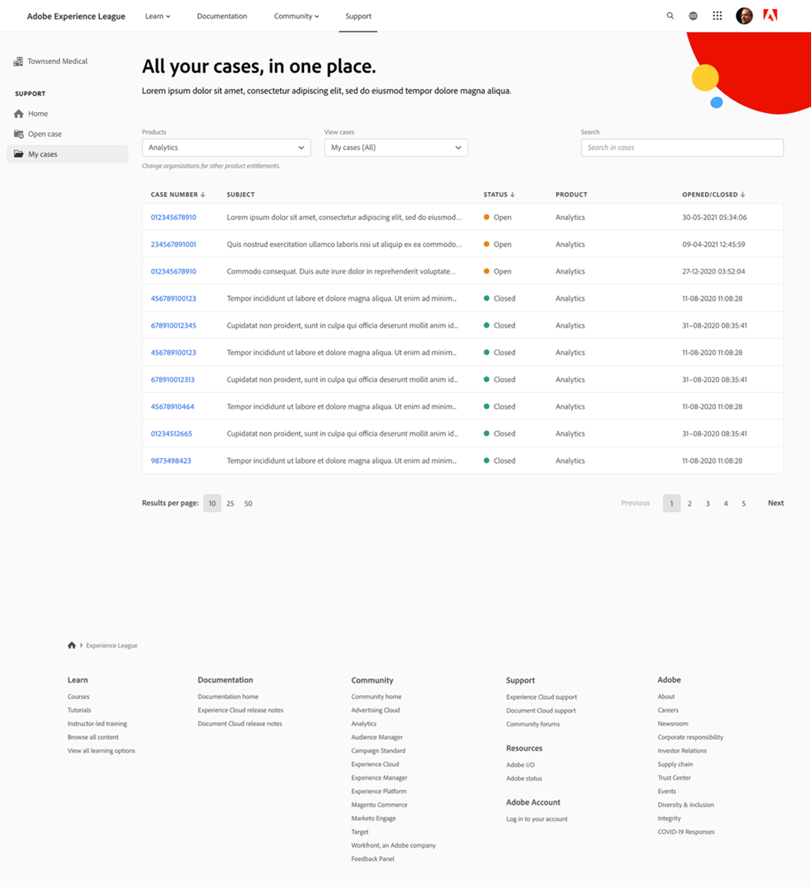

# Como enviar um tíquete de suporte no Experience League

O processo de envio de tíquetes de suporte da Adobe Learning Manager agora está diretamente integrado à plataforma de suporte da Experience League. Este é um portal de autoatendimento que foi recentemente reprojetado para oferecer mais personalização e facilidade de uso para clientes autorizados. Consulte este guia abaixo para obter mais informações sobre como acessar o portal de Suporte Experience League e registrar um chamado.

Observe que o envio de um tíquete de suporte só está disponível para contatos de suporte autorizados. Para suas dúvidas de suporte, continue enviando seus tíquetes de suporte para a Adobe Learning Manager por email até 11 de maio de 2025. Após essa data, você pode enviar seus tíquetes de suporte por meio do portal de suporte Experience League, conforme descrito abaixo, além do canal de e-mail existente.

1. Para acessar o portal de suporte, visite o site **[!UICONTROL Experience League]** e selecione a guia **[!UICONTROL Suporte]** localizada na parte superior da página. Você também pode visitar o [link direto](https://experienceleague.adobe.com/home#support).

   
   _Página inicial de suporte_

2. Na página inicial do **[!UICONTROL Suporte]**, você pode navegar facilmente até seus casos abertos, registrar um novo caso, exibir os principais artigos de suporte ou explorar recursos de aprendizado adicionais.

   
   _Abrir tíquete_

3. Para enviar um caso, selecione a opção **[!UICONTROL Abrir um caso de suporte]**. Você também pode selecionar a opção **[!UICONTROL Abrir Tíquetes]** no menu da barra lateral. Você será direcionado para a página de criação do caso, na qual poderá inserir o nome do seu produto (Adobe Learning Manager, Audience Manager, Campaign, Target etc.), o **[!UICONTROL título do caso]** e a **[!UICONTROL descrição do caso]**. Para agilizar o processo de solução de problemas, seja o mais descritivo possível ao descrever o problema que você está enfrentando.

   No final do formulário, preencha os seguintes campos para nos fornecer informações mais específicas que nos ajudarão a solucionar o problema:

   * Motivo do problema (selecione a lista suspensa apropriada para um tipo de problema)
   * ID da Conta
   * Função (administrador, autor, aluno, administrador de integração etc.)
   * Prioridade do caso (Baixa, Média, Alta, Crítica)
   * Impacto nos negócios
   * Fuso Horário
   * Opção para Copiar usuários desejados.

   Por fim, certifique-se de carregar todos os arquivos relevantes antes de clicar em **[!UICONTROL Enviar]**. (O tamanho do anexo não é superior a 24 MB)

   
   _Formulário de tíquete_

4. Depois de clicar em **[!UICONTROL Enviar caso]**, você será redirecionado para a página **[!UICONTROL Meus casos]**, onde poderá exibir todos os casos que sua organização enviou. Você também pode navegar para esta página clicando no botão **[!UICONTROL Meus casos]** no menu da barra lateral. Nesta página, você poderá exibir todos os casos de suporte abertos e fechados. Usando as opções na parte superior da página, você pode filtrar por status do caso (aberto ou fechado) ou por solução de Experience Cloud. Você também pode usar a barra de pesquisa para procurar quaisquer palavras-chave relacionadas aos seus problemas de suporte.

   
   _Casos abertos_

5. Para exibir mais detalhes sobre um caso, clique no caso para acessá-lo. Na exibição de caso, você pode ver os comentários mais recentes com o proprietário do caso atribuído e adicionar outros anexos ou respostas desejados.

Você pode transferir um caso selecionando a opção “Transferir para o gerenciamento” no lado direito da página em Detalhes do caso. Você também pode fechar o caso selecionando o botão “Fechar caso”.

## Notas adicionais

Para que nossa equipe de liderança de suporte resolva seus encaminhamentos da maneira mais eficiente, envie um encaminhamento de caso somente se ele estiver afetando seriamente sua organização, parceiros ou clientes.

Se você tiver mais dúvidas sobre como usar o portal de **[!UICONTROL Suporte do Experience League]**, informe-nos na seção de comentários abaixo ou entre em contato com nossa equipe de Suporte diretamente neste endereço de email [almdynsupp@adobe.com](mailto:almdynsupp@adobe.com).

Para adicionar um contato autorizado que possa abrir tíquetes de suporte via Experience League (EXL), visite [http://licensing.adobe.com](http://licensing.adobe.com).

