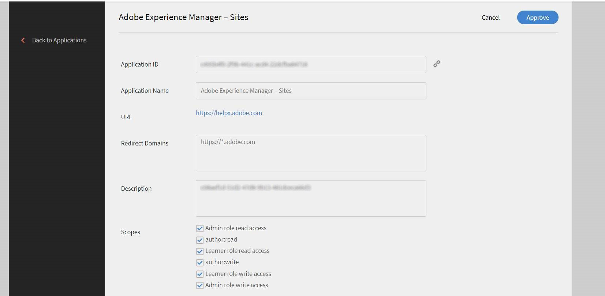
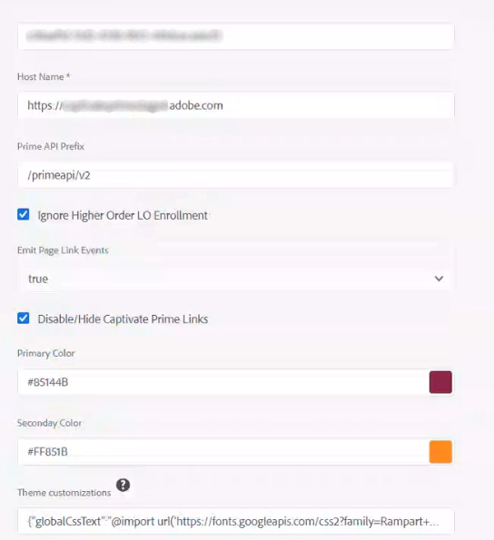

# Integrar o Learning Manager ao AEM

O Learning Manager é um Sistema de Gerenciamento de Aprendizado com um Sistema de Gerenciamento de Conteúdo de Aprendizado interno. Os usuários gerenciam seu conteúdo de aprendizado fazendo upload dele no Learning Manager para que ele execute o controle de versão, a alocação dos cursos, a definição da visibilidade para os alunos, o rastreamento do consumo e o relatório para os administradores.

No entanto, há usuários que armazenam e gerenciam seu conteúdo em sistemas de gerenciamento de ativos. O conteúdo então é redirecionado para várias outras funções.

As várias tiras presentes no aplicativo do aluno podem ser incorporadas nos sites do AEM. Qualquer aluno que entrar no site do AEM verá seus dados de treinamento específicos nessas faixas.

## Baixar o pacote de conteúdo {#downloadthecontentpackage}

O instalador é enviado como um pacote de conteúdo AEM. [***Baixar o pacote***](https://github.com/adobe/adobe-learning-manager-reference-site).

O pacote de conteúdo está disponível com arquivo zip e é compatível com AEM 6.4 e AEM 6.5.

## Instalar o componente do Learning Manager {#installcaptivateprimecomponent}

Instale o pacote de conteúdo do Learning Manager usando o Gerenciador de pacote AEM:

>[!NOTE]
>
>Para obter informações sobre a instalação de pacotes, consulte  [***Como trabalhar com pacotes***](https://experienceleague.adobe.com/docs/experience-manager-65/administering/contentmanagement/package-manager.html?lang=en#how-to-work-with-packages).

1. Como autor de AEM, abra o Gerenciador de pacotes AEM.
1. Clique no botão **[!UICONTROL Carregar pacote]**.
1. Clique em **[!UICONTROL Procurar]** e faça upload do pacote de conteúdo.
1. Clique em **[!UICONTROL Carregar]**.
1. Após o upload do pacote, instale o pacote de conteúdo selecionando-o e clicando em **[!UICONTROL Instalar]**.

   

   *Instalar o pacote de conteúdo*

## Gerar o token de atualização {#generatetherefreshtoken}

O administrador AEM requer um token de atualização da conta do Learning Manager. O administrador de integração do Learning Manager gerará o token de atualização.

1. Aprove o aplicativo em destaque do AEM Sites.

   Clique em **[!UICONTROL Aplicativos]** > **[!UICONTROL Aplicativos em destaque]** > **[!UICONTROL Adobe Experience Manager - Sites]**.

   

   *Aprovar o aplicativo*

1. Clique em **[!UICONTROL Aplicativos]** > **[!UICONTROL Aplicativos em destaque]** e abra o aplicativo de sites AEM.

   Copiar a ID do aplicativo e a descrição.

1. Clique em **[!UICONTROL Recursos do desenvolvedor]** > **[!UICONTROL Tokens de acesso]**.

   

   *Gerar os tokens de acesso*

1. Insira os seguintes detalhes:

   * ID do cliente, que é a ID do aplicativo.
   * Segredo do cliente, que está presente em Descrição.

1. Obtenha o código OAuth. Você deve usar a API v2 no URI de redirecionamento.
1. Clique em **[!UICONTROL Enviar]** e obtenha o token de atualização.

## Configurar o widget no AEM {#configurethewidgetinaem}

Para a configuração do widget, o autor do AEM requer apenas o token de atualização fornecido pelo administrador de integração do Learning Manager.

Você também pode definir várias configurações de conta em várias páginas.

1. Clique em **[!UICONTROL Ferramentas]** > **[!UICONTROL Cloud Service]** > **[!UICONTROL Configuração do widget do Learning Manager]**.
1. Clique em **[!UICONTROL Criar]**.
1. Insira o token de atualização aqui. Defina as outras configurações.
1. O nome do host deve ser alterado para “learningmanagereu” para as regiões da UE.
1. Salvar e fechar a configuração.
1. Selecione uma configuração e publique-a.

## Autor do AEM {#aemauthor}

O autor do AEM deve primeiro adicionar o componente no modelo AEM

O autor do AEM poderá arrastar e soltar o componente Adobe Learning Manager e configurar adequadamente.

O componente do Learning Manager requer que a configuração criada na etapa acima seja mapeada para a página.  O autor pode mapear a configuração editando as propriedades da página em **[!UICONTROL Avançado]** > **[!UICONTROL Configuração]** > **[!UICONTROL Configuração da nuvem]** e forneça o caminho de configuração. Dessa forma, o autor pode criar configurações para várias contas do Learning Manager e mapear cada uma para páginas de sites diferentes. Se uma configuração não for mapeada para a página, o componente lerá a configuração da página principal recursivamente até encontrar uma.

## Aluno {#learner}

O aluno pode fazer os cursos na página.

Para poder acessar o widget do Learning Manager, o aluno deve ser um usuário de AEM conectado. Além disso, a propriedade **email** deve estar presente no nó “/profile” do nó rep:User do aluno. Este e-mail deve ser exatamente igual ao da conta do Learning Manager.

O aluno pode fazer os cursos na página.

O progresso do curso também é salvo.

Os seguintes widgets são fornecidos:

1. Gamificação
1. Calendário de aprendizado
1. Widget social
1. Widget Catálogo
1. Meu aprendizado
1. Recomendação baseada na aprendizagem entre pares
1. Recommendations por administrador
1. Recomendação baseada nos interesses do aluno

Se não houver recomendações, o widget aparecerá em branco.

## Suporte para Skyline

Skyline é a versão em nuvem do AEM. Você deve primeiro instalar o Skyline a partir do gerenciador de pacotes. Para usar o componente do Skyline no AEM, um usuário deve estar presente na conta do Learning Manager. Em outras palavras, o endereço de email do usuário deve existir na conta.

### Implantar o Skyline

As etapas para configurar o Skyline estão descritas na seção  [Repositório GitHub](https://github.com/adobe/captivate-prime-aem-components).

## Widget Catálogo

O widget Catálogo exibe o treinamento de um catálogo específico ou de um conjunto de catálogos para um usuário. Na seção Propriedades nas propriedades da página, selecione Catálogo nas opções listadas.

<!---->

O widget Catálogo contém as seguintes opções:

* **[!UICONTROL IDs do catálogo]:** IDs de catálogo separados por vírgula para os quais o treinamento precisa ser exibido.
* **[!UICONTROL Classificar]:** Ordem de classificação para o treinamento. As opções são: nome, data, data de criação, data de inscrição e assim por diante.
* **[!UICONTROL Estado do aluno]:** Retorna todos os treinamentos que usam os seguintes filtros: inscrito, iniciado, concluído e não inscrito. Os resultados da pesquisa não serão exibidos se a opção de classificação for data de inscrição, data de conclusão ou data de inscrição.
* **[!UICONTROL Nome da habilidade]:** A habilidade usada para filtrar o treinamento exato.
* **[!UICONTROL Nome da etiqueta]:** A marca usada para filtrar os resultados exatos.

Veja aqui alguns componentes adicionais que você pode personalizar:

**[!UICONTROL Tipos de objetos de aprendizado]:** Filtre de acordo com o tipo do Objeto de aprendizado. Os tipos suportados são: curso, certificação, ajuda de tarefa e programa de aprendizado.

No AEM, o título de um cartão em uma tira estará vazio inicialmente. Em Propriedades, digite o nome do título em widgets.html.

**Personalização**

Você pode personalizar a aparência do layout usando widgets.html. Você pode alterar a aparência dos cartões que aparecem e personalizar o tema.

No menu **[!UICONTROL Configurações gerais]** você pode escolher as cores primárias e secundárias para os cartões e especificar as propriedades para personalizar o tema.

```
{ 
 "globalCssText":"@import url('https://fonts.googleapis.com/css2?family=Grandstander:ital,wght@0,100;0,200;0,300;0,400;0,500;0,600;0,700;0,800;0,900;1,100;1,200;1,300;1,400;1,500;1,600;1,700;1,800;1,900&family=Montserrat:ital,wght@0,100;0,200;0,300;0,400;0,500;0,600;0,700;0,800;0,900;1,100;1,200;1,300;1,400;1,500;1,600;1,700;1,800;1,900&display=swap');", 
 "fontNames":"Grandstander", 
 "cardLayout":{ 
 "cardLayoutName":"compact", 
 "cardPrimaryColor":"#376BA4", 
 "cardSecondaryColor":"#F98EB0", 
 "startedStateTextColor":"#ffffff", 
 "continueStateTextColor":"#ffffff", 
 "revisitStateTextColor":"#ffffff", 
 "startedStateColor":"#a0a0a0", 
 "continueStateColor":"#f9a122", 
 "revisitedStateColor":"#7fbc64", 
 "textPrimaryColor":"#ffffff", 
 "textSecondaryColor":"#d93f3f", 
 "navIconColor":"#a0a0a0" 
 } 
}
```

### Ignorar inscrição do OA de ordem superior

Se a opção **Ignorar inscrição do OA de ordem superior** A caixa de seleção está ativada e um usuário está inscrito diretamente em um programa de aprendizado ou certificação. Os cursos para essa certificação ou programa de aprendizado aparecerão para o usuário nos widgets.

Se a caixa de seleção estiver desativada, os cursos presentes no Programa de aprendizado ou na Certificação, nos quais o usuário não se inscreveu diretamente, não aparecerão.



*Marque a caixa de seleção Ignorar inscrição do OA de ordem superior.

A configuração é então aplicada no widget.

### Segurança

Os campos ID do cliente e Segredo do cliente são adicionados. Além disso, o token de atualização fica mascarado. Depois que um usuário cria a configuração inteira, se ele abrir a configuração novamente para editá-la ou se algum outro usuário abrir essa configuração, o token de atualização será mascarado.
