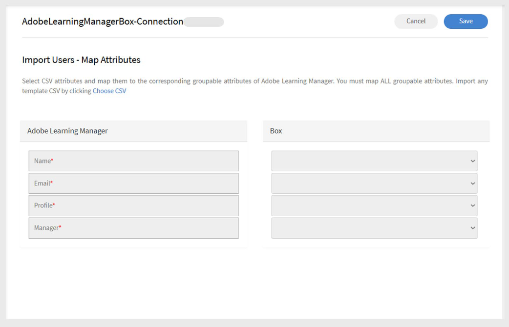

# Conector Box no Adobe Learning Manager

## Introdução

O **conector do Box** no Adobe Learning Manager permite a integração perfeita com sistemas externos, automatizando a importação e exportação de dados do usuário e de aprendizado através de arquivos CSV. Os sistemas externos podem colocar arquivos CSV em pastas designadas na conta do Box gerenciada pela Adobe Learning Manager, onde são processados automaticamente com base em um agendamento definido.

Com esse conector, os administradores podem:

- Importe usuários internos de arquivos CSV.
- Exportar dados de habilidades do usuário e transcrições do aluno para sistemas externos.
- Importe instruções de atividade da xAPI de sistemas de terceiros compatíveis.

O conector é compatível com mapeamento de atributos, sincronização programada e execução sob demanda, ajudando as organizações a manter atualizados os dados do usuário e de aprendizado em todas as plataformas.

## Configurar o conector do Box

Para configurar o conector do Box no Adobe Learning Manager:

1. Faça logon no Adobe Learning Manager como administrador de integração.
2. Passe o mouse sobre o bloco **Caixa**.
3. Selecione **Conectar**.

   
   _Selecione Conectar para configurar o conector do BoxSelecione Conectar para configurar o conector do Box_

4. Digite o endereço de email da pessoa que gerenciará a conta do Adobe Learning Manager Box da sua organização.
5. Selecione **Conectar**.

### Ativar a conta

1. O Adobe Learning Manager envia um link de redefinição de senha para a ID de e-mail fornecida.
2. O usuário deve redefinir a senha antes de acessar a conta do Box pela primeira vez.

>[!NOTE]
>
>Somente uma conta do Box pode ser configurada por conta da Adobe Learning Manager.

Na página **Visão geral**, selecione uma das seguintes ações:

- **Importar Uso Interno**
- **Importar relatório de atividades da xAPI**
- **Exportar Habilidades do Usuário**
- **Exportar transcrição do aluno**
- **Exportar relatório de atividades da xAPI**

Depois de conectado, o conector do Box estará pronto para sincronizar os dados entre o Adobe Learning Manager e seus sistemas externos.

## Importar usuários internos

A funcionalidade de importação de usuário permite a sincronização automatizada de dados de funcionários de sistemas de RH e outras fontes externas no Adobe Learning Manager.

### Mapear atributos

O mapeamento de atributos cria a conexão entre seus dados externos e a estrutura de dados compatível do Adobe Learning Manager, garantindo que os dados sejam inseridos nos campos corretos. Essa etapa é obrigatória.

Para mapear atributos:

1. Selecione **Usuários internos** na página do conector do Box.
2. Selecione **Mapeamento de Colunas**.
3. Na página **Mapear atributos**:
   - O lado esquerdo mostra os campos obrigatórios do Adobe Learning Manager.
   - O lado direito mostra os nomes das colunas CSV. Inicialmente, este lado contém listas suspensas vazias.
   - Selecione **Escolher CSV** para carregar um arquivo CSV de exemplo. Isso preenche o menu suspenso do lado direito com os nomes de coluna do seu CSV. Consulte [este artigo](https://experienceleague.adobe.com/pt-br/docs/learning-manager/using/integration/migration-manual#csv) para obter CSVs de amostra.
   - Mapeie cada campo do Adobe Learning Manager com a coluna CSV correspondente.

   
   _Interface de mapeamento de atributos mostrando os campos do Adobe Learning Manager à esquerda e as listas suspensas de colunas CSV à direita_

4. Selecione **Salvar** para concluir o mapeamento.

Depois de salvar, a conta configurada aparece como uma fonte de dados no aplicativo do administrador. Os administradores podem agendar uma importação ou acionar uma sincronização manual.

### Importar instruções da xAPI

A importação de instruções da xAPI permite o rastreamento detalhado da atividade de aprendizado, trazendo dados de aprendizado externos para o Adobe Learning Manager.

_Configurar origem_

A configuração da origem da xAPI estabelece a conexão entre os sistemas de aprendizado externos e o controle de atividades da Adobe Learning Manager.

Para configurar uma origem:

1. Navegue até a seção de configuração da xAPI.
2. Selecione **Adicionar uma nova Configuração** na lista de configurações.
3. Digite o **Nome** e o **Nome do Arquivo de Origem**.
   - Nome: identificador descritivo para esta origem xAPI (por exemplo, Integração LMS ou Sistema de treinamento externo).
   - Nome do arquivo de origem: o nome do arquivo exato que será carregado na pasta do Box (deve corresponder exatamente, incluindo a extensão do arquivo).

   
   _Formulário de configuração mostrando o campo de nome e o campo de nome do arquivo de origem_

4. Selecione **Salvar** para criar a configuração básica.

_Adicionar filtros (opcional)_

Os filtros permitem importar seletivamente instruções xAPI com base em critérios específicos.

Para adicionar um filtro para origem:

1. Selecione **Filtro** no painel esquerdo.
2. Selecione **Adicionar novo filtro**.
3. Configure o seguinte:
   - **Nome:** Nome descritivo para a regra de filtro.
   - **Condição:** Operador de comparação (igual, contém, maior que, etc.).

   
   _Caixa de diálogo de criação de filtro mostrando os campos Nome e Condições_

4. Selecione **Adicionar novo filtro** para adicionar mais filtros.
5. Selecione **Salvar** ou **Excluir** conforme necessário na coluna **Ações**.
6. Após adicionar os filtros, selecione **Salvar**.

## Agendar a importação

O agendamento automatizado garante a sincronização consistente dos dados sem intervenção manual, mantendo os registros atuais da atividade de aprendizado.

Para agendar a importação:

1. Selecione **Configurar agendamento** no painel esquerdo.

   
   _Página de configuração de agendamento mostrando as opções de habilitação e controles de tempo_

2. Selecione **Habilitar importação de instruções xAPI usando esta conexão**.
3. Selecione **Habilitar agendamento** para configurar importações automáticas.
4. Defina os seguintes parâmetros de agendamento:

   - **Data de Início:** Quando as importações agendadas devem começar.
   - **Hora:** Hora do dia da execução da importação.
   - **Repetir após:** Com que frequência as importações devem ser executadas (intervalos diários, semanais, personalizados).
5. Selecione **Salvar**.

## Executar sob demanda (opcional)

A execução sob demanda fornece importações de dados imediatas fora das operações programadas regulares.

Quando usar importações por demanda:

- Testando novas configurações antes de agendar.
- Processando atualizações de dados urgentes ou com prazo apertado.
- Manipular correções ou migrações de dados ocasionais.
- Solução de problemas de importação.

Para importar manualmente instruções da xAPI:

1. Selecione **Sob Demanda** no painel esquerdo.
2. Selecione **Executar**.

## Exibir status da execução

O monitoramento de status permite o gerenciamento pró-ativo de operações de importação e a rápida identificação de problemas.

Para exibir o status da execução:

1. Selecione **Status de Execução** para ver uma lista de todas as execuções de importação.
2. A página de status mostra:

   - **Data de Início:** quando a operação de importação começou
   - **Duração:** tempo total necessário para o processamento
   - **Tipo de importação:** se a importação foi agendada ou por demanda
   - **Status atual:** informações de status em tempo real
      - **Em andamento:** importação atualmente em execução
      - **Concluído:** conclusão bem-sucedida com contagens de registros
      - **Falha:** erro com informações de diagnóstico
