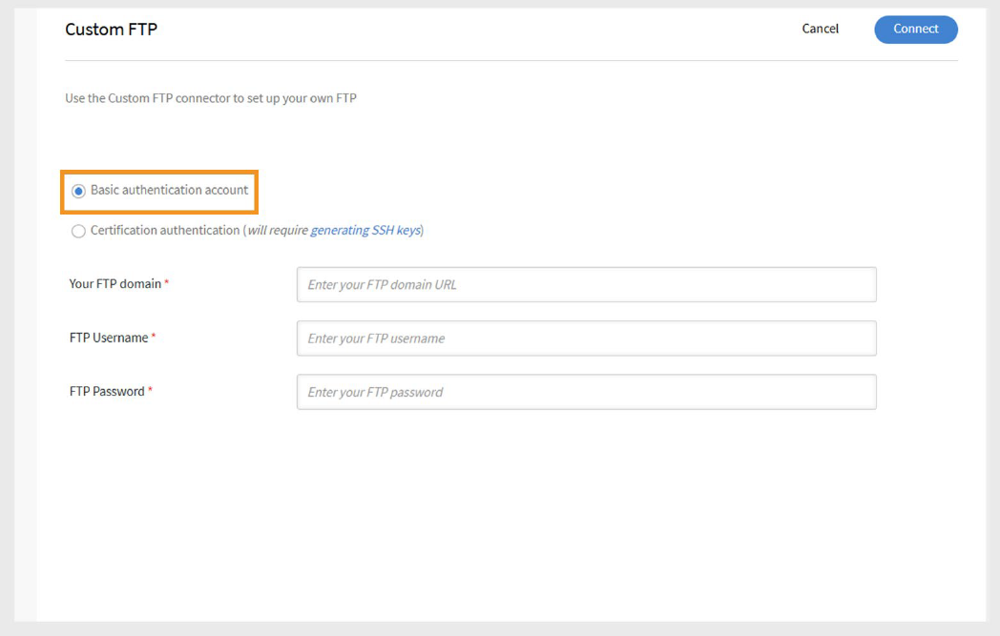

# Conector FTP personalizado no Adobe Learning Manager

## Introdução

O conector FTP personalizado no Adobe Learning Manager permite a troca segura e automatizada de dados entre o Adobe Learning Manager e o servidor FTP (SFTP) da sua organização. Com essa integração, os administradores podem importar dados do usuário de sistemas externos e exportar transcrições do aluno ou dados de habilidades de maneira programada. Essa configuração simplifica a sincronização de dados, reduz o trabalho manual e dá suporte à integração perfeita com sistemas de relatórios ou RH de terceiros. A configuração requer coordenação com a equipe de TI e assistência do Gerente de sucesso do cliente (CSM) da Adobe.

>[!NOTE]
>
>Para configurar uma conexão FTP personalizada, entre em contato com seu Gerente de sucesso do cliente (CSM). O processo de configuração pode envolver a ajuda da equipe de TI para incluir na lista de permissões endereços IP, abrir portas necessárias e criar pastas com as permissões de acesso necessárias.

## Recursos compatíveis

O conector FTP personalizado suporta as seguintes ações:

### Importação de dados

O processo de importação de usuário busca automaticamente dados de funcionários do servidor FTP e os importa para o Adobe Learning Manager. Isso é útil ao integrar vários sistemas que geram arquivos CSV contendo dados do usuário.

- Coloque os arquivos CSV na pasta **importar** designada no servidor FTP.
- O Adobe Learning Manager detecta os arquivos, mescla-os, se necessário, e importa os dados do usuário com base no agendamento definido.

Consulte a seção [Agendamento](/help/migrated/integration-admin/feature-summary/custom-ftp-connector.md#scheduling-reports) para saber como automatizar este processo.

### Mapeamento de atributos

Como administrador de integração, você pode mapear as colunas do arquivo CSV para atributos agrupáveis no Adobe Learning Manager.

- O mapeamento é uma configuração única.
- O mesmo mapeamento é usado para importações subsequentes.
- Você poderá reconfigurar mapeamentos se a estrutura de dados for alterada.

### Exportação de dados

O Adobe Learning Manager permite exportar:

- Habilidades do usuário
- Transcrições do aluno

Esses arquivos de relatório são colocados na pasta de exportação em seu FTP e podem ser consumidos por sistemas de terceiros para relatórios, análises ou outros processos de downstream.

### Agendamento de relatórios

Os administradores de integração podem agendar:

- Importações de usuário
- Exportações de transcrição do aluno

O agendamento garante que o ambiente Adobe Learning Manager esteja sempre atualizado com os sistemas de origem. Você pode configurar sincronizações diárias ou intervalos personalizados conforme necessário.

## Configurar o conector FTP personalizado

Para configurar o conector FTP personalizado:

1. Faça logon no Adobe Learning Manager como administrador de integração.
2. Passe o mouse sobre o bloco **FTP personalizado** e selecione **Conectar**.

   
   _Selecione Conectar para configurar o conector FTP personalizado_

### Escolher método de autenticação

Você pode configurar a conexão FTP personalizada usando um destes dois tipos de autenticação:

#### Conta de autenticação básica

1. Digite os seguintes detalhes:

   - **Seu domínio FTP**
   - **Nome de Usuário do FTP**
   - **Senha de FTP**

   
   _Digite o domínio FTP, o nome de usuário e a senha para a configuração._

2. Selecione **Conectar**.

#### Autenticação de certificado

Se o servidor FTP oferecer suporte à autenticação de chave SSH:

1. Selecione **Gerar chave SSH**.

   
   _Selecione Gerar chave SSH para baixar a chave_

2. A chave pública será baixada para o seu computador.
3. Adicione esta chave à lista de chaves autorizadas do servidor FTP.
4. Digite os seguintes detalhes:

   - **Seu domínio FTP**
   - **Nome de Usuário do FTP**
5. Selecione **Conectar**.

>[!NOTE]
>
>Somente servidores **SFTP** têm suporte para a configuração personalizada de FTP.

## Configuração pós-conexão

Depois que a conexão for estabelecida:

- O Adobe Learning Manager cria automaticamente pastas para **importar** e **exportar** em seu servidor FTP.
- Você pode começar a importar e exportar dados com base nas configurações de agendamento e mapeamento.
