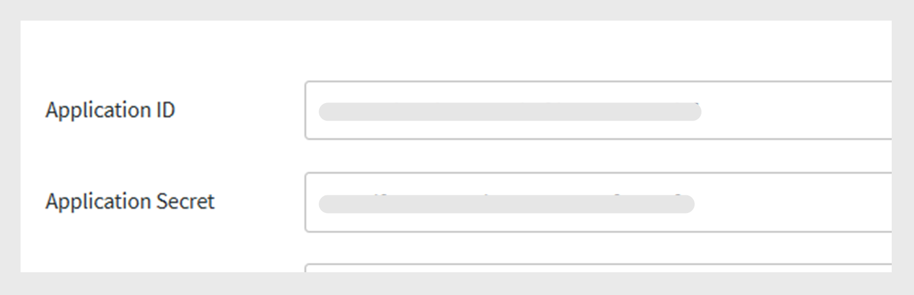
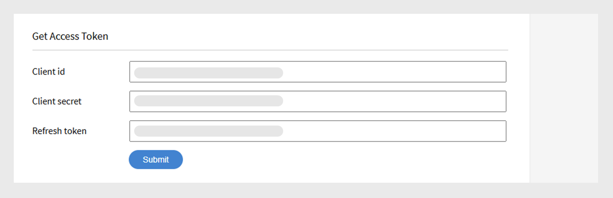

# Manual do desenvolvedor do Adobe Learning Manager

## Visão geral

A Adobe Learning Manager fornece APIs RESTful que permitem aos desenvolvedores integrar e personalizar aplicativos ou fluxos de trabalho de forma eficaz. O Manual do Desenvolvedor oferece orientação sobre como usar essas APIs, abrangendo tópicos como autenticação, modelos de dados e integração com outros aplicativos. Além disso, este guia, a [documentação de referência da API](https://learningmanager.adobe.com/docs/primeapi/v2/), ajuda os desenvolvedores a criar aplicativos externos ou fluxos de trabalho de back-end que interagem com vários recursos do Adobe Learning Manager, incluindo a criação do curso, o acompanhamento do progresso do aluno, o mapeamento de habilidades, a certificação, a gamificação e as transcrições.

Este manual abrange o seguinte:

* Autenticação OAuth2.0
* Modelos de objeto da API
* Incluir campos e outros parâmetros
* Casos de uso reais

>[!IMPORTANT]
>
>Este manual do desenvolvedor abrange exclusivamente as APIs V2 do Adobe Learning Manager. Todos os exemplos, estruturas de solicitação e fluxos de trabalho de autenticação descritos neste guia são específicos dos endpoints /primeapi/v2/. Para obter informações sobre versões antigas ou APIs obsoletas, consulte a [documentação de referência da API](https://learningmanager.adobe.com/docs/primeapi/v2/).

## Cenários de uso da API

Os desenvolvedores podem usar as APIs do Learning Manager para aprimorar ou integrar o Learning Manager a outros aplicativos corporativos. Você pode criar aplicativos para a Web, desktop ou dispositivos móveis usando qualquer tecnologia. Os desenvolvedores podem acessar os dados do Learning Manager, mas você controla onde e como o aplicativo é usado.

## Autenticação usando OAuth 2.0

Para acessar as APIs do Adobe Learning Manager com segurança, você deve se autenticar usando o mecanismo OAuth 2.0 do Adobe Learning Manager. Esse processo inclui o registro do aplicativo, a geração de um código de autorização, a troca dele por um token de atualização e, por fim, o uso do token de atualização para obter um token de acesso.

### Registrar um aplicativo

Integre o Adobe Learning Manager a aplicativos externos para aumentar a versatilidade. As etapas envolvem acessar a interface do administrador de integração, registrar o aplicativo e obter a ID de cliente e o segredo. Gerar tokens de autenticação OAuth 2.0, incluindo tokens de autorização, atualização e acesso, do Adobe Learning Manager. Use o fluxo do OAuth 2.0 para autenticar e autorizar com segurança seu aplicativo. O token de acesso tem validade de sete dias.

1. Faça logon no Adobe Learning Manager como administrador de integração.
2. Selecione **[!UICONTROL Aplicativos]** no painel esquerdo.

   

3. Selecione **[!UICONTROL Registrar]** e adicione as seguintes informações:

   * **[!UICONTROL Nome do Aplicativo]**: digite o nome do seu aplicativo (máximo de 50 caracteres).
   * **[!UICONTROL URL]**: a URL oficial da sua empresa ou aplicativo. Usado para identificação e referência.
   * **[!UICONTROL Domínios de redirecionamento]**: especifique os domínios (por exemplo, [http://learningmanager.adobe.com](http://learningmanager.adobe.com)) para os quais o Adobe Learning Manager pode redirecionar após a autorização.  É possível especificar vários URLs válidos.
   * **[!UICONTROL Descrição]**: breve descrição do que o aplicativo faz.
   * **[!UICONTROL Escopos]**: selecione uma das seis opções disponíveis para definir o escopo do seu aplicativo. Com base na sua escolha mencionada aqui, os endpoints da API do Learning Manager estão acessíveis para o seu aplicativo. Por exemplo, se você escolheu o acesso de leitura da função do aluno, todos os pontos de extremidade da API do aluno do Learning Manager são somente leitura acessíveis ao seu aplicativo.

      * Acesso de leitura/gravação da função de administrador: permite que o aplicativo acesse ou modifique dados como administrador.
      * Acesso de leitura/gravação da função do aluno: permite que o aplicativo acesse ou modifique os dados dos alunos.
      * Acesso de leitura/gravação xAPI: permite que o aplicativo acesse e envie instruções da Experience API (xAPI).

   * **[!UICONTROL Apenas para esta conta?]**

      * **[!UICONTROL Sim]** - se você escolher Sim, o aplicativo não estará visível para outros administradores de conta.
      * **[!UICONTROL Não]** - se você escolher Não, outros administradores de conta também poderão acessar este aplicativo, mas precisarão usar a ID do aplicativo para acessar este aplicativo. A ID do aplicativo é gerada e exibida no modo Edição do aplicativo Learning Manager.

     

4. Selecione **[!UICONTROL Salvar]** para registrar o aplicativo.

   * Depois de registrar o aplicativo, ele fica disponível na lista de aplicativos criados na conta. Selecione o aplicativo e você verá o seguinte, além dos campos inseridos anteriormente:
   * ID do aplicativo: é a ID do cliente. Essa ID informa ao Adobe Learning Manager o aplicativo que está solicitando acesso. Está incluído em solicitações de API para identificar o aplicativo.
   * Segredo do aplicativo: é usado para autenticar seu aplicativo e verificar sua identidade durante as etapas de troca de tokens (por exemplo, ao solicitar um token de atualização ou um token de acesso).

   

## Obter um token de acesso

### Obter o código de autorização

Depois de obter a ID do cliente e o Segredo do cliente, use-os para solicitar um token de acesso, que é usado para autenticar chamadas de API.

Para iniciar o fluxo do código de autorização, adicione o seguinte URL em um navegador:

```
GET https://learningmanager.adobe.com/oauth/o/authorize?client_id=<Enter your clientId>&redirect_uri=<Enter a url to redirect to>&state=<Any String data>&scope=<one or more comma separated scopes>&response_type=CODE 
```

Depois que o usuário autoriza o aplicativo, o Adobe Learning Manager redireciona para o redirect_uri especificado com um parâmetro de consulta anexado:

[https://yourapp.com/callback?code=abc123xyz](https://yourapp.com/callback?code=abc123xyz)

Um código de parâmetro é anexado junto com o uri de redirecionamento.

### Obter token de atualização do código

Depois de obter o código, use qualquer ferramenta da API e adicione a seguinte solicitação de POST:

```https://learningmanager.adobe.com/oauth/token ```

**Corpo da Solicitação (x-www-form-urlencoded)**:

```
grant_type=authorization_code  
&code=abc123xyz  
&client_id=<your_client_id>  
&client_secret=<your_client_secret>  
&redirect_uri=<your_redirect_url> 
```

**Resposta**

```
{ 

  "access_token": "eyJhbGciOiJIUzI1...", 
  "refresh_token": "xTjlfz0jCk6gF1...", 
  "expires_in": 604800, 
  "token_type": "Bearer" 

} 
```

Use o access_token no cabeçalho de autorização para fazer solicitações de API autenticadas.

### Usar o token de acesso em uma chamada de API

Verifique o token de acesso usando o seguinte:

```
GET https://learningmanager.adobe.com/oauth/token/check?access_token=<access_token> 
```

Um token de acesso é válido por sete dias. Após sete dias, você precisa gerar um novo token de acesso usando o token de atualização. Se você gerar um novo token de acesso a partir do token de atualização enquanto um token de acesso existente ainda for válido, o token existente será retornado.

### Obter tokens de acesso para teste e desenvolvimento

Ao trabalhar com APIs do Adobe Learning Manager, os desenvolvedores precisam de um token de acesso OAuth 2.0 válido para autenticar solicitações de API. A geração desse token por meio do fluxo OAuth padrão pode ser complexa e demorada, especialmente para testes rápidos, aprendizado ou desenvolvimento. O Adobe Learning Manager fornece uma ferramenta de geração de token para simplificar esse processo.

Essa ferramenta é ideal durante:

* Compilações de prova de conceito (POC)

* Desenvolvimento em fase inicial

* Solução de problemas de integração da API

Esses tokens são destinados exclusivamente para uso pessoal durante as fases de desenvolvimento e depuração. Lembre-se de que os tokens de teste concedem acesso aos seus dados do Adobe Learning Manager, por isso é essencial manipulá-los com segurança. Nunca compartilhe seus tokens de teste com outras pessoas, use-os em aplicativos de produção ou inclua-os em repositórios de código públicos. Trate-os como senhas para garantir a segurança da sua conta e dos seus dados.

1. Faça logon no Adobe Learning Manager como administrador de integração.
2. Selecione **[!UICONTROL Recursos do Desenvolvedor]** e depois **[!UICONTROL selecione Tokens de Acesso para Teste e Desenvolvimento]**.

   

3. Digite a **[!UICONTROL ID do cliente]** obtida após a criação de um aplicativo para obter o código OAuth. Depois, selecione **[!UICONTROL Enviar]**.

   

4. Adicione a **[!UICONTROL ID do Cliente]** e o **[!UICONTROL Segredo do Cliente]** para obter o token de atualização. Depois, selecione **[!UICONTROL Enviar]**. O OAuth é preenchido previamente a partir da etapa anterior.

   

5. Adicione a ID do cliente e o Segredo do cliente para obter o token de acesso. Depois, selecione **[!UICONTROL Enviar]**.

   

6. Adicione o token de acesso e selecione Enviar para obter os detalhes do token de acesso.

   

Ao selecionar **[!UICONTROL Enviar]**, o token de acesso será verificado, e você receberá o seguinte objeto JSON:

```
{ 
  "access_token": "access token", 
  "refresh_token": "refresh token", 
  "user_role": "admin", 
  "account_id": "1234", 
  "user_id": "123456", 
  "expires_in": 604800 
} 
```

Como antes, o token de acesso para teste expira em sete dias.

### Usar uma ferramenta de API para testar os pontos de extremidade

Embora você possa usar qualquer ferramenta de teste de API de terceiros, usaremos o Postman para testar os endpoints. Os exemplos neste documento usam o Postman para testar os endpoints.

1. Abra o Postman e crie uma nova solicitação.
2. Selecione a guia Autorização.
3. Defina o tipo de autenticação como Token de portador.

   
4. Cole o token de acesso obtido na seção anterior no campo Token.

   

5. Adicione o seguinte na guia Cabeçalhos.

   * Tecla: aceitar
   * Valor: application/json
6. Insira o ponto de extremidade da API no campo URL. Exemplo: [https://learningmanager.adobe.com/learningManager/api/v2/users](https://learningmanager.adobe.com/learningManager/api/v2/users)
Consulte a [Referência de API do Adobe Learning Manager](https://learningmanager.adobe.com/docs/primeapi/v2/) para obter mais informações.
7. Selecione Enviar para fazer a solicitação de API.

## Tipos de APIs

### APIs do administrador

As APIs de administração do Adobe Learning Manager permitem que os administradores automatizem e gerenciem operações de aprendizado em escala.

Usando as APIs de administração, os desenvolvedores podem:

>[!NOTE]
>
>A lista não é exaustiva.

* **Gerenciar usuários e grupos**: crie, atualize e exclua usuários ou atribua-os a grupos.
* **Inscrever alunos**: automatize a inscrição em cursos, caminhos de aprendizado ou certificações.
* **Acompanhar o progresso do aluno**: recuperar o progresso do curso/módulo, as pontuações do questionário e o status de conclusão.
* **Gerar relatórios**: acesse dados sobre a atividade, o engajamento e o desempenho do aluno.
* **Gerenciar conteúdo**: crie e organize cursos e objetos de aprendizado.

Exiba a [Referência da API do Adobe Learning Manager](https://learningmanager.adobe.com/docs/primeapi/v2/) para obter mais informações.

### APIs do aluno

As APIs do aluno são projetadas para usuários autenticados (alunos) e permitem acessar informações específicas do aluno. Essas APIs permitem tarefas como:

* Acessar os cursos e o progresso de um aluno
* Obtenção de medalhas ou certificações obtidas
* Atualizando informações do perfil do aluno
* Exibição de habilidades associadas aos cursos concluídos

**Pontos principais:**

* Essas APIs exigem um token de usuário autenticado, garantindo a segurança e a privacidade dos dados.
* As APIs são destinadas a cenários em que os usuários estão totalmente registrados e conectados, em vez de usuários anônimos ou compartilhados.

Exiba a [Referência da API do Adobe Learning Manager](https://learningmanager.adobe.com/docs/primeapi/v2/) para obter mais informações.

## Design da API e parâmetros comuns

As APIs fornecem aos desenvolvedores acesso aos principais recursos do Learning Manager, como usuários, cursos, habilidades, certificações e programas de aprendizado. Ele segue os princípios REST, usando métodos HTTP (GET, POST, PUT, DELETE) para operações de dados.

| | |
|--|--|
| Métodos | GET, PUT, POST, DELETE |
| Formato | application/vnd.api+json, aplicativo/json. [Saiba mais](https://developer.mozilla.org/en-US/docs/Web/HTTP/Guides/MIME_types/Common_types) sobre tipos MIME comuns. |
| URL base | [https://learningmanager.adobe.com/primeapi/v2/](https://learningmanager.adobe.com/primeapi/v2/) |

### Parâmetros comuns

| Parâmetros | Finalidade |
|--|--|
| incluir | Obter recursos relacionados em uma chamada. |
| campos | Selecione atributos específicos para reduzir a carga. |
| filtro | Resultados estreitos (por exemplo, por ID, nome) |
| classificar | Resultados da ordem. |
| página[limite], página[deslocamento] | Suporte à paginação. |

Aqui está uma breve explicação de cada um:

### incluir

As APIs do Adobe Learning Manager podem ser usadas para recuperar informações úteis ao criar um aplicativo personalizado ou um LMS sem periféricos. Os endpoints da API podem ser incluídos com parâmetros &#39;include&#39; adicionais para recuperar as informações adicionais que estão em relação aos dados recebidos por padrão. Esses relacionamentos são relações de modelo de dados. Por exemplo, ao fazer uma chamada para obter detalhes do usuário, você receberá as informações do usuário e o relacionamento do ID de gerente e do ID da conta da Adobe Learning Manager. Com o parâmetro include, você pode extrair detalhes adicionais junto com os detalhes do usuário, como os detalhes do gerente e os detalhes da conta da Adobe Learning Manager, de maneira detalhada.
Resumindo, o parâmetro **include** é usado em chamadas de API para buscar recursos relacionados (vinculados) junto com o recurso principal em uma única resposta. É útil quando você deseja acessar dados aninhados ou dependentes, como módulos de um curso ou as habilidades mapeadas para um aluno, sem fazer chamadas de API separadas.

Principais benefícios:

* Reduz várias chamadas de API: evita a necessidade de solicitar manualmente cada recurso relacionado.
* Aumenta a eficiência: desenvolvimento mais rápido, menos carga do servidor e renderização mais rápida dos dados.
* Garante a consistência dos dados: recupera todos os dados relacionados em um instantâneo consistente.

**Como usar o parâmetro de inclusão**

Anexe o parâmetro include ao URL da API e especifique as entidades relacionadas a serem incluídas.

**Caminhos de inclusão comuns**

| Incluir valor | Descrição |
|---|---|
| instâncias | Retorna todas as instâncias do objeto de aprendizado |
| inscrição | Retorna detalhes da inscrição do usuário |
| instances.loResources.resources | Busca módulos e recursos dentro de uma instância |
| recursosSuplementares | Retorna recursos suplementares associados |
| skills.skillLevel.badge | Busca níveis de habilidade e suas medalhas associadas |
| prerequisiteLOs | Inclui objetos de aprendizado de pré-requisito |
| subLOs | Busca objetos de subaprendizado (usados em LPs ou certificações) |
| subLOs.enrollment | Inscrição para Objetos de Subaprendizado |
| instances.badge | Medalha atribuída para a conclusão de uma instância do curso |
| subLOs.subLOs.instances.loResources.resources | Recursos profundamente aninhados dentro de uma instância de sub-LO |

**Exemplo 1**

Recupere os detalhes de um usuário usando o parâmetro userID no ponto de extremidade.

```
https://learningmanager.adobe.com/primeapi/v2/users/<userID>
```

```
GET https://learningmanager.adobe.com/primeapi/v2/users/<userID>
```

Na resposta, você pode ver que o objeto de dados tem um relacionamento com a conta e o gerente do usuário.

```
"relationships": {
            "account": {
                "data": {
                    "id": "1010",
                    "type": "account"
                }
            },
            "manager": {
                "data": {
                    "id": "3400476",
                    "type": "user"
                }
            }
        }
```

Usando o parâmetro include na solicitação, você pode recuperar informações detalhadas sobre o gerente, conforme mostrado abaixo:

```
GET https://learningmanager.adobe.com/primeapi/v2/users/<userid>?include=manager
```

**Exemplo 2**

Para recuperar os detalhes do curso, use o parâmetro include na chamada do endpoint. O ponto de extremidade a seguir obtém as informações do curso junto com suas relações.

```
GET https://learningmanager.adobe.com/primeapi/v2/learningObjects/<courseID>
```

Os relacionamentos são exibidos na resposta da seguinte maneira:

* instâncias
* habilidades
* autores

```
"relationships": {
            "authors": {
                "data": [
                    {
                        "id": "3400468",
                        "type": "user"
                    }
                ]
            },
            "instances": {
                "data": [
                    {
                        "id": "course:16444_31598",
                        "type": "learningObjectInstance"
                    }
                ]
            },
            "skills": {
                "data": [
                    {
                        "id": "course:16444_1796",
                        "type": "learningObjectSkill"
                    },
                    {
                        "id": "course:16444_3103",
                        "type": "learningObjectSkill"
                    }
                ]
            }
        }
```

Outras relações podem incluir (não presente na resposta acima):

* prerequisiteLOs
* complementarLOs
* recursosSuplementares

Para obter dados detalhados das instâncias e habilidades, inclua “instâncias, habilidades” no parâmetro include.

```
GET https://learningmanager.adobe.com/primeapi/v2/learningObjects/<courseID>?include=instances,skills
```

Agora, por exemplo, se você deseja recuperar mais dados associados à instância do curso, como loResources (informações do módulo do curso), aplique loResources como uma inclusão aninhada.

```
GET https://learningmanager.adobe.com/primeapi/v2/learningObjects/<courseID>?include=instances.loResources
```

Além disso, combine habilidades e instâncias com uma inclusão aninhada.

```
GET https://learningmanager.adobe.com/primeapi/v2/learningObjects/<courseID>?include=instances,instances.loResources,skills
```

**Outros filtros de inclusão**

<table>
  <tbody>
  <tr>
   <td>
    <p style="text-align: left;"><b>Programas de aprendizado</b></p></td>
   <td>
    <p style="text-align: left;"><b>Curso</b></p></td>
  </tr>
  <tr>
  <td><br>subLOs.prerequisiteLOs.enrollment</br><br>subLOs.subLOs.prerequisiteLOs.enrollment</br><br>subLOs.enrollment.loResourceGrades</br><br>subLOs.subLOs.enrollment.loResourceGrades</br><br>subLOs.subLOs.instances.loResources.resources.room</br><br>subLOs.instances.loResources.resources.room</br><br>subLOs.supplementaryResources</br><br>subLOs.enrollment</br><br>SubLOs.enrollment.loInstance.loResources.resources</br><br>subLOs.supplementaryLOs.instances.loResources.resources</br>
  </td>
  <td>
  <br>instâncias.inscrição.loResourceGrades</br><br>inscrição.loInstance.loResources.recursos</br>pré-requisitosLOs</br><br>autores</br><br>instâncias.loResources.recursos</br><br>suplementaresLOs.instâncias.loResources.recursos</br><br>suplementaresResources</br><br>instâncias.medalha</br><br>habilidades.skillLevel.badge</br><br>habilidades.skillLevel.skill</br><br>instâncias.loResources.recursos.sala</br><br>pré-requisitosLOs.inscrição</br><br>registro.lo ResourceGrades</br>
  </td>
  </tr>
  </table>

#### campos

Os atributos e relacionamentos de um objeto da API são chamados de Campos. Use Campos como um parâmetro em chamadas de API para recuperar atributos específicos do modelo. Sem o parâmetro Fields, a chamada da API recupera todos os atributos disponíveis.

Por exemplo, na seguinte chamada de API, fields[skill]=name busca o atributo name apenas do modelo de habilidade.

```
GET https://learningmanager.adobe.com/primeapi/v2/users/3400490/userSkills/3400490_1796_1?include=skillLevel.skill&fields[skill]=name
```

#### paginação

A paginação de API é uma técnica usada em APIs para dividir grandes conjuntos de dados em blocos menores e gerenciáveis, chamados páginas, em vez de retornar todos os dados em uma única resposta.

A paginação reduz a carga do cliente e do servidor, limita o tamanho da resposta para evitar gargalos no servidor ou é útil para exibir dados em tabelas ou listas, uma página por vez.

**Como funciona a paginação em APIs do Adobe Learning Manager**

As APIs do Adobe Learning Manager oferecem suporte à paginação por meio de parâmetros como:

* página[limite]: número de registros por página.
* página[deslocamento]: número de registros a ignorar.
* página[cursor]: aponta para o próximo conjunto de resultados. Em vez de usar a paginação baseada em deslocamento (que ignora vários registros), a paginação baseada em cursor usa um marcador exclusivo retornado da API para buscar a próxima página de resultados.

Veja como usar a paginação em APIs:

**limite[de página]**

Enquanto [https://learningmanager.adobe.com/primeapi/v2/users](https://learningmanager.adobe.com/primeapi/v2/users) retorna todos os usuários e informações relacionadas em uma única chamada, o uso da página[limit] restringe o número de resultados ao valor especificado.

Para retornar apenas cinco registros de usuário em uma única chamada, use a seguinte API:

```
GET https://learningmanager.adobe.com/primeapi/v2/users?page[limit]=5
```

**deslocamento[de página]**

Use essa chamada de API para retornar três registros de usuário, ignorar os cinco primeiros usuários e começar do sexto.

```
GET https://learningmanager.adobe.com/primeapi/v2/users?page[limit]=3&page[offset]=5 
```

**página[cursor]**

1. Comece solicitando a primeira página com um limite de 5.

   ```
   GET https://learningmanager.adobe.com/primeapi/v2/users?page[limit]=5
   ```

2. Copie o valor do cursor de links.next e use-o na próxima solicitação:

   ```
   "links": {
       "self": "https://learningmanager.adobe.com/primeapi/v2/users?page[limit]=5",
       "next": "https://learningmanager.adobe.com/primeapi/v2/users?page[limit]=5&page[cursor]=3400482"
    }
   ```

3. Envie a seguinte solicitação:

   ```
   GET https://learningmanager.adobe.com/primeapi/v2/users?page[limit]=5&page[cursor]=3400482
   ```

Retorna o próximo conjunto de 10 registros, começando após o último item da página anterior.

#### filtro

O parâmetro filter permite restringir os resultados da API com base em um ou mais valores de campo.

As APIs do Adobe Learning Manager fornecem variações diferentes do parâmetro de filtro para restringir as respostas.

Exiba a [Referência da API do Adobe Learning Manager](https://learningmanager.adobe.com/docs/primeapi/v2/) para obter mais informações.

Este exemplo mostra como filtrar as ajudas de tarefa nas quais um aluno se inscreveu usando o ponto final com o parâmetro de filtro:

```
GET https://learningmanager.adobe.com/primeapi/v2/users/3400480/enrollments?filter.loTypes=jobAid
```

#### classificar

O parâmetro de classificação é usado para classificar resultados de API em ordem crescente ou decrescente com base em um ou mais campos.

O Adobe Learning Manager fornece várias opções de classificação para classificar a resposta da API. Exiba a [Referência da API do Adobe Learning Manager](https://learningmanager.adobe.com/docs/primeapi/v2/) para obter mais informações.

Estendendo o exemplo anterior, agora você classificará a inscrição do usuário em Programas de aprendizado por data de inscrição em ordem crescente.

```
GET https://learningmanager.adobe.com/primeapi/v2/users/3400480/enrollments?filter.lotypes=learningProgram&sort=dateEnrolled
```

## Visão geral dos modelos de API

As APIs do Adobe Learning Manager permitem que os desenvolvedores acessem objetos do Learning Manager como recursos RESTful. Cada ponto de extremidade da API representa um recurso, geralmente uma instância de objeto, como Medalha ou uma coleção desses objetos. Os desenvolvedores então usam verbos HTTP como PUT, GET, POST e DELETE para executar as operações CRUD nesses objetos (coleções).


| Objeto do Learning Manager | Descrição |
|----|----|
| conta | Encapsula os detalhes de um cliente do Learning Manager. |
| medalha | Uma medalha é um sinal de conquista que os alunos obtêm quando atingem etapas específicas enquanto avançam em um curso. |
| catálogo | O catálogo é uma coleção de objetos de aprendizado. |
| usuário | O usuário é o modelo principal no Learning Manager. Geralmente, os usuários são os alunos internos ou externos de uma organização que consomem objetos de aprendizado. No entanto, eles podem desempenhar algumas outras funções, como autor e gerente, juntamente com a função do aluno. ID do usuário, tipo, e-mail são alguns dos atributos embutidos. |
| recurso | Isso representa cada recurso de conteúdo em um módulo. Todos os recursos encapsulados em um “loResource” são equivalentes em termos do objetivo de aprendizado, mas diferem entre si em termos do tipo de entrega ou local do conteúdo. |
| userNotification | Este modelo contém informações de notificação relativas a um aluno. |
| userSkill | UserSkill indica o quanto de um único nível de habilidade é alcançado por um único usuário. |
| userBadge | UserBadge relaciona uma única medalha com um único usuário. Contém detalhes de quando foi obtida, assertionUrl e assim por diante. |
| habilidade | O modelo de habilidades consiste em níveis e créditos. As habilidades podem ser adquiridas pelos alunos após a conclusão relevante do curso. |
| skillLevel | Um nível de habilidade compreende um ou vários cursos a serem consumidos para adquirir um nível junto com seus créditos associados. |
| learningObject | Um objeto de aprendizado é uma abstração para vários tipos de objetos nos quais os usuários podem se inscrever e aprender. Atualmente, o Learning Manager tem os quatro tipos de objetos de aprendizado, curso, certificação, programa de aprendizado e ajuda de tarefa. |
| learningObjectInstance | Uma instância específica de um objeto de aprendizado. |
| learningObjectResource | Isso é equivalente ao conceito de módulo . Um curso é composto por um ou mais módulos. No Learning Manager, um módulo pode ser fornecido de várias maneiras equivalentes. Portanto, o loResource essencialmente encapsula todos esses recursos equivalentes. |
| loResourceGrade | Isso encapsula o resultado do usuário que está consumindo um recurso específico no contexto de um objeto de aprendizado no qual ele está inscrito. Ele tem informações como a duração gasta pelo usuário no recurso, o percentual de progresso feito pelo usuário, o status de aprovação/reprovação e a pontuação obtida pelo usuário em qualquer questionário associado. |
| calendário | Um objeto de calendário é uma lista de cursos em sala de aula virtual ou sala de aula futura nos quais o usuário pode se inscrever. |
| l1FeedbackInfo | O Feedback L1 encapsula as respostas fornecidas por um aluno para as perguntas de feedback associadas aos Objetos de aprendizado. Normalmente, isso é coletado depois que o usuário conclui um Objeto de aprendizado, se configurado para coletar esse feedback dos alunos. |
| inscrição | Essa abstração encapsula os detalhes relativos à transação que representa a atribuição de um usuário específico a uma instância específica do objeto de aprendizado. |


## APIs e pontos de extremidade do aluno

Aqui estão os principais endpoints de API para trabalhar com dados do aluno. Essas APIs orientam os desenvolvedores a interagir com as informações do aluno, monitorar o progresso, gerenciar inscrições e recuperar o conteúdo do curso.

### Recuperar detalhes de todos os alunos

Busque os detalhes do aluno (nome, e-mail, UUID, perfil do usuário e assim por diante). Use a API para listar todos os alunos na conta.

```
GET https://learningmanager.adobe.com/primeapi/v2/users
```

### Recuperar detalhes de um aluno específico

Se quiser visualizar o perfil de um aluno por ID, use a API a seguir para fazer uma chamada.

```
GET https://learningmanager.adobe.com/primeapi/v2/users/<userID>
```

### Listar todos os cursos, programas de aprendizado, ajudas de tarefa e certificações

Recupere os detalhes de todos os objetos de aprendizado nos quais o aluno está inscrito, foi concluído ou foi ativado pelo administrador.

```
GET https://learningmanager.adobe.com/primeapi/v2/learningObjects
```

### Obter detalhes de um objeto de aprendizado específico

Obtenha informações detalhadas sobre um Objeto de aprendizado. Ela inclui a data de criação, a data de publicação, a data de atualização e outras informações.

```
GET https://learningmanager.adobe.com/primeapi/v2/learningObjects/<LearningObjectID>
```

### Recuperar lista de habilidades vinculadas aos cursos

Exibir habilidades atribuídas a todos os alunos na conta.

```
GET https://learningmanager.adobe.com/primeapi/v2/skills
```

### Obter informações sobre nível de habilidade e medalha

Verifique o progresso dos alunos em jornadas de aprendizado baseadas em habilidades.

```
GET https://learningmanager.adobe.com/primeapi/v2/skills/<skillID>?include=levels
```

### Lista de todas as medalhas criadas para uma conta

Faça uma chamada para o ponto de extremidade a seguir para recuperar uma lista de todas as medalhas criadas para uma conta em uma organização.

```
GET https://learningmanager.adobe.com/primeapi/v2/badges
```

### Recuperar informações de uma medalha

Obtenha informações detalhadas sobre uma medalha, incluindo o nome da medalha, o URL da imagem da medalha e o status da medalha.

```
GET https://learningmanager.adobe.com/primeapi/v2/badges/<skillID>
```

Isso produz a seguinte resposta:

```
{
    "links": {
        "self": "https://learningmanager.adobe.com/primeapi/v2/badges/499"
    },
    "data": {
        "id": "499",
        "type": "badge",
        "attributes": {
            "imageUrl": "https://cpcontentsdev.adobe.com/public/account/1010/accountassets/1010/badges/test_57a5ab00555a475a8fc6671562184dc9.png",
            "name": "penguins",
            "state": "Retired"
        }
    }
}
```

## Outros exemplos de uso de API

### Criar um usuário

1. Usar o ponto final:

   ```
   POST https://learningmanager.adobe.com/primeapi/v2/users
   ```

   Processa os atributos do corpo da API ou da carga JSON para gerar um usuário e, subsequentemente, fornece a um usuário a respectiva ID de usuário preenchida.

2. Usar a seguinte carga como corpo:

   ```
   { 
      "data": { 
        "type": "user", 
        "attributes": { 
         "email": "bob@example.com", 
          "name": "Bob", 
          "userType": "INTERNAL" 
        } 
      } 
    }
   ```

Há três atributos obrigatórios:

* email: ID do email do usuário. Esse valor deve ser exclusivo para cada usuário.
* nome: o nome do usuário.
* userType: no momento, somente usuários internos podem ser adicionados com este ponto de extremidade. O userType deve ser “INTERNAL”.

Você receberá o seguinte objeto JSON:

```
{
  "links": {
      "self": "https://learningmanager.adobe.com/primeapi/v2/users"
  },
  "data": {
      "id": "13386404",
      "type": "user",
      "attributes": {
          "avatarUrl": "https://cpcontents.adobe.com/public/images/default_user_avatar.svg",
          "email": "bob@example.com",
          "name": "Bob",
          "pointsEarned": 0,
          "pointsRedeemed": 0,
          "preferredResolution": "AUTO",
          "profile": "Employee",
          "roles": [
              "Learner"
          ],
          "state": "ACTIVE",
          "userType": "Internal",
          "userUniqueId": "bob@example.com"
      },
      "relationships": {
          "account": {
              "data": {
                  "id": "1010",
                  "type": "account"
              }
          },
          "manager": {
              "data": {
                  "id": "3400468",
                  "type": "user"
              }
          }
      }
  }
}
```

### Excluir um usuário

1. Obtenha a ID do usuário que deseja excluir.

   ```
   GET https://learningmanager.adobe.com/primeapi/v2/users/<userID>
   ```

2. Em seguida, usando DELETE, faça a seguinte chamada:

   ```
   DELETE https://learningmanager.adobe.com/primeapi/v2/users/<userID>
   ```

Uma resposta 204 é exibida. Um código de resposta 204 indica sucesso sem nenhum conteúdo para retornar. O servidor processou a solicitação com êxito, mas não tem dados a serem fornecidos ao cliente.

O status do usuário agora é **[!UICONTROL EXCLUÍDO]** após a recuperação dos detalhes do usuário.

### Atualizar detalhes do usuário

1. Atualizar detalhes do usuário usando a API v2. O aluno pode modificar bio, uiLocale, contentLocale, fuso horário. Para contas grandes, são chamadas assíncronas. Há muitos outros atributos de usuário que podem ser atualizados usando esse ponto de extremidade da API. Use o ponto de extremidade /users/{id}, onde id é a id do usuário cujos detalhes devem ser atualizados.

```
PATCH https://learningmanager.adobe.com/primeapi/v2/users/<userID>
```

Adicione o seguinte na carga da solicitação para atualizar o usuário com a ID `<userID>`, da seção anterior.

Alterar qualquer campo na carga.

```
{
    "data": {
        "id": "3400468",
        "type": "user",
        "attributes": {
            "avatarUrl": "https://cpcontents.adobe.com/public/images/default_user_avatar.svg",
            "binUserId": "3e6d571f-3956-44db-be69-8e458bde649f",
            "bio": "Manager",
            "contentLocale": "de-DE",
            "email": "user@example.com",
            "enrollOnClick": true,
            "fields": {
                "Web": "Web",
                "newfororder": "newvalue",
                "location": "New",
                "test1": "b"
            },
            "gamificationEnabled": true,
            "lastLoginDate": "2025-04-30T09:30:51.000Z",
            "metadata": {
                "level": "5",
                "expertise": "java",
                "sport": "tennis"
            },
            "name": "John Adams",
            "pointsEarned": 8600,
            "pointsRedeemed": 0,
            "preferredResolution": "AUTO",
            "profile": "Employee",
            "roles": [
                "Learner",
                "Admin",
                "Author",
                "Instructor",
                "Integration Admin",
                "Manager"
            ],
            "state": "ACTIVE",
            "timeZoneCode": "213",
            "uiLocale": "en-US",
            "userType": "Internal",
            "userUniqueId": "user@example.com"
        },
        "relationships": {
            "account": {
                "data": {
                    "id": "1010",
                    "type": "account"
                }
            }
        }
    }
}
```

Depois de fazer a chamada, os detalhes do usuário são atualizados.

### Criar um perfil externo

Um perfil externo se refere a um perfil de usuário criado para alunos externos, geralmente indivíduos que não fazem parte da base de usuários internos da organização. Esses alunos podem incluir clientes, parceiros, fornecedores, franqueados ou contratados temporários que precisam de acesso a programas de treinamento ou certificação oferecidos pela organização.

1. Use o seguinte ponto de extremidade:

   ```
   POST https://learningmanager.adobe.com/primeapi/v2/externalProfiles
   ```

2. Usar a seguinte carga como corpo:

```
{
    "data": {
      "type": "externalProfile",
      "attributes": {
        "name": "Jonas Albertson",
        "expiry": "2027-12-31T18:29:59.000Z",
        "managerEmail": "jonas@acme.com",
        "seatLimit": 10
      }
    }
}
```

A carga tem os seguintes atributos:

* nome: O nome do usuário externo.
* validade: a data de validade (no formato ISO-8601) do registro do usuário no Adobe Learning Manager.
* managerEmail: o endereço de email do gerente do usuário da organização parceira.
* seatLimit: o número de licenças permitidas para a organização parceira.

Depois de fazer a chamada, você receberá a seguinte resposta:

```
{
    "links": {
        "self": "https://learningmanager.adobe.com/primeapi/v2/externalProfiles"
    },
    "data": {
        "id": "18805",
        "type": "externalProfile",
        "attributes": {
            "accessKey": "8gte2ne7f4r14",
            "enabled": true,
            "expiry": "2027-12-31T18:29:59.000Z",
            "managerEmail": "jonas@acme.com",
            "name": "Jonas Albertson",
            "seatLimit": 10,
            "url": "https://learningmanager.adobe.com/eplogin?groupid=18805&accesskey=8gte2ne7f4r14"
        }
    }
}
```

Isso significa que o usuário externo foi adicionado com êxito ao Adobe Learning Manager. Envie o URL que está na resposta ao usuário, com o qual ele pode se registrar na plataforma.

### Extrair relatório de usuário com detalhes da ID de usuário e do gerente

Um relatório de usuário pode ser baixado diretamente da Interface de Usuário do administrador (**[!UICONTROL Administrador]** > **[!UICONTROL Usuários]** > **[!UICONTROL Internos]**). No entanto, o relatório não retorna a ID do usuário e os detalhes do gerente associado.

Use a API Trabalhos para baixar o relatório. A API Trabalhos ajuda na geração de relatórios, operações em massa (inscrições ou atribuições de medalha), conclusões de certificação ou geração de medalha.

Veja como você pode baixar o relatório:

1. Adicione a seguinte carga à API de trabalhos.

   ```
   {
       "data": {
           "type": "job",
           "attributes": {
               "description": "description of your choice",
               "jobType": "generateUsers",
               "payload":{
                   "expandMetadata":true
               }
           }
      }
   }
   ```

2. Use o seguinte ponto de extremidade.

   ```
   POST https://learningmanager.adobe.com/primeapi/v2/jobs
   ```

3. Copiar a ID do trabalho da resposta.

   ```
   {
       "links": {
           "self": "https://learningmanager.adobe.com/primeapi/v2/jobs"
       },
       "data": {
           "id": "43118",
           "type": "job",
           "attributes": {
               "dateCreated": "2025-05-26T06:35:35.000Z",
               "description": "description of your choice",
               "jobType": "generateUsers",
               "payload": {
                   "expandMetadata": true
               },
             "status": {
                   "code": "Submitted"
               }
           }
       }
   }
   ```

   Na resposta, a ID do trabalho é 43118.
4. Depois de copiar a ID, use a ID na API Trabalhos para baixar o relatório.

   ```
   GET https://learningmanager.adobe.com/primeapi/v2/jobs/43118
   ```

5. Copie o URL S3 da resposta.
6. Cole o URL no seu navegador. O navegador solicita que você salve ou abra o arquivo CSV. Salve o arquivo no seu computador.
O arquivo baixado contém as seguintes colunas:

internalUserID, userEmail, customerDefinedUniqueUserId, nome, managerEmail, userType, estado, deletedFromGamification, pointsEarned, perfil, funções, dateCreated, lastLoginDate, dateDeleted, uiLocale, contentLocale, timeZoneCode, userSource, grupo, Campos ativos, metadados e lastSocialActivityDate.

### Gerar medalha usando a API Trabalhos

1. Obtenha uma lista de medalhas para um usuário na organização. Use o seguinte ponto de extremidade:

   ```
   GET https://learningmanager.adobe.com/primeapi/v2/users/3400476/userBadges
   ```

   Em que 3400476 é a ID do usuário.
2. Copie a ID da medalha da resposta. Por exemplo, 3400476_759_COMPETENCY_1796_1 é o ID da medalha.

   ```
   {
    "id": "3400476_759_COMPETENCY_1796_1",
    "type": "userBadge",
    "attributes": {
        "assertionUrl": "https://cpcontentsdev.adobe.com/public/accountassets/1010/badges/assertions/a99566b5aa8f4cfa92380581733c63a9_1626278856926.json",
        "dateAchieved": "2016-02-25T08:45:25.000Z",
        "modelType": "skillLevel"
    },
    "relationships": {
        "badge": {
            "data": {
                "id": "759",
                "type": "badge"
            }
        },
        "learner": {
            "data": {
                "id": "3400476",
                "type": "user"
            }
        },
        "model": {
            "data": {
                "id": "1796_1",
                "type": "skillLevel"
            }
        }
    }
   }
   ```

3. Crie uma carga e especifique o ID da medalha na carga. Um exemplo de carga útil é o seguinte:

   ```
   {
    "data": {
        "type": "job",
        "attributes": {
            "description": "Acme Corp Badge",
            "jobType": "generateUserBadge",
            "payload": {
                "userBadgeId": "3400476_759_COMPETENCY_1796_1"
            }
        }
    }
   }  
   ```

   Depois de fazer uma chamada, você receberá a ID do trabalho na resposta.
4. Pegue a ID do trabalho da resposta e use a ID do trabalho no ponto de extremidade a seguir para fazer a chamada.

   ```
   GET https://learningmanager.adobe.com/primeapi/v2/jobs/<jobsID>
   ```

5. Copie o URL da medalha da resposta e abra-o em um navegador. O certificado será baixado como um PDF.

### Criar usuários no Adobe Learning Manager

O ponto de extremidade POST /users ajuda a criar um usuário usando o modo sem periféricos. Crie usuários com informações detalhadas, como o processo de registro na interface de usuário nativa no Adobe Learning Manager.

Por exemplo,

```
POST https://learningmanager.adobe.com/primeapi/v2/users
```

Adicione o seguinte corpo à solicitação:

```
{   
   "data":  
     {  
       "type": "user",  
       "attributes": {  
         "bio": "",  
         "contentLocale": "fr-FR",  
         "email": "user@work.com",  
         "enrollOnClick": true,  
         "fields": {  
           "Learning Categories": [  
             "Business"  
           ],  
           "Categories": "IT"  
         },  
         "gamificationEnabled": true,  
         "name": "Test User",  
         "profile": "Engineer",  
         "userType": "INTERNAL",  
         "userUniqueId": "user@work.com"  
       },  
       "relationships": {  
         "account": {  
           "data": {  
             "id": "108079",  
             "type": "account"  
           }  
         }
         }  
       }  
    } 
```

Depois de fazer a chamada, a seguinte resposta é exibida:

```
{
    "links": {
        "self": "https://learningmanager.adobe.com/primeapi/v2/users"
    },
    "data": {
        "id": "13385627",
        "type": "user",
        "attributes": {
            "avatarUrl": "https://cpcontents.adobe.com/public/images/default_user_avatar.svg",
            "email": "user@work.com",
            "name": "Test User",
            "pointsEarned": 0,
            "pointsRedeemed": 0,
            "preferredResolution": "AUTO",
            "profile": "Engineer",
            "roles": [
                "Learner"
            ],
            "state": "ACTIVE",
            "userType": "Internal",
            "userUniqueId": "user@work.com"
        },
        "relationships": {
            "account": {
                "data": {
                    "id": "1010",
                    "type": "account"
                }
            },
            "manager": {
                "data": {
                    "id": "3400468",
                    "type": "user"
                }
            }
        }
    }
}
```

Um novo usuário será adicionado ao Adobe Learning Manager.

### Feedback N1 da publicação

1. Recupere o curso, a instância e os dados de inscrição do aluno. Use o seguinte ponto final:

   ```
   GET /enrollments
   ```

2. Verifique se o feedback L1 está ativado para a instância do curso.

   ```
   GET https://learningmanager.adobe.com/primeapi/v2/learningObjects/<loID>/instances/<loInstanceID>/l1Feedback
   ```

3. Envie o feedback N1.

   ```
   POST /enrollments/{id}/l1Feedback
   ```

Exemplo de carga útil necessária:

```
{
    "data": {
      "id": "course:7454218_10333537_11257863",
      "type": "feedback",
      "attributes": {
        "questions": [
          {
            "answer": "8",
            "questionId": "1",
            "mandatory": true,
            "questionType": "scaleTen"
          }
        ],
        "score": 80
      }
    }
  }
```

### Buscar as informações de nível do módulo de um curso

1. Recupere os detalhes de um objeto de aprendizado por ID.

   ```
   GET https://learningmanager.adobe.com/primeapi/v2/learningObjects/<loID>
   ```

   ```
   {
    "links": {
        "self": "https://learningmanager.adobe.com/primeapi/v2/learningObjects/course:1171899"
    },
    "data": {
        "id": "course:1171899",
        "type": "learningObject",
        "attributes": {
            "authorNames": [
                "James Adams"
            ],
            "dateCreated": "2017-11-01T15:28:09.000Z",
            "datePublished": "2017-11-01T15:28:20.000Z",
            "dateUpdated": "2017-11-01T15:28:20.000Z",
            "duration": 60,
            "effectiveModifiedDate": "2017-11-01T15:28:20.000Z",
            "effectivenessIndex": 0,
            "enrollmentType": "Self Enroll",
            "hasOptionalLoResources": false,
            "hasPreview": false,
            "isExternal": false,
            "isMqaEnabled": false,
            "isPrerequisiteEnforced": false,
            "isSubLoOrderEnforced": false,
            "loFormat": "Self Paced",
            "loResourceCompletionCount": 3,
            "loType": "course",
            "moduleResetEnabled": false,
            "state": "Published",
            "unenrollmentAllowed": true,
            "catalogLabels": [
                {
                    "catalogLabelValueIds": [
                        {
                            "name": "Sales",
                            "id": "catalogLabel:13_31"
                        }
                    ],
                    "description": "",
                    "mandatory": false,
                    "name": "Department",
                    "values": [
                        "Sales"
                    ]
                }
            ],
            "localizedMetadata": [
                {
                    "locale": "en-US",
                    "name": " Test course 2"
                }
            ],
            "rating": {
                "averageRating": 0,
                "ratingsCount": 0
            }
        },
        "relationships": {
            "authors": {
                "data": [
                    {
                        "id": "3400468",
                        "type": "user"
                    }
                ]
            },
            "instances": {
                "data": [
                    {
                        "id": "course:1171899_2067352",
                        "type": "learningObjectInstance"
                    }
                ]
            },
            "skills": {
                "data": [
                    {
                        "id": "course:1171899_1797",
                        "type": "learningObjectSkill"
                    }
                ]
            }
        }
    }
   }
   ```

2. Use o parâmetro include para recuperar o seguinte:

   a. Liste todos os módulos do Objeto de aprendizado.

   ```
   GET https://learningmanager.adobe.com/primeapi/v2/learningObjects/course:1171899?include=instances.loResources
   ```

   b. Liste todo o conteúdo dos módulos.

   ```
   GET https://learningmanager.adobe.com/primeapi/v2/learningObjects/course:1171899?include=instances.loResources.resources
   ```

### Verificar progresso do módulo

1. Recupere o objeto de aprendizado do catálogo usando a ID do curso.

   ```
   GET https://learningmanager.adobe.com/primeapi/v2/learningObjects?page[limit]=10&filter.loTypes=course&sort=name&filter.ignoreEnhancedLP=true&id=<courseID>
   ```

2. Obtenha os detalhes de inscrição de um aluno usando a ID de inscrição.

   ```
   GET https://learningmanager.adobe.com/primeapi/v2/enrollments/<enrollmentID>
   ```

   Copie a ID do nível de recurso do Objeto de aprendizado da resposta.
3. Use a ID no ponto de extremidade a seguir.

   ```
   GET https://learningmanager.adobe.com/primeapi/v2/loResourceGrades/<courseResourceGradeID>
   ```

Você receberá informações sobre o progresso do módulo na resposta.

### Implementar representação do aluno

Ao implementar um LMS sem periféricos com o Adobe Learning Manager como back-end, as organizações podem exigir que a equipe de suporte personifique os alunos para solução de problemas ou assistência. O método de representação orientado por API garante o acesso seguro, mantendo a confidencialidade das credenciais do aluno, e oferece suporte a transições perfeitas nos estados de sessão.

O Adobe Learning Manager facilita a representação do aluno em ambientes LMS sem periféricos por meio de uma API dedicada. Esse recurso permite que a equipe de suporte assuma temporariamente a identidade de um aluno, permitindo diagnosticar problemas, testar funcionalidades ou fornecer assistência prática simulando a experiência do aluno. A representação é ativada usando um token de acesso de administrador armazenado em cache, que é usado para gerar programaticamente um token de acesso do aluno. Esse processo permite que o sistema opere como se estivesse conectado como o aluno.

>[!IMPORTANT]
>
>Os usuários devem solicitar acesso especial à API para utilizar esse recurso, e o sistema deve lidar com alternância de sessão, autorização e outros indicadores para garantir a transparência e a responsabilidade durante a representação.

**Detalhes do ponto de extremidade da API**

```
POST /oauth/learnerToken
```

**Exemplo de URL completo**

```
https://learningmanager.adobe.com/oauth/o/learnerToken?learner_email=foo@acme.com&force=false
```

**Parâmetros de consulta:**

* learner_email: (string) O e-mail do aluno a ser representado.
* force: (booleano) Se um novo token deve ser gerado à força, se existir.

**Corpo da solicitação:**

```
{
    "client_id": "your-client-id",
    "client_secret": "your-client-secret",
    "refresh_token": "your-admin-refresh-token"
}  
```

**Exemplo de resposta:**

```
{
    "access_token": "generated-token",
    "refresh_token": "new-refresh-token",
    "user_role": "learner",
    "account_id": "123456",
    "user_id": "7891011",
    "expires_in": 604800
}  
```

**Exemplo de cURL:**

```
curl --location --request POST 'https://learningmanager.adobe.com/oauth/o/learnerToken?learner_email=foo@acme.com&force=false' \
--header 'Content-Type: application/json' \
--data-raw '{
  "client_id": "xxxx",
  "client_secret": "xxxx",
  "refresh_token": "xxxx"
}'
```


### Códigos de erro

Ao trabalhar com APIs do Adobe Learning Manager (Adobe Learning Manager), os desenvolvedores podem encontrar vários códigos de erro HTTP durante as solicitações. Esses erros fornecem feedback importante sobre o que deu errado e como corrigi-lo. A compreensão desses códigos ajuda os desenvolvedores a solucionar problemas rapidamente, melhorar a confiabilidade da API e garantir integrações mais suaves. A tabela a seguir é um guia para os códigos de erro HTTP comuns retornados pelas APIs do Adobe Learning Manager, juntamente com explicações e cenários típicos nos quais eles ocorrem. Esta seção é essencial para qualquer pessoa que esteja criando, testando ou depurando aplicativos que se conectem ao Adobe Learning Manager.

| Status do HTTP | Significado | Solução de problemas |
|---|---|---|
| 400 | Solicitação incorreta | Verifique se há parâmetros ausentes ou malformados na solicitação. Verifique os campos necessários e corrija a formatação. Por exemplo, sintaxe inválida para filtro, campos ou parâmetros de inclusão. |
| 401 | Token inválido ou ausente não autorizado | Verifique se o token de acesso está correto e se foi incluído no cabeçalho de Autorização. Verifique se o token está ativo. Use também a ID de cliente e o segredo do cliente corretos ao solicitar o token. |
| 403 | Proibido. Sem acesso | Você não tem permissão para acessar o recurso. Verifique se o token tem os escopos corretos (admin:read, learner:write, etc.). |
| 404 | Recurso não encontrado | O ponto de extremidade ou a ID de recurso está incorreta ou não existe. Verifique se o recurso existe na lista de parâmetros. |
| 406 | Não aceitável - cabeçalho Aceito incorreto | Adicione este cabeçalho à sua solicitação: Aceite: application/vnd.api+json <br>As APIs do Adobe Learning Manager exigem estritamente este tipo de conteúdo.</br> |
| 500 | Erro Interno do Servidor | Esse é um problema do lado do servidor. Tente novamente após algum tempo ou relate o problema às equipes de suporte da Adobe Learning Manager se ele continuar. |


<!--# Application developer manual

>[!NOTE]
>
>Learning Manager V1 API is now deprecated. We recommend that you use V2 APIs to interact with Learning Manager.


## Overview {#overview}

[Adobe Learning Manager](http://www.adobe.com/in/products/learningmanager.html) is a cloud-hosted, learner-centric, and self-service learning management solution. Customers can access Learning Manager resources programmatically using the Learning Manager API to integrate it with other enterprise applications. The API can also be used by Adobe partners to enhance the value proposition of Learning Manager, by extending its functionality or by integrating it with other applications or services.

### Usage scenario {#usagescenario}

Using Learning Manager API, developers can build self-contained applications that extend the functionality of Learning Manager or integrate Learning Manager with other enterprise applications workflows. You can develop a web application, desktop client or a mobile app using any technology of your choice. As a developer you can access your application data from within Learning Manager. The deployment of the application that you develop is external to the Learning Manager platform and you have full control over the software development lifecycle as the application evolves. Typically, applications are developed by a customer organization for use with their Learning Manager account, and these applications are private to that specific customer organization. Also, Adobe partners can build generic applications with Learning Manager API, that can be used by a large set of Learning Manager customers.

## Learning Manager API {#apidescription}

The Learning Manager API is based on principles of REST, and exposes key elements of the Learning Manager Object Model to application developers through HTTP. Before knowing the details of the API endpoints and the HTTP methods, developers can become familiar with the various Learning Manager objects, their attributes and inter-relationships. Once the models are understood, it will be useful to get a basic understanding of the structure of API requests and responses, and a few common programming terms that we use generically across the API.

For details of the various API endpoints and methods, refer to the  [Learning Manager API documentation](https://learningmanager.adobe.com/docs/primeapi/v2/).

## Learner APIs

Adobe Learning Manager - Learner APIs allow you to create a custom learning experience for your users. The usage of these APIs need a valid user token and are to be used only for the purpose of workflows where there is a fully licensed/registered Learner.
 
>[!IMPORTANT]
>
>They are not to be used, as is, for any sort of data retrieval to support any non-logged in user/shared users or any other such cases.
 
The non-logged in use cases require special handling. 

**Reach out to the Solution Architecture team, in case you have any questions on the appropriate use of these APIs and ensure that a Solution Architect has vetted a solution before you deploy it**.

## API authentication {#apiauthentication}

When writing an application that makes API calls to Learning Manager, you have to register your application using the Integration Admin app. 

Learning Manager APIs use OAuth 2.0 framework to authenticate and authorize your client applications. 

**Procedure**

**1. Set up your application**

You can set up your application with client id and client secret to use the proper end points. Once you register your application, you can get the clientId and clientSecret. Get URL should be used in browser as it authenticates the Learning Manager users using their pre-configured accounts such as SSO, Adobe ID, and so on. 

```
GET https://learningmanager.adobe.com/oauth/o/authorize?client_id=<Enter your clientId>&redirect_uri=<Enter a url to redirect to>&state=<Any String data>&scope=<one or more comma separated scopes>&response_type=CODE.
```

After successful authentication, your browser redirects to the redirect_uri mentioned in the above URL. A parameter **code** is appended along with the redirect uri.

**2. Get refresh token from code**

`POST https://learningmanager.adobe.com/oauth/token Content-Type: application/x-www-form-urlencoded`

Body of the post request:

```
client_id: 
<enter your clientid>
 & 
 client_secret: 
 <enter your clientsecret>
  & 
  code: 
  <code from step 1></code>
 </enter>
</enter>
```

**3.** **Obtain an access token from refresh token**

URL to obtain access token: 

POST [https://learningmanager.adobe.com/oauth/token/refresh](https://learningmanager.adobe.com/oauth/token/refresh) Content-Type: application/x-www-form-urlencoded

Body of the post request:

```
client_id: 
<enter your clientid>
 & 
 client_secret: 
 <enter your clientsecret>
  & 
  refresh_token: 
  <refresh token>
   
  </refresh>
 </enter>
</enter>
```

**URL to verify access token details**

`GET https://learningmanager.adobe.com/oauth/token/check?access_token=<access_token>`

**Usage limitation**

An access token is valid for seven days. After a day, you have to generate a new access token using refresh token. If you generate a new access token from refresh token while an existing access token is still valid, the existing token is returned. 

Some of the frequently used terms in Learning Manager API are explained below for your reference. 

**Includes**

Developers can access a single API object model and also multiple models associated with that model. To access the subsequent related models, you need to understand the relationship of each model with other models. **Includes** parameter enables developers to access the dependant models. You can use comma separator to access multiple models. For sample usage and more details on **includes**, refer to sample API model section in this page. 

**API request**

The API requests can be made by making a HTTP Request. Depending upon the end point and method developer may have a choice of various HTTP verbs such as GET, PUT, POST, DELETE, PATCH, etc. For some requests query parameters can be passed. When making a request for a specific data model, the user can also request for related models as described in the JSON API specifications. The structure of a typical API Request is described in [sample model usage](/help/migrated/integration-admin/feature-summary/developer-manual.md#api-usage-illustration).

**API response**

When an API request is made by a client, a SON document is obtained according to the JSON API specification. The response also contains the HTTP Status code, which the developer can verify to perform the appropriate next steps in his application logic. The structure of a typical API Response is described in  [sample model usage](/help/migrated/integration-admin/feature-summary/developer-manual.md#api-usage-illustration).

**Errors**

When an API request fails, an Error response is obtained. The HTTP Status code returned in the response indicates the nature of error. Error codes are represented with numbers for each model in the API reference. 200, 204, 400 and 404 are some of the common errors represented in APIs indicating HTTP access issues.  

**Fields**

API object's attributes and its relationships are collectively called Fields. Refer to [JSON API for more information.](http://jsonapi.org/format/#document-resource-object-fields) You can use Fields as a parameter while making API calls to fetch one or more specific attributes from the model. In absence of the Fields parameter, the API call fetches all the available attributes from the model. For example, in the following API call, fields[skill]=name fetches you the name attribute of the skill model alone. 

`https://learningmanager.adobe.com/primeapi/v2/users/{userId}/userSkills/{id}?include=skillLevel.skill&fields[skill]=name `

**Pagination**

Sometimes, an API request results in a long list of objects to be returned in the response. In such cases, the pagination attribute enables the developer to fetch the results sequentially in terms of multiple pages, where each page contains a range of records. For example, pagination attribute in Learning Manager enables you to set the maximum number of records to be displayed in a page. Also, you can define the range value of records to be displayed on page. 

**Sorting**

Sorting is allowed in API models. Based on the model, choose the type of sorting to be applied for the results. Sorting can be applied in ascending or descending order. For example, if you specify `code sort=name`, then it is ascending sort by name. If you specify `code sort=-name`, it is descending sort by name. Refer to [JSON API spec for more information](http://jsonapi.org/format/#fetching-sorting). 

## API usage illustration {#samplemodel}

Let us consider a scenario where a developer wants to get skill name, max points assigned for skill level and points earned by the learner for that skill.

A userSkill model in Learning Manager APIs consists of id, type, dateAchieved, dateCreated, pointsEarned as default attributes. So, when a developer uses GET method to acquire details of userSkill model, the current data pertaining to the default attributes is shown in the response output. 

But, in this scenario, the developer wants to get the skill name, and points of skill level for the user. Learning Manager API enables you to access this related information using relationship fields and include parameter. The associated models for userSkill are obtained in relatioships tag. You can get the details of each associated models by calling these models along with the userSkill. To get this information, use **`code include`** parameter with dot (period) separated values for each of the associated models. You can use comma as separator to request another model like user include=skillLevel.skill,course

**API Call**

`https://learningmanagerqe1.adobe.com/primeapi/v1/users/%7buserId%7d/userSkills/%7bid%7d?include=skillLevel.skill&fields%5bskill%5d=name&fields%5bskillLevel%5d=maxCredits&fields%5buserSkill%5d=pointsEarned`

For example userId can be 746783 and the userSkills id: 746783_4426_1. 

**Response of API call**

```
\{ 
 "links": {"self": "https://learningmanager.adobe.com/primeapi/v2/users/746783/userSkills/746783_4426_1?include=skillLevel.skill&fields[userSkill]=pointsEarned&fields[skillLevel]=maxCredits&fields[skill]=name"}, 
 "data": { 
 "id": "746783_4426_1", 
 "type": "userSkill", 
 "attributes": {"pointsEarned": 5}, 
 "links": {"self": "https://learningmanager.adobe.com/primeapi/v2/users/746783/userSkills/746783_4426_1"} 
 }, 
 "included": [ 
 { 
 "id": "4426", 
 "type": "skill", 
 "attributes": {"name": "Java"}, 
 "links": {"self": "https://learningmanager.adobe.com/primeapi/v2/skills/4426"} 
 }, 
 { 
 "id": "4426_1", 
 "type": "skillLevel", 
 "attributes": {"maxCredits": 10} 
 } 
 ] 
} 

```

## Learning Manager models {#models}

The Learning Manager API allows developers to access Learning Manager objects as RESTful resources. Each API endpoint represents a resource, typically an object instance like Badge, or a collection of such objects. The developers then use the HTTP verbs such as PUT, GET, POST and DELETE to perform the CRUD operations on those objects (collections).

+++V1 API

The following diagram represents the various elements of the Learning Manager Object Model in V1 API.


The following table describes various elements of the Learning Manager V1 object model: 

<table border="1" cellspacing="0" cellpadding="0">
 <tbody>
  <tr>
   <td>
    <p><strong>Serial No</strong></p></td>
   <td>
    <p><strong>Learning Manager Object</strong></p></td>
   <td>
    <p><strong>Description</strong></p></td>
  </tr>
  <tr>
   <td>
    <p>1.      </p></td>
   <td>
    <p>user</p></td>
   <td>
    <p>User is the key model in Learning Manager. Users are typically the internal or external learners of an organization who consume Learning Objects. However they may play some other roles such as author and Manager along with learner role. User id, type, email are some of the inline attributes. </p></td>
  </tr>
  <tr>
   <td>
    <p>2.      </p></td>
   <td>
    <p>course</p></td>
   <td>
    <p>Course is one of the Learning Objects supported in Learning Manager, that consists of one or more modules. </p></td>
  </tr>
  <tr>
   <td>
    <p>3.      </p></td>
   <td>
    <p>module</p></td>
   <td>
    <p>Module is a building block to create Learning Objects in Learning Manager. Modules can be of four different types such as Class room, virtual class room, activity and self-paced. Use this module model to get the details of all modules in an account. </p></td>
  </tr>
  <tr>
   <td>
    <p>4.      </p></td>
   <td>
    <p>certification</p></td>
   <td>
    <p>Certification is awarded to learners based on successful completion of courses. Courses are required in the application before you use certifications. </p></td>
  </tr>
  <tr>
   <td>
    <p>5.      </p></td>
   <td>
    <p>learning program</p></td>
   <td>
    <p>Learning programs are uniquely designed courses meeting specific learning requirements of users. Typically, learning programs are used to drive learning goals spanning across individual courses. </p></td>
  </tr>
  <tr>
   <td>
    <p>6.      </p></td>
   <td>
    <p>badge</p></td>
   <td>
    <p>Badge is a token of accomplishment that learners get when they reach specific milestones as they progress within a course. </p></td>
  </tr>
  <tr>
   <td>
    <p>7.      </p></td>
   <td>
    <p>skill</p></td>
   <td>
    <p>Skills model consists of levels and credits. Skills can be acquired by learners after relevant course completion. </p></td>
  </tr>
  <tr>
   <td>
    <p>8.      </p></td>
   <td>
    <p>certificationEnrollment</p></td>
   <td>
    <p>This model provides details of an enrollment by a user to a single certification.</p></td>
  </tr>
  <tr>
   <td>
    <p>9.  </p></td>
   <td>
    <p>courseEnrollment</p></td>
   <td>
    <p>This model provides details of an enrollment by a user to a single course. </p></td>
  </tr>
  <tr>
   <td>
    <p>10.  </p></td>
   <td>
    <p>courseInstance</p></td>
   <td>
    <p>A course can have one or many instances associated with it. You can get Course instance </p></td>
  </tr>
  <tr>
   <td>
    <p>11.  </p></td>
   <td>
    <p>courseSkill</p></td>
   <td>
    <p>A courseSkill model specifies the progress of a single skill that is achieved by completing a course.</p></td>
  </tr>
  <tr>
   <td>
    <p>12.  </p></td>
   <td>
    <p>courseModule</p></td>
   <td>A courseModule model specifies how a module is included  in a course. For instance, whether the module is used for pretest or for content.</td>
  </tr>
  <tr>
   <td>
    <p>13.  </p></td>
   <td>learningProgramInstance</td>
   <td>
    <p>A learning program can consist of multiple instances imbibing similar properties of a learning program or customized instances. </p></td>
  </tr>
  <tr>
   <td>
    <p>14.  </p></td>
   <td>
    <p>job aid</p></td>
   <td>
    <p>Job aid is a learning content accessible to learners without any enrollment or completion criteria. You can fetch, updated date, state, id information along with its related models such as job aid version, authors and skill level. </p></td>
  </tr>
  <tr>
   <td>
    <p>15.  </p></td>
   <td>
    <p>jobAidVersion</p></td>
   <td>
    <p>Job aid can have one or many versions associated to it based on number revisions in content and number of uploads. This model provides details of a single job aid version. </p></td>
  </tr>
  <tr>
   <td>
    <p>16.  </p></td>
   <td>
    <p>learningProgramInstanceEnrollment</p></td>
   <td>
    <p>Learning program consists of one or many instances. Learners can enroll to a learning program instance by themselves or assigned by administrator. This model provides details of an enrollment by a user to a single learning program instance. </p></td>
  </tr>
  <tr>
   <td>
    <p>17.  </p></td>
   <td>
    <p>moduleVersion</p></td>
   <td>
    <p>A module can have one or many versions based on its revised content uploads. Use this model to obtain specific info about any single module version. </p></td>
  </tr>
  <tr>
   <td>
    <p>18.  </p></td>
   <td>
    <p>skillLevel</p></td>
   <td>
    <p>A skill level comprises of one or many courses to be consumed in order to acquire a level along with its associated credits. </p></td>
  </tr>
  <tr>
   <td>
    <p>19.  </p></td>
   <td>
    <p>userBadge</p></td>
   <td>
    <p>UserBadge relates a single badge with a single user. It contains details such as when was it achieved, assertionUrl and so on. </p></td>
  </tr>
  <tr>
   <td>
    <p>20.  </p></td>
   <td>
    <p>userSkill</p></td>
   <td>
    <p>UserSkill indicates how much of a single skill level is achieved by a single user.</p></td>
  </tr>
 </tbody>
</table>

+++

+++V2 API

Following are the various elements of the Learning Manager class diagram in V2 API.


<table>
 <tbody>
  <tr>
   <th><b>Learning Manager Object</b></th>
   <th><b>Description</b></th>
  </tr>
  <tr>
   <td>account</td>
   <td>Encapsulates the details of a Learning Manager customer.</td>
  </tr>
  <tr>
   <td><code>
     badge
    </code></td>
   <td>Badge is a token of accomplishment that learners get when they reach specific milestones as they progress within a course. <br></td>
  </tr>
  <tr>
   <td><code>
     catalog
    </code></td>
   <td>Catalog is a collection of Learning Objects.</td>
  </tr>
  <tr>
   <td><code>
     user
    </code></td>
   <td>User is the key model in Learning Manager. Users are typically the internal or external learners of an organization who consume Learning Objects. However, they may play some other roles such as author and Manager along with learner role. User id, type, email are some of the inline attributes. </td>
  </tr>
  <tr>
   <td>resource</td>
   <td>This is used to model each content resource that a module seeks to encapsulate. All resources encapsulated within <code>
     an
    </code> <code>
     loResource
    </code> are equivalent in terms of the learning objective, but they differ from each other in terms of delivery type or content locale.<br></td>
  </tr>
  <tr>
   <td>userNotification</td>
   <td>This model contains notification information pertaining to a learner.<br></td>
  </tr>
  <tr>
   <td>userSkill</td>
   <td>UserSkill indicates how much of a single skill level is achieved by a single user.<br></td>
  </tr>
  <tr>
   <td>userBadge</td>
   <td>UserBadge relates a single badge <code>
     with
    </code> a single user. It contains details such as when was it achieved, <code>
     assertionUrl
    </code> and so on. <br></td>
  </tr>
  <tr>
   <td>skill</td>
   <td>Skills model consists of levels and credits. Skills can be acquired by learners after relevant course completion. <br></td>
  </tr>
  <tr>
   <td>skillLevel</td>
   <td>A skill level comprises of one or many courses to be consumed in order to acquire a level along with its associated credits. <br></td>
  </tr>
  <tr>
   <td>learningObject</td>
   <td>A Learning Object is an abstraction for various kinds of objects which users can enroll into and learn from. Currently Learning Manager has the four types of Learning Objects – Course, Certification, Learning Program <code>
     and
    </code> Job Aid.<br></td>
  </tr>
  <tr>
   <td>learningObjectInstance<br></td>
   <td>A specific instance of a learning object.<br></td>
  </tr>
  <tr>
   <td>learningObjectResource</td>
   <td>This is equivalent to the concept of <code>
     module
    </code>. A course is composed of one <code>
     of
    </code> more modules. In Learning Manager, a module can be delivered in a variety of equivalent ways. Therefore the <code>
     loResource
    </code> essentially encapsulates all those equivalent resources.<br></td>
  </tr>
  <tr>
   <td>loResourceGrade<br></td>
   <td>This encapsulates the outcome of the user consuming a specific resource in the context of a learning object he is enrolled into. It has information such as the duration spent by <code>
     user
    </code> in the resource, percentage progress made by the user, pass/fail status and the score obtained by the user in any associated quiz.<br></td>
  </tr>
  <tr>
   <td>calendar<br></td>
   <td>A calendar object is a list of <code>
     upcoming classroom
    </code> or virtual classroom courses that the user can enroll into.<br></td>
  </tr>
  <tr>
   <td>l1FeedbackInfo<br></td>
   <td>L1 Feedback encapsulates the answers provided by a learner for the feedback questions associated with Learning Objects. Typically this is collected after the user completes a Learning Object if configured to collect such feedback from learners.<br></td>
  </tr>
  <tr>
   <td>enrollment<br></td>
   <td>This abstraction encapsulates the details pertaining to the transaction representing the assignment of a specific user to a specific learning object instance.<br></td>
  </tr>
 </tbody>
</table>

+++

List of object attributes and relationships.

+++account

**Attributes** 
dateCreated  
gamificationEnabled  
id  
locale  
loginUrl  
logoUrl  
name  
subdomain  
themeData  
timeZoneCode

**Relationships** 
contentLocales(localizationMetadata)  
gamificationLevels(gamificationLevel)  
timeZones(timeZone)  
uiLocales(localizationMetadata)

+++

+++badge

**Attributes** 
id  
imageUrl  
name  
state

+++

+++catalog

**Attributes** 
dateCreated  
dateUpdated  
description  
id  
isDefault  
isInternallySearchable  
isListable  
name  
state

+++

+++data

**Attributes** 
id  
names

+++

+++gamification

**Attributes** 
color  
name  
points

+++

+++learningObject

**Attributes** 
authorNames  
dateCreated  
datePublished  
dateUpdated  
effectivenessIndex  
enrollmentType  
id  
imageUrl  
isExternal  
isSubLoOrderEnforced  
loType  
state  
tags

**Relationships** 
authors(user)  
enrollment(learningObjectInstanceEnrollment)  
instances(learningObjectInstance)  
prerequisiteLOs(learningObject)  
skills(learningObjectSkill)  
subLOs(learningObject)  
supplementaryLOs(learningObject)  
supplementaryResources(resource)

+++

+++learningObjectInstance

**Attributes** 
completionDeadline  
dateCreated  
enrollmentCount  
id  
isDefault  
seatLimit  
state  
validity

**Relationships** 
badge(badge)  
l1FeedbackInfo(feedbackInfo)  
learningObject(learningObject)  
loResources(learningObjectResource)  
localizedMetadata(localizationMetadata)  
subLoInstances(learningObjectInstance)

+++

+++learningObjectInstanceEnrollment

**Attributes** 
dateCompleted  
dateEnrolled  
dateStarted  
hasPassed  
id  
progressPercent  
score  
state

**Relationships** 
learner(user)  
learnerBadge(userBadge)  
learningObject(learningObject)  
loInstance(learningObjectInstance)  
loResourceGrades(learningObjectResourceGrade)

+++

+++learningObjectResource

**Attributes** 
externalReporting  
id  
loResourceType  
resourceType  
version

**Relationships** 
learningObject(learningObject)  
loInstance(learningObjectInstance)  
localizedMetadata(localizationMetadata)  
resources(resource)

+++

+++learningObjectResourceGrade

**Attributes** 
dateCompleted  
dateStarted  
dateSuccess  
duration  
hasPassed  
id  
progressPercent  
score

**Relationships** 
loResource(learningObjectResource)

+++

+++learningObjectSkill

**Attributes** 
credits  
id  
**Relationships** 
learningObject(learningObject)  
skillLevel(skillLevel)

+++

+++recommendation

**Attributes** 
id  
reason

**Relationships** 
learningObject(learningObject)

+++

+++resource

**Attributes** 
authorDesiredDuration  
completionDeadline  
contentStructureInfoUrl  
contentType  
contentZipSize  
contentZipUrl  
dateCreated  
dateStart  
desiredDuration  
downloadUrl  
extraData  
hasQuiz  
hasToc  
id  
instructorNames  
isDefault  
locale  
location  
name  
onlyQuiz  
reportingInfo  
reportingType  
seatLimit

+++

+++skill

**Attributes** 
description  
id  
name  
state

**Relationships** 
levels(skillLevel)

+++

+++skillLevel

**Attributes** 
id  
level  
maxCredits  
name  
**Relationships** 
badge(badge)  
skill(skill)

+++

+++user

**Attributes** 
avatarUrl  
bio  
contentLocale  
email  
fields  
id  
name  
pointsEarned  
profile  
roles  
state  
timeZoneCode  
uiLocale

**Relationships** 
account(account)  
manager(user)

+++

+++userBadge

**Attributes** 
assertionUrl  
dateAchieved  
id  
modelType

**Relationships** 
badge(badge)  
learner(user)  
model(learningObject)

+++

+++userCalendar

**Attributes** 
course  
courseType  
dateStart  
enrolled  
id  
month  
quarter

**Relationships** 
containerLO(learningObject)  
course(learningObject)

+++

+++userNotification

**Attributes** 
actionTaken  
channel  
dateCreated  
id  
message  
modelIds  
modelNames  
modelTypes  
read  
role

+++

+++userSkill

**Attributes** 
dateAchieved  
dateCreated  
id  
pointsEarned

**Relationships** 
learnerBadge(userBadge)  
learningObject(learningObject)  
skillLevel(skillLevel)  
user(user)

+++

## Application development process {#registration}

## Pre-requisites {#prerequisites}

As a developer you have to create a trial account on Learning Manager, so that you can have full access to all the roles within that account. To be able to write an application, a developer has to create some users and courses and get the account to a reasonable state so that the application being developed can have access to some sample data.

## Create client id and secret {#createclientidandsecret}

1. In **Integration Admin** login, click **[!UICONTROL Applications]** on the left pane. 

   

   *Select Applications on Integration Admin*

1. Click **[!UICONTROL Register]** at the upper-right corner of the page to register your application details. Registration page appears. 

   

   *Register the application*

   It is mandatory to fill up all the fields in this page. 

   **Application Name**: Enter your application name. It is not mandatory to use the same application name, it can be any valid name. 

   **URL**: If you know the exact URL where the application is hosted, you can mention it. If you are not aware, then you can mention your company URL. Valid URL name is mandatory in this field. 

   **Redirect Domains**: Enter the domain name of the application where you want the Learning Manager application to redirect after OAuth authentication. You can mention multiple URLs here but you have to use the valid URLs such as `http://google.com`, `http://yahoo.com` and so on. 

   **Description:** Enter the brief description for your application. 

   **Scopes:** Choose one of the four available options to define the scope of your application. Based on your choice mentioned here, Learning Manager API endpoint are accessible for your application. For example, If you chose **Learner role read access**, then all the Learning Manager learner API end points are read-only accessible to your application. 

   **For this account only?**   
   **Yes** - if you choose Yes, then the application is not visible to other account administrators.  
   **No** - if you choose No, other account admins can also access this application but they need to use the application id to access this application. Application id is generated and displayed in Learning Manager application Edit mode. 

   If you choose **Admin role read and write access** as scope while registering the application and choose **Admin role read access** while authoring the APIs, you can still have write access for the application as the app registration scope supersedes the authorization workflow. 

1. Click **[!UICONTROL Register]** at the upper-right corner after filling up the details in the registration page.

## Application development and testing {#applicationdevelopmentandtesting}

The Learning Manager API can be used by developers to build any application. Developers have to ensure that their accounts consist of some valid users and courses. They can create a few dummy users and courses and simulate activity in the trial account, so that they can test functionality of the application.

## Application deployment {#applicationdeployment}

We recommend that the Learning Manager Administrator or an Integration Administrator for the production account, to take ownership of making the application available to users within their organization. Once the application has been tested and is considered ready for production, inform the administrator of the production account. Ideally, the administrators want to generate a new client-id and client-secret for the application in the production account, and perform the necessary steps to incorporate them inside the application in a secure manner. The actual procedure for deploying applications varies from enterprise to enterprise, and the Learning Manager Administrator of your organization has to take support from the IT/IS department within your organization to complete the deployment.

## External application approval {#externalapplicationapproval}

You can add external applications by clicking **Approve** at the upper-right corner of the **Applications** page. Provide the external application id and click **Save.**


*Add and approve an external application*

## Frequently Asked Questions

+++Does Learning Manager have an E-commerce integration?

Adobe Learning Manager does not have an E-commerce integration. However, we provide APIs so that you can create your own headless LMS and implement E-commerce features.
+++
-->