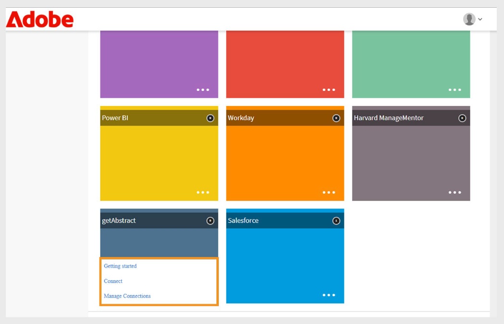
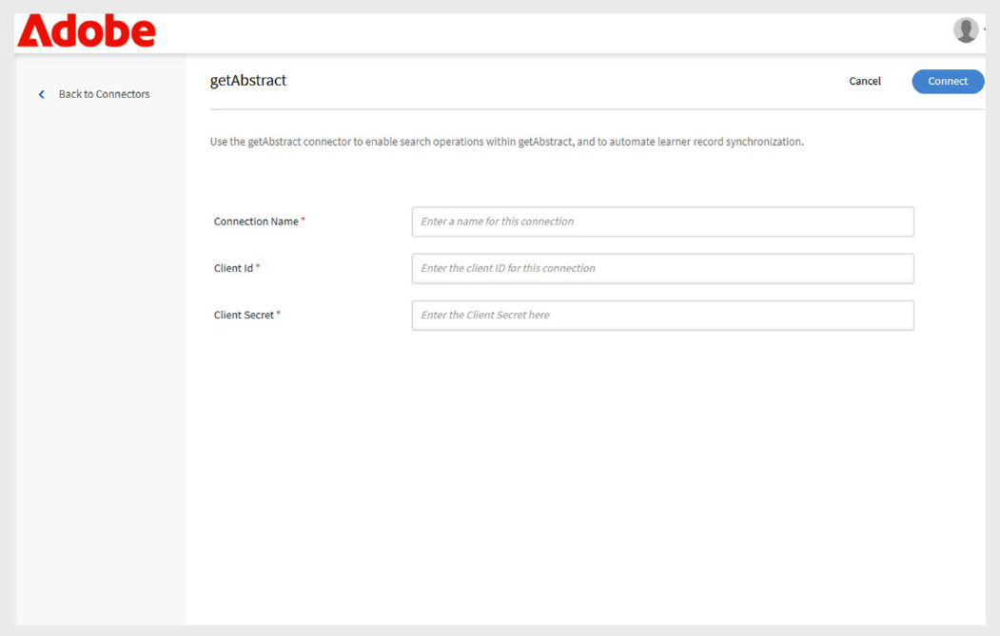
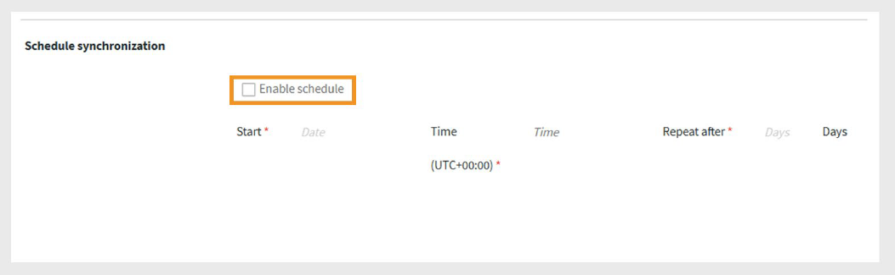
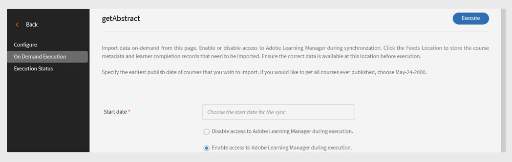

# conector getAbstract para Adobe Learning Manager

## Introdução

O **conector getAbstract** foi projetado para clientes corporativos do [getAbstract.com](https://www.getabstract.com/). Ele permite que os alunos descubram e consumam conteúdo getAbstract diretamente por meio do Adobe Learning Manager. O conector também permite que os administradores importem dados de envolvimento do usuário e monitorem registros de conclusão do aluno automaticamente.

A Adobe Learning Manager quer oferecer aos alunos oportunidades de aprendizado contínuas e autodirigidas com foco em liderança e habilidades sociais. Em vez de desenvolver todo o conteúdo internamente, o administrador conecta a conta getAbstract da organização ao Adobe Learning Manager usando o conector getAbstract.

- Importa automaticamente o conteúdo getAbstract para o Adobe Learning Manager.
- Controla o consumo dos cursos e das programações de aprendizado pelo aluno.

Este artigo descreve as etapas para configurar e gerenciar o conector getAbstract no Adobe Learning Manager.

## Pré-requisitos

- Verifique se o recurso **Migração** está habilitado para sua conta antes de configurar o conector.
- Obtenha a **ID do cliente** e o **Segredo do cliente** do seu representante de conta getAbstract. Essas credenciais são necessárias para recuperar os metadados do curso e os dados de consumo do usuário.

## Configurar o conector do getAbstract

O conector getAbstract permite que os administradores do Adobe Learning Manager aprimorem a experiência de aprendizado integrando conteúdo de alta qualidade e selecionado do getAbstract.

Para configurar o conector getAbstract:

1. Faça logon como um administrador de integração.
2. Selecione **getAbstract** na página inicial.
3. Selecione uma das seguintes opções no bloco **Conector**:

   - **Introdução**: visão geral do conector.
   - **Conectar**: crie uma nova conexão.
   - **Gerenciar Conexões**: exiba ou modifique conexões existentes.

   
   O bloco _getAbstract mostra três opções de configuração_

## Criar uma nova conexão

Para criar uma nova conexão:

1. Selecione **Conectar**.

   
   _Selecione Conectar no bloco getAbstract para criar uma nova conexão_

2. Digite um **Nome da Conexão**.
3. Digite a **ID do Cliente** e o **Segredo do Cliente**.

   
   _Digite a conexão, a ID do cliente e o segredo do cliente na página de conexão getAbstract_

4. Selecione **Salvar** para criar a conexão.

## Gerenciar conector getAbstract

Antes de importar dados, você deve configurar o conector e definir um agendamento de sincronização. Depois de configurado, o conector extrai automaticamente os dados de uso, permitindo que você monitore o progresso do aluno e inclua conteúdo getAbstract nos planos e relatórios de aprendizado.

### Ativar a conexão

Para ativar a conexão:

1. Selecione **Gerenciar Conexões** no bloco **getAbstract**.

   
   _Gerenciar conexões para configurar e agendar a importação de dados_

2. Selecione a conexão.
3. Selecione **Configurar** no painel de navegação esquerdo.
4. Selecione **Habilitar Conexão** e selecione **Salvar**.

   
   _Habilite a conexão para importar os dados de getAbstract para Adobe Learning Manager_

### Editar a conexão

Para editar a conexão:

1. Selecione **Gerenciar Conexões** no bloco **getAbstract**.
2. Selecione a conexão.
3. Selecione **Configurar** no painel de navegação esquerdo.
4. Selecione **Editar** para atualizar a **ID de Cliente** e o **Segredo de Cliente**.

   
   _Edite as credenciais, incluindo a ID do cliente e o segredo do cliente_

5. Selecione **Salvar**.

### Agendar sincronização

Para agendar a sincronização:

1. Selecione **Gerenciar Conexões** no bloco **getAbstract**.
2. Selecione a conexão.
3. Selecione **Configurar** no painel de navegação esquerdo.
4. Selecione **Habilitar agenda** na seção **Sincronização de agenda**.

   
   _Agendar a importação de dados de getAbstract para Adobe Learning Manager_

5. Selecione a data e a hora de início em UTC.
6. Digite o número de dias após os quais a sincronização deve se repetir.
7. Selecione **Salvar**.

As configurações de sincronização são salvas. O conector será executado no cronograma e importará dados de getAbstract para o Adobe Learning Manager.

## Executar sincronização sob demanda

A opção **Sincronização sob demanda** permite importar dados manualmente do getAbstract para o Adobe Learning Manager. Isso é útil quando você deseja atualizar os dados de atividade do aluno imediatamente, sem esperar pela próxima sincronização agendada.

Para executar a importação de dados sob demanda:

1. Selecione **Gerenciar Conexões** no bloco **getAbstract**.
2. Selecione a conexão.
3. Selecione **Execução sob Demanda** no painel esquerdo.
4. Selecione **Data de Início**.

   
   _Executar a solicitação sob demanda para importação imediata de dados de getAbstract para Adobe Learning Manager_

5. Selecione uma das seguintes opções:

   - **Desabilitar o acesso ao Adobe Learning Manager durante a execução**: recomendado se a sincronização puder causar tempo de inatividade.
   - **Habilitar o acesso ao Adobe Learning Manager durante a execução**: recomendado para evitar a interrupção do serviço.
6. Selecione **Executar** para importar todos os dados da data de início até o presente.

### Exibir histórico de execução

A página **Status de Execução** lista todas as execuções de sincronização em ordem. Se uma execução apresentar erros, será exibido um ícone de aviso. Você pode verificar o log de erros, corrigir o arquivo CSV e executar novamente a sincronização mais recente, se necessário.

Para exibir o histórico de execução:

1. Selecione **Status de Execução** no painel esquerdo.
2. Você pode ver as seguintes colunas:
   - **Executar**
   - **Data de Início**
   - **Duração**
   - **Tipo** (Agendado ou Por Demanda)
   - **Status** (Em Andamento ou Concluído)

   
   _Exibir o status de execução das importações agendadas e por demanda_

>[!NOTE]
>
>Se você excluir e recriar uma conexão, o histórico de execução das execuções anteriores ainda ficará visível. Você só pode executar novamente a sincronização mais recente.

### Requisitos para sincronização bem-sucedida

Para garantir que a sincronização funcione corretamente:

- Um arquivo de feed de usuário válido deve estar na pasta FTP getAbstract para as datas de sincronização especificadas.
- O arquivo deve seguir o formato de nomenclatura:
   - report_export_yyyy_MM_dd_HHmmss.xlsx ou
   - report_export_yyyy_MM_dd.xlsx

Baixe um [arquivo de feed de usuário getAbstract de exemplo](https://experienceleague.adobe.com/docs/learning-manager/assets/report-export-20170401175342.xlsx?lang=en) para entender o formato.
