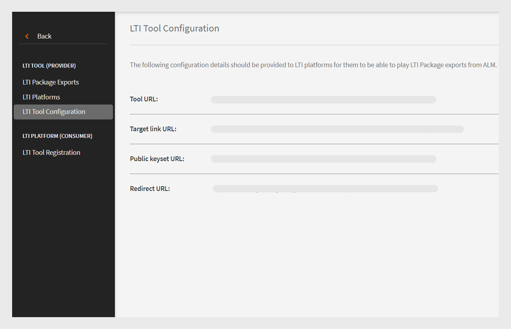
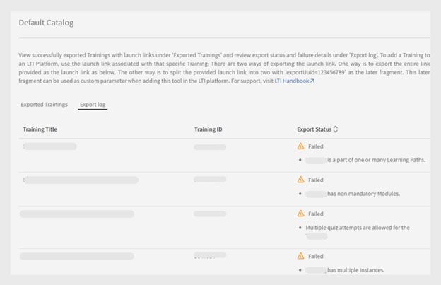

# Integração de LTI

## O que é LTI?

A Interoperabilidade das ferramentas de aprendizado (LTI) é um padrão do IMS para a integração de aplicativos avançados de aprendizado em ambientes educacionais. Os usuários podem acessar conteúdo de aprendizado externo de provedores de conteúdo externo diretamente em seu LMS sem fazer logon ou navegar para um LMS diferente.

## Integração de LTI com o Adobe Learning Manager

O Adobe Learning Manager agora é compatível com a LTI versão 1.3, que permite agir como provedor e consumidor de ferramentas. Esse recurso melhora a interoperabilidade entre o Adobe Learning Manager e outros Sistemas de Gerenciamento de Aprendizagem (LMS).

**LTI como provedor de ferramentas**: o LTI como provedor de ferramentas permite que sistemas externos se integrem com um LMS. O Adobe Learning Manager atua como um provedor de ferramentas de LTI, permitindo que outras plataformas LMS acessem objetos de aprendizado do Adobe Learning Manager diretamente em seu LMS.

**LTI como consumidor de ferramentas**: a LTI como consumidor de ferramentas permite que o LMS integre ferramentas externas por meio da Interoperabilidade das Ferramentas de Aprendizado (LTI). Nesse cenário, o LMS é um consumidor de serviços fornecidos por ferramentas externas. O Adobe Learning Manager atua como um consumidor da ferramenta de LTI, permitindo que ele integre ferramentas de aprendizado de terceiros, o que permite que os alunos do Adobe Learning Manager consumam os objetos de aprendizado das ferramentas de terceiros no Adobe Learning Manager.

## Configurar o conector de LTI no ALM

Siga estas etapas para habilitar a integração de LTI no Adobe Learning Manager:

1. Faça logon como **[!UICONTROL Administrador de Integração]**.
2. Na página inicial, selecione **[!UICONTROL Aplicativos]** > **[!UICONTROL Aplicativos em destaque]**.
3. Selecione **[!UICONTROL Integrações de LTI]** na página **[!UICONTROL Aplicativos]**.
4. Selecione a opção **[!UICONTROL Habilitar Integrações LTI]** e selecione **[!UICONTROL Salvar]**.

_Habilitar integrações de LTI_

>[!NOTE]
>
>Não é possível modificar ou desativar a opção Integrações de LTI depois de ativada.

Isso criará a nova barra lateral de Integrações de LTI na conta do administrador.

_Barra lateral da LTI_

Uma nova função personalizada, **[!UICONTROL Integração de LTI]**, foi adicionada em **[!UICONTROL Privilégios de conta]** na seção **[!UICONTROL Função Personalizada]**. Os administradores podem atribuir essa função aos usuários, permitindo que eles acessem a seção **[!UICONTROL Integração de LTI]**. Os administradores também precisam conceder permissões de **[!UICONTROL Catálogos]** a esses usuários para exportar os cursos. Essa configuração fornece acesso total às seções de LTI e Catálogos para exportar cursos.

_Função personalizada de Integração de LTI_

## Adobe Learning Manager como provedor de ferramenta de LTI

Como provedor de LTI, o Adobe Learning Manager permite que você exporte cursos de seus catálogos como pacotes de LTI que podem ser compartilhados com plataformas LMS externas.

### Criar e compartilhar as credenciais de LTI com LMS externo - Fluxo de trabalho do administrador

Siga estas etapas para compartilhar as credenciais de LTI com o LMS externo:

1. Faça logon como **[!UICONTROL Administrador]**.
2. Na página inicial, selecione **[!UICONTROL Integração de LTI]** > **[!UICONTROL Configuração da Ferramenta de LTI]**. Você pode ver as credenciais de configuração nesta página.
3. O administrador pode compartilhar essas credenciais com um LMS externo para o registro do site de LTI.

   
   _Credenciais de Configuração da Ferramenta LTI_

   * **[!UICONTROL URL do token]**: a URL em que o LMS solicita um token de acesso para autenticar e autorizar a comunicação com a ferramenta LTI.
   * **[!UICONTROL URL do Link de Destino]**: a URL de destino na qual os usuários são redirecionados ao iniciar a ferramenta de LTI no LMS.
   * **[!UICONTROL URL do Conjunto de Chaves Públicas]**: a URL que fornece as chaves públicas usadas para verificar os tokens de segurança para comunicação segura.
   * **[!UICONTROL URL de redirecionamento]**: a URL para a qual os usuários são enviados depois de concluir uma ação na ferramenta de LTI, geralmente redirecionando-os de volta para o LMS.

### Configuração do LMS externo

Usando as credenciais compartilhadas pelo administrador do Adobe Learning Manager, o administrador externo do LMS registra o Adobe Learning Manager e gera credenciais. Essas credenciais serão adicionadas ao Adobe Learning Manager como uma etapa final para configurar o Adobe Learning Manager como um provedor de ferramentas. Estas são as credenciais externas geradas pelo LMS:

* **[!UICONTROL ID do Emissor ou da Plataforma]**: um identificador exclusivo do LMS ou da plataforma que envia a solicitação de inicialização da LTI ao provedor de ferramentas.
* **[!UICONTROL ID do Cliente]**: um identificador exclusivo atribuído à ferramenta de LTI pelo LMS para fins de autorização.
* **[!UICONTROL ID de implantação]**: um identificador que vincula uma implantação de ferramenta de LTI específica ao LMS para gerenciar várias instâncias.
* **[!UICONTROL URL do token]**: o ponto de extremidade onde o LMS solicita um token de acesso para autenticar e autorizar interações com a ferramenta de LTI.
* **[!UICONTROL URL de autenticação]**: a URL na qual o LMS envia usuários para autenticar e iniciar a conexão de LTI.
* **[!UICONTROL URL de Chave Pública]**: a URL que fornece a chave pública usada pela ferramenta de LTI para verificar os tokens de segurança e garantir a comunicação segura.

### Adicionar o Adobe Learning Manager como um provedor de ferramentas - Fluxo de trabalho do administrador

Siga estas etapas para adicionar o Adobe Learning Manager como um provedor de ferramentas:

1. Faça logon como **[!UICONTROL Administrador]**.
2. Na página inicial, selecione **[!UICONTROL Integrações LTI]** > **[!UICONTROL Plataformas LTI]**.
3. Selecione **[!UICONTROL Adicionar]** e insira as credenciais compartilhadas pelo LMS externo.

   
   _Adicionar uma nova Plataforma de LTI_

4. Depois de adicionar todos esses valores, selecione **[!UICONTROL Validar]** e **[!UICONTROL Adicionar]**.

### Exportar pacote de LTI - Fluxo de trabalho do administrador

As ferramentas de LTI permitem exportar treinamento dos catálogos como um pacote para download de conteúdo de aprendizado que pode ser compartilhado com sistemas de gerenciamento de aprendizagem (LMS) ou plataformas externos usando o padrão LTI (Learning Tools Interoperability).

Siga estas etapas para exportar o curso do Adobe Learning Manager:

1. Faça logon como **[!UICONTROL Administrador]**.
2. Na página inicial, selecione **[!UICONTROL Integrações de LTI]** > **[!UICONTROL Exportações de Pacote de LTI]**.
3. Selecione **[!UICONTROL Nova exportação de pacote]**.

   
   _Exportar pacote de LTI_

4. Selecione o catálogo necessário na lista. Você pode ver a lista de cursos disponíveis no catálogo.
5. Selecione os cursos necessários e selecione **[!UICONTROL Exportar como LTI]**.
6. Selecione o curso para ver o link de inicialização.
7. Selecione o ícone **[!UICONTROL Baixar Link]** para baixar o pacote. O pacote é um arquivo zip contendo os arquivos IMSCC exportados com êxito.

Usando esse link de inicialização ou o arquivo IMSCC, você pode exportar os cursos do Adobe Learning Manager para o LMS externo. Os alunos podem consumir os cursos do Adobe Learning Manager em seu LMS.

>[!NOTE]
>
>Se um administrador editar um curso ou atualizar os módulos após criar o link de inicialização, o link será atualizado automaticamente. No entanto, se um administrador retirar um curso após a criação do link de inicialização, o curso retirado não será iniciado no consumidor de LTI.

## Adobe Learning Manager como consumidor de LTI - Fluxo de trabalho do administrador

Como consumidor de LTI, o Adobe Learning Manager permite que você use atividade, ferramentas, conteúdo e widgets de provedores de LTI externos.
Para adicionar o Adobe Learning Manager como um consumidor de LTI, você precisa das seguintes credenciais do provedor de LTI externo:

* Iniciar URL de login
* URL do link de destino
* Redirecionar URL
* Tipo de chave pública

Siga estas etapas para adicionar o Adobe Learning Manager como um consumidor de LTI:

1. Faça logon como **[!UICONTROL Administrador]**.
2. Na página inicial, selecione **[!UICONTROL Integrações de LTI]** > **[!UICONTROL Registro de Ferramenta de LTI]**.
3. Selecione **[!UICONTROL Adicionar]** > **[!UICONTROL Nova ferramenta de LTI]**.

   >[!NOTE]
   >
   >É possível importar várias ferramentas de LTI fazendo upload de um arquivo .csv.

4. Insira as credenciais acima do Provedor de LTI.

   
   _Adicionar uma nova ferramenta de LTI_

5. Uma vez concluído, selecione **[!UICONTROL Validar]** e **[!UICONTROL Adicionar]**.
6. Você verá a seguinte tela:

   
   _Credenciais de registro_

7. Compartilhe essas credenciais com o provedor de LTI para registro. Depois que o registro for concluído, você pode obter o link de inicialização ou o arquivo IMSCC do provedor de LTI para importar os cursos.

### Criar conteúdo de LTI - Fluxo de trabalho do autor

Os provedores de LTI fornecem um link de inicialização ou arquivo IMSCC para adicionar seus cursos ao Adobe Learning Manager. Siga estas etapas para adicionar cursos do LMS externo:

1. Faça logon como **[!UICONTROL Autor]**.
2. Selecione **[!UICONTROL Biblioteca de Conteúdo]** > **[!UICONTROL Adicionar]** > **[!UICONTROL Módulo LTI]**.

   
   _Adicionar Conteúdo LTI - Autor_

3. Digite **[!UICONTROL Nome]** e **[!UICONTROL Descrição]**.
4. Digite o **[!UICONTROL Link de Inicialização]** e os **[!UICONTROL Parâmetros Personalizados]** do provedor de LTI.
5. Selecione seu [!UICONTROL provedor de LTI] no menu suspenso **[!UICONTROL Provedor de Ferramentas]**.
6. Pesquise e selecione o **[!UICONTROL Público]** na opção **[!UICONTROL Adicionar à Pasta]**. Isso disponibiliza os cursos para todos os autores.
7. Selecione **[!UICONTROL Salvar]**.
Depois que o conteúdo é criado, você pode adicioná-lo ao criar o curso.

### Criar curso com conteúdo de LTI - Fluxo de trabalho do autor

Siga estas etapas para criar um curso com conteúdo de LTI:

1. Faça logon como **[!UICONTROL Autor]**.
2. Na página inicial, selecione **[!UICONTROL Cursos]** > **[!UICONTROL Adicionar]**.
3. Digite o **[!UICONTROL Nome]** e a **[!UICONTROL Descrição]** do curso.
4. Na opção **[!UICONTROL Módulos]**, selecione **[!UICONTROL Adicionar Módulos]** > **[!UICONTROL Módulo de ritmo individualizado]**.
5. Selecione o **[!UICONTROL Conteúdo de LTI]** criado e selecione **[!UICONTROL Salvar]**.
6. Insira os detalhes necessários, como **[!UICONTROL Habilidades]**, **[!UICONTROL Autores]** e **[!UICONTROL Tipo de inscrição]**.
7. Depois de concluído, publique o curso. Os alunos da Adobe Learning Manager podem fazer os cursos de LTI do provedor de LTI externo.

## Cenários de falha de exportação de LTI

Os seguintes tipos de cursos não podem ser exportados como cursos de LTI:

* **Curso com módulo de atividade**: cursos que contêm módulos baseados em atividade específicos.
* **Curso com vários tipos de entrega**: os cursos com vários tipos de entrega incluem módulo em ritmo individualizado, módulo virtual ou de sala de aula, módulo de atividade e aprendizado combinado.
* **Curso com pré-requisitos**: cursos que exigem pré-conclusão.
* **Curso com várias inscrições**: cursos que contêm várias inscrições
* **Cursos com várias instâncias**: cursos que oferecem várias instâncias de entrega.

| Instância padrão | Uma ou mais instâncias não padrão | Expectativa | Mensagens de erro |
|---|---|---|---|
| Ativo | Nenhum | Exportar | Nenhum |
| Ativo | Ativo | Não exportar | Várias Instâncias |
| Ativo | Aposentado | Não exportar | Várias Instâncias |
| Ativo | Excluído | Exportar | Nenhum |
| Aposentado | Nenhum | Não exportar | Desativar Instância de Definição |
| Aposentado | Ativo | Não exportar | Desativar Instância De Definição, Várias Instâncias |
| Aposentado | Aposentado | Não exportar | Desativar Instância De Definição, Várias Instâncias |
| Aposentado | Excluir | Não exportar | Desativar Instância de Definição |

* **Cursos com várias respostas de pergunta**: cursos com MQA habilitado.
* **Curso com alternância de instância ativada**: cursos que permitem aos alunos alternar entre instâncias.
* **Curso pago**: cursos que exigem pagamento para inscrição.
* **Parte dos cursos do Caminho de Aprendizado, Certificação ou Plano de Aprendizado**: os cursos fazem parte de caminhos de aprendizado ou planos.
* **Cursos não do tipo Autoinscrição**: cursos restritos à autoinscrição do aluno.
* **Cursos de sala de aula ou sala de aula virtual**: cursos com sessões de sala de aula ou sala de aula virtual.
* **Cursos com módulos não obrigatórios**: cursos que contêm módulos opcionais ou não obrigatórios.

_Status da exportação_

## Limitações de LTI

Veja a seguir as limitações de LTI para o consumidor e o provedor de LTI:

* Capaz de exportar cursos mesclados, o que afeta a experiência de consumo do curso dos alunos.
* Capaz de exportar cursos em ritmo individualizado com módulos de sala de aula, sala de aula virtual ou atividade, afetando a experiência do curso dos alunos.
* Capaz de exportar cursos compartilhados como o LinkedIn Learning e os cursos Go1.
* Capaz de iniciar cursos com datas de inscrição anteriores no ALM, o que afeta o acesso e a experiência do curso dos alunos.
* Os alunos não podem realizar cursos de LTI no aplicativo móvel iOS ALM, o que afeta a experiência de consumo do curso.
* Os alunos não podem baixar e acessar cursos de LTI offline no aplicativo móvel ALM, pois esses cursos são fornecidos por plataformas de terceiros.
* Os administradores podem exibir apenas os catálogos ativados e não podem ver os catálogos desativados.
* O ALM tem limitações no nome (63 caracteres) e no comprimento do e-mail (64 caracteres), impedindo o acesso de alunos externos de LTI que excedem esses limites.
* Os atrasos na sincronização da conclusão do curso ou na sincronização de notas são causados por um sistema de LTI de terceiros.
* As mensagens de sincronização do curso não aparecem para os alunos de equipes que consomem cursos de LTI por meio do aplicativo ou navegador do Teams, afetando as notificações do aluno.
* Os relatórios de Dados do Usuário não podem exportar dados de usuários registrados por meio de LTI.
* Os nomes dos provedores de ferramentas não são reconhecidos automaticamente quando os autores adicionam links de inicialização ao consumidor de ferramentas, exigindo seleção manual.
* Os uploads de ferramentas em massa via CSV exigem codificação UTF-8 para caracteres acentuados para evitar erros de importação.
* Os administradores de conta de LTI não podem compartilhar cursos, caminhos de aprendizado ou certificações que incluam módulos de LTI.
* Não é possível ressincronizar as notas quando os usuários reabrem o reprodutor para cursos do ALM concluídos, o que afeta as atualizações de pontuação dos alunos e requer um reacionamento manual.
* O ALM permite que apenas usuários ativos e de avaliação realizem os cursos de LTI.
* A sincronização de níveis ativada no Moodle impede que o reprodutor ALM seja iniciado, o que afeta o acesso e a experiência do curso dos alunos.
* O campo ativo de LTI é de valor único e não oferece suporte a vários valores.
* Os motivos de falha não estão disponíveis quando uma exportação falha durante a migração dos cursos sem conteúdo principal.
* As notas externas do curso de LTI não aparecem na transcrição do aluno e as pontuações não são visíveis na página do quiz L2, afetando o rastreamento do desempenho dos alunos.

## Casos de falha na inicialização de LTI

Veja a seguir os cursos que o player de LTI externo não pode iniciar devido a alterações recentes feitas no ALM após a criação dos links de inicialização:

* Cursos nos quais a instância é desativada.
* Cursos retirados sem inscrição no ALM.
* Cursos que têm inscrições no ALM, mas estão desativados.
* Cursos excluídos no ALM.
* Cursos nos quais o limite de inscrição foi atingido.

## Prática recomendada

Recomenda-se que um catálogo seja criado com cursos que oferecem suporte à LTI para evitar falhas de exportação e facilitar a exportação dos cursos.

Catálogo de LTI mostrando status de exportação bem-sucedido
