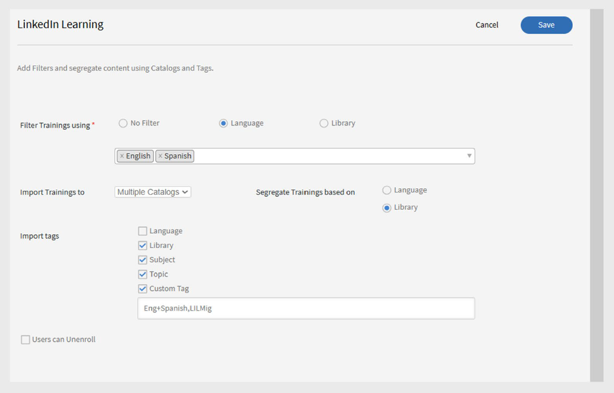

# Conector do linkedIn Learning no Adobe Learning Manager

## Introdução

O conector de aprendizado do LinkedIn permite integrar perfeitamente o conteúdo de aprendizado do LinkedIn ao Adobe Learning Manager. Com esse conector, as organizações podem importar automaticamente os cursos do LinkedIn Learning para o Adobe Learning Manager, para que os alunos possam encontrar, se inscrever e concluir os cursos do LinkedIn diretamente na plataforma.

Quando configurado, o progresso do aluno no conteúdo de aprendizado do LinkedIn é rastreado no Adobe Learning Manager, permitindo que os administradores monitorem as conclusões e o tempo gasto. Você pode agendar a sincronização automática de conteúdo, executar importações por demanda e filtrar quais cursos são trazidos para o sistema por idioma, biblioteca ou tags personalizadas.

>[!NOTE]
>
>Ao importar cursos do LinkedIn Learning, o Adobe Learning Manager gera IDs exclusivas de OA (Objeto de aprendizado) para cada curso. O tempo de aprendizado gasto no conteúdo de aprendizado do LinkedIn é relatado pela plataforma LinkedIn para o Adobe Learning Manager. Se a plataforma LinkedIn não enviar esses dados, o Adobe Learning Manager não poderá gravá-los e o tempo gasto será exibido como zero.

## Definir configurações do portal de Aprendizado LinkedIn

Para definir as configurações do portal de aprendizado da LinkedIn:

1. Faça logon no **LinkedIn Learning LMS** como administrador.
2. Selecione **Administrador** no painel de navegação superior.
3. Clique na guia **Configurações**.
4. Na navegação à esquerda, selecione **Integração de Reprodução** e selecione a guia **Integração**.
5. Expanda as **Configurações de Inicialização de Conteúdo do LMS**.
6. Adicione os seguintes nomes de host:

   - learningmanager.adobe.com
   - learningmanagerlrs.adobe.com
   - cpcontents.adobe.com
7. Selecione **Habilitar integração AICC**.

   
   _Selecione Habilitar integração AICC para configurar o conector de Aprendizado do LinkedIn_

## Conectar o LinkedIn Learning no Adobe Learning Manager

Para configurar o conector do LinkedIn Learning:

1. Faça logon no Adobe Learning Manager como administrador de integração.
2. Passe o mouse sobre o bloco **Aprendizado do LinkedIn** e selecione **Conectar**.

   
   _Selecione Conectar para configurar o conector do LinkedIn Learning_

3. Na página de configuração da conexão:
   - Digite um **Nome da Conexão**.
   - Digite a **Chave do Aplicativo** e a **Chave Secreta**.

   
   _Digite o nome da conexão, a chave do aplicativo e a chave secreta para configurar o conector do LinkedIn Learning_

   >[!NOTE]
   >
   >O administrador corporativo pode gerar essas chaves criando um aplicativo no portal de administração de aprendizado do LinkedIn.

4. Selecione **Salvar** para adicionar a conexão.

Para editar uma conexão existente, selecione **Gerenciar Conexões** no bloco **Aprendizado do LinkedIn**.

>[!IMPORTANT]
>
>O recurso **Migração** deve estar habilitado para sua conta para que você possa configurar este conector.

## Gerenciar conexão e sincronização

Para gerenciar o conector do LinkedIn Learning:

1. Selecione **Gerenciar Conexões** e selecione a conexão.
2. No painel esquerdo, selecione **Configurar**.
3. Selecione **Habilitar Conexão**.

   
   _Selecione Habilitar conexão na página Configurar o conector de aprendizado do LinkedIn_

4. Selecione **Editar** para atualizar as credenciais. Use **Redefinir** para desfazer edições.
5. Para automatizar a sincronização, selecione **Habilitar Agenda**.
6. Defina a data de início, a hora e a frequência (por exemplo, a cada 3 dias).
7. Selecione **Salvar**.

### Sincronização sob demanda

Para executar a sincronização sob demanda:

1. Selecione **Execução sob Demanda** no painel esquerdo.
2. Digite uma **Data de Início**.
3. Selecione qualquer uma das opções a seguir para **Habilitar** ou **Desabilitar acesso** ao Adobe Learning Manager durante a execução:
   - **Habilitar o acesso ao Adobe Learning Manager durante a execução**: sem tempo de inatividade para os usuários.
   - **Desabilitar o acesso ao Adobe Learning Manager durante a execução**: o aplicativo está indisponível durante a sincronização.

   
   _Selecione Execução sob Demanda para executar a importação_

4. Selecione **Executar** para importar feeds do usuário e dados do LinkedIn Learning a partir dessa data.

Para monitorar todas as execuções de sincronização:

Selecione **Status de execução** no painel esquerdo para exibir o histórico de todas as sincronizações, sua duração, tipo (agendada ou por demanda) e status atual (em andamento, concluído).

>[!NOTE]
>
>Se você excluir e recriar uma conexão, as execuções anteriores serão mantidas e mostradas no **Status de Execução**. Você pode executar novamente apenas a sincronização mais recente.

## Filtrar conteúdo do LinkedIn Learning

Ao configurar o conector, você pode filtrar quais cursos do LinkedIn Learning importar.

Para configurar o filtro:

1. Selecione **Filtro** no painel esquerdo.
2. Selecione a opção necessária em **Filtrar treinamentos usando**.
   - **Nenhum filtro** - importar todos os cursos.
   - **Idioma** - Filtrar cursos por idiomas específicos.
   - **Biblioteca** - Filtrar cursos por bibliotecas do LinkedIn Learning.
3. Se estiver filtrando por **Idioma**, selecione os idiomas desejados. Por exemplo, **inglês** e **espanhol**.
4. Em **Importar treinamentos para**, selecione o local para onde os cursos serão importados.
5. Escolha como organizar os cursos importados.
6. Selecione qualquer uma das opções abaixo para a opção **Segregar treinamentos com base em**:

   - **Idioma** - Agrupar por idioma.
   - **Biblioteca** - Agrupar por biblioteca.
7. Em **Importar marcas**, selecione os tipos de marcas que deseja aplicar aos cursos importados.

   - **Idioma**
   - **Biblioteca**
   - **Assunto**
   - **Tópico**
   - **Marca personalizada**
8. No campo **Marca personalizada**, digite uma marca personalizada que você deseja atribuir. Separe várias tags com vírgulas.

   
   _Selecione as opções de filtro para importar os dados do conector do LinkedIn Learning_

9. Se você quiser que os alunos possam cancelar a inscrição nesses cursos, selecione **Os usuários podem cancelar a inscrição**.
10. Selecione **Salvar** para aplicar as configurações de filtro e importação.
