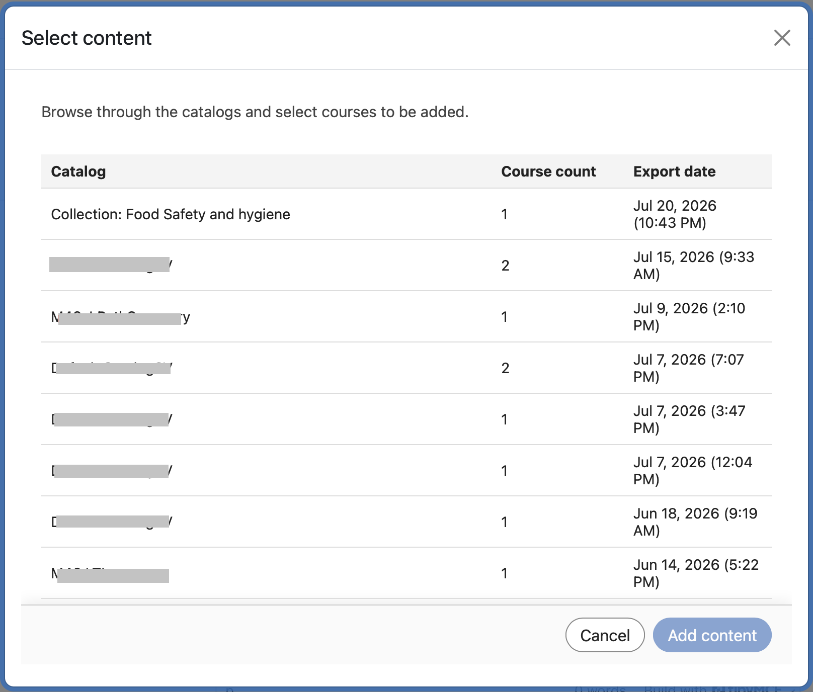

# Deep Linking de LTI no Adobe Learning Manager

## Visão geral

**A seção a seguir é para administradores**

A vinculação profunda LTI é um recurso de vantagem da LTI que permite que professores ou autores do curso naveguem, selecionem e incorporem itens de aprendizado específicos do Adobe Learning Manager (ALM) diretamente em cursos externos de plataforma/consumidor da ferramenta LTI (como Canvas ou Moodle).

Os links profundos de LTI simplificam o processo de adicionar cursos a uma plataforma de aprendizado, como o Moodle. No fluxo de trabalho atual, um autor deve copiar manualmente o URL do curso, incluindo o parâmetro exportar UUID, e colar os detalhes necessários no LMS ao configurar o link do curso. Essa etapa deve ser repetida para cada curso e para cada posicionamento. Por exemplo, se o mesmo curso precisa ser adicionado em 10 locais diferentes, o autor deve repetir o processo de copiar e colar 10 vezes. Essa abordagem manual aumenta o esforço e apresenta um maior risco de erros de configuração.

A vinculação profunda remove essa sobrecarga, permitindo que o LMS lide com a seleção do curso durante a configuração e fornece o URL de inicialização apropriado para a seleção de conteúdo.

Neste modelo:

* Os professores e autores no LMS externo iniciam uma experiência de seleção de deep-link dedicada para navegar pelo ALM.
* O sistema retorna um objeto de deep-link do ALM para o LMS externo, para que o item selecionado possa ser incorporado como parte do fluxo de trabalho de criação do curso.
* Os alunos consomem conteúdo vinculado profundo em seu LMS principal, que lança perfeitamente o material hospedado no ALM.

## Declaração de problema

Atualmente, o ALM é compatível com a integração de LTI 1.3, mas sem um fluxo de trabalho completo de deep-linking, professores e autores não têm uma maneira estruturada para:

* Iniciar uma experiência de seleção de deep-link dedicada a partir de um modal.
* Procurar apenas os objetos de aprendizado que devem ser expostos para uma determinada plataforma.
* Selecione um objeto de aprendizado específico na plataforma.
* O ALM retorna esse objeto de aprendizado para a plataforma para que possa ser incorporado diretamente em um curso.

Sem esse recurso:

* A seleção de conteúdo é manual ou fragmentada
* Todo o conteúdo da conta pode ser exposto de forma não intencional, a menos que seja explicitamente filtrado
* As integrações provedor-ferramenta são mais difíceis de operar
* Os autores do curso não podem incorporar conteúdo de LTI externo com um fluxo de trabalho consistente e controlado

## Objetivos

Os principais objetivos desse recurso são:

1. Habilitar LTI Deep Linking em um provedor de ferramenta LTI
   * Oferecer suporte a inicializações de deep-link do ALM para um provedor de ferramentas de LTI.
2. Fornecer um fluxo de trabalho de seleção de conteúdo controlado
   * Exponha somente catálogos e conteúdo aprovados e relevantes durante a seleção de deep-link.
3. Permitir que professores e autores selecionem objetos de aprendizado
   * Forneça uma interface de usuário pesquisável e filtrável para selecionar objetos de aprendizado qualificados.
4. Retornar uma resposta de link profundo válida ao ALM
   * Redirecione o usuário de volta para a plataforma usando o parâmetro deep_link_return_url com a carga de deep-link necessária.
5. Suporte à exposição de catálogo específica da plataforma
   * Permita que os administradores controlem quais catálogos são expostos a qual plataforma de LTI.

## Pessoas e seus papéis

O fluxo de trabalho de deep-linking de LTI envolve as seguintes pessoas:

| Persona | Descrição |
|---|---|
| Professor ou autor | Cria ou gerencia cursos e inicia o fluxo de seleção de deep-link para incorporar conteúdo externo. |
| Administrador de Integração | Registra e gerencia ferramentas de LTI e habilita e configura o comportamento de deep-linking. |
| Aluno | Inicia e consome o conteúdo adicionado por meio do fluxo de trabalho de deep-link. |

*Cada persona mapeia para uma etapa distinta no fluxo de trabalho de vinculação profunda, da configuração ao consumo.*

## Dados e parâmetros exigidos

Intercâmbios de ligação profunda entre o ALM e a plataforma de LTI:

| Parâmetro | Finalidade |
|---|---|
| `deep_link_return_url` | Retornar ponto de extremidade usado para enviar o objeto de vínculo profundo selecionado de volta ao ALM |
| `accepted_types` | Define os tipos de recursos aceitos pela plataforma |
| `accept_multiple` | Indica se a seleção de vários recursos é permitida; configurável por ferramenta |
| `auto_create` | Indica que a plataforma pode criar automaticamente a entrada de recurso vinculada |

*Esses parâmetros controlam qual conteúdo é exposto e como as seleções são retornadas ao ALM.*

## Criar um deep link

### Pré-requisito

1. Você deve estar conectado como um administrador de integração.
2. Ao configurar a integração de LTI, marque a caixa de seleção Suporta deep linking.
3. Forneça o URL no campo para levar o usuário ou autor à seleção.
4. Selecione Salvar alterações.

   O mesmo URL de inicialização é reutilizado para simplificar a configuração e o uso.

   O comportamento é determinado pelo tipo de mensagem de LTI. Quando o tipo de mensagem é `content_consumption`, o usuário é direcionado para o aluno do curso. Quando o tipo de mensagem é `content_selection`, o usuário é roteado pelo fluxo de vínculo profundo, no qual o autor pode selecionar o conteúdo desejado diretamente sem copiar manualmente os identificadores específicos do curso.

   Depois de salvar as alterações, selecione a guia **Selecionar Conteúdo**. (A guia **Selecionar Conteúdo** só fica ativa depois que esta caixa de seleção é selecionada.)

**A seção a seguir é para autores.**

Como autor, você pode selecionar conteúdo na janela **Selecionar Conteúdo**. A janela **Selecionar conteúdo** exibe **Catálogo**, **Contagem de cursos** e **Data de exportação**.

1. Acesse sua ferramenta de integração externa.

   

2. Selecione um **Catálogo** e selecione os cursos que deseja vincular profundamente marcando as caixas de seleção ao lado de cada curso. Se você adicionar vários cursos, uma janela pop-up de confirmação aparece para que você confirme.

   

   

3. Selecione **Adicionar conteúdo**. Selecionar **Adicionar conteúdo** preenche todos os campos para você. Você pode visualizar o UUID de exportação no campo Parâmetros personalizados. Uma mensagem de confirmação é exibida se você selecionou vários cursos na etapa anterior.

   

4. Neste ponto, você pode selecionar **Cancelar** e retornar à guia **Selecionar Conteúdo** se quiser selecionar outros cursos ou fazer alterações, ou pode selecionar **Salvar e retornar** ao curso ou selecionar **Salvar e exibir**. Os links profundos são adicionados aos destinos.

   
