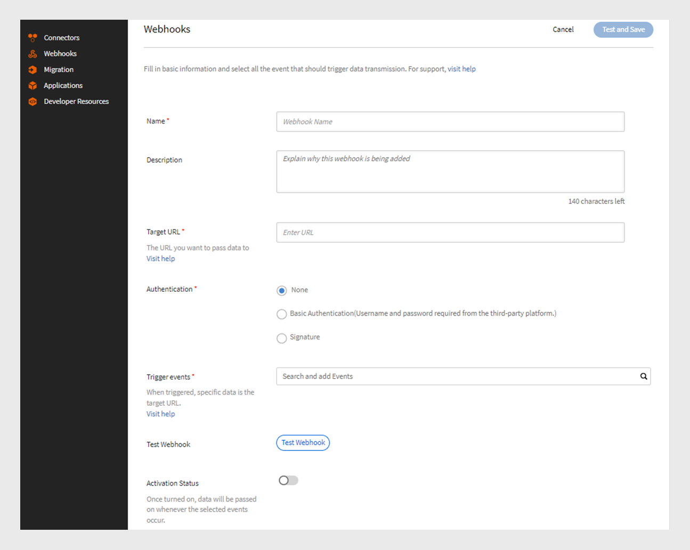

# Webhooks

Um webhook permite que uma entidade envie automaticamente dados ou notificações em tempo real para outra entidade quando ocorre um evento específico. Isso permitirá que um aplicativo forneça informações a outros aplicativos sem solicitar constantemente. Por exemplo, se um usuário concluir um curso do Sistema de Gerenciamento de Aprendizado (LMS), um webhook poderá enviar automaticamente essas informações para outra plataforma, como um CRM ou uma ferramenta de relatório. Os webhooks são frequentemente usados em integrações para automatizar processos e reduzir a necessidade de atualizações manuais entre sistemas. Configure webhooks fornecendo um URL de retorno de chamada para o qual você enviaria os dados.

## Webhooks vs APIs

Os webhooks e as APIs ajudam os sistemas a se comunicarem entre si, mas funcionam de maneiras diferentes. Com as APIs, as informações são compartilhadas somente quando o usuário as solicita. Por exemplo, se um aluno requer dados de progresso do curso, ele envia uma solicitação à API, que fornece as informações. Por outro lado, os webhooks enviam dados automaticamente imediatamente quando um evento acontece. Por exemplo, se um aluno concluir um curso, ele enviará os dados imediatamente para o URL do ouvinte sem nenhuma solicitação manual.

## O que são APIs em tempo real?

As APIs em tempo real permitem que os aplicativos troquem dados instantaneamente quando um evento acontece. Diferentemente das APIs tradicionais, que aguardam um usuário solicitar informações, as APIs em tempo real compartilham dados no momento em que ocorrem. Os webhooks atuam como uma API em tempo real e ajudam a compartilhar os dados imediatamente sempre que o evento especificado ocorre. A API em tempo real garante que essa transferência de dados ocorra imediatamente, sem a necessidade de qualquer solicitação manual, o que permite que os sistemas permaneçam atualizados instantaneamente.

## Eventos do Webhook

Eventos de webhook são ações específicas que ocorrem em um sistema que envia dados automaticamente para um URL de ouvinte. Por exemplo, quando um aluno se inscreve em um curso, um evento de webhook é acionado e envia os detalhes de inscrição para o URL do ouvinte.
Os eventos do webhook são classificados em duas categorias:

* **Eventos em tempo real**: os eventos são processados e enviados em tempo real para uma URL de destino
* **Eventos que não são em tempo real**: os eventos são processados em lotes e enviados em horários especificados em vez de em tempo real

## URL do Listener

Um URL de Listener é um ponto final ou destino que recebe informações de dados quando ocorre um evento. Sempre que um evento específico acontece, como a inscrição de um usuário em um curso, o sistema envia automaticamente os detalhes para esse URL sem qualquer solicitação manual. O URL do listener é o endereço onde todas essas atualizações são fornecidas.
O webhook envia as informações relevantes em um formato JSON. Veja um exemplo de carga de um evento acionado no Adobe Learning Manager:

```
{
  "accountId": 1010,
  "events": [
    {
      "eventId": "d5fb7071-10a9-46b2-9f9e-79dde346c052",
      "eventName": "COURSE_ENROLLMENT_BATCH",
      "timestamp": 1727414643000,
      "eventInfo": "1727414643000-047210-84242-0",
      "data": {
        "userId": 4279332,
        "loId": "course:7374992",
        "loInstanceId": "course:7376092_10250977",
        "loType": "course",
        "enrollmentSource": "ADMIN_ENROLL",
        "dateEnrolled": 1727414643
      }
    }
  ]
}
```

## Criar e gerenciar Webhooks - Administrador de integração

Siga as etapas abaixo para criar a integração de webhooks no Adobe Learning Manager:

1. Faça logon como **[!UICONTROL Administrador de Integração]**.
2. Na página inicial, selecione **[!UICONTROL Webhooks]** > **[!UICONTROL Adicionar Webhook]**.

   
   _Adicionar um webhook_

3. Digite o **[!UICONTROL Nome]** e a **[!UICONTROL Descrição]** do Webhook.
4. Digite a URL do ouvinte como uma **[!UICONTROL URL de Destino]** para a qual você deseja passar os dados do evento.
5. Selecione qualquer um dos métodos de autenticação:
A autenticação em Webhooks é um método de segurança para garantir que os dados enviados para um URL de listener venham de uma origem confiável.
   * **[!UICONTROL Nenhum]**: nenhuma autenticação necessária.
   * **[!UICONTROL Básico]**: esta é uma autenticação baseada em credencial. Insira o nome de usuário e a senha.
   * **[!UICONTROL Assinatura]**: o sistema cria uma assinatura especial e a adiciona aos dados do webhook. O servidor de recebimento verifica esse código para certificar-se de que os dados são reais e não foram alterados. Gere uma assinatura e use-a para autenticação. Baixe a assinatura como JSON.
6. Selecione os eventos do Webhook no menu suspenso **[!UICONTROL Acionar eventos]**.

   >[!NOTE]
   >
   >Você também pode testar os webhooks selecionando a opção Testar Webhooks na página Adicionar Webhook.

7. Selecione o alternador **[!UICONTROL Status de ativação]** para habilitar o webhook. Uma vez ativado, os dados serão transmitidos sempre que os eventos selecionados ocorrerem.

>[!NOTE]
>
>Você pode criar e gerenciar até 5 webhooks.

### Editar Webhooks - Administrador de Integração

Siga estas etapas para editar webhooks do Adobe Learning Manager:

1. Faça logon como **[!UICONTROL Administrador de Integração.]**
2. Selecione **[!UICONTROL Webhooks]** na página inicial.
3. Selecione o webhook que deseja editar.

   
   _Editar o webhook_
4. Selecione **[!UICONTROL Editar]** para modificar os detalhes do webhook e selecione **[!UICONTROL Salvar]**.

### Remover Webhooks - Administrador de Integração

Siga estas etapas para editar webhooks do Adobe Learning Manager:

1. Faça logon como **[!UICONTROL Administrador de Integração]**.
2. Selecione **[!UICONTROL Webhooks]** na página inicial.
3. Selecione o webhook que deseja excluir.
4. Selecione **[!UICONTROL Excluir]** para remover os webhooks.


_Remover o webhook_

### Baixar Webhooks - Administrador de Integração

Siga estas etapas para desativar os webhooks:

1. Faça logon como **[!UICONTROL Administrador de Integração]**.
2. Selecione **[!UICONTROL Webhooks]** na página inicial.
3. Selecione o webhook que deseja editar.
4. Selecione **[!UICONTROL Editar]** e desabilite o **[!UICONTROL Status de Ativação]** para desativar o webhook.


_Desativar o webhook_

## Eventos em tempo real

| S.No | Eventos do Webhook | Descrição |
|---|---|---|
| 1 | CI_STATS | Acionado quando há uma alteração na disponibilidade de vagas ou listas de espera para uma instância do curso. |
| 2 | COURSE_ENROLLMENT | Acionado quando um aluno se inscreve em um curso. |
| 3 | COURSE_COMPLETED | Acionado quando um aluno conclui um curso. |
| 4 | LEARNING_PATH_ENROLLMENT | Acionado quando um aluno se inscreve em um caminho de aprendizado. |
| 5 | LEARNING_PATH_COMPLETED | Acionado quando um aluno conclui um caminho de aprendizado. |
| 6 | CERTIFICATION_ENROLLMENT | Acionado quando um aluno se inscreve em uma certificação. |
| 7 | CERTIFICATION_COMPLETED | Acionado quando um aluno conclui uma certificação. |
| 8 | COURSE_UNENROLLMENT | Acionado quando um aluno cancela a inscrição em um curso. |
| 9 | LEARNING_PATH_UNENROLLMENT | Acionado quando um aluno cancela a inscrição em um caminho de aprendizado. |
| 10 | CERTIFICATION_UNENROLLMENT | Acionado quando um aluno cancela a inscrição de uma certificação. |
| 11 | LEARNING_OBJECT_DRAFT | Acionado durante a criação de um objeto de aprendizado no estado de rascunho. |
| 12 | LEARNING_OBJECT_DELETION | Acionado durante a exclusão de um objeto de aprendizado. |
| 13 | LEARNING_OBJECT_MODIFICATION | Acionado durante a modificação de um objeto de aprendizado. |
| 14 | LEARNING_OBJECT_INSTANCE_MODIFICATION | Acionado durante a criação ou modificação de uma instância do objeto de aprendizado.<div><b>Observação:</b> é recomendável usar as instâncias do curso somente depois que o curso for publicado.</div> |
| 15 | LEARNING_OBJECT_INSTANCE_DELETION | Acionado durante a exclusão de uma instância do objeto de aprendizado. |

## Eventos que não são de tempo real

| S.No | Eventos do Webhook | Descrição |
|---|---|---|
| 1 | COURSE_ENROLLMENT_BATCH | Acionado quando um administrador/gerente/plataforma inscreve alunos em um curso. |
| 2 | COURSE_COMPLETED_BATCH | Acionado quando um administrador/gerente/plataforma marca um curso como concluído. |
| 3 | LEARNING_PATH_ENROLLMENT_BATCH | Acionado quando um administrador/gerente/plataforma inscreve alunos em um caminho de aprendizado. |
| 4 | LEARNING_PATH_COMPLETED_BATCH | Acionado quando um administrador/gerente marca um caminho de aprendizado como concluído. |
| 5 | CERTIFICATION_ENROLLMENT_BATCH | Acionado quando um administrador/gerente/plataforma inscreve alunos em uma certificação. |
| 6 | CERTIFICATION_COMPLETED_BATCH | Acionado quando um administrador/gerente/plataforma marca uma certificação como concluída. |
| 7 | LEARNER_PROGRESS | Controla o progresso de um aluno quando um módulo é concluído. |
| 8 | COURSE_UNENROLLMENT_BATCH | Acionado quando um administrador/gerente/plataforma cancela a inscrição dos alunos em um curso. |
| 9 | LEARNING_PATH_UNENROLLMENT_BATCH | Acionado quando um administrador/gerente/plataforma cancela a inscrição dos alunos em um caminho de aprendizado. |
| 10 | CERTIFICATION_UNENROLLMENT_BATCH | Acionado quando um administrador/gerente/plataforma cancela a inscrição dos alunos de uma certificação. |
| 11 | LEARNING_OBJECT_MODIFICATION_BATCH | Acionado durante a modificação de um objeto de aprendizado por meio do fluxo de trabalho de migração. |
| 12 | LEARNING_OBJECT_INSTANCE_MODIFICATION_BATCH | Acionado durante a criação ou modificação de uma instância do objeto de aprendizado por meio do fluxo de trabalho de migração. |

## Práticas recomendadas para webhooks

Os webhooks permitem a comunicação em tempo real orientada por eventos entre serviços. No entanto, uma implementação inadequada pode resultar em eventos perdidos, desempenho lento do sistema ou riscos de segurança. Abaixo estão as práticas recomendadas para implementar webhooks, com foco em tolerância a falhas, confiabilidade e segurança.

### Tolerância a falhas

O sistema de webhook ALM tolerante a falhas fornece recomendações para que os assinantes tratem de possíveis problemas, como perda de evento, eventos duplicados e entrega fora de ordem.

O ALM tem o tempo limite de conexão configurado para 10 segundos e o tempo limite do soquete configurado para 5 segundos. A expectativa é que o cliente confirme a mensagem assim que recebê-la. Isso garante que o cliente não fique atrasado ao processar mensagens. Caso haja algum processamento downstream que consuma muito tempo, o cliente ainda deve confirmar o evento instantaneamente e, em seguida, lidar com o processamento downstream no final.

#### Retenção de dados

Os eventos são mantidos por 7 dias. Se não forem processados dentro desse prazo, serão perdidos permanentemente. Se a recuperação ocorrer no último dia e mais tempo for necessário, o sistema não estenderá o período de retenção.
Se os eventos forem produzidos mais rapidamente do que são consumidos, alguns eventos podem ser perdidos. Embora isso seja incomum, os assinantes devem monitorar para evitar que se torne um problema de longo prazo.

#### Desativação de webhooks

Quando um assinante não responde a eventos de webhook, o sistema ALM tenta executar novamente os webhooks usando o backoff exponencial para evitar sobrecarregar o assinante.

O processo de repetição começa com um intervalo inicial de 5 segundos. Se o assinante não responder, o tempo de espera dobrará para 10, 20, 40 e 80 segundos, eventualmente aumentando para um máximo de 5 minutos. Quando atingir 5 minutos, o sistema continuará tentando a cada 5 minutos até que o período de retenção de 7 dias termine. Se o assinante ainda não responder durante esse período inteiro, o webhook será desativado automaticamente. Um e-mail de lembrete será enviado ao assinante em intervalos regulares.

#### Duplicar Eventos

Se um assinante demorar mais de 5 segundos para responder após o processamento de um evento, o sistema poderá tentar processar o mesmo evento novamente. É recomendável usar IDs de eventos para controlar quais eventos já foram processados. Além disso, se o webhook falhar após enviar o evento, mas antes de salvar que ele tenha sido processado, o mesmo grupo de eventos poderá ser repetido. É recomendável usar IDs de lote ou IDs de evento individuais para reconhecer e ignorar duplicatas.

#### Eventos fora de ordem

O ALM tenta manter os eventos na ordem correta, mas às vezes os eventos podem ser entregues fora de ordem, especialmente entre eventos em tempo real e não em tempo real.

Se um administrador inscrever vários alunos em um curso de uma vez, os eventos de inscrição serão marcados como não em tempo real. No entanto, se um aluno concluir o curso rapidamente, esse evento de conclusão é marcado como em tempo real e pode ser entregue antes dos eventos de inscrição.

#### Recomendação para tolerância a falhas

Para evitar essas falhas, os assinantes devem monitorar ativamente os eventos do webhook e configurar alertas para problemas como eventos perdidos, entregas duplicadas ou sequências fora de ordem.

## Diretrizes específicas para eventos do Webhook

1. Se você receber um evento LEARNER_PROGRESS primeiro, ignore os eventos listados abaixo:

   * COURSE_ENROLLMENT
   * COURSE_ENROLLMENT_BATCH
   * LEARNING_PATH_ENROLLMENT
   * LEARNING_PATH_ENROLLMENT_BATCH
   * CERTIFICATION_ENROLLMENT
   * CERTIFICATION_ENROLLMENT_BATCH

2. Ignore o evento LEARNER_PROGRESS se ele vier após os seguintes eventos:

   * COURSE_COMPLETED
   * COURSE_COMPLETED_BATCH
   * LEARNING_PATH_COMPLETED
   * LEARNING_PATH_COMPLETED_BATCH
   * CERTIFICATION_COMPLETED
   * CERTIFICATION_COMPLETED_BATCH

3. Use o campo de data/hora para determinar se o evento deve ser ignorado ou processado, exceto para o evento LEARNER_PROGRESS.


## Cargas de exemplo para os eventos

+++CI_STATS

```
{
  "accountId": 1234,
  "events": [
    {
      "eventId": "01234567-0458-4450-b5dd-6bc1edr4560",
      "eventName": "CI_STATS",
      "timestamp": 1725604147,
      "eventInfo": "1725604145-LoSt",
      "data": {
        "loInstanceId": "course:1234567_123456775",
        "waitlistCount": 0,
        "enrollmentCount": 10,
        "seatLimit": 30
      }
    }
  ]
}
```

+++

+++COURSE_ENROLLMENT

```
{
  "accountId": 1234,
  "events": [
    {
      "eventId": "29123ec1-4576-4ec5-a057-3a6dr45t9d6",
      "eventName": "COURSE_ENROLLMENT",
      "timestamp": 1725524713,
      "eventInfo": "1725524713000-040366-10488-0",
      "data": {
        "userId": 1234567,
        "loId": "course:1234567",
        "loInstanceId": "course:1234567_1234567",
        "loType": "course",
        "enrollmentSource": "SELF_ENROLL",
        "dateEnrolled": 1725524713
      }
    }
  ]
  }
```

+++

+++COURSE_ENROLLMENT_BATCH

```
{
  "accountId": 1234,
  "events": [
    {
      "eventId": "29572ec1-4576-4ec5-a057-3wsd43r59d6",
      "eventName": "COURSE_ENROLLMENT_BATCH",
      "timestamp": 1725524713,
      "eventInfo": "1725524713000-040366-10488-0",
      "data": {
        "userId": 1234567,
        "loId": "course:1234567",
        "loInstanceId": "course:12345678_123456788",
        "loType": "course",
        "enrollmentSource": "ADMIN_ENROLL",
        "dateEnrolled": 1725524713
      }
    }
  ]
  }
```

+++

+++COURSE_COMPLETED

```
{
  "accountId": 1234,
  "events": [
    {
      "eventId": "c1a3168c-6c98-4ed3-b0b0-ba3da5087c1c",
      "eventName": "COURSE_COMPLETED",
      "timestamp": 1725523823,
      "eventInfo": "1725523823000-040363-12018-0",
      "data": {
        "userId": 12345678,
        "loId": "course:12345671",
        "loInstanceId": "course:1234567_12345674",
        "loType": "course",
        "enrollmentSource": "SELF_ENROLL",
        "dateCompleted": 1725523818,
        "hasPassed": true
      }
    }
  ]
}
```

+++

+++COURSE_COMPLETED_BATCH

```
{
  "accountId": 1234,
  "events": [
    {
      "eventId": "c1a3168c-6c98-4ed3-b0b0-ba3da5087c1c",
      "eventName": "COURSE_COMPLETED_BATCH",
      "timestamp": 1725523823,
      "eventInfo": "1725523823000-040363-12018-0",
      "data": {
        "userId": 112345678,
        "loId": "course:12345678",
        "loInstanceId": "course:1234567_12345678",
        "loType": "course",
        "enrollmentSource": "ADMIN_ENROLL",
        "dateCompleted": 1725523818,
        "hasPassed": true
      }
    }
  ]
}
```

+++

+++CAMINHO_DE_APRENDIZADO_INSCRIÇÃO

```
{
  "accountId": 1234,
  "events": [
    {
      "eventId": "96ed0791-338f-4c4c-83bc-9fwfr4564965",
      "eventName": "LEARNING_PATH_ENROLLMENT",
      "timestamp": 1725604249,
      "eventInfo": "1725604248000-040653-71396-0",
      "data": {
        "userId": 11234567,
        "loId": "learningProgram:123456",
        "loInstanceId": "learningProgram:12345_134567",
        "loType": "learningProgram",
        "enrollmentSource": "SELF_ENROLL",
        "dateEnrolled": 1725604248
      }
    }
  ]
}
```

+++

+++CAMINHO_DE_APRENDIZADO_ENROLLMENT_BATCH

```
{
  "accountId": 1234,
  "events": [
    {
      "eventId": "96edft791-338f-4c4c-83bc-9f7erf94965",
      "eventName": "LEARNING_PATH_ENROLLMENT",
      "timestamp": 1725604249,
      "eventInfo": "1725604248000-040653-71396-0",
      "data": {
        "userId": 12345678,
        "loId": "learningProgram:12347",
        "loInstanceId": "learningProgram:12345_12345",
        "loType": "learningProgram",
        "enrollmentSource": "ADMIN_ENROLL",
        "dateEnrolled": 1725604248
      }
    }
  ]
  }
```

+++

+++CAMINHO_DE_APRENDIZADO_CONCLUÍDO

```
{
  "accountId": 1234,
  "events": [
    {
      "eventId": "e207104e-d554-4027-944b-08fty6fdddf",
      "eventName": "LEARNING_PATH_COMPLETED",
      "timestamp": 1725604392,
      "eventInfo": "1725604391000-040653-314618-0",
      "data": {
        "userId": 11080928,
        "loId": "learningProgram:12345",
        "loInstanceId": "learningProgram:12345_95662",
        "loType": "learningProgram",
        "enrollmentSource": "SELF_ENROLL",
        "dateCompleted": 1725604380,
        "hasPassed": true
      }
    }
  ]
  }
```

+++

+++CAMINHO_DE_APRENDIZADO_LOTE_CONCLUÍDO

```
{
  "accountId": 1234,
  "events": [
    {
      "eventId": "e207104e-d554-4027-944b-086debefdddf",
      "eventName": "LEARNING_PATH_COMPLETED",
      "timestamp": 1725604392,
      "eventInfo": "1725604391000-040653-314618-0",
      "data": {
        "userId": 12345678,
        "loId": "learningProgram:12345",
        "loInstanceId": "learningProgram:12345_95662",
        "loType": "learningProgram",
        "enrollmentSource": "ADMIN_ENROLL",
        "dateCompleted": 1725604380,
        "hasPassed": true
      }
    } 
    ]
    }
```

+++

+++CERTIFICATION_ENROLLMENT

```
{
  "accountId": 1234,
  "events": [
    {
      "eventId": "8bdfr76-148e-4128-80e9-b89123456755",
      "eventName": "CERTIFICATION_ENROLLMENT",
      "timestamp": 1725604672,
      "eventInfo": "1725604672000-040654-559128-0",
      "data": {
        "userId": 12345678,
        "loId": "certification:1234567",
        "loInstanceId": "certification:123456_160299",
        "loType": "certification",
        "enrollmentSource": "SELF_ENROLL",
        "dateEnrolled": 1725604672
      }
    }
  ]
}
```

+++

+++CERTIFICATION_ENROLLMENT_BATCH

```
{
  "accountId": 1234,
  "events": [
    {
      "eventId": "8b2ee776-148e-4128-80e9-12345678",
      "eventName": "CERTIFICATION_ENROLLMENT_BATCH",
      "timestamp": 1725604672,
      "eventInfo": "1725604672000-040654-559128-0",
      "data": {
        "userId": 123456788,
        "loId": "certification:1234567",
        "loInstanceId": "certification:12345678_160299",
        "loType": "certification",
        "enrollmentSource": "ADMIN_ENROLL",
        "dateEnrolled": 1725604672
      }
    }
  ]
  }
```

+++

+++CERTIFICATION_COMPLETED

```
{
  "accountId": 1234,
  "events": [
    {
      "eventId": "b8b63bf8-7521-4bc0-bc51-7f951ff63ea9",
      "eventName": "CERTIFICATION_COMPLETED",
      "timestamp": 1725604769,
      "eventInfo": "1725604768000-040654-756257-0",
      "data": {
        "userId": 12345678,
        "loId": "certification:1245678",
        "loInstanceId": "certification:1234567_160299",
        "loType": "certification",
        "enrollmentSource": "SELF_ENROLL",
        "dateCompleted": 1725604740
      }
    }
  ]
  }
```

+++

+++CERTIFICATION_COMPLETED_BATCH

```
{
  "accountId": 1234,
  "events": [
    {
      "eventId": "b8b63bf8-7521-4bc0-bc51-7f951ff63ea9",
      "eventName": "CERTIFICATION_COMPLETED_BATCH",
      "timestamp": 1725604769,
      "eventInfo": "1725604768000-040654-756257-0",
      "data": {
        "userId": 12345678,
        "loId": "certification:134567",
        "loInstanceId": "certification:1234567_160299",
        "loType": "certification",
        "enrollmentSource": "ADMIN_ENROLL",
        "dateCompleted": 1725604740
      }
    }
  ]
  }
```

+++

+++LEARNER_PROGRESS

```
{
  "accountId": 1234,
  "events": [
    {
      "eventId": "dd04d3a4-c3df-44fa-a1cf-7edd6e3d2075",
      "eventName": "LEARNER_PROGRESS",
      "timestamp": 1725604552,
      "eventInfo": "1725604551000-297002-5823-0",
      "data": {
        "loId": "course:7542090",
        "loType": "course",
        "userId": 12345678,
        "loInstanceId": "course:1234567_11234567",
        "dateStarted": 1725604380,
        "progressPercent": 50
      }
}
]
}
```

+++

+++COURSE_UNENROLLMENT

```
{
  "accountId": 1234,
  "events": [
    {
      "eventId": "f3417817-8cb8-40ea-a441-813bec1c7724",
      "eventName": "COURSE_UNENROLLMENT",
      "timestamp": 1725515824,
      "eventInfo": "1725506253000-040298-24078-0",
      "data": {
        "userId": 12345671,
        "loId": "course:12345678",
        "loInstanceId": "course:12345678_14450088",
        "loType": "course",
        "enrollmentSource": "ADMIN_ENROLL",
      }
    }
  ]
}
```

+++

+++COURSE_UNENROLLMENT_BATCH

```
{
  "accountId": 1234,
  "events": [
    {
      "eventId": "f3417817-8cb8-40ea-a441-8123e45724",
      "eventName": "COURSE_UNENROLLMENT_BATCH",
      "timestamp": 1725515824,
      "eventInfo": "1725506253000-040298-24078-0",
      "data": {
        "userId": 123456781,
        "loId": "course:12345678",
        "loInstanceId": "course:12345678_14450088",
        "loType": "course",
        "enrollmentSource": "SELF_ENROLL"
    }
   }
  ]
}
```

+++

+++CAMINHO_DE_APRENDIZADO_CANCELAR INSCRIÇÃO

```
{
  "accountId": 1234,
  "events": [
    {
      "eventId": "8e5df878-1dfd-47ac-9bfe-7d123456d1",
      "eventName": "LEARNING_PATH_UNENROLLMENT",
      "timestamp": 1725516573,
      "eventInfo": "1725506667000-040299-28209-0",
      "data": {
        "userId": 12345678,
        "loId": "learning_program:1234567",
        "loInstanceId": "learning_program:1234567_109139",
        "loType": "learning_program",
        "enrollmentSource": "SELF_ENROLL",
       
      }
    }
]
}
```

+++

+++LEARNING_PATH_UNENROLLMENT_BATCH

```
{
  "accountId": 1234,
  "events": [
    {
      "eventId": "8e5df878-1dfd-47ac-9bfe-7d4952e3edd1",
      "eventName": "LEARNING_PATH_UNENROLLMENT",
      "timestamp": 1725516573,
      "eventInfo": "1725506667000-040299-28209-0",
      "data": {
        "userId": 1234567,
        "loId": "learning_program:1234567",
        "loInstanceId": "learning_program:1234567_109139",
        "loType": "learning_program",
        "enrollmentSource": "ADMIN_ENROLL"
      }
    }
]
}
```

+++

+++CERTIFICATION_UNENROLLMENT

```
{
  "accountId": 1234,
  "events": [
    {
      "eventId": "7902766b-54d8-472d-b933-7e89d1b75ef8",
      "eventName": "CERTIFICATION_UNENROLLMENT",
      "timestamp": 1725517341,
      "eventInfo": "1725507900000-040304-1065-0",
      "data": {
        "userId": 12345678,
        "loId": "certification:1234567",
        "loInstanceId": "certification:12345678_162078",
        "loType": "certification",
        "enrollmentSource": "SELF_ENROLL"
      }
    }
  ]
}
```

+++

+++CERTIFICATION_UNENROLLMENT_BATCH

```
{
  "accountId": 1234,
  "events": [
    {
      "eventId": "7902766b-54d8-472d-b933-7e89d1b75ef8",
      "eventName": "CERTIFICATION_UNENROLLMENT_BATCH",
      "timestamp": 1725517341,
      "eventInfo": "1725507900000-040304-1065-0",
      "data": {
        "userId": 12345678,
        "loId": "certification:1234567",
        "loInstanceId": "certification:1234567_162078",
        "loType": "certification",
        "enrollmentSource": "SELF_ENROLL"
      }
    }
  ]
}
```

+++

+++LEARNING_OBJECT_DRAFT

```
{
  "accountId": 1234,
  "events": [
    {
      "eventId": "1712349f-26ec-453c-b56a-cdf18a841948",
      "eventName": "LEARNING_OBJECT_DRAFT",
      "timestamp": 1725519188,
      "eventInfo": "1725519188000-040344-48604-0",
      "data": {
        "loId": "course:12345671",
        "loType": "course"
      }
    }
  ]
}
```

+++

+++LEARNING_OBJECT_DELETION

```
{
  "accountId": 1234,
  "events": [
    {
      "eventId": "023456-5517-4c09-9cde-d953cdd8582c",
      "eventName": "LEARNING_OBJECT_DELETION",
      "timestamp": 1725605296,
      "eventInfo": "1234567800-040656-662792-0",
      "data": {
        "loId": "course:1234567",
        "loType": "course"
      }
    }
   ]
}
```

+++

+++LEARNING_OBJECT_MODIFICATION

```
{
  "accountId": 1234,
  "events": [
    {
      "eventId": "22345668-af3e-4dd3-a515-ce19d7234873",
      "eventName": "LEARNING_OBJECT_MODIFICATION_BATCH",
      "timestamp": 1725523081,
      "eventInfo": "123456000-039736-54153-0",
      "data": {
        "loId": "learningProgram:1234567",
        "loType": "learningProgram"

      }
    }
  ]
}
```

+++

+++LEARNING_OBJECT_MODIFICATION_BATCH

```
{
  "accountId": 1234,
  "events": [
    {
      "eventId": "2234567068-af3e-4dd3-a515-ce19d7234873",
      "eventName": "LEARNING_OBJECT_MODIFICATION_BATCH",
      "timestamp": 1725523081,
      "eventInfo": "123456700-039736-54153-0",
      "data": {
        "loId": "learningProgram:1234567",
        "loType": "learningProgram"

      }
    }
  ]
}
```

+++

+++LEARNING_OBJECT_INSTANCE_MODIFICATION

```
{
  "accountId": 1234,
  "events": [
    {
      "eventId": "b131da98-ab8d-43e9-b671-e79131cd69dc",
      "eventName": "LEARNING_OBJECT_INSTANCE_MODIFICATION",
      "timestamp": 1725603298,
      "eventInfo": "1723456000-040649-741781-0",
      "data": {
        "loInstanceId": "course:12345678_14453691",
        "loId": "course:12345678",
        "loType": "course"
        
      }
    }
  ]
}
```

+++

+++LEARNING_OBJECT_INSTANCE_MODIFICATION_BATCH

```
{
  "accountId": 1234,
  "events": [
    {
      "eventId": "b23458-ab8d-43e9-b671-e79131cd69dc",
      "eventName": "LEARNING_OBJECT_INSTANCE_MODIFICATION_BATCH",
      "timestamp": 1725603298,
      "eventInfo": "112345000-040649-741781-0",
      "data": {
        "loInstanceId": "course:12345678_14453691",
        "loId": "course:1234568",
        "loType": "course"

      }
    }
  ]
}
```

+++

+++LEARNING_OBJECT_INSTANCE_DELETION

```
{
  "accountId": 1234,
  "events": [
    {
      "eventId": "1234560-d73a-457b-83f3-666ba9654edb",
      "eventName": "LEARNING_OBJECT_INSTANCE_DELETION",
      "timestamp": 1725605491,
      "eventInfo": "17223456700-040657-236307-0",
      "data": {
        "loInstanceId": "course:1234567_14453849",
        "loId": "course:1234567",
        "loType": "course"

      }
    }
  ]
}
```

+++

