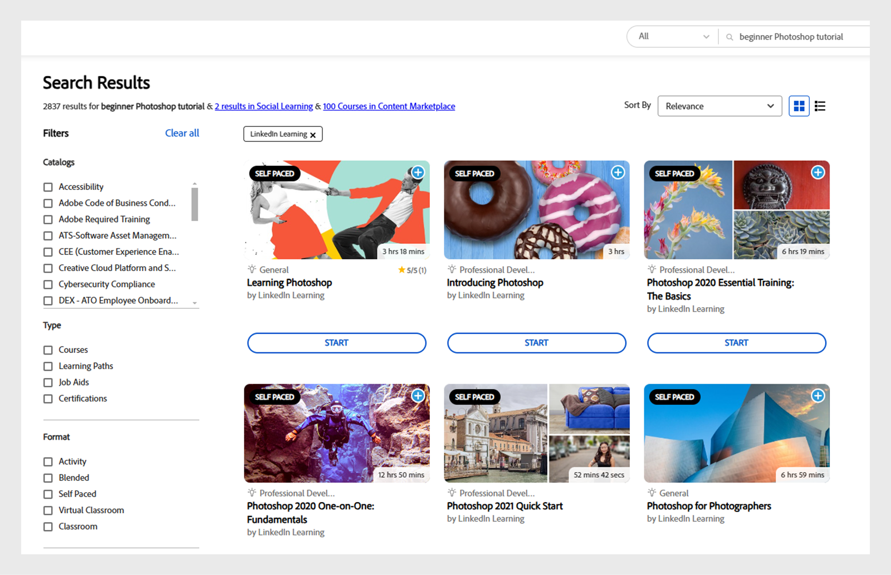

# Pesquisa avançada de IA no Adobe Learning Manager

O recurso de pesquisa no Adobe Learning Manager aprimora a experiência do usuário, permitindo que ele encontre conteúdo relevante de maneira eficiente e ajudando-o a consumir o conteúdo certo.

O Adobe Learning Manager apresenta um recurso de pesquisa viabilizado por IA que combina pesquisa lexical e semântica. Essa funcionalidade aprimorada permite que os alunos encontrem conteúdo relevante de maneira eficiente. A pesquisa avançada viabilizada por IA entende o significado da consulta e fornece resultados relevantes.

## Principais benefícios

* **Pesquisa mais inteligente**: entende o contexto e a intenção por trás dos termos de pesquisa
* **Relevância aprimorada**: fornece resultados com base no significado da sua consulta
* **Experiência do usuário aprimorada**: ajuda os alunos a consumir o conteúdo certo

>[!NOTE]
>
>A pesquisa viabilizada por IA só está disponível para os alunos.

## Por que a pesquisa é importante?

A funcionalidade de pesquisa é importante por vários motivos:

* **Experiência do Usuário**: aumenta a satisfação do usuário ao habilitar a recuperação rápida de informações
* **Eficiência**: economiza tempo reduzindo o esforço para localizar conteúdo específico.
* **Acessibilidade**: recursos de pesquisa eficazes tornam as informações mais acessíveis, garantindo que os usuários possam se envolver com conteúdo relevante para suas necessidades.
* **Personalização**: sistemas de pesquisa avançados podem personalizar os resultados com base nas preferências do usuário, melhorando a relevância das informações apresentadas.

## Evolução dos comportamentos de pesquisa na Web

À medida que as pessoas pesquisam on-line, a maneira como pesquisam está mudando, e os mecanismos de pesquisa estão se ajustando para acompanhar. Veja a seguir algumas das principais maneiras pelas quais as pessoas pesquisam informações nos últimos tempos:

* **Intenção**: em vez de digitar palavras-chave exatas, os usuários agora expressam suas necessidades com frases como eu quero ou preciso. Motores de busca modernos entendem o propósito por trás dessas frases e dão resultados mais relevantes.
* **Resultados Classificados**: os resultados da pesquisa são organizados com base no que outros usuários acharam útil. Isso significa que o conteúdo mais útil aparece na parte superior, facilitando a localização de informações de qualidade.
* **Várias Fontes**: quanto mais fontes um mecanismo de pesquisa cobrir, melhores serão os resultados. Ao extrair informações de uma variedade de fontes confiáveis, os mecanismos de pesquisa fornecem respostas mais completas e precisas.
* **Personalizado**: os mecanismos de pesquisa ajustam os resultados com base em fatores como hora, local e preferências do usuário. Isso torna mais fácil para os usuários encontrar informações que se ajustem às suas necessidades específicas no momento.

## Por que a pesquisa da Adobe Learning Manager é melhor

O Adobe Learning Manager oferece uma experiência de pesquisa mais inteligente e avançada. Ele não só combina palavras-chave, mas também entende contextualmente o significado das consultas do usuário para encontrar os resultados mais relevantes.

* **Com IA**: o Adobe Learning Manager usa técnicas avançadas de IA para entender o significado por trás da intenção de pesquisa e não apenas as palavras. Isso ajuda a mostrar resultados que realmente correspondem ao que o usuário deseja, tornando as pesquisas mais precisas.
* **Orientado por colegas**: o Adobe Learning Manager usa uma série de parâmetros de qualidade de curso para classificar os resultados mais úteis. Esse algoritmo de classificação é treinado em 50 milhões de pontos de dados que pontuam periodicamente todo o conteúdo no repositório
* **Abrangente**: o Adobe Learning Manager pesquisa toda a biblioteca, incluindo conteúdo próprio, títulos de cursos de terceiros, descrições, marcas, anotações personalizadas e outros metadados. Para conteúdo como Vídeo e PDF, ele transcreve e pesquisa automaticamente dentro da transcrição.

## Pesquisa viabilizada por IA do Adobe Learning Manager

O Adobe Learning Manager usa a tecnologia de IA avançada para aprimorar a experiência de pesquisa e facilitar a localização de conteúdo de aprendizado relevante. Os principais componentes da pesquisa avançada estão descritos abaixo.

### Reconhecendo termos importantes

O Adobe Learning Manager usa o Processamento de linguagem natural (NLP) para identificar as palavras-chave importantes dos títulos e descrições do curso. Em seguida, ele se concentra nessas palavras-chave para fornecer melhores resultados de pesquisa, ajudando a aumentar os resultados com essas palavras-chave em relação a outros resultados. Por exemplo, se um aluno pesquisar **Photoshop Basics**, o Adobe Learning Manager priorizará a palavra **Photoshop** para mostrar os cursos mais relevantes.

_Priorizar a palavra-chave_

Na captura de tela acima, um aluno pesquisa cursos usando o termo **Introdução ao Photoshop**. A pesquisa prioriza a palavra **Photoshop** para encontrar os cursos mais relevantes em torno do **Photoshop**. Para a palavra-chave getting started, ela entende a intenção e procura palavras semelhantes para mostrar as melhores correspondências. Dessa forma, o aluno vê cursos que se concentram no Photoshop e são adequados para iniciantes.

### Expandindo a consulta

O Adobe Learning Manager expande a consulta do usuário para um significado mais contextual, para ajudar a encontrar melhores resultados. Dessa forma, o algoritmo de pesquisa obtém mais contexto junto com a consulta do usuário. Mesmo que os alunos usem termos gerais, eles ainda podem encontrar resultados úteis. Por exemplo, se um aluno estiver procurando por **fundações de atendimento ao cliente**, ele tentará localizar a palavra-chave na consulta e expandir o restante da consulta para frases semelhantes.

_Expandindo a consulta_

### Pesquisa de metadados do curso

A pesquisa de metadados do Adobe Learning Manager abrange metadados de cursos nativos e importados (por exemplo, do LinkedIn Learning ou Go1). Esse recurso pesquisa os títulos do curso, descrições, tags, notas personalizadas e outros metadados. Isso ajuda a tornar os resultados melhores e mais precisos usando muitos metadados diferentes para encontrar resultados.
Observação: os dados do cliente, incluindo conteúdo e transcrições, não são compartilhados com nenhum serviço externo para pesquisa viabilizada por IA. Todo o conteúdo é armazenado no sistema de armazenamento atual.

#### Pesquisa no conteúdo

O Adobe Learning Manager apresenta recursos de pesquisa aprimorados que permitem aos usuários pesquisar no conteúdo real de vários tipos de arquivos, incluindo vídeos, arquivos de áudio, PDF, documentos, apresentações e planilhas. O sistema transcreve automaticamente esse conteúdo para fornecer resultados de pesquisa mais abrangentes e precisos. Além disso, gravações de reuniões do Adobe Connect são incorporadas à pesquisa, garantindo que informações valiosas não sejam perdidas. Se uma correspondência for encontrada no conteúdo, o modelo de pesquisa aumentará a classificação desse conteúdo nos resultados finais. A classificação final é determinada por vários fatores, conforme descrito na seção [Pesquisa e reclassificação acionadas por IA](/help/migrated/learners/feature-summary/advanced-search.md#ai-powered-search-and-re-ranking).

>[!NOTE]
>
>Conteúdo recém-adicionado, como vídeos ou PDF, estará disponível para pesquisa de conteúdo após um período de processamento de 24 horas.

### Pesquisa semântica

O Adobe Learning Manager agora incorpora a pesquisa semântica ao lado da pesquisa lexical tradicional, aprimorando a precisão dos resultados da pesquisa. Ao gerar incorporações de vetores a partir de títulos e descrições do curso, ele cria um banco de dados vetorial abrangente. Quando um aluno envia uma consulta, o sistema vetoriza a consulta e executa a correspondência de similaridade para identificar os resultados mais relevantes. Por exemplo, se um aluno pesquisa por tutorial para iniciantes no Photoshop, o sistema entende a solicitação e encontra cursos especialmente úteis para iniciantes no Photoshop.

_Pesquisa semântica_

>[!NOTE]
>
>No momento, a pesquisa semântica oferece suporte apenas ao conteúdo em inglês.

### Pesquisa e reclassificação viabilizadas por IA

A busca da Adobe Learning Manager lidera o setor, combinando tecnologias tradicionais e avançadas. Ele combina métodos de pesquisa tradicionais, como correspondência de frases e pesquisa semântica sofisticada, para produzir resultados abrangentes. O sistema classifica esses resultados com base em fatores importantes, como números de inscrição, datas de publicação, classificações e popularidade. Isso garante correspondências de alta qualidade de todos os índices, guiadas pelo nosso sistema de classificação de qualidade de curso.

Em geral, a pesquisa viabilizada por IA foi projetada para ser completa, precisa e de fácil utilização, ajudando os alunos a encontrar rapidamente os recursos de que precisam para apoiar sua jornada de aprendizado.

>[!NOTE]
>
>1. Os clientes que usam uma implementação sem periféricos precisam seguir a documentação da API para ativar a Pesquisa avançada
>2. No momento, a pesquisa avançada não está disponível para o aplicativo Salesforce.
>3. Os dados do cliente, incluindo conteúdo e transcrições, não são compartilhados com nenhum serviço externo para pesquisa viabilizada por IA. Todo o conteúdo permanece armazenado com segurança no sistema de armazenamento existente.
