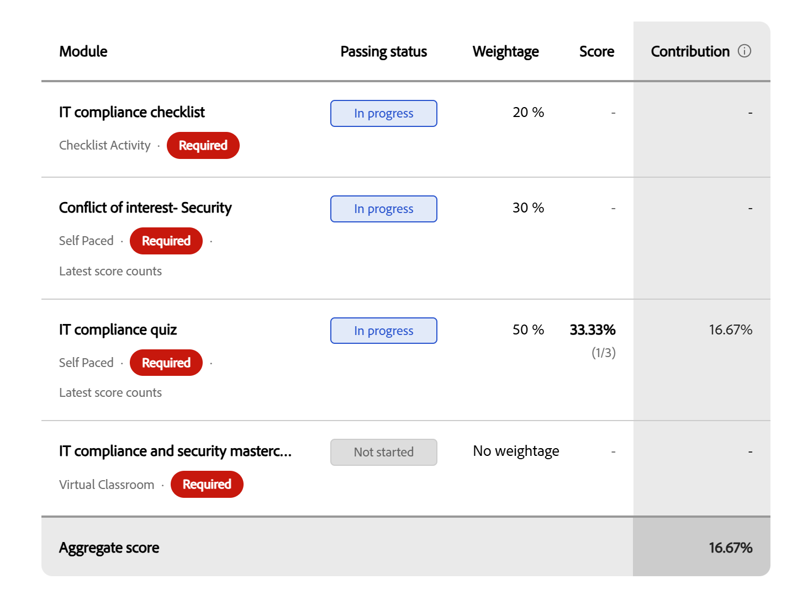

# Gradiente para alunos

## Iniciar um curso com livro de notas

Quando o livro de notas está habilitado e visível para um curso no Adobe Learning Manager, uma guia **Livro de notas** aparece na página de visão geral do curso. Use-a para ver sua pontuação ponderada para cada módulo, sua pontuação agregada atual e se você passou ou ainda precisa concluir mais do curso.

## Quando o catálogo de notas estiver disponível

A guia **Gradebook** aparece ao lado de **Módulos**, **Anotações** e **Discussões** no reprodutor do curso quando o autor ou administrador habilitou a visibilidade do gradebook para o curso. Se a guia não estiver visível, o livro de notas não foi ativado para este curso ou o administrador desativou a visibilidade do aluno. As pontuações ainda podem ser gravadas e estar visíveis para o administrador.

Você pode abrir a guia **Gradebook** a qualquer momento durante a inscrição:

* **Antes de iniciar:** após a inscrição, você verá a lista completa de módulos pontuáveis com suas porcentagens de ponderação, as marcas máximas para cada um e os critérios de aprovação definidos pelo autor. Isso mostra exatamente como o curso é classificado antes de começar.
* **Enquanto em andamento:** à medida que você conclui os módulos e as pontuações são gravadas, o catálogo de notas é atualizado para mostrar suas pontuações até agora, juntamente com os módulos que ainda não foram tentados ou que estão aguardando a correção.
* **Após a conclusão:** o gradiente mostra todas as pontuações finais do módulo, a pontuação agregada calculada do curso e um resultado de **Aprovado** no cabeçalho.

## Exibir o catálogo de notas

* Em **Meu Aprendizado**, selecione seu curso.
* Selecione a guia **Gradebook** na página do curso.

  O cabeçalho do livro de notas mostra:

  

* O **Critério de aprovação:** A pontuação agregada mínima e o número de módulos necessários
* O número de módulos necessários que você concluiu do total
* Sua **Pontuação agregada** atual como uma porcentagem
* Seu status atual do curso: **Não iniciado**, **Conclusão pendente**, **Aprovado** ou **Falha**

A tabela de módulos abaixo do cabeçalho mostra as seguintes colunas para cada módulo:

| **Coluna** | **O que ele mostra** |
|------------|-------------------|
| **Módulo** | O nome e o tipo do módulo |
| **Status** | Seu status de conclusão ou pontuação para este módulo (consulte a referência de status abaixo) |
| **Peso** | A porcentagem com que este módulo contribui para sua pontuação agregada |
| **Pontuação** | Sua pontuação para este módulo (por exemplo, 40/100) |
| **Contribuição** | Os pontos percentuais reais que este módulo adicionou à sua pontuação agregada até agora |

## Exibir peso do módulo na guia Módulos

Você também pode ver o peso de cada módulo na guia **Módulos** sem abrir o gradiente.

Na página do curso, selecione a guia **Módulos**.

A guia **Módulos** exibe a porcentagem de peso de cada módulo e o número de módulos necessários para concluir o curso.

## Pontuações do módulo com várias tentativas

Se um módulo permitir várias tentativas, a pontuação mostrada no livro de notas depende de como o autor do curso o configurou:

* **Mais alto:** a melhor pontuação de qualquer tentativa é mostrada. Uma pontuação mais baixa em uma tentativa posterior não reduz sua pontuação gravada.
* **Mais Recente:** a pontuação da sua tentativa mais recente é sempre mostrada. Uma pontuação mais baixa em uma tentativa posterior substitui a anterior.

## Entenda o status do seu módulo

Cada módulo no gradiente mostra um dos seguintes status:

| **Status** | **Interpretação** |
| ------------ | ------------------- |
| **Aprovado** | Módulo concluído e pontuação registrada |
| **Em andamento** | Módulo iniciado mas ainda não concluído |
| **Não iniciado** | Módulo ainda não aberto |
| **Falha** | O módulo marcou e a pontuação não atingiu o limite de aprovação do módulo |

## Como a pontuação agregada é calculada

Sua pontuação agregada é a soma da contribuição ponderada de cada módulo pontuado:

(Pontuação alcançada ÷ Pontuação máxima) × % de Ponderação = Contribuição do módulo

A coluna **Contribuição** no livro de notas mostra a contribuição de cada módulo para a sua agregação atual. Os módulos marcados como **Sem ponderação** são excluídos deste cálculo.

A escala de pontuação não precisa ser a mesma em todos os módulos. Um módulo teve uma pontuação de 100 e um módulo de 10, ambos contribuem corretamente. A fórmula normaliza cada um antes de aplicar a ponderação.
