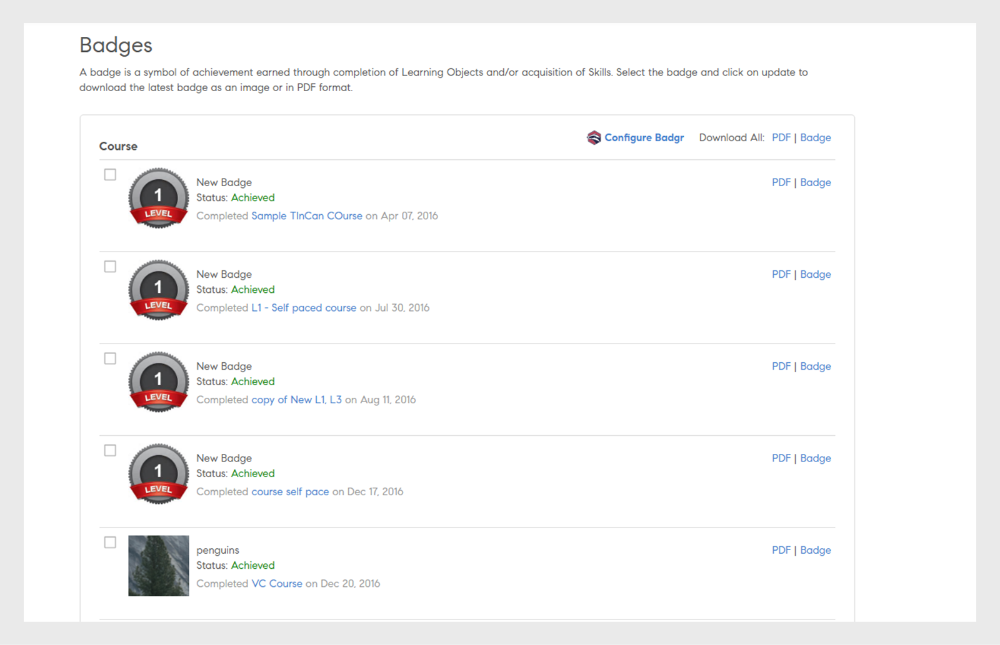
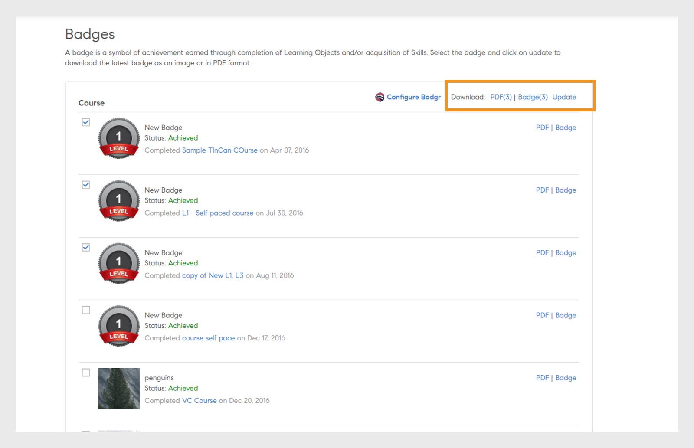

# Medalhas

Saiba como visualizar e baixar medalhas usando o aplicativo Learning Manager para alunos.

## Medalhas {#Badges-1}

As medalhas são um medidor de desempenho que o funcionário pode ganhar ao concluir um curso. O Adobe Learning Manager introduz um dos mais recentes conceitos de e-learning denominado Medalhas. Profissionais no mundo inteiro usam essas medalhas como representação de uma habilidade em particular ou do resultado do aprendizado.

As medalhas ajudam os alunos a melhor delimitar a si mesmos e a apresentar seu conjunto granulado de habilidades, além de dar credibilidade e boa visibilidade aos alunos.

## Exibir e baixar medalhas {#viewinganddownloadingbadges}

Como aluno, é possível visualizar as medalhas no widget Minhas conquistas na página inicial dos alunos. Uma lista de medalhas aparece na parte superior da página ao lado do seu perfil. É possível ver somente até sete medalhas de uma vez na página inicial. Contudo, você pode ver a lista completa de medalhas na caixa de diálogo ao clicar em qualquer medalha.

Recentemente, as medalhas obtidas são exibidas na parte esquerda da lista, seguidas das medalhas ainda não obtidas. Para melhor identificar as medalhas obtidas em relação às medalhas ainda não obtidas, as medalhas ainda não obtidas aparecem opacas.

Clique em qualquer medalha para obter uma lista de todas as medalhas que você obteve. Você também pode ver todas as medalhas disponíveis alinhadas aos seus respectivos cursos. Nas medalhas ainda não obtidas, clique no nome do curso para ver o curso que está alinhado à medalha. A imagem de amostra é mostrada abaixo como referência.

Clique no link **[!UICONTROL Baixar todas as medalhas]** para baixar todas as medalhas obtidas no formato zip. Você também pode baixar uma medalha individualmente clicando no ícone do cubo ao lado do nome de cada medalha.

**Baixar medalha como PDF**

Você também pode baixar um conjunto de medalhas ou uma única medalha no formato PDF.

* Clique em **[!UICONTROL Baixar todos os registros de medalha]** para baixar como PDF as medalhas que você obteve.
* Para baixar medalhas individuais, selecione a medalha e clique no ícone do PDF ao lado do nome da medalha.

**Para certificados com expiração, ou seja, certificados recorrentes, o Learning Manager menciona a data de validade do certificado. As datas serão exibidas na interface do usuário e no PDF do certificado.**

## Medalhas abertas {#openbadges}

A plataforma Open Badges Backpack, a qual o Learning Manager oferece suporte, está sendo **retirada**. No momento, o Learning Manager não oferece suporte a Medalhas abertas (Open Badges).

As medalhas abertas se trata de um padrão para reconhecer e comprovar o aprendizado dos alunos. Você pode usar essas medalhas para mostrar on-line suas conquistas.

O Learning Manager oferece suporte ao conceito de medalhas abertas para seus alunos. Você pode usar as medalhas baixadas como medalhas abertas. Cada medalha baixada apresenta informações em forma de metadados que oferecem suporte ao novo padrão de medalha aberta.

## Suporte para medalhas do Badgr

Os alunos podem integrar as suas contas da plataforma de aprendizado com as suas contas do Badgr. Isso permite que os alunos compartilhem medalhas em redes sociais através da conta do Badgr. O Badgr também oferece medalhas autenticáveis com base no padrão da mochila, o que significa que as medalhas são verificadas.

>[!NOTE]
>
>Este recurso não está disponível em ambientes autorizados pelo FedRAMP. Consulte [Disponibilidade de recursos em ambientes FedRAMP](/help/migrated/feature-availability-in-fedramp-authorized-environment.md) para obter detalhes.

Medalhas abertas são medalhas que têm alguns metadados incorporados à imagem da medalha. Estes metadados fornecem informações sobre o emissor, o destinatário, a tarefa realizada, a validade da medalha etc. A mochila do Badgr será acessível diretamente do Learning Manager por fornecer um local central para armazenar todas as medalhas e compartilhá-las. Os alunos podem fazer logon na conta do Badgr e estabelecer a integração. A partir daí, as medalhas obtidas no Learning Manager são carregadas automaticamente na conta do Badgr.

Depois que o administrador ativa a opção **Integração do Badgr**, um aluno pode então se integrar ao Badgr e configurar a medalha. Para integrar, o aluno precisa fazer logon na conta Badgr no Learning Manager.

>[!NOTE]
>
>O Learning Manager não oferece uma conta do Badgr como parte da integração. O aluno deve criar a sua própria conta e integrar-se ao Learning Manager.

Um aluno deve ter uma conta do Badgr criada antes de estabelecer uma conexão com o Learning Manager.

No aplicativo do aluno, na página Medalhas, há uma opção chamada Configurar o Badgr. Se a opção for clicada, uma caixa de diálogo será aberta, onde o status da conexão deverá ser exibido como Conectado/Não conectado.

## Atualização de medalha

Um aluno pode atualizar a sua medalha para a medalha mais recente selecionando a medalha e clicando em **Atualizar** na seção superior direita da página. Uma atualização de medalha ocorre em caso de alterações na imagem da medalha ou medelha do objeto de aprendizado feitas por um administrador/autor.

Esse processo de atualização da página é chamado de Recozimento manual. Nesse caso, a medalha é recarregada na mochila do Badgr após a conclusão da cozimento, mesmo que tenha a mesma imagem/nome da medalha. Após atualizar a medalha, o aluno recebe uma notificação de que a atualização foi concluída.

## Perguntas frequentes {#frequentlyaskedquestions}

**1. Como baixar a medalha como aluno?**

Na página Medalhas, é possível baixar uma medalha como imagem ou formato PDF. Escolha uma habilidade ou um curso e clique em **PDF** ou **Medalha**.
