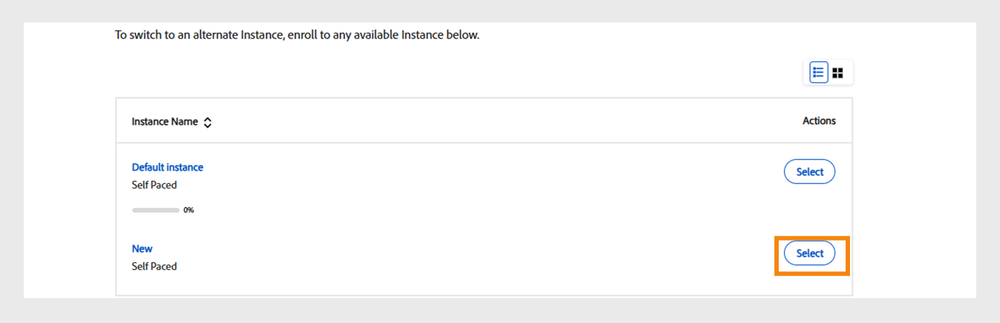

# Meus aprendizados

Leia esse artigo para saber como visualizar e consumir cursos no Learning Manager. Participe das discussões e forneça feedback.

O autor cria cursos. Os alunos podem realizar os cursos e os administradores podem acompanhar o desempenho dos alunos com base no aproveitamento curso.

## Visão geral {#overview}

O Adobe Learning Manager permite que os alunos acessem os cursos, programas de aprendizado e certificações. Os alunos podem navegar por todos os cursos usando o catálogo ou podem se inscrever nos cursos de sua escolha. Os alunos podem exibir todos os cursos inscritos e os cursos atribuídos a eles na guia Aprendizado.

>[!NOTE]
>
>Os alunos também podem instalar o aplicativo Learning Manager para iPad na App Store e o aplicativo Learning Manager para Android no Google Play e acessar os cursos nos dispositivos móveis. Todos os recursos da função de aluno também estão disponíveis no aplicativo. Os alunos também podem realizar cursos off-line e obter um acesso perfeito após ficar on-line. Consulte o recurso [Usuários de tablet Android e iPad](ipad-android-tablet-users.md) para obter mais informações.

## Exibição de objetos de aprendizado {#viewingcourses}

Como aluno, você pode exibir uma lista de todos os cursos disponíveis. Clique em Meu aprendizado na página Inicial ou no painel esquerdo para exibir todos os cursos nos quais você se inscreveu.

*Exibir cursos atribuídos*

Se ainda não começou o curso, pode clicar no botão Iniciar ao lado do curso. Se já tiver iniciado o curso, pode clicar no botão Continuar.

Para exibir um curso concluído, clique no botão Rever ao lado do curso.

Pode haver várias fases em um curso. Clique no nome do curso para visualizar os detalhes. No painel direito, é possível ver a data do prazo de conclusão de cada fase do curso.

*Exibir um curso concluído*

## Eficácia do curso {#courseeffectiveness}

A pontuação da eficácia do curso ajuda os alunos a escolherem os cursos com a maior pontuação para suas necessidades de aprendizagem. A eficácia do curso é avaliada para compreender a utilidade de um curso para o aluno. É calculada com base no feedback recebido pelo número de usuários de um curso específico. Se a porcentagem de alunos que oferecem feedback é maior, a avaliação da eficácia do curso é alta.

É uma combinação dos resultados do feedback do aluno sobre o conteúdo do curso, dos resultados dos testes de um aluno no curso e do feedback do gerente que avalia um aluno com base nos aprendizados do curso.

Na página Cursos, o aluno pode ver a classificação da eficácia do curso nas miniaturas do curso conforme mostrado na imagem abaixo. Você pode ver a classificação desse curso como 14.

*Exibir a classificação da eficácia do curso*

Para ver os detalhes da classificação da eficácia do curso, clique no valor da eficácia do curso. Uma janela pop-up aparece conforme mostrado abaixo.

*Exibir eficácia do curso*

Clique na seta para baixo no canto inferior direito da janela pop-up para ver como são feitos os cálculos da eficácia do curso.

*Cálculo da eficácia do curso*

## Pesquisar cursos e programas de aprendizado {#searchingcoursesandlearningprograms}

O Adobe Learning Manager permite encontrar de forma mais fácil os cursos da sua escolha rapidamente. Você pode pesquisar seus cursos das seguintes maneiras:

1. Clique no ícone de pesquisa exibido no canto superior direito. É exibido um campo de pesquisa. Digite o nome do curso/programa de aprendizado ou qualquer palavra-chave associada aos seus cursos. Você pode pesquisar cursos por metadados, notas, habilidades, medalhas ou tags. As marcas podem ser pesquisadas dentro do campo de pesquisa, o que significa que são exibidas no campo de pesquisa à medida que você digita.
1. O aluno pode refinar os resultados da pesquisa na página do catálogo filtrando por tipo, habilidades, etiquetas e status.

Você pode classificar os cursos por relevância, nome ou data de publicação clicando em Classificar por e escolhendo no menu suspenso.

Na página de resultados da pesquisa, você pode filtrar os cursos de acordo com a **duração** dos cursos e o **formato** dos cursos. Isso proporciona maior flexibilidade na pesquisa de cursos e garante que você encontre os cursos adequados.

## Inscrever-se nos cursos {#enrollingforcourses}

Os alunos são inscritos nos cursos das três formas possíveis:

1. O administrador/gerente inscreve alguns alunos a cursos obrigatórios com base nas necessidades da empresa.
1. O gerente indica alguns cursos para os membros da sua equipe. Você obtém uma notificação com uma opção para aceitar ou rejeitar o curso/programa de aprendizado. Quando os alunos aceitam a indicação, eles são inscritos no curso/programa de aprendizado.
1. Os alunos podem se inscrever diretamente em um curso/programa de aprendizado:

   1. Se o curso/programa de aprendizado for do tipo que o próprio aluno se inscreve, ele é inscrito imediatamente.
   1. Se o curso/programa de aprendizado for do tipo aprovado pelo gerente, o aluno passará para o estado **aprovação pendente**. Após a aprovação do gerente, o aluno é inscrito no curso.
   1. Se os alunos se inscreverem em um curso com lista de espera (no caso da sala de aula), então, eles terão de aguardar até que alguém saia do curso ou até que o administrador os aprove para o curso.

Os alunos podem se inscrever em uma ampla lista de cursos com base em suas escolhas. A guia Cursos exibe todos os cursos inscritos/atribuídos.

No entanto, você tem a opção de percorrer qualquer um dos cursos listados no catálogo movendo o mouse sobre ele e clicando em Explorar. A página Inscrever é exibida. Clique em Inscrever-se no canto superior direito da página para incluir o curso na lista de cursos.

Pode haver várias fases/sessões de um curso/programa de aprendizado. No catálogo, clique no nome do curso/programa de aprendizado dentro do quadro para visualizar os detalhes. É possível ver a inscrição na fase do curso/programa de aprendizado com base na data do prazo de conclusão de cada fase do curso/programa de aprendizado.

**Registrar interesse nos cursos** 

Você pode se registrar para indicar interesse em qualquer curso de sala de aula sem sessões planejadas. Você recebe uma notificação sempre que a sessão do curso começar para participar do curso.

>[!NOTE]
>
>Os alunos devem ver uma mensagem de conflito se se inscreverem em duas sessões diferentes ao mesmo tempo ou em horários de sobreposição.

## Alternar instâncias

Um aluno inscrito em uma instância específica de um curso pode visualizar uma lista de todas as instâncias disponíveis do curso e alternar para outra instância que funcione melhor para ele. A razão para alternar pode ser o aluno não ter participado da instância anterior, o tempo de sessão da nova instância é mais adequado ou pode ser algo diferente.

Qualquer progresso feito pelo aluno como parte do curso, pontuações do questionário do aluno etc., é transferido para a nova instância. Esse recurso destina-se principalmente a cursos em sala de aula e combinados, mas ofereceremos suporte a todos os tipos de cursos, incluindo cursos individualizados.

A opção Exibir todas as instâncias é exibida independentemente das configurações de Alternância de Instância. Os alunos agora verão uma opção para exibir todas as instâncias se houver mais de uma instância de um curso.

Se a opção Alternância de Instância estiver ativada, os alunos poderão alternar para várias instâncias até concluírem o curso. Se a opção estiver desativada, os alunos poderão ver as instâncias, mas não poderão se inscrever no curso.

Quando o aluno seleciona **Exibir todas as instâncias**, o aluno pode ver todas as instâncias do curso.

_Exibir toda a página de instância do console do aluno_

_Alternar instância da página do aluno_

Um administrador pode alternar instâncias para os alunos. Selecione um curso no Admin Console, vá para a seção **[!UICONTROL Alunos]**, escolha um usuário e clique no botão **[!UICONTROL Ação]**. Em seguida, selecione **[!UICONTROL Alternar Instância]** e escolha a instância desejada.

_Alternar instância do Admin Console_

_Prompt de alternar instância_

Não é possível alternar instâncias até que qualquer instância do curso seja concluída no aplicativo do aluno ou do administrador.

Os autores, ao criar um curso, podem alternar entre ativar ou desativar a “Opção de instância”. A Alternância de instância está disponível apenas para cursos gratuitos.

## Fluxo de trabalho como aluno

Como aluno, você terá permissão para classificar um curso somente após a inscrição. Você pode ver a média de classificações por estrelas de qualquer curso na página **Início**, **Meu aprendizado** e **Catálogo**.

1. Faça logon como **Aluno**. Isso carrega a **Página Inicial**.

1. Pesquise um curso inserindo o nome do curso na barra de pesquisa. Como alternativa, você pode escolher na lista de cursos exibida clicando em **Meu aprendizado** ou **Catálogo** no painel esquerdo.

1. Depois de selecionar um curso, clique em **[!UICONTROL Inscrever-se]**.

   
   *Inscrever-se em um curso*

1. Selecione o número de estrelas para classificar um curso adequadamente, sendo 1 para péssimo e 5 para excelente. Depois, clique em **[!UICONTROL Enviar]**.

   
   *Enviar classificação do curso*

   Um aluno pode reenviar o feedback fornecendo classificação por estrelas várias vezes, pois a classificação mais recente é considerada.

1. Uma mensagem de confirmação é exibida após o envio.

   
   *Mensagem de confirmação do feedback*

   Se quiser reenviar o feedback, clique na mensagem. Uma vez que a classificação é enviada, a mensagem é exibida por três segundos e, em seguida, a classificação é mostrada. Se quiser alterar a classificação, você pode selecionar uma estrela diferente e enviar.

Os cursos podem ser classificados com base na média de classificação fornecida. Você pode classificar os casos na lista suspensa Classificar por no canto superior direito, disponível em **Catálogo**.

## Fazendo um curso {#consumingnbspacourse}

Depois de se inscrever em um curso, você pode começar a fazer o curso clicando em Iniciar no curso. Ou clique em **[!UICONTROL Cursos]** na guia **[!UICONTROL Aprendizado]**. Escolha um curso que gostaria de começar a fazer.

Se ainda não começou o curso, clique no botão Iniciar ao lado do nome do curso.

Você pode ver todos os módulos do curso na janela do navegador.

**Recursos do reprodutor**

**Sumário** - Ao realizar um curso, o reprodutor exibe um índice desse curso em particular no painel esquerdo da janela. Você pode clicar em cada tópico e navegar até ele diretamente.

**Marcadores** - Se qualquer um dos módulos do curso tiver um sumário de módulo, os tópicos do sumário de módulo poderão ser marcados para referência posterior. Quando marcado, um ícone de faixa de opções aparece ao lado da entrada do índice. Os marcadores podem ser excluídos clicando novamente na faixa de opções.

**Notas** - uma provisão está disponível para gravar notas enquanto você está fazendo o curso. Depois de registrar as notas, é possível salvá-las e baixá-las como PDF, ou enviá-las por e-mail aos IDs de todos os alunos inscritos. Ao clicar em Salvar, é exibida uma opção para escolher o local no qual salvá-las como arquivo PDF.

*Fazer anotações do curso*

**Legendas ocultas** - Nos cursos desenvolvidos para o Adobe Captivate, se as legendas ocultas forem habilitadas durante o desenvolvimento do curso, o aluno poderá ver as legendas. Clique em CC na parte inferior do reprodutor. A opção de legendas ocultas está disponível somente para conteúdo HTML do Captivate 8.0.2. Para todos os outros tipos de módulos, a opção CC não aparece na barra de reprodução.

**Rever curso** - Você pode revisitar um curso de dois modos em dois cenários possíveis:

* Clique em Rever enquanto o curso ainda estiver no estado concluído.
* Clique em Continuar enquanto o curso ainda estiver no estado concluído.

**Tela inteira** Clique no ícone Tela inteira no canto inferior direito do reprodutor para exibir o curso na janela de tela inteira.

**Botões de navegação** Você pode clicar nas setas para cima/para baixo para mover pelos slides em conteúdo pdf, docx e pptx. As setas do slide podem ser usadas para ir para os tópicos seguintes de todos os tipos de conteúdo.

**Fechar o curso** – Clique no ícone de fechamento (x) no canto superior direito do reprodutor para sair o curso.

*Depois de sair do curso, você pode rever o curso clicando no botão Rever na página de descrição do curso.*

## Várias instâncias de inscrição

Se um curso tiver várias instâncias, os alunos terão a opção de escolher e se inscrever em uma instância específica. Eles também podem alternar entre instâncias, se necessário.

## Classificação por estrelas

Somente depois de se inscrever em um curso, um aluno pode fornecer um feedback de estrela ao curso. Na página Visão geral do curso, o aluno pode classificar o curso como estrelas (1-menor, 5-maior).

*Fornecer classificação por estrelas como feedback*

Um aluno poderá selecionar uma estrela específica (de 5) e enviar a classificação. O aluno também pode editar a seleção clicando em uma estrela diferente. Uma vez enviada, uma mensagem de agradecimento por seu feedback será exibida.

Se o aluno quiser reenviar o feedback, basta clicar na mensagem. O botão **Enviar** é reabilitado. Um aluno pode fornecer classificação por estrelas várias vezes após se inscrever em um curso. A classificação mais recente será sempre considerada.

Depois que o aluno fornece uma classificação, a classificação por estrelas média e o número de alunos que forneceram a classificação por estrelas aparecem na página **Visão geral do curso**.

*Visão geral do curso*

Este recurso está desativado para todas as contas existentes. Os administradores podem ativá-lo nas Configurações. Somente então as classificações por estrelas serão exibidas para os alunos.

## Marketplace de conteúdo

A opção Marketplace de conteúdo está no painel esquerdo do aplicativo do aluno. Ao clicar na opção, você pode ver todos os cursos/catálogo inteiro e listas de reprodução selecionadas.

Na página abaixo, você pode ver os cursos que estão presentes no catálogo inteiro. Cada curso exibe a sua duração e o tópico mais amplo ao qual pertence. Você pode escolher o tópico no filtro à esquerda da página.

Você pode visualizar um curso por exatamente dois minutos.

*Visualizar curso no marketplace*

Quando o administrador convida você a explorar e visualizar uma grande variedade de cursos, você verá uma notificação.

Como Aluno, você pode expressar interesse por um catálogo inteiro ou qualquer lista de reprodução selecionada na seção **Lista de reprodução selecionada**.

*Exibir lista de reprodução selecionada*

Depois de expressar o seu interesse por um curso/treinamento, o interesse é registrado e o administrador pode, então, obter o registro.

No aplicativo do aluno, todos os administradores têm acesso ao Marketplace de conteúdo. Se o acesso for revogado pelo administrador, os alunos não poderão ver a guia Marketplace de conteúdo.

Os alunos convidados pelo administrador podem explorar o Marketplace de Conteúdo.

>[!NOTE]
>
>O Marketplace de Conteúdo não é compatível com o Internet Explorer 11.

Todos os filtros e outras opções são mostrados no vídeo abaixo.

### Visualizar conteúdo

Você pode explorar e visualizar o curso e ver se ele atende às suas necessidades de aprendizado. Clique no botão **Visualizar** e veja a visualização do curso. A visualização fica disponível por dois minutos.

*Visualizar conteúdo no marketplace*

## Hub de Conteúdo

O Hub de Conteúdo permite que os administradores e especialistas de domínio (SMEs) selecionem listas de reprodução obrigatórias no aplicativo do aluno. Depois de listar, os administradores podem baixar o formulário de solicitação de compra e compartilhá-lo com o agente de vendas do Adobe.

Um administrador pode convidar SMEs para selecionar a lista de reprodução na qual estão interessados.

O Hub de Conteúdo está disponível na função de aluno para todos os administradores. Os administradores permitem que os SMEs selecionem a lista de reprodução na qual estão interessadas em comprar.

A página do Hub de Conteúdo fica visível para os administradores na função de aluno o tempo todo, pois permite que eles selecionem listas de reprodução com facilidade. Para ajudar você na lista de reprodução certa, os administradores podem tornar esta página acessível aos especialistas de domínio em suas contas. Visite a página Treinamento corporativo no lado do administrador e adote medidas para fornecer acesso.

## Escolher instância do curso {#choosecourseinstance}

Se for um aluno inscrito em uma instância do curso cuja sessão expirou, agora é possível alternar para outra sessão para continuar avançando. Isso pode ser feito apenas se o programa de aprendizado for flexível.

Para alterar a instância do curso, siga estas etapas:

1. Abra Catálogos > Programa de aprendizado.

   
   *Selecione um programa de aprendizado*

1. Use os botões de opção para escolher se deseja exibir todos os cursos ou cursos com instâncias não selecionadas. Observe que, se o aluno concluiu a instância, ele não poderá alternar para outra instância.

   
   *Exibir todos os cursos ou cursos com instâncias não selecionadas*

1. O menu suspenso da instância do curso exibe as instâncias disponíveis. Escolha a instância na lista suspensa.

   
   *Selecione uma instância*

1. Para aplicar a instância selecionada, clique em **[!UICONTROL Atualizar inscrição]**. A opção Atualizar inscrição está disponível na parte superior direita da página.

   A instância recém-selecionada está inscrita. Se um aluno estiver inscrito em uma instância do curso que faz parte de outro OA e atualizar a instância do curso que faz parte do Programa de aprendizado flexível, ele será automaticamente cancelado da inscrição nos outros Objetos de aprendizado após um aviso.

## Gerenciamento de progresso com base na linguagem

O progresso do aluno pode ser acompanhado separadamente para cada local, garantindo que a alternância entre os idiomas no reprodutor não afete o progresso alcançado anteriormente. O progresso de cada módulo é mantido independentemente nos níveis de usuário e módulo, evitando que o progresso seja substituído quando os alunos exploram conteúdo em locais diferentes.

Por exemplo, se um aluno alcançar 75% de progresso em inglês e, em seguida, mudar para espanhol, retornar para inglês retomará de 75% em vez de redefinir para 0%. Cada local armazena seu próprio estado de progresso, permitindo que os alunos naveguem e concluam conteúdo em vários idiomas sem perder o progresso individual.

Os seguintes tipos de conteúdo não são compatíveis com o progresso do aluno baseado no idioma:

* Conteúdo de vídeo e áudio não é suportado.
* Não há suporte para conteúdo de terceiros, incluindo Go1, LinkedIn Learning, getAbstract e Harvard ManageMentor.
* O conteúdo que não envia dados ao LRS (Armazenamento de Registros de Aprendizado) não terá o progresso rastreado ou salvo.
* Os usuários do aplicativo móvel não podem acompanhar o progresso desse recurso no modo offline.

## Completar um curso {#completingacourse}

Como aluno, você pode concluir o número exigido de módulos de um curso para concluí-lo. Os critérios de conclusão do curso dependem de quantos módulos foram definidos como obrigatórios pelo autor. Ao se inscrever em um curso com critérios mínimos de conclusão, você poderá ver os critérios de conclusão no painel direito da página Curso.

*Exibir critérios de conclusão*

Por exemplo, se um curso específico tiver o critério de conclusão como um dos dois módulos, então, completar apenas um módulo marca a conclusão do curso. Nesse caso, quando terminar o primeiro módulo, a barra de progresso exibe o estado de 100% de conclusão.

Se os módulos forem definidos como ordenados pelo autor, você deve concluir o número necessário de módulos em ordem sequencial, começando do primeiro. Se os módulos estiverem fora de ordem, você deve concluir o número necessário de módulos em qualquer ordem.

Depois de concluir um tutorial com o número necessário de módulos, se desejar finalizar os módulos opcionais, você pode retomar o curso.

## Exibindo e participando de discussões {#viewingandpariticpatingindiscussions}

Como aluno, você poderá interagir com outros alunos e seus professores usando a guia Discussão. É possível exibir as postagens de qualquer curso que você vê ou no qual se inscreve. Se o administrador tiver habilitado as discussões para um curso, você poderá ver a guia Discussão ao lado da guia Notas daquele curso.

Ao clicar na guia Discussões, você pode visualizar as postagens e comentários desse curso. Se você já tiver se inscrito no curso, também poderá começar a digitar postagens ou comentários para que outros usuários vejam. Depois de digitar a mensagem, clique em Publicar. Sua postagem deve conter pelo menos 10 caracteres. 

A postagem é imediatamente visível na guia Discussões. Você pode classificar as postagens como Mais recente primeiro ou Mais antigo primeiro e excluir as postagens que escreveu. Mesmo depois de cancelar a inscrição no curso, você ainda poderá ver todas as postagens e excluir as que você escreveu.

*Exibir discussões de participantes*

A guia Discussão não está ativada para usuários externos.

*Guia Discussão*

## Registrar interesse nos cursos

Os alunos podem registrar seu interesse nos cursos que não têm instância ativa.

Para registrar juros:

1. Faça logon no Adobe Learning Manager como aluno.
2. Vá para o **[!UICONTROL Catálogo]** e selecione o curso que não tem instância ativa.
3. Selecione **[!UICONTROL Registrar interesse]** na página de visão geral do curso.

   
   _Seção de visão geral do curso na interface do aluno, destacando a opção Registrar interesse_

## Ciclo de vida do curso {#courselifecycle}

Um ciclo de vida típico do curso é semelhante ao seguinte:

**Rascunho** - Quando um autor termina de criar um curso e o salva. Nesse estado, o curso ainda não está disponível para os alunos.

**Publicado** - quando um autor termina de publicar um curso. Nesse estado, o curso está disponível para os alunos se inscreverem.

**Retirado** - após ter publicado um curso, o autor pode movê-lo para o estado Retirado se não quiser que o curso apareça no catálogo de cursos dos alunos.

**Excluído** - Um curso no estado Excluído é aquele que foi removido completamente do aplicativo Adobe Learning Manager. Os cursos podem ser excluídos pelos autores somente quando estiverem no estado Rascunho ou Retirado.

*Visão geral do ciclo de vida de um curso*
