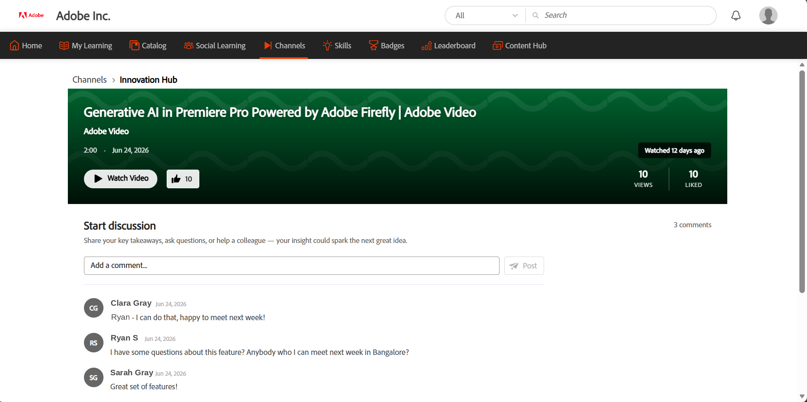

# Descubra e interaja com canais

Os canais ajudam os alunos a descobrir e acessar conteúdo de aprendizado informal baseado em vídeo, com curadoria nas páginas da Web e Confluência em nuvem no Adobe Learning Manager. Os administradores criam canais conectando-os a páginas da Web corporativas ou páginas de conferência na nuvem que hospedam sessões gravadas de compartilhamento e transferência de conhecimento.

Em vez de pesquisar em vários sites internos, você pode procurar o conteúdo do canal diretamente no Learning Manager. Os canais fornecem um local centralizado para descobrir vídeos relevantes, manter-se informado sobre novos conteúdos e participar dos recursos de aprendizado em ritmo individualizado da sua organização.

**Principais benefícios**

- Acesse o conteúdo em vídeo de páginas da Web corporativas e páginas de conferência na nuvem em um só lugar.
- Descubra recursos de aprendizado sem precisar navegar em vários sites internos.
- Assine canais para se manter informado quando novos conteúdos forem adicionados.
- Assista e goste de vídeos diretamente no Adobe Learning Manager.
- Participe das discussões e colabore com outros alunos sobre conteúdo compartilhado.
- Explore coleções selecionadas de vídeos relevantes para sua função e interesses.

## Encontrar canais

Use a página **Canais** para descobrir conteúdo novo, acessar canais nos quais você se inscreveu e exibir vídeos curtidos.

1. Faça logon no Adobe Learning Manager.

1. Selecione **Canais** na barra de navegação superior.

     A página **Canais** é aberta com a guia **Todos** exibida por padrão.

   

   *A guia Todos da página Canais, onde você descobre e assina os canais disponíveis.*

1. Use as seguintes guias para procurar o conteúdo do canal:

   | **Guia** | **Descrição** |
   |----|----|
   | **Todos** | Exibe todos os canais disponíveis. Use esta guia para descobrir e assinar novos canais. |
   | **Inscrito** | Exibe apenas os canais nos quais você se inscreveu. |
   | **Curtiu** | Exibe todos os vídeos que você curtiu nos canais. |

1. Selecione **Exibir Tudo** para um canal para exibir todos os vídeos disponíveis nesse canal.

## Inscrever-se num canal

Assine canais para acessar rapidamente o conteúdo mais relevante para você e se manter atualizado quando novos vídeos forem adicionados.

1. Na guia **Todos**, navegue até o canal no qual deseja se inscrever.

1. Selecione o botão **Assinar**.

     O canal é adicionado à guia **Inscrito**.

1. Selecione a guia **Inscrito**.

     Isso exibe todos os canais nos quais você se inscreveu.

   

   *Seus canais inscritos são coletados na guia Inscrito para acesso rápido.*

### Cancelar inscrição em um canal

Se você não quiser mais seguir um canal, selecione o botão **Inscrito** novamente. O canal foi removido da guia **Inscrito** e permanece disponível na guia **Todos**, onde você pode acessá-lo a qualquer momento.

## Assista a um vídeo

Assista a vídeos dos canais da sua organização para acessar conteúdo selecionado de aprendizado e compartilhamento de conhecimento.

Para assistir a um vídeo, navegue até um canal e selecione a miniatura do vídeo ou o ícone de reprodução. Na página de detalhes do vídeo, selecione o botão **Assistir Vídeo** para abrir e reproduzir o vídeo.

## Curtir um vídeo

Gostou de vídeos para salvá-los em sua guia **Curtida** e encontrá-los rapidamente mais tarde.

Para curtir um vídeo, selecione o botão **Curtir** em uma placa de vídeo ou na página de detalhes do vídeo. A contagem de curtidas foi atualizada e o vídeo foi adicionado à guia **Curtido** para fácil acesso.

A guia Curtido, onde os vídeos que você gosta são salvos para que possa encontrá-los mais tarde.

## Participe da discussão

Use a discussão em cada vídeo para compartilhar insights, dar feedback e fazer perguntas. Cada vídeo tem sua própria linha de discussão.

Para postar um comentário:

1. Abra o vídeo que deseja discutir.

1. Navegue até a seção **Iniciar discussão**.

1. Insira seu comentário na caixa **Adicionar um comentário**.

1. Selecione **Publicação**.

     O comentário é adicionado ao thread de discussão e fica visível para outros alunos que visualizarem o vídeo.

   

   *Assista a um vídeo, exiba suas curtidas e contagens de exibições e participe da discussão na página de detalhes do vídeo.*
