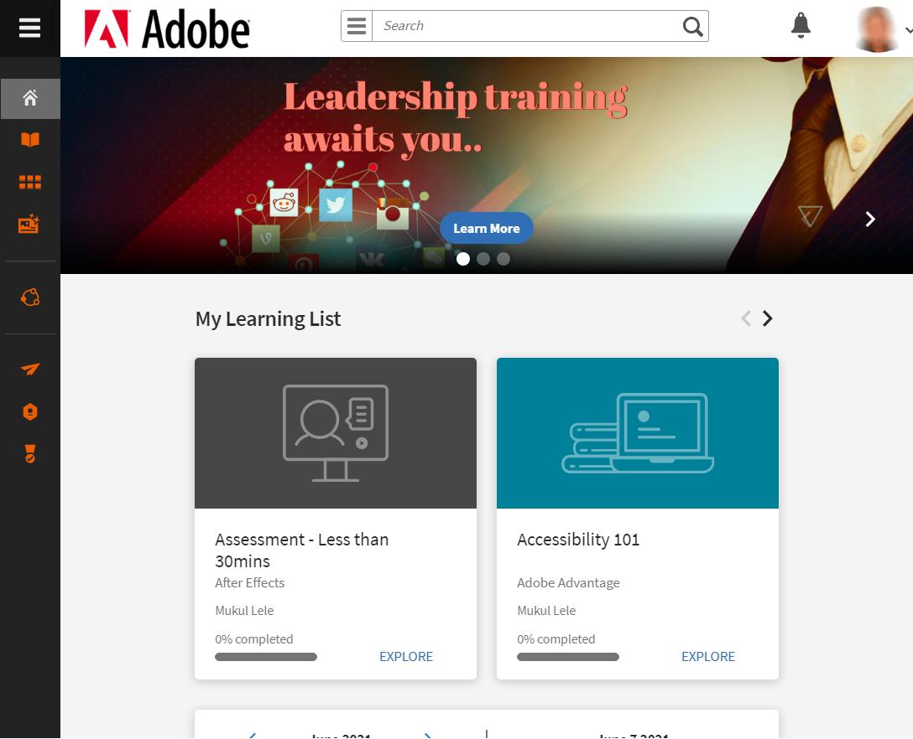

# Começar como aluno

Comece com o aplicativo do aluno no Learning Manager

O aplicativo do aluno no Learning Manager é completamente baseado em widget, ajudando a passar pelos vários recursos em um ou dois cliques.

No aplicativo da Web do Learning Manager, após fazer logon como aluno, você pode ver os seguintes widgets na página inicial:

**Meu aprendizado**: você pode exibir e clicar nos objetos de aprendizado por tipo e por prazo. Clique no círculo no widget Meu aprendizado para ir diretamente para o tipo de objeto de aprendizado ou para exibir os objetos de aprendizado por prazo.

**Minhas habilidades**: Você também pode exibir o mapa de habilidades no canto superior direito da página. Consultar  [mapa de habilidades](skills-levels.md)para obter mais informações.

**Widget Objeto de aprendizado**: Isso está logo abaixo de Meu aprendizado e exibe os objetos de aprendizado para o usuário. Abaixo de Meu aprendizado, você pode ver todos os [cursos](courses.md), [programas de aprendizado](learning-programs.md) e [certificações](certifications.md) que você inscreveu ou atribuiu a você. Você pode começar a consumir um objeto de aprendizado diretamente ou revisitar um objeto de aprendizado usando esse widget.

**Calendário de aprendizado**: este widget exibe a lista de aprendizado futuro e planejado em sua organização, para cada trimestre. O status da inscrição em é Inscrito, se você se inscreveu em um curso específico.

**Aprendizado recomendado**: neste widget, você pode visualizar todos os cursos recomendados para seu perfil pelo administrador/gerente de sua empresa. Você pode clicar nesses links para navegar até as páginas do curso.

**Minhas Conquistas**: você recebe medalhas após concluir os cursos. Essas medalhas são exibidas adjacentes ao seu perfil na parte superior da página. Clique em Medalhas para obter informações específicas. Para obter mais informações sobre medalhas, consulte  [medalhas](badges.md) recurso.

Este widget também exibe os pontos de gamificação para o aluno. Clique no link Gamificação para ver os pontos detalhados e outros recursos na Gamificação. Para obter mais informações sobre pontos de gamificação e quadro principal, consulte  [Gamificação](gamification.md) recurso.

Se você estiver acessando o Learning Manager usando um tablet Android ou iPad, consulte a seção do tópico Aplicativo para iPad e tablets Android nessa página.

## Linha do tempo de aprendizado {#learningtimeline}

A linha do tempo de aprendizado mostra a programação dos alunos com os cursos que precisam ser concluídos. Nesta seção, você pode ver os alertas de todos os cursos, certificações e programas de aprendizado em ordem crescente de prazos finais. Os prazos de cada uma das atividades de aprendizado são exibidos no painel esquerdo.

Clique em cada objeto de aprendizado no bloco esquerdo para exibir as informações correspondentes como um cartão do curso no painel direito. Você pode clicar no quadro curso/programa de aprendizado/certificação para exibir as informações completas de cada objeto de aprendizado.

Passe o mouse sobre a área da linha do tempo para exibir a barra de rolagem no lado direito. Use a barra de rolagem para mover para cima ou para baixo e exibir mais alertas.

## Usuários do aplicativo para iPad e Android {#ipadandandroidappusers}

No aplicativo Learning Manager no iPad ou tablet Android, após fazer logo como aluno, você pode ver as informações na guia Início da seguinte maneira:

Para navegar para os recursos de aprendizado e do catálogo, toque no **Menu** e escolha a opção apropriada.

### Acessar o aplicativo off-line

Você pode acessar o aplicativo Learning Manager offline no tablet Android e iPad. Baixe e faça cursos no modo off-line e sincronize o conteúdo com o aplicativo on-line ao conectar-se à rede.

1. Toque na lista suspensa Menu na parte superior e toque em Opção de aprendizado. Uma lista de todos os cursos disponíveis é exibida em blocos.
1. Toque no ícone de download na parte inferior de cada bloco do objeto de aprendizado para baixar o conteúdo de aprendizado.

   

1. Quando você estiver online, será exibido um prompt em uma barra na parte superior do aplicativo para verificar se deseja sincronizar o conteúdo online. Toque na barra de cor vermelha se a resposta for sim. Uma barra verde indica que o conteúdo está em sincronia com o aplicativo online.

**Rastrear o armazenamento do dispositivo**

É possível monitorar periodicamente o armazenamento do dispositivo.\
Toque no ícone do perfil no canto superior direito do aplicativo e toque em **Armazenamento do dispositivo** opção do menu.

Uma caixa de diálogo com informações de armazenamento do aplicativo é exibida conforme mostrado abaixo.

Usando as informações de armazenamento do aplicativo, você pode verificar o espaço total do dispositivo, aplicativo e os cursos baixados. Essas informações permitem baixar os cursos adequadamente. Para excluir os cursos baixados no dispositivo, toque no ícone X ao lado de cada nome de curso.
