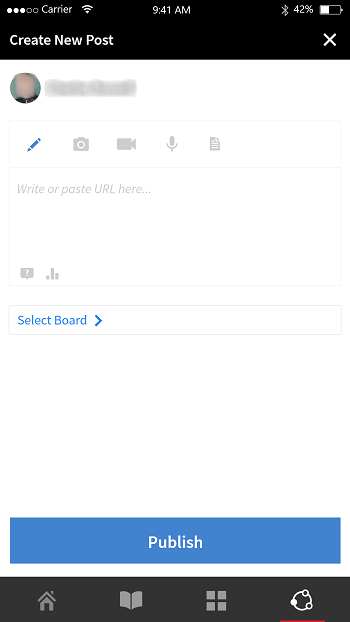

# Aplicativo do aluno para dispositivos móveis e tablets

Leia este artigo para saber baixar o aplicativo do aluno do Learning Manager para smartphones e tablets. Saiba como fazer cursos usando seu dispositivo móvel ou tablet.

## Visão geral {#overview}

O aplicativo para alunos do Learning Manager está disponível para usuários de telefones Android e iPhone. Vá até a Google Play Store (Android OS) ou ao iTunes (macOS) e baixe o aplicativo Learning Manager.

Depois de baixar e instalar este aplicativo, faça login no aplicativo usando suas credenciais do aluno. Ao abrir o aplicativo móvel do Learning Manager, a tela a seguir é exibida por padrão.

*A página inicial do aplicativo Learning Manager*

## Página inicial {#homepage}

Para todas as contas com a opção Layout imersivo ativada, há uma nova página inicial para suportar a configuração de Layout imersivo. A página inicial é organizada como uma lista de cartões para os seguintes:

|  |  |
|---|---|
|  |  |

*Lista de cartões na home page*

*Feed social do aluno*

## Classificação de feedback {#feedbackrating}

O Learning Manager solicita que o aluno forneça feedback sobre a sua experiência com o aplicativo móvel. Esse feedback aparece uma vez por mês e oferece um intervalo de tempo suficiente para que os usuários experimentem o aplicativo e depois forneçam o feedback.

<!--
|  | |
|---|---|
-->

Para os usuários existentes, eles devem ver o pop-up de feedback ao fechar o Player pela primeira vez após atualizar o aplicativo para a versão mais recente.

Observe que a coleção de comentários é anônima e exibida somente para usuários que habilitaram a opção **Compartilhar Dados de Uso** por meio de uma configuração nas configurações do aplicativo.

## Baixar medalha {#downloadbadge}

Os alunos podem baixar medalhas no formato PDF e de imagem. Na seção Perfil do usuário, role para baixo e clique em qualquer link para baixar uma medalha. A medalha baixada é salva na pasta padrão do dispositivo. O aplicativo permite que você abra a pasta ou o arquivo imediatamente após a conclusão do download.

|  |
|---|

*Baixar uma medalha*

## Layout responsivo de Web para dispositivos móveis {#responsive}

Uma experiência da Web móvel totalmente responsiva que garante que os alunos usem seus dispositivos para realizar treinamentos, mesmo que não tenham instalado o aplicativo móvel.

Quando você entra no aplicativo do aluno pela primeira vez por meio do navegador do seu dispositivo, o aplicativo do aluno aparece na forma de um layout responsivo e amigável para dispositivos móveis.

O suporte para a interface do usuário responsiva para a Web móvel só está disponível quando uma conta **está configurada apenas para layout imersivo**. A interface do usuário responsiva **não está disponível para o layout clássico**.

<!--
<table>
 <tbody>
  <tr>
   <td>
    
<strong>Home page</strong>

    
<strong>View options</strong>

    
<strong>Start course</strong>
</td>
   <td>
    
<strong>My Learning List</strong>

    
<strong>View catalog</strong>

    
<strong>Apply filters</strong>
</td>
   <td>
    
<strong>Recommendations based on interest</strong>

    
<strong>View notifications</strong>

    
<strong>Share url</strong>
</td>
  </tr>
 </tbody>
</table>
-->

## Prompt de download no ALM Web

Quando os usuários abrem um link do ALM ou usam o ALM Web em seus dispositivos móveis, eles devem ver um prompt solicitando que baixem o aplicativo para uma melhor experiência.

_Baixar aplicativo ALM_

## Recursos não compatíveis com a experiência de imersão móvel {#unsupportedfeaturesinmobileimmersiveexperience}

Os seguintes fluxos de trabalho são exibidos na experiência clássica de um aluno:

* Várias tentativas
* Flexi LP
* Cenários de upload de arquivos
* Fornecer feedback L1

Outros recursos do aplicativo não compatíveis são:

* Aplicativo Social: um aluno é redirecionado para a experiência Clássica se clicar no widget Social na Página inicial
* Configurações de perfil/Editar perfil
* Exibir medalha/habilidades
* Quadro de classificação: um aluno é redirecionado para a experiência Clássica se clicar no widget Quadro de classificação na Página inicial
* Baixando ajudas de tarefa.
* Opções de filtro na Pesquisa.

O Aprendizado social agora é compatível com experiências online imersivas em dispositivos móveis.

Existem alguns recursos que não são compatíveis com o aplicativo móvel imersivo. São eles:

| Área **1&rbrace;** | **Sem suporte** |
|---|---|
| Fórum | Criação de painel, Edição de painel, Copiar URL, Excluir, Relatório, Classificar, Filtro |
| Publicar | Tipo de pesquisa Criação da publicação, Editar, Vários anexos à publicação, Copiar URL, Fixar na parte superior |
| Comentário/Resposta | Editar, Marcar como resposta correta, Carregar imagem/vídeo/áudio em um comentário ou resposta |
| Mídia | Capturar áudio; somente carregamento de arquivo de áudio |
| Outros | Notificações, Exibição de publicação, Quadro de classificação social, Pessoas que sigo, Perfil do usuário |

## Permitir que alunos baixem a ajuda de tarefa {#download-job-aid}

No modo imersivo móvel, um aluno pode baixar uma ajuda de tarefa. Toque em **Configurações** e depois toque em **Catálogos**. Baixe uma ajuda de tarefa na lista exibida.

|  |
|---|

*Baixar uma ajuda de tarefa*

## Permitir que alunos baixem a transcrição do aluno {#download-learner-transcript}

No modo imersivo móvel, um aluno pode baixar as transcrições do aluno.

|  |  |
|---|---|

*Baixar transcrições do aluno*

## Exibir medalhas e habilidades {#viewbadgesandskills}

**Exibição de medalhas, habilidades e pontos de gamificação**

A tela padrão exibe as medalhas, habilidades e pontos de gamificação mais recentes obtidos abaixo das informações do perfil. Se estiver usando o telefone, as medalhas mais recentes obtidas serão exibidas. Deslize para a direita para ver mais informações.

**Meus aprendizados pendentes**

Por padrão, a tela exibe os cursos nos quais você está inscrito. O gráfico de rosca mostra os aprendizados vencidos, os aprendizados com vencimento em breve e os aprendizados dentro do prazo.

Toque em um curso para visualizar os detalhes, incluindo sua data de conclusão (se aplicável). Você pode continuar ou revisar o curso nessa tela, dependendo do status de conclusão.

*Exibir aprendizados pendentes*

**Visualizar catálogos**

Toque no ícone ao lado do ícone de livro na parte inferior da tela. Você pode visualizar imediatamente o catálogo com todos os objetos de aprendizado associados. Você pode optar por exibi-los no layout de grade ou escolher a exibição detalhada. Selecione recomendações para ver as recomendações do curso com base em seu histórico de aprendizado.

*Exibir recomendações do curso*

## Classificar e filtrar os objetos de aprendizado {#sortandfilterlearningobjects}

**Classificação e filtragem**

Clique no ícone de classificação no canto superior direito dos cursos ou da tela do catálogo para classificar em ordem alfabética os objetos de aprendizado (crescente ou decrescente) ou por data de publicação. Você também pode filtrar os objetos de aprendizado por tipo, status de conclusão, habilidades ou etiquetas. Toque e selecione o filtro, e toque em Aplicar para aplicar o filtro.

**Usar a funcionalidade de pesquisa**

Na parte superior da tela do telefone, é possível ver um ícone de pesquisa. Toque nesse ícone para pesquisar objetos de aprendizado por metadados do curso, ID exclusiva, habilidades, e assim por diante.

**Gerenciar perfil, configurações e notificação**

Toque no menu  no canto superior esquerdo da tela para exibir seu perfil, as notificações e as configurações da conta.

Esse menu também permite ler o código QR para marcar a participação nos cursos.

Tudo o que você precisa fazer é tocar na opção **Digitalizar QR Code** e digitalizar o código.

**Realização de cursos off-line**

Quando você realizar os cursos baixados on-line, o Learning Manager acessará o curso baixado em vez de fazer chamadas ao servidor.

## Digitalizar código QR para se inscrever {#qrcode}

Você pode digitalizar um código QR para se inscrever em um curso. Depois que o Administrador de aprendizado gerar um código QR, você poderá digitalizá-lo no aplicativo para inscrever-se em um curso.

1. Para digitalizar o código QR, toque em  no canto superior esquerdo da tela.
1. Toque em **Digitalizar código QR**.

A digitalização QR permite que o aluno execute uma das ações a seguir, de acordo com o código QR gerado pelo administrador de aprendizado:

* **Inscrição:** permite que o aluno se inscreva em um curso examinando o código QR.
* **Conclusão:** permite que o aluno marque o curso como concluído, digitalizando o código QR.
* **Inscrição e conclusão:** permite que o aluno se inscreva e marque a conclusão ao mesmo tempo, digitalizando o código QR.
* **Marcar participação:** permite que o aluno marque a participação em uma sessão específica verificando o código QR.

## Renomeação de objetos de aprendizado {#renaminglearningobjects}

Os administradores podem renomear a terminologia dos objetos de aprendizado. Para renomear, consulte [Renomeação de objetos de aprendizado](../../administrators/feature-summary/settings.md#main-pars_header_1570157145).

## Aprendizado social {#socialmobile}

Nesta atualização, os seguintes recursos não são compatíveis. Não é possível:

* Criar ou seguir um painel.
* Copiar um URL em uma publicação.
* Adicione a publicação como história ou adicione-a como favorita ou fixe-a na parte superior.
* Exibir um quadro de líderes sociais.

Aprendizado social é uma plataforma do Learning Manager para aplicativos móveis que incentiva os usuários a compartilharem ideias e opiniões significativas em um ambiente informal. Trata-se de uma metodologia que complementa a ideia da aprendizagem tradicional.

O Aprendizado social permite que os usuários usem a experiência em torno deles para obter informações corretas e concisas. O alunos podem aplicar rapidamente essas informações para concluir uma tarefa e atingir uma meta.

Usando o aplicativo móvel, os usuários podem interagir uns com os outros compartilhando o conteúdo e obter validação do conteúdo compartilhado.

Nesta plataforma, os tipos de conteúdo que podem ser compartilhados são vídeo, áudio, capturas de tela, texto, perguntas e enquetes. Os usuários também podem compartilhar aprendizados on-line com seus colegas.

Este recurso está disponível somente no aplicativo do dispositivo quando o administrador habilitar o **Aprendizado social** na conta.

## Iniciar o aprendizado social no aplicativo {#launchsociallearningontheapp}

Após iniciar o aplicativo, toque no ícone **Social**.

*Exibir aprendizado social*

## Criar uma publicação em um painel {#createapostinaboard}

Como qualquer outra plataforma social, no aplicativo móvel do Learning Manager, você pode criar uma publicação em um painel para que todos os alunos que fazem parte do mesmo painel possam visualizar sua publicação, fazer comentários e carregar arquivos no comentário.

Para criar uma postagem, toque no ícone  na parte inferior direita da tela.

É exibida a seguinte tela.

*Adicionar uma postagem*

<table>
 <tbody>
  <tr>
   <td>
    

</td>
   <td>
    
Escreva uma publicação ou cole qualquer URL.
</td>
  </tr>
  <tr>
   <td>
    

</td>
   <td>
    
Tire uma foto com a câmera do dispositivo móvel e carregue sua publicação.
</td>
  </tr>
  <tr>
   <td>
    

</td>
   <td>
    
Grave um vídeo com a câmera do dispositivo móvel.
</td>
  </tr>
  <tr>
   <td>
    
 
</td>
   <td>
    
Grave áudio com o dispositivo móvel.
</td>
  </tr>
  <tr>
   <td>
    

</td>
   <td>
    
Carregue qualquer documento ou arquivo no painel.
</td>
  </tr>
  <tr>
   <td>
    
 
</td>
   <td>
    
Faça uma pergunta.
</td>
  </tr>
  <tr>
   <td>
    
 
</td>
   <td>
    
Crie uma enquete com sua publicação.
</td>
  </tr>
 </tbody>
</table>

## Formato de conteúdo compatível {#supportedcontentformat}

<table>
 <tbody>
  <tr>
   <td>
    
<strong>Tipo de conteúdo</strong>
</td>
   <td>
    
<strong>Extensões</strong>
</td>
  </tr>
  <tr>
   <td>
    
Vídeo
</td>
   <td>
    
wmv, f4v, asf, 3gp, 3g2, avi, mov, h264, m4v, mp4, MPEG, mpg
</td>
  </tr>
  <tr>
   <td>
    
Áudio
</td>
   <td>
    
mp3, amr, m4a, wav, wma, aac
</td>
  </tr>
  <tr>
   <td>
    
Arquivos estáticos
</td>
   <td>
    
PDF, ppt, pptx, doc, docx, xls, xlsx
</td>
  </tr>
  <tr>
   <td>
    
Imagem
</td>
   <td>
    
jpg, jpeg, png, bmp, gif
</td>
  </tr>
 </tbody>
</table>

Depois de criar uma publicação, escolha o painel no qual você deseja carregar a publicação. Toque em Selecionar painel e procure o painel necessário.

Depois de criar uma publicação, toque em Publicar e publique seu comentário para que outros alunos visualizem sua publicação.

No aplicativo móvel, não é possível criar um painel. Para criar um painel, você deve fazer login no aplicativo da Web como aluno. Para obter mais informações sobre como criar um painel, consulte Aprendizado social no [Learning Manager](/help/migrated/learners/feature-summary/social-learning-web-user.md).

## Ações que podem ser realizadas em uma publicação {#actionsthatcanbeperformedonapost}

* Faça comentários em publicações e, com base nas permissões, visualize publicações em um painel.
* Edite ou exclua comentários em um painel.
* Edite ou exclua publicações com base em permissões.
* Denuncie abusos em uma publicação se ela violar sua privacidade ou cujo conteúdo seja inapropriado. Depois que uma publicação é denunciada, uma notificação é enviada para o administrador e moderadores do painel para que sejam tomadas outras ações.
* Curtir  ou não curtir    uma publicação.
* Curtir  ou não curtir  um comentário.

## Criar uma publicação em outros painéis {#createapostinotherboards}

Você pode criar publicações em outros painéis.

Toque em **Todos os painéis** para poder ver no painel as atividades realizadas por outros alunos.

*Exibir todas as atividades do painel*

Vá até o painel necessário e publique seu comentário.

## Compartilhar mídia em um painel {#sharemedia}

<!---->

Compartilhe imagens, documentos ou arquivos de áudio ou vídeo em qualquer painel, de forma que outros membros do painel possam visualizar sua publicação e começar uma interação. Para compartilhar qualquer mídia,

1. Abra a mídia que deseja compartilhar.
1. Toque no botão de compartilhamento e escolha Learning Manager.
1. Escolha o painel em que deseja compartilhar a mídia.
1. Toque em **Publicação**.

Você pode também publicar qualquer conteúdo de um aplicativo externo, por exemplo, você pode compartilhar um comentário do Reddit ou Quora.

## Carregar ativos no certificado externo como comprovante de conclusão {#externalcert}

Siga as etapas abaixo:

1. Faça logon no aplicativo do dispositivo usando suas credenciais de aluno.
1. Procure o certificado que o autor criou.
1. Na lista de certificados externos, escolha o certificado necessário e inscreva-se no certificado.
1. Toque em **Comprovante de conclusão** e faça upload de um arquivo, por exemplo, um pdf ou uma imagem.

   |  |  |
   |---|---|

*Carregar comprovante de conclusão*

1. Depois de carregar um arquivo, toque em **Enviar**. É exibida uma mensagem de confirmação.

**Carregar um arquivo**

1. Após carregar o arquivo, toque em **Enviar**.

   É possível carregar somente um arquivo como comprovante de conclusão. Ao tentar carregar vários arquivos, a seguinte mensagem é exibida:

   **As alterações feitas serão perdidas. Deseja continuar?**

1. O status muda para **Aprovação pendente**, exibido na cor laranja.

   Não é possível exibir nem baixar o arquivo carregado no aplicativo móvel.

Depois que o gerente aprova o envio, o status muda para **Aprovado**, na cor verde.

Se o gerente rejeitar o envio, o status mudará para **Rejeitado**, na cor vermelha.

|  |  |  |
|---|---|---|

*Exibir status de envio*

Após a rejeição, é possível carregar um arquivo como comprovante de conclusão.

* Você só pode enviar um arquivo quando o status for **Envio Pendente e Rejeitado**.
* Você não pode enviar um arquivo quando o status for **Aprovação pendente e Aprovado**.

## Faça cursos no LinkedIn Learning {#linkedin}

O Learning Manager já é compatível com os cursos do LinkedIn Learning dentro da plataforma de aprendizado. Agora os alunos podem realizar esses cursos do LinkedIn Learning no aplicativo móvel do Learning Manager. No aplicativo do dispositivo, pesquise um curso e inicie-o.

Se você já possui o aplicativo LinkedIn instalado, o curso será aberto no aplicativo ou então o curso será aberto no navegador padrão, onde você deve fazer login usando suas credenciais do LinkedIn.

Se você estiver fazendo o curso pelo aplicativo LinkedIn, o seu progresso não será monitorado no Learning Manager. Portanto, é recomendável que o curso seja iniciado no navegador em vez do aplicativo LinkedIn Learning.

>[!NOTE]
>
>Você só pode fazer os cursos se tiver uma conexão ativa com a Internet.

|  |  |  |
|---|---|---|

*Inscrever-se nos cursos do LinkedIn Learning*

O tempo de aprendizado gasto nos cursos do LinkedIn Learning é comunicado pelo conteúdo do LinkedIn/plataforma do LinkedIn para a plataforma de aprendizado do Learning Manager.

Se o LinkedIn Learning não enviar o tempo de aprendizado, ele não poderá ser gravado pela nossa plataforma de aprendizado. Nesse caso, o tempo de aprendizado gasto exibido pelo Learning Manager é zero.

## Enviar arquivos para os módulos de sala de aula e de atividade {#submitfile}

Como aluno, você pode enviar arquivos como comprovantes de conclusão do curso ao professor. O professor pode aprovar ou rejeitar o envio, com base no conteúdo do arquivo.

Um autor pode criar apenas módulos de sala de aula e de atividade para um aluno consumir no aplicativo móvel.

Depois que o aluno inicia um curso, ele pode ver o status **Envio de arquivo** como pendente junto com o link para carregar o arquivo, na tela, conforme mostrado na captura de tela abaixo.

*Status de envio de arquivo*

Parar carregar o arquivo, clique em **Carregar arquivo**.

Faça upload de qualquer arquivo e clique no botão **Enviar**.

 

*Enviar um arquivo*

## Tipos de arquivo suportados para upload {#supportedfiletypesforupload}

<table>
 <tbody>
  <tr>
   <td>
    
<b>Tipo de conteúdo</b>
</td>
   <td>
    
<b>Extensões</b>
</td>
  </tr>
  <tr>
   <td>
    
Vídeo
</td>
   <td>
    
wmv, f4v, asf, 3gp, 3g2, avi, mov, h264, m4v, mp4, MPEG, mpg
</td>
  </tr>
  <tr>
   <td>
    
Áudio
</td>
   <td>
    
mp3, amr, m4a, wav, wma, aac
</td>
  </tr>
  <tr>
   <td>
    
Arquivos estáticos
</td>
   <td>
    
PDF, ppt, pptx, doc, docx, xls, xlsx
</td>
  </tr>
  <tr>
   <td>
    
Imagem
</td>
   <td>
    
jpg, jpeg, png, bmp, gif
</td>
  </tr>
 </tbody>
</table>

## Aprovação ou rejeição do envio {#approvalorrejectionofsubmission}

Depois de carregar o arquivo, o status muda para **Aprovação Pendente.**. O professor exibe a lista de [envios pendentes](/help/migrated/instructors/feature-summary/learners.md) e aprova ou rejeita o envio por meio do aplicativo Web do professor.

Quando o professor aprovar o envio, o status no aplicativo móvel do aluno muda para **Aprovado**.

<!---->

Quando o professor rejeita o envio, o status no aplicativo móvel do aluno muda para **Rejeitado**.

<!---->

Para enviar o arquivo novamente, clique no link **Carregar arquivo**.

## Learning Manager para iPad e tablets {#captivateforipadandtablets}

No aplicativo Learning Manager no iPad ou tablet Android, após fazer logon como aluno, você pode ver a seguinte tela **Inicial**:

<!---->

Para navegar para os recursos de aprendizado e do catálogo, toque no **Menu** suspenso e escolha a opção apropriada.

<!---->

Há uma opção para exibir o conjunto de cursos em uma exibição em lista em vez de exibição em quadros/cartões.

## Acessar o aplicativo off-line {#accesstheappoffline}

Você pode acessar o aplicativo Learning Manager offline no tablet Android e iPad. Você pode baixar cursos e programas de aprendizado. Faça cursos, realize programas de aprendizado no modo off-line e sincronize o conteúdo com o aplicativo on-line ao conectar-se à rede.

1. Toque na lista suspensa **Menu** na parte superior e toque na opção **Aprendizado**. Uma lista de todos os cursos disponíveis é exibida em quadros.
1. Toque no ícone de download na parte inferior de cada quadro do objeto de aprendizado para baixar o conteúdo do aprendizado.

   

   *Baixar o conteúdo*

   Aparece um aviso em uma barra na parte superior do aplicativo que indica o status da rede do dispositivo.

   * A barra vermelha indica que a rede não está disponível para o dispositivo.
   * A barra verde indica que a rede está online novamente.

O usuário pode voltar para o modo online clicando no botão **exibir conteúdo online** na barra verde. O conteúdo do dispositivo é sincronizado quando o usuário alterna para o modo online.

## Suporte a carrinho de vários itens em dispositivos móveis imersivos

Os alunos agora podem adicionar vários cursos, programações de aprendizado ou certificações ao carrinho e comprá-los juntos. Exibir carrinho de vários itens no ALM[&#128279;](/help/migrated/learners/feature-summary/multi-item-cart.md)

<!--## Track device storage {#trackdevicestorage}

You can monitor your device storage periodically.

Tap the profile icon at the upper-right corner of the app and tap **Device Storage** menu option.

An app storage information dialog appears as shown below.

Using the app storage information, you can check the total space of device, app and the downloaded courses. This information enables you to download courses accordingly. To delete the downloaded courses in the device, tap delete icon adjacent to each course name.-->
