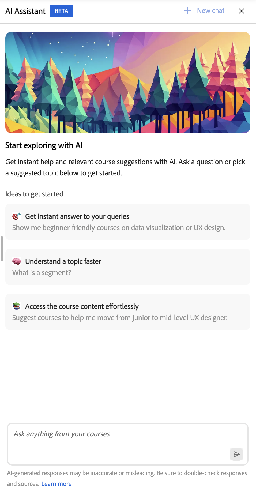
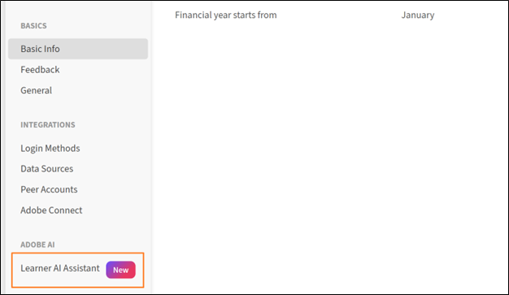
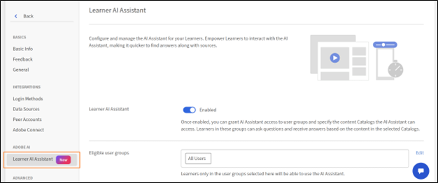
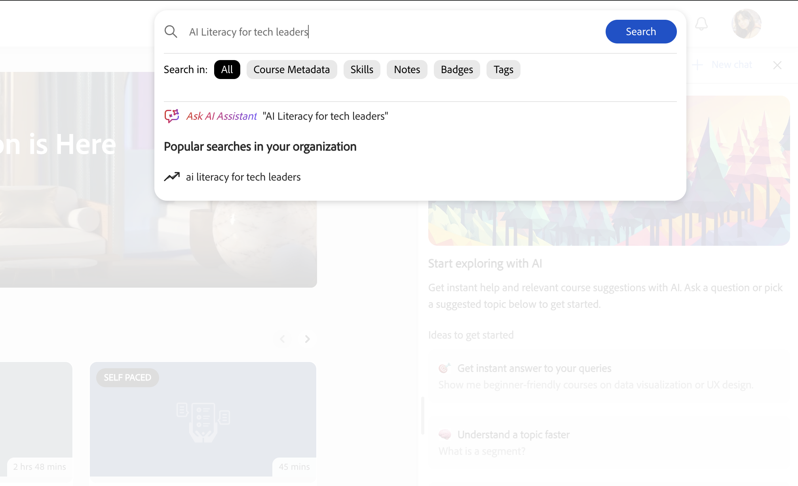

# Assistente de IA para alunos

O Assistente de IA (beta) para alunos os ajuda a encontrar rapidamente respostas a partir do conteúdo de aprendizado atribuído sem navegar pelos cursos inteiros. Você pode fazer perguntas em linguagem simples e receber respostas precisas e focadas com links de origem para o conteúdo relevante do curso.

>[!IMPORTANT]
>
>O Assistente de IA para alunos está disponível como um recurso beta. Os recursos, os cenários compatíveis e as limitações podem mudar conforme o recurso evolui.

## O que é o Assistente do AI para alunos

O Assistente de IA é um complemento de bate-papo gerado por IA no Adobe Learning Manager que fornece respostas rápidas e precisas usando conteúdo de aprendizado confiável. Inclui citações para que você sempre saiba a fonte da informação.

### Capacidades

- **Resposta inteligente de perguntas**
   - Conversações em turnos simples e turnos múltiplos
   - Compreensão da linguagem natural em inglês
   - Respostas derivadas de cursos, certificações, programações de aprendizado e ajudas de tarefa
   - Esclarecimento inteligente de perguntas quando as consultas são ambíguas

- **Citações e fontes de conteúdo**
   - Recupera respostas de recursos disponíveis em catálogos compatíveis
   - Fornece citações com links diretos para materiais de origem
   - Suporta todos os formatos de conteúdo do Learning Manager (estáticos e interativos): PDF, DOCX, PPTX, XLSX, áudio (MP3, WAV, M4A), vídeo (MP4, MOV, WMV), HTML, SCORM 2004 e SCORM 1.2

- **Experiência do usuário**
   - Interface do painel lateral acessível em todas as páginas do aluno
   - Design responsivo que se adapta à área de conteúdo
   - Histórico de bate-papo mantido na sessão do navegador
   - Atualização clara de novos logons ou páginas
   - Tom amigável, claro e pedagogicamente sólido

- **Controles de administrador**
   - Ativar ou desativar o recurso no nível da conta
   - Controlar o acesso por grupos de usuários
   - Selecione quais catálogos são incluídos para respostas de IA
   - Requisito de aceitação dos Termos de uso de acordo com as diretrizes de IA da Adobe

## Tipos de conteúdo suportados

O Assistente de IA recupera informações do conteúdo de aprendizado atribuído a você, incluindo:

- **Documentos:** PDF, Word, PowerPoint, Excel, HTML
- **Mídia:** áudio (MP3, WAV, M4A), vídeo (MP4, MOV, WMV)
- **Conteúdo interativo:** SCORM 1.2, SCORM 2004
- **Tipos de objetos de aprendizado:** cursos, programações de aprendizado, certificações, ajudas de tarefa

o Adobe processa com segurança o seu conteúdo de aprendizado usando serviços confiáveis.

### Limitações do catálogo e da fonte de conteúdo

O Assistente de IA usa somente conteúdo de catálogos **internos** explicitamente configurados por administradores.

As seguintes fontes de conteúdo não são suportadas na versão atual:

- Catálogos **compartilhados**
- **Catálogos** adquiridos
- Catálogos **externos**
- **Catálogos** padrão
- Bibliotecas de conteúdo de terceiros (por exemplo, LinkedIn Learning ou Go1)

Se você não tiver acesso a um curso ou ajuda de tarefa, o Assistente de IA não exibirá informações desse conteúdo e os links de citação não estarão acessíveis.

## Casos de uso

### Aluno técnico

Sarah é engenheira de vendas e está aprendendo sobre placas gráficas. Ela precisa entender rapidamente as especificações técnicas e os benefícios para responder às perguntas dos clientes com segurança.

O Assistente de IA ajuda Sarah com:

- Explicação técnica clara de uma arquitetura de GPU complexa
- Aprofunde a compreensão sobre várias placas gráficas e suas diferenças
- Explicação de exemplos para que Sarah possa relacionar recursos a casos de uso reais

### Suporte ao cliente

Marcus é especialista em suporte em uma empresa parceira. Ele precisa de respostas rápidas sobre os recursos do produto para ajudar os clientes sem precisar transferir para equipes de engenharia.

O Assistente de IA ajuda Marcus com:

- Encontrar conteúdo de suporte relevante para consultas frequentes de clientes
- Fazer perguntas claras quando a resposta inicial não é específica o suficiente
- Localizar recomendações para cursos de solução de problemas relacionados para melhorar suas habilidades

### Integração de novo funcionário

Jennifer acabou de entrar na empresa e está sobrecarregada com a quantidade de material de treinamento. Ela precisa de uma maneira de encontrar informações específicas sem revisar cursos inteiros.

O Assistente de IA ajuda Jennifer com:

- Como obter uma orientação passo a passo sobre como enviar relatórios de despesas
- Descobrindo cursos sobre as políticas da empresa sem navegar pelo catálogo inteiro
- Direcionando-a para a seção apropriada de um curso sem fazê-la assistir horas de vídeo

## Como o Assistente do AI usa o conteúdo

O Assistente de IA encontra respostas precisas no seu conteúdo de aprendizado. Veja como funciona.

### Qual conteúdo é usado pelo Assistente do AI

O Assistente de IA responde a perguntas usando somente o conteúdo de aprendizado ativado pelo administrador da conta. O conteúdo dos catálogos selecionados é indexado.

O Assistente de IA analisa o conteúdo de aprendizado atribuído para gerar respostas contextuais focalizadas:

- Cada resposta inclui citações que fazem referência ao conteúdo original.
- Você pode selecionar uma citação para navegar diretamente para o curso, módulo ou documento relevante.
- As citações ajudam a verificar as informações e explorar o contexto adicional quando necessário.

### Transmissão de respostas

O Assistente de IA fornece respostas progressivamente conforme são geradas, para que você possa começar a ler imediatamente, sem esperar o carregamento da resposta inteira.

### Citações e transparência da origem

Cada resposta do Assistente de IA inclui citações vinculadas diretamente ao curso, módulo ou objeto de aprendizado original. As citações permitem:

- Selecione um número de citação embutido para ir para a seção referenciada exata.
- Abra a lista completa de fontes selecionando **Mostrar fontes** na parte inferior da resposta.
- Verifique as informações e explore o contexto adicional a partir da fonte oficial.

> **IMPORTANTE**
> O Assistente do AI fornece respostas com base no conteúdo ativado pelo administrador. Se você não tiver acesso a um item referenciado, verá uma mensagem “não suportado” ao tentar abri-lo.

## Prompts internos

O Assistente de IA inclui prompts integrados para ajudar você a começar rapidamente com perguntas e cenários comuns. Estes prompts explicam como interagir com o assistente e demonstram os tipos de perguntas que você pode fazer.

As organizações podem personalizar prompts incorporados para refletir seus objetivos de aprendizado, funções, terminologia ou casos de uso específicos. Os administradores podem trabalhar com o Gerente de sucesso do cliente para configurar ou atualizar prompts incorporados. Na versão atual, não é possível personalizar prompts diretamente na interface do Adobe Learning Manager.

## Configurar o Assistente do AI (administradores)

Os administradores selecionam quais grupos de usuários e catálogos **internos** podem acessar o recurso Assistente do AI. Verifique se os catálogos atribuídos incluem apenas o conteúdo de aprendizado apropriado para respostas e citações de IA e se esses catálogos são **Internos** (não **Compartilhados**, **Adquiridos** ou **Externos**).

Antes de configurar o Assistente do AI, confirme se você tem credenciais de administrador e se identificou quais grupos de usuários e catálogos devem ter acesso.

### Configurar acesso ao Assistente do AI

Para ativar o Assistente de IA do aluno:

1. Faça logon no Adobe Learning Manager como administrador.

2. Selecione **Configurações** na home page.
   

3. Selecione **Assistente de IA do aluno (Beta)** no menu **Configurações**.
   

4. Selecione a opção de alternância para habilitar o **Assistente de IA do aluno (Beta)**.
   

5. Selecione um ou mais grupos de usuários da opção **Grupos de usuários qualificados**.

6. Selecione **Salvar** para aplicar as configurações do grupo de usuários.

7. Selecione um ou mais catálogos da opção **Catálogos qualificados**.

8. Selecione **Salvar** para aplicar as configurações do catálogo.

>[!IMPORTANT]
>
>Somente catálogos **internos** têm suporte. Se um catálogo **Compartilhado**, **Adquirido**, **Externo** ou outro não interno for selecionado, seu conteúdo não será revelado pelo Assistente do AI, mesmo que ele apareça na lista **Catálogos qualificados**.

## Iniciar o Assistente do AI (alunos)

Para iniciar o Assistente do AI:

1. Faça logon no Adobe Learning Manager como aluno.

2. Selecione **Perguntar ao assistente de IA** na página inicial.
   

3. Quando a tela **Assistente de IA do aluno** for exibida, selecione **Introdução**.
   

>[!NOTE]
>
>Ao iniciar o Assistente do AI pela primeira vez, você deve dar seu consentimento antes de usá-lo. A caixa de diálogo de consentimento será exibida somente durante essa primeira inicialização. Para todas as inicializações subsequentes, você será direcionado ao Assistente do AI para inserir seus prompts.

&#x200B;4. Digite seu prompt no campo de texto.
<!--  -->

5.Pressione **Enter** para receber uma resposta. Revise suas respostas, fontes e recomendações.

Você pode:

- Selecionar o número de citação embutido para saltar para a seção referenciada exata
- Abrir a lista completa de fontes selecionando **Mostrar fontes** na parte inferior da resposta

O Assistente de IA inclui citações com cada resposta para mostrar de onde vêm as informações. Cada citação é vinculada diretamente ao curso, módulo ou objeto de aprendizado original usado para gerar a resposta.

Você pode selecionar qualquer citação para abrir a página do curso no Adobe Learning Manager e revisar o conteúdo completo no contexto. As citações ajudam a verificar as informações, explorar detalhes adicionais e continuar aprendendo com a fonte confiável.

## Acessar o Assistente do AI por meio de pesquisa

Você também pode iniciar o Assistente do AI diretamente da barra de pesquisa. Digite sua pergunta no campo de pesquisa e selecione **Perguntar ao assistente de IA** nas opções exibidas.

## Fornecer feedback sobre as respostas do Assistente de IA

Seu feedback sobre as respostas geradas pelo Assistente de IA (Beta) ajuda a melhorar a precisão, a relevância e o desempenho geral.

### Curtir ou não curtir uma resposta

- Selecione **Miniaturas**, escolha o que achou útil na resposta, opcionalmente adicione comentários e selecione **Enviar**.
- Selecione **Miniaturas**, escolha o motivo pelo qual a resposta não foi útil, adicione comentários e selecione **Enviar**.

## Iniciar um novo bate-papo

Iniciar um novo bate-papo permite iniciar uma nova conversa, limpando o contexto anterior para que o assistente possa se concentrar no novo tópico sem fazer referência a interações anteriores.

Para limpar a conversa atual e começar do zero, selecione **Novo chat** na tela do Assistente de IA e selecione **Sim**.

O Assistente de IA fornece aos alunos respostas rápidas e contextuais, é compatível com vários tipos de conteúdo e oferece citações embutidas para transparência. Os administradores podem controlar o acesso, garantindo que o Assistente de IA esteja adaptado às necessidades organizacionais e aprimore a experiência de aprendizado.

## Solução de problemas do Assistente de IA

> **OBSERVAÇÃO**
> Após configurar um novo catálogo, aguarde de 4 a 5 horas para que o conteúdo seja indexado e fique disponível para respostas do Assistente do AI.

### Sem acesso ao conteúdo

**Problema:** um aluno tem acesso ao Assistente de IA, mas recebe as respostas “Não tenho uma resposta para esta pergunta”.

**Causas possíveis:**

- Os catálogos do aluno não estão incluídos na configuração do Assistente do AI.
- O conteúdo relacionado à pergunta não está nos catálogos selecionados ou os catálogos estão vazios.
- O aluno não tem visibilidade do conteúdo relevante.

**Solução:**

- Verifique o acesso ao catálogo do aluno.
- Verifique quais catálogos estão ativados nas configurações do Assistente do AI.
- Verifique se há conteúdo relevante nesses catálogos.
- Aguarde algumas horas após adicionar novo conteúdo para que ele seja indexado.

### Respostas irrelevantes ou de baixa qualidade

**Problema:** o Assistente de IA fornece respostas que não correspondem à pergunta ou são de baixa qualidade.

**Causas possíveis:**

- A questão é muito ampla ou ambígua.
- O conteúdo relevante tem metadados insuficientes (descrições, tags).
- A estrutura do conteúdo dificulta a extração de informações.

**Solução:**

- Incentive os alunos a fazer perguntas mais específicas.
- Revise e melhore as descrições e os metadados do curso.
- Verifique se o conteúdo tem títulos e estrutura claras.
- Revise o relatório de uso detalhado para identificar padrões.
- Considere criar ajudas de tarefa para perguntas frequentes.

### Perguntas fora do escopo

**Problema:** um aluno faz perguntas não relacionadas ao conteúdo do treinamento.

**Exemplos:**

- Perguntas de conhecimento geral (”Quem é o presidente?”)
- Opiniões pessoais (”What do you think about X?”)
- Conteúdo inadequado

O Assistente de IA foi projetado para responder a perguntas com base apenas no conteúdo de aprendizado atribuído e não responderá a consultas fora do escopo.
