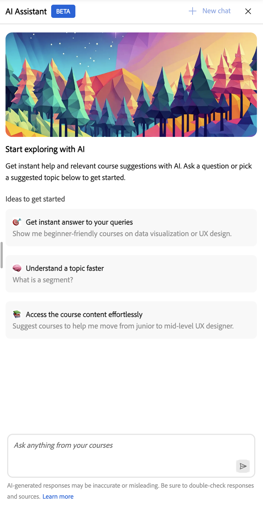
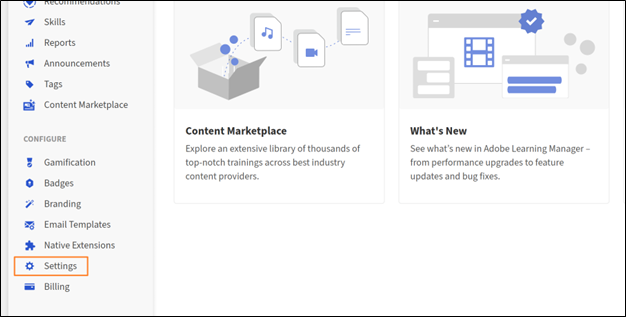
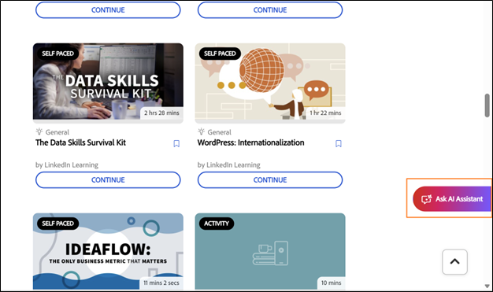
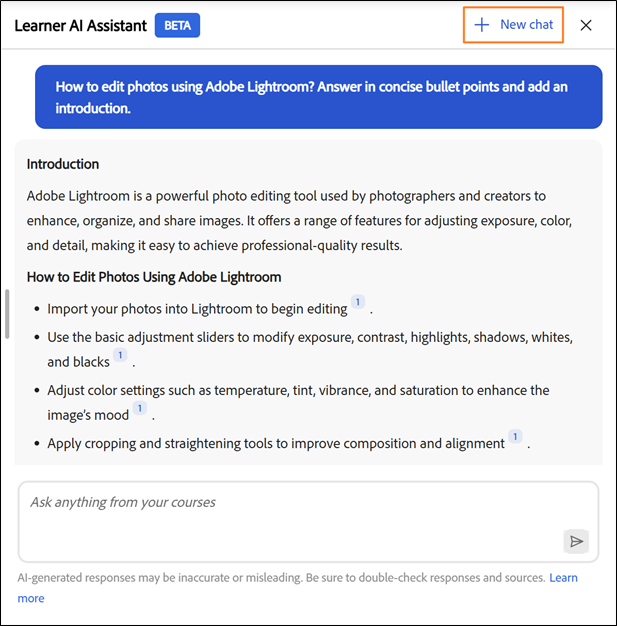

# Assistente de IA para alunos

## Introdução

Use o Assistente de IA para obter respostas rápidas e precisas do conteúdo de aprendizado atribuído, gerar resumos do curso, comparar objetos de aprendizado, encontrar respostas de instruções e criar programações de aprendizado personalizadas, tudo sem navegar pelos cursos inteiros.

>[!IMPORTANT]
>
>O Assistente de IA para alunos está disponível como um recurso beta. Os recursos, os cenários compatíveis e as limitações podem mudar conforme o recurso evolui.

>[!NOTE]
>
>Este recurso não está disponível em ambientes autorizados pelo FedRAMP. Consulte [Disponibilidade de recursos em ambientes FedRAMP](/help/migrated/feature-availability-in-fedramp-authorized-environment.md) para obter detalhes.

## O que é o Assistente do AI para alunos

O Assistente de IA é um complemento de bate-papo gerado por IA no Adobe Learning Manager que fornece respostas rápidas e precisas usando conteúdo de aprendizado confiável. Inclui citações para que você sempre saiba a fonte da informação.

### Capacidades

- **Resposta inteligente de perguntas**
  - Conversações em turnos simples e turnos múltiplos
  - Compreensão da linguagem natural em inglês
  - Respostas derivadas de cursos, certificações, programações de aprendizado e ajudas de tarefa
  - Esclarecimento inteligente de perguntas quando as consultas são ambíguas

- **Citações e fontes de conteúdo**
  - Recupera respostas de recursos disponíveis em catálogos compatíveis
  - Fornece citações com links diretos para materiais de origem
  - Suporta todos os formatos de conteúdo do Learning Manager (estáticos e interativos): PDF, DOCX, PPTX, XLSX, áudio (MP3, WAV, M4A), vídeo (MP4, MOV, WMV), HTML, SCORM 2004 e SCORM 1.2

- **Experiência do usuário**
  - Interface do painel lateral acessível em todas as páginas do aluno
  - Design responsivo que se adapta à área de conteúdo
  - Histórico de bate-papo mantido na sessão do navegador
  - Atualização clara de novos logons ou páginas
  - Tom amigável, claro e pedagogicamente sólido

- **Controles de administrador**
  - Ativar ou desativar o recurso no nível da conta
  - Selecione quais catálogos são incluídos para respostas de IA
  - Requisito de aceitação dos Termos de uso de acordo com as diretrizes de IA da Adobe

## O que o Assistente do AI pode fazer

O Assistente de IA é um companheiro de bate-papo gerado por IA que responde a perguntas usando o conteúdo de aprendizado atribuído a você. Cada resposta inclui citações com links diretos para o material de origem para que você possa verificar as informações e continuar aprendendo no contexto.

Além de responder perguntas, o Assistente de IA pode:

- **Resumir objetos de aprendizado** — gere uma visão geral rápida de qualquer curso, ajuda de tarefa, caminho de aprendizado ou certificação no catálogo sem abri-lo
- **Comparar objetos de aprendizado** — identifique diferenças entre dois cursos lado a lado para decidir qual deles se adapta aos seus objetivos de aprendizado
- **Perguntas de instruções** — respostas de origem da Adobe Experience League, documentação de ajuda oficial da Adobe, para perguntas sobre como usar o Adobe Learning Manager como aluno
- **Consultar conteúdo de terceiros** — faça perguntas sobre os cursos Go1 ou LinkedIn Learning se o administrador adicionou esses catálogos
- **Criar um caminho de aprendizado personalizado** — tenha uma conversa guiada com o Assistente de IA para criar um plano de aprendizado personalizado e sequenciado com base em suas metas, plano de fundo e tempo disponível.

O administrador controla quais catálogos o Assistente do AI usará. Se você não tiver acesso a um curso, o Assistente de IA não exibirá as informações a partir dele.

## Tipos de conteúdo suportados

O Assistente de IA recupera informações do conteúdo de aprendizado atribuído a você, incluindo:

- **Documentos:** PDF, Word, PowerPoint, Excel, HTML
- **Mídia:** áudio (MP3, WAV, M4A), vídeo (MP4, MOV, WMV)
- **Conteúdo interativo:** SCORM 1.2, SCORM 2004
- **Tipos de objetos de aprendizado:** cursos, programações de aprendizado, certificações, ajudas de tarefa

o Adobe processa com segurança o seu conteúdo de aprendizado usando serviços confiáveis.

### Limitações do catálogo e da fonte de conteúdo

O Assistente de IA usa somente conteúdo de catálogos **internos** explicitamente configurados por administradores.

As seguintes fontes de conteúdo não são suportadas na versão atual:

- Catálogos **compartilhados**
- **Catálogos** adquiridos
- Catálogos **externos**
- **Catálogos** padrão
- Bibliotecas de conteúdo de terceiros (por exemplo, LinkedIn Learning ou Go1)

Se você não tiver acesso a um curso ou ajuda de tarefa, o Assistente de IA não exibirá informações desse conteúdo e os links de citação não estarão acessíveis.

## Casos de uso

### Aluno técnico

Sarah é engenheira de vendas e está aprendendo sobre placas gráficas. Ela precisa entender rapidamente as especificações técnicas e os benefícios para responder às perguntas dos clientes com segurança.

O Assistente de IA ajuda Sarah com:

- Explicação técnica clara de uma arquitetura de GPU complexa
- Aprofunde a compreensão sobre várias placas gráficas e suas diferenças
- Explicação de exemplos para que Sarah possa relacionar recursos a casos de uso reais

### Suporte ao cliente

Marcus é especialista em suporte em uma empresa parceira. Ele precisa de respostas rápidas sobre os recursos do produto para ajudar os clientes sem precisar transferir para equipes de engenharia.

O Assistente de IA ajuda Marcus com:

- Encontrar conteúdo de suporte relevante para consultas frequentes de clientes
- Fazer perguntas claras quando a resposta inicial não é específica o suficiente
- Localizar recomendações para cursos de solução de problemas relacionados para melhorar suas habilidades

### Integração de novo funcionário

Jennifer acabou de entrar na empresa e está sobrecarregada com a quantidade de material de treinamento. Ela precisa de uma maneira de encontrar informações específicas sem revisar cursos inteiros.

O Assistente de IA ajuda Jennifer com:

- Como obter uma orientação passo a passo sobre como enviar relatórios de despesas
- Descobrindo cursos sobre as políticas da empresa sem navegar pelo catálogo inteiro
- Direcionando-a para a seção apropriada de um curso sem fazê-la assistir horas de vídeo

## Como o Assistente do AI usa o conteúdo

O Assistente de IA encontra respostas precisas no seu conteúdo de aprendizado. Veja como funciona.

### Qual conteúdo é usado pelo Assistente do AI

O Assistente de IA responde a perguntas usando somente o conteúdo de aprendizado ativado pelo administrador da conta. O conteúdo dos catálogos selecionados é indexado.

O Assistente de IA analisa o conteúdo de aprendizado atribuído para gerar respostas contextuais focalizadas:

- Cada resposta inclui citações que fazem referência ao conteúdo original.
- Você pode selecionar uma citação para navegar diretamente para o curso, módulo ou documento relevante.
- As citações ajudam a verificar as informações e explorar o contexto adicional quando necessário.

### Transmissão de respostas

O Assistente de IA fornece respostas progressivamente conforme são geradas, para que você possa começar a ler imediatamente, sem esperar o carregamento da resposta inteira.

### Citações e transparência da origem

Cada resposta do Assistente de IA inclui citações vinculadas diretamente ao curso, módulo ou objeto de aprendizado original. As citações permitem:

- Selecione um número de citação embutido para ir para a seção referenciada exata.
- Abra a lista completa de fontes selecionando **Mostrar fontes** na parte inferior da resposta.
- Verifique as informações e explore o contexto adicional a partir da fonte oficial.

> **IMPORTANTE**
> O Assistente de IA fornece respostas com base no conteúdo habilitado pelo administrador. Se você não tiver acesso a um item referenciado, verá uma mensagem “não suportado” ao tentar abri-lo.

## Prompts internos

O Assistente de IA inclui prompts integrados para ajudar você a começar rapidamente com perguntas e cenários comuns. Estes prompts explicam como interagir com o assistente e demonstram os tipos de perguntas que você pode fazer.

As organizações podem personalizar prompts incorporados para refletir seus objetivos de aprendizado, funções, terminologia ou casos de uso específicos. Os administradores podem trabalhar com o Gerente de sucesso do cliente para configurar ou atualizar prompts incorporados. Na versão atual, não é possível personalizar prompts diretamente na interface do Adobe Learning Manager.

## Configurar o Assistente do AI (administradores)

Os administradores selecionam quais catálogos **internos** podem acessar o recurso Assistente do AI. Verifique se os catálogos atribuídos incluem apenas o conteúdo de aprendizado apropriado para respostas e citações de IA e se esses catálogos são **Internos** (não **Compartilhados**, **Adquiridos** ou **Externos**).

Antes de configurar o Assistente do AI, confirme se você tem credenciais de administrador e se os catálogos identificados devem ter acesso.

### Configurar acesso ao Assistente do AI

Para ativar o Assistente de IA do aluno:

1. Faça logon no Adobe Learning Manager como administrador.

1. Selecione **Configurações** na home page.

   

1. Selecione **Assistente de IA do aluno (Beta)** no menu **Configurações**.

   

1. Selecione a opção de alternância para habilitar o **Assistente de IA do aluno (Beta)**.

   <!---->
   <!--5. Select one or more user groups from the **Eligible user groups** option.-->
   <!--5. Select **Save** to apply the user group settings.-->

1. Selecione um ou mais catálogos da opção **Catálogos qualificados**.

1. Selecione **Salvar** para aplicar as configurações do catálogo.

>[!IMPORTANT]
>
>Somente catálogos **internos** têm suporte. Se um catálogo **Compartilhado**, **Adquirido**, **Externo** ou outro não interno for selecionado, seu conteúdo não será revelado pelo Assistente do AI, mesmo que ele apareça na lista **Catálogos qualificados**.

## Iniciar o Assistente do AI (alunos)

Para iniciar o Assistente do AI:

1. Faça logon no Adobe Learning Manager como aluno.

1. Selecione **Perguntar ao assistente de IA** na página inicial.

   

1. Quando a tela **Assistente de IA do aluno** for exibida, selecione **Introdução**.

   

   >[!NOTE]
   >
   >Ao iniciar o Assistente do AI pela primeira vez, você deve dar seu consentimento antes de usá-lo. A caixa de diálogo de consentimento será exibida somente durante essa primeira inicialização. Para todas as inicializações subsequentes, você será direcionado ao Assistente do AI para inserir seus prompts.

1. Digite seu prompt no campo de texto.

   <!--  -->

1. Pressione **Enter** para receber uma resposta. Revise suas respostas, fontes e recomendações.

Você pode:

- Selecionar o número de citação embutido para saltar para a seção referenciada exata
- Abrir a lista completa de fontes selecionando **Mostrar fontes** na parte inferior da resposta

O Assistente de IA inclui citações com cada resposta para mostrar de onde vêm as informações. Cada citação é vinculada diretamente ao curso, módulo ou objeto de aprendizado original usado para gerar a resposta.

Você pode selecionar qualquer citação para abrir a página do curso no Adobe Learning Manager e revisar o conteúdo completo no contexto. As citações ajudam a verificar as informações, explorar detalhes adicionais e continuar aprendendo com a fonte confiável.

## Acessar o Assistente do AI por meio de pesquisa

Você também pode iniciar o Assistente do AI diretamente da barra de pesquisa. Digite sua pergunta no campo de pesquisa e selecione **Perguntar ao assistente de IA** nas opções exibidas.

## Fornecer feedback sobre as respostas do Assistente de IA

Seu feedback sobre as respostas geradas pelo Assistente de IA (Beta) ajuda a melhorar a precisão, a relevância e o desempenho geral.

### Curtir ou não curtir uma resposta

- Selecione **Miniaturas**, escolha o que achou útil na resposta, opcionalmente adicione comentários e selecione **Enviar**.
- Selecione **Miniaturas**, escolha o motivo pelo qual a resposta não foi útil, adicione comentários e selecione **Enviar**.

## Iniciar um novo bate-papo

Iniciar um novo bate-papo permite iniciar uma nova conversa, limpando o contexto anterior para que o assistente possa se concentrar no novo tópico sem fazer referência a interações anteriores.

Para limpar a conversa atual e começar do zero, selecione **Novo chat** na tela do Assistente de IA e selecione **Sim**.

O Assistente de IA fornece aos alunos respostas rápidas e contextuais, é compatível com vários tipos de conteúdo e oferece citações embutidas para transparência. Os administradores podem controlar o acesso, garantindo que o Assistente de IA esteja adaptado às necessidades organizacionais e aprimore a experiência de aprendizado.

## Obtenha resumos e respostas de objetos de aprendizado específicos no Learning Assistant

O Assistente de aprendizado do Adobe Learning Manager pode gerar um resumo de qualquer curso, ajuda de tarefa, caminho de aprendizado ou certificação no seu catálogo. O resumo é desenhado a partir do conteúdo do curso e das transcrições do módulo armazenadas no catálogo.

### Pesquisar um curso

1. Abra o _Assistente de Aprendizado_ da página inicial do aluno.
2. No painel de bate-papo, digite / para iniciar uma pesquisa de conteúdo.

>[!NOTE]
>
>Os objetos de aprendizado não adicionados ao catálogo não são pesquisáveis. Você pode acessar qualquer conteúdo ao qual tenha acesso, mas o Assistente do aluno busca apenas o resumo do conteúdo do módulo.

1. Digite o nome do curso, ajuda de tarefa, caminho de aprendizado ou certificação que deseja resumir. Uma lista tipo\- antecipado de itens de catálogo correspondentes é exibida.
2. Selecione o Objeto de aprendizado na lista.

### Gerar uma visão geral rápida de um curso

Use esse recurso quando precisar de uma captura de tela rápida e confiável de um curso sem abri-lo totalmente. Os cenários comuns incluem:

- Revisitar ou aprimorar o aprendizado
  *Cenário:* um representante de vendas concluiu um curso de “Fundamentos de negociação” seis meses atrás e agora tem uma grande chamada para renovação do cliente amanhã. Em vez de assistir novamente aos quatro módulos, eles pedem que o Learning Assistant resuma o curso e obtenha uma atualização rápida das principais táticas de negociação abordadas.
- Decidir se você deseja se inscrever_
  *Cenário:* um novo gerente vê a opção “Liderando a mudança” recomendada no catálogo, mas não tem certeza se é a opção ideal para a situação atual da equipe. Primeiro, eles pedem um resumo, notam que ele se concentra fortemente no gerenciamento remoto de alterações em equipes e decidem se inscrever porque corresponde ao que precisam.
- Preparando ou fazendo referência a um tópico_
  *Cenário:* um engenheiro de suporte está prestes a ingressar em uma chamada de cliente sobre um recurso do produto que não foi abordado há algum tempo. Em vez de pesquisar um curso de treinamento de 45 minutos, eles pedem que o Learning Assistant resuma o curso relevante para que possa atualizar rapidamente as etapas principais e a terminologia antes da chamada.

1. Na entrada do bate-papo, digite uma consulta como resumir este curso ou forneça um resumo deste curso.
2. Selecione **Enviar** para enviar sua consulta.
3. O Learning Assistant gera e exibe um resumo com base nos módulos do curso e no conteúdo armazenado no catálogo.

### Práticas recomendadas

- Use nomes de cursos específicos ao pesquisar para obter resultados precisos de digitação antecipada.
- Você pode solicitar resumos de cursos, ajudas de tarefa, programas de aprendizado e certificações.
- Revise o resumo para determinar rapidamente se um curso atende aos seus objetivos de aprendizado antes de se inscrever.

## Comparar objetos de aprendizado no Learning Assistant

O Assistente de aprendizado do Adobe Learning Manager permite comparar até dois objetos de aprendizado do catálogo lado a lado. Use esse recurso para entender as diferenças de conteúdo, escopo ou foco entre dois cursos antes de se inscrever.

### Selecionar objetos de aprendizado para comparar

1. Abra o _Assistente de Aprendizado_ da página inicial do aluno.
2. No painel de bate-papo, digite / para iniciar uma pesquisa de conteúdo.
3. Digite o nome do primeiro Objeto de aprendizado. Uma lista de tipos antecipados de itens de catálogo correspondentes é exibida.
4. Selecione o primeiro objeto de aprendizado da lista.
5. Digite / novamente e procure o segundo Objeto de aprendizado.
6. Selecione o segundo Objeto de aprendizado na lista.

>[!NOTE]
>
>Você pode comparar no máximo dois objetos de aprendizado em uma única consulta.

### Solicitar a comparação

1. Na entrada do bate-papo, digite uma consulta como qual é a diferença entre esses dois cursos ou compare esses objetos de aprendizado.
2. Selecione _Enviar_ para enviar sua consulta.
3. O Learning Assistant gera e exibe uma comparação que destaca as diferenças de conteúdo entre os dois objetos de aprendizado.

### Práticas recomendadas

- Revise os resumos dos cursos individuais antes de fazer a comparação para entender cada curso brevemente.
- Use o resultado da comparação para identificar qual curso cobre os tópicos mais relevantes para sua função ou lacuna de habilidades.
- Se os itens do catálogo não estiverem aparecendo no tipo\-ahead, confirme com seu administrador que ambos os objetos de aprendizado fazem parte do catálogo atribuído.

## Experience League respostas no Learning Assistant

Entenda como o Assistente de aprendizado do Adobe Learning Manager pode responder a perguntas do aluno usando o conteúdo do Adobe Experience League, incluindo links para artigos de ajuda relevantes.

### Como o Learning Assistant usa o Experience League

O Assistente de aprendizado do Adobe Learning Manager pode fornecer respostas do [Adobe Experience League](/help/migrated/user-guide.md), da ajuda oficial do Adobe e do site de documentação. Quando um aluno faz uma pergunta sobre procedimentos ou instruções, o Learning Assistant pode recuperar uma resposta relevante e incluir um link para o artigo de Experience League completo.

### Quais tipos de perguntas o Assistente de aprendizado pode responder

O Assistente de aprendizado pode responder perguntas sobre como usar o Adobe Learning Manager como aluno. Os exemplos incluem:

- Como se inscrever em um curso nomeado pelo gerente
- Como acessar um programa de aprendizado ou uma certificação
- Como encontrar e visualizar seus cursos concluídos

Quando o Learning Assistant encontra uma resposta relevante no Experience League, a resposta inclui um link para o artigo de origem para que você possa explorar a documentação completa.

### Como isso difere do Admin Assistant

O [Assistente de administração](/help/migrated/administrators/feature-summary/alm-ai-assistant.md) do Adobe Learning Manager forneceu respostas de origem em Experience League para administradores desde as versões anteriores. O aprimoramento de agosto de 2026 estende esse recurso ao Assistente de aprendizado voltado para o aluno para que os alunos também possam obter ajuda sem sair da plataforma.

O Admin Assistant e o Learning Assistant voltado para o aluno usam o mesmo conteúdo de Experience League subjacente para gerar respostas.

## Suporte para conteúdo de terceiros no Learning Assistant

O Assistente de aprendizado do Adobe Learning Manager pode responder perguntas do aluno sobre Objetos de aprendizado de qualquer conteúdo de terceiros disponível na plataforma, bem como conteúdo nativo do Adobe Learning Manager. Antes que os alunos possam consultar esses cursos, um administrador deve adicionar o catálogo Go1 ou LinkedIn Learning ao Adobe Learning Manager.

### Como funciona o suporte de catálogo de terceiros

>[!IMPORTANT]
>
>Como pré-requisito, um administrador deve adicionar os catálogos necessários ao Assistente do aluno. Consulte[Configurar acesso ao Assistente de IA](https://experienceleague.adobe.com/en/docs/learning-manager/using/learner/learner-ai-assistant#configure-ai-assistant-access) para obter mais detalhes.

Quando um administrador adiciona um catálogo Go1 ou LinkedIn Learning ao Adobe Learning Manager, o conteúdo do catálogo passa por um processo de inclusão agendada. Após a conclusão da ingestão, os objetos de aprendizado desse catálogo ficam disponíveis para consulta no Learning Assistant.

A ingestão normalmente é concluída dentro de uma a duas horas após o administrador adicionar o catálogo.

Depois que a inclusão é concluída, os alunos podem fazer perguntas sobre os cursos Go1 ou LinkedIn Learning da mesma maneira que consultam o conteúdo nativo do Adobe Learning Manager. Por exemplo, um aluno pode solicitar um resumo de um curso Go1 ou comparar um curso do LinkedIn Learning com um curso do Adobe Learning Manager usando o comando /.

- O Adobe Learning Manager não tem transcrições de conteúdo para conteúdo de terceiros, portanto, as transcrições não são usadas para recuperar respostas. As respostas são recuperadas apenas de metadados disponíveis, como título, descrição e visão geral.
- Somente _inglês_ é suportado atualmente.

### Requisitos

Para que o Assistente de aprendizado consulte o conteúdo de aprendizado Go1 ou LinkedIn:

- Um administrador deve adicionar o catálogo Go1 ou LinkedIn Learning relevante ao Adobe Learning Manager.
- A inclusão programada do catálogo deve ser concluída antes que os cursos estejam disponíveis para consulta.
- Os objetos de aprendizado devem fazer parte do catálogo atribuído do aluno.

## Solução de problemas do Assistente de IA

> **OBSERVAÇÃO**
> Após configurar um novo catálogo, aguarde de de 4 a 5 horas para que o conteúdo seja indexado e fique disponível para respostas do Assistente do AI.

### Sem acesso ao conteúdo

**Problema:** um aluno tem acesso ao Assistente de IA, mas recebe as respostas “Não tenho uma resposta para esta pergunta”.

**Causas possíveis:**

- Os catálogos do aluno não estão incluídos na configuração do Assistente do AI.
- O conteúdo relacionado à pergunta não está nos catálogos selecionados ou os catálogos estão vazios.
- O aluno não tem visibilidade do conteúdo relevante.

**Solução:**

- Verifique o acesso ao catálogo do aluno.
- Verifique quais catálogos estão ativados nas configurações do Assistente do AI.
- Verifique se há conteúdo relevante nesses catálogos.
- Aguarde algumas horas após adicionar novo conteúdo para que ele seja indexado.

### Respostas irrelevantes ou de baixa qualidade

**Problema:** o Assistente de IA fornece respostas que não correspondem à pergunta ou são de baixa qualidade.

**Causas possíveis:**

- A questão é muito ampla ou ambígua.
- O conteúdo relevante tem metadados insuficientes (descrições, tags).
- A estrutura do conteúdo dificulta a extração de informações.

**Solução:**

- Incentive os alunos a fazer perguntas mais específicas.
- Revise e melhore as descrições e os metadados do curso.
- Verifique se o conteúdo tem títulos e estrutura claras.
- Revise o relatório de uso detalhado para identificar padrões.
- Considere criar ajudas de tarefa para perguntas frequentes.

### Perguntas fora do escopo

**Problema:** um aluno faz perguntas não relacionadas ao conteúdo do treinamento.

**Exemplos:**

- Perguntas de conhecimento geral (”Quem é o presidente?”)
- Opiniões pessoais (”What do you think about X?”)
- Conteúdo inadequado

O Assistente de IA foi projetado para responder a perguntas com base apenas no conteúdo de aprendizado atribuído e não responderá a consultas fora do escopo.

### Os cursos Go1 ou LinkedIn Learning não estão aparecendo na pesquisa do Learning Assistant

Confirme com seu administrador que o catálogo Go1 ou LinkedIn Learning foi adicionado ao Adobe Learning Manager e que a inclusão do catálogo foi concluída. A ingestão pode levar de uma a duas horas após a adição do catálogo.

### Um curso adicionado recentemente ainda não está disponível

Aguarde a conclusão da sincronização do catálogo agendado. Se o curso ainda não aparecer após duas horas, entre em contato com o administrador para confirmar se a conexão do catálogo está ativa.
