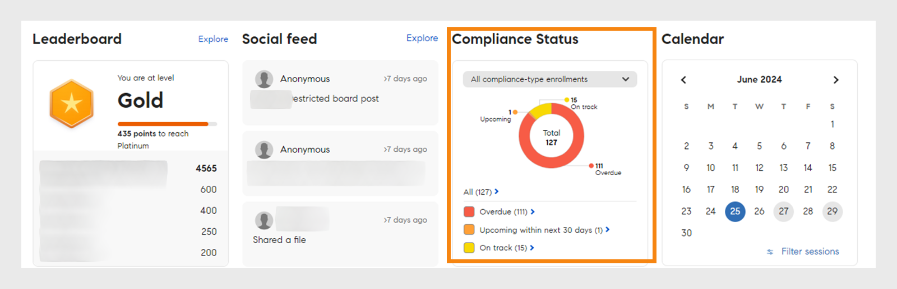

# Página inicial do aluno

## Visão geral {#overview}

Depois que o administrador habilita o layout imersivo, o aluno é recebido com uma interface de usuário completamente aprimorada ao fazer logon no aplicativo.

>[!NOTE]
>
>O navegador IE11 não oferece suporte ao layout imersivo.

## Nova interface do usuário para layout imersivo

>[!IMPORTANT]
>
>Lançaremos a nova interface do usuário do aluno em fases.

Atualizamos a interface do aluno com um design mais elegante e atualizado. A nova interface do usuário visa fornecer uma experiência do usuário consistente na **[!UICONTROL página]** inicial do aluno, **[!UICONTROL Meu aprendizado]**, **[!UICONTROL Catálogo]** e **[!UICONTROL Visão geral]** do curso. Os novos elementos visuais seguem os estilos de design atuais, tornando o produto mais fácil de usar e atraente. Esta atualização inclui um novo mastro, painel lateral e widgets contemporâneos.

>[!NOTE]
>
>A interface do usuário aprimorada se aplica apenas ao layout imersivo. A Web/aplicativo para dispositivos móveis ainda não oferece suporte a essas alterações e as atualizará em uma versão futura.

_Interface de usuário antiga_

_Nova interface do usuário_

### Página inicial

A página inicial tem um novo design com um painel lateral aprimorado, cabeçalho superior, cartões de curso aprimorados e widgets.

_Nova página inicial_

### Página Catálogo

As páginas catálogo apresentam uma nova aparência com filtros organizados e cartões de curso aprimorados para proporcionar uma melhor experiência ao usuário.

_Página Catálogo_

### Página Visão geral do curso

A página de visão geral do curso apresenta um novo visual com mais detalhes sobre o curso. Esta página ajuda os alunos a obter todas as informações necessárias.

_Página de visão geral do curso_

### Cartões de curso

Os cartões de curso também apresentam um layout reformulado para exibir os detalhes com mais eficiência. Cartões de curso renovados destacam os metadados relevantes necessários para a inscrição. Esses metadados incluem datas, avaliações e descrições publicadas ou de vencimento corretas juntamente com seus autores ou provedores.

_Cartão do curso antigo_

_Novo cartão do curso_

Para cursos importados do **LinkedIn** e da **plataforma Go1** , os cartões do curso exibirão as datas originais da publicação do **LinkedIn** e **go1**. Você também pode ver essas datas de publicação específicas na Interface do usuário.

### Barra lateral e barra de pesquisa

A barra lateral é atualizada com novos elementos da interface do usuário para uma aparência mais limpa. A nova barra de pesquisa não tem nenhum botão pesquisar, dando a ela uma aparência mais limpa. Os alunos podem digitar uma palavra-chave e pressionar Enter para iniciar a pesquisa ou selecionar resultados abaixo da barra de pesquisa.

_Barra lateral e barra de pesquisa_

### Manchete {#masthead}

Apresenta um carrossel de vídeo ou imagem com um URL incorporado. O [administrador pode carregar qualquer ativo de imagem ou vídeo](../../administrators/feature-summary/announcements.md#masthead) como um mastro e definir sua visibilidade para um grupo de alunos.

*Exibir mastro*

### Lista do meu aprendizado {#mylearninglist}

Exibe o treinamento que o aluno tinha feito. Esses treinamentos são exibidos como cartas alinhadas horizontalmente. Você pode clicar no botão direito ou esquerdo para navegar pelos cursos.

*Visualizar minha lista de aprendizado*

Você também pode deslizar o dedo para a esquerda e para a direita para navegar pela lista.

Para retomar um curso, clique **[!UICONTROL em Continuar]** em um cartão e o reprodutor será iniciado.

A aparência de ícones em cada cartão de treinamento é ativada/desabilitada pelo administrador por meio do aplicativo de Administração (**configurações** > **Geral** > **Ativar ícones** do cartão de treinamento).

**Adicionar à Minha lista de aprendizado**

Se você passar o mouse em qualquer cartão do curso em **Recomendado com base em suas áreas de interesse** e **Recomendado com base em listas de atividades entre pares**, você verá uma opção para adicionar o curso à **Minha lista de aprendizado**. Clique **[!UICONTROL em +]** no cartão do curso e o curso será adicionado à **Minha lista** de aprendizados.

*Adicionar à Minha lista de aprendizado*

## Escolher níveis de habilidade {#chooseskilllevels}

Como aluno, você pode filtrar o catálogo do curso de acordo com estes níveis:

* Iniciante
* Intermediário
* Avançado

Escolha uma opção e você poderá ver o catálogo do curso de acordo com a seleção.

*Selecionar níveis de habilidade*

## Widget do painel de conformidade

O widget do painel de conformidade permite que os alunos filtrem cursos/caminhos de aprendizado/certificações que possuem futuros prazos usando o rótulo conformidade. Este recurso está disponível em todos os aplicativos do aluno, incluindo o aplicativo alm teams, a AEM, o aplicativo móvel, imersivo e o aplicativo SF.

_Widget do painel de conformidade_

## Calendário {#calendar}

Mostra as suas sessões agendadas e treinamento. Navegue pelo calendário para ver o treinamento para os meses subsequentes.

*Exibir calendário para sessões agendadas*

O widget Calendário tem os seguintes recursos. Você pode exibir:

* Treinamento por mês. Role para a esquerda ou direita.
* Próxima sala de aula ou sala de aula virtual disponível para você se inscrever.
* Próxima sala de aula ou treinamento em sala de aula virtual em que você se inscreveu.
* Treinamento em sala de aula virtual ou sala de aula aprovada pelo gerente.

## Feed social {#socialfeed}

*Visualizar feed social*

Veja o que outros usuários estão falando.

O widget resume a atividade por um período. Ele:

* Exibe os usuários ativos e as atividades dos usuários que estão em seu escopo ou grupo.
* Exibe postagens feitas nas últimas duas semanas.

## Habilidades de perfil {#profileskills}

As habilidades de perfil são usadas para as recomendações do curso. Se o administrador atribuir uma habilidade a um usuário ou grupo de usuários, a habilidade será adicionada às habilidades de perfil do aluno. Se o aluno adicionar uma habilidade ao seu perfil, todos os níveis da habilidade serão adicionados às habilidades de perfil do aluno. Quando um aluno passa o mouse sobre uma habilidade, ele/ela pode ver o nome da habilidade, o método de adição da habilidade, o nível, a porcentagem de conclusão da habilidade e os créditos.

*Exibir habilidades de perfil*

Se um aluno se inscrever em um curso, somente as habilidades externas que são baseadas em uma pontuação são adicionadas às habilidades de perfil. Além disso, o aluno pode pesquisar, selecionar e adicionar habilidades externas ao seu perfil. Se um aluno fez logon no aplicativo do aluno pela primeira vez e, se as habilidades do aluno já estiverem presentes, as habilidades serão exibidas em Meu perfil.

## Recomendação baseada na sua área de interesse {#recommendationbasedonyourareaofinterest}

Exibe treinamento com base na área de interesse escolhida. A recomendação é orientada por um algoritmo de aprendizado de máquina.

*Exibir cursos recomendados*

Para recomendações mais direcionadas, você pode atualizar suas habilidades clicando em **Exibir/Atualizar**.

Depois de adicionar uma habilidade, as recomendações futuras se tornarão mais direcionadas e focadas de acordo com as suas preferências.

Se o administrador desabilitou a opção **Explorar habilidades**, você poderá adicionar interesse às suas habilidades.

Os cursos recomendados são exibidos como cartões. Ao passar o mouse sobre um cartão, você pode ver mais detalhes do curso.

A terminologia do produto também é suportada.

**Habilidades alinhadas ao setor**

Você poderá ver o gráfico de habilidades da rede se o administrador tiver ativado a opção **Alinhado ao setor** no aplicativo do administrador.

Essas habilidades só podem ser visualizadas quando o administrador definir o tipo de treinamento para Alinhado ao setor.

Na visualização do Mapa de habilidades, você pode procurar uma habilidade ou habilidades e adicioná-las.

*Visualização do mapa de habilidades*

Ative a opção **Mostrar habilidades para as quais os treinamentos estão presentes na minha conta**, se você quiser exibir todas as habilidades que estão na sua conta.

Depois de adicionar uma habilidade, você pode ver o gráfico de força direcionada com a habilidade selecionada como o vértice principal e as habilidades associadas como vértices menores.

As habilidades escolhidas também são exibidas na seção **Habilidades selecionadas**.

*Habilidades selecionadas*

Para adicionar as habilidades, clique em **[!UICONTROL Adicionar]**.

## Recomendação baseada na atividade entre pares {#recommendationbasedonpeeractivity}

Exibe treinamento baseado no que seus colegas estão realizando. Isso é controlado novamente por um algoritmo de aprendizado de máquina. As recomendações são baseadas no treinamento para alunos alinhados ao setor e personalizados.
