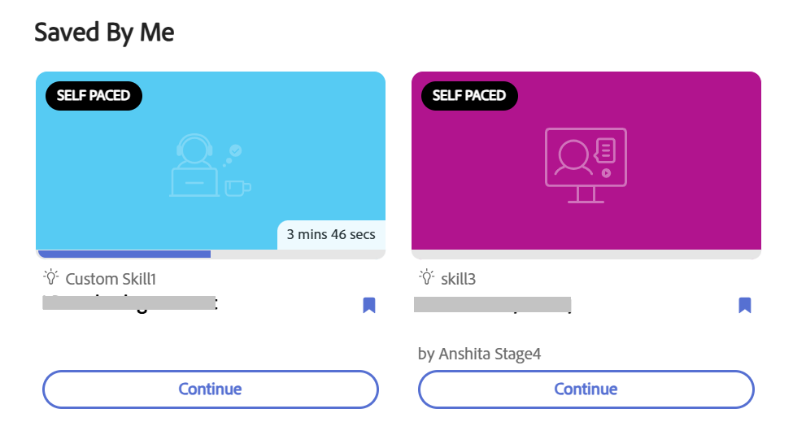

## O widget Salvo por mim

O widget **Salvo por mim** exibe cursos, programações de aprendizado, certificações e ajudas de tarefa que você marcou para depois. Ele oferece um único local para localizar o conteúdo marcado como salvo, sem precisar pesquisar o catálogo novamente.

Depois que um administrador configurar o widget **[!UICONTROL Salvo por mim]**, você poderá salvar um objeto de aprendizado (LO) selecionando o botão . Você pode salvar um LO nas páginas **[!UICONTROL Início]**, **[!UICONTROL Meu aprendizado]** e **[!UICONTROL Catálogo]**, e os LOs salvos aparecem na categoria **[!UICONTROL Salvo por mim]**, na página **[!UICONTROL Início]**.

Você pode cancelar o salvamento de um LO selecionando o mesmo botão .

