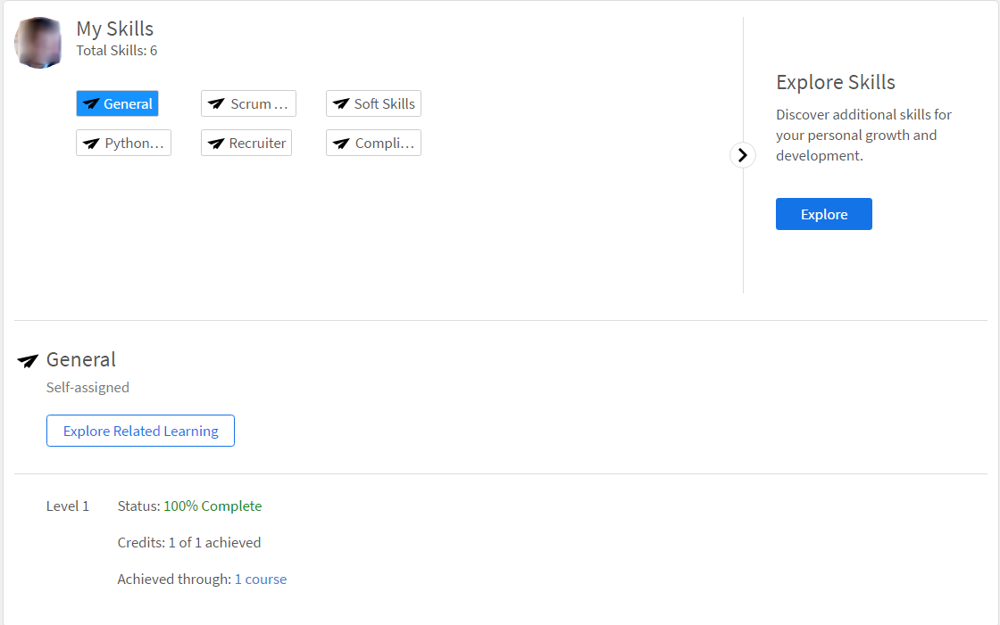

# Habilidades e níveis

Leia esse artigo para saber como obter habilidades no Learning Manager, como aluno.

O mapa de habilidades é um agrupamento dos conjuntos de habilidades, conhecimentos e características do funcionário de uma empresa. Essas habilidades ajudam as companhias/empresas a definir ou aumentar as expectativas do desempenho de seus funcionários. As habilidades permitem que os funcionários conciliem suas condutas às expectativas da empresa.

O Adobe Learning Manager permite mapear o desempenho dos alunos com base em seu conjunto de habilidades através do widget Habilidades. Quando os alunos terminam de realizar alguns cursos, eles podem saber sua classificação em relação a cada habilidade clicando em Habilidades na página inicial dos alunos.

## Exibir habilidades {#viewskills}

Para exibir as habilidades, clique em qualquer um dos nomes de habilidade no widget Habilidades na página do aluno. As habilidades são exibidas com os níveis ao lado delas.

*Exibir todas as habilidades*

A porcentagem de conclusão de cada habilidade está disponível ao lado da habilidade no widget. Ao clicar em cada nível, o aplicativo o leva à página Habilidades, na qual você pode visualizar os detalhes da habilidade clicada.

A página Habilidades exibe o Status da habilidade em que você clicou. Por exemplo, Java. A página Habilidade exibe o Status - por exemplo, “Em andamento” e os créditos - por exemplo, “Obtidos 2 de 10”.

Nessa página, você pode clicar em cada uma de suas habilidades para ver os dados correspondentes.

*Exibir cada habilidade*

Somente os administradores podem criar e atribuir habilidades aos alunos. As habilidades são automaticamente atribuídas aos alunos de acordo com os cursos/programas de aprendizado nos quais estão inscritos.

## Adquirir habilidades {#achieveskill}

O aluno pode adquirir a habilidade ao concluir os cursos/programas de aprendizado atribuídos a eles com os créditos de habilidade atribuídos a ela. Os alunos também podem adquirir a habilidade inscrevendo-se nos cursos que pertencem a uma determinada habilidade e concluindo-o.
