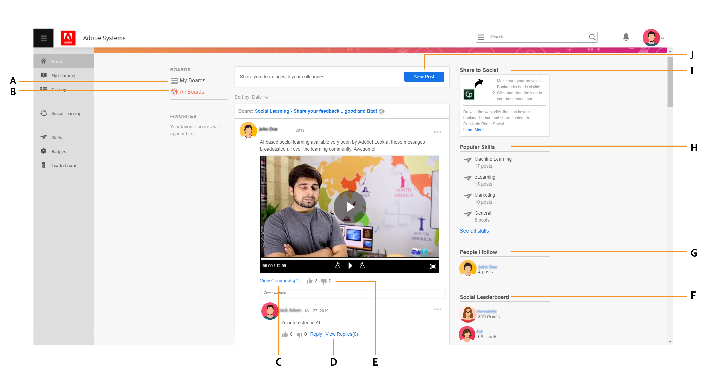

# Aprendizado social no Learning Manager

Saiba como usar a Web de aprendizado social como um aluno

Aprendizado social é uma plataforma do Learning Manager que incentiva os usuários a compartilharem ideias e opiniões significativas em um ambiente informal. É uma metodologia que complementa a ideia de aprendizado tradicional. Concluir um curso on-line não dá uma vantagem aos usuários de interagir com seus colegas em um nível social.

Simplesmente participar de um treinamento não garante que os usuários mantenham tudo o que é ensinado. Por outro lado, o aprendizado social permite que os usuários usem a experiência ao seu redor para obter exatamente as informações de que precisam. Por sua vez, os usuários podem aplicar rapidamente essas informações para concluir uma tarefa e atingir uma meta.

Da mesma forma, o recurso Aprendizado social do Learning Manager permite que os usuários sejam capazes de interagir entre si compartilhando e aprendendo com o conteúdo.

Nesta plataforma, os diferentes tipos de conteúdo que podem ser compartilhados são vídeo, áudio, captura de tela, texto, pergunta e enquete. Os usuários também podem compartilhar aprendizados on-line com seus colegas usando o **Compartilhar no bookmarklet social**. Para obter mais informações, consulte  [Compartilhar no Aprendizado social](share-to-social.md).

O conteúdo também pode ser publicado em um painel com a ajuda do **aplicativo de desktop Adobe Learning Manager**. Para obter mais informações, consulte  [Aplicativo de desktop Adobe Learning Manager](../adobe-learning-manager-app-for-desktop.md).

Somente se o administrador ativar o Aprendizado social, o recurso ficará visível para um aluno.

 

*Exibir painel de aprendizado*

<table>
 <tbody>
  <tr>
   <td>
    
<b>Sl. Não.</b>
</td>
   <td>
    
<b>Terminologia ou conceito</b>
</td>
   <td>
    
<b>Breve explicação</b>
</td>
  </tr>
  <tr>
   <td>
    
1
</td>
   <td>
    
Meus painéis
</td>
   <td>
    
Um painel é <code>
      collection
     </code> de postagens criadas por um usuário. Meus painéis exibem todas as publicações que o usuário participou, criou e seguiu.
</td>
  </tr>
  <tr>
   <td>
    
2
</td>
   <td>
    
Todos os painéis
</td>
   <td>
    
Na página Todos os painéis, os usuários podem ver os painéis criados por todos os alunos que compartilham o escopo da atividade.
</td>
  </tr>
  <tr>
   <td>
    
3
</td>
   <td>
    
Comentário
</td>
   <td>
    
Os usuários podem comentar e exibir publicações criadas em painéis. 
</td>
  </tr>
  <tr>
   <td>
    
4
</td>
   <td>
    
Responder
</td>
   <td>
    
Os usuários podem responder a comentários feitos em publicações dentro de um painel.
</td>
  </tr>
  <tr>
   <td>
    
5
</td>
   <td>
    
Voto a favor/voto contra
</td>
   <td>
    
Clique no botão upvote e downvote para curtir ou não uma postagem.
</td>
  </tr>
  <tr>
   <td>
    
6
</td>
   <td>
    
Quadro de classificação social
</td>
   <td>
    
No quadro de classificação social, os usuários podem ver os nomes dos alunos com o número de pontos que ganharam ao participar do aprendizado social.
</td>
  </tr>
  <tr>
   <td>
    
7
</td>
   <td>
    
Pessoas que eu sigo
</td>
   <td>
    
Aqui os usuários podem ver os nomes de outros alunos e o número de publicações criadas.
</td>
  </tr>
  <tr>
   <td>
    
8
</td>
   <td>
    
Habilidades populares
</td>
   <td>
    
Nas seções Todos os painéis, as habilidades que foram usadas com frequência pelos alunos podem ser exibidas juntamente com o número de publicações criadas usando essa habilidade.
</td>
  </tr>
  <tr>
   <td>
    
9
</td>
   <td>
    
Compartilhar nas redes sociais
</td>
   <td>
    
Compartilhar no social é um bookmarklet que permite que os usuários compartilhem aprendizados on-line como páginas da Web e blogs diretamente no Aprendizado social do Learning Manager.
</td>
  </tr>
  <tr>
   <td>
    
10
</td>
   <td>
    
Nova publicação
</td>
   <td>
    
O botão Nova publicação permite que os usuários criem e publiquem conteúdo dentro dos quadros.
</td>
  </tr>
 </tbody>
</table>

## Criando conteúdo como uma publicação {#creatingcontentasapost}

O conteúdo é criado como uma publicação dentro de um painel. Para criar uma publicação, siga as etapas abaixo:

1. Clique em **[!UICONTROL Nova publicação].**

   
   *Selecionar Nova Publicação*

1. Selecione qualquer um dos seguintes tipos de conteúdo para ser publicado: texto, pergunta, vídeo, áudio, pesquisa e captura de tela. O conteúdo existente pode ser carregado do sistema dos usuários ou da galeria do aplicativo de desktop Adobe Learning Manager.

   Use o aplicativo de desktop Adobe Learning Manager para gravar um vídeo ou uma tela, áudio e fazer uma captura de tela. Para obter mais informações, consulte [aplicativo de desktop Adobe Learning Manager](../adobe-learning-manager-app-for-desktop.md).

   <!---->

1. Pesquise um painel ou habilidade relacionada à publicação. Se o painel não existir, clique em **[!UICONTROL Criar um novo painel]**.

   

   *Criar um painel*

   Se você for um usuário externo ou interno e se o administrador tiver concedido a você acesso para criar um painel, você poderá criar um painel. Se você não tiver as permissões para criar um painel, o link **Criar um novo painel** não é exibido.

1. Na caixa de diálogo pop-up, preencha os detalhes e selecione o seguinte tipo de painel de discussão:

   * **Público** - A participação e a visibilidade das publicações estão disponíveis para todos os usuários.
   * **Privado** - A publicação só é visível para o criador do painel, moderadores e usuários adicionados ao painel.
   * **Restrito** - Somente o proprietário do painel, o administrador e os moderadores do painel podem criar uma publicação. Outros usuários podem participar comentando/respondendo, aumentando/reduzindo o voto e assim por diante.

   <!---->

   >[!NOTE]
   >
   >No aplicativo Social Learner, somente um **Admin** tem a capacidade de criar um quadro privado com grupos de usuários (interno/externo).
   >
   >Qualquer outro usuário, exceto o administrador, autor, aluno, gerente, instrutor etc. **não é possível** criar quadros privados com grupos de usuários. Eles não podem ver a seção de **grupos de usuários** durante a criação do conselho privado.

   Somente administrador - quando você escolhe **Privado**, você verá duas opções- **Usuários** e **Grupos de usuários**. Escolha a opção **Grupos de usuários** e adicione os grupos de usuários com quem deseja compartilhar o quadro privado.

   No campo Grupos de usuários, você pode escolher grupos internos, externos ou personalizados. O quadro privado ficará visível para todos os grupos de usuários especificados, independentemente das configurações do escopo.

1. Para compartilhar conteúdo, clique em **[!UICONTROL Publicar]**. Ao clicar em Publicar, o usuário recebe uma notificação.

   O conteúdo é publicado com base na configuração de curadoria definida pelo administrador para conteúdo de Aprendizado social que pode ser selecionado por  [Moderadores do painel/Especialistas no assunto](social-learning-web-user.md#HowtobecomeaSubjectMatterExpertSME).

   <!---->

1. Os usuários recebem notificações quando sua publicação é aprovada ou rejeitada, se o administrador tiver definido a configuração de curadoria como Somente manual. Se a publicação for rejeitada, clique no botão **Clique para Revisar** hiperlink para revisar os comentários fornecidos pelos moderadores do conselho ou por SMEs (Subject Matter Experts, especialistas no assunto).

   O conteúdo criado por usuários é selecionado por moderadores do painel ou especialistas no assunto.

   <!---->

Ao criar ou responder a uma publicação no Aprendizado social, você pode redigir uma publicação usando o Editor de Rich Text e aplicar diferentes tipos de formatação.

*Usar o Editor de Rich Text para criar uma publicação*

Além disso, ao criar um painel, você tem acesso ao mesmo conjunto de opções no Editor de Rich Text.

*Usar o Editor de Rich Text para criar uma publicação*

## Visualização de conteúdo aprovado {#viewingapprovedcontent}

Depois que uma publicação é aprovada, ela é exibida em um painel de Aprendizado social. Os usuários agora podem comentar, responder, aprovar/desaprovar a publicação.

Os usuários podem usar o seguinte tipo de conteúdo para fazer um comentário: gravar tela, webcam ou ambos; gravar áudio; fazer captura de tela; carregar arquivo; galeria do Learning Manager.

<!---->

## Conteúdo no reprodutor social {#contentinsocialplayer}

No Learning Manager, os vídeos, o conteúdo estático como apresentações e as imagens são publicados no reprodutor social de um painel. Você pode carregar um arquivo do seu sistema, gravar vídeos/telas e capturar telas com a ajuda do aplicativo de desktop Adobe Learning Manager.

Depois que o usuário termina de publicar algum conteúdo, ele pode ser visualizado por outros alunos em seu escopo de atividade. Nos reprodutores sociais, os alunos podem exibir, comentar/responder, aprovar/desaprovar e relatar abuso.

<!---->

**Para comentar/responder, aprovar/desaprovar no reprodutor social, siga as etapas abaixo:**

1. Clique no botão de tela inteira no canto inferior direito do reprodutor social.
1. Para exibir os controles do reprodutor na tela, clique na seta virada para baixo.
1. Para exibir a seção de comentários, clique no ícone de comentários no canto inferior esquerdo da tela.
1. Os usuários podem comentar/responder, aprovar/desaprovar e denunciar abuso.
1. Clique na tecla Esc para sair do modo de tela inteira.

## Exibição do quadro no social {#board-view-social}

Um aluno pode ver todas as placas em uma exibição de lista. Entre no aplicativo do aluno e na página Aprendizado social, clique no botão, conforme mostrado abaixo:

*Exibição do quadro no social*

Ao exibir as publicações em um formato de quadro, você pode ordenar as publicações de acordo com **Publicar** e **Colaborador**.

* Se você escolher **Publicações** No entanto, os painéis serão classificados de acordo com o número de postos feitos no painel.
* Se você escolher **Colaboradores**, os painéis serão classificados de acordo com o número de usuários que comentaram ou responderam nos tópicos.

### Filtro de habilidade {#skillfilter}

*Classificar as publicações*

Usando o filtro Habilidade, você pode selecionar várias habilidades para filtrar os painéis. Você também pode limpar os filtros depois de selecionar as habilidades.

### Filtro Nível de Atividade {#activitylevelfilter}

*Filtrar níveis de atividade*

Usando o filtro Atividade, você pode classificar os painéis de acordo com a magnitude das interações em um painel. Você pode classificar de acordo com:

* Alta atividade
* Atividade normal
* Baixa atividade

Na exibição do quadro, você pode executar as ações comuns a nível do quadro.

<!---->

## Baixar publicações {#downloadposts}

Os alunos podem baixar o conteúdo, com anexos, da plataforma de aprendizado social para que possam usá-lo offline.

*Baixar uma publicação nas redes sociais*

Você pode baixar o conteúdo das seções Postagens ou Comentários ou Respostas. Você pode baixar apenas um arquivo por vez.

Os dois tipos de usuários (interno ou externo) devem ser capazes de baixar o conteúdo.

O botão Baixar também pode ser visto nos resultados de pesquisa de publicações, comentários ou respostas.

Você ainda não pode baixar uma publicação no aplicativo do dispositivo. Este recurso estará disponível em breve.

## Formatos de conteúdo suportados {#supportedcontentformats}

<table>
 <tbody>
  <tr>
   <td>
    
<b>Tipo de conteúdo</b>
</td>
   <td>
    
<b>Extensões</b>
</td>
  </tr>
  <tr>
   <td>
    
Vídeo
</td>
   <td>
    
wmv, f4v, asf, 3gp, 3g2, avi, mov, h264, m4v, mp4, MPEG, mpg
</td>
  </tr>
  <tr>
   <td>
    
Áudio
</td>
   <td>
    
mp3, amr, m4a, wav, wma, aac
</td>
  </tr>
  <tr>
   <td>
    
Arquivos estáticos
</td>
   <td>
    
PDF, ppt, pptx, doc, docx, xls, xlsx
</td>
  </tr>
  <tr>
   <td>
    
Imagem
</td>
   <td>
    
jpg, jpeg, png, bmp, gif
</td>
  </tr>
 </tbody>
</table>

## Painel visível somente para usuários selecionados {#selected-users}

Um aluno que também tenha um **administrador** a função pode adicionar um grupo de usuários a um quadro privado. Qualquer grupo de usuários pode ser adicionado ao painel privado e os usuários que pertencem ao grupo de usuários têm acesso apenas ao painel.

Se um novo usuário for adicionado ao grupo de usuários, ambos os usuários poderão ver o quadro privado.

Se algum usuário for removido do quadro privado, ele não poderá mais ver o quadro privado.

Se vários grupos de usuários forem adicionados ao painel privado, todos os usuários de ambos os grupos terão acesso aos painéis privados.

<!---->

## Ações que podem ser realizadas em uma publicação {#actionsthatcanbedoneonapost}

Clique no ícone de menu recolhido no canto superior direito de uma publicação para visualizar suas opções. A seguinte lista de menus é exibida: Editar, adicionar à minha história, copiar URL, excluir e relatar.

Somente alguns usuários têm permissões para executar tarefas específicas. Os tipos de usuários a seguir são proprietários de conteúdo, moderadores de painel e administrador da organização.

<table>
 <tbody>
  <tr>
   <td>
    
<b>Sl. Não.</b>
</td>
   <td>
    
<b>Ação</b>
</td>
   <td>
    
<b>Explicação</b>
</td>
  </tr>
  <tr>
   <td>
    
1
</td>
   <td>
    
Editar
</td>
   <td>
    
Editar permite que o criador do conteúdo corrija ou modifique a publicação.
</td>
  </tr>
  <tr>
   <td>
    
2
</td>
   <td>
    
Adicionar à minha história
</td>
   <td>
    
Uma história é uma coleção de conteúdo selecionado por um usuário. Os usuários podem definir a visibilidade do conteúdo como Privado ou Público.
</td>
  </tr>
  <tr>
   <td>
    
3
</td>
   <td>
    
Copiar URL
</td>
   <td>
    
Essa opção permite que todos os usuários copiem o URL de um painel ou publiquem e compartilhem.
</td>
  </tr>
  <tr>
   <td>
    
4
</td>
   <td>
    
Excluir
</td>
   <td>
    
A opção Excluir remove a publicação após a confirmação do usuário.
</td>
  </tr>
  <tr>
   <td>
    
5
</td>
   <td>
    
Denunciar
</td>
   <td>
    
Cada usuário tem permissões para denunciar um abuso de uma postagem se ela violar sua privacidade ou seu conteúdo for inadequado.

    
Depois que uma publicação é denunciada, uma notificação é enviada ao administrador e aos moderadores do painel para que tomem outras medidas.
</td>
  </tr>
 </tbody>
</table>

**Adicionar à minha história**

História social permite aos usuários adicionar ou criar histórias com publicações criadas por eles ou outros usuários.

Para adicionar uma publicação a uma história, siga as etapas abaixo:

1. Clique no ícone de menu recolhido no canto superior direito de uma publicação e clique em **[!UICONTROL Adicionar à minha história]**.

   

   *Adicionar a uma matéria*

1. Na guia **Selecionar matéria** , selecione uma matéria relevante para adicionar a publicação. Se não houver matérias relevantes existentes, crie uma matéria clicando em **Nova história**.

   

   *Criar uma história*

1. Na caixa de diálogo Nova matéria, preencha os campos Nome da matéria e Descrição. Você também pode definir a visibilidade da matéria como Pública ou Privada.

   

   *Adicionar nome e descrição da matéria*

   Para exibir as matérias criadas pelos usuários, clique no nome do usuário nas opções do menu do perfil.

## Privilégios de usuário para executar as ações em uma publicação {#userprivilegesforperformingtheactionsonapost}

<table>
 <tbody>
  <tr>
   <td>
    
 
</td>
   <td>
    
<b>Proprietário do conteúdo</b>
</td>
   <td>
    
<b>Qualquer usuário</b>
</td>
   <td>
    
<b>Moderadores do painel</b>
</td>
   <td>
    
<b>Administrador</b>
</td>
  </tr>
  <tr>
   <td>
    
<b>Editar</b>
</td>
   <td>
    
Sim
</td>
   <td>
    
Não
</td>
   <td>
    
Não
</td>
   <td>
    
Não
</td>
  </tr>
  <tr>
   <td>
    
<b>Adicionar à minha história</b>
</td>
   <td>
    
Sim
</td>
   <td>
    
Sim
</td>
   <td>
    
Sim
</td>
   <td>
    
Sim
</td>
  </tr>
  <tr>
   <td>
    
<b>Copiar URL</b>
</td>
   <td>
    
Sim
</td>
   <td>
    
Sim
</td>
   <td>
    
Sim
</td>
   <td>
    
Sim
</td>
  </tr>
  <tr>
   <td>
    
<b>Excluir</b>
</td>
   <td>
    
Sim
</td>
   <td>
    
Não
</td>
   <td>
    
Sim
</td>
   <td>
    
Sim
</td>
  </tr>
  <tr>
   <td>
    
<b>Denunciar</b>
</td>
   <td>
    
Sim
</td>
   <td>
    
Sim
</td>
   <td>
    
Sim
</td>
   <td>
    
Sim
</td>
  </tr>
 </tbody>
</table>

## Visualização de conteúdo em painéis {#viewingcontentinboards}

Os painéis são uma coleção de publicações. Cada painel do Aprendizado social é criado com base em uma habilidade. No Aprendizado social, os usuários podem exibir os **Todos os painéis** página e **Meus painéis** página.

Na página Todos os painéis de discussão, são visíveis as publicações ou painéis criados por todos os usuários em um escopo de atividade. Mas na página Meus painéis, somente painéis criados, seguidos e participados por um usuário estão visíveis.

Na página Meus painéis, os painéis visíveis podem ser filtrados de acordo com o seguinte: **Tudo**, **Criado por mim**, **Comentou por mim**, **Seguido por mim**.

*Filtrar painéis visíveis*

Em Meus painéis e Todos os painéis, os usuários podem classificar os painéis por **Relevância** ou **Data**.

*Classificar quadros por relevância e data*

Ao criar uma publicação, se não houver painéis relevantes para a publicação, clique em [Criar um novo painel](social-learning-web-user.md#Creatingcontentasapost).  Para exibir, editar, excluir, relatar, copiar o URL e adicionar um painel à sua lista de painéis favoritos, siga as etapas abaixo:

1. Clique no nome do painel ou clique em **[!UICONTROL Ir para o painel]**.
1. Na página painéis, clique no ícone do menu recolhido e selecione uma opção na lista suspensa.

   <!---->

**Os usuários podem ver as seguintes opções em uma página de painéis:**

* O número de publicações, exibições e pessoas que seguem o painel está visível nesta página. O nome do criador do painel e a data em que o painel foi criado também são exibidos junto com os principais SMEs do painel.

* Os nomes dos painéis adicionados à lista de painéis favoritos de um usuário também são exibidos.

<!---->

## Compartilhar no Social {#sharetosocial}

Compartilhar no social é um bookmarklet que permite que os usuários compartilhem aprendizados on-line como páginas da Web e blogs diretamente na página social como uma publicação. Para obter mais informações, consulte [Compartilhar no Aprendizado social](share-to-social.md).

*Compartilhar no aprendizado social*

## Minhas habilidades {#myskills}

Os usuários podem exibir as habilidades e o número de publicações ou painéis criados usando uma habilidade na página Meus painéis. Para exibir todas as habilidades usadas pelo usuário ao criar um painel, clique em **[!UICONTROL Ver todas as habilidades]**.

*Exibir todas as habilidades*

## Pessoas que eu sigo {#peopleifollow}

Na página Meus painéis, os usuários podem ver os nomes das pessoas que seguem e o número de publicações criadas.

*Pessoas que um aluno segue*

Para seguir outros usuários, siga as etapas abaixo:

1. Para exibir a página de perfil de outro usuário, clique no nome dele.
1. Clique no botão seguir/ deixar de seguir para executar a ação desejada.

   

   *Seguir ou deixar de seguir um usuário*

## Quadro de Líderes Sociais {#socialleaderboard}

O quadro de classificação social aumenta a gamificação. Os pontos de atividade são concedidos aos usuários na criação de uma nova publicação/quadro, na obtenção de um voto favorável para sua publicação, no fornecimento da resposta certa a uma pergunta e outras participações no Aprendizado social.

O número total de pontos e novas postagens para todos os usuários no mesmo escopo é visível na lista de quadro de classificação social. O aluno com o número máximo de pontos aparece na parte superior da lista de quadro de classificação social seguido pelos outros alunos de acordo.

Clique em **[!UICONTROL Ir para Quadro de classificação]** na caixa **Meus painéis** página para exibir todos os alunos e o número de pontos concedidos.

*Exibir todos os alunos*

## Pontos de atividade {#activitypoints}

O número de pontos de atividade fornecidos aos usuários é baseado nas atividades sociais realizadas.

**Os pontos de atividade são concedidos aos usuários para o seguinte:**

* 5 pontos para criar um painel.
* 5 pontos para adicionar uma postagem como texto ou tipo de pergunta.
* 2 pontos para comentar em qualquer publicação.
* 1 ponto é concedido ao usuário que é o primeiro a começar a usar um painel. Os usuários ganham um total de 20 pontos para os primeiros 20 novos posts publicados nesse painel.

## Como se tornar um especialista no assunto (SME) {#howtobecomeasubjectmatterexpertsme}

Um especialista no assunto (SME) é uma pessoa com experiência em uma habilidade específica. No Aprendizado social do Learning Manager, os usuários são designados como SME com base no número máximo de pontos de atividade concedido a eles em relação a uma habilidade.

As principais SMEs têm o privilégio de organizar o conteúdo do aluno antes que ele seja publicado em um painel no Aprendizado social.

O administrador da organização também tem o privilégio de adicionar mais pontos a um aluno para torná-lo um SME para uma habilidade.

## Como organizar conteúdo como uma PME? {#howtocuratecontentasasme}

1. Ao criar uma nova publicação ou painel por um usuário, o SME recebe uma notificação exibindo que uma publicação em um painel está aguardando curadoria.

   <!---->

1. Para moderar a publicação, clique no botão **Clique para revisar** link. Essa ação direciona o SME para a página de moderação de conteúdo, que se parece com a captura de tela abaixo.

   <!---->

1. Para classificar o conteúdo com base na porcentagem de relevância que ele tem para a habilidade de um painel, selecione a cor na escala de relevância. A primeira cor é considerada irrelevante (10% de relevância) e a última cor representa muito relevante (100% de relevância).
1. Recomenda-se que as PME formulem um comentário com base em uma pontuação de relevância específica. Os usuários entendem melhor por que sua postagem é rejeitada ao ler o comentário.

<!--## AI-enabled auto curation {#autocuration}-->

## Pesquisar em aprendizado formal e informal {#searchinformalandinformallearning}

Cada página do Aprendizado social tem o campo de pesquisa, que permite aos usuários procurar qualquer quadro, habilidade ou conteúdo. Pesquise digitando no campo de pesquisa e clique no ícone de pesquisa ou pressione a tecla Enter no teclado.

<!---->

As seguintes páginas no aprendizado informal têm um campo de pesquisa: **Meus painéis**, **Todos os painéis**, **Página Painéis**, do usuário **Página de perfil** e **página de perfil de outro aluno**.

Quando um usuário pesquisa um conteúdo no aprendizado informal, é exibido o número total de resultados da pesquisa do conteúdo no aprendizado informal e formal do Learning Manager.

Da mesma forma, o número de resultados de pesquisa encontrados no aprendizado informal é exibido ao pesquisar conteúdo em uma página de aprendizado formal.

*Resultados de pesquisa para aprendizado*

Na página do painel de aprendizagem informal, somente pesquisas relacionadas ao painel podem ser feitas. Qualquer pesquisa não relacionada a um painel de discussão não é exibida.

## Exibir perfil de usuário {#viewuserprofile}

Se o Aprendizado social estiver ativado para um aluno, o usuário poderá exibir seu perfil ao clicar na imagem do perfil no canto superior direito do Aprendizado social e clicar no nome dele na lista suspensa.

*Exibir perfil de usuário*

Na página de perfil, os alunos podem ver o número total de pontos ganhos, o número de postagens criadas e o número de seguidores que têm.

Os alunos também podem exibir as habilidades para as quais foram designados como especialista no assunto.

A página do aluno também exibe o nome **matérias selecionadas**, **atividades recentes** realizadas e a **pessoas seguidas** por eles.

## Notificações {#notifications}

Na aprovação ou rejeição de uma publicação pelo SME, os usuários recebem uma notificação que pode ser exibida ao clicar no ícone de notificações no canto superior direito da janela. Os usuários podem exibir notificações de Aprendizado social e atividades de Aprendizado formal.

<!---->
