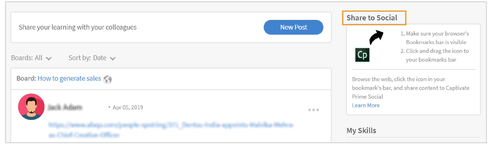

# Aprendizado social no Learning Manager

Saiba como usar a Web de aprendizado social como um aluno

Aprendizado social é uma plataforma do Learning Manager que incentiva os usuários a compartilharem ideias e opiniões significativas em um ambiente informal. É uma metodologia que complementa a ideia da aprendizagem tradicional. Ao finalizar um curso on-line, os usuários não tem a vantagem de interagir com seus colegas no nível do social.

A simples participação em um treinamento, não garante que os usuários conseguirão reter tudo o que foi ensinado. Por outro lado, o aprendizado social permite que os usuários usem a experiência ao seu redor para obter exatamente as informações de que precisam. Por sua vez, os usuários podem aplicar rapidamente essas informações para concluir uma tarefa e atingir uma meta.

Da mesma forma, o recurso Aprendizado social do Learning Manager permite que os usuários sejam capazes de interagir entre si compartilhando e aprendendo com o conteúdo.

Nesta plataforma, os tipos de conteúdo que podem ser compartilhados são vídeo, áudio, capturas de tela, texto, perguntas e enquetes. Os usuários também podem compartilhar aprendizados online com colegas usando o **bookmarklet Compartilhar no Social**. Para obter mais informações, consulte [Compartilhar no Aprendizado Social](share-to-social.md).

O conteúdo também pode ser publicado em um painel com a ajuda do **aplicativo de desktop da Adobe Learning Manager**. Para obter mais informações, consulte [aplicativo de desktop da Adobe Learning Manager](../adobe-learning-manager-app-for-desktop.md).

O recurso fica visível a um aluno somente se o administrador ativar o recurso Aprendizado social.

 

*Exibir painel de aprendizado*

<table>
 <tbody>
  <tr>
   <td>
    
<b>Letra Nº</b>
</td>
   <td>
    
<b>Terminologia ou conceito</b>
</td>
   <td>
    
<b>Breve explicação</b>
</td>
  </tr>
  <tr>
   <td>
    
1
</td>
   <td>
    
Meus painéis
</td>
   <td>
    
Um painel é <code>
      collection
     </code> de postagens criadas por um usuário. Meus painéis exibi todas as publicações que o usuário participou, criou e seguiu.
</td>
  </tr>
  <tr>
   <td>
    
2
</td>
   <td>
    
Todos os painéis
</td>
   <td>
    
Na página Todos os painéis, os usuários podem visualizar os painéis criados por todos os alunos que compartilham o contexto da atividade.
</td>
  </tr>
  <tr>
   <td>
    
3
</td>
   <td>
    
Comentário
</td>
   <td>
    
Os usuários podem fazer comentários e visualizar as publicações criadas nos painéis. 
</td>
  </tr>
  <tr>
   <td>
    
4
</td>
   <td>
    
Responder
</td>
   <td>
    
Os usuários podem responder aos comentários que são feitos nas publicações de um painel.
</td>
  </tr>
  <tr>
   <td>
    
5
</td>
   <td>
    
Aprovar/Desaprovar
</td>
   <td>
    
Clique nos botões Aprovar ou Desaprovar para curtir ou não curtir uma publicação.
</td>
  </tr>
  <tr>
   <td>
    
6
</td>
   <td>
    
Quadro de classificação do aprendizado social
</td>
   <td>
    
No painel de classificação social, os usuários podem ver os nomes dos alunos com o número de pontos que ganharam participando do aprendizado social.
</td>
  </tr>
  <tr>
   <td>
    
7
</td>
   <td>
    
Pessoas que eu sigo
</td>
   <td>
    
Aqui, os usuários podem exibir os nomes de outros alunos que seguem e o número de publicações criadas.
</td>
  </tr>
  <tr>
   <td>
    
8
</td>
   <td>
    
Habilidades populares
</td>
   <td>
    
Nas seções Todos os painéis, as habilidades que foram usadas pelos alunos podem ser exibidas junto com o número de publicações que eles criaram com base nessa habilidade.
</td>
  </tr>
  <tr>
   <td>
    
9
</td>
   <td>
    
Compartilhar no social
</td>
   <td>
    
Compartilhar no social é um bookmarklet que permite que os usuários compartilhem aprendizados on-line como páginas da Web e blogs diretamente no Aprendizado social do Learning Manager.
</td>
  </tr>
  <tr>
   <td>
    
10
</td>
   <td>
    
Nova publicação
</td>
   <td>
    
O botão Nova publicação permite que os usuários criem e publiquem o conteúdo dentro dos painéis.
</td>
  </tr>
 </tbody>
</table>

## Criação de conteúdo como uma publicação {#creatingcontentasapost}

O conteúdo é criado como uma publicação em um painel. Para criar uma publicação, siga as etapas abaixo:

1. Clique em **[!UICONTROL Nova Postagem].**

   
   *Selecionar Nova Postagem*

1. Selecione qualquer um dos seguintes tipos de conteúdo para ser publicado: texto, pergunta, vídeo, áudio, enquete e captura de tela. O conteúdo existente pode ser carregado do sistema dos usuários ou da galeria do aplicativo de desktop Adobe Learning Manager.

   Use o aplicativo de desktop Adobe Learning Manager para gravar um vídeo ou uma tela, áudio e fazer uma captura de tela. Para obter mais informações, consulte o [aplicativo de desktop da Adobe Learning Manager](../adobe-learning-manager-app-for-desktop.md).

   <!---->

1. Procure um painel ou habilidade que esteja relacionado à publicação. Se o painel não existir, clique em **[!UICONTROL Criar um Novo Painel]**.

   

   *Criar um painel*

   Usuários externos ou internos, com acesso concedido pelo Administrador, poderão criar painéis. Se você não tiver as permissões para criar um painel, o link **Criar um Novo Painel** não será exibido.

1. Na caixa de diálogo pop-up, preencha os detalhes, selecione o seguinte tipo de painel:

   * **Público** - A participação e a visibilidade das publicações estão disponíveis para todos os usuários.
   * **Particular** - A publicação só é visível para o criador do painel, moderadores e usuários adicionados ao painel.
   * **Restrito** - Somente o proprietário do painel, o administrador e os moderadores do painel podem criar uma postagem. Outros usuários podem participar comentando/respondendo, aumentando/reduzindo o voto e assim por diante.

   <!---->

   >[!NOTE]
   >
   >No aplicativo Social Learner, somente um **Administrador** pode criar um quadro privado com grupos de usuários (interno/externo).
   >
   >Qualquer outro usuário, exceto o administrador, autor, aluno, gerente, instrutor etc. **não é possível** criar quadros privados com grupos de usuários. Eles não podem ver a seção de **grupos de usuários** durante a criação do quadro privado.

   Somente administrador- Ao escolher **Privado**, você vê duas opções- **Usuários** e **Grupos de usuários** Escolha a opção **Grupos de usuários** e adicione os grupos de usuários com quem você deseja compartilhar o quadro privado.

   No campo Grupos de usuários, você pode escolher grupos internos, externos ou personalizados. Seu painel privado ficará visível para todos os grupos de usuários especificados, independentemente das configurações de escopo.

1. Para compartilhar conteúdo, clique em **[!UICONTROL Publicar]**. Ao clicar em Publicar, o usuário recebe uma notificação.

   O conteúdo é publicado com base na configuração de curadoria definida pelo administrador para conteúdo de Aprendizado Social, que pode ser selecionado por [Moderadores do painel/Especialistas no assunto](social-learning-web-user.md#HowtobecomeaSubjectMatterExpertSME).

   <!---->

1. Os usuários recebem notificações quando a publicação foi aprovada ou rejeitada, se o administrador tiver definido a configuração de curadoria como Somente manual. Se a publicação for rejeitada, clique no hiperlink **Clicar para analisar** para revisar os comentários dados pelos moderadores do painel ou especialistas no assunto (SMEs).

   O conteúdo criado pelos usuários são analisados pelos moderadores do painel ou por especialistas no assunto.

   <!---->

Ao criar ou responder a uma publicação no Aprendizado social, você pode redigir uma publicação usando o Editor de Rich Text e aplicar diferentes tipos de formatação.

*Usar o Editor de Rich Text para criar uma publicação*

Além disso, ao criar um painel, você tem acesso ao mesmo conjunto de opções no Editor de Rich Text.

*Usar o Editor de Rich Text para criar uma publicação*

## Visualização do conteúdo aprovado {#viewingapprovedcontent}

Depois que uma publicação é aprovada, ela é exibida em um painel do Aprendizado social. Os usuários agora podem comentar, responder, aprovar/desaprovar a publicação.

Os usuários podem usar o seguinte tipo de conteúdo para fazer um comentário: gravar tela, webcam ou ambos; gravar áudio; fazer captura de tela; carregar arquivo; galeria do Learning Manager.

<!---->

## Conteúdo no reprodutor social {#contentinsocialplayer}

No Learning Manager, os vídeos, o conteúdo estático como apresentações e as imagens são publicados no reprodutor social de um painel. Você pode carregar um arquivo do seu sistema, gravar vídeos/telas e capturar telas com a ajuda do aplicativo de desktop Adobe Learning Manager.

Depois que o usuário terminar de publicar um conteúdo, ele poderá ser visualizado por outros alunos no contexto da atividade. No reprodutor social os alunos podem ver, comentar/responder, aprovar/desaprovar e denunciar abuso.

<!---->

**Para comentar/responder, aprovar/desaprovar no reprodutor social, siga as etapas abaixo:**

1. Clique no botão de tela inteira no canto inferior direito do reprodutor social.
1. Para exibir os controles do reprodutor na tela, clique na seta para baixo.
1. Para ver a seção de comentários, clique no ícone de comentários no canto inferior esquerdo da tela.
1. Os usuários podem comentar/responder, aprovar/desaprovar e denunciar abuso.
1. Clique na tecla Esc para sair do modo de tela inteira.

## Exibição do quadro no social {#board-view-social}

Um aluno pode ver todas as placas em uma exibição de lista. Entre no aplicativo do aluno e na página Aprendizado social, clique no botão, conforme mostrado abaixo:

*Exibição do quadro no social*

Ao exibir as publicações em um formato de quadro, você pode ordenar as publicações de acordo com a **Publicação** e o **Colaborador**.

* Se você escolher **Publicações**, os painéis serão classificados de acordo com o número de publicações feitas no painel.
* Se você escolher **Colaboradores**, os painéis serão classificadas de acordo com o número de usuários que comentaram ou responderam nos tópicos.

## Marcar usuários em painéis sociais

Os alunos com acesso ao Conselho social podem marcar outros usuários em publicações e comentários de aprendizado social usando o formato @username. A marcação funciona por meio de aplicativos ou APIs. Somente usuários com acesso ao painel podem ser marcados, mantendo as interações relevantes e privadas.

* Usuários marcados recebem notificações no aplicativo e por email
* As notificações incluem links diretos para o conteúdo
* Usuários fora do painel não podem ser marcados
* Os usuários excluídos aparecem como “Anônimos”

>[!NOTE]
>
>Os alunos não podem marcar grupos de usuários nem usar menções @all para evitar spams.

### Marcar usuários em publicações no Conselho social

É possível marcar membros específicos do painel em publicações ou comentários usando @username. A marcação é limitada aos membros com acesso a esse painel.
Para marcar usuários em um painel social:

1. Faça logon no Adobe Learning Manager como aluno.
2. Selecione **[!UICONTROL Aprendizado Social]** no painel de navegação esquerdo.

   
   _Habilite o aprendizado colaborativo selecionando Aprendizado Social para acessar quadros de discussão, compartilhar insights e marcar usuários para engajamento interativo_

3. Selecione **[!UICONTROL Nova Postagem]**.

   
   _Inicie uma nova discussão selecionando Nova Publicação no Aprendizado Social para compartilhar conhecimento com os usuários marcados_

4. Antes de marcar usuários, selecione o painel de **[!UICONTROL Postar em um Quadro de Discussão]**.

   
   _Selecione um quadro de discussão para postar e marcar usuários, habilitando conversas colaborativas direcionadas no Aprendizado Social_

5. Digite os detalhes da publicação e marque um usuário digitando @ seguido do nome (por exemplo, @andrew). Quando você digita @ seguido das três primeiras letras do nome do usuário, uma lista de usuários correspondentes é exibida.

   
   _Marque os usuários na sua postagem de discussão digitando @ seguido do nome de usuário para habilitar a colaboração direcionada nos painéis de Aprendizado Social_

6. Selecione o usuário desejado na lista.
7. Selecione **[!UICONTROL Publicação]**.

Os usuários marcados recebem notificações no aplicativo e por email com um link direto para a publicação. Isso torna as discussões mais direcionadas e colaborativas.

### Marcar usuários com base no escopo do painel

A marcação com escopo restrito permite marcar apenas os alunos que têm permissão para acessar um painel específico. Isso mantém a privacidade, impedindo a marcação de usuários fora do escopo.

Se você tentar marcar os alunos que estão fora do escopo do painel, nenhuma sugestão será exibida e você não poderá marcá-los.

### Marcar usuários excluídos

Se um usuário que foi excluído for marcado em uma publicação de aprendizado social, o nome dele é exibido como “Anônimo” na publicação. O comentário e a tag permanecem visíveis para contexto, mas os links ou detalhes do perfil não são exibidos.

_Publicação do Aprendizado Social que destaca como um usuário excluído aparece como Anônimo quando marcado_

### Filtro de habilidade {#skillfilter}

*Classificar as publicações*

Usando o filtro Habilidade, você pode selecionar várias habilidades para filtrar os painéis. Você também pode limpar os filtros depois de selecionar as habilidades.

### Filtro de nível de atividade {#activitylevelfilter}

*Filtrar níveis de atividade*

Usando o filtro Atividade, você pode classificar os painéis de acordo com a magnitude das interações em um painel. Você pode classificar de acordo com:

* Alta atividade
* Atividade normal
* Baixa atividade

Na exibição do quadro, você pode executar as ações comuns a nível do quadro.

<!---->

## Baixar publicações {#downloadposts}

Os alunos podem baixar o conteúdo, com anexos, da plataforma de aprendizado social, para que possam usar esse conteúdo offline.

*Baixar uma publicação nas redes sociais*

Você pode baixar o conteúdo das seções Postagens ou Comentários ou Respostas. Você pode baixar apenas um arquivo por vez.

Os dois tipos de usuários (interno ou externo) devem ser capazes de baixar o conteúdo.

O botão Baixar também pode ser visto nos resultados de pesquisa de publicações, comentários ou respostas.

Você ainda não pode baixar uma postagem no aplicativo do dispositivo. Este recurso estará disponível em breve.

## Formatos de conteúdo suportados {#supportedcontentformats}

<table>
 <tbody>
  <tr>
   <td>
    
<b>Tipo de conteúdo</b>
</td>
   <td>
    
<b>Extensões</b>
</td>
  </tr>
  <tr>
   <td>
    
Vídeo
</td>
   <td>
    
wmv, f4v, asf, 3gp, 3g2, avi, mov, h264, m4v, mp4, MPEG, mpg
</td>
  </tr>
  <tr>
   <td>
    
Áudio
</td>
   <td>
    
mp3, amr, m4a, wav, wma, aac
</td>
  </tr>
  <tr>
   <td>
    
Arquivos estáticos
</td>
   <td>
    
PDF, ppt, pptx, doc, docx, xls, xlsx
</td>
  </tr>
  <tr>
   <td>
    
Imagem
</td>
   <td>
    
jpg, jpeg, png, bmp, gif
</td>
  </tr>
 </tbody>
</table>

## Painel visível somente para usuários selecionados {#selected-users}

Um aluno que também tem a função de **administrador** pode adicionar um grupo de usuários a um painel privado. Qualquer grupo de usuários pode ser adicionado ao painel privado e os usuários que pertencem ao grupo de usuários têm acesso apenas ao painel.

Se um novo usuário for adicionado ao grupo de usuários, ambos usuários poderão ver o painel privado.

Se algum usuário for removido do painel privado, o usuário não poderá mais ver o painel.

Se vários grupos de usuários forem adicionados ao painel privado, todos os usuários de ambos os grupos terão acesso aos painéis privados.

<!---->

## Ações que podem ser realizadas em uma publicação {#actionsthatcanbedoneonapost}

Clique no ícone contraído no menu do canto superior direito de uma publicação para ver suas opções. É exibida a seguinte lista de menus: Editar, Adicionar à minha história, Copiar URL, Excluir e Denunciar.

Somente alguns usuários têm permissão para realizar tarefas específicas. Os seguintes tipos de usuários são proprietários de conteúdo, moderadores de painel e o administrador da organização.

<table>
 <tbody>
  <tr>
   <td>
    
<b>Letra Nº</b>
</td>
   <td>
    
<b>Ação</b>
</td>
   <td>
    
<b>Explicação</b>
</td>
  </tr>
  <tr>
   <td>
    
1
</td>
   <td>
    
Editar
</td>
   <td>
    
Editar permite que o criador do conteúdo corrija ou modifique a publicação.
</td>
  </tr>
  <tr>
   <td>
    
2
</td>
   <td>
    
Adicionar à minha história
</td>
   <td>
    
Uma história é uma coleção de conteúdo avaliada por um usuário. Os usuários podem definir a visibilidade do conteúdo como Privado ou Público.
</td>
  </tr>
  <tr>
   <td>
    
3
</td>
   <td>
    
Copiar URL
</td>
   <td>
    
Esta opção permite que todos os usuários copiem o URL de um painel ou uma publicação e o compartilhem.
</td>
  </tr>
  <tr>
   <td>
    
4
</td>
   <td>
    
Excluir
</td>
   <td>
    
A opção Excluir remove a publicação após a confirmação do usuário.
</td>
  </tr>
  <tr>
   <td>
    
5
</td>
   <td>
    
Denunciar
</td>
   <td>
    
Cada usuário tem permissões para denunciar abuso de uma publicação que viola sua privacidade ou cujo conteúdo é inapropriado.

    
Depois que uma publicação é denunciada, uma notificação é enviada para o administrador e moderadores do painel para que sejam tomadas outras ações.
</td>
  </tr>
 </tbody>
</table>

**Adicionar à minha história**

A história social permite que os usuários adicionem ou criem histórias com as publicações criadas por eles ou por outros usuários.

Para adicionar uma publicação à uma história, siga as etapas abaixo:

1. Clique no ícone do menu recolhido no canto superior direito de uma publicação e clique em **[!UICONTROL Adicionar à minha história]**.

   

   *Adicionar a uma história*

1. Na caixa de diálogo **Selecionar história**, selecione uma história relevante para ser adicionada à publicação. Se houver histórias relevantes, crie uma clicando em **Nova história**.

   

   *Criar uma história*

1. Na caixa de diálogo Nova história, preencha os campos de nome e descrição da história. Você também pode definir a visibilidade da história como pública ou privada.

   

   *Adicionar nome e descrição da história*

   Para exibir as matérias criadas pelos usuários, clique no nome do usuário nas opções do menu do perfil.

## Privilégios de usuário para executar as ações em uma publicação {#userprivilegesforperformingtheactionsonapost}

<table>
 <tbody>
  <tr>
   <td>
    
 
</td>
   <td>
    
<b>Proprietário do conteúdo</b>
</td>
   <td>
    
<b>Qualquer usuário</b>
</td>
   <td>
    
<b>Moderadores do painel</b>
</td>
   <td>
    
<b>Administrador</b>
</td>
  </tr>
  <tr>
   <td>
    
<b>Editar</b>
</td>
   <td>
    
Sim
</td>
   <td>
    
Não
</td>
   <td>
    
Não
</td>
   <td>
    
Não
</td>
  </tr>
  <tr>
   <td>
    
<b>Adicionar à minha história</b>
</td>
   <td>
    
Sim
</td>
   <td>
    
Sim
</td>
   <td>
    
Sim
</td>
   <td>
    
Sim
</td>
  </tr>
  <tr>
   <td>
    
<b>Copiar URL</b>
</td>
   <td>
    
Sim
</td>
   <td>
    
Sim
</td>
   <td>
    
Sim
</td>
   <td>
    
Sim
</td>
  </tr>
  <tr>
   <td>
    
<b>Excluir</b>
</td>
   <td>
    
Sim
</td>
   <td>
    
Não
</td>
   <td>
    
Sim
</td>
   <td>
    
Sim
</td>
  </tr>
  <tr>
   <td>
    
<b>Relatório</b>
</td>
   <td>
    
Sim
</td>
   <td>
    
Sim
</td>
   <td>
    
Sim
</td>
   <td>
    
Sim
</td>
  </tr>
 </tbody>
</table>

## Visualização de conteúdo nos painéis {#viewingcontentinboards}

Os painéis são um conjunto de publicações. Cada painel do Aprendizado social é criado com base em uma habilidade. No Aprendizado social, os usuários podem ver a página **Todos os painéis** e a página **Meus painéis**.

Na página Todos os painéis, são visíveis as publicação ou painéis criados por todos os usuários no contexto de uma atividade. Mas na página Meus painéis, são visíveis apenas os painéis que o usuário criou, segue e dos quais participa.

Na Página Meus Painéis, os painéis visíveis podem ser filtrados de acordo com o seguinte: **Todos**, **Criados por mim**, **Comentados por mim**, **Seguidos por mim**.

*Filtrar painéis visíveis*

Em ambas as opções, Meus painéis e Todos os painéis, os usuários podem classificar os painéis por **Relevância** ou **Data**.

*Classificar quadros por relevância e data*

Ao criar uma publicação, se não houver painéis relevantes para a publicação, clique em [Criar um novo painel](social-learning-web-user.md#Creatingcontentasapost).  Para exibir, editar, excluir, relatar, copiar o URL e adicionar um painel à sua lista de painéis favoritos, siga as etapas abaixo:

1. Clique no nome do painel ou clique em **[!UICONTROL Ir para painel]**.
1. Na página de painéis, clique no ícone contraído no menu e selecione uma opção na lista suspensa.

   <!---->

**Os usuários podem ver as seguintes opções em uma página de painéis:**

* O número de publicações, exibições e pessoas que seguem o painel é visível nesta página. O nome do autor do painel e a data em que o painel foi criado também são exibidos juntamente com os principais SMEs do painel.

* Os nomes dos painéis adicionados à lista de painéis favoritos de um usuário também são exibidos.

<!---->

## Compartilhar no social {#sharetosocial}

Compartilhar no social é um bookmarklet que permite que os usuários compartilhem aprendizados on-line como páginas da Web e blogs diretamente na página social como uma publicação. Para obter mais informações, consulte [Compartilhar no aprendizado social](share-to-social.md).

*Compartilhar no aprendizado social*

## Minhas habilidades {#myskills}

Os usuários podem ver as habilidades e o número de publicações ou painéis criados usando uma habilidade na página Meus painéis. Para exibir todas as habilidades usadas pelo usuário ao criar um painel, clique em **[!UICONTROL Ver todas as habilidades]**.

*Exibir todas as habilidades*

## Pessoas que eu sigo {#peopleifollow}

Na página Meus painéis, os usuários podem visualizar os nomes das pessoas que seguem e o número de publicações que criaram.

*Pessoas que um aluno segue*

Para seguir outros usuários, siga as etapas abaixo:

1. Para visualizar a página de perfil de outro usuário, clique em seu nome.
1. Clique no botão Seguir/Deixar de seguir para executar a ação desejada.

   

   *Seguir ou deixar de seguir um usuário*

## Quadro de classificação do aprendizado social {#socialleaderboard}

O quadro de classificação do aprendizado social aumenta a gamificação. Os pontos de atividade são concedidos aos usuários na criação de uma nova publicação/painel, ao obter um aprovado em sua publicação, ao fornecer a resposta correta a uma pergunta e por outras participações no aprendizado social.

O número total de pontos e as novas publicações de todos os usuários que estão no mesmo escopo são visíveis na lista do quadro de classificação do aprendizado social. O aluno com o número máximo de pontos aparece no topo da lista do quadro de classificação do aprendizado social seguido pelos outros alunos de acordo com os pontos.

Clique em **[!UICONTROL Ir para o quadro de classificação]** na página **Meus painéis** para visualizar todos os alunos e o número de pontos que receberam.

*Exibir todos os alunos*

## Pontos de atividade {#activitypoints}

O número de pontos de atividade dado aos usuários é baseado nas atividades realizadas no aprendizado social.

**Os pontos de atividade são concedidos aos usuários da seguinte forma:**

* 5 pontos por criar um painel.
* 5 pontos por adicionar uma publicação como texto ou tipo de pergunta.
* 2 pontos por fazer comentários em uma publicação.
* 1 ponto concedido ao primeiro usuário que começa a usar um painel. Os usuários recebem um total de 20 pontos pelas primeiras 20 publicações novas publicadas nesse painel.

## Como tornar-se um especialista no assunto (SME) {#howtobecomeasubjectmatterexpertsme}

Um especialista no assunto (SME) é uma pessoa com a experiência em uma habilidade específica. No Aprendizado social do Learning Manager, os usuários são designados como SME com base no número máximo de pontos de atividade concedido a eles em relação a uma habilidade.

As principais SMEs têm o privilégio de organizar o conteúdo do aluno antes que ele seja publicado em um painel no Aprendizado social.

O administrador da organização também tem o privilégio de adicionar mais pontos a um aluno para torná-lo um SME de uma habilidade.

## Como avaliar conteúdo como um SME? {#howtocuratecontentasasme}

1. Quando um usuário cria uma nova publicação ou um novo painel, o SME recebe uma notificação indicando que uma publicação em um painel está aguardando curadoria.

   <!---->

1. Para moderar a publicação, clique no link **Clique para revisar**. Esta ação leva o SME para a página de moderação de conteúdo que se parece à captura de tela abaixo.

   <!---->

1. Para avaliar o conteúdo com base na porcentagem de relevância que ele tem para uma habilidade do painel, selecione a cor na escala de relevância. A primeira cor é considerada como irrelevante (relevância de 10%) e a última cor é considerada como muito relevante (relevância 100%).
1. Recomenda-se que o SME escreva um comentário com base em uma determinada pontuação de relevância específica. Os usuários entendem melhor a razão pela qual sua publicação foi rejeitada quando leem o comentário.

<!--## AI-enabled auto curation {#autocuration}-->

## Pesquisa no aprendizado formal e informal {#searchinformalandinformallearning}

Cada página do Aprendizado social tem o campo de pesquisa que permite que os usuários pesquisem qualquer painel, habilidade ou conteúdo. Faça pesquisas digitando no campo de pesquisa e clique no ícone de pesquisa ou pressione a tecla Enter no teclado.

<!---->

As seguintes páginas do aprendizado informal têm um campo de pesquisa: **Meus painéis**, **Todos os painéis**, **Páginas de painéis**, **Página de perfil** do usuário e **Página de perfil de outro aluno**.

Quando um usuário pesquisa um conteúdo no aprendizado informal, é exibido o número total de resultados da pesquisa do conteúdo no aprendizado informal e formal do Learning Manager.

Da mesma forma, o número de resultados de pesquisa encontrado no aprendizado informal é exibido ao pesquisar o conteúdo em uma página de aprendizado formal.

*Pesquisar resultados de aprendizado*

Na página do painel de aprendizado informal, é possível fazer pesquisas somente relacionadas ao painel. Não é exibida nenhuma pesquisa que tenha relação com o painel.

## Exibir perfil do usuário {#viewuserprofile}

Se o aprendizado social está ativado para um aluno, o usuário poderá exibir seu perfil clicando na imagem de perfil no canto superior direito do Aprendizado social e clicando em seu nome na lista suspensa.

*Exibir perfil de usuário*

Na página de perfil, os alunos podem ver o número total de pontos obtidos, o número de publicações criadas e o número de seguidores que têm.

Os alunos também podem ver as habilidades para as quais estão designados como especialistas no assunto.

A página do aluno também exibe as **histórias selecionadas** do aluno, as **atividades recentes** realizadas e as **pessoas seguidas** por elas.

## Notificações {#notifications}

Quando o SME aprova ou rejeita uma publicação, os usuários recebem uma notificação que pode ser visualizada clicando no ícone de notificação no canto superior direito da janela. Os usuários podem ver as notificações das atividades do aprendizado social e do aprendizado formal.

<!---->
