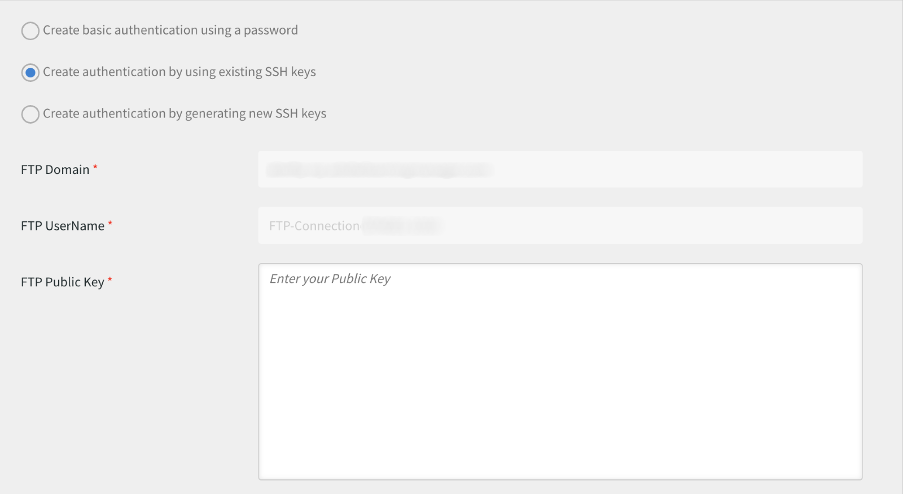

# Transição do Gerenciador de FTP do Adobe

O Adobe Learning Manager suporta um novo conector usando o protocolo SFTP da família AWS Transfer.

Você pode substituir qualquer cliente de FTP de código aberto pelo Gerenciador de FTP do Adobe.

Alguns clientes FTP recomendados pela AWS estão listados [aqui](https://docs.aws.amazon.com/transfer/latest/userguide/transfer-file.html):

* FileZilla (Windows, macOS e Linux)
* OpenSSH (macOS e Linux) - Observação: este cliente só funciona com servidores habilitados para o protocolo SFTP.
* WinSCP (somente Microsoft para Windows)
* Cyberduck (Windows, macOS e Linux)

## Configurar o conector FTP baseado no AWS

Você deve configurar o novo conector FTP baseado no AWS no administrador de integração.

*Selecione a opção FTP*

Depois de se conectar, você pode ver a página Detalhes da conexão.

*Exibir a página Detalhes da conexão*

Há três opções de autenticação:

### Criar autenticação gerando novas chaves SSH

Se quiser gerar a chave SSH no próprio sistema, você pode fazer isso. Clique em Gerar chave SSH.

A chave privada é baixada para o seu computador e a chave pública é salva em nossos serviços. Depois que você clica em Conectar, o usuário do FTP é criado usando as chaves pública e privada como autenticação.

Você criou uma conexão FTP.

### Criar autenticação usando chaves SSH existentes

Se você já tiver uma chave SSH, cole a chave pública na **[!UICONTROL Chave pública FTP]** e clique em Conectar.

*Colar as teclas*

### Criar autenticação básica usando uma senha

Esse é o mecanismo básico de autenticação. Selecione a primeira opção, **[!UICONTROL Criar autenticação básica usando uma senha]**. Insira a senha e clique em **[!UICONTROL Conectar]**.

Isso cria uma conexão.

## Novidades

### Configuração do cliente FTP

Configure a conexão em um cliente FTP (recomendado na seção anterior) com as chaves baixadas ou existentes ou a senha.

### Exportação de teste de amostra

* No cliente de FTP, altere o local do FTP do ExaVault para o novo local de FTP. O novo domínio é `http://almftp.adobelearningmanager.com/`.
* Você também deve incluir na lista de permissões o IP, `18.195.107.67`.
* Após a autenticação, você deve fazer upload e download de alguns arquivos de amostra para e do novo local FTP usando clientes FTP externos ou scripts de automação.
* Você deve transferir dados do local antigo para o novo.
* A política de retenção de dados do conector permanece a mesma. O ExaVault também suportou algumas políticas de retenção de dados, além da política oficial. Essas políticas de retenção de dados não estarão disponíveis para o novo conector. Verifique se o conector usa qualquer retenção de dados além das políticas oficialmente aceitas.

### O que acontece com os projetos de migração

| Status | Recomendação |
|---|---|
| Nova migração | Não é possível iniciar novas migrações do FTP antigo. Você deve usar o novo FTP para as novas migrações. Para obter mais suporte sobre isso, entre em contato com a Equipe de sucesso do cliente. |
| Migração em andamento | Criar um sprint: você pode continuar usando o FTP antigo, mas recomendamos usar o novo FTP. Entre em contato com a equipe de Sucesso do cliente para verificar se há algum sprint que não possa ser deslocado. |
| Migração fechada | Nenhuma ação. |

## Conectar-se ao Adobe Learning Manager usando o cliente FTP Filezilla

1. Conectar ao novo Conector FTP do ALM. Clique em Conectar.

   
   *Conectar ao novo Conector FTP do ALM*

1. Para conectar-se por meio da autenticação básica por senha, insira o nome do domínio, o nome do usuário do FTP e configure uma senha que corresponda aos critérios de validação de senha. Clique em Conectar. A nova conexão FTP será criada e poderá ser acessada por meio de qualquer cliente SFTP.

   
   *por meio da autenticação básica via senha*

1. Instale qualquer cliente SFTP, por exemplo, File Zilla. Inicie o File Zilla e clique em Open Site Manager no canto superior esquerdo.

   
   *Conectar-se por meio do cliente SFTP*

1. Clique em **[!UICONTROL Novo site]** para criar um novo site. Renomeie o site conforme necessário.

   
   *Criar um site*

1. Mapeie os detalhes da página de credenciais do conector.

   * Selecionar protocolo como &#39;SFTP - SSH File Transfer Protocol&#39;
   * Hospedar como domínio FTP
   * Tipo de logon como &#39;Solicitar senha&#39;
   * Usuário como nome de usuário do FTP

1. Clique em Conectar.

   
   *Insira as credenciais*

   >[!NOTE]
   >
   >Execute esta etapa no cliente File Zilla.

1. Digite a senha.

   (Opcional) Marque a caixa de seleção Lembrar senha para lembrar a senha.

   
   *Inserir senha*

   (Opcional) Selecione a opção **[!UICONTROL Sempre confiar neste host]** caixa de seleção para confiar no host.

1. Clique em OK.

   
   *Chave do host*

1. Verifique o status e o progresso da conexão no topo.

   A metade esquerda é o site local, e a metade direita é o site remoto.

   Para mover arquivos de local para remoto e vice-versa:

   * Você pode arrastar e soltar arquivos.
   * Clique duas vezes no arquivo.

   
   *Verificar o status da conexão*

Você pode alterar e atualizar o tipo de autenticação a qualquer momento.

Outras formas de autenticação são através de chaves SSH:

Cole sua chave pública na caixa de texto para usar as chaves SSH existentes. Clique em Conectar/Salvar.

Para gerar novas chaves SSH, clique no botão **[!UICONTROL Gerar chave SSH]** Botão &#39;. A chave privada será baixada. Clique em **[!UICONTROL Conectar/Salvar]**.

*Gerar chave SSH*

Mapeie os detalhes. Selecione o tipo de logon como Arquivo de chave. Selecione o arquivo de chave privada.

Clique em **[!UICONTROL Conectar]**.

## O que acontece depois que o ExaVault é descontinuado

Depois que o ExaVault for descontinuado, todos os projetos de migração existentes, que estiverem em andamento, serão migrados para o novo FTP como o local de origem. Em seguida, você deve configurar o novo conector FTP e continuar o processo de migração.

## Recommendations para migrar sprints

Ao criar um projeto de migração, a Adobe recomenda que você o crie usando o novo conector SFTP do AWS para evitar a migração do sprint do Exavault para o AWS em um estágio posterior.

Se uma migração estiver em andamento, feche o sprint atual que usa o Exavault como uma fonte de dados. Crie a conexão SFTP do AWS, teste a configuração e entre em contato com a equipe de Sucesso do cliente para mudar para a nova fonte de dados SFTP do AWS. Após alternar, crie um novo sprint no mesmo projeto de migração. As pastas do sprint são criadas no novo local, e você pode carregar os CSVs de migração para continuar a atividade.

**Casos em que um projeto de migração não pode ser fechado**

* O mapeamento da ID do curso é feito no projeto atual para cursos que são migrados de sistemas externos herdados para o Adobe Learning Manager. Você só pode fazer isso se quiser atualizar os mesmos cursos no mesmo projeto. Depois de fechar o projeto, você não pode modificar seus detalhes.
* Para projetos de migração baseados em API, em que você não deve fechar um projeto.
