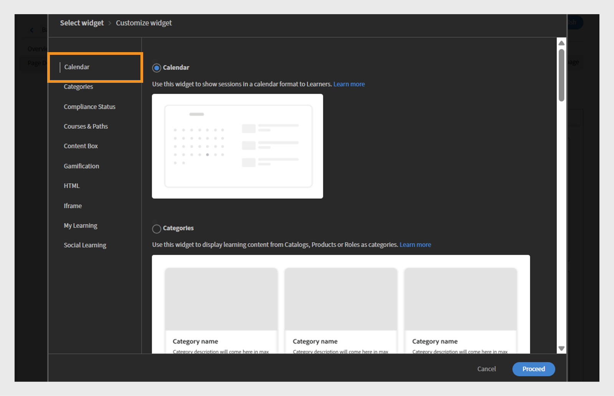

# Alterações futuras no Adobe Learning Manager

<!-- >>[!IMPORTANT]
>
>The Adobe Learning Manager October 2025 release is now live. View [What's New](/help/migrated/whats-new.md) for more information on the latest features and enhancements. This page will be updated with the new features and enhancements for the next release. Stay tuned for more updates. -->

## Visão geral da versão

A versão de abril de 2026 do Adobe Learning Manager apresenta um amplo conjunto de melhorias que tornam o aprendizado mais fluido para os alunos, mais fácil de gerenciar para administradores e mais flexível para professores, incluindo uma navegação mais clara no Fluidic Player com um rótulo “Próximo módulo” e um botão Sair dedicado, suporte a várias sessões simultâneas do Zoom para que as equipes possam executar aulas virtuais paralelas sem configuração manual e melhor visibilidade para cursos compartilhados mostrando o autor real em vez de “Autor externo” em contas entre parceiros. A atualização também expõe as datas de expiração do objeto de aprendizado nas APIs do aluno para ajudar os LXPs a destacar treinamentos com reconhecimento de tempo, adiciona suporte multilíngue a ajudas de tarefa para que uma ajuda de tarefa possa carregar todas as versões de idioma e permite que os administradores restrinjam quando os módulos podem ser iniciados definindo janelas de início/fim úteis para coortes ou programas com tempo determinado.

Os sistemas externos que usam a LTI agora podem definir o idioma do reprodutor automaticamente, fornecendo aos alunos uma experiência de idioma consistente em todas as plataformas. Várias atualizações de listas de verificação também são entregues, incluindo pontuação ponderada, texto de pergunta multilíngue e comentários opcionais de revisores para obter feedback mais rico. O ALM agora captura várias tentativas de quiz controladas no conteúdo do SCORM e relata cada tentativa de maneira limpa nos relatórios L2. Os professores também podem gerar códigos QR para inscrição instantânea e controle de presença durante as sessões presenciais, e o conteúdo do Captivate é reproduzido de forma mais limpa com um sumário unificado, marcas de conclusão no nível do slide e exportações de notas confiáveis. Em geral, a versão tem como foco a clareza, a consistência, a prontidão multilíngue, a eficiência do administrador e a prestação de treinamento mais flexível.

## Navegação no Fluidic Player - mostra o nome do próximo módulo

### Visão geral

Esse aprimoramento já estava incluído na versão de novembro de 2025 do Adobe Learning Manager.

A ação “Próximo” no reprodutor indica o que acontecerá quando clicado exibindo o nome do próximo módulo ou curso e sinalizando explicitamente quando o aluno estiver prestes a sair do reprodutor.

### Novidades

**Rótulo “Próximo Módulo: {ModuleName}” no reprodutor**

O ícone Próximo no Fluidic Player agora mostra o nome do próximo módulo no curso. Por exemplo, Próximo módulo: Lição 2 - Introdução.

Isso se aplica onde quer que o aluno esteja mudando de um módulo para o outro no mesmo curso.

**Limpar ação de saída no último módulo**

Quando o aluno está no último módulo de um curso, um novo botão de ação Sair é exibido, indicando que ao clicar nele, o reprodutor será fechado e ele retornará ao contexto do curso.

**Comportamento responsivo para conteúdo móvel e PDF**

Em viewports menores (por exemplo, largura de ~320 px), o rótulo Próximo pode ser encurtado ou oculto, mostrando apenas o ícone, para evitar a sobreposição com controles de PDF.

Para módulos de PDF, o reprodutor ajusta os controles para uma linha separada, de modo que os rótulos de navegação e os controles de PDF não interfiram uns nos outros.

**Atualização do administrador > Marca > Visualização do player**

A visualização do reprodutor em Administrador > Marca agora reflete o novo rótulo, por exemplo: Próximo módulo: Lição 2. Isso permite que os administradores vejam o comportamento de navegação atualizado.

### Principais benefícios

**Navegação mais clara para os alunos**

Os alunos não precisam mais adivinhar o que acontecerá quando selecionarem “Próximo”. O rótulo especifica claramente o que vem a seguir, seja um módulo ou um curso. Essa redução na ambiguidade ajuda a aliviar a hesitação e a confusão, especialmente em grandes públicos de treinamento de clientes, onde muitos alunos podem não estar familiarizados com as interfaces LMS.

**Taxas mais altas de conclusão de curso**

Indicar claramente a próxima etapa (Próximo Módulo: {ModuleName}) e adicionar uma ação Sair distinta para o módulo final reduz a probabilidade de os alunos abandonarem o curso ou negligenciarem a última etapa de conclusão.

**Mais experiência previsível do usuário entre dispositivos**

Os rótulos atualizados se alinham com o comportamento Próximo ou Anterior e os ícones no desktop, tablet e dispositivo móvel. As restrições de layout são respeitadas em todos os dispositivos e fluxos de PDF para que os controles permaneçam utilizáveis e acessíveis.

Isso é particularmente importante para implementações sem periféricos nas quais o Fluidic Player é incorporado em uma experiência de aprendizado personalizada.

### Casos de uso

**Portais educacionais de clientes e parceiros (sem periféricos ou integrados ao AEM)**

Contas que utilizam o Adobe Learning Manager em uma configuração totalmente sem periféricos, direcionando os alunos de canais de marketing externos. Estes alunos:

* Geralmente consomem conteúdo de vídeo em sequências longas.

* Espere uma experiência no estilo de currículo, em que o sistema indique claramente o próximo episódio/módulo.

Nesses ambientes, o rótulo **Próximo Módulo:{ModuleName}**:

* Reforça a natureza guiada da jornada.

* Minimiza a queda entre os módulos.

**Cursos de conformidade e certificação com módulos solicitados**

Em cenários regulamentados ou de conformidade pesada:

* Os alunos devem concluir uma sequência estrita de módulos.

* Os autores geralmente desabilitam o sumário para evitar ignorar.

Aqui, mostrando o **Próximo Módulo:{ModuleName}**:

* Confirma aos alunos que estão seguindo a sequência correta.

* Torna menos provável que interpretem incorretamente a ação Próximo e saiam cedo.

**Caminhos de aprendizado em que os cursos se seguem**

Onde os Caminhos de aprendizado ou equivalentes agrupam vários cursos. Isso é útil ao criar sequências no estilo de currículo para grandes públicos.

**Consumo em dispositivos móveis**

Para alunos que usam principalmente telefones ou tablets:

* Os rótulos atualizados e o comportamento responsivo garantem que a navegação permaneça compreensível sem depender de ícones de fechamento minúsculos ou controles ocultos.

* Isso é importante para a educação do cliente, funcionários de shows ou alunos da linha de frente que podem acessar o conteúdo em sessões curtas em dispositivos móveis.

## Conector do Zoom - criar várias sessões simultâneas de Zoom

### Visão geral

A próxima atualização para o conector do Zoom melhorará significativamente a forma como a Adobe Learning Manager gerencia o VILT (Virtual Instructor-Led Training, treinamento virtual ministrado por instrutores). Antes, os usuários só podiam criar uma sessão de zoom por vez. Com a nova atualização, os administradores e autores podem agendar várias sessões do Zoom ao mesmo tempo usando a integração padrão.

### Novidades

#### Suporte para várias sessões simultâneas do Zoom por meio do conector

* O conector do Zoom agora permite que mais de uma sessão do VILT na mesma data/hora seja criada no ALM.

* A lógica de agendamento não impõe mais uma restrição “uma reunião do Zoom por vez” no nível de conta/conector.

* Os administradores e autores podem configurar sessões VILT sobrepostas (por exemplo, salas de aula regionais, controles paralelos ou sessões repetidas para diferentes grupos de parceiros) sem soluções alternativas.

#### As reuniões são criadas usando a identidade do professor no Zoom (não o superadministrador do Zoom)

Para suportar reuniões simultâneas com segurança, o conector foi atualizado para que:

* As reuniões do Zoom agora são criadas usando o endereço de email do professor, em vez do email do superadministrador do Zoom.

* A conta do Zoom de cada professor pode hospedar suas próprias reuniões em paralelo com outros professores, sujeito aos limites do plano de Zoom existente.

**Observação**:

* Ainda há suporte para apenas um professor por reunião.

* Se o e-mail de um professor for atualizado posteriormente no Adobe Learning Manager, as reuniões existentes permanecerão associadas ao e-mail original usado na criação.

#### Chega de colar manualmente o URL do Zoom em sessões simultâneas

Anteriormente, quando uma segunda ou terceira sessão do Zoom tinha que ser executada ao mesmo tempo:

* Os autores precisavam criar manualmente reuniões do Zoom fora do ALM e colar o URL de ingresso do Zoom na configuração da instância do curso.

* Isso era propenso a erros e não se beneficiava de recursos de conector como controle de participação.

Com o conector atualizado:

* Todas as sessões podem ser criadas diretamente na interface do usuário do ALM usando o conector do Zoom, mesmo que se sobreponham no tempo.

* O ciclo de vida da sessão (criação/cancelamento) continua a ser gerenciado centralmente por meio de integração.

### Principais benefícios

#### Melhor programação do VILT em escala

Agora, as organizações podem:

* Executar várias salas de aula virtuais baseadas em zoom ao mesmo tempo (por exemplo, trilhas paralelas em um cume virtual, coortes regionais ou sessões separadas de treinamento de parceiros).

* Evite gargalos que antes forçavam os administradores a serializar sessões ou confiar no gerenciamento manual do Zoom.

#### Redução da sobrecarga do administrador e do autor

O aprimoramento elimina:

* Criação manual de reuniões do Zoom fora do Adobe Learning Manager.

* Copie e cole os URLs do Zoom em cada instância do curso para sobrepor sessões.

* Risco de links configurados incorretamente, reuniões incorretas serem anexadas ou acompanhamento de participação perdida.

Administradores e autores podem gerenciar todas as sessões do Zoom no Adobe Learning Manager usando fluxos de trabalho familiares.

#### Melhor alinhamento com o provisionamento do Zoom e as funções de professor

Vinculando reuniões a contas individuais do Zoom do professor:

* Cada professor pode operar dentro de seus próprios limites de licença do Zoom.

* As organizações podem usar o modelo de provisionamento existente do Zoom (uma conta por treinador, por unidade de negócios etc.) enquanto ainda se integram totalmente ao Adobe Learning Manager.

* Isso evita o gargalo de ponto único de usar um usuário compartilhado do Zoom superadministrador para todas as sessões.

### Casos de uso

#### Eventos virtuais de múltiplas faixas e cumes

As equipes de treinamento do cliente que realizam grandes eventos (por exemplo, campos de inicialização de produtos, cúpulas de parceiros ou semanas de certificação) podem:

* Configure várias sessões baseadas no Zoom no mesmo intervalo de tempo (para faixas ou tópicos diferentes).

* Gerencie todos eles como módulos VILT nos cursos e caminhos de aprendizado do Adobe Learning Manager.

* Forneça aos alunos uma experiência unificada enquanto o conector lida com toda a criação de reuniões subjacentes no Zoom.

#### Treinamento global para parceiros e clientes

As organizações que treinam clientes e parceiros em todas as regiões podem:

* Execute sessões separadas do Zoom para EMEA, APAC e Américas em horários de sobreposição para corresponder ao horário de trabalho local.

* Evite forçar um único intervalo de tempo global ou configuração manual do Zoom para coortes adicionais.

#### Ativação interna

As equipes internas de capacitação (vendas, suporte etc.) podem:

* Agende sessões de integração paralelas ou breakouts baseados em funções (por exemplo, salas de zoom separadas para desenvolvedores, administradores e colaboradores do setor) no ALM.

* Manter todas as sessões no modelo VILT do ALM para fins de relatório e conformidade, em vez de fazer a transição parcialmente para reuniões não gerenciadas do Zoom.

## Mostrar o autor original dos cursos compartilhados em contas entre parceiros

### Visão geral

Quando um curso é compartilhado pelo catálogo para uma conta entre parceiros, o Adobe Learning Manager atualmente rotula o autor como “Autor externo” nas exibições do aluno, administrador e autor da conta de recebimento. Isso pode criar desafios para alunos e administradores, especialmente em grandes empresas, pois torna-se difícil identificar e entrar em contato com o proprietário de conteúdo apropriado quando surgem problemas ou dúvidas.

O aprimoramento garante que as informações do autor sejam preservadas e apresentadas em cursos compartilhados em contas entre parceiros, em vez de serem substituídas por um espaço reservado genérico.

### Novidades

Mostrar nome do autor real dos cursos compartilhados em contas entre parceiros

Para cursos compartilhados por meio de catálogos externos ou de mesmo nível, o nome do autor original da conta de origem agora é exibido na conta de recebimento em vez de “Autor externo”.

Aplica-se a:

* Aplicativo do aluno (cartão do curso ou detalhes do curso).

* Visualizações do administrador e do autor ao visualizar como aluno.

### Principais benefícios

#### Visibilidade direta do proprietário para conteúdo compartilhado

Os alunos e administradores em contas entre parceiros agora podem:

* Veja quem é o autor do curso, mesmo quando adquirido por meio de um catálogo compartilhado.

* Evite o rótulo genérico e inútil de “Autor externo”.

#### Experiência mais consistente com vários locatários e contas entre parceiros

Para clientes que executam cenários multilocatário ou corporativos estendidos:

* O mesmo curso aparece com identidade visual consistente do autor nas contas.

* A experiência do aluno está alinhada com as expectativas da conta principal (por exemplo, ver “Equipe do Instituto da Nuvem” em vez de “Autor externo”).

### Casos de uso

#### Grande empresa com contas entre parceiros

A empresa usa o ALM com:

* Uma conta principal que possui os cursos canônicos, e

* Contas entre parceiros que adquirem conteúdo via catálogos compartilhados.

Os alunos em contas entre parceiros precisam saber qual equipe corporativa criou um curso para encaminhar perguntas ou sugestões de melhorias corretamente.

Com este aprimoramento:

* Os cursos compartilhados agora exibem o nome correto do autor corporativo em contas entre parceiros.

* A carga de suporte interno da empresa é reduzida porque os alunos e os administradores locais sabem com quem entrar em contato.

#### Compartilhamento de várias unidades de negócios internas

Onde uma unidade de negócios organiza o aprendizado para outras:

* A unidade de negócios proprietária pode ser identificada no campo autor em todas as contas de consumo.

* Os administradores locais de L&amp;D podem ver rapidamente se um curso é mantido localmente ou por outra unidade de negócios e colaborar adequadamente.

## Expor a data de expiração do objeto de aprendizado (desativação automática) nas APIs do aluno

### Visão geral

Esse aprimoramento torna a data de desativação automática de um objeto de aprendizado (LO) disponível diretamente por meio das APIs do Adobe Learning Manager voltadas para o aluno. Quando um curso, caminho de aprendizado ou certificação é configurado com uma data de expiração ou de retirada automática, essas informações agora fazem parte dos dados do OA retornados pelos principais endpoints de aluno.

### Novidades

#### Novo campo de expiração/desativação automática nas APIs do OA do aluno

* As APIs do OA do aluno (por exemplo, os pontos de extremidade que retornam os objetos de aprendizado à experiência do aluno e às plataformas externas) agora incluem a data de expiração do OA (a data de desativação automática configurada para esse objeto de aprendizado).

* Este campo é retornado como parte da entidade de OA em respostas como:

   * Obter objeto de aprendizado (detalhes do OA).

   * Dados do OA usados para preencher a página inicial do aluno, o catálogo e os resultados de pesquisa.

* O campo complementa o completionDeadline existente que já existe no nível de instância; o novo campo é especificamente a data de desativação automática no nível de OA.

#### Disponibilidade em experiências do aluno apoiadas por pesquisa

Como a data de expiração é exposta como parte da representação do LO suportada pela pesquisa, ela agora está disponível em qualquer lugar que o ALM ou uma plataforma externa use:

* pesquisar APIs ou

* catálogos orientados por pesquisa e sugestões para criar visualizações do aluno.

**Escopo e exclusões**

O aprimoramento se aplica somente às APIs do aluno.

### Principais benefícios

#### Experiência do aluno sensível à expiração em LXPs personalizados

Para grandes e médias empresas, seu LXP personalizado agora pode obter informações de expiração do LO diretamente do ALM, permitindo que elas:

* Mostrar rótulos “Expirando em {date}” ou “Expirando em breve” nos cartões do curso e nas páginas de detalhes.

* Comunique-se com a urgência com mais clareza, para que os alunos priorizem o treinamento que está prestes a se aposentar.

Isso é particularmente importante para o treinamento de conformidade ou produtos com limite de tempo, em que os objetos de aprendizado são atualizados regularmente e as versões mais antigas são desativadas.

#### Melhor orientação para os alunos sobre quais treinamentos fazer agora

Ao expor a expiração do OA, a experiência do aluno pode:

* Destaque os cursos que ainda são válidos em comparação com os que serão desativados.

* Ajude os alunos a evitarem se inscrever em treinamentos que não estarão mais disponíveis ou serão válidos em um futuro próximo.

#### Coerência com os dados existentes relativos ao prazo de conclusão

Anteriormente, as APIs do aluno já apresentavam o prazo de conclusão no nível da instância, mas não a data de desativação automática no nível do OA. Com esta alteração:

Os seguintes aspectos de um treinamento estão disponíveis:

* “Quando devo terminar esta instância?” (prazo de conclusão).

* “Até quando esse treinamento é oferecido?” (desativação automática/data de expiração).

### Casos de uso

#### Uma empresa global com gerenciamento rigoroso do ciclo de vida do curso

Empresas que regularmente aposentam e substituem cursos (por exemplo, atualizações normativas, de produtos ou de metodologia) podem:

* Evite confusão do aluno sobre se um treinamento está sendo descontinuado.

* Orientar os alunos para as ofertas mais atuais e duradouras.

Seus portais personalizados e ferramentas internas agora podem ler a data de expiração diretamente do ALM por meio das APIs do aluno.

#### Academias externas de clientes ou parceiros

Para treinamento de clientes e parceiros, as páginas e portais de marketing geralmente enfatizam o treinamento atualizado.

Ter datas de expiração na API do LO permite que os criadores de experiência:

* Oculte ou retire o foco do conteúdo que está próximo da aposentadoria.

* Crie campanhas da “Última chance de concluir”.

## Suporte a vários idiomas para ajudas de tarefa

### Visão geral

O aprimoramento estende o modelo de localização do Adobe Learning Manager às ajudas de tarefa, permitindo que os autores anexem diferentes arquivos de conteúdo por idioma a uma única ajuda de tarefa. Em vez de criar ajudas de tarefa separadas para cada idioma, os autores agora podem gerenciar todas as versões localizadas como uma ajuda de tarefa lógica.

### Novidades

#### Upload de conteúdo específico do idioma para ajudas de tarefa

Os autores podem anexar arquivos diferentes por idioma suportado a uma única ajuda de tarefa, como cursos e outros OAs.

A experiência de criação/edição de ajuda de tarefa agora oferece suporte a:

* Selecionando um idioma.

* Fazer upload do arquivo específico de idioma para esse idioma na mesma entidade de ajuda de tarefa.

#### Manuseio consistente de idioma na interface do usuário do reprodutor e do aluno

O Fluidic Player foi atualizado para que, quando um aluno abrir uma ajuda de tarefa, a variante de conteúdo correspondente ao idioma do aluno seja exibida (quando disponível).

Administradores e autores podem visualizar ajudas de tarefa como objetos únicos com variantes de idioma, em vez de itens separados por idioma.

### Principais benefícios

#### Ajuda de tarefa única para todos os idiomas

Os autores podem evitar a criação de ajudas de tarefa separadas por idioma.

Todas as variantes de idioma da mesma ajuda de tarefa (por exemplo, um procedimento, SOP, PDF de lista de verificação ou guia de referência) podem ser gerenciadas em um só lugar.

#### Melhor experiência para alunos globais

Os alunos veem automaticamente a ajuda de tarefa em seu idioma preferido, o que significa que há:

* Menos confusão sobre qual versão abrir.

* Menos risco de acessar cópias fora do local ou desatualizadas.

Isso é particularmente útil em organizações multilíngues, onde o mesmo processo ou documentação do produto deve estar disponível em vários idiomas.

### Casos de uso

#### Implantação global do conteúdo de referência

Uma empresa precisa fornecer ajudas de tarefa em vários idiomas aos alunos em todo o mundo, como:

* Fichas de referência do produto.

* Listas de verificação do processo.

* Livros de reprodução de suporte

Em vez de criar ajudas de tarefa separadas, como “Início rápido do produto - EN”, “Início rápido do produto - DE”, “Início rápido do produto - JP”, etc., eles podem criar uma ajuda de tarefa, anexar arquivos localizados para cada idioma e permitir que o ALM forneça a versão correta para cada aluno com base nas configurações de idioma.

#### Documentação voltada para o cliente ou parceiro em vários mercados

Para academias de clientes e parceiros, as ajudas de tarefa podem incluir:

* Folhas de produto

* Guias de integração

* Suporte a fluxos de trabalho

Com ajudas de tarefa em vários idiomas:

* Cada parceiro vê a versão localizada sem ser forçado a escolher entre as entradas específicas do idioma.

* As equipes de marketing e capacitação podem gerenciar uma ajuda de tarefa por tópico em todos os locais.

## Restringir quando os módulos podem ser iniciados

### Visão geral

O aprimoramento permite que autores e administradores no Adobe Learning Manager definam uma janela de tempo durante a qual os alunos têm permissão para iniciar um módulo. Fora da janela inicial/final configurada, o módulo permanece visível na estrutura do curso, mas os alunos não podem iniciá-lo.

Esse recurso é essencial para usuários que precisam ter um controle mais rígido sobre quando determinado conteúdo se torna disponível ou deve deixar de ser iniciado, por exemplo, em programas cronometrados, treinamento baseado em coorte ou exercícios com prazo apertado.

### Novidades

Os autores agora podem configurar, no nível do módulo em um curso, uma data/hora de início e uma data/hora de término que controlam quando os alunos têm permissão para iniciar esse módulo. Dentro dessa janela, o módulo se comporta como de costume; antes da hora de início ou após a hora de término, o aluno vê o módulo no resumo do curso, mas não pode iniciá-lo.

A configuração aparece na interface de usuário de criação do curso como controles de agendamento adicionais para tipos de módulo específicos, como conteúdo em ritmo individualizado, questionários ou atividades. Os administradores podem usar esses controles para criar módulos que abrem em fases ou para evitar inícios tardios em programas em que o conteúdo deve ser consumido em um período definido.

#### Principais benefícios

A principal vantagem é a capacidade de controlar quando os módulos estão acessíveis. As equipes de treinamento podem sincronizar a disponibilidade do módulo com eventos do mundo real, como lançamentos de novos produtos, prazos normativos e programas internos. Isso garante que os alunos concluam o conteúdo de pré-requisito antes que possam acessar os módulos posteriores.

Por exemplo, a coorte 1 pode acessar o módulo 2 somente na semana 2, enquanto o módulo 3 permanecerá bloqueado até a semana 3, eliminando a necessidade de ocultar e reexibir conteúdo manualmente ou criar versões separadas do curso.

Isso aprimora a experiência do aluno: em vez de enfrentar módulos que podem ser tecnicamente acessados, mas não devem estar nesse momento (ou já devem estar concluídos), os alunos veem uma estrutura do curso na qual os módulos que têm permissão para iniciar estão claramente alinhados com a programação pretendida.

#### Casos de uso

* **Programa de habilitação baseado em coorte**: neste programa, cada semana desbloqueia um novo módulo. O conteúdo da Semana 1 está disponível imediatamente, enquanto a Semana 2 está visível, mas não pode ser iniciada até uma data especificada. A semana 3 segue o mesmo processo de gating. Os alunos podem ver todo o caminho de aprendizado, mas o sistema controla quando eles podem realmente iniciar cada etapa.

* **Treinamento de produto ou campanha associado ao tempo**: as equipes de marketing ou de produto podem criar um módulo de treinamento que só deve ser acessado enquanto uma campanha estiver ativa ou quando uma versão específica de um produto ainda estiver disponível. Essa janela de início designada garante que os alunos não iniciem um módulo sobre uma versão de produto descontinuada após a hora de término especificada.

* **Ambientes de avaliação ou exame**: as organizações podem abrir um módulo (como um teste) para uma janela curta e bem definida (por exemplo, “você pode iniciar o exame a qualquer momento entre 9:00 e 12:00 em uma determinada data”). Os alunos não podem iniciar o exame fora dessa janela, que oferece suporte ao agendamento justo em fusos horários e coortes.

## Controle o idioma do player por meio de um parâmetro de LTI personalizado

### Visão geral

O aprimoramento permite que plataformas externas que usam a LTI (Learning Tools Interoperability, Interoperabilidade das ferramentas de aprendizado) especifiquem o idioma do conteúdo do Adobe Learning Manager no momento da inicialização. Em vez de depender do aluno para alterar o idioma no Fluidic Player, o consumidor de LTI pode enviar um código de idioma por meio de um parâmetro de LTI personalizado. O Adobe Learning Manager usará esse código para selecionar a variante de idioma apropriada.

### Novidades

As plataformas externas que atuam como consumidores de LTI agora podem passar um parâmetro de idioma personalizado (e configurações do player relacionadas) ao iniciar o conteúdo do ALM. O ALM lê esse parâmetro e:

* Define o idioma do reprodutor de acordo.

* Inicia a variante de idioma correspondente do módulo quando o conteúdo multilíngue está configurado.

Isso significa que um aluno pela primeira vez, que seleciona francês na plataforma externa, verá o reprodutor e o módulo do ALM serem lançados diretamente em francês, sem precisar ajustar nada dentro do ALM.

O aprimoramento também acomoda cenários em que a plataforma externa trata o ALM como um reprodutor de conteúdo independente. Por exemplo, ele permite ocultar elementos de navegação e o sumário, enviando parâmetros personalizados adicionais para ajustar determinadas configurações de interface do usuário. Essas configurações funcionam em conjunto com o parâmetro de idioma, permitindo que a plataforma externa forneça uma experiência de marca tranquila e, ao mesmo tempo, use o ALM para reprodução e rastreamento.

### Principais benefícios

* **Experiência de idioma consistente entre sistemas**: quando um aluno seleciona um idioma no portal externo, essa escolha é refletida imediatamente no ALM. Isso garante que os alunos não enfrentem nenhuma incompatibilidade entre o idioma do portal e do curso. Como resultado, eles não terão que procurar por uma mudança de idioma dentro do reprodutor.

* **Relatórios específicos de idioma**: em sua plataforma, a seleção de idioma é consistente com o ALM, o que melhora a precisão de suas análises e do rastreamento de aluno. Esse alinhamento também oferece suporte a configurações em que os próprios controles de idioma do ALM são desativados intencionalmente ou ocultados no Fluidic Player para cursos específicos. Nesses casos, a plataforma externa serve como uma única fonte de verdade para a linguagem.

### Casos de uso

* Um caso de uso significativo envolve grandes empresas que utilizam integrações baseadas em LTI. Os alunos se inscrevem primeiro e selecionam um idioma na plataforma. Em seguida, eles lançam sessões de treinamento do ALM por meio da LTI. Com esse aprimoramento, quando um aluno seleciona espanhol, o módulo ALM abre automaticamente em espanhol. Isso significa que os alunos não precisam ajustar as configurações de idioma no ALM. Além disso, os relatórios baseados em idioma permanecem consistentes com o que os alunos veem e experimentam no ALM.

* Outro aplicativo é o fornecimento de experiências de curso sem periféricos em um portal do cliente ou parceiro. Nesta configuração, o portal pode incorporar conteúdo do ALM usando um iframe, enquanto toda a navegação e experiência de usuário de idioma (UX) são gerenciadas fora do ALM. Utilizando parâmetros de LTI personalizados, o portal pode garantir que o player do ALM seja exibido no idioma correto e que quaisquer elementos desnecessários da interface do usuário (como o sumário e os botões de navegação) estejam ocultos. Isso permite que os alunos percebam uma única aplicação coesa em vez de uma coleção desarticulada de ferramentas.

* Isso é benéfico para organizações que fazem treinamento em grande escala em vários idiomas usando outro LMS ou plataforma de aprendizado. Eles podem padronizar o uso dessa plataforma para gerenciar perfis do aluno, selecionar localidades e apresentar catálogos. Enquanto isso, o ALM funciona como um mecanismo confiável de rastreamento e conteúdo, respeitando as preferências de idioma e as interações do usuário especificadas pelo sistema externo durante cada lançamento de LTI.

## Ponderação de pergunta da lista de verificação para avaliações do professor

### Visão geral

O aprimoramento introduz listas de verificação ponderadas, permitindo que professores e gerentes avaliem os alunos usando escalas graduais e pontuações totais, em vez de tratar cada pergunta da lista de verificação como igual. O objetivo é facilitar a criação de listas de verificação através da implementação de avaliações ponderadas de perguntas, o que permite refletir a importância relativa de diferentes ações ou habilidades em uma única lista de verificação.

### Novidades

As listas de verificação suportarão os seguintes tipos:

1. Sim/Não
O comportamento permanece o mesmo de hoje: cada pergunta é Sim/Não e os critérios de aprovação são baseados no número de respostas “Sim”.

2. Perguntas do mesmo peso

   * As perguntas são pontuadas em uma escala numérica (0-10 por padrão), onde:

      * Os valores máx./mín. na escala são personalizáveis no nível da lista de verificação.

      * A escala agora pode começar em 0 (a pontuação mínima anterior era 1).

   * Todas as perguntas compartilham a mesma pontuação máxima, portanto a lista de verificação se comporta como uma escala graduada uniforme para cada pergunta.

3. Perguntas de peso diferente

   * Cada pergunta tem sua própria pontuação máxima (peso).

   * Os critérios de aprovação dependem da porcentagem da pontuação total possível que o aluno obtém na lista de verificação (por exemplo, “aprovação se o aluno obtém ≥ 70% da pontuação total disponível”).

Para todos os tipos de lista de verificação:

* O **Revisor** (professor ou gerente) avalia o aluno de acordo com o tipo de lista de verificação configurado:

   * Selecionando Sim/Não.

   * Escolha pontuações na escala definida.

* O relatório **Lista de verificação** foi atualizado para incluir, para perguntas com peso diferente:

   * A pontuação máxima para cada pergunta.

   * A pontuação obtida por cada aluno para essa pergunta.

Isso permite a análise do desempenho geral e do desempenho específico de perguntas com base nos pesos desejados.

### Principais benefícios

* **Avaliações mais avançadas e mais realistas**: os professores podem refletir as prioridades do mundo real dando mais pontos para os comportamentos críticos e menos para os menores, enquanto ainda usam um fluxo de trabalho de lista de verificação adequado para tarefas observadas ou práticas.

* **Aprovação/reprovação total baseada em pontuação**: as avaliações podem ser baseadas na pontuação percentual geral, não apenas na quantidade de perguntas que ultrapassam um limite, alinhando-se mais estreitamente com esquemas típicos de competência ou classificação.

* **Relatórios mais eficientes**: os relatórios atualizados da lista de verificação expõem a pontuação máxima e a pontuação obtida por pergunta, permitindo que os proprietários do programa e as equipes de qualidade identifiquem pontos fracos específicos e refinem o treinamento ou a orientação de avaliação.

### Casos de uso

* **Avaliações de habilidades corporativas**: os engenheiros são avaliados por meio de listas de verificação práticas e baseadas em cenários, nas quais determinadas etapas de diagnóstico ou comunicação devem ter mais peso do que etapas cosméticas ou de baixo risco. Perguntas ponderadas e critérios de aprovação de pontuação total tornam essas avaliações mais confiáveis e preditivas do desempenho real.

* **Observações de segurança e conformidade**: no setor de saúde, manufatura ou serviço de campo, as etapas críticas de segurança podem receber pontuações máximas mais altas, garantindo que a ausência de uma ação crítica de segurança tenha um impacto maior na pontuação total do que a ausência de uma etapa processual menor.

* **Treinamento e calibração**: com o máximo de pontuações alcançadas por pergunta no relatório, os gerentes podem ver exatamente onde os alunos têm um desempenho inferior e calibrar os professores sobre como pontuar de forma consistente.

## Suporte a vários idiomas para perguntas da lista de verificação

### Visão geral

O aprimoramento introduz suporte multilíngue para perguntas de listas de verificação, permitindo que os revisores avaliem e pontuem listas de verificação em seu idioma preferido. Esse recurso é particularmente útil em regiões multilíngues e implantações globais, pois permite que os autores criem perguntas de listas de verificação localizadas para cada idioma de conteúdo compatível, mantendo um único módulo de lista de verificação e um processo de avaliação consistente.

No Adobe Learning Manager hoje:

* Todos os módulos voltados para o aluno (SCORM, PDF, HTML etc.) podem ser fornecidos em vários idiomas de conteúdo, permitindo que os alunos escolham o idioma de sua preferência.

* Em um módulo de lista de verificação, os revisores (professores/gerentes) avaliam os alunos com base nas perguntas definidas nessa lista de verificação.

### Novidades

**Criação**

* Os autores agora podem adicionar perguntas da lista de verificação em todos os idiomas selecionados no nível do curso.

* Para cada lista de verificação:

   * Espera-se que o autor forneça um texto de pergunta equivalente em cada idioma de conteúdo no qual o curso existe.

   * Os autores são responsáveis por garantir que o significado de cada pergunta seja consistente em todos os idiomas.

**Experiência de revisão**

* Os revisores verão as perguntas da lista de verificação e a interface de avaliação em seu idioma de conteúdo selecionado.

* Quando uma pergunta é avaliada em um idioma:

   * A avaliação (pontuação, Sim/Não, status) é logicamente a mesma em todos os idiomas. É uma lista de verificação única com várias visualizações de idioma, não listas de verificação separadas por idioma.

**Relatórios**

O relatório Lista de verificação exibirá o texto da pergunta no idioma do conteúdo do usuário:

* Um administrador ou revisor que executa o relatório em cada idioma vê os nomes das perguntas localizadas para esse idioma.

* As respostas e pontuações subjacentes permanecem as mesmas; apenas os rótulos de pergunta são traduzidos.

### Principais benefícios

* **Melhor experiência do revisor**: os revisores podem trabalhar inteiramente em seu próprio idioma, lendo perguntas e gravando avaliações sem barreiras linguísticas.

* **Alinhamento regulamentar e de políticas**: em regiões com requisitos de igualdade de idioma (por exemplo, holandês/francês na Bélgica), as listas de verificação agora podem atender aos mesmos padrões de outros materiais de aprendizado, reduzindo o risco de conformidade.

* **Lógica de avaliação consistente**: enquanto o texto está localizado, a avaliação e a pontuação são compartilhadas em todos os idiomas, garantindo que os resultados sejam comparáveis e gerenciados centralmente.

### Casos de uso

* As franquias de vários países que operam em vários idiomas podem implantar um único curso e uma lista de verificação, fornecendo ao mesmo tempo experiências de revisor localizadas em cada território.

* Qualquer empresa global com professores locais (por exemplo, EMEA, LATAM, APAC) pode fazer com que os revisores trabalhem no idioma local enquanto compartilham o mesmo design e a mesma emissão de relatórios de lista de verificação global.

## Lista de verificação com recurso de comentários para revisor

### Visão geral

O aprimoramento introduz um recurso de comentários para avaliações de listas de verificação, permitindo que os revisores, como professores e gerentes, forneçam feedback qualitativo juntamente com as pontuações numéricas. Esse feedback pode ser exibido aos alunos quando necessário.

O objetivo é apoiar avaliações baseadas em listas de verificação, em que o feedback do mentor é tão crucial quanto o resultado numérico. Isso inclui destacar pontos fortes específicos, áreas para melhoria ou fornecer contexto para a pontuação fornecida.

Atualmente, os revisores podem:

* Avalie uma lista de verificação para cada aluno, pergunta por pergunta.

* Visualize os resultados e reavalie os alunos que falharam.

Em cenários do mundo real, como aviação, treinadores de campo avaliam agentes de chão de fábrica e funcionários do aeroporto. Da mesma forma, os instrutores e mentores em pequenas e médias empresas (PME) frequentemente usam listas de verificação para avaliar o desempenho do trabalho. No entanto, essas listas de verificação geralmente não incluem uma seção estruturada para capturar feedback narrativo relacionado à avaliação.

### Novidades

#### Opções de criação

Os autores podem configurar cada lista de verificação para:

* Ative ou desative a capacidade de comentários dos revisores.

* Decida se o nome do revisor deve ser exibido aos alunos junto com os comentários.

Isso permite que as organizações adaptem a visibilidade dos comentários aos seus requisitos de cultura e privacidade.

#### Experiência do revisor

Quando os comentários estiverem ativados:

* Os revisores (professores/gerentes) podem adicionar comentários opcionais ao avaliar uma lista de verificação.

* Com base nas configurações da lista de verificação, eles podem escolher se os comentários serão visíveis para os alunos.

Se reavaliarem um aluno, eles poderão atualizar ou alterar comentários para refletir a avaliação mais recente.

#### Relatórios e notificações

* O relatório Lista de verificação ganha uma nova coluna para comentários do revisor, capturando o comentário fornecido durante a avaliação.

* Os alunos recebem notificações (na plataforma e por e-mail) sempre que ocorre uma avaliação da lista de verificação. Essas notificações incluem:

   * O comentário e a

   * O nome do revisor, se estiverem configurados para serem visíveis.

Isso garante que o feedback não seja apenas armazenado, mas também exibido ativamente aos alunos.

### Principais benefícios

* **Comentários mais detalhados, semelhantes aos de treinadores**: as pontuações numéricas são complementadas com comentários contextuais, tornando as listas de verificação uma ferramenta mais eficaz para o treinamento, não apenas para a conformidade.

* **Rastreabilidade e auditabilidade**: as organizações obtêm um registro persistente de quem avaliou quem, quando e o que disseram, o que é importante em ambientes regulamentados e funções de alto risco.

* **Melhor envolvimento do aluno**: os alunos recebem orientações claras vinculadas a avaliações específicas, o que melhora sua compreensão das expectativas e etapas subsequentes.

### Casos de uso

* As organizações com ambientes regulamentados podem usar comentários para documentar o julgamento clínico ou feedback de procedimentos para a equipe que está sendo observada em campo.

* As organizações de aviação e de assistência em escala podem anexar notas detalhadas sobre o desempenho operacional, as práticas de segurança e o comportamento voltado para o cliente, transformando uma lista de verificação em uma ferramenta estruturada de apontamento.

* Em mentoreamento e avaliação do SME, os professores podem capturar observações sutis que não se encaixam somente em uma pontuação, por exemplo, “lidaram bem com o escalonamento, mas precisam melhorar o gerenciamento de tempo” ou “fluxo de solução de problemas excelente; perdeu uma etapa de documentação”.

## Várias tentativas em nível de conteúdo e relatórios de questionário

### Visão geral

Atualmente, o ALM oferece suporte a várias tentativas no nível do LMS por meio do recurso MQA (Multiple Quiz Attempt):

* Os autores podem configurar tentativas no nível do curso (aplicadas a todos os módulos participantes do curso) ou no nível do módulo (por módulo do questionário).

* As tentativas podem ser:

   * Um número específico (por exemplo, 3 tentativas) ou

   * Tentativas infinitas, controladas no nível do LMS.

* Quando um aluno consome um módulo por meio do Fluidic Player e, em seguida, fecha o player ou conclui o módulo, essa sessão é tratada como uma única tentativa de LMS.

* Cada tentativa de LMS é capturada no relatório do questionário L2 como uma nova linha.

No entanto, se o próprio arquivo de conteúdo (por exemplo, um quiz Articular SCORM) implementar sua própria lógica de várias tentativas, o relatório do quiz L2 do ALM não distingue ou acompanha atualmente essas tentativas internas corretamente.

Esse aprimoramento apresenta o controle de várias tentativas em nível de conteúdo para questionários, permitindo que o Adobe Learning Manager capture com precisão cada tentativa dentro do próprio conteúdo no relatório do questionário L2. Ele foi projetado para situações em que a ferramenta de criação de conteúdo (como Articular SCORM) gerencia as tentativas de questionário de maneira independente. Com esse recurso, as tentativas serão refletidas corretamente no relatório do ALM, sem depender das configurações de Tentativas Múltiplas de questionário (MQA) no nível do LMS.

### Novidades

#### Sinalizador de autor para tentativas no nível de conteúdo

* Ao carregar conteúdo na Biblioteca de conteúdo, os autores agora podem indicar que um arquivo de conteúdo específico tem várias tentativas incorporadas.

* Esta é uma configuração por conteúdo que informa ao ALM para tratar as tentativas definidas dentro do conteúdo como a fonte da verdade.

#### Comportamento do curso/módulo

Quando esse conteúdo é usado em um curso:

* O módulo derivará suas tentativas do conteúdo, não do MQA do LMS.

* Os alunos verão apenas uma tentativa de nível LMS:

   * A visão geral do curso e a visualização do módulo não exibirão um botão de “nova tentativa” do LMS para esse módulo.

   * A manipulação de tentativas (por exemplo, tentativas repetidas dentro do quiz) é regida pelo próprio conteúdo.

#### Relatórios

O relatório do quiz L2 será atualizado para tratar cada tentativa de nível de conteúdo como uma linha de tentativa separada:

* Cada tentativa de quiz interna configurada no conteúdo aparece como sua própria linha no relatório de quiz L2, da mesma forma que as tentativas de nível LMS são representadas hoje.

* O formato de cada linha permanece o mesmo das linhas de várias tentativas existentes no relatório L2 (mesmas colunas, estrutura e semântica).

* Isso proporciona uma experiência consistente de emissão de relatórios:

   * Independentemente de as tentativas serem controladas por MQA do LMS ou pelo conteúdo, o relatório do quiz L2 mostra uma linha por tentativa.

#### Principais benefícios

* Histórico preciso de tentativas para questionários SCORM nos quais as tentativas são controladas internamente por ferramentas como Articular, sem forçar a configuração de MQA no nível do LMS pela parte superior.

* Experiência do aluno mais limpa: para tentativas controladas por conteúdo, os alunos veem um único slot no nível do LMS e não precisam interagir com os controles de nova tentativa do LMS. Todas as novas tentativas são tratadas na interface do questionário que já conhecem.

* Arquitetura flexível: os usuários podem escolher se o ALM MQA ou as tentativas no nível do conteúdo devem determinar o comportamento por módulo, dependendo de como o conteúdo foi criado e de como preferem gerenciar as tentativas.

* Modelo de relatório consistente: os consumidores downstream do relatório do quiz L2 podem tratar cada linha como “uma tentativa”, independentemente de onde a lógica da tentativa se origina.

#### Casos de uso

* As organizações que usam o recurso Articular SCORM podem manter uma lógica de questionário independente no pacote SCORM e, ao mesmo tempo, obter relatórios precisos em nível de tentativa no ALM sem a configuração adicional do LMS.

* As organizações que usam conteúdo SCORM fornecido pelo fornecedor podem evitar a necessidade de modificar ou implementar lógica adicional de tentativa e repetição com MQA no nível do LMS.

## Códigos QR do professor para inscrição de instância e participação na sessão

### Visão geral

Esse aprimoramento adiciona a capacidade de os professores gerarem eles mesmos códigos QR para:

* Inscrição na instância do curso,

* Participação na sessão ou

* Inscrição + participação conjunta

no nível da sessão. Ele foi projetado para situações em que os alunos entram em uma sala de aula física ou híbrida e exigem uma opção rápida de autoatendimento para se inscrever e registrar sua participação usando um código QR.

### Novidades

#### Códigos QR gerados pelo professor

* Os professores poderão gerar códigos QR no nível da sessão para:

   * Inscrever-se na instância: os alunos digitalizam para se inscrever na instância que inclui a sessão atual.

   * Marcar participação na sessão: os alunos verificam durante/após a sessão para registrar a participação nessa sessão específica.

   * Inscrever-se na instância + marcar presença na sessão : um QR combinado para entradas que ainda não estão inscritas e precisam que sua participação seja marcada em uma etapa.

* Os professores podem exportar os códigos QR de que precisam com base no cenário (inscrição, participação ou ambos).

#### Empacotamento do código QR

O PDF de QR Code exportado incluirá:

* Nome do curso

* Nome da instância

* Nome da sessão

Isso facilita para professores e coordenadores identificarem e imprimirem o código QR correto para cada sessão.

### Principais benefícios

* **Autonomia do professor**: os professores não precisam mais esperar que os administradores criem códigos QR. Eles podem gerá-los diretamente para cada sessão, melhorando a agilidade e reduzindo a sobrecarga de coordenação.

* **Logística de sala de aula aprimorada**: para públicos visitantes ou participantes do local (como funcionários de campo, funcionários de chão-de-fábrica ou participantes externos), os professores podem gerenciar a inscrição e a participação no local usando códigos QR.

* **Carga de trabalho de administrador reduzida**: as equipes de administração podem se concentrar na configuração e governança em vez de lidar com solicitações de geração de código QR de rotina para cada sessão.

### Casos de uso

* As organizações que executam grandes volumes de sessões no local (por exemplo, treinamento de produtos para profissionais) podem capacitar os professores a imprimir códigos QR específicos da sessão que se inscrevem e marcam a participação com uma digitalização.

* No varejo, na fabricação e no treinamento de saúde, onde os alunos frequentemente participam das sessões diretamente do piso ou sem pré-inscrição, um código QR “Inscrever-se + Participar” pode ser colocado na porta. Isso permite que os alunos façam o autoatendimento da sua inscrição e da presença por meio de seus telefones.

* Os eventos de treinamento para parceiros ou clientes permitem que o instrutor no local se adapte facilmente a alterações na sala, sessões adicionais ou participantes extras sem precisar consultar o administrador para obter novos códigos QR.

## Melhorias no reprodutor de Captivate e ALM

### Visão geral

Esse aprimoramento melhora a experiência de reproduzir conteúdo do Adobe Captivate no reprodutor Adobe Learning Manager (ALM), especialmente após as recentes alterações na arquitetura Captivate. O objetivo é permitir que os alunos se envolvam com módulos de Captivate de forma nativa no ALM, garantindo que a navegação, o rastreamento da conclusão e a anotação sejam claras, consistentes e confiáveis.

### Novidades

#### Experiência de sumário unificado

* Somente o sumário do ALM será exibido no lado esquerdo do reprodutor.

* O sumário de Captivate own será ocultado quando o módulo for reproduzido no ALM.

* Isso elimina a duplicação, garante uma única fonte confiável para a navegação e libera espaço na tela.

#### Feedback de conclusão visual

* O sumário do ALM mostrará marcas de escala verdes (ou dicas visuais equivalentes) indicando conclusão no nível do slide.

* À medida que os alunos avançam pelos slides de Captivate, o sumário do ALM reflete quais slides foram concluídos, alinhando-se às expectativas do aluno para os participantes modernos do curso.

#### Controles de progresso contextuais

* Os controles do reprodutor se adaptarão com base no tipo de slide:

   * Para slides de vídeo:

      * Mostrar uma barra de progresso de tempo, refletindo a reprodução do vídeo.

* Para slides que não são de vídeo:

   * Exibir controles de navegação do slide (próximo slide/slide anterior etc.) em vez de uma barra de tempo não funcional.

      * Isso evita mostrar controles irrelevantes ou que não funcionem em determinados tipos de slide.

#### Navegação simplificada

* A barra de navegação separada do módulo (ALM) e a barra de navegação do curso serão mescladas em uma única barra intuitiva.

* Esta navegação unificada:

   * Distingue claramente a movimentação pelo módulo do Captivate em comparação à movimentação de volta para o nível do curso/módulo.

   * Reduz a confusão causada por várias barras com fins de sobreposição.

#### Vinculação de notas confiáveis

* As anotações serão vinculadas aos números dos slides em vez de carimbos de data e hora.

* Esta alteração:

   * Corrige falhas de exportação causadas por carimbos de data/hora ausentes ou incorretos.

   * Garante que as anotações possam ser exportadas consistentemente como PDF, com um mapeamento confiável entre as anotações e o contexto do slide ao qual pertencem.

### Principais benefícios

* Experiência mais limpa e com um único reprodutor: os alunos interagem com um sumário e um modelo de navegação, reduzindo a confusão e a carga cognitiva.

* Indicações precisas de conclusão e progresso: os tiques no nível do slide e os controles contextuais ajudam os alunos a entender onde estão e o que resta.

* Anotações e exportações mais robustas: ao vincular anotações aos slides em vez de carimbos de data e hora frágeis, os usuários recuperam um fluxo de trabalho confiável de anotações para PDF, mesmo com conteúdo de Captivate baseado em slides.

* Fluxo de trabalho de autor preservado: os autores mantêm a simplicidade da publicação direta de Captivate no ALM, enquanto os alunos obtêm uma experiência de reprodução moderna e integrada sem ônus de criação adicionais.

### Casos de uso

* Os programas de ativação que dependem do Captivate para simulações interativas podem implantar conteúdo no ALM, garantindo que a navegação, o rastreamento da conclusão e as notas funcionem de forma consistente para os alunos.

* As organizações que usam o Captivate como ferramenta de criação de conteúdo principal podem manter a publicação em um clique e evitar a confusão de sumários duplos e controles não funcionais para os alunos.

* As organizações que dependem de notas exportadas do conteúdo de Captivate no ALM (para treinamento, conformidade ou registros) podem acessar o seguinte:

   * As observações são vinculadas corretamente aos slides.

   * Os PDF são gerados conforme esperado.

## Alterações nas transcrições do aluno

### Visão geral

A Adobe Learning Manager revisou como calcula o tempo de aprendizado nas transcrições do aluno com sua versão de abril de 2026. Anteriormente, a lógica do relatório poderia levar a tempos imprecisos se os alunos deixassem o reprodutor aberto sem se envolver com o conteúdo, causando discrepâncias. O novo método agora controla o tempo ativo com base no envolvimento do usuário, especificamente quando a guia está em foco e quando há atividade do usuário. Essa alteração resulta em dados mais precisos.

Essa atualização aprimora relatórios e painéis, ajudando os administradores a garantir melhor conformidade e acompanhar o progresso do aluno. Após o lançamento, revise suas transcrições do aluno para ver esses aprimoramentos.

O método de cálculo atualizado se concentra no envolvimento real, como foco de guia ativo e interações recentes do usuário, melhorando assim a precisão dos relatórios de tempo nas seguintes áreas:

* Transcrições do aluno (UI)
* Métricas do Painel de Administração
* Relatórios de inscrição no curso
* APIs e conectores

### O que mudou

A coluna **Tempo gasto no aprendizado** em transcrições do aluno agora usa lógica aprimorada para calcular o tempo com mais precisão. Em vez de simplesmente rastrear os tempos de abertura/fechamento do player, o sistema agora distingue entre os períodos ativos e ociosos com base no engajamento do usuário.

* **Tempo ativo**: o tempo quando o aluno está ativamente envolvido (por exemplo, na guia correta, executando ações como rolagem ou exibição de vídeo).
* **Tempo ocioso**: tempo quando o aluno não está envolvido (por exemplo, alternado por tabulação, nenhuma atividade por mais de 10 minutos), que é excluído do total.

Isso se aplica à maioria dos tipos de módulo, com exceções para módulos SCORM, Captivate e XAPI, que retêm a lógica original.

### Como funciona

O novo cálculo varia de acordo com o tipo de módulo:

* **Módulos de vídeo e áudio**: ativos quando o conteúdo está sendo reproduzido, mesmo que o aluno alterne para outra guia. O foco da guia não é necessário para controlar o tempo de reprodução.
* **Módulos estáticos (PDF, PPT, Excel etc.)**: ativos se estiverem na guia e executando atividades (movimento do mouse, rolagem, clique, entrada do teclado) nos últimos 10 minutos. Se não houver atividade por 10 minutos, ele alternará para ocioso.
* **SCORM e Captivate** mantêm a lógica de abertura/fechamento original.
* A **xAPI** agora usa a detecção de tempo ativo baseada em tabulação, em que o tempo é contado apenas quando a tabulação está ativa. Observe que o conteúdo AICC **não é** suportado.
* **HTML, LTI e outro conteúdo**: pode variar; verifique as transcrições do aluno para obter precisão.

O tempo ocioso é subtraído, garantindo que apenas o tempo de envolvimento real seja relatado.

### Tabela de resumo

| **Tipo de módulo** | **Tempo ativo (contado)** | **Tempo ocioso (excluído)** |
| --- | --- | --- |
| **Vídeo/Áudio** | Tempo de reprodução | Não iniciado; finalizado; pausado **\>10 min** |
| **Estático (PDF/PPT/DOC)** | Atividade **e** ativa da guia nos últimos **10 min** | Nenhuma atividade **\>10 min**; guia inativa |
| **SCORM** | Tempo relatado pelo tempo de execução do conteúdo | Ocioso não pode ser detectado |
| **Captivate** | Temporização baseada em slide | Ocioso não pode ser detectado |
| **instrução** | Guia ativa | Guia inativa |
| **HTML** | Tempo de abertura do reprodutor com a guia ativa | Guia inativa |
| **Produtor/consumidor de LTI** | Se o conteúdo de LTI for reproduzido no player do ALM (ou seja, o ALM está consumindo conteúdo de LTI hospedado em outro LMS que atua como o Produtor), essa lógica de tempo gasto será aplicada.<br><br>No entanto, se o conteúdo for reproduzido fora do LMS (ou seja, o conteúdo estiver hospedado no ALM, o ALM será o Produtor, mas a reprodução acontecerá em um player externo), essa parte da lógica de cálculo de tempo não será aplicada.  <br>**Observação**: o consumidor de LTI não é compatível com o Adobe Learning Manager. | Guia inativa |

**Observação**:

* **Revisitas e sessões paralelas**: conte como ativo quando as condições acima forem atendidas.
* **Todos os dispositivos, navegadores e idiomas**: incluído; o uso de dispositivos móveis offline é adicionado após a sincronização.

### Benefícios do novo cálculo

* **Relatórios precisos**: elimina os tempos excessivos de jogadores autônomos, fornecendo durações de aprendizado realistas.
* **Melhor conformidade**: oferece suporte a controle preciso para treinamento obrigatório (por exemplo, requisito mensal de 5 horas de uma empresa).
* **Painéis aprimorados**: os gráficos de atividade do usuário e os relatórios de tempo gasto agora refletem o engajamento real.
* **Insights do aluno**: ajuda os administradores a identificarem o progresso genuíno e abordarem alunos desconectados.

### Impacto dos relatórios e das análises

* **Transcrições do aluno:** o “Tempo gasto no aprendizado” agora reflete o **envolvimento real**.
* **Painel de Administração:** as métricas que incluem tempo (por exemplo, blocos de “tempo gasto”, tendências) mostrarão valores **mais baixos, mas mais realistas** em cenários em que o tempo ocioso anteriormente inflacionou os resultados.
* **Relatórios de inscrição do curso:** os campos relacionados ao tempo adotam o **novo cálculo** após o lançamento.
* **Observação de comparabilidade:** como os dados históricos não são recalculados, as análises de séries de tempo que abrangem a data de lançamento podem mostrar uma **alteração de etapa**. Considere anotação ou segmentação por data nas ferramentas de análise.

### API e conectores

* **Não há alterações de esquema** em pontos de extremidade/campos existentes que relatam o tempo gasto.
* **A semântica do campo** foi atualizada para refletir o _cálculo de tempo ativo_ para as sessões **após** a inicialização do recurso.
* **Conectores e exportações** que consomem campos gastos com tempo receberão automaticamente os valores atualizados daqui para frente.

### Compatibilidade retroativa e migração de dados

* **Sessões históricas:** não recalculadas.
* **Novas sessões:** use o **novo** cálculo de tempo ativo.
* **Períodos mistos:** para auditorias ou relatórios longitudinais, segmente por **pré/pós-lançamento** para evitar interpretações incorretas.

### Limitações conhecidas

* O **Conteúdo interativo** (SCORM/Captivate) continua a depender do tempo fornecido pelo conteúdo; a detecção de ociosidade no conteúdo não está disponível.
* O **conteúdo baseado em Iframe** (HTML/xAPI) limita a detecção de interações de granulação fina; o foco de tabulação é usado em seu lugar.

### Perguntas frequentes

**Esta atualização altera registros históricos?**

Não. A alteração se aplica somente a sessões após a inicialização do recurso.

**Como verifico as alterações?**

Verifique as transcrições do aluno para módulos recentes; compare os tempos com as durações esperadas.

**Isso afeta todas as contas?**

Sim, é uma atualização global para todas as contas da Adobe Learning Manager.

**Os alunos precisam realizar uma ação?**

Não. A alteração é automática e transparente para os alunos.

**E se os alunos deixarem o conteúdo aberto?**

O tempo ocioso agora está excluído, evitando a geração de relatórios em excesso.

**As sessões de vídeo/áudio são pausadas automaticamente quando a guia está inativa?**

Não. O comportamento de reprodução não foi alterado. O tempo é excluído quando pausado > 10 minutos ou quando não estiver jogando ativamente.

**A atividade móvel offline será refletida?**

Sim O uso offline é incluído quando o dispositivo é sincronizado.

**O que devo fazer se meus painéis agora mostrarem médias mais baixas?**

Isso é esperado onde o tempo ocioso teve resultados anteriormente inflados. Anote os painéis e ajuste os destinos conforme necessário.

**Existem pré-requisitos?**

Nenhuma; a alteração é automática.


<!-- See this [article](/help/migrated/administrators/feature-summary/reports/learner-transcripts.md) for more information on Learner Transcript report.

The downloaded Learner Transcript report contains the new column: Mark Completed Date (UTC TimeZone).


_Learner Transcript report displays a new column in yellow highlighting individual completion dates for each user_

## Enhanced User Report with extended data fields

**Overview**

The User Report now includes additional fields to improve user tracking and organizational mapping.

**What's new**

* Internal User ID column: Provides unique internal identifiers for smooth user tracking across different systems and API endpoints.
* Manager Email column: Includes direct manager contact information for organizational hierarchy tracking.

**Key benefits**

* Simplified user identification and eliminates issues when mapping users across multiple systems.
* Supports downstream user management workflows through integration capabilities.
* Improved organizational mapping and better understanding of reporting relationships.
* Maintains organizational boundaries and prevents accidental cross-communication.

### User Report with the new column

See this [article](/help/migrated/administrators/feature-summary/reports.md#user-activity-dashboards) to learn how to download the User Report. 

The downloaded User Report file contains the new columns: Internal User ID and Manager Email.

 
_User Reports highlighting internal user IDs and manager email addresses to streamline user management_

## FTP User Report with Internal User ID support

**Overview**

The FTP-based User Report now includes Internal User ID support, providing a unified approach to data export and integration for headless implementations.

**What's new**

* User Reports are now available through [Custom FTP](/help/migrated/integration-admin/feature-summary/connectors.md#custom-ftp) alongside existing reports (Gamification Transcripts, Learner Transcripts, Trainings Report).
* The Internal User ID column is now consistent across all export methods (FTP, Jobs API, and UI).

**Key benefits**

* Simplified data management with a single source for all necessary reports.
* Better data consistency by ensuring uniform user identification across reporting periods.
* Automated workflow support by enabling bulk operations and analytics workflows with consistent identifiers.
The User Report downloaded from FTP folder contains the new column, Internal User ID.

## Include suspended users in Learner Transcripts

**Overview**

Organizations can now include suspended users (those with disabled external profiles) in Learner Transcripts, ensuring comprehensive historical learning data retention.

**What's new**

* Configurable suspended user visibility with an account-level flag to include suspended users in the Learner Transcripts.
* Historical data retention even after deactivation of suspended external profiles.

**Implementation requirements**

* Contact your Customer Success Manager (CSM) to enable the account-level flag.

>[!NOTE]
>
>This flag is disabled by default for existing accounts and must be explicitly requested for new accounts.

## Scoped announcement permissions for custom administrators

**Overview**

Custom administrators can now create announcements, but only for their assigned user groups or catalogs. This prevents unintended communication across organizational boundaries.

**What's new**

* Custom administrators can only create announcements for users within their assigned scope.
* Announcements can be scoped to specific user groups or catalogs.
* Full administrators maintain visibility and control over all announcements, including those created by scoped custom administrators.

**Key benefits**

* Targeted communication ensuring announcements reach only relevant audiences.
* Reduced information overload by preventing irrelevant notifications from reaching unintended users.
* Maintains organizational boundaries and prevents accidental cross-communication.

**Important considerations**

* If a custom administrator's scope changes, affected announcements display a warning icon and require individual scope resets.
* Each announcement must be updated individually when scope changes occur.
* The Notification Announcement report shows only learners within the custom administrator's assigned scope.

**Use cases**

* Franchise organizations where regional managers need to communicate only with their franchisees.
* Large organizations with regional or departmental administrators targeting announcements to their teams.

### Create announcement for the assigned scope

A custom administrator can create announcements limited to their assigned user groups and catalogs, ensuring messages reach the right audience and preventing unnecessary notifications.

To create an announcement for the assigned scope:

1. Log in to Adobe Learning Manager as an administrator.
2. Select **[!UICONTROL Announcement]** in the left navigation pane.
3. Select **[!UICONTROL Add]**. 
   
   
   _Announcements page in Adobe Learning Manager, where administrators can create and manage announcements for targeted user groups_

4. Select the **[!UICONTROL Announcement Type]** from the dropdown menu.
        a. **[!UICONTROL As Notification]**
        b. **[!UICONTROL As Masthead]**
        c. **[!UICONTROL As Recommendation]**
        d. **[!UICONTROL As Email]**
5. Select **[!UICONTROL As Masthead]**. 
6. Select the language and upload an image for the masthead. 
7. Optionally, add a URL for the action button. 
   
   
   _Create Announcement screen allowing administrators to set announcement type, upload attachments, and add action buttons_

    The assigned scope is pre-selected in the **[!UICONTROL Scope]** section and cannot be modified by administrators.
    
    >[!NOTE]
    >
    >**[!UICONTROL For Notification]** and **[!UICONTROL Email]** announcements, they can include additional user groups and catalogs if these overlap with their assigned scope.

8. Select **[!UICONTROL Save]**.

Only learners within the custom administrator's scope will be able to view the announcement. See this [article](/help/migrated/administrators/feature-summary/announcements.md) to learn how to create multiple types of announcements. 

### Reset the scope by Custom administrators

Custom administrators can reset the scope of their published announcements if an administrator has changed the scope of them. Once the scope is reset, the updated scope will be applied to the announcement, and only learners within the new scope will be able to see the announcement.

To reset the scope:

1. Log in to Adobe Learning Manager as a custom administrator.
2. Select **[!UICONTROL Announcement]** in the left navigation pane.
3. Select **[!UICONTROL Published]** tab.
4. Select any announcement and then select setting icon. 
5. Select **[!UICONTROL Edit]**. 

   
   _Announcement screen showing the published announcements with edit, publish and other options_

6. Select **Reset**. 

   
   _Announcement showing a scope change notification, with an option for custom administrators to reset and update the scope selection to reflect new access permissions_

The scope will be updated, and only users within the updated scope will be able to view the announcement.

### Edit the announcement through administrator UI

Administrators can view announcements created by custom administrators through their interface. They have the ability to edit these announcements only by modifying or removing the assigned scope. If scope changes are not made, administrators cannot make further edits to the announcement.

To edit the announcement through administrator UI:

1. Log in to Adobe Learning Manager as an administrator.
2. Select **[!UICONTROL Announcement]** in the left navigation pane.
3. Select **[!UICONTROL Published]** tab.
4. Select any announcement and then select setting icon.
5. Select **[!UICONTROL Edit]**. 

   
   _Announcement screen showing the published announcements with edit, publish and other options_

6. Select **[!UICONTROL Remove]**. 
   
   
   _Announcement screen indicating that scope must be removed to allow administrators to edit announcements created for scoped user groups_

Administrator can edit the announcement after removing the scope.

## Tag users in social boards

**Overview**

Social learning boards now support user tagging functionality, enabling more targeted discussions and improved collaboration within learning communities. Learners can be tagged in social learning posts and comments through the learner app, APIs, and Adobe Learning Manager reference site.

**What's new**

* **@username tagging**: Users can tag other board members using the "@username" format.
* **Scope-restricted tagging**: Only users with access to the specific board can be tagged, ensuring privacy and relevance.
* **Multi-channel notifications**: Tagged users receive both in-app and email notifications with direct links to relevant posts or comments.

**Key features**

* Users outside the board's scope cannot be tagged, preventing unwanted notifications.
* If a tagged user is deleted from the system, their mention appears as "anonymous".
* Tagging user groups or "@all" is not permitted to prevent notification spam.

**Use cases**

* Healthcare professionals seeking input from specific colleagues on medical cases.
* Subject matter experts being consulted on specialized topics.
* Team discussions requiring input from specific stakeholders.
* Knowledge sharing sessions with targeted expert involvement.

### Tag users in social board posts

Learners can now tag specific board members in posts or comments using @username. Tagging is limited to members with access to that board.

To tag users in a social board:

1. Log in to Adobe Learning Manager as a learner. 
2. Select **[!UICONTROL Social Learning]** in the left navigation pane.
   
   
   _Enable collaborative learning by selecting Social Learning to access discussion boards, share insights, and tag users for interactive engagement_

3. Select **[!UICONTROL New Post]**.
   
   
   _Start a new discussion by selecting New Post in Social Learning to share knowledge with the tagged users_

4. Before tagging users, select the board from the **[!UICONTROL Post this to a Discussion Board]** option.

   
   _Select a discussion board to post and tag users, enabling targeted collaborative conversations in Social Learning_

5. Type your post details, then tag a user by entering the @ symbol followed by their name (for example, @andrew). When you type @ followed by the first three letters of the user's name, it displays a list of matching users.
 
   
   _Tag users in your discussion post by typing @ followed by the username to enable targeted collaboration within Social Learning boards_

6. Select the desired user from the list.
7. Select **[!UICONTROL Post]**. 

The tagged users receive both in-app and email notifications with a direct link to the post, making discussions more targeted and collaborative.

### Tag users based on the board's scope

Scope-restricted tagging allows users to tag only those learners who have permission to access a specific board. This helps maintain privacy by preventing tagging of users outside the scope. 

If you try tagging learners who are outside the board's scope, no suggestions will appear, and you won't be able to tag them. Refer to this [article](/help/migrated/administrators/feature-summary/social-learning-configurations-as-an-admin.md) to learn more about Social Learning Scope. 

## Tag deleted users in comments

If a user who has been deleted is tagged in a Social Learning post, their name will show as Anonymous in the post. The comment and tag remain visible for context, but profile link or details are not shown.

 
_Social Learning post highlighting how a deleted user appears as Anonymous when tagged_

## Job Aids report with direct access links

**Overview**

The Job Aids report has been enhanced to include direct download links to job aids, streamlining content management and audit processes for administrators and authors.

**What's new**

* Job Aid Link column: Direct access to job aid files and external URLs from within the report.
* Role-based access control: Link accessibility depends on user roles and catalog permissions.
* Deleted job aids remain accessible if still linked to active courses.

**Key benefits**

* Direct file downloads and URL access from within the report.
* Eliminates manual effort in locating and downloading job aids for compliance or accessibility audits. 

**Use cases**

* Authors or administrators conduct regular accessibility audits on job aids, as required by large organizations.
* Any scenario where quick, role-based access to job aid files is needed for review or compliance.

### Job Aids Report with the new column

See this [article](/help/migrated/administrators/feature-summary/reports.md#job-aids-report) to learn how to download Job Aids Report.

The Job Aids Report can be downloaded from the Reports section and now includes direct download links for each job aid.

 
_Job Aids Report displays direct download links, making it easy to access and download job aids in Adobe Learning Manager_

## API updates

### Learner API enhancements for quiz performance tracking

**Overview**

The `GET /loResourceGrades` API has been enhanced to provide detailed quiz performance data, enabling more sophisticated analytics and automated decision-making.

**What's new**

The API response now includes two additional fields:

* **[!UICONTROL highestScore]**: The best score achieved by a learner across all quiz attempts
* **[!UICONTROL maxScore]**: The total possible score for the quiz

**API response example**

```
{
    "links": {
        "self": "https://learningmanagerstage1.adobe.com/primeapi/v2/loResourceGrades/course:15067_30122_41715_1_3400468"
    },
    "data": {
        "id": "course:15067_30122_41715_1_3400468",
        "type": "learningObjectResourceGrade",
        "attributes": {
            "completed": false,
            "duration": 0,
            "hasPassed": false,
            "highestScore": 0,
            "maxScore": 0,. 
            "progressPercent": 0,
            "score": 0
        },
        "relationships": {
            "loResource": {
                "data": {
                    "id": "course:15067_30122_41715_1",
                    "type": "learningObjectResource"
                }
            }
        }
    }
}
```

In response, **course:15067_30122_41715_1_3400468** is the ID of the Learning Object resource grade for which the information is being requested. The `learningObjectResourceGrad`e id can be obtained from the `GET /enrollments/{id}` API.  

**Key benefits**

* Enables detailed quiz performance analysis for learning effectiveness measurement.
* Supports progression rules based on highest achievement rather than most recent attempts.
* Provides complete picture of learner quiz performance over time.

**How the API works**

1. A user attempts a quiz multiple times; each attempt is recorded.
2. The API provides both the highest score achieved and the maximum possible score for the quiz.
3. External systems can use this data to trigger automated actions, such as enrolling users in new courses based on their best performance.

**Use cases**

* Headless learning systems require automated enrollment decisions.
* Learning analytics platforms tracking learner achievement patterns.
* Compliance systems with performance-based progression requirements.

### Migration API enhancements

**Overview**
Adobe Learning Manager now supports the migration of various data objects into an account via the migration process. This process can be initiated via both APIs and the User Interface. When a migration fails, errors are available for download via the interface. These errors are useful in debugging migration errors and managing the migration runs. 

With this release, the error logs will also be available to download via the APIs for efficient, programmatic error tracking and debugging.

**API changes**

There is a new migration API, `runStatus`, which allows integration administrators to check the status of migration runs triggered via the API, something not possible in previous versions of Adobe Learning Manager. 

Additionally, `runStatus` API now provides a direct link to download error logs (CSV) for completed runs. Note that the link is valid for seven days only, and the logs are retained for one month.

The `startRun` API's response has been updated to include the migration project ID, sprint ID, and sprint run ID, which are required to query the new status endpoint. 

#### runStatus API

**Description**

Retrieves the status of an existing migration run.

**Endpoint**

```
GET /bulkimport/runStatus
```

**Parameters**

* **migrationProjectId**: (Required). A unique identifier for a migration project. A migration project is used to transfer data and content from an existing Learning Management System (LMS) to Adobe Learning Manager. Each migration project can consist of multiple sprints, which are smaller units of migration tasks.

* **sprintId**: (Required). A unique identifier for a sprint within a migration project. A sprint is a subset of migration tasks that includes specific learning items (e.g., courses, modules, learner records) to be migrated from an existing LMS to Adobe Learning Manager. Each sprint can be executed independently, allowing for phased migration.

* **sprintRunId**: (Required). A unique identifier used to track the execution of a specific sprint within a migration project. It's associated with the actual migration process for the items defined in a sprint. The sprintRunId helps in monitoring, troubleshooting, and managing the migration job.

**Response**

```
{
  "sprintId": 2510080,
  "sprintRunId": 2740845,
  "migrationProjectId": 2509173,
  "startTime": 1746524711052,
  "endTime": 1746524711052,
  [
    {
      "id": 2609923,
      "lastHeartbeatTime": 1746524711052,
      "objectName": "content",
      "jobState": "COMPLETED",
      "errorCsvLink": "",
      "errorLogLink": "migration/5830/2509173/2510080/2740845/content_err.csv",
      "sequenceNumber": 1
    },
    {
      "id": 2609922,
      "lastHeartbeatTime": 1746524713577,
      "objectName": "course",
      "jobState": "WAITING_IN_QUEUE",
      "errorCsvLink": "",
      "errorLogLink": null,
      "sequenceNumber": 2
    }
  ]
}
```

#### startRun API

The `startRun` API response was updated to include three additional fields- migrationProjectId, sprintId, and sprintRunId. These fields allow users to track and query the status of specific migration runs using the new runStatus API.

```
curl -X GET --header 'Accept: text/html' 'https://learningmanager.adobe.com/primeapi/v2/bulkimport/runStatus?migrationProjectId=001&sprintId=10001&sprintRunId=7'
```

Produces the following response. The response contains:

* migrationId
* sprintId
* sprintRunId

**Response**

```
{
  "status": "OK",
  "title": "BULKIMPORT_RUN_INITIATED_SUCCESSFULLY",
  "source": {
    "info": "Success",
    "migrationInfo": {
      "migrationProjectId": "001",
      "sprintId": "10001",
      "sprintRunId": "7"
    }
  }
}
```

### Social API changes (user tag, comments, and replies)

**Overview**

Adobe Learning Manager now supports @user tagging functionality in Social Learning boards, enabling learners to mention and notify peers within posts, comments, and replies. This feature enhances collaboration and content discovery across the platform.

This release introduces new API capabilities to support user mentions, including enhanced POST and GET endpoints, as well as a new search functionality for tagged users.

**API changes overview**

* Updated POST APIs for creating posts/comments/replies with user mentions
* Updated GET APIs with user mention data in responses

**Format of user mentions**

A user is mentioned using the format: @(user:userId)

#### Create post with mentions

**Endpoint**

```
POST /primeapi/v2/posts
```

**Description**

Create a new social learning post with user mentions.

**Request body**

```
{
  "data": {
    "type": "post",
    "attributes": {
      "boardId": 13282,
      "accountId": 11152,
      "text": "<p>This is a new post mentioning @[user:11257229]</p>",
      "createdByUserId": 11257228,
      "postType": "discussion"
    },
    "id": null
  }
}
```

**Response**

Standard post creation response with mention data included in the _userMentions_ relationship.

#### Create comment with mentions

**Endpoint**

```
POST /primeapi/v2/comments
```

**Description** 

Add a comment to a post with user mentions.

**Request body**

```
{
  "data": {
    "type": "comment",
    "attributes": {
      "postId": 20746,
      "accountId": 11152,
      "text": "<p>Test Comment @[user:11257229]</p>",
      "createdByUserId": 11257228,
      "commentLevel": 0
    },
    "id": null
  }
}
```

#### Create reply with mentions

**Endpoint**

```
POST /primeapi/v2/replies
```

**Description**

Reply to a comment with user mentions.

**Request body**

```
{
  "data": {
    "type": "reply",
    "attributes": {
      "postId": 20746,
      "accountId": 11152,
      "text": "<p>Thanks for the update @[user:11257229]</p>",
      "createdByUserId": 11257228,
      "commentLevel": 1,
      "parentCommentId": 55621
    },
    "id": null
  }
}
```

#### Retrieve posts with mentions

**Endpoint**

```
GET /primeapi/v2/posts/{id}
```

**Description**

Retrieve post details, including mentioned users.

**Response**

```
{
  "links": {
    "self": "https://learningmanager.adobe.com/primeapi/v2/posts/7522"
  },
  "data": {
    "id": "7522",
    "type": "post",
    "attributes": {
      "commentCount": 3,
      "dateCreated": "2025-06-10T11:33:29.000Z",
      "dateUpdated": "2025-06-25T14:52:04.000Z",
      "downVote": 0,
      "postingType": "DEFAULT",
      "richText": "<p>my updated fourth post @[user:14707776] second mention my first post</p>",
      "state": "ACTIVE",
      "text": "my updated fourth post @[user:14707776] second mention my first post",
      "upVote": 0,
      "viewsCount": 0
    },
    "relationships": {
      "createdBy": {
        "data": {
          "id": "14707776",
          "type": "user"
        }
      },
      "parent": {
        "data": {
          "id": "3971",
          "type": "board"
        }
      },
      "userMentions": {
        "data": [
          {
            "id": "14707776",
            "type": "user"
          }
        ]
      }
    }
  },
  "included": [
    {
      "id": "14707776",
      "type": "user",
      "attributes": {
        "avatarUrl": "https://cpcontents.adobe.com/public/images/default_user_avatar.svg",
        "binUserId": "45664b87-75a3-43ec-b0b7-5064958eac6f",
        "email": "user@example.com",
        "enrollOnClick": false,
        "fields": {
          "Location": "BLR"
        },
        "gamificationEnabled": true,
        "lastLoginDate": "2025-06-27T11:21:17.000Z",
        "name": "John Doe",
        "pointsEarned": 1690,
        "pointsRedeemed": 0,
        "preferredResolution": "AUTO",
        "profile": "admin",
        "roles": [
          "Learner",
          "Admin",
          "Author",
          "Instructor",
          "Integration Admin",
          "Manager"
        ],
        "state": "ACTIVE",
        "userType": "Internal"
      },
      "relationships": {
        "account": {
          "data": {
            "id": "9238",
            "type": "account"
          }
        }
      }
    }
  ]
}
```

### Social API changes (user search)

**Endpoint**

```
GET /primeapi/v2/users/search?q={searchTerm}&context=tagging
```

**Description**

Search for users available for tagging based on social scope settings.

**Request parameters**


* q (required): Search term (minimum 3 characters).
* context: Set to "tagging" to get users eligible for mentions.
* boardId (optional): Board ID to filter users based on access permissions.

**Response**

```
{
  "data": [
    {
      "id": "11257229",
      "type": "user",
      "attributes": {
        "name": "Jane Smith",
        "email": "jane.smith@example.com",
        "avatarUrl": "https://cpcontents.adobe.com/public/images/default_user_avatar.svg",
        "userType": "Internal",
        "state": "ACTIVE"
      }
    }
  ]
}
```

### Implementation guidelines

#### Character limits

* Posts: 4000-character limit applies, with each tagged user reducing available characters by a fixed amount.
* Comments: 1000-character limit.

#### Mention validation

* Users can only be tagged by username or email (not UUID).
* Internal users cannot tag external users and vice versa.
* Tagging availability follows existing social scope settings.
* Board permissions determine tagging eligibility (Public/Private).

#### Notifications

* Multiple mentions of the same user in one post result in a single notification.
* Original post owner receives notifications only when specifically tagged.

#### Error handling

* Invalid user IDs in mentions return validation errors.
* GDPR and soft-deleted users appear anonymous in tagged content.

### Language-based learner progress

Currently, learner progress is tracked only for the selected locale language, causing significant progress loss when switching languages/locales in the player. This limitation creates poor user experience where learners lose their learning progress when exploring content in different languages.

**Current issues**

* **Progress override**: The progress for each module in the player is tracked at both the user and module levels. This leads to a situation where a user's progress is overridden when they switch back to a previously used locale for the same module.
* **Progress reset**: For instance, if a learner achieves 75% progress in Locale A (English) and then switches to Locale B (Spanish), upon returning to Locale A, their progress resets to 0% instead of resuming from 75%.

To resolve these limitations, the API has been enhanced to support locale-specific progress tracking:

* **Locale-specific storage**: When a learner switches locales (for example, from Locale A to Locale B) within the player, the system now saves the progress state separately for each locale of the content.
* **Progress resumption**: When the user switches back to a previously used locale (from Locale B back to Locale A), the content resumes from where they left off in that specific locale.
* **Independent progress tracking**: Each locale maintains its own state of progress, allowing learners to explore content in multiple languages without losing their individual progress in each language.

#### API changes

The following APIs have been enhanced to support the new locale parameter:

* GET Player State API
* POST Player State API

#### GET Player State API

**Endpoint**

```
GET /primeapi/v2/users/{userId}/playerState
```

**Description**

Retrieves the current state of a learning object for a specific user and locale.

**Parameters**

|Parameter |Type |Location |Required |Description |
|---|---|---|---|---|
|userId |String |Path |Yes |Unique identifier of the user |
|loId |String |Query |Yes |Learning Object identifier in format lo:{id} |
|loResourceId |String |Query |Yes |Learning Object resource identifier in format course:{loId_loInstanceId_moduleId_moduleVersion}|
|csrf_token |String |Query |Yes |CSRF protection token |
|locale |String |Query |Optional |Locale identifier for language-specific progress (e.g., "en-US", "es-ES") |

**Example request**

```
GET /primeapi/v2/users/12345/playerState?loId=lo:67890&loResourceId=course:67890_1_mod123_v2&csrf_token=abc123&locale=en-US
```

**Response behavior**

* If the locale parameter is provided and a locale-specific state exists, the API returns the progress for that locale.
* If the locale parameter is provided but no locale-specific state exists, the API performs a fallback search for the default state.
* If the locale parameter is omitted, the API returns the default state (maintains backward compatibility).
* For headless requests where the locale is null, the API falls back to the default state lookup.

#### POST Player State API

**Endpoint**

POST /primeapi/v2/users/{userId}/playerState

**Description**

Updates or creates the current state of a learning object for a specific user and locale.

**Parameters**

|Parameter |Type |Location |Required |Description |
|---|---|---|---|---|
|userId |String |Path |Yes |Unique identifier of the user |
|loId |String |Query |Yes |Learning Object identifier in format lo:{id} |
|loResourceId |String |Query |Yes |Learning Object resource identifier in format course:{loId_loInstanceId_moduleId_moduleVersion} |
|csrf_token |String |Query |Yes |CSRF protection token |
|locale |String |Query |Optional |Locale identifier for language-sp|

**Request body**

The request body contains the Learning Object state data specific to the locale.

**Example request**

```
POST /primeapi/v2/users/12345/playerState?loId=lo:67890&loResourceId=course:67890_1_mod123_v2&csrf_token=abc123&locale=en-US
```

```
{
  "progress": 75,
  "completionStatus": "incomplete",
  "timeSpent": 1800,
  "lastAccessedPage": 5,
  // Additional state data
}
```

The API creates or updates the Learning Object state for the specified locale.

## Go1 integration enhancements

**Overview**

Go1 integration is enhanced to allow direct curation of Go1 courses for creating Learning Programs (LP) within Adobe Learning Manager. This update supports the inclusion of Go1 courses in recurring certifications and introduces a new version of the Go1 content hub experience, enabling more efficient course curation.

**What's new**

* Create and manage playlists directly within Go1 using AI chat assistance or manual selection.
* Include Go1 courses in recurring certification cycles with automatic progress reset.
* Upgraded content discovery interface for improved browsing and content curation.

**Key benefits**

* AI-assisted playlist creation significantly speeds content grouping and delivery.
* Enables use of Go1 content for recurring regulatory training requirements.
* Clear preview-and-purchase model supports informed content investment decisions.
* Improved discovery and curation tools for better content management.

**Important notes**

* All Go1 features require an active Go1 license.
* Previous free Go1 content will be decommissioned. Organizations must preview and purchase required content bundles.
* Administrators and authors can create and manage playlists; learners maintain view-only access.

**Use cases**

* Organizations requiring extensive external content libraries for comprehensive training programs.
* Compliance-focused training programs needing regular content updates and delivery cycles.
* Learning teams are seeking to reduce content curation overhead through AI assistance.

### Add Go1 playlist to a Learning Path

Administrators can create a learning path that includes a Go1 playlist, so learners can access selected third-party courses as part of their training.

To create a learning path:

1. Log in to Adobe Learning Manager as an administrator.
2. Select **[!UICONTROL Learning Paths]** in the left navigation pane. 
3. Select **[!UICONTROL Add]**. 

   
   _Select Add in the Learning Paths section to create and organize new structured training programs for your learners_

4. Type the required details and select **[!UICONTROL Save]**. See this [article](/help/migrated/administrators/feature-summary/learning-paths.md) for more information. 
5. Select **[!UICONTROL Add Go1 Courses]**.

   
   _Add Go1 courses to your Sales Engineers Skill Development playlist to expand learning options with curated third-party content_

6. In the **[!UICONTROL Library]**, search for and select **[!UICONTROL Create playlist]** and choose from one of the following:
    a. **[!UICONTROL with AI]**: Create a playlist with the help of AI.
    b. **[!UICONTROL by myself]**: Create a playlist by manually adding courses to it. 

**Create a playlist with AI**

Administrators can type the playlist description in the AI prompt. The AI will curate the related courses and create a playlist based on the requirements. AI generates playlists by interpreting the learning goal or prompt provided by the user. When creating a playlist, admins can select to curate content 'with AI' which allows the system to use large language models to understand the specified learning objectives and content preferences like duration and type. The AI then searches the content library for relevant learning objects that match these criteria.

To create a playlist with AI:

1. Select **[!UICONTROL Create playlist]** and then select **[!UICONTROL with AI]**.
   
   
   _Create curated playlists with AI, which enables automated course recommendations tailored to learner needs_

2. Type a short description about your playlist in the **[!UICONTROL Enter your learning goal]** text field.
3. Select **[!UICONTROL Next]**. 
   
   
   _Type your learning goal to create a custom playlist, helping Adobe Learning Manager recommend targeted courses tailored to your learners' needs_

4. Choose the skills from the list.
   
   
   _Choose the skills from the list to curate the courses for the Sales Engineer_
5. Select the course duration and type for your playlist.
6. Select **[!UICONTROL Generate playlist]**. The playlist is created with 10 courses, and administrators can use it to create a Learning Path.
   
   
   _Review your curated Sales Engineer Skills Enhancement Playlist in Adobe Learning Manager_
7. Select **[!UICONTROL Add to Library]**.
8. Select **Yes** in the confirmation prompt.
9. Select the playlist from the **[!UICONTROL Select playlist to import prompt]**. 

   
   _Select and import the Sales Engineer Skills Enhancement Playlist from the Go1 Library in Adobe Learning Manager_

10. Select **[!UICONTROL Add Playlists to Learning Path]** and then **[!UICONTROL Publish]**. 

The courses in the playlist will be added to the Learning Path. Administrators can then enroll learners, who can immediately begin taking the courses.

**Create a playlist manually**

Manually select courses that best match learners' requirements and curate additional relevant courses.

To create a playlist manually:

1. Select **[!UICONTROL Create playlist]** and then select **[!UICONTROL by myself]**.
   
   
   _Manually create a playlist giving administrators full control to curate courses based on specific learner needs_

2. Type the title and description of your playlist.
 
   
   _Add a title and description to your playlist in Adobe Learning Manager to clearly define its purpose and help guide learners toward targeted skill development_

3. Select **[!UICONTROL Create]**. 
4. Select **[!UICONTROL Add item]** to add the related courses. 
   
   
   _Add items to your Sales Engineers Skill Development playlist in Adobe Learning Manager to curate targeted courses_

5. Search and select the required courses. 

The playlist has been created with related courses, and administrators can use it to create a learning path. 

## Save player state progress for languages

**Overview**

The Fluidic Player now saves your progress separately for each language within a module. This means you can switch between languages and pick up exactly where you left off in each one, instead of losing your progress and starting over.

**Key benefits**

* Jump between languages and resume from your exact position in each one.
* Perfect for learners who need to access content in multiple languages during their learning journey.
* Complete the module in any language while maintaining progress in all languages you've accessed.

**Use cases**

* Global organizations with employees who speak multiple languages and may need to reference content in their native language and English.
* Compliance training where learners might start in one language but need to complete in another for certification purposes.
* Technical training programs where learners might understand concepts better in their native language but need English terminology for their work.

**Important notes**

* The Fluidic Player's language preference is retained within a session. If a learner changes the language and moves to another module, the new language is used for subsequent modules, as long as the player remains open.
* The grade (completion status) is still tracked at the module level, not per locale. The first locale in which the completion criteria are met will update the grade for the module. If a learner completes the module in one language and then switches to another, any further grade updates will be overwritten from the previous grade, but progress for each locale is still preserved.

## Custom roles import support in incremental user import

Adobe Learning Manager now supports custom role imports in the existing multi-incremental user import workflow (regular full user import + incremental enabled flow). This enhancement allows role.csv and user_role.csv files to be uploaded and processed incrementally, without requiring full data uploads each time.

Previously, role.csv and user_role.csv files could only be uploaded in full mode, meaning administrators had to include all previously added role definitions and assignments in every upload. With this new incremental support, only new or modified role data needs to be uploaded, reducing overheads and improving efficiency.

**What's new**

1. Incremental support for custom roles and role assignments:

    * role.csv  and  user_role.csv can now be processed incrementally in the multi-file incremental workflow.
    * No need to upload all existing role and user role data with every import.

2. Enhanced multi-incremental workflow implementation:

    * Create separate folders in FTP for each uploaded user import file.
    * Each folder contains:

        * The user import file- (File1.csv)
        * Corresponding role and role assignment files- (File1_role.csv, File1_user_role.csv)

    For example, user1.csv corresponds to user1_role.csv (custom roles) and user1_user_roles.csv (user-role mapping).

    **Example FTP structure before processing:**

    ```
    import/user/internal/  
         File1.csv  
         File2.csv  
        File3.csv  

    UserRole/  
        File1_role.csv  
        File1_user_role.csv  
        File2_role.csv  
        File2_user_role.csv  
        File3_role.csv  
        File3_user_role.csv  
    ```
 
3. Adobe Learning Manager also supports up to 20 incremental user CSVs and their corresponding custom roles CSVs, making it suitable for large-scale operations.

**Use cases**

* Global companies manage regional teams by uploading multiple incremental user files for each region (EU, America, Asia), allowing administrators to update users and assign new roles for each region in a single workflow.
* Large enterprises automate onboarding and permissions by regularly ingesting incremental user updates from HR systems. This supports seamless updates to user profiles and granular role assignments without manual intervention.

### New columns added to CSV files

Three new columns have been introduced to enhance the data captured in user, role, and user-role CSV exports/imports:

* **User Registration State (user.csv)**: Indicates the current registration status of the user.
* **Role State (role.csv)**: Indicates the current status of roles within the system.
* **User Role State (user_role.csv)**: Indicates the status of the user-role association. 

>[!NOTE]
>
>The above CSV changes apply only to the accounts that use incremental users.

Download the [sample CSVs](assets/sample-csv-Incremnetal.zip) here. 

## Reset recommendations in Salesforce app

**Overview**

Previously, learners using the Adobe Learning Manager Salesforce app could only select roles and recommendation preferences once. If their role changed, they were required to access the native Adobe Learning Manager app to update their profile and receive relevant course recommendations. This made the learning experience and contributed to lower engagement within the Salesforce environment.

**What's new**

Adobe Learning Manager now features a  **[!UICONTROL Reset Interests]** button within the Salesforce app. Learners can now reset their roles and learning preferences without needing to leave Salesforce or sign in into the native Adobe Learning Manager app. This enhancement streamlines access to personalized learning content, ensuring recommendations remain relevant as users' roles evolve.

**Use cases**

* Learners who change job roles, teams, or responsibilities can quickly reset their preferences to receive updated and relevant course recommendations all within the Salesforce app.
* By removing the need to switch to the native Adobe Learning Manager app, the learning journey is smoother, encouraging ongoing engagement and consumption of recommended content through Salesforce.
* Administrators benefit from higher rates of learning completion and better alignment between user roles and recommended content, without extra support or guidance on switching platforms.

### Reset interest in the Salesforce app

To reset the interests and recommendations from the Salesforce app:

1. Log in to Adobe Learning Manager app for Salesforce as a learner.
2. Select **[!UICONTROL Reset Interests]** option at the bottom.

The learner's recommendation or interest will be reset from the Adobe Learning Manager Salesforce app. 

## Create learning portals with Experience Builder

>[!IMPORTANT]
>
>We are excited to announce that Experience Builder, the innovative tool for creating customizable learning portals, will be available following the October 2025 release of Adobe Learning Manager.
>
>Stay tuned for more updates as we approach the release date. We look forward to seeing how you use Experience Builder to transform your learning portals.
>
>For any questions or additional information, contact your Customer Success Manager.

**Introduction**

Experience Builder is a no-code/low-code tool in Adobe Learning Manager that helps you create customized learning portals. It allows you to design branded, user-friendly learning portals without needing technical skills or extensive coding knowledge.
With Experience Builder, you can create new pages, menus, and widgets to deliver personalized learning experiences for your audience quickly and easily. With Experience Builder, you can quickly create new pages, menus, and widgets to deliver personalized learning experiences for your audience.

**Problem statement**

Before Experience Builder, organizations faced several challenges:

1. **Limited customization**: Portals had fixed designs with few options to reflect your brand. Administrators could only make basic changes, such as modifying headers, footers, or colors, which limited the ability to create unique experiences.
2. **Cost**: Building custom portals required expensive developers and long timelines, often taking 6 to 9 months to complete. This approach increased the total cost of ownership and delayed deployment.
3. **Generic experiences**: Everyone saw the same content, even if it wasn't relevant to their role or needs. This lack of personalization reduced learner engagement and satisfaction.
4. **Technical barriers**: Non-technical administrators struggled to create or update portals because they needed coding knowledge or external support.

Experience Builder solves these problems by providing a simple, no-code/low-code solution for creating personalized, branded portals.

It allows administrators to design portals that meet their organization's needs without relying on technical expertise or external developers.

**Key benefits**

**Easy customization**

* Design portals that match your brand with custom headers, footers, logos, and layouts.
* Use widgets to add dynamic content like courses, categories, and HTML elements.
* Create pages and menus tailored to specific audiences, ensuring learners see relevant content.

**No-code/low-code solution**

* Administrators can create and manage portals without coding knowledge, making it accessible to non-technical users.
* Drag-and-drop functionality simplifies the process of building pages and menus.

**Personalized learning**

* Configure pages and menus to display content relevant to specific user groups, such as sales teams, designers, or engineers.
* Use hidden pages to provide exclusive content accessible only through direct links.

**Global reach**

* Create multilingual pages to support learners around the world.
* Localize content to cater to diverse audiences and improve accessibility.

**Mobile-friendly**

* Learners can access content on any device, including phones and tablets.
* Preview pages in both desktop and mobile views to ensure a smooth experience.

**Real-world use cases**

**Branded portals**

* Create a learning portal that looks like your company's website, complete with logos, colors, and layouts.
* For example, a healthcare company can design a portal that matches its corporate branding while integrating learning content.

**Role-based learning**

* Build pages for specific roles, like engineers, sales teams, or designers.
* For instance, sales teams might see product training, while engineers access technical courses.

**Product training**

* Set up separate pages for different products, such as Photoshop, Illustrator, or other offerings.
* Each page can include widgets displaying courses, certifications, and resources related to the product.

**Employee and customer training**

* Use the portal for onboarding new employees, training external partners, or educating customers about your products.
* For example, a software company can create a portal for customer tutorials and troubleshooting guides.

**Localized content**

* Offer content in multiple languages for global learners.
* For instance, a multinational company can create pages in English, Spanish, and French to cater to its diverse workforce.

### Building blocks of Experience Builder

The main components and building blocks of Experience Builder are structured to provide flexibility, ease of use, and targeted learning experiences. Below is a detailed breakdown:

#### Pages

Pages are the foundation of building a learning portal in Experience Builder. Administrators can create new pages tailored to specific audiences or purposes. Additionally, administrators can:

* Create custom pages with flexible layouts (rows and columns).
* Add widgets to populate pages with content.
* Manage page lifecycle with draft and published states.
* Hide pages from menus while keeping them accessible via direct links.

For example, a page for sales training might include widgets displaying relevant courses, testimonials, and a calendar of upcoming sessions.

#### Menus

Menus organize pages into navigable structures for learners. Administrators can:

* Create custom menus to group pages for specific user groups.
* Add hierarchy and ordering to prioritize visibility for specific audiences.
* Include submenus for grouping related pages.

For example, a menu called Resources might include pages for eBooks, videos, and FAQs.

#### Widgets

Widgets allow administrators to add dynamic content and functionality to pages. The following widgets are available:

* Calendar
* Categories
* Compliance Status
* Courses & Paths
* Content Box
* Gamification
* HTML
* Iframe
* My Learning
* Social Learning

For example, a page might include a Courses & Paths widget to display recommended courses and a Calendar widget for upcoming training sessions.

#### Branding tools

Experience Builder provides tools to customize the appearance of the portal. Administrators can:

* Customize headers, footers, and layouts to match corporate branding.
* Use CSS and JavaScript for advanced styling.

For example, a healthcare company might use branding tools to create a portal that matches their corporate website's look and feel.

### Get started with Experience Builder

A software company wants to build a training portal for its customers. The portal will have pages for different products like Photoshop and Illustrator, organized in menus. It will include widgets that show courses, certifications, and upcoming training sessions.

#### Create a page

To create a page in Adobe Learning Manager:

1. Log in to Adobe Learning Manager as an administrator. 
2. Select **[!UICONTROL Branding]** in the left navigation pane. 
3. Select **[!UICONTROL Custom Pages]**.
4. Select **[!UICONTROL Create page]**.

   
   _Custom Pages screen showing the Create page option to design new custom learning experiences_

5. Type the **[!UICONTROL Page name]** (for example, Photoshop training).
6. Type the **[!UICONTROL Page description]** (for example, Learn how to use Photoshop effectively). 
7. Select the page type from the following:

    * **[!UICONTROL Build using ALM widgets]**: Administrator can create a page using the existing Adobe Learning Manager widgets.
    * **[!UICONTROL External page]**: The administrator can add a URL for the external page. If you select the page type as external, add the URL in the Page URL text field.

8. Select the **[!UICONTROL Change icon]** to change the page's icon.
 
   
   _Courses page creation screen displaying options to type the page name, description, type, and icon for a customized learner page_
9. Select **[!UICONTROL Add New Language]** to add the default language for the page. 
10. Select **[!UICONTROL Save]**. 

The page has been created and saved as a draft in the Custom Pages section. Administrators can edit and design the drafted pages using the widgets. 

#### Design page in Experience Builder

Adobe Learning Manager enables administrators to design pages tailored to their requirements using customizable widgets.
To design the page in Experience Builder:

1. Log in to Adobe Learning Manager as an administrator. 
2. Select **[!UICONTROL Branding]** in the left navigation pane. 
3. Select **[!UICONTROL Custom Pages]** and then select the required page. 
4. Select **[!UICONTROL Page Design]**.  
5. Select **[!UICONTROL Edit]**. 
 
   
   _Edit mode allows administrators to design course pages by organizing sections and adding widgets in their preferred language_

6. Choose the options from **[!UICONTROL Select section layout]** dropdown.
7. Select a section from the following based on the number and size of the widgets you want to add in the section:

    * **[!UICONTROL 1 column-Full section width]**: Content spans the entire section width for maximum space.
    * **[!UICONTROL 2 columns-1/2 section width each]**: Two equal-width columns split the section evenly.
    * **[!UICONTROL 2 columns-2/3 and 1/3 section width respectively]**: Main content takes two-thirds, side content one-third.
    * **[!UICONTROL 2 columns-1/3 and 2/3 section width respectively]**: Side content takes one-third, main content two-thirds.
    * **[!UICONTROL 3 columns-1/3 section width each]**: Three equal-width columns divide the section into thirds.
 
   
   _Section layout selection dialog allows administrators to choose single or multi-column widget arrangements for custom page design_

8. Select **[!UICONTROL Proceed]**.
9. Select **[!UICONTROL Add widget]**.
 
   
   _The page design screen allows administrators to select and add widgets to customize their course pages_

10. Choose the required widget and then select **[!UICONTROL Proceed]**. 
11. Configure the widget and select **[!UICONTROL Add widget]**. See this [section](#add-and-configure-widgets) for adding and configuring the widgets.
12. Select **[!UICONTROL Save]** and choose from the following options:

    * **[!UICONTROL Save as Draft]**: The page will be saved as a draft. The administrator can edit the page later.
    * **[!UICONTROL Save & Publish]**: The page will be published, and the administrator can add this page to the Menu. 
   
   
   _Save options allow administrators to choose between saving a page as a draft for future editing or publishing it for learner access_

The page can be saved as a draft or published. Administrators can edit drafts before publishing and can also update and republish published pages.

#### Add and configure widgets

**Calendar widget**

This widget visually presents courses and schedules in calendar format. It supports filters by catalog, enrollment status, location, product, and role. The responsive design adapts to various grid sizes.

To configure the Calendar widget:

1. Follow steps 1-9 from the [Design page in Experience Builder](#design-page-in-experience-builder). 
2. Select **[!UICONTROL Calendar]** and then select **[!UICONTROL Proceed]**.
 
   
   _Widget selection screen highlighting the Calendar widget option to display training sessions in a calendar_

3. Type a **[!UICONTROL Widget title]** and **[!UICONTROL Widget description]**.
 
   
   _Calendar widget customization screen, where administrators can set the widget title, description, and select catalogs_

4. Select a catalog by searching to display its courses and learning paths within the **[!UICONTROL Calendar]** widget.
5. Select **[!UICONTROL Add Widget]**.

The Calendar widget will be added to the page. Administrator can add other widgets and publish the page.

**Categories widget**

This widget displays categories (e.g., roles, catalogs) as tiles, leading to filtered views or specific pages.

To configure the Categories widget:

1. Follow steps 1-9 from the [Design page in Experience Builder](#design-page-in-experience-builder).  
2. Select **[!UICONTROL Categories]** and then select **[!UICONTROL Proceed]**. 
 
   
   _Widget selection screen highlighting the Categories widget option to organize learning content by catalog, product, or role for easy navigation_

3. Select the details to display on the category cards:

    * **[!UICONTROL Category Image]**
    * **[!UICONTROL Category Description]**

4. Type a **[!UICONTROL Widget title]** and **[!UICONTROL Widget description]**.
5. Search for and choose a catalog from the **[!UICONTROL Category source]**.
 
   
   _Configure Categories widget options to set widget title and description, and select the category source_

6. Select **[!UICONTROL Add Widget]**.

The Categories widget will be added to the page. Administrators can add other widgets and publish the page.

**Compliance widget**

This widget supports filtering similar to a calendar, but is focused on compliance-related learning objects. It allows learners to modify or remove compliance label filters dynamically.

To configure the Compliance widget:

1. Follow steps 1-9 from the [Design page in Experience Builder](#design-page-in-experience-builder).  
2. Select **[!UICONTROL Compliance Status]** and then select **[!UICONTROL Proceed]**.
 
   
   _Widget selection screen highlighting the Compliance Status widget used to display learner enrollments with deadlines and status indicators_

3. Type a **[!UICONTROL Widget title]** and **[!UICONTROL Widget description]**.
 
   
   _Compliance Status widget screen, where administrators can set the widget title and description to display enrollment deadlines and status for learners_

4. Select **[!UICONTROL Add widget]**.

The Compliance status widget will be added to the page. Administrators can add other widgets and publish the page.

**Courses and paths widget**

This widget displays a strip of course or path tiles, customizable to show different details. 

To configure the Courses and Paths widget:

1. Follow steps 1-9 from the [Design page in Experience Builder](#design-page-in-experience-builder). 
2. Select **[!UICONTROL Courses & Paths]**.
 
   
   _Widget selection screen highlighting the Courses & Paths widget for displaying courses, learning paths, certifications, and job aids as interactive cards for learners_

3. Select **[!UICONTROL Proceed]**. 
4. Type **[!UICONTROL Widget title]** and **[!UICONTROL Widget description]**. 
5. Select the catalogs or manually choose up to 25 courses to display.
    
   
   _Courses & Paths widget where administrators set the widget title, description, and select courses or learning paths to display as interactive cards_

6. Select **[!UICONTROL Add widget]**. 

The Courses & Paths widget will be added to the page. Administrators can add other widgets and publish the page.

**Content Box widget**

This widget allows creating sections with titles, descriptions, images, and CTAs. 

To configure Content Box widget:

1. Follow steps 1-9 from the [Design page in Experience Builder](#design-page-in-experience-builder).
2. Select **[!UICONTROL Content Box]** and then select **[!UICONTROL Proceed]**. 
 
   
   _Widget selection screen highlighting the Content Box widget for displaying custom images, text, and action buttons to enhance learner engagement_

3. Type the **[!UICONTROL Title]** and **[!UICONTROL Description]**.
4. Type the text into the **[!UICONTROL Action button label]** and provide a link. 
5. Select any of the options for Background fill:

    * **[!UICONTROL Color]**: Select the color from the color picker or type the color code in the text field.
    * **[!UICONTROL Image]**: Browse and upload a picture.

6. Adjust the box height using the **[!UICONTROL Content box height]** option. 
7. Select the text formatting options.
 
   
   _Content Box widget customization screen, where administrators can enter a title, description, action button label, and link_

8. Select **[!UICONTROL Add widgets]**. 

The Content Box widget will be added to the page. Administrators can add other widgets and publish the page.

**Gamification widget**

This widget shows gamification and points earned by learners in a leaderboard format. It has been updated for Experience Builder with a name, description, and localization customization.

To configure the Gamification widget:

1. Follow steps 1-9 from the [Design page in Experience Builder](#design-page-in-experience-builder).
2. Select **[!UICONTROL Gamification]** and then select **[!UICONTROL Proceed]**. 
 
   
   _Widget selection screen highlighting the Gamification widget used to display learning activities and achievements on the leaderboard_

3. Type the **[!UICONTROL Widget title]** and **[!UICONTROL Widget description]**. 
4. Select **[!UICONTROL Add widgets]**. 

The Gamification widget will be added to the page. Administrators can add other widgets and publish the page.

**HTML widget**

This widget allows custom HTML, CSS, and JS code to be embedded, providing flexibility for static content like testimonials. 

To configure the HTML widget:

1. Follow steps 1-9 from the [Design page in Experience Builder](#design-page-in-experience-builder).
2. Select **[!UICONTROL HTML]** and then select **[!UICONTROL Proceed]**. 
 
   
   _Widget selection screen highlighting the HTML widget for customizing pages using HTML, CSS, and JavaScript code_

3. Type your **[!UICONTROL HTML]**, **[!UICONTROL CSS]**, and **[!UICONTROL JavaScript]** code in the respective fields. 
4. Select **[!UICONTROL Add widget]**. 

The HTML widget will be added to the page. Administrators can add other widgets and publish the page.

**IFrame widget**

This widget allows embedding external web applications or webpages directly within the page. Includes options to name, describe, and localize the iframe content.

To configure the Iframe widget:

1. Follow steps 1-9 from the [Design page in Experience Builder](#design-page-in-experience-builder).
2. Select **[!UICONTROL Iframe]** and then select **[!UICONTROL Proceed]**. 
 
   
   _Widget selection screen highlighting the Iframe widget for embedding external applications or web pages within a selected section_

3. Type the URL in the **[!UICONTROL Page linked to Action button]** option.
4. Adjust the Iframe height using the **[!UICONTROL Iframe height]** option.     
 
   
   _Iframe widget customization screen, where administrators can enter a page URL and specify iframe height to embed external content_

5. Select **[!UICONTROL Add widget]**. 

The Iframe widget will be added to the page. Administrators can add other widgets and publish the page.

**My Learning widget**

This widget is similar to the Courses and Paths widget, but filters content specifically for each learner, showing their personalized set of enrolled learning objects.

To configure the My Learning widget:

1. Follow steps 1-9 from the [Design page in Experience Builder](#design-page-in-experience-builder). 
2. Select **[!UICONTROL My Learning]** and then select **[!UICONTROL Proceed]**. 
 
   
   _Widget selection screen, highlighting the My Learning widget used to display the learner's personalized list of enrolled courses_

3. Type the **[!UICONTROL Widget title]** and **[!UICONTROL Widget description]**.
4. Select **[!UICONTROL Add widget]**.

My Learning widget will be added to the page. Administrators can add other widgets and publish the page.

**Social Learning widget**

This widget enables social collaboration functionalities such as posts, comments, and user tagging within the platform. It is enhanced for Experience Builder with customization options, including name and localization.

To configure the Social Learning widget:

1. Follow steps 1-9 from the [Design page in Experience Builder](#design-page-in-experience-builder). 
2. Select **[!UICONTROL Social Learning]** and then select **[!UICONTROL Proceed]**. 
 
    
   _Widget selection screen highlighting the Social Learning widget for displaying a posts to encourage collaboration and engagement_

3. Type the **[!UICONTROL Widget title]** and **[!UICONTROL Widget description]**.
4. Select **[!UICONTROL Add widget]**. 

The Social Learning widget will be added to the page. Administrators can add other widgets and publish the page.

#### Organize pages into a menu

Menus help organize and link pages in Experience Builder, making it easy for learners to navigate your learning portal. Administrators can create menus, add pages to them, and customize which menus are shown to specific audiences. 

**Create a menu**

To create a menu:

1. Log in to Adobe Learning Manager as an administrator.
2. Select **[!UICONTROL Branding]** in the left navigation pane.
3. Select **[!UICONTROL Menu]** and then select **[!UICONTROL Create]**.
 
   
   _Menu screen showing options to view, organize, and create customized menus for different learner groups_

4. Type the **[!UICONTROL Menu name]** (for example, Product Training) and select the user group in the **[!UICONTROL Visible to]** option.
   
   
   _Create menu screen, where administrators can enter a menu name for internal use and specify user groups to control menu visibility_

5. Choose the custom page from the **[!UICONTROL Select pages]** option. 
 
   
   _Page selection screen, highlighting the option to include the custom page for user groups and customize the menu order_

6. Select **[!UICONTROL Preview menu]** to view the menu before saving it. 
7. Select **[!UICONTROL Save]**.

The created menu will be visible for the selected learners. They can access the custom pages through their Learner UI. 
 

_Learner UI displaying the custom page with featured training modules and easy navigation from the sidebar menu_

#### Manage pages lifecycle

Administrators can use the Custom Pages section to edit, delete, and duplicate the pages.

**Edit the page**

To edit the custom pages:

1. Log in to Adobe Learning Manager as an administrator.
2. Select **[!UICONTROL Branding]** in the left navigation pane.
3. Select **[!UICONTROL Custom Pages]**.
4. Select the required page and then select **[!UICONTROL Edit]**. 
5. Select **[!UICONTROL Save]**.

The page will be updated with the changes. 


_Edit the custom page, allowing administrators to update the page name, description, and type_

**Delete the page**

To delete the page:

1. Log in to Adobe Learning Manager as an administrator.
2. Select **[!UICONTROL Branding]** in the left navigation pane.
3. Select **[!UICONTROL Custom Pages]**.
4. Select the required page.
5. Select **[!UICONTROL Action]** and then select **[!UICONTROL Delete]**. 
 

_Custom Pages screen displaying options to delete custom pages created for product training_

**Duplicate the page**

To duplicate the page:

1. Log in to Adobe Learning Manager as an administrator.
2. Select **[!UICONTROL Branding]** in the left navigation pane.
3. Select **[!UICONTROL Custom Pages]**.
4. Select the required page.
5. Select **[!UICONTROL Action]** and then select **[!UICONTROL Duplicate]**. 
 

_Custom Pages screen displaying options to duplicate the custom pages created for product training_

#### Preview the pages

To preview the pages:

1. Log in to Adobe Learning Manager as an administrator.
2. Select **[!UICONTROL Branding]** in the left navigation pane.
3. Select **[!UICONTROL Custom Pages]**.
4. Select the required page and then select **[!UICONTROL Page Design]**
5. Select **[!UICONTROL Edit]** and then select **[!UICONTROL Preview page]** to view the portal's preview. 


_Page preview showing a custom page layout with a banner, featured courses_

#### Localize the pages

When an admin adds multiple languages to the custom pages, add the widget details for each language in the corresponding language tab next to the default language tab.

 
_Administrators can add widget details for additional languages, such as French, alongside the default language_

#### Set up hidden pages

The hide pages option allows administrators to keep the Learner UI clean by showing fewer pages. Administrators can hide pages from the menu so learners don't see them in learner UI, but learners can still reach those pages in other ways. For example, the Catalog page can be hidden from the menu but accessed through other navigation paths.
 

_Menu configuration screen showing hidden pages such as Catalog, Social Learning, Skills, and Badges_ -->


<!-- We're excited to share several important updates coming to Adobe Learning Manager with the upcoming releases. These enhancements aim to streamline admin workflows, improve data reporting accuracy, and strengthen role-based controls.

These changes are designed to reduce manual effort, support automation, and improve governance across training operations.

## Capture instructor-marked completions in Learner Transcript

### Audience  

Administrator and automation owners 

### Overview 

In Adobe Learning Manager, when using incremental Learner Transcripts (LT) for automation workflows, instructor-marked completions made after the session date are not captured. The completion timestamp reflects the original session end time (not the time the instructor marked the completion). Since these updates fall outside the one-day change window used for incremental LT generation, as a result, learners' attendance and completion data are excluded from reports, leading to inaccurate or incomplete downstream reporting and potential compliance gaps. 

### What has changed 

Learner Transcript (LT) reports include completions marked by instructors after the session date. This ensures that any delayed attendance marking is correctly reflected in the transcript export. 

Attendance states like "Attended with pass/fail" will appear automatically in incremental LT exports. 

### What's new 

* New column: Mark Completed Date (UTC TimeZone). 
* Completion Source is available at module level. 
* Compatible with connector-based or job API-generated LT reports. 


**Action required**

* If your automation depends on column positions, ensure logic accounts for the new column. 
* If using column names, no changes are required. 
* Retrofitted completions (manual imports) are not included. 

## Download links in Job Aids report

### Audience 

Administrator, custom administrator, and automation owners 

### Overview 

The Job Aids report includes a direct download link for each job aid, allowing quick access from the report itself. 

### What's new  

A new column, **[!UICONTROL Job Aid Link]**, has been added to the third position in the report. It links directly to the job aid if it's a file or shows the external URL provided by the author. 

Users with access (admin/authors and custom roles) can download the job aid using this link. 

 

### Action required 

* Review automated workflows using Job Aids reports (using Jobs API). 
* If the script is based on column position, update scripts accordingly. 
* No action is needed if using column names. 

## Internal User ID and Manager Email columns added to User Report

### Audience 

Administrators (and custom administrators) using the **[!UICONTROL User Report]** (**[!UICONTROL Admin]** > **[!UICONTROL Users]** > **[!UICONTROL Internal]** > **[!UICONTROL Export User data]**) downloaded from the administrator User Interface. 

### Overview 

To assist in user identification and integration workflows, two columns, **[!UICONTROL Internal User ID]** and **[!UICONTROL Manager Email]** have been added to the User report, exported via the User Interface. 

### What's new 

The User report includes a user's internal user ID and their manager's email address, to map them uniquely across different tools or API endpoints. 

### Action required 

* If using this report in automated flows, then this newly added column should be taken care of in automation.  
* No changes are needed if workflows are not impacted. 

## Scoped announcement permissions for custom administrators

### Audience 

Custom administrators 

### Overview 

Custom administrators can create announcements only for the user groups or catalogs within their defined scope. 

### What's new 

* Scoping rules allow custom administrators to create announcements for specific user groups or catalogs only. 
* When defining a custom role, administrators can assign announcement permissions with scope on user groups or catalogs. 
* Custom administrators are limited to creating announcements within their given scope. 
* The notification announcement report for custom administrators will display learners only within their assigned scope. 

### Action required 

* The format of the report will remain unchanged. If custom administrators download it from the User Interface, the content of the report will be subject to their scope. 
* No modifications are necessary if this report is not utilized in any automated or downstream workflow.

See the [Release notes](https://experienceleague.adobe.com/pt-br/docs/learning-manager/using/introduction/release-notes) article for a cumulative list of new features and changes to Adobe Learning Manager.-->
