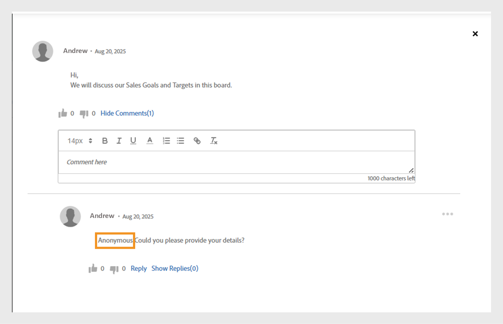

# Novidades na versão de outubro de 2025 do Adobe Learning Manager

>[!IMPORTANT]
>
>Observe que os recursos descritos são provisórios e estão sujeitos a alterações. Para obter informações detalhadas e confirmação, entre em contato com o Gerente de sucesso do cliente designado. Se você encontrar problemas, entre em contato com nossa equipe de Suporte ao Cliente em [learningmanagersupport@adobe.com](mailto:learningmanagersupport@adobe.com).

## Visão geral da versão

A versão de outubro de 2025 do Adobe Learning Manager apresenta aprimoramentos significativos projetados para melhorar a precisão dos relatórios, expandir os recursos de integração e aprimorar a experiência de aprendizado para administradores, autores e alunos. As principais melhorias incluem transcrições aprimoradas do aluno que capturam com precisão as conclusões marcadas pelo professor, relatórios de usuário estendidos com campos de identificação adicionais e relatórios de ajudas de tarefa com links de download direto.

Esta versão também apresenta permissões de comunicado com escopo para administradores personalizados, funcionalidade de marcação de usuário em painéis de aprendizado social e acompanhamento de progresso baseado em idioma que preserva o progresso do aluno em diferentes locais. Os recursos adicionais incluem aprimoramentos de integração do Go1 com criação de lista de reprodução assistida por IA, gerenciamento avançado de funções personalizadas com suporte a importação incremental e APIs aprimoradas para melhor acompanhamento do desempenho do quiz e monitoramento do status da migração.

## Conclusões marcadas pelo professor nas transcrições do aluno

**Visão geral**

As transcrições incrementais do aluno agora capturam conclusões marcadas pelo professor, mesmo se a participação for registrada após a data da sessão.
Esse aprimoramento aborda uma lacuna crítica nas transcrições incrementais do aluno em que as conclusões marcadas pelo professor eram anteriormente perdidas se a participação fosse registrada após a data da sessão original.

As transcrições incrementais do aluno são relatórios agendados que capturam apenas as alterações (como conclusões ou atualizações de progresso) que ocorrem em um período especificado, em vez de fornecer um despejo de dados histórico completo. Eles são normalmente usados para automação, painéis de controle e integrações, permitindo que os usuários controlem de forma eficiente as atividades de aprendizado recentes sem processar todo o histórico de transcrição a cada vez.

**Novidades**

* **Marcar coluna de Data de Conclusão (Fuso Horário UTC)**: uma nova coluna de carimbo de data/hora que captura a data e a hora exatas quando um professor marca uma sessão ou um módulo como concluído.
* **Acompanhamento de origem da conclusão aprimorada**: acompanha o instrutor e o módulo específicos (por exemplo, “Sala de Aula”) em que as conclusões foram gravadas.

Essas alterações garantem que as conclusões marcadas após a data da sessão sejam refletidas com precisão nas transcrições incrementais do aluno.

**Principais benefícios**

* Captura todas as conclusões em relatórios incrementais, independentemente de quando a participação está marcada.
* Fornece uma trilha de auditoria clara para conformidade e emissão de relatórios.
* Oferece suporte à automação e aos painéis de controle para requisitos normativos.

**Casos de uso**

* Organizações com sessões de sala de aula nas quais os professores podem marcar presença dias após a sessão real.
* Sistemas ou painéis automatizados que dependem de transcrições incrementais do aluno para fins de conformidade ou emissão de relatórios.

### Transcrição do aluno com a nova coluna

Consulte este [artigo](/help/migrated/administrators/feature-summary/learner-transcripts.md) para saber como baixar a transcrição do aluno.

O relatório de transcrição do aluno baixado contém a nova coluna: Marcar data de conclusão (Fuso horário UTC).


_O relatório de transcrição do aluno exibe uma nova coluna em amarelo destacando as datas de conclusão individuais de cada usuário_

## Relatório de usuário aprimorado com campos de dados estendidos

**Visão geral**

O Relatório de usuário agora inclui campos adicionais para melhorar o rastreamento do usuário e o mapeamento organizacional.

**Novidades**

* Coluna ID de Usuário Interno: fornece identificadores internos exclusivos para um controle de usuário suave entre diferentes sistemas e endpoints de API.
* Coluna E-mail do Gerente: inclui informações de contato direto do gerente para rastreamento da hierarquia organizacional.

**Principais benefícios**

* Identificação simplificada de usuários e elimina problemas ao mapear usuários em vários sistemas.
* Oferece suporte a fluxos de trabalho de gerenciamento de usuários downstream por meio de recursos de integração.
* Melhoria no mapeamento organizacional e melhor compreensão das relações de geração de relatórios.
* Mantém os limites organizacionais e evita a comunicação cruzada acidental.

**Considerações importantes**

* Se o escopo de um administrador personalizado for alterado, os comunicados afetados exibirão um ícone de aviso e exigirão redefinições de escopo individuais.
* Cada comunicado deve ser atualizado individualmente quando ocorrerem alterações no escopo.
* O relatório de Aviso de Notificação mostra apenas os alunos no escopo atribuído ao administrador personalizado.

### Relatório do usuário com a nova coluna

Veja este [artigo](/help/migrated/administrators/feature-summary/reports.md#user-activity-dashboards) para saber como baixar o Relatório do Usuário.

O arquivo de Relatório do usuário baixado contém as novas colunas: ID do usuário interno e E-mail do gerente.


_Relatórios de Usuário destacando IDs de usuário internas e endereços de email de gerentes para simplificar o gerenciamento de usuários_

## Relatório de usuário FTP com suporte para ID de usuário interno

**Visão geral**

O relatório de usuário baseado em FTP agora inclui suporte à ID de usuário interno, fornecendo uma abordagem unificada para exportação de dados e integração para implementações sem periféricos.

**Novidades**

* Os relatórios do usuário agora estão disponíveis por meio do [FTP personalizado](/help/migrated/integration-admin/feature-summary/connectors.md#custom-ftp) juntamente com os relatórios existentes (transcrições de gamificação, transcrições do aluno, relatório de treinamentos).
* A coluna ID de usuário interno agora é consistente em todos os métodos de exportação (FTP, API de trabalhos e UI).

**Principais benefícios**

* Gerenciamento simplificado de dados com uma única fonte para todos os relatórios necessários.
* Maior coerência dos dados, assegurando uma identificação uniforme dos utilizadores ao longo dos períodos de comunicação.
* Suporte automatizado a fluxos de trabalho, permitindo operações em massa e fluxos de trabalho analíticos com identificadores consistentes.
O Relatório do usuário baixado da pasta FTP contém a nova coluna, ID do usuário interno.

## Incluir usuários suspensos nas transcrições do aluno

**Visão geral**

Agora, as organizações podem incluir usuários suspensos (aqueles com perfis externos desativados) nas transcrições do aluno, garantindo uma retenção abrangente dos dados de aprendizado do histórico.

**Novidades**

* Visibilidade configurável de usuário suspenso com um sinalizador no nível da conta para incluir usuários suspensos nas transcrições do aluno.
* Retenção de dados históricos mesmo após a desativação de perfis externos suspensos.

**Requisitos de implementação**

* Entre em contato com seu gerente de sucesso do cliente (CSM) para ativar o sinalizador no nível da conta.

>[!NOTE]
>
>Este sinalizador está desabilitado por padrão para contas existentes e deve ser solicitado explicitamente para novas contas.

## Permissões de comunicado no escopo para administradores personalizados

**Visão geral**

Os administradores personalizados agora podem criar comunicados, mas somente para os grupos de usuários ou catálogos atribuídos a eles. Isso evita a comunicação não intencional através dos limites organizacionais.

**Novidades**

* Os administradores personalizados só podem criar comunicados para usuários no escopo atribuído a eles.
* Os comunicados podem ter escopo definido para grupos de usuários ou catálogos específicos.
* Os administradores completos mantêm visibilidade e controle sobre todos os comunicados, inclusive aqueles criados por administradores personalizados com escopo definido.

**Principais benefícios**

* Comunicação direcionada que garanta que os anúncios cheguem apenas ao público relevante.
* Redução da sobrecarga de informações, evitando que notificações irrelevantes cheguem a usuários não-intencionais.
* Mantém os limites organizacionais e evita a comunicação cruzada acidental.

**Considerações importantes**

* Se o escopo de um administrador personalizado for alterado, os comunicados afetados exibirão um ícone de aviso e exigirão redefinições de escopo individuais.
* Cada comunicado deve ser atualizado individualmente quando ocorrerem alterações no escopo.
* O relatório de Aviso de Notificação mostra apenas os alunos no escopo atribuído ao administrador personalizado.

**Casos de uso**

* Organizações de franquia onde os gerentes regionais precisam se comunicar apenas com seus franqueados.
* Grandes organizações com administradores regionais ou departamentais que direcionam anúncios para suas equipes.

### Criar comunicado para o escopo atribuído

Um administrador personalizado pode criar comunicados limitados aos grupos de usuários e catálogos atribuídos, garantindo que as mensagens cheguem ao público certo e evitando notificações desnecessárias.

Para criar um comunicado para o escopo atribuído:

1. Faça logon no Adobe Learning Manager como administrador.
2. Selecione **[!UICONTROL Comunicado]** no painel de navegação esquerdo.
3. Selecione **[!UICONTROL Adicionar]**.

   
   _Página Comunicados no Adobe Learning Manager, na qual os administradores podem criar e gerenciar comunicados para grupos de usuários direcionados_

4. Selecione o **[!UICONTROL Tipo de Comunicado]** no menu suspenso.
a. **[!UICONTROL Como Notificação]**
b. **[!UICONTROL Como Manchete]**
c. **[!UICONTROL Como Recomendação]**
d. **[!UICONTROL Como Email]**
5. Selecione **[!UICONTROL Como Manchete]**.
6. Selecione o idioma e faça upload de uma imagem para a manchete.
7. Ou adicione um URL para o botão de ação.

   
   _Tela Criar comunicado permitindo que os administradores definam o tipo de comunicado, carreguem anexos e adicionem botões de ação_

   O escopo atribuído é pré-selecionado na seção **[!UICONTROL Escopo]** e não pode ser modificado pelos administradores.

   >[!NOTE]
   >
   >**[!UICONTROL Para comunicados de Notificação]** e de **[!UICONTROL Email]**, eles poderão incluir grupos de usuários e catálogos adicionais se eles se sobrepuserem ao escopo atribuído.

8. Selecione **[!UICONTROL Salvar]**.

Somente os alunos no escopo do administrador personalizado poderão exibir o comunicado. Veja este [artigo](/help/migrated/administrators/feature-summary/announcements.md) para saber como criar vários tipos de comunicados.

### Redefinir o escopo por Administradores personalizados

Os administradores personalizados podem redefinir o escopo de seus comunicados publicados se um administrador tiver alterado o escopo deles. Depois que o escopo for redefinido, o escopo atualizado será aplicado ao comunicado e somente os alunos do novo escopo poderão ver o comunicado.

Para redefinir o escopo:

1. Faça logon no Adobe Learning Manager como um administrador personalizado.
2. Selecione **[!UICONTROL Comunicado]** no painel de navegação esquerdo.
3. Selecione a guia **[!UICONTROL Publicado]**.
4. Selecione qualquer comunicado e, em seguida, selecione o ícone de configuração.
5. Selecione **[!UICONTROL Editar]**.

   
   _Tela de anúncio mostrando os anúncios publicados com opções de edição, publicação e outras opções_

6. Selecione **Redefinir**.

   
   _Anúncio que mostra uma notificação de alteração de escopo, com uma opção para que os administradores personalizados redefinam e atualizem a seleção de escopo para refletir novas permissões de acesso_

O escopo será atualizado e somente os usuários dentro do escopo atualizado poderão ver o comunicado.

### Editar o comunicado por meio da interface do administrador

Os administradores podem exibir comunicados criados por administradores personalizados por meio de suas interfaces. Eles podem editar esses comunicados apenas modificando ou removendo o escopo atribuído. Se as alterações de escopo não forem feitas, os administradores não poderão fazer mais edições no comunicado.

Para editar o comunicado por meio da interface do administrador:

1. Faça logon no Adobe Learning Manager como administrador.
2. Selecione **[!UICONTROL Comunicado]** no painel de navegação esquerdo.
3. Selecione a guia **[!UICONTROL Publicado]**.
4. Selecione qualquer comunicado e, em seguida, selecione o ícone de configuração.
5. Selecione **[!UICONTROL Editar]**.

   
   _Tela de anúncio mostrando os anúncios publicados com opções de edição, publicação e outras opções_

6. Selecione **[!UICONTROL Remover]**.

   
   _Tela de anúncio indicando que o escopo deve ser removido para permitir que os administradores editem comunicados criados para grupos de usuários com escopo_

O administrador pode editar o comunicado após remover o escopo.

## Marcar usuários em painéis sociais

**Visão geral**

Os painéis de aprendizado social agora oferecem suporte à funcionalidade de marcação de usuário, permitindo discussões mais direcionadas e colaboração aprimorada nas comunidades de aprendizado. Os alunos podem ser marcados em publicações e comentários de aprendizado social por meio do aplicativo do aluno, APIs e site de referência do Adobe Learning Manager.

**Novidades**

* **marcação @username**: os usuários podem marcar outros membros do painel usando o formato &quot;@username“.
* **Marcação com escopo restrito**: somente usuários com acesso ao painel específico podem ser marcados, garantindo a privacidade e a relevância.
* **Notificações multicanal**: os usuários marcados recebem notificações no aplicativo e por email com links diretos para postagens ou comentários relevantes.

**Principais recursos**

* Os usuários fora do escopo do painel não podem ser marcados, evitando notificações indesejadas.
* Se um usuário marcado for excluído do sistema, a menção será exibida como “anônimo”.
* Marcar grupos de usuários ou &quot;@all&quot; não é permitido para evitar spams de notificação.

**Casos de uso**

* Profissionais de saúde que buscam contribuições de colegas específicos em casos médicos.
* Consulta de peritos em matérias especializadas.
* Discussões em equipe que exigem contribuições de partes interessadas específicas.
* Sessões de compartilhamento de conhecimento com envolvimento direcionado de especialistas.

### Marcar usuários em publicações no painel social

Os alunos agora podem marcar membros específicos do painel em publicações ou comentários usando @username. A marcação é limitada aos membros com acesso a esse painel.

Para marcar usuários em um painel social:

1. Faça logon no Adobe Learning Manager como aluno.
2. Selecione **[!UICONTROL Aprendizado Social]** no painel de navegação esquerdo.

   
   _Habilite o aprendizado colaborativo selecionando Aprendizado Social para acessar quadros de discussão, compartilhar insights e marcar usuários para engajamento interativo_

3. Selecione **[!UICONTROL Nova Postagem]**.

   
   _Inicie uma nova discussão selecionando Nova Publicação no Aprendizado Social para compartilhar conhecimento com os usuários marcados_

4. Antes de marcar usuários, selecione o painel de **[!UICONTROL Postar em um Quadro de Discussão]**.

   
   _Selecione um quadro de discussão para postar e marcar usuários, habilitando conversas colaborativas direcionadas no Aprendizado Social_

5. Digite os detalhes da publicação e marque um usuário inserindo o símbolo @ seguido do nome (por exemplo, @andrew). Quando você digita @ seguido das três primeiras letras do nome do usuário, é exibida uma lista de usuários correspondentes.

   
   _Marque os usuários na sua postagem de discussão digitando @ seguido do nome de usuário para habilitar a colaboração direcionada nos painéis de Aprendizado Social_

6. Selecione o usuário desejado na lista.
7. Selecione **[!UICONTROL Publicação]**.

Os usuários marcados recebem notificações no aplicativo e por email com um link direto para a publicação, tornando as discussões mais direcionadas e colaborativas.

### Marcar usuários com base no escopo do painel

A marcação restrita ao escopo permite que os usuários marquem apenas os alunos que têm permissão para acessar um painel específico. Isso ajuda a manter a privacidade, evitando a marcação de usuários fora do escopo.

Se você tentar marcar os alunos que estão fora do escopo do painel, nenhuma sugestão será exibida e você não poderá marcá-los. Consulte este [artigo](/help/migrated/administrators/feature-summary/social-learning-configurations-as-an-admin.md) para saber mais sobre o Escopo de Aprendizado Social.

## Marcar usuários excluídos em comentários

Se um usuário que foi excluído for marcado em uma publicação de aprendizado social, seu nome será exibido como Anônimo na publicação. O comentário e a tag permanecem visíveis para contexto, mas o link ou os detalhes do perfil não são exibidos.


_Publicação do Aprendizado Social que destaca como um usuário excluído aparece como Anônimo quando marcado_

## Relatório de ajudas de tarefa com links de acesso direto

**Visão geral**

O relatório de ajudas de tarefa foi aprimorado para incluir links de download direto para ajudas de tarefa, simplificando o gerenciamento de conteúdo e os processos de auditoria para administradores e autores.

**Novidades**

* Coluna Link da ajuda de tarefa: acesso direto a arquivos de ajuda de tarefa e URLs externos no relatório.
* Controle de acesso baseado em função: a acessibilidade do link depende das funções do usuário e das permissões do catálogo.
* As ajudas de tarefa excluídas permanecem acessíveis se ainda estiverem vinculadas aos cursos ativos.

**Principais benefícios**

* Downloads diretos de arquivos e acesso por URL a partir do relatório.
* Elimina o esforço manual de localizar e fazer download de ajudas de tarefa para auditorias de conformidade ou acessibilidade.

**Casos de uso**

* Os autores ou administradores realizam auditorias regulares de acessibilidade em ajudas de tarefa, conforme exigido pelas grandes organizações.
* Qualquer cenário em que o acesso rápido e baseado em funções a arquivos de ajuda de tarefa seja necessário para revisão ou conformidade.

### Relatório de ajudas de tarefa com a nova coluna

Consulte este [artigo](/help/migrated/administrators/feature-summary/reports.md#job-aids-report) para saber como baixar o Relatório de ajudas de tarefa.

O Relatório de ajudas de tarefa pode ser baixado da seção Relatórios e agora inclui links de download direto para cada ajuda de tarefa.


O _Relatório de ajudas de tarefa exibe links de download direto, facilitando o acesso e o download de ajudas de tarefa no Adobe Learning Manager_

## Atualizações de API

### Aprimoramentos da API do aluno para acompanhamento do desempenho do quiz

**Visão geral**

A API do `GET /loResourceGrades` foi aprimorada para fornecer dados detalhados de desempenho do quiz, permitindo análises mais sofisticadas e tomada de decisões automatizada.

**Novidades**

A resposta da API agora inclui dois campos adicionais:

* **[!UICONTROL higherScore]**: a melhor pontuação obtida por um aluno em todas as tentativas do quiz
* **[!UICONTROL maxScore]**: a pontuação total possível para o quiz

**Exemplo de resposta de API**

```
{
    "links": {
        "self": "https://learningmanagerstage1.adobe.com/primeapi/v2/loResourceGrades/course:15067_30122_41715_1_3400468"
    },
    "data": {
        "id": "course:15067_30122_41715_1_3400468",
        "type": "learningObjectResourceGrade",
        "attributes": {
            "completed": false,
            "duration": 0,
            "hasPassed": false,
            "highestScore": 0,
            "maxScore": 0,. 
            "progressPercent": 0,
            "score": 0
        },
        "relationships": {
            "loResource": {
                "data": {
                    "id": "course:15067_30122_41715_1",
                    "type": "learningObjectResource"
                }
            }
        }
    }
}
```

Em resposta, o **curso:15067_30122_41715_1_3400468** é a ID do grau de recurso do Objeto de Aprendizado para o qual as informações estão sendo solicitadas. A ID `learningObjectResourceGrad`e pode ser obtida na API `GET /enrollments/{id}`.

**Principais benefícios**

* Permite a análise detalhada do desempenho do quiz para a medição da eficácia da aprendizagem.
* Oferece suporte a regras de progressão com base em realizações mais altas, em vez das tentativas mais recentes.
* Fornece uma imagem completa do desempenho do questionário do aluno ao longo do tempo.

**Como a API funciona**

1. Um usuário tenta fazer um quiz várias vezes; cada tentativa é gravada.
2. A API fornece a maior pontuação obtida e a pontuação máxima possível para o quiz.
3. Os sistemas externos podem usar esses dados para acionar ações automatizadas, como inscrever usuários em novos cursos com base em seu melhor desempenho.

**Casos de uso**

* Os sistemas de aprendizado sem periféricos exigem decisões de inscrição automatizadas.
* As plataformas de análise de aprendizado controlam os padrões de realização do aluno.
* Sistemas de conformidade com os requisitos de progressão baseados no desempenho.

### Aprimoramentos na API de migração

**Visão geral**
O Adobe Learning Manager agora oferece suporte à migração de vários objetos de dados para uma conta por meio do processo de migração. Esse processo pode ser iniciado por meio de APIs e da interface do usuário. Quando uma migração falha, erros ficam disponíveis para download por meio da interface. Esses erros são úteis para depurar erros de migração e gerenciar as execuções de migração.

Com esta versão, os registros de erro também estarão disponíveis para download por meio das APIs para controle e depuração de erros eficientes e programáticos.

**Alterações de API**

Há uma nova API de migração, `runStatus`, que permite que os administradores de integração verifiquem o status das execuções de migração acionadas por meio da API; algo não possível em versões anteriores do Adobe Learning Manager.

Além disso, a API `runStatus` agora fornece um link direto para baixar logs de erros (CSV) para execuções concluídas. Observe que o link é válido por apenas sete dias e os registros são mantidos por um mês.

A resposta da API `startRun` foi atualizada para incluir a ID do projeto de migração, a ID do sprint e a ID de execução do sprint, que são necessárias para consultar o novo ponto de extremidade de status.

#### API runStatus

**Descrição**

Recupera o status de uma execução de migração existente.

**Objetivo final**

```
GET /bulkimport/runStatus
```

**Parâmetros**

* **migrationProjectId**: (Obrigatório). Um identificador exclusivo para um projeto de migração. Um projeto de migração é usado para transferir dados e conteúdo de um sistema de gerenciamento de aprendizagem (LMS) existente para o Adobe Learning Manager. Cada projeto de migração pode consistir em vários sprints, que são unidades menores de tarefas de migração.

* **sprintId**: (obrigatório). Um identificador exclusivo de um sprint em um projeto de migração. Um sprint é um subconjunto de tarefas de migração que inclui itens de aprendizado específicos (por exemplo, cursos, módulos, registros do aluno) a serem migrados de um LMS existente para o Adobe Learning Manager. Cada sprint pode ser executado de forma independente, permitindo a migração em fases.

* **sprintRunId**: (Obrigatório). Um identificador exclusivo usado para rastrear a execução de um sprint específico em um projeto de migração. Está associado ao processo de migração real dos itens definidos em um sprint. O sprintRunId ajuda a monitorar, solucionar problemas e gerenciar o trabalho de migração.

**Resposta**

```
{
  "sprintId": 2510080,
  "sprintRunId": 2740845,
  "migrationProjectId": 2509173,
  "startTime": 1746524711052,
  "endTime": 1746524711052,
  [
    {
      "id": 2609923,
      "lastHeartbeatTime": 1746524711052,
      "objectName": "content",
      "jobState": "COMPLETED",
      "errorCsvLink": "",
      "errorLogLink": "migration/5830/2509173/2510080/2740845/content_err.csv",
      "sequenceNumber": 1
    },
    {
      "id": 2609922,
      "lastHeartbeatTime": 1746524713577,
      "objectName": "course",
      "jobState": "WAITING_IN_QUEUE",
      "errorCsvLink": "",
      "errorLogLink": null,
      "sequenceNumber": 2
    }
  ]
}
```

#### API startRun

A resposta da API `startRun` foi atualizada para incluir três campos adicionais: migrationProjectId, sprintId e sprintRunId. Esses campos permitem que os usuários controlem e consultem o status de execuções de migração específicas usando a nova API runStatus.

```
curl -X GET --header 'Accept: text/html' 'https://learningmanager.adobe.com/primeapi/v2/bulkimport/runStatus?migrationProjectId=001&sprintId=10001&sprintRunId=7'
```

Produz a seguinte resposta. A resposta contém:

* migrationId
* sprintId
* sprintRunId

**Resposta**

```
{
  "status": "OK",
  "title": "BULKIMPORT_RUN_INITIATED_SUCCESSFULLY",
  "source": {
    "info": "Success",
    "migrationInfo": {
      "migrationProjectId": "001",
      "sprintId": "10001",
      "sprintRunId": "7"
    }
  }
}
```

### Alterações na API social (tag do usuário, comentários e respostas)

**Visão geral**

O Adobe Learning Manager agora oferece suporte à funcionalidade de marcação @user em painéis de aprendizado social, permitindo que os alunos mencionem e notifiquem colegas em publicações, comentários e respostas. Esse recurso aprimora a colaboração e a detecção de conteúdo em toda a plataforma.

Esta versão apresenta novos recursos de API para oferecer suporte a menções de usuários, incluindo POST e pontos de extremidade de GET aprimorados, bem como uma nova funcionalidade de pesquisa para usuários marcados.

**Visão geral das alterações na API**

* Atualizadas as APIs POST para criar postagens/comentários/respostas com menções do usuário
* APIs GET atualizadas com dados de menção do usuário nas respostas

**Formato das menções do usuário**

Um usuário é mencionado usando o formato: @(usuário:userId)

#### Criar publicação com menções

**Objetivo final**

```
POST /primeapi/v2/posts
```

**Descrição**

Crie uma nova publicação de aprendizado social com menções do usuário.

**Corpo da solicitação**

```
{
  "data": {
    "type": "post",
    "attributes": {
      "boardId": 13282,
      "accountId": 11152,
      "text": "<p>This is a new post mentioning @[user:11257229]</p>",
      "createdByUserId": 11257228,
      "postType": "discussion"
    },
    "id": null
  }
}
```

**Resposta**

Resposta padrão de pós-criação com dados de menção incluídos no relacionamento _userMences_.

#### Criar comentário com menções

**Objetivo final**

```
POST /primeapi/v2/comments
```

**Descrição**

Adicione um comentário a uma postagem com menções do usuário.

**Corpo da solicitação**

```
{
  "data": {
    "type": "comment",
    "attributes": {
      "postId": 20746,
      "accountId": 11152,
      "text": "<p>Test Comment @[user:11257229]</p>",
      "createdByUserId": 11257228,
      "commentLevel": 0
    },
    "id": null
  }
}
```

#### Criar resposta com menções

**Objetivo final**

```
POST /primeapi/v2/replies
```

**Descrição**

Responder a um comentário com menções do usuário.

**Corpo da solicitação**

```
{
  "data": {
    "type": "reply",
    "attributes": {
      "postId": 20746,
      "accountId": 11152,
      "text": "<p>Thanks for the update @[user:11257229]</p>",
      "createdByUserId": 11257228,
      "commentLevel": 1,
      "parentCommentId": 55621
    },
    "id": null
  }
}
```

#### Recuperar publicações com menções

**Objetivo final**

```
GET /primeapi/v2/posts/{id}
```

**Descrição**

Recuperar detalhes da postagem, incluindo os usuários mencionados.

**Resposta**

```
{
  "links": {
    "self": "https://learningmanager.adobe.com/primeapi/v2/posts/7522"
  },
  "data": {
    "id": "7522",
    "type": "post",
    "attributes": {
      "commentCount": 3,
      "dateCreated": "2025-06-10T11:33:29.000Z",
      "dateUpdated": "2025-06-25T14:52:04.000Z",
      "downVote": 0,
      "postingType": "DEFAULT",
      "richText": "<p>my updated fourth post @[user:14707776] second mention my first post</p>",
      "state": "ACTIVE",
      "text": "my updated fourth post @[user:14707776] second mention my first post",
      "upVote": 0,
      "viewsCount": 0
    },
    "relationships": {
      "createdBy": {
        "data": {
          "id": "14707776",
          "type": "user"
        }
      },
      "parent": {
        "data": {
          "id": "3971",
          "type": "board"
        }
      },
      "userMentions": {
        "data": [
          {
            "id": "14707776",
            "type": "user"
          }
        ]
      }
    }
  },
  "included": [
    {
      "id": "14707776",
      "type": "user",
      "attributes": {
        "avatarUrl": "https://cpcontents.adobe.com/public/images/default_user_avatar.svg",
        "binUserId": "45664b87-75a3-43ec-b0b7-5064958eac6f",
        "email": "user@example.com",
        "enrollOnClick": false,
        "fields": {
          "Location": "BLR"
        },
        "gamificationEnabled": true,
        "lastLoginDate": "2025-06-27T11:21:17.000Z",
        "name": "John Doe",
        "pointsEarned": 1690,
        "pointsRedeemed": 0,
        "preferredResolution": "AUTO",
        "profile": "admin",
        "roles": [
          "Learner",
          "Admin",
          "Author",
          "Instructor",
          "Integration Admin",
          "Manager"
        ],
        "state": "ACTIVE",
        "userType": "Internal"
      },
      "relationships": {
        "account": {
          "data": {
            "id": "9238",
            "type": "account"
          }
        }
      }
    }
  ]
}
```

### Alterações na API social (pesquisa de usuários)

**Objetivo final**

```
GET /primeapi/v2/users/search?q={searchTerm}&context=tagging
```

**Descrição**

Procure usuários disponíveis para marcação com base nas configurações do escopo social.

**Parâmetros de solicitação**


* q (obrigatório): termo de pesquisa (mínimo de 3 caracteres).
* contexto: defina como “marcando” para qualificar os usuários para menções.
* boardId (opcional): ID do painel para filtrar usuários com base em permissões de acesso.

**Resposta**

```
{
  "data": [
    {
      "id": "11257229",
      "type": "user",
      "attributes": {
        "name": "Jane Smith",
        "email": "jane.smith@example.com",
        "avatarUrl": "https://cpcontents.adobe.com/public/images/default_user_avatar.svg",
        "userType": "Internal",
        "state": "ACTIVE"
      }
    }
  ]
}
```

### Diretrizes de implementação

#### Limites de caracteres

* Publicações: aplica-se o limite de 4.000 caracteres, com cada usuário marcado reduzindo os caracteres disponíveis em um valor fixo.
* Comentários: limite de 1000 caracteres.

#### Mencionar validação

* Os usuários só podem ser marcados por nome de usuário ou email (não UUID).
* Usuários internos não podem marcar usuários externos e vice-versa.
* A disponibilidade de marcação segue as configurações existentes do escopo social.
* As permissões do painel determinam a qualificação da marcação (Público/Privado).

#### Notificações

* Várias menções do mesmo usuário em uma postagem resultam em uma única notificação.
* O proprietário original da publicação recebe notificações somente quando especificamente marcado.

#### Manipulação de erros

* IDs de usuário inválidas nas menções retornam erros de validação.
* O GDPR e os usuários excluídos por software aparecem anônimos no conteúdo marcado.

### Progresso do aluno baseado no idioma

Atualmente, o progresso do aluno é rastreado apenas para o idioma local selecionado, causando uma perda significativa de progresso ao alternar idiomas/locais no reprodutor. Essa limitação cria uma experiência de usuário insatisfatória, em que os alunos perdem o progresso do aprendizado ao explorar o conteúdo em diferentes idiomas.

**Problemas atuais**

* **Substituição de progresso**: o progresso de cada módulo no player é monitorado nos níveis de usuário e de módulo. Isso leva a uma situação em que o progresso de um usuário é substituído quando ele volta para uma localidade anteriormente usada para o mesmo módulo.
* **Redefinição do progresso**: por exemplo, se um aluno alcançar 75% de progresso no Local A (inglês) e mudar para o Local B (espanhol), ao retornar para o Local A, seu progresso será redefinido para 0% em vez de retomar a partir de 75%.

Para resolver essas limitações, a API foi aprimorada para oferecer suporte ao acompanhamento de progresso específico de localidades:

* **Armazenamento específico da localidade**: quando um aluno alterna as localidades (por exemplo, da localidade A para a localidade B) no reprodutor, o sistema agora salva o estado de progresso separadamente para cada localidade do conteúdo.
* **Retomada do progresso**: quando o usuário volta para uma localidade anteriormente usada (da localidade B de volta para a localidade A), o conteúdo retoma de onde parou naquela localidade específica.
* **Acompanhamento independente do progresso**: cada localidade mantém seu próprio estado de progresso, permitindo que os alunos explorem conteúdo em vários idiomas sem perder seu progresso individual em cada idioma.

#### Alterações de API

As seguintes APIs foram aprimoradas para oferecer suporte ao novo parâmetro de localidade:

* API de estado do GET Player
* API de estado do POST Player

#### API de estado do GET Player

**Objetivo final**

```
GET /primeapi/v2/users/{userId}/playerState
```

**Descrição**

Recupera o estado atual de um objeto de aprendizado para um usuário e um local específicos.

**Parâmetros**

| Parâmetro | Tipo | Localização | Obrigatório | Descrição |
|---|---|---|---|---|
| userId | String | Caminho | Sim | Identificador exclusivo do usuário |
| loID | String | Consulta | Sim | Identificador do Objeto de Aprendizado no formato lo:{id} |
| loResourceId | String | Consulta | Sim | Identificador de recurso do Objeto de Aprendizado no curso de formato:{loId_loInstanceId_moduleId_moduleVersion} |
| csrf_token | String | Consulta | Sim | Token de proteção CSRF |
| localidade | String | Consulta | Opcional | Identificador de localidade para progresso específico de idioma (por exemplo, “en-US”, “es-ES”) |

**Exemplo de solicitação**

```
GET /primeapi/v2/users/12345/playerState?loId=lo:67890&loResourceId=course:67890_1_mod123_v2&csrf_token=abc123&locale=en-US
```

**Comportamento da resposta**

* Se o parâmetro de localidade for fornecido e um estado específico de localidade existir, a API retornará o progresso para essa localidade.
* Se o parâmetro de localidade for fornecido, mas não existir um estado específico de localidade, a API executará uma pesquisa de fallback para o estado padrão.
* Se o parâmetro de localidade for omitido, a API retornará o estado padrão (manterá a compatibilidade com versões anteriores).
* Para solicitações sem periféricos em que o local é nulo, a API volta para a pesquisa de estado padrão.

#### API de estado do POST Player

**Objetivo final**

POST /primeapi/v2/users/{userId}/playerState

**Descrição**

Atualiza ou cria o estado atual de um objeto de aprendizado para um usuário e um local específicos.

**Parâmetros**

| Parâmetro | Tipo | Localização | Obrigatório | Descrição |
|---|---|---|---|---|
| userId | String | Caminho | Sim | Identificador exclusivo do usuário |
| loID | String | Consulta | Sim | Identificador do Objeto de Aprendizado no formato lo:{id} |
| loResourceId | String | Consulta | Sim | Identificador de recurso do Objeto de Aprendizado no curso de formato:{loId_loInstanceId_moduleId_moduleVersion} |
| csrf_token | String | Consulta | Sim | Token de proteção CSRF |
| localidade | String | Consulta | Opcional | Identificador de localidade para language-sp |

**Corpo da solicitação**

O corpo da solicitação contém os dados do estado do Objeto de aprendizado específicos do local.

**Exemplo de solicitação**

```
POST /primeapi/v2/users/12345/playerState?loId=lo:67890&loResourceId=course:67890_1_mod123_v2&csrf_token=abc123&locale=en-US
```

```
{
  "progress": 75,
  "completionStatus": "incomplete",
  "timeSpent": 1800,
  "lastAccessedPage": 5,
  // Additional state data
}
```

A API cria ou atualiza o estado do Objeto de aprendizado para o local especificado.

## Aprimoramentos na integração com o Go1

**Visão geral**

A integração Go1 foi aprimorada para permitir a curadoria direta dos cursos Go1 para criação de Programas de aprendizado (LP) no Adobe Learning Manager. Esta atualização oferece suporte à inclusão de cursos do Go1 em certificações recorrentes e introduz uma nova versão da experiência do hub de conteúdo do Go1, permitindo uma curadoria mais eficiente do curso.

**Novidades**

* Crie e gerencie listas de reprodução diretamente no Go1 usando a assistência por bate-papo por IA ou a seleção manual.
* Inclua cursos do Go1 em ciclos de certificação recorrentes com redefinição automática do progresso.
* Interface de descoberta de conteúdo atualizada para navegação e curadoria de conteúdo aprimoradas.

**Principais benefícios**

* A criação de listas de reprodução assistidas por IA acelera significativamente o agrupamento e a entrega de conteúdo.
* Permite o uso do conteúdo Go1 para requisitos de treinamento regulatório recorrentes.
* Um modelo claro de visualização e compra dá suporte a decisões bem fundamentadas de investimento em conteúdo.
* Ferramentas de detecção e curadoria aprimoradas para melhor gerenciamento de conteúdo.

**Observações importantes**

* Todos os recursos Go1 exigem uma licença Go1 ativa.
* O conteúdo gratuito anterior do Go1 será desativado. As organizações devem visualizar e comprar os pacotes de conteúdo necessários.
* Administradores e autores podem criar e gerenciar listas de reprodução, e os alunos mantêm acesso somente exibição.

**Casos de uso**

* Organizações que precisam de amplas bibliotecas de conteúdo externo para programas de treinamento abrangentes.
* Programas de treinamento focados em conformidade que precisam de atualizações regulares de conteúdo e ciclos de fornecimento.
* As equipes de aprendizado estão procurando reduzir a sobrecarga de curadoria de conteúdo por meio da assistência de IA.

### Adicionar a lista de reprodução Go1 a um caminho de aprendizado

Os administradores podem criar um caminho de aprendizado que inclua uma lista de reprodução Go1, para que os alunos possam acessar cursos selecionados de terceiros como parte de seu treinamento.

Para criar um caminho de aprendizado:

1. Faça logon no Adobe Learning Manager como administrador.
2. Selecione **[!UICONTROL Caminhos de Aprendizado]** no painel de navegação esquerdo.
3. Selecione **[!UICONTROL Adicionar]**.

   
   _Selecione Adicionar na seção Caminhos de Aprendizado para criar e organizar novos programas de treinamento estruturado para seus alunos_

4. Digite os detalhes necessários e selecione **[!UICONTROL Salvar]**. Consulte este [artigo](/help/migrated/administrators/feature-summary/learning-paths.md) para obter mais informações.
5. Selecione **[!UICONTROL Adicionar Cursos Go1]**.

   
   _Adicione os cursos do Go1 à sua lista de reprodução de Desenvolvimento de Habilidades dos Engenheiros de Vendas para expandir as opções de aprendizado com conteúdo selecionado de terceiros_

6. Na **[!UICONTROL Biblioteca]**, procure e selecione **[!UICONTROL Criar lista de reprodução]** e escolha uma destas opções:
a. **[!UICONTROL com IA]**: crie uma lista de reprodução com a ajuda da IA.
b. **[!UICONTROL sozinho]**: crie uma lista de reprodução adicionando cursos manualmente a ela.

**Criar uma lista de reprodução com IA**

Os administradores podem digitar a descrição da lista de reprodução no prompt do AI. A IA selecionará os cursos relacionados e criará uma lista de reprodução com base nos requisitos. A IA gera listas de reprodução interpretando a meta ou o prompt de aprendizado fornecidos pelo usuário. Ao criar uma lista de reprodução, os administradores podem optar por selecionar conteúdo “com IA”, que permite que o sistema use grandes modelos de linguagem para entender os objetivos de aprendizado e as preferências de conteúdo especificados, como duração e tipo. Em seguida, a IA pesquisa a biblioteca de conteúdo em busca de objetos de aprendizado relevantes que correspondam a esses critérios.

Para criar uma lista de reprodução com IA:

1. Selecione **[!UICONTROL Criar playlist]** e selecione **[!UICONTROL com IA]**.

   
   _Crie listas de reprodução selecionadas com IA, o que permite recomendações automatizadas do curso adaptadas às necessidades do aluno_

2. Digite uma breve descrição sobre sua lista de reprodução no campo de texto **[!UICONTROL Insira sua meta de aprendizado]**.
3. Selecione **[!UICONTROL Próximo]**.

   
   _Digite seu objetivo de aprendizado para criar uma lista de reprodução personalizada, ajudando a Adobe Learning Manager a recomendar cursos direcionados personalizados para as necessidades dos alunos_

4. Escolha as habilidades na lista.

   
   _Escolha as habilidades da lista para organizar os cursos para o Engenheiro de Vendas_
5. Selecione a duração do curso e o tipo para a sua lista de reprodução.
6. Selecione **[!UICONTROL Gerar lista de reprodução]**. A lista de reprodução é criada com 10 cursos, e os administradores podem usá-la para criar um caminho de aprendizado.

   
   _Revise sua lista de reprodução de aprimoramento de habilidades com curadoria de engenheiro de vendas no Adobe Learning Manager_
7. Selecione **[!UICONTROL Adicionar à biblioteca]**.
8. Selecione **Sim** no prompt de confirmação.
9. Selecione a lista de reprodução no prompt **[!UICONTROL Selecionar lista de reprodução para importar]**.

   
   _Selecione e importe a Lista de Reprodução de Aprimoramento de Habilidades do Engenheiro de Vendas da Biblioteca Go1 no Adobe Learning Manager_

10. Selecione **[!UICONTROL Adicionar listas de reprodução ao Caminho de Aprendizado]** e depois **[!UICONTROL Publish]**.

Os cursos na lista de reprodução serão adicionados ao Caminho de aprendizado. Os administradores podem inscrever os alunos, que podem começar a fazer os cursos imediatamente.

**Criar uma lista de reprodução manualmente**

Selecione manualmente os cursos que melhor correspondem aos requisitos dos alunos e selecione os cursos adicionais relevantes.

Para criar uma lista de reprodução manualmente:

1. Selecione **[!UICONTROL Criar lista de reprodução]** e selecione **[!UICONTROL sozinho]**.

   
   _Crie manualmente uma lista de reprodução que dê aos administradores controle total para organizar cursos com base nas necessidades específicas do aluno_

2. Digite o título e a descrição da lista de reprodução.

   
   _Adicione um título e uma descrição à sua lista de reprodução no Adobe Learning Manager para definir claramente sua finalidade e ajudar a orientar os alunos para o desenvolvimento de habilidades direcionado_

3. Selecione **[!UICONTROL Criar]**.
4. Selecione **[!UICONTROL Adicionar item]** para adicionar os cursos relacionados.

   
   _Adicione itens à sua lista de reprodução de Desenvolvimento de habilidades de engenheiros de vendas no Adobe Learning Manager para organizar cursos direcionados_

5. Pesquise e selecione os cursos necessários.

A lista de reprodução foi criada com cursos relacionados e os administradores podem usá-la para criar um caminho de aprendizado.

## Salvar progresso do estado do reprodutor para idiomas

**Visão geral**

O Fluidic Player agora salva seu progresso separadamente para cada idioma em um módulo. Isso significa que você pode alternar entre idiomas e continuar exatamente de onde parou em cada um, em vez de perder seu progresso e começar de novo.

**Principais benefícios**

* Alterne entre idiomas e reinicie a partir da posição exata em cada um.
* Perfeito para alunos que precisam acessar conteúdo em vários idiomas durante a jornada de aprendizado.
* Conclua o módulo em qualquer idioma enquanto mantém o progresso em todos os idiomas que você acessou.

**Casos de uso**

* Organizações globais com funcionários que falam vários idiomas e podem precisar fazer referência a conteúdo em seu idioma nativo e inglês.
* Treinamento de conformidade em que os alunos podem começar em um idioma, mas precisam concluir em outro para fins de certificação.
* Programas de treinamento técnico em que os alunos podem entender melhor os conceitos em seu idioma nativo, mas precisam da terminologia do inglês para seu trabalho.

**Observações importantes**

* A preferência de idioma do Fluidic Player é mantida em uma sessão. Se um aluno alterar o idioma e se mover para outro módulo, o novo idioma será usado para módulos subsequentes, desde que o reprodutor permaneça aberto.
* O nível (status de conclusão) ainda é rastreado no nível do módulo, não por localidade. O primeiro local em que os critérios de conclusão são atendidos atualizará o nível para o módulo. Se um aluno concluir o módulo em um idioma e depois mudar para outro, quaisquer atualizações adicionais do nível serão substituídas do nível anterior, mas o progresso de cada localidade ainda será preservado.

## Suporte à importação de funções personalizadas em importação de usuário incremental

O Adobe Learning Manager agora oferece suporte a importações de função personalizadas no fluxo de trabalho de importação de usuário multiincremental existente (importação de usuário completa regular + fluxo ativado incremental). Esse aprimoramento permite que os arquivos role.csv e user_role.csv sejam carregados e processados de forma incremental, sem exigir sempre uploads de dados completos.

Anteriormente, os arquivos role.csv e user_role.csv podiam ser carregados apenas no modo completo, o que significa que os administradores tinham que incluir todas as definições de função e atribuições adicionadas anteriormente em cada upload. Com esse novo suporte incremental, somente dados de função novos ou modificados precisam ser carregados, reduzindo as despesas gerais e aumentando a eficiência.

**Novidades**

1. Suporte incremental para funções personalizadas e atribuições de função:

   * role.csv e user_role.csv agora podem ser processados de forma incremental no fluxo de trabalho incremental de vários arquivos.
   * Não é necessário carregar todos os dados de função de usuário e função existentes a cada importação.

2. Implementação aprimorada de fluxo de trabalho multiincremental:

   * Crie pastas separadas no FTP para cada arquivo de importação de usuário carregado.
   * Cada pasta contém:

      * O arquivo de importação de usuário - (File1.csv)
      * Arquivos de atribuição de função e função correspondentes - (Arquivo1_role.csv, Arquivo1_user_role.csv)

   Por exemplo, user1.csv corresponde a user1_role.csv (funções personalizadas) e user1_user_roles.csv (mapeamento de função de usuário).

   **Exemplo de estrutura FTP antes do processamento:**

   ```
   import/user/internal/  
        File1.csv  
        File2.csv  
       File3.csv  
   
   UserRole/  
       File1_role.csv  
       File1_user_role.csv  
       File2_role.csv  
       File2_user_role.csv  
       File3_role.csv  
       File3_user_role.csv  
   ```

3. O Adobe Learning Manager também oferece suporte a até 20 CSVs de usuário incrementais e seus CSVs de funções personalizadas correspondentes, tornando-o adequado para operações em grande escala.

**Casos de uso**

* As empresas globais gerenciam equipes regionais enviando vários arquivos incrementais de usuários para cada região (UE, América, Ásia), permitindo que os administradores atualizem usuários e atribuam novas funções para cada região em um único fluxo de trabalho.
* As grandes empresas automatizam a integração e as permissões assimilando regularmente atualizações incrementais de usuários de sistemas de RH. Isso permite atualizações perfeitas nos perfis de usuário e atribuições de função granulares sem intervenção manual.

### Novas colunas adicionadas aos arquivos CSV

Três novas colunas foram introduzidas para aprimorar os dados capturados nas exportações/importações de CSV de usuário, função e função de usuário:

* **Estado de Registro do Usuário (user.csv)**: indica o status de registro atual do usuário.
* **Estado da Função (role.csv)**: indica o status atual das funções no sistema.
* **Estado da Função de Usuário (user_role.csv)**: indica o status da associação de função de usuário.

Baixe os [CSVs de amostra](assets/sample-csv-Incremnetal.zip) aqui.


## Redefinir recomendações no aplicativo Salesforce

**Visão geral**

Anteriormente, os alunos que usavam o aplicativo Adobe Learning Manager Salesforce só podiam selecionar funções e preferências de recomendação uma vez. Se a função deles mudasse, eles precisariam acessar o aplicativo nativo da Adobe Learning Manager para atualizar seu perfil e receber as recomendações relevantes do curso. Isso proporcionou a experiência de aprendizado e contribuiu para reduzir o envolvimento no ambiente do Salesforce.

**Novidades**

O Adobe Learning Manager agora apresenta o botão **[!UICONTROL Redefinir interesses]** no aplicativo Salesforce. Os alunos agora podem redefinir suas funções e preferências de aprendizado sem precisar sair do Salesforce ou fazer logon no aplicativo nativo da Adobe Learning Manager. Esse aprimoramento simplifica o acesso ao conteúdo de aprendizado personalizado, garantindo que as recomendações permaneçam relevantes à medida que as funções dos usuários evoluem.

**Casos de uso**

* Os alunos que alteram funções de trabalho, equipes ou responsabilidades podem redefinir rapidamente suas preferências para receber recomendações de curso atualizadas e relevantes, tudo dentro do aplicativo Salesforce.
* Ao eliminar a necessidade de mudar para o aplicativo nativo da Adobe Learning Manager, a jornada de aprendizado é mais tranquila, incentivando o envolvimento contínuo e o consumo de conteúdo recomendado por meio do Salesforce.
* Os administradores se beneficiam de taxas mais altas de conclusão de aprendizado e melhor alinhamento entre as funções de usuário e o conteúdo recomendado, sem suporte extra ou orientação sobre plataformas de comutação.

### Redefinir interesse no aplicativo Salesforce

Para redefinir os interesses e as recomendações do aplicativo Salesforce:

1. Faça logon no aplicativo Adobe Learning Manager para Salesforce como aluno.
2. Selecione a opção **[!UICONTROL Redefinir interesses]** na parte inferior.

A recomendação ou o interesse do aluno será redefinido no aplicativo Adobe Learning Manager Salesforce.

## Criar portais de aprendizado com o Experience Builder

>[!IMPORTANT]
>
>Estamos entusiasmados em anunciar que o Experience Builder, a ferramenta inovadora para criar portais de aprendizado personalizáveis, estará disponível após a versão de outubro de 2025 do Adobe Learning Manager.
>
>Fique atento para mais atualizações, pois nos aproximamos da data de lançamento. Estamos ansiosos para ver como você usa o Experience Builder para transformar seus portais de aprendizado.
>
>Para esclarecer dúvidas ou obter informações adicionais, entre em contato com seu Gerente de sucesso do cliente.

**Introdução**

O Experience Builder é uma ferramenta sem código/de baixo código no Adobe Learning Manager que ajuda a criar portais de aprendizado personalizados. Ele permite que você crie portais de aprendizado de marca e intuitivos sem precisar de habilidades técnicas ou amplo conhecimento de codificação.
Com o Experience Builder, você pode criar novas páginas, menus e widgets para fornecer experiências de aprendizado personalizadas para seu público de maneira rápida e fácil. Com o Experience Builder, você pode criar rapidamente novas páginas, menus e widgets para fornecer experiências de aprendizado personalizadas para seu público-alvo.

**Instrução de problema**

Antes do Experience Builder, as organizações enfrentavam vários desafios:

1. **Personalização limitada**: os portais corrigiam designs com poucas opções para refletir sua marca. Os administradores só podiam fazer alterações básicas, como modificar cabeçalhos, rodapés ou cores, o que limitava a capacidade de criar experiências exclusivas.
2. **Custo**: a criação de portais personalizados exigia desenvolvedores caros e prazos longos, que demoravam de 6 a 9 meses para serem concluídos. Essa abordagem aumentou o custo total de propriedade e adiou a implantação.
3. **Experiências genéricas**: todos viram o mesmo conteúdo, mesmo que ele não fosse relevante para sua função ou necessidades. Essa falta de personalização reduziu o envolvimento e a satisfação do aluno.
4. **Barreiras técnicas**: administradores não-técnicos lutaram para criar ou atualizar portais porque precisavam de conhecimento de codificação ou suporte externo.

O Experience Builder resolve esses problemas fornecendo uma solução simples, sem código/de baixo código, para criar portais personalizados de marca.

Ele permite que os administradores criem portais que atendam às necessidades de sua organização sem depender de especialistas técnicos ou desenvolvedores externos.

**Principais benefícios**

**Fácil personalização**

* Crie portais que combinem sua marca com cabeçalhos, rodapés, logotipos e layouts personalizados.
* Use widgets para adicionar conteúdo dinâmico, como cursos, categorias e elementos de HTML.
* Crie páginas e menus personalizados para públicos específicos, garantindo que os alunos vejam o conteúdo relevante.

**Solução de baixo código/sem código**

* Os administradores podem criar e gerenciar portais sem codificar o conhecimento, tornando-o acessível a usuários não técnicos.
* A funcionalidade de arrastar e soltar simplifica o processo de criação de páginas e menus.

**Aprendizado personalizado**

* Configure páginas e menus para exibir conteúdo relevante a grupos de usuários específicos, como equipes de vendas, designers ou engenheiros.
* Use páginas ocultas para fornecer conteúdo exclusivo acessível apenas por meio de links diretos.

**Alcance global**

* Crie páginas multilíngues para oferecer suporte aos alunos de todo o mundo.
* Localize conteúdo para atender a públicos diversos e melhorar a acessibilidade.

**Amigável para dispositivos móveis**

* Os alunos podem acessar o conteúdo em qualquer dispositivo, incluindo telefones e tablets.
* Visualize páginas nas exibições para desktop e dispositivos móveis para garantir uma experiência tranquila.

**Casos de uso reais**

**Portais de marca**

* Crie um portal de aprendizado parecido com o site da sua empresa, com logotipos, cores e layouts.
* Por exemplo, uma empresa de assistência médica pode criar um portal que corresponda à sua marca corporativa enquanto integra o conteúdo de aprendizado.

**Aprendizado baseado em funções**

* Crie páginas para funções específicas, como engenheiros, equipes de vendas ou designers.
* Por exemplo, as equipes de vendas podem receber treinamento de produtos, enquanto os engenheiros acessam os cursos técnicos.

**Treinamento de produtos**

* Configure páginas separadas para produtos diferentes, como o Photoshop, o Illustrator ou outras ofertas.
* Cada página pode incluir widgets que exibem cursos, certificações e recursos relacionados ao produto.

**Treinamento de funcionários e clientes**

* Use o portal para incorporar novos funcionários, treinar parceiros externos ou educar clientes sobre seus produtos.
* Por exemplo, uma empresa de software pode criar um portal para tutoriais do cliente e guias de solução de problemas.

**Conteúdo localizado**

* Oferecer conteúdo em vários idiomas para alunos globais.
* Por exemplo, uma empresa multinacional pode criar páginas em inglês, espanhol e francês para atender à sua força de trabalho diversificada.

### Componentes básicos do Experience Builder

Os principais componentes e elementos essenciais do Experience Builder são estruturados para fornecer flexibilidade, facilidade de uso e experiências de aprendizado direcionadas. Segue-se uma repartição pormenorizada:

#### Páginas

As páginas são a base da criação de um portal de aprendizado no Experience Builder. Os administradores podem criar novas páginas personalizadas para públicos ou fins específicos. Além disso, os administradores podem:

* Crie páginas personalizadas com layouts flexíveis (linhas e colunas).
* Adicione widgets para preencher páginas com conteúdo.
* Gerencie o ciclo de vida da página com estados de rascunho e publicado.
* Oculte páginas dos menus enquanto as mantém acessíveis via links diretos.

Por exemplo, uma página para treinamento de vendas pode incluir widgets exibindo cursos relevantes, depoimentos e um calendário de próximas sessões.

#### Menus

Os menus organizam as páginas em estruturas navegáveis para os alunos. Os administradores podem:

* Crie menus personalizados para agrupar páginas para grupos de usuários específicos.
* Adicione hierarquia e ordem para priorizar a visibilidade para públicos específicos.
* Incluir submenus para agrupar páginas relacionadas.

Por exemplo, um menu chamado Recursos pode incluir páginas para eBooks, vídeos e perguntas frequentes.

#### Widgets

Os widgets permitem que os administradores adicionem conteúdo dinâmico e funcionalidade às páginas. Os seguintes widgets estão disponíveis:

* Calendário
* Categorias
* Status da conformidade
* Cursos e caminhos
* Caixa de Conteúdo
* Gamificação
* HTML
* Iframe
* Meu aprendizado
* Aprendizado social

Por exemplo, uma página pode incluir um widget Cursos e caminhos para exibir os cursos recomendados e um widget Calendário para as próximas sessões de treinamento.

#### Ferramentas de marca

O Experience Builder fornece ferramentas para personalizar a aparência do portal. Os administradores podem:

* Personalize cabeçalhos, rodapés e layouts para corresponder à identidade corporativa.
* Use CSS e JavaScript para estilos avançados.

Por exemplo, uma empresa de assistência médica pode usar ferramentas de marca para criar um portal que corresponda à aparência do site corporativo.

### Introdução ao Experience Builder

Uma empresa de software deseja criar um portal de treinamento para seus clientes. O portal terá páginas para diferentes produtos, como Photoshop e Illustrator, organizadas em menus. Ele incluirá widgets que mostram cursos, certificações e próximas sessões de treinamento.

#### Criar uma página

Para criar uma página no Adobe Learning Manager:

1. Faça logon no Adobe Learning Manager como administrador.
2. Selecione **[!UICONTROL Marcas]** no painel de navegação esquerdo.
3. Selecione **[!UICONTROL Páginas Personalizadas]**.
4. Selecione **[!UICONTROL Criar página]**.

   
   _Tela Páginas Personalizadas mostrando a opção Criar página para criar novas experiências de aprendizado personalizadas_

5. Digite o **[!UICONTROL Nome da página]** (por exemplo, treinamento da Photoshop).
6. Digite a **[!UICONTROL Descrição de página]** (por exemplo, Saiba como usar o Photoshop de forma eficaz).
7. Selecione o tipo de página dentre os seguintes:

   * **[!UICONTROL Compilar usando widgets do ALM]**: o administrador pode criar uma página usando os widgets existentes do Adobe Learning Manager.
   * **[!UICONTROL Página externa]**: o administrador pode adicionar uma URL para a página externa. Se você selecionar o tipo de página como externo, adicione o URL no campo de texto URL da página.

8. Selecione o **[!UICONTROL ícone Alterar]** para alterar o ícone da página.

   
   _Tela de criação da página de cursos exibindo opções para digitar o nome, a descrição, o tipo e o ícone da página para uma página de aluno personalizada_
9. Selecione **[!UICONTROL Adicionar Novo Idioma]** para adicionar o idioma padrão da página.
10. Selecione **[!UICONTROL Salvar]**.

A página foi criada e salva como rascunho na seção Páginas personalizadas. Os administradores podem editar e criar as páginas rascunhadas usando os widgets.

Siga as mesmas etapas para criar páginas para outros produtos como o Illustrator.

#### Página de design no Experience Builder

O Adobe Learning Manager permite que os administradores criem páginas personalizadas para seus requisitos usando widgets personalizáveis.
Para criar a página no Experience Builder:

1. Faça logon no Adobe Learning Manager como administrador.
2. Selecione **[!UICONTROL Marcas]** no painel de navegação esquerdo.
3. Selecione **[!UICONTROL Páginas Personalizadas]** e selecione a página necessária.
4. Selecione **[!UICONTROL Design de Página]**.
5. Selecione **[!UICONTROL Editar]**.

   
   _O modo de edição permite que os administradores criem páginas de cursos organizando seções e adicionando widgets em seu idioma preferido_

6. Escolha as opções na lista suspensa **[!UICONTROL Selecionar layout de seção]**.
7. Selecione uma seção entre as seguintes com base no número e tamanho dos widgets que deseja adicionar na seção:

   * **[!UICONTROL 1 coluna-Largura de seção inteira]**: o conteúdo abrange toda a largura da seção para obter o máximo de espaço.
   * **[!UICONTROL 2 colunas-1/2 largura de seção cada]**: duas colunas de largura igual dividem a seção uniformemente.
   * **[!UICONTROL 2 colunas-2/3 e 1/3 de largura de seção, respectivamente]**: o conteúdo principal leva dois terços, o conteúdo lateral, um terço.
   * **[!UICONTROL 2 colunas - 1/3 e 2/3 de largura de seção, respectivamente]**: o conteúdo lateral leva um terço, o conteúdo principal, dois terços.
   * **[!UICONTROL 3 colunas-1/3 largura de seção a cada]**: três colunas de largura igual dividem a seção em terços.

   
   _A caixa de diálogo de seleção de layout de seção permite que os administradores escolham arranjos de widget de uma ou várias colunas para o design de página personalizado_

8. Selecione **[!UICONTROL Continuar]**.
9. Selecione **[!UICONTROL Adicionar widget]**.

   
   _A tela de design da página permite que os administradores selecionem e adicionem widgets para personalizar suas páginas do curso_

10. Escolha o widget necessário e selecione **[!UICONTROL Continuar]**.
11. Configure o dispositivo e selecione **[!UICONTROL Adicionar dispositivo]**. Veja esta [seção](#add-and-configure-widgets) para adicionar e configurar os widgets.
12. Selecione **[!UICONTROL Salvar]** e escolha entre as seguintes opções:

   * **[!UICONTROL Salvar como Rascunho]**: a página será salva como um rascunho. O administrador pode editar a página posteriormente.
   * **[!UICONTROL Salvar &amp; Publish]**: a página será publicada e o administrador poderá adicioná-la ao Menu.


_As opções de salvamento permitem que os administradores escolham entre salvar uma página como rascunho para futura edição ou publicá-la para acesso do aluno_

A página pode ser salva como rascunho ou publicada. Os administradores podem editar rascunhos antes de publicar e também podem atualizar e republicar páginas publicadas.

#### Adicionar e configurar widgets

**Widget de calendário**

Este widget apresenta visualmente cursos e cronogramas no formato de calendário. Ele oferece suporte a filtros por catálogo, status de inscrição, local, produto e função. O design responsivo se adapta a vários tamanhos de grade.

Para configurar o widget Calendário:

1. Siga as etapas de 1 a 9 na [página Design do Experience Builder](#design-page-in-experience-builder).
2. Selecione **[!UICONTROL Calendário]** e selecione **[!UICONTROL Continuar]**.

   
   _Tela de seleção de widget que destaca a opção de widget Calendário para exibir sessões de treinamento em um calendário_

3. Digite um **[!UICONTROL Título do widget]** e uma **[!UICONTROL Descrição do widget]**.

   
   _Tela de personalização do widget Calendário, na qual os administradores podem definir o título, a descrição e os catálogos de seleção do widget_

4. Selecione um catálogo pesquisando para exibir seus cursos e caminhos de aprendizado no widget **[!UICONTROL Calendário]**.
5. Selecione **[!UICONTROL Adicionar Widget]**.

O widget Calendário será adicionado à página. O administrador pode adicionar outros widgets e publicar a página.

**Widget de categorias**

Esse widget exibe categorias (por exemplo, funções, catálogos) como blocos, levando a exibições filtradas ou páginas específicas.

Para configurar o widget Categorias:

1. Siga as etapas de 1 a 9 na [página Design do Experience Builder](#design-page-in-experience-builder).
2. Selecione **[!UICONTROL Categorias]** e selecione **[!UICONTROL Continuar]**.

   
   _Tela de seleção de widget que destaca a opção de widget Categorias para organizar o conteúdo de aprendizado por catálogo, produto ou função para facilitar a navegação_

3. Selecione os detalhes a serem exibidos nos cartões de categoria:

   * **[!UICONTROL Imagem de Categoria]**
   * **[!UICONTROL Descrição da Categoria]**

4. Digite um **[!UICONTROL Título do widget]** e uma **[!UICONTROL Descrição do widget]**.
5. Pesquise e escolha um catálogo da **[!UICONTROL Origem da categoria]**.

   
   _Configure as opções do widget Categorias para definir o título e a descrição do widget e selecione a origem da categoria_

6. Selecione **[!UICONTROL Adicionar Widget]**.

O widget Categorias será adicionado à página. Os administradores podem adicionar outros widgets e publicar a página.

**Widget de conformidade**

Esse widget oferece suporte à filtragem semelhante a um calendário, mas é focado em objetos de aprendizado relacionados à conformidade. Isso permite que os alunos modifiquem ou removam dinamicamente filtros de rótulo de conformidade.

Para configurar o widget Conformidade:

1. Siga as etapas de 1 a 9 na [página Design do Experience Builder](#design-page-in-experience-builder).
2. Selecione **[!UICONTROL Status de Conformidade]** e selecione **[!UICONTROL Continuar]**.

   
   _Tela de seleção de widget que destaca o widget de Status de Conformidade usado para exibir inscrições de alunos com prazos e indicadores de status_

3. Digite um **[!UICONTROL Título do widget]** e uma **[!UICONTROL Descrição do widget]**.

   
   _Tela do widget de Status de Conformidade, na qual os administradores podem definir o título e a descrição do widget para exibir os prazos de inscrição e o status dos alunos_

4. Selecione **[!UICONTROL Adicionar widget]**.

O widget de status de Conformidade será adicionado à página. Os administradores podem adicionar outros widgets e publicar a página.

**Widget de cursos e caminhos**

Este widget exibe uma faixa de curso ou blocos de caminho, personalizáveis para mostrar detalhes diferentes.

Para configurar o widget Cursos e caminhos:

1. Siga as etapas de 1 a 9 na [página Design do Experience Builder](#design-page-in-experience-builder).
2. Selecione **[!UICONTROL Cursos e caminhos]**.

   
   _Tela de seleção de widget destacando o widget Cursos e caminhos para exibir cursos, programações de aprendizado, certificações e ajudas de tarefa como cartões interativos para os alunos_

3. Selecione **[!UICONTROL Continuar]**.
4. Digite **[!UICONTROL Título do widget]** e **[!UICONTROL Descrição do widget]**.
5. Selecione os catálogos ou escolha manualmente até 25 cursos a serem exibidos.

   
   _Widget Cursos e caminhos onde os administradores definem o título, a descrição e selecionam cursos ou caminhos de aprendizado para serem exibidos como cartões interativos_

6. Selecione **[!UICONTROL Adicionar widget]**.

O widget Cursos e caminhos será adicionado à página. Os administradores podem adicionar outros widgets e publicar a página.

**Widget Caixa de Conteúdo**

Este widget permite criar seções com títulos, descrições, imagens e CTAs.

Para configurar o widget Caixa de conteúdo:

1. Siga as etapas de 1 a 9 na [página Design do Experience Builder](#design-page-in-experience-builder).
2. Selecione **[!UICONTROL Caixa de Conteúdo]** e selecione **[!UICONTROL Continuar]**.

   
   _Tela de seleção de widget que destaca o widget Caixa de conteúdo para exibir imagens personalizadas, texto e botões de ação para aprimorar o engajamento do aluno_

3. Digite **[!UICONTROL Título]** e **[!UICONTROL Descrição]**.
4. Digite o texto no **[!UICONTROL rótulo do botão Ação]** e forneça um link.
5. Selecione qualquer uma das opções para Preenchimento do plano de fundo:

   * **[!UICONTROL Cor]**: selecione a cor no seletor de cores ou digite o código de cor no campo de texto.
   * **[!UICONTROL Imagem]**: procure e carregue uma imagem.

6. Ajuste a altura da caixa usando a opção **[!UICONTROL Altura da caixa de conteúdo]**.
7. Selecione as opções de formatação de texto.

   
   _Tela de personalização do widget da Caixa de Conteúdo, na qual os administradores podem inserir um título, uma descrição, um rótulo de botão de ação e um link_

8. Selecione **[!UICONTROL Adicionar widgets]**.

O widget Caixa de conteúdo será adicionado à página. Os administradores podem adicionar outros widgets e publicar a página.

**Widget de gamificação**

Este widget mostra a gamificação e os pontos obtidos pelos alunos em um formato de quadro de classificação. Ele foi atualizado para o Experience Builder com um nome, uma descrição e uma personalização de localização.

Para configurar o widget de gamificação:

1. Siga as etapas de 1 a 9 na [página Design do Experience Builder](#design-page-in-experience-builder).
2. Selecione **[!UICONTROL Gamificação]** e selecione **[!UICONTROL Continuar]**.

   
   _Tela de seleção de widget que destaca o widget de gamificação usado para exibir as atividades de aprendizado e as conquistas no quadro de classificação_

3. Digite o **[!UICONTROL título do widget]** e a **[!UICONTROL descrição do widget]**.
4. Selecione **[!UICONTROL Adicionar widgets]**.

O widget Gamificação será adicionado à página. Os administradores podem adicionar outros widgets e publicar a página.

**widget de HTML**

Esse widget permite que HTML, CSS e código JS personalizados sejam incorporados, fornecendo flexibilidade para conteúdo estático como testemunhos.

Para configurar o widget de HTML:

1. Siga as etapas de 1 a 9 na [página Design do Experience Builder](#design-page-in-experience-builder).
2. Selecione **[!UICONTROL HTML]** e selecione **[!UICONTROL Continuar]**.

   
   _Tela de seleção de widget destacando o widget de HTML para personalizar páginas usando código HTML, CSS e JavaScript_

3. Digite seu código **[!UICONTROL HTML]**, **[!UICONTROL CSS]** e **[!UICONTROL JavaScript]** nos respectivos campos.
4. Selecione **[!UICONTROL Adicionar widget]**.

O widget HTML será adicionado à página. Os administradores podem adicionar outros widgets e publicar a página.

**Widget IFrame**

Esse widget permite incorporar aplicativos da Web externos ou páginas da Web diretamente na página. Inclui opções para nomear, descrever e localizar o conteúdo do iframe.

Para configurar o widget Iframe:

1. Siga as etapas de 1 a 9 na [página Design do Experience Builder](#design-page-in-experience-builder).
2. Selecione **[!UICONTROL Iframe]** e selecione **[!UICONTROL Continuar]**.

   
   _Tela de seleção de widget que destaca o widget Iframe para incorporar aplicativos externos ou páginas da Web em uma seção selecionada_

3. Digite a URL na opção **[!UICONTROL Página vinculada ao botão de Ação]**.
4. Ajuste a altura do Iframe usando a opção **[!UICONTROL Altura do Iframe]**.

   
   _Tela de personalização de widget Iframe, na qual os administradores podem inserir uma URL de página e especificar a altura do iframe para incorporar conteúdo externo_

5. Selecione **[!UICONTROL Adicionar widget]**.

O widget Iframe será adicionado à página. Os administradores podem adicionar outros widgets e publicar a página.

**Meu widget de aprendizado**

Esse widget é semelhante ao widget Cursos e caminhos, mas filtra o conteúdo especificamente para cada aluno, mostrando seu conjunto personalizado de objetos de aprendizado inscritos.

Para configurar o widget Meu aprendizado:

1. Siga as etapas de 1 a 9 na [página Design do Experience Builder](#design-page-in-experience-builder).
2. Selecione **[!UICONTROL Meu Aprendizado]** e selecione **[!UICONTROL Continuar]**.

   
   _Tela de seleção de widget, realçando o widget Meu aprendizado usado para exibir a lista personalizada dos cursos inscritos do aluno_

3. Digite o **[!UICONTROL título do widget]** e a **[!UICONTROL descrição do widget]**.
4. Selecione **[!UICONTROL Adicionar widget]**.

O widget Meu aprendizado será adicionado à página. Os administradores podem adicionar outros widgets e publicar a página.

**Widget de Aprendizado Social**

Esse widget ativa funcionalidades de colaboração social, como publicações, comentários e tags de usuário na plataforma. Ele foi aprimorado para o Experience Builder com opções de personalização, incluindo nome e localização.

Para configurar o widget Aprendizado social:

1. Siga as etapas de 1 a 9 na [página Design do Experience Builder](#design-page-in-experience-builder).
2. Selecione **[!UICONTROL Aprendizado Social]** e depois **[!UICONTROL Prosseguir]**.

   
   _Tela de seleção de widget que destaca o widget Aprendizado social para exibir uma postagem para incentivar a colaboração e o engajamento_

3. Digite o **[!UICONTROL título do widget]** e a **[!UICONTROL descrição do widget]**.
4. Selecione **[!UICONTROL Adicionar widget]**.

O widget Aprendizado social será adicionado à página. Os administradores podem adicionar outros widgets e publicar a página.

#### Organizar páginas em um menu

Os menus ajudam a organizar e vincular páginas no Experience Builder, facilitando o acesso dos alunos ao seu portal de aprendizado. Os administradores podem criar menus, adicionar páginas a eles e personalizar os menus exibidos para públicos específicos.

**Criar um menu**

Para criar um menu:

1. Faça logon no Adobe Learning Manager como administrador.
2. Selecione **[!UICONTROL Marcas]** no painel de navegação esquerdo.
3. Selecione **[!UICONTROL Menu]** e selecione **[!UICONTROL Criar]**.

   
   _Tela de menu mostrando opções para exibir, organizar e criar menus personalizados para diferentes grupos de alunos_

4. Digite o **[!UICONTROL Nome do menu]** (por exemplo, Treinamento de produtos) e selecione o grupo de usuários na opção **[!UICONTROL Visível para]**.

   
   _Tela Criar menu, onde os administradores podem inserir um nome de menu para uso interno e especificar grupos de usuários para controlar a visibilidade do menu_

5. Escolha a página personalizada na opção **[!UICONTROL Selecionar páginas]**.

   
   _Tela de seleção de página, destacando a opção para incluir a página personalizada para grupos de usuários e personalizar a ordem de menus_

6. Selecione **[!UICONTROL Menu de visualização]** para exibir o menu antes de salvá-lo.
7. Selecione **[!UICONTROL Salvar]**.

O menu criado ficará visível para os alunos selecionados. Eles podem acessar as páginas personalizadas por meio da interface do aluno.


_Interface do aluno exibindo a página personalizada com módulos de treinamento em destaque e navegação fácil no menu da barra lateral_

#### Gerenciar ciclo de vida de páginas

Os administradores podem usar a seção Páginas personalizadas para editar, excluir e duplicar as páginas.

**Editar a página**

Para editar as páginas personalizadas:

1. Faça logon no Adobe Learning Manager como administrador.
2. Selecione **[!UICONTROL Marcas]** no painel de navegação esquerdo.
3. Selecione **[!UICONTROL Páginas Personalizadas]**.
4. Selecione a página necessária e selecione **[!UICONTROL Editar]**.
5. Selecione **[!UICONTROL Salvar]**.

A página será atualizada com as alterações.


_Edite a página personalizada, permitindo que os administradores atualizem o nome, a descrição e o tipo da página_

**Excluir a página**

Para excluir a página:

1. Faça logon no Adobe Learning Manager como administrador.
2. Selecione **[!UICONTROL Marcas]** no painel de navegação esquerdo.
3. Selecione **[!UICONTROL Páginas Personalizadas]**.
4. Selecione a página necessária.
5. Selecione **[!UICONTROL Ação]** e selecione **[!UICONTROL Excluir]**.


_Tela Páginas Personalizadas exibindo opções para excluir páginas personalizadas criadas para treinamento de produtos_

**Duplicar a página**

Para duplicar a página:

1. Faça logon no Adobe Learning Manager como administrador.
2. Selecione **[!UICONTROL Marcas]** no painel de navegação esquerdo.
3. Selecione **[!UICONTROL Páginas Personalizadas]**.
4. Selecione a página necessária.
5. Selecione **[!UICONTROL Ação]** e selecione **[!UICONTROL Duplicar]**.


_Tela Páginas Personalizadas exibindo opções para duplicar as páginas personalizadas criadas para treinamento de produtos_

#### Visualize as páginas

Para visualizar as páginas:

1. Faça logon no Adobe Learning Manager como administrador.
2. Selecione **[!UICONTROL Marcas]** no painel de navegação esquerdo.
3. Selecione **[!UICONTROL Páginas Personalizadas]**.
4. Selecione a página necessária e, em seguida, selecione **[!UICONTROL Design da Página]**
5. Selecione **[!UICONTROL Editar]** e selecione **[!UICONTROL Visualizar página]** para exibir a visualização do portal.


_Visualização de página mostrando um layout de página personalizado com um banner e cursos em destaque_

#### Localize as páginas

Quando um administrador adiciona vários idiomas às páginas personalizadas, adicione os detalhes do widget de cada idioma na guia de idioma correspondente ao lado da guia de idioma padrão.


_Os administradores podem adicionar detalhes do widget para idiomas adicionais, como francês, além do idioma padrão_

#### Configurar páginas ocultas

A opção ocultar páginas permite que os administradores mantenham a interface do aluno limpa, mostrando menos páginas. Os administradores podem ocultar páginas do menu para que os alunos não as vejam na interface do aluno, mas os alunos ainda podem acessar essas páginas de outras maneiras. Por exemplo, a página Catálogo pode ficar oculta no menu, mas ser acessada por outros caminhos de navegação.


_Tela de configuração de menu mostrando páginas ocultas, como Catálogo, Aprendizado Social, Habilidades e Medalhas_


<!-- We're excited to share several important updates coming to Adobe Learning Manager with the upcoming releases. These enhancements aim to streamline admin workflows, improve data reporting accuracy, and strengthen role-based controls.

These changes are designed to reduce manual effort, support automation, and improve governance across training operations.

## Capture instructor-marked completions in Learner Transcript

### Audience  

Administrator and automation owners 

### Overview 

In Adobe Learning Manager, when using incremental Learner Transcripts (LT) for automation workflows, instructor-marked completions made after the session date are not captured. The completion timestamp reflects the original session end time (not the time the instructor marked the completion). Since these updates fall outside the one-day change window used for incremental LT generation, as a result, learners' attendance and completion data are excluded from reports, leading to inaccurate or incomplete downstream reporting and potential compliance gaps. 

### What has changed 

Learner Transcript (LT) reports include completions marked by instructors after the session date. This ensures that any delayed attendance marking is correctly reflected in the transcript export. 

Attendance states like "Attended with pass/fail" will appear automatically in incremental LT exports. 

### What's new 

* New column: Mark Completed Date (UTC TimeZone). 
* Completion Source is available at module level. 
* Compatible with connector-based or job API-generated LT reports. 


**Action required**

* If your automation depends on column positions, ensure logic accounts for the new column. 
* If using column names, no changes are required. 
* Retrofitted completions (manual imports) are not included. 

## Download links in Job Aids report

### Audience 

Administrator, custom administrator, and automation owners 

### Overview 

The Job Aids report includes a direct download link for each job aid, allowing quick access from the report itself. 

### What's new  

A new column, **[!UICONTROL Job Aid Link]**, has been added to the third position in the report. It links directly to the job aid if it's a file or shows the external URL provided by the author. 

Users with access (admin/authors and custom roles) can download the job aid using this link. 

 

### Action required 

* Review automated workflows using Job Aids reports (using Jobs API). 
* If the script is based on column position, update scripts accordingly. 
* No action is needed if using column names. 

## Internal User ID and Manager Email columns added to User Report

### Audience 

Administrators (and custom administrators) using the **[!UICONTROL User Report]** (**[!UICONTROL Admin]** > **[!UICONTROL Users]** > **[!UICONTROL Internal]** > **[!UICONTROL Export User data]**) downloaded from the administrator User Interface. 

### Overview 

To assist in user identification and integration workflows, two columns, **[!UICONTROL Internal User ID]** and **[!UICONTROL Manager Email]** have been added to the User report, exported via the User Interface. 

### What's new 

The User report includes a user's internal user ID and their manager's email address, to map them uniquely across different tools or API endpoints. 

### Action required 

* If using this report in automated flows, then this newly added column should be taken care of in automation.  
* No changes are needed if workflows are not impacted. 

## Scoped announcement permissions for custom administrators

### Audience 

Custom administrators 

### Overview 

Custom administrators can create announcements only for the user groups or catalogs within their defined scope. 

### What's new 

* Scoping rules allow custom administrators to create announcements for specific user groups or catalogs only. 
* When defining a custom role, administrators can assign announcement permissions with scope on user groups or catalogs. 
* Custom administrators are limited to creating announcements within their given scope. 
* The notification announcement report for custom administrators will display learners only within their assigned scope. 

### Action required 

* The format of the report will remain unchanged. If custom administrators download it from the User Interface, the content of the report will be subject to their scope. 
* No modifications are necessary if this report is not utilized in any automated or downstream workflow.

See the [Release notes](https://experienceleague.adobe.com/pt-br/docs/learning-manager/using/introduction/release-notes) article for a cumulative list of new features and changes to Adobe Learning Manager.-->
