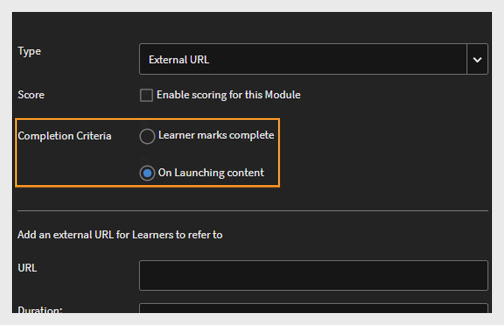

# Resumo dos novos recursos julho de 2024 {#new-features-summary-july-2024}

Saiba mais sobre os novos recursos e aprimoramentos na versão de julho de 2024 do Adobe Learning Manager.

>[!NOTE]
>
>Confira este [webinar](https://nam04.safelinks.protection.outlook.com/?url=https%3A%2F%2Flearningmanager.adobe.com%2Fapp%2Flearner%3FaccountId%3D98632%23%2Fcourse%2F10078152&data=05%7C02%7Cchandrum%40adobe.com%7C90e588d31b994e6a5f4e08dcb87f26a8%7Cfa7b1b5a7b34438794aed2c178decee1%7C0%7C0%7C638588103494535076%7CUnknown%7CTWFpbGZsb3d8eyJWIjoiMC4wLjAwMDAiLCJQIjoiV2luMzIiLCJBTiI6Ik1haWwiLCJXVCI6Mn0%3D%7C0%7C%7C%7C&sdata=dNyxQl3IQjEtfGCMnhlfek4Piz%2BPGFfuUss53M8mFK8%3D&reserved=0) para saber mais sobre os novos recursos nesta versão.

## Aprimoramento no painel de conformidade

### O que é um painel de conformidade? {#whatiscompliancedashboard}

O **[!UICONTROL Painel de Conformidade]** no **Adobe Learning Manager** permite que os gerentes monitorem e monitorem o progresso dos alunos em direção aos seus objetivos de aprendizado. Eles podem verificar se os membros da equipe estão cumprindo os prazos e acompanhando seu processo de aprendizado, o que ajuda a garantir a conformidade. O administrador pode configurar o painel de conformidade e compartilhar com os gerentes.

Para acessar o painel de conformidade no aplicativo do administrador, selecione **[!UICONTROL Relatórios]** > **[!UICONTROL Resumo do aprendizado]** > **[!UICONTROL Painel de conformidade]**.

### O que está mudando na versão

Com o painel de controle de conformidade aprimorado, os administradores e gerentes podem exibir os cursos do tipo conformidade, o caminho de aprendizado ou as certificações relacionadas à sua categoria específica (por exemplo, Vendas, Marketing e Jurídico). Os administradores podem categorizar cursos de conformidade personalizados em categorias específicas. As categorias de conformidade personalizadas são possibilitadas por rótulos de catálogo.  Os administradores podem criar um painel do curso e compartilhá-lo com os gerentes. Os gerentes podem exibir o mesmo painel em suas respectivas instâncias. Também foram feitos aprimoramentos na interface do usuário do painel de conformidade e nas notificações por email de conformidade.


#### Fluxo de trabalho (WRK)

Estas são as etapas para usar o Painel de conformidade aprimorado:

| Função | Tarefa | Informações adicionais |
|---|---|---|
| Administrador | Criar rótulos de conformidade personalizados | Consulte este artigo [Criar rótulos de conformidade personalizados](/help/migrated/administrators/feature-summary/reports.md#compliance-dashboard) para obter mais informações |
| Autor | Adicionar esses rótulos ao curso | Consulte este artigo [Adicionar rótulos de conformidade ao curso/caminho de aprendizado/certificação](/help/migrated/authors/feature-summary/courses.md#add-compliance-labels-to-courselearning-pathcertification) para obter mais informações. |
| Administrador | Criar o painel com o curso de conformidade e compartilhá-lo com os gerentes | Consulte este artigo [Criar e compartilhar um painel de conformidade](/help/migrated/administrators/feature-summary/reports.md#create-and-share-a-compliance-dashboard) para obter mais informações. |
| Gerente | Exibir o painel de conformidade | Consulte este artigo [Status de conformidade](/help/migrated/managers/feature-summary/manager-dashboard.md#compliance-status) para obter mais informações |

## Renovação da interface de usuário do aluno

>[!IMPORTANT]
>
>A nova interface do usuário do aluno será lançada em fases.

A **interface do usuário do aluno** foi atualizada com um design mais elegante e moderno. As páginas de aterrissagem da **[!UICONTROL Página inicial do aluno]**, do **[!UICONTROL Meu aprendizado]**, do **[!UICONTROL Catálogo]** e da **[!UICONTROL Visão geral do curso]** estão ganhando um visual novo e moderno. Os cartões do curso também têm um novo design para exibir detalhes de uma maneira moderna. Passar o mouse sobre um cartão do curso mostra a descrição do curso e a data de publicação.

>[!NOTE]
>
>A interface de usuário renovada aplica-se apenas ao layout imersivo. Essas alterações ainda não são compatíveis com a Web ou o aplicativo para dispositivos móveis e serão atualizadas em uma versão futura.


_Antiga interface de usuário_


_Nova interface de usuário_

### O que está mudando nesta versão

**Modernizar aparência**

Os novos elementos visuais atualizados estão alinhados com as tendências de design modernas, tornando o produto intuitivo e atraente. Isso inclui uma nova manchete, um painel lateral e widgets de aparência moderna.

**Experiência do usuário aprimorada**

Os alunos agora exibirão uma exibição de cartão semelhante nas seguintes páginas: Página inicial, Catálogo, Meu aprendizado e Páginas de visão geral do curso, que oferecem uma experiência unificada.

Exiba a [página inicial do aluno](/help/migrated/learners/feature-summary/learner-home-page.md) para obter mais informações.

**Alterações nas datas de publicação do curso**

Com esse aprimoramento, as datas de publicação dos cursos do LinkedIn e do Go1 importados para o Adobe Learning Manager serão as datas de publicação reais no LinkedIn e no Go1. Você também pode visualizar as datas de publicação reais para os cursos do LinkedIn e Go1 na interface do usuário. Veja [Cartões do curso](/help/migrated/learners/feature-summary/learner-home-page.md#course-cards) para mais informações.

## Atualizações da experiência não conectada

A experiência não conectada permite criar uma experiência em tempo real para clientes não conectados. Isso serve como uma página de aterrissagem para suas campanhas de marketing, fornecendo informações suficientes para incentivar inscrições.

### O que está mudando nesta versão

Os clientes podem adquirir um plano premium para criar essas experiências não conectadas altamente dimensionáveis. Esta experiência não registrada, viabilizada pelo [Acesso a Dados de Treinamento](/help/migrated/integration-admin/feature-summary/connectors.md#training-data-access), fornece dados em tempo real sobre limites de vagas, vagas ocupadas, limites de listas de espera e contagens de listas de espera usando APIs do Adobe Learning Manager. Os clientes podem usar essas APIs para oferecer recursos de pesquisa e filtro de alunos não conectados e um resumo completo do curso. Consulte este artigo [APIs não conectadas](/help/migrated/integration-admin/feature-summary/non-logged-in-apis.md) para obter mais informações sobre as APIs.

>[!NOTE]
>
>Entre em contato com a equipe de suporte ou o CSAM para adquirir o plano premium.

## Suporte a várias SKUs (Stock Keeping Units, unidades de manutenção de estoque)

Os alunos agora podem adicionar vários cursos, programações de aprendizado ou certificações ao carrinho e comprá-los juntos.

### O que está mudando na versão

Anteriormente, os alunos só podiam comprar um curso por vez. Nesta versão do **Adobe Learning Manager**, eles podem comprar vários cursos, programações de aprendizado ou certificações de uma só vez usando o carrinho.

Esse recurso está disponível apenas nos aplicativos do aluno (interface do usuário existente, nova interface do aluno e aplicativo imersivo móvel).

Exibir [carrinho de vários itens no ALM](/help/migrated/learners/feature-summary/multi-item-cart.md)

## Suporte ao conteúdo HTML5 no Fluidic Player

O **Adobe Learning Manager** agora oferece suporte ao carregamento de conteúdo HTML5 como um arquivo .zip para a biblioteca de conteúdo. Depois de carregados, esses arquivos podem ser incluídos como módulos em um curso. Além disso, os autores podem definir os critérios de conclusão para módulos HTML5 em ritmo individualizado, permitindo a conclusão marcada pelo aluno ou a conclusão automática após o lançamento.

### O que está mudando nesta versão

O Adobe Learning Manager agora suporta conteúdo compatível com HTML5 em cursos em ritmo individualizado. Os autores podem adicionar conteúdo HTML5 como um arquivo .zip ao conteúdo de ritmo individualizado. Os alunos podem visualizar o conteúdo do HTML5 no Fluidic Player. Com o novo recurso, agora os alunos podem marcar o curso como concluído diretamente no Fluidic Player para cursos em ritmo individualizado. Exiba [Adicionar tipo de arquivo HTML5 na biblioteca de conteúdo](/help/migrated/authors/feature-summary/content-library.md#add-html5-file-type-in-the-content-library) para obter mais informações.

Com o novo aprimoramento, o curso com o link externo será automaticamente marcado como concluído quando a URL for visitada, desde que o autor tenha definido os critérios de conclusão para a nova opção **[!UICONTROL Ao iniciar conteúdo]**. A nova opção **[!UICONTROL Critérios de conclusão]** foi adicionada à página Módulo de Atividade, onde o autor pode definir os critérios de conclusão para links externos. Exiba o link [Adicionar HTML no módulo de atividade](/help/migrated/authors/feature-summary/courses.md#add-html-link-in-the-activity-module) para obter mais informações.


_Módulo option-Activity de critérios de conclusão_

## Notificações por push de cursos atrasados no aplicativo móvel

Os alunos receberão notificações por push sempre que perderem um prazo do curso. Com esse novo aprimoramento, os alunos agora terão a opção de adiar um lembrete por 24 horas ou serem lembrados na próxima semana de cada lembrete vencido que receberem. Isso é aplicável apenas a notificações de prazos vencidos. Exibir [Agendar a notificação por push](/help/migrated/learners/feature-summary/user-notifications.md#schedule-the-push-notification)

## Alterações da API nesta versão

### API de pesquisa

A API de pesquisa inclui as seguintes alterações:

Os alunos podem pesquisar marcas nos filtros do catálogo usando a API ```GET /search```. Os alunos podem pesquisar as tags selecionando ```tag``` como um valor para o parâmetro ```filter.loTypes```.

**Exemplo de curva**

```
curl -X GET --header 'Accept: application/vnd.api+json' --header 'Authorization: oauth <oauth_token>' 'https://example.com/primeapi/v2/search?page[limit]=10&query=Business&autoCompleteMode=true&filter.loTypes=tag&sort=relevance&filter.ignoreEnhancedLP=true&matchType=phrase&persistSearchHistory=true&stemmed=false&highlightResults=true'
```

Os novos filtros, vaga disponível, lista de espera disponível e filtro de intervalo de tempo foram adicionados às seguintes APIs: ```GET /search``` e `GET /learningObjects`.

Os novos filtros `filter.session.includeEnrollmentDeadline` foram adicionados à API ```GET /search``` a seguir.

### API da conta

As novas colunas `custom_injections`, `showComplianceLabel` e `complianceLabelDefaultID` foram adicionadas à API ```GET /account``` para obter dados da conta do ponto de extremidade do usuário.

### API do objeto de aprendizado

Estas são as alterações feitas na API do objeto de aprendizado nesta atualização:

A nova ID de autor herdada de resposta e outros detalhes adicionados em `authorDetails` na API `GET /learningObjects`. Além disso, um novo filtro, `filter.authors`, foi adicionado para filtrar autores legados e seus cursos.

O novo atributo chamado `effectivenessIndex` ajudará você a obter os dados de eficácia do curso.

**Exemplo de curva**

```
curl --location 'https://example.com/primeapi/v2/learningObjects/course%3A9790045?enforcedFields%5BlearningObject%5D=effectivenessData' \
--header 'Accept: application/vnd.api+json' \
--header 'Authorization: oauth <oauth_token>'
```

A nova resposta `whoShouldTake`, que fornece detalhes sobre quem deve realizar este curso, foi adicionada às seguintes APIs: `POST /learningObjects/query`, `GET /learningObjects/{id}` e `GET /learningObjects`.

**Exemplo de curva**

```
curl -X GET --header 'Accept: application/vnd.api+json' --header 'Authorization: oauth <oauth_token>' 'https://example.com/primeapi/v2/learningObjects/course%3A1131255' 
```

A nova resposta `waitlistLimit`, que fornece detalhes sobre a limitação da lista de espera, foi adicionada à API `GET /learningObjects`.

A nova resposta `count` que fornece a contagem total do objeto de aprendizado foi adicionada às APIs `GET/ learningObjects` e `POST/ learningObjects/query`.

As novas respostas, `catalogFieldId` e `fieldValueId`, foram adicionadas em `catalogLabels` na API `GET/ learningObjects`.

Os alunos podem obter os valores de rótulo do catálogo na API `GET /preview/learningObjects`.

### Nova API para obter a contagem do marketplace

Nesta versão, uma nova API, `GET /search/marketplace/count`, foi adicionada. Isso ajuda a obter a contagem dos objetos de aprendizado disponíveis no marketplace de conteúdo.

**Exemplo de curva**

```
curl -X GET --header 'Accept: application/vnd.api+json' --header 'Authorization: oauth <oauth_token>' 'https://example.com/primeapi/v2/search/marketplace/count?query=course'
```

**Exemplo de resposta**

```
{
  "count": 54910
}
```

### API da instância do objeto de aprendizado

Estas são as alterações feitas na API da instância do objeto de aprendizado nesta atualização:

Nesta versão, uma nova chave chamada `gamificationEnabled` foi adicionada à API da instância do objeto de aprendizado `GET /learningObjects/{loId}/instances/{loInstanceId}`.

**Exemplo de curva**

```
curl --location 'http://example.com/acapapi/primeapi/v2/learningObjects/learningProgram:12756/instances/learningProgram:12756_15644' 
```

O novo atributo `gamificationSettings` para a API acima para obter os detalhes das configurações de Gamificação. Por exemplo: `GET /learningObjects/{loId}/instances/{loInstanceId}/gamificationSettings`.

**Exemplo de curva**

```
curl --location 'http://example.com/acapapi/primeapi/v2/learningObjects/learningProgram:103852/instances/learningProgram:103852_103526/gamificationSettings'
```

O novo atributo `leaderboard` para a API acima para obter os detalhes das configurações de Gamificação. Por exemplo: `GET /learningObjects/{loId}/instances/{loInstanceId}/leaderboard`.

**Exemplo de curva**

```
curl --location 'https://example.com/primeapi/v2/learningObjects/learningProgram:106339/instances/learningProgram:106339_105775/leaderboard' \
--header 'Accept: application/vnd.api+json' \
--header 'Authorization: oauth <oauth_token>'
```

### Alteração no comportamento de classificação para data e -data

As APIs que oferecem suporte à classificação por data e -data mostrarão os resultados com base na data de publicação de todos os objetos de aprendizado, exceto o Caminho de aprendizado. O Caminho de Aprendizado ainda será listado com base na data de **effectiveModified**. Essa alteração será vista nas seguintes APIs:

* GET /learningObjects
* OBTER /search
* POST /learningObjects/query
* POST /Search/query

### Alterações nos limites de deslocamento

Para melhorar o desempenho do sistema e gerenciar a utilização de recursos com mais eficiência, a Adobe reduziu os valores de deslocamento altos no ponto de extremidade GET /users para os escopos ADMIN e LEARNER. Recomendamos usar a API Trabalhos para recuperar os registros com um valor de deslocamento.

### Alterações na limitação de RPM e intermitência

Nesta versão, os limites de RPM (Solicitações por minuto) e intermitência foram adicionados para todas as APIs. Você pode verificar o RPM máximo para cada API na página Swagger.

RPM é o número de solicitações que você pode enviar ao servidor da API em um minuto. O limite de intermitência permite um número maior de solicitações por um curto período, indo além do limite de taxa normal.

### APIs obsoletas

Exiba [depreciações de APIs no Adobe Learning Manager](/help/migrated/api-deprecations-list.md) para obter uma lista cumulativa de todas as APIs obsoletas no produto.

## Alterações nos relatórios

### Painel de conformidade

Nesta versão, o relatório do painel de conformidade tem duas novas colunas:

* Status
* Tipo de conformidade

Isso se soma às colunas já existentes:

* Nome do usuário
* E-mail do usuário
* LP/Certificação/Curso
* Tipo
* Data de inscrição (fuso horário UTC)
* Prazo de conclusão (Fuso horário central da Europa)
* Data de conclusão (fuso horário UTC)
* % de progresso

### Relatório de treinamento

O relatório de treinamento em **Administrador** > **Relatórios** > **Relatórios Personalizados** e a **API de Trabalhos** costumavam ter colunas chamadas **Habilidade(s)** e **Marca(s)**. Estas colunas foram renomeadas para **Habilidades** e **Marcas**.

### Relatório de auditoria de conteúdo

Nesta versão, o relatório **[!UICONTROL Trilha de auditoria de conteúdo]** agora inclui os seguintes novos atributos na coluna Tipo de modificação:

* Adicionar Grupo de Usuários
* Remover grupo de usuários
* Adicionar rótulo personalizado
* Remoção de rótulo personalizado
* Adicionar Catálogo Compartilhado
* Remoção do catálogo compartilhado
* Atualização do catálogo compartilhado

## Erro corrigido nesta atualização

**Envio de atividade**

* A tentativa de recarregar um arquivo no módulo de envio de atividade falha com um Erro 500 na chamada de rede.

**API**

* A criação de uma reunião de aula virtual do Connect falha se vários professores tiverem o mesmo endereço de email.
* Depois de se inscrever em um caminho de aprendizado, a SV do MS Teams exibe um URL incorreto na página Visão geral.
* O URL pré-assinado do relatório de usuário fornecido como parte da resposta da API de trabalho expira após seis horas.
* Ao gerar um relatório de inscrição para um curso, a coluna Nome do curso exibe um nome de curso incorreto.
* O trabalhador de migração não consegue enviar a ID de registro exclusiva ao chamar a API em massa para o curso, mas a ID é removida.
* Quando um curso é incluído em um catálogo específico que um usuário pode acessar (enquanto o catálogo padrão está desativado), apesar da configuração que impede que alunos não inscritos visualizem o curso, você ainda pode recuperar os metadados do curso por meio do ponto de extremidade do objeto de aprendizado/id.
* O filtro habilidades não funciona conforme o esperado quando skillname tem vírgulas no nome na API GET /learningObject.
* Há inconsistência nos metadados de carimbo de data/hora do arquivo no trabalhador de retenção de dados para SFTP.
* Se algum conector for removido e reconfigurado, o status de migração do projeto parece estar fechado.
* O Relatório de treinamento tem “Tag(s)” como cabeçalho da coluna em vez de “Tags”.
* A exportação do conector do Commerce falha se o catálogo estiver desativado e se qualquer um dos cursos exportados for apenas parte do catálogo desativado.

**Certificação**

* Às vezes, a reinscrição de um usuário em uma certificação recorrente falha.

**Função personalizada**

* Em alguns casos, quando um administrador personalizado tenta mudar para uma função de professor, o erro 403 proibido é exibido.

**Modelo de email e notificação**

* As notificações por e-mail, depois que uma sessão é cancelada, não são enviadas para o último conjunto de professores quando os professores são removidos da sessão.
* O organizador não recebe notificações por email para o MS Teams após criar um treinamento virtual ministrado pelo professor. Os e-mails são acionados somente depois que o curso é publicado e os modelos de e-mail são ativados.
* Às vezes, um modelo de email consiste em um formato de data e tradução incorretos.

**Aluno**

* Quando um aluno está inscrito em várias instâncias de um curso e você baixa o relatório de participação, o relatório contém informações incorretas.
* Um usuário pode exibir as publicações privadas de outro usuário se elas forem adicionadas a uma matéria pública.
* Em alguns casos, não é possível cancelar a inscrição dos alunos em uma certificação. Uma mensagem de erro é exibida ao tentar cancelar o registro.
* Uma certificação é marcada como concluída mesmo depois de um administrador marcá-la como concluída após selecionar apenas um curso.
* Um administrador não pode marcar um VC como concluído se a hora de término da sessão for alterada para uma data anterior.
* O relatório de participação na sessão aparece como “Não participou” para alunos que estão em uma lista de espera.

**Aplicativo do aluno**

* Depois de baixar as notas do curso como PDF, as notas aparecem aleatoriamente. Eles não seguem a ordem.

**Caminho de Aprendizado**

* Depois de selecionar uma habilidade em um caminho de aprendizado, o menu suspenso não é exibido conforme esperado quando você seleciona o campo de texto.
* Em alguns casos, não é possível remover habilidades de um caminho de aprendizado.

**Programa de aprendizado**

* Se um programa de aprendizado flexível tiver muitos cursos, o plano de aprendizado não é concluído mesmo depois de um administrador marcá-lo como concluído.
* A coluna last_modified_by no relatório de Inscrição não é atualizada quando um aluno altera instâncias.

**Denunciar**

* Em alguns casos, um administrador não pode exportar o relatório de treinamento.
* Quando um conteúdo do SCORM contém perguntas ou respostas com mais de 32.767 caracteres, você não pode baixar o relatório do questionário do curso no Excel.
* Depois de selecionar Redefinir gamificação, a data de nível atingido não é redefinida.

**Pesquisa**

* Atualmente, após exportar todos os grupos de usuários, os grupos de usuários excluídos também aparecem na saída.
* Devido a problemas intermitentes de pesquisa, você não pode pesquisar uma certificação.

## Problema conhecido nesta versão

O player do Mobile Offline não carrega o conteúdo do HTML5.

## Requisitos do sistema

Exibir [requisitos de sistema do Adobe Learning Manager](/help/migrated/system-requirements.md).

## Versões anteriores do Adobe Learning Manager

* [Versão de março de 2024](/help/migrated/whats-new-march-2024.md)
* [Versão de novembro de 2023](/help/migrated/whats-new-november-2023.md)
