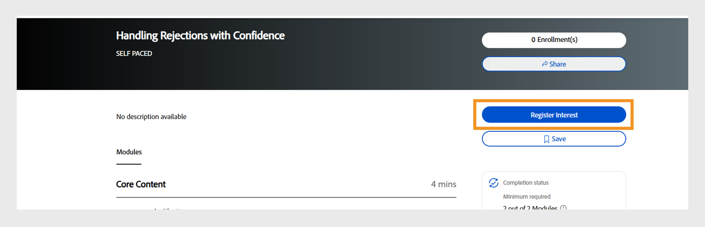

# Novidades na versão de outubro de 2025 do Adobe Learning Manager

A versão de outubro de 2025 do Adobe Learning Manager apresenta aprimoramentos significativos projetados para melhorar a precisão dos relatórios, expandir os recursos de integração e aprimorar a experiência de aprendizado para administradores, autores e alunos.

* Experience Builder: crie portais de aprendizado totalmente baseados em funções e com a marca adequada às necessidades da sua organização. Crie portais de aprendizado com base em funções e em marcas com widgets, menus e páginas.
* Marcação social em painéis de aprendizado: os alunos agora podem marcar colegas usando @username em publicações e comentários, permitindo colaboração e notificações direcionadas dentro de comunidades de aprendizado social.
* Permissões de comunicado no escopo: os administradores personalizados podem criar comunicados limitados aos grupos de usuários ou catálogos atribuídos, garantindo uma comunicação direcionada e reduzindo a sobrecarga de informações.
* Controle de progresso baseado no idioma: o progresso do aluno agora é salvo independentemente para cada local, permitindo alternar perfeitamente entre os idiomas sem perder o progresso.
* Gerenciamento incremental de funções personalizadas: agora os administradores podem gerenciar funções personalizadas de maneira mais eficiente com suporte a importações incrementais e multiincrementais no Adobe Learning Manager.
* APIs aprimoradas para análise e migração: as APIs novas e aprimoradas fornecem melhor controle de desempenho do quiz, monitoramento do status da migração e suporte para marcação de usuários no aprendizado social.

## Experience Builder

>[!IMPORTANT]
>
>Estamos entusiasmados em anunciar que o Experience Builder, a ferramenta inovadora para criar portais de aprendizado personalizáveis, estará disponível após a versão de outubro de 2025 do Adobe Learning Manager.
>
>Fique atento para mais atualizações, pois nos aproximamos da data de lançamento. Estamos ansiosos para ver como você usa o Experience Builder para transformar seus portais de aprendizado.
>
>Para esclarecer dúvidas ou obter informações adicionais, entre em contato com seu Gerente de sucesso do cliente.

O Experience Builder é uma ferramenta sem código/de baixo código no Adobe Learning Manager que ajuda a criar portais de aprendizado personalizados. Ele permite que você crie portais de aprendizado de marca e intuitivos sem precisar de habilidades técnicas ou amplo conhecimento de codificação.
Com o Experience Builder, os administradores podem criar facilmente páginas, menus e widgets para fornecer experiências de aprendizado personalizadas sob medida para o público-alvo.

Antes do Experience Builder, as organizações enfrentavam vários desafios:

1. **Personalização limitada**: os portais corrigiam designs com poucas opções para refletir sua marca. Os administradores só podiam fazer alterações básicas, como modificar cabeçalhos, rodapés ou cores, o que limitava a capacidade de criar experiências exclusivas.
2. **Custo**: a criação de portais personalizados exigia desenvolvedores caros e prazos longos, que demoravam de 6 a 9 meses para serem concluídos. Essa abordagem aumentou o custo total de propriedade e adiou a implantação.
3. **Experiências genéricas**: todos viram o mesmo conteúdo, mesmo que ele não fosse relevante para sua função ou necessidades. Essa falta de personalização reduziu o envolvimento e a satisfação do aluno.
4. **Barreiras técnicas**: administradores não-técnicos lutaram para criar ou atualizar portais porque precisavam de conhecimento de codificação ou suporte externo.

O Experience Builder resolve esses problemas fornecendo uma solução simples, sem código/de baixo código, para criar portais personalizados de marca.

Ele permite que os administradores criem portais que atendam às necessidades de sua organização sem depender de especialistas técnicos ou desenvolvedores externos.

**Casos de uso**

* **Portais com marca**: crie um portal que corresponda ao site da sua empresa com logotipos, cores e layouts. Por exemplo, uma empresa de assistência médica pode criar um portal que reflita sua marca corporativa enquanto fornece conteúdo de aprendizagem.
* **Aprendizado baseado em função**: crie páginas personalizadas para funções específicas. As equipes de vendas podem visualizar o treinamento de produtos, enquanto os engenheiros acessam os cursos técnicos.
* **Treinamento de produtos**: configure páginas dedicadas para diferentes produtos, como Photoshop ou Illustrator, com widgets que exibam cursos, certificações e recursos relacionados.

Exiba o [Experience Builder](/help/migrated/administrators/feature-summary/experience-builder/overview.md) para obter mais informações sobre como criar páginas personalizadas usando widgets.

## Progresso do aluno baseado no idioma

Atualmente, o Adobe Learning Manager acompanha o progresso do aluno apenas no idioma local selecionado, causando uma perda significativa de progresso ao alternar idiomas/locais no reprodutor. Essa limitação pode levar a uma experiência de usuário ruim, pois os alunos podem perder seu progresso ao acessar conteúdo em diferentes idiomas. O progresso de cada módulo no reprodutor é monitorado nos níveis de usuário e módulo. Isso leva a uma situação em que o progresso de um usuário é substituído quando ele volta para uma localidade anteriormente usada para o mesmo módulo.

Por exemplo, se um aluno obtiver 75% de progresso no local A (inglês) e mudar para o local B (espanhol), ao retornar para o local A, o progresso será redefinido para 0% em vez de retomar de 75%.

Para resolver essas limitações, o recurso foi aprimorado para oferecer suporte ao acompanhamento de progresso específico de localidades:

* **Armazenamento específico da localidade**: quando um aluno alterna as localidades (por exemplo, de Localidade A para Localidade B) no reprodutor, o Adobe Learning Manager agora salva o estado de progresso separadamente para cada localidade do conteúdo.
* **Retomada do progresso**: quando o usuário volta para uma localidade anteriormente usada (da localidade B de volta para a localidade A), o conteúdo retoma de onde parou naquela localidade específica.
* **Acompanhamento independente do progresso**: cada localidade mantém seu próprio estado de progresso, permitindo que os alunos explorem conteúdo em vários idiomas sem perder seu progresso individual em cada idioma.

Os seguintes tipos de conteúdo não são compatíveis com o progresso do aluno baseado no idioma:

* Conteúdo de vídeo e áudio não é suportado.
* Não há suporte para conteúdo de terceiros, incluindo Go1, LinkedIn Learning, getAbstract e Harvard ManageMentor.
* O conteúdo que não envia dados ao LRS (Armazenamento de Registros de Aprendizado) não terá o progresso rastreado ou salvo.
* Os usuários do aplicativo móvel não podem acompanhar o progresso desse recurso no modo offline.

Exiba [Meu Aprendizado](/help/migrated/learners/feature-summary/courses.md#language-based-progress-management) para obter mais informações sobre o progresso do aluno com base no idioma.

## Suporte incremental e multiincremental para funções personalizadas

O Adobe Learning Manager agora oferece suporte a importações incrementais e multiincrementais para atribuições de funções e funções personalizadas. Com as importações incrementais, os administradores podem carregar apenas registros novos, atualizados ou excluídos dos usuários, em vez de recarregar o arquivo CSV inteiro.

As importações multi-incrementais estendem esse recurso permitindo que grandes organizações dividam arquivos incrementais por região ou departamento (por exemplo, EUA, UE, APAC) e os processem em paralelo. O Adobe Learning Manager também oferece suporte a até 20 CSVs de usuário incrementais e suas funções personalizadas correspondentes, tornando-o dimensionável para grandes operações.

Os administradores agora podem fazer upload dos arquivos de função e de usuário (role.csv e user_role.csv) incrementalmente, junto com os arquivos de usuário (user.csv), em vez de sempre fazer uploads completos. Cada importação de usuário (user1.csv) é vinculada a seus próprios arquivos de mapeamento de função e função (user1_role.csv, user1_user_role.csv), armazenados em pastas FTP separadas.

As três colunas a seguir foram adicionadas aos seguintes CSVs:

* Estado de Registro do Usuário (user.csv): Indica o status de registro atual do usuário no sistema (por exemplo, ativo, inativo ou excluído).
* Estado da Função (role.csv): Indica se uma função personalizada está ativa ou inativa no momento na conta.
* Estado da Função do Usuário (user_role.csv): Define o status do mapeamento entre um usuário e uma função, mostrando se a atribuição está ativa ou foi removida.

O Adobe Learning Manager agora captura ações de adição, atualização e exclusão nos relatórios de auditoria de usuário e de função personalizada, oferecendo aos administradores melhor visibilidade das alterações.

>[!NOTE]
>
>Essas alterações são aplicáveis apenas às contas que usam usuários incrementais.

Exiba o [suporte incremental e multiincremental para funções personalizadas](/help/migrated/integration-admin/feature-summary/configure-role-csv-files.md#incremental-and-multi-incremental-support-for-custom-roles) para obter mais informações sobre o suporte incremental e multiincremental para funções personalizadas.

## Aprimoramentos na integração com o Go1

A integração Go1 foi aprimorada para permitir a curadoria direta dos cursos Go1 para criação de Programas de aprendizado (LP) no Adobe Learning Manager. Esta atualização oferece suporte à inclusão de cursos do Go1 em certificações recorrentes e introduz uma nova versão da experiência do hub de conteúdo do Go1, permitindo uma curadoria mais eficiente do curso.

* Crie e gerencie listas de reprodução diretamente no Go1 usando a assistência por bate-papo por IA ou a seleção manual.
* Inclua cursos do Go1 em ciclos de certificação recorrentes com redefinição automática do progresso. Exiba [Certificações](/help/migrated/administrators/feature-summary/certifications.md) para obter mais informações sobre como criar certificados.
* Interface de descoberta de conteúdo atualizada para navegação e curadoria de conteúdo aprimoradas.

**Observações importantes**

* Todos os recursos Go1 exigem uma licença Go1 ativa.
* O conteúdo gratuito anterior do Go1 será desativado. As organizações devem visualizar e comprar os pacotes de conteúdo necessários.
* Administradores e autores podem criar e gerenciar listas de reprodução; os alunos mantêm acesso somente exibição.

Exiba [Curar cursos Go1 para o Caminho de Aprendizado](/help/migrated/administrators/feature-summary/content-marketplace/curate-go1-playlist.md) para obter mais informações sobre como adicionar cursos Go1 ao Caminho de Aprendizado.

## Suporte para URLs de vídeo no módulo Atividade

O módulo Atividade agora oferece suporte à incorporação de URLs do Vimeo, semelhante às incorporações do YouTube. Esse aprimoramento permite que os administradores adicionem links de vídeo do Vimeo diretamente no módulo Atividade. Quando os autores criam um curso e adicionam um módulo de Atividade, agora veem uma opção para incluir um URL do Vimeo. Semelhante a como os links do YouTube são adicionados, os autores podem colar um link do Vimeo diretamente na configuração do módulo. Depois de publicados, os alunos podem reproduzir o vídeo Vimeo diretamente no aplicativo do aluno sem serem redirecionados para fora da plataforma.

Exiba [Adicionar módulos](/help/migrated/authors/feature-summary/courses.md#add-modules) para obter mais informações sobre como adicionar módulos aos cursos.

## Informações de fuso horário para módulos CR/VC

Os detalhes do fuso horário agora são exibidos para os módulos Sala de aula (CR) e Sala de aula virtual (VC) na página Visão geral do curso, página Instância, página Visualização do aluno e no widget Calendário. Os alunos e administradores podem ver claramente o fuso horário associado às sessões agendadas nas principais páginas e nos convites do calendário. Os alunos podem planejar melhor e participar de sessões sem mal-entendidos de fuso horário. Esse aprimoramento está disponível somente no aplicativo Aluno imersivo.

Os alunos de regiões diferentes podem confirmar a hora da sessão no fuso horário correto. A exibição do fuso horário ajuda a evitar sessões perdidas e garante um agendamento de calendário preciso.

## Preencher automaticamente o nome do autor ao criar um curso

Durante a criação do curso, o campo **[!UICONTROL Autor(es)]** agora é preenchido automaticamente com o nome dos Autores que estão criando o curso. Os autores não precisam mais inserir seus próprios nomes manualmente. Autores adicionais ainda podem ser adicionados ou atualizados conforme necessário.

Para organizações com regras rígidas de propriedade de conteúdo, o preenchimento automático garante que os autores sejam sempre atribuídos corretamente. Ao editar um curso existente, os autores podem atualizar ou adicionar coautores sem perder a entrada preenchida automaticamente.

Exiba [Criar um curso](/help/migrated/authors/feature-summary/courses.md#create-a-course---advanced-workflow) para obter mais informações sobre como criar um curso.

## Pesquisar perfis externos ao alterar o perfil

Anteriormente, os administradores percorriam a lista inteira de perfis externos e selecionavam manualmente o perfil desejado ao reatribuir alunos. Isso tornou o processo demorado, especialmente para contas com muitos perfis. Com esse aprimoramento, os administradores e os administradores personalizados agora podem pesquisar perfis externos diretamente na guia durante o fluxo de trabalho de alteração de perfil.

**Casos de uso**

* Em contas com centenas de perfis externos (por exemplo, locais de franquia, empresas parceiras ou grupos regionais), os administradores agora podem localizar o perfil exato instantaneamente usando a pesquisa, reduzindo erros e economizando tempo.
* Durante as alterações organizacionais, como fusões ou realinhamentos de departamentos, os alunos podem precisar ser movidos em massa para novos perfis externos. A reatribuição baseada em pesquisa torna essa tarefa mais suave e precisa.

Exiba [Alterar o perfil externo](/help/migrated/administrators/feature-summary/add-users-user-groups.md#change-profile) para obter mais informações sobre como alterar o perfil.

## Adicionar um co-organizador para sessões Microsoft Teams

Anteriormente, os autores só podiam atribuir um único organizador a sessões Microsoft Teams. Com esse aprimoramento, os administradores agora podem adicionar coorganizadores a uma sessão. Um novo campo, **[!UICONTROL Co-Organizador]**, foi introduzido nas sessões do Microsoft Teams, permitindo que os autores atribuam organizadores adicionais junto com o organizador principal.

Os autores podem atribuir vários co-organizadores para cada sessão do Microsoft Teams. Os coorganizadores têm o mesmo acesso e permissões que o organizador principal. Os autores podem adicionar até 10 organizadores por sessão, o que fornece maior flexibilidade e melhora o gerenciamento de sessões.

**Caso de uso**

Ao conduzir sessões em grande escala com muitos alunos, os coorganizadores podem ajudar a gerenciar a participação, moderar discussões e monitorar o bate-papo, enquanto o organizador principal se concentra na entrega do treinamento.

Exiba o artigo [Adicionar módulos](/help/migrated/authors/feature-summary/courses.md#add-modules) para obter mais informações sobre como adicionar sessões CR/VC aos cursos.

## Baixar relatório de alunos interessados

Quando um administrador desativa todas as instâncias do curso (por exemplo, no final do ciclo de vida do curso), o botão **[!UICONTROL Inscrever-se]** na página **[!UICONTROL Visão geral do curso]** é substituído por uma opção [!UICONTROL Registrar interesse]. Os alunos podem selecionar essa opção para expressar seu interesse em fazer o curso. Os administradores agora podem exibir e exportar uma lista de alunos que registraram interesse em um curso.

Os administradores podem acessar essa lista e baixá-la como um relatório. Um botão **[!UICONTROL Alunos interessados]** foi adicionado à página do curso quando nenhuma instância ativa estiver disponível. Isso exibe o nome do aluno e a data em que ele registrou interesse na interface do administrador.

Os administradores podem selecionar **[!UICONTROL Ações]** e selecionar **[!UICONTROL Exportar relatório]** para exportar o **[!UICONTROL relatório de alunos interessados]**.


_Seção de visão geral do curso na qual os alunos podem visualizar a opção Registrar interesse_

Exiba [Baixar o aluno interessado](/help/migrated/administrators/feature-summary/courses.md#download-the-interested-learner-report) para obter mais informações.

## Redefinir recomendações no aplicativo Salesforce

Anteriormente, os alunos que usavam o aplicativo Adobe Learning Manager Salesforce podiam selecionar funções e preferências de recomendação apenas uma vez. Se sua função mudasse, eles tinham de mudar para o aplicativo nativo da Adobe Learning Manager para atualizar seu perfil e receber recomendações relevantes do curso. Com os aprimoramentos mais recentes, os alunos agora podem redefinir rapidamente suas preferências diretamente no aplicativo Salesforce sempre que sua função de trabalho, equipe ou responsabilidades mudarem.

Esse processo simplificado garante que eles continuem recebendo recomendações de cursos relevantes e atualizadas sem sair do Salesforce. Os administradores se beneficiam de taxas mais altas de conclusão de aprendizado e melhor alinhamento entre as funções do usuário e o conteúdo recomendado, tudo isso sem fornecer suporte extra ou orientação sobre plataformas de comutação.

O Adobe Learning Manager agora apresenta o botão **[!UICONTROL Redefinir interesses]** no aplicativo Salesforce. Os alunos agora podem redefinir suas funções e preferências de aprendizado sem precisar sair do Salesforce ou fazer logon no aplicativo nativo da Adobe Learning Manager.

Exiba [Redefinir recomendações no aplicativo Salesforce](/help/migrated/learners/feature-summary/sfdc-app.md#reset-recommendations-in-salesforce-app) para obter mais informações sobre como redefinir recomendações no aplicativo Salesforce.

## Aprimoramento do widget Calendário

Os alunos agora podem ver as sessões passadas e futuras no widget Calendário. Eles podem mover pelo calendário para qualquer data e verificar os detalhes da sessão. Isso significa que eles podem revisar as sessões que já aconteceram, ajudando-os a acompanhar o que perderam ou participaram. Eles também podem visualizar todas as próximas sessões nos próximos 24 meses, incluindo o mês atual, facilitando o planejamento antecipado e o gerenciamento de suas programações.

Exiba o [Calendário](/help/migrated/learners/feature-summary/learner-home-page.md#calendar) para obter mais informações sobre o Widget de Calendário.

## Marcar usuários em painéis sociais

Os painéis sociais agora oferecem suporte à funcionalidade de marcação de usuário, permitindo discussões mais direcionadas e colaboração aprimorada nas comunidades de aprendizado. Os alunos podem ser marcados em publicações e comentários de aprendizado social por meio do aplicativo do aluno, APIs e site de referência do Adobe Learning Manager.

Os usuários fora do escopo do painel não podem ser marcados, evitando notificações indesejadas. Se um usuário marcado for excluído do sistema, a menção será exibida como “anônimo”. Marcar grupos de usuários ou &quot;@all&quot; não é permitido para evitar spams de notificação.

* **marcação @username**: os usuários podem marcar outros membros do painel usando o formato &quot;@username“.
* **Marcação com escopo restrito**: somente usuários com acesso ao painel específico podem ser marcados, garantindo a privacidade e a relevância.
* **Notificações multicanal**: os usuários marcados recebem notificações no aplicativo e por email com links diretos para postagens ou comentários relevantes.

**Casos de uso**

* Profissionais de saúde que buscam informações de colegas específicos em casos médicos: a marcação permite que médicos e enfermeiros notifiquem rapidamente os especialistas certos, garantindo orientação oportuna e precisa sobre casos de pacientes complexos.
* Especialistas no assunto sendo consultados sobre tópicos especializados: marcando especialistas, as equipes podem envolver diretamente as pessoas certas, reduzindo o tempo de resposta e melhorando a tomada de decisões para consultas técnicas ou de nicho.
* Discussões em equipe que exigem contribuições de partes interessadas específicas: marcar as partes interessadas garante que os responsáveis pelas decisões relevantes estejam cientes das atualizações e possam fornecer informações, mantendo os projetos no caminho certo e alinhados com as metas de negócios.

Exiba [Marcação de usuário em painéis sociais](/help/migrated/learners/feature-summary/social-learning-web-user.md#tag-users-in-social-board-posts) para obter mais informações sobre como marcar usuários em painéis sociais.

## Permissões de comunicado no escopo para administradores personalizados

Os administradores personalizados agora podem criar comunicados, mas somente para os grupos de usuários ou catálogos atribuídos a eles. Isso evita a comunicação não intencional através dos limites organizacionais. Os administradores personalizados só podem criar comunicados para usuários no escopo atribuído a eles. Os comunicados podem ter escopo definido para grupos de usuários ou catálogos específicos. Os administradores completos mantêm visibilidade e controle sobre todos os comunicados, inclusive aqueles criados por administradores personalizados com escopo definido.

**Principais benefícios**

* Comunicação direcionada que garanta que os anúncios cheguem apenas ao público relevante.
* Redução da sobrecarga de informações, evitando que notificações irrelevantes cheguem a usuários não-intencionais.
* Mantém os limites organizacionais e evita a comunicação cruzada acidental.

**Observações importantes**

* Se o escopo de um administrador personalizado for alterado, os comunicados afetados exibirão um ícone de aviso e exigirão redefinições de escopo individuais.
* Cada comunicado deve ser atualizado individualmente quando ocorrerem alterações no escopo.
* O relatório de [Aviso de Notificação](/help/migrated/administrators/feature-summary/announcements.md) mostra apenas os alunos dentro do escopo atribuído ao administrador personalizado.

**Casos de uso**

* Organizações de franquia onde os gerentes regionais precisam se comunicar apenas com seus franqueados.
* Grandes organizações com administradores regionais ou departamentais que direcionam anúncios para suas equipes.

Exiba [Criar comunicado para o escopo atribuído](/help/migrated/administrators/feature-summary/announcements.md#create-announcement-for-the-assigned-scope) para obter mais informações sobre a criação de comunicado para o escopo atribuído.

## Selecionar função personalizada ao publicar um conteúdo do Adobe Captivate

Ao publicar conteúdo do Adobe Captivate no Adobe Learning Manager, se um usuário tiver várias funções personalizadas, ele será solicitado a selecionar a função personalizada específica sob a qual o curso deve ser publicado. Isso garante que a propriedade de função e as permissões corretas sejam aplicadas ao curso publicado.

Exiba a [Função personalizada](/help/migrated/administrators/feature-summary/custom-role.md) para obter mais informações sobre como criar funções personalizadas para os usuários.

## Aprimoramentos no widget Salvo por mim

Anteriormente, a faixa **[!UICONTROL Salvos por mim]** exibia todos os cursos disponíveis no catálogo. Agora, os alunos veem apenas os cursos marcados como favoritos na faixa **[!UICONTROL Salvos por mim]** na página inicial do aluno. A seleção dessa faixa leva os alunos à página do catálogo, onde são exibidos apenas os cursos que eles salvaram.

No catálogo, os alunos podem aplicar filtros adicionais para refinar a pesquisa. Quando um filtro é aplicado, somente os cursos que atendem aos critérios selecionados são mostrados. Os cursos marcados anteriormente aparecem somente se corresponderem ao filtro aplicado.

Exiba [Configurar widgets de cursos salvos em sites AEM](/help/migrated/integrate-aem-learning-manager.md#configure-my-saved-courses-widgets-in-aem-sites) para obter mais informações sobre widgets de cursos salvos em sites AEM.

## Suporte para exibir os nomes dos autores em cursos compartilhados

Anteriormente, quando um curso era compartilhado com uma [conta entre parceiros](/help/migrated/administrators/feature-summary/peer-account.md), o autor aparecia como autor externo. Agora, os cursos exibem o nome do autor, independentemente de serem um usuário interno da conta principal ou um autor legado (ou seja, qualquer nome inserido como uma sequência de caracteres no campo Autores durante a criação do curso). Selecionar um autor mostra o número de cursos que compartilharam com a conta entre parceiros, no entanto, esses autores não são usuários reais na conta entre parceiros.

Se um usuário for excluído da conta principal, seus dados serão removidos dessa conta, mas as informações do autor permanecerão em qualquer conta entre parceiros em que seu conteúdo tenha sido compartilhado.

>[!NOTE]
>
>Este é um recurso baseado em sinalizadores. Entre em contato com nossa equipe de Suporte ao Cliente em [learningmanagersupport@adobe.com](mailto:learningmanagersupport@adobe.com) para habilitar esta opção.

Exiba a [conta entre parceiros](/help/migrated/administrators/feature-summary/peer-account.md) para obter mais informações sobre o compartilhamento de conteúdo com a conta entre parceiros.

## Pesquisar visibilidade de objetos de aprendizado de ordem inferior

Anteriormente, os resultados de pesquisa não exibiam consistentemente cursos individuais quando faziam parte de objetos de aprendizado de ordem superior, como caminhos de aprendizado ou certificações. Se um aluno estava inscrito apenas em um caminho de aprendizado ou certificação, a pesquisa retornava apenas a estrutura de ordem superior e não o curso individual.

Com esse aprimoramento, os alunos agora podem ver cursos individuais nos resultados de pesquisa, mesmo quando esses cursos fazem parte de caminhos de aprendizado ou certificações. Uma nova configuração de administrador, **[!UICONTROL Mostrar todos os cursos inscritos nos resultados da pesquisa]**, foi introduzida. Quando ativada, essa configuração garante que a pesquisa de um curso específico sempre exiba o próprio curso junto com quaisquer caminhos de aprendizado ou certificações relacionados.

Exiba [Configurações](/help/migrated/administrators/feature-summary/settings.md#general-settings) para obter mais informações sobre configurações gerais.

## Alterações de API

### Aprimoramentos na API de migração

O Adobe Learning Manager agora oferece suporte à migração de vários objetos de dados para uma conta por meio do processo de migração. Esse processo pode ser iniciado por meio de APIs e da interface do usuário. Quando uma migração falha, erros ficam disponíveis para download por meio da interface. Esses erros são úteis para depurar erros de migração e gerenciar as execuções de migração.

Com esta versão, os registros de erro também estarão disponíveis para download por meio das APIs para controle e depuração de erros eficientes e programáticos.

**Alterações de API**

Há uma nova API de migração, `runStatus`, que permite que os administradores de integração verifiquem o status das execuções de migração acionadas por meio da API, o que não é possível em versões anteriores do Adobe Learning Manager.

Além disso, a API `runStatus` agora fornece um link direto para baixar logs de erros (CSV) para execuções concluídas. Observe que o link é válido por apenas sete dias e os registros são mantidos por um mês.

A resposta da API `startRun` foi atualizada para incluir a ID do projeto de migração, a ID do sprint e a ID de execução do sprint, que são necessárias para consultar o novo ponto de extremidade de status.

#### API runStatus

**Descrição**

Recupera o status de uma execução de migração existente.

**Objetivo final**

```
GET /bulkimport/runStatus
```

**Parâmetros**

* **migrationProjectId**: (Obrigatório). Um identificador exclusivo para um projeto de migração. Um projeto de migração é usado para transferir dados e conteúdo de um sistema de gerenciamento de aprendizagem (LMS) existente para o Adobe Learning Manager. Cada projeto de migração pode consistir em vários sprints, que são unidades menores de tarefas de migração.

* **sprintId**: (obrigatório). Um identificador exclusivo de um sprint em um projeto de migração. Um sprint é um subconjunto de tarefas de migração que inclui itens de aprendizado específicos (por exemplo, cursos, módulos, registros do aluno) a serem migrados de um LMS existente para o Adobe Learning Manager. Cada sprint pode ser executado de forma independente, permitindo a migração em fases.

* **sprintRunId**: (Obrigatório). Um identificador exclusivo usado para rastrear a execução de um sprint específico em um projeto de migração. Está associado ao processo de migração real dos itens definidos em um sprint. O sprintRunId ajuda a monitorar, solucionar problemas e gerenciar o trabalho de migração.

**Resposta**

```
{
  "sprintId": 2510080,
  "sprintRunId": 2740845,
  "migrationProjectId": 2509173,
  "startTime": 1746524711052,
  "endTime": 1746524711052,
  [
    {
      "id": 2609923,
      "lastHeartbeatTime": 1746524711052,
      "objectName": "content",
      "jobState": "COMPLETED",
      "errorCsvLink": "",
      "errorLogLink": "migration/5830/2509173/2510080/2740845/content_err.csv",
      "sequenceNumber": 1
    },
    {
      "id": 2609922,
      "lastHeartbeatTime": 1746524713577,
      "objectName": "course",
      "jobState": "WAITING_IN_QUEUE",
      "errorCsvLink": "",
      "errorLogLink": null,
      "sequenceNumber": 2
    }
  ]
}
```

#### API startRun

A resposta da API `startRun` foi atualizada para incluir três campos adicionais: migrationProjectId, sprintId e sprintRunId. Esses campos permitem que os usuários controlem e consultem o status de execuções de migração específicas usando a nova API runStatus.

```
curl -X GET --header 'Accept: text/html' 'https://learningmanager.adobe.com/primeapi/v2/bulkimport/runStatus?migrationProjectId=001&sprintId=10001&sprintRunId=7'
```

Produz a seguinte resposta. A resposta contém:

* `migrationId`
* `sprintId`
* `sprintRunId`

**Resposta**

```
{
  "status": "OK",
  "title": "BULKIMPORT_RUN_INITIATED_SUCCESSFULLY",
  "source": {
    "info": "Success",
    "migrationInfo": {
      "migrationProjectId": "001",
      "sprintId": "10001",
      "sprintRunId": "7"
    }
  }
}
```

Exiba o [Manual de migração](/help/migrated/integration-admin/feature-summary/migration-manual.md) para obter mais informações sobre como migrar conteúdo do LMS existente.

### Alterações na API social (tag do usuário, comentários e respostas)

O Adobe Learning Manager agora oferece suporte à funcionalidade de marcação @user nos painéis sociais, permitindo que os alunos mencionem e notifiquem colegas em publicações, comentários e respostas. Esse recurso aprimora a colaboração e a detecção de conteúdo em toda a plataforma.

Esta versão apresenta novos recursos de API para oferecer suporte a menções de usuários, incluindo POST e pontos de extremidade de GET aprimorados, bem como uma nova funcionalidade de pesquisa para usuários marcados.

**Visão geral das alterações na API**

* Atualizadas as APIs POST para criar postagens/comentários/respostas com menções do usuário
* APIs GET atualizadas com dados de menção do usuário nas respostas

**Formato das menções do usuário**

Um usuário é mencionado usando o formato: @(usuário:userId)

#### Criar publicação com menções

**Objetivo final**

```
POST /primeapi/v2/posts
```

**Descrição**

Crie uma nova publicação de aprendizado social com menções do usuário.

**Corpo da solicitação**

```
{
  "data": {
    "type": "post",
    "attributes": {
      "boardId": 13282,
      "accountId": 11152,
      "text": "<p>This is a new post mentioning @[user:11257229]</p>",
      "createdByUserId": 11257228,
      "postType": "discussion"
    },
    "id": null
  }
}
```

**Resposta**

Resposta padrão de pós-criação com dados de menção incluídos no relacionamento _userMences_.

#### Criar comentário com menções

**Objetivo final**

```
POST /primeapi/v2/comments
```

**Descrição**

Adicione um comentário a uma postagem com menções do usuário.

**Corpo da solicitação**

```
{
  "data": {
    "type": "comment",
    "attributes": {
      "postId": 20746,
      "accountId": 11152,
      "text": "<p>Test Comment @[user:11257229]</p>",
      "createdByUserId": 11257228,
      "commentLevel": 0
    },
    "id": null
  }
}
```

#### Criar resposta com menções

**Objetivo final**

```
POST /primeapi/v2/replies
```

**Descrição**

Responder a um comentário com menções do usuário.

**Corpo da solicitação**

```
{
  "data": {
    "type": "reply",
    "attributes": {
      "postId": 20746,
      "accountId": 11152,
      "text": "<p>Thanks for the update @[user:11257229]</p>",
      "createdByUserId": 11257228,
      "commentLevel": 1,
      "parentCommentId": 55621
    },
    "id": null
  }
}
```

#### Recuperar publicações com menções

**Objetivo final**

```
GET /primeapi/v2/posts/{id}
```

**Descrição**

Recuperar detalhes da postagem, incluindo os usuários mencionados.

**Resposta**

```
{
  "links": {
    "self": "https://learningmanager.adobe.com/primeapi/v2/posts/7522"
  },
  "data": {
    "id": "7522",
    "type": "post",
    "attributes": {
      "commentCount": 3,
      "dateCreated": "2025-06-10T11:33:29.000Z",
      "dateUpdated": "2025-06-25T14:52:04.000Z",
      "downVote": 0,
      "postingType": "DEFAULT",
      "richText": "<p>my updated fourth post @[user:14707776] second mention my first post</p>",
      "state": "ACTIVE",
      "text": "my updated fourth post @[user:14707776] second mention my first post",
      "upVote": 0,
      "viewsCount": 0
    },
    "relationships": {
      "createdBy": {
        "data": {
          "id": "14707776",
          "type": "user"
        }
      },
      "parent": {
        "data": {
          "id": "3971",
          "type": "board"
        }
      },
      "userMentions": {
        "data": [
          {
            "id": "14707776",
            "type": "user"
          }
        ]
      }
    }
  },
  "included": [
    {
      "id": "14707776",
      "type": "user",
      "attributes": {
        "avatarUrl": "https://cpcontents.adobe.com/public/images/default_user_avatar.svg",
        "binUserId": "45664b87-75a3-43ec-b0b7-5064958eac6f",
        "email": "user@example.com",
        "enrollOnClick": false,
        "fields": {
          "Location": "BLR"
        },
        "gamificationEnabled": true,
        "lastLoginDate": "2025-06-27T11:21:17.000Z",
        "name": "John Doe",
        "pointsEarned": 1690,
        "pointsRedeemed": 0,
        "preferredResolution": "AUTO",
        "profile": "admin",
        "roles": [
          "Learner",
          "Admin",
          "Author",
          "Instructor",
          "Integration Admin",
          "Manager"
        ],
        "state": "ACTIVE",
        "userType": "Internal"
      },
      "relationships": {
        "account": {
          "data": {
            "id": "9238",
            "type": "account"
          }
        }
      }
    }
  ]
}
```

### Alterações na API social (pesquisa de usuários)

**Objetivo final**

```
GET /primeapi/v2/users/search?q={searchTerm}&context=tagging
```

**Descrição**

Procure usuários disponíveis para marcação com base nas configurações do escopo social.

**Parâmetros de solicitação**


* q (obrigatório): termo de pesquisa (mínimo de 3 caracteres).
* contexto: defina como “marcando” para qualificar os usuários para menções.
* boardId (opcional): ID do painel para filtrar usuários com base em permissões de acesso.

**Resposta**

```
{
  "data": [
    {
      "id": "11257229",
      "type": "user",
      "attributes": {
        "name": "Jane Smith",
        "email": "jane.smith@example.com",
        "avatarUrl": "https://cpcontents.adobe.com/public/images/default_user_avatar.svg",
        "userType": "Internal",
        "state": "ACTIVE"
      }
    }
  ]
}
```

### Aprimoramentos da API do aluno para acompanhamento do desempenho do quiz

A API do `GET /loResourceGrades` foi aprimorada para fornecer dados detalhados de desempenho do quiz, permitindo análises mais sofisticadas e tomada de decisões automatizada.

A resposta da API agora inclui dois campos adicionais:

* **[!UICONTROL higherScore]**: a melhor pontuação obtida por um aluno em todas as tentativas do quiz
* **[!UICONTROL maxScore]**: a pontuação total possível para o quiz

**Exemplo de resposta de API**

```
{
    "links": {
        "self": "https://learningmanagerstage1.adobe.com/primeapi/v2/loResourceGrades/course:15067_30122_41715_1_3400468"
    },
    "data": {
        "id": "course:15067_30122_41715_1_3400468",
        "type": "learningObjectResourceGrade",
        "attributes": {
            "completed": false,
            "duration": 0,
            "hasPassed": false,
            "highestScore": 0,
            "maxScore": 0,. 
            "progressPercent": 0,
            "score": 0
        },
        "relationships": {
            "loResource": {
                "data": {
                    "id": "course:15067_30122_41715_1",
                    "type": "learningObjectResource"
                }
            }
        }
    }
}
```

Em resposta, o **curso:15067_30122_41715_1_3400468** é a ID do grau de recurso do Objeto de Aprendizado para o qual as informações estão sendo solicitadas. A ID `learningObjectResourceGrad`e pode ser obtida na API `GET /enrollments/{id}`.

### As respostas da API são compatíveis com diferenciação de maiúsculas e minúsculas para nomes de Autor

A resposta da API agora fornece o caso exato dos nomes de autores herdados conforme inseridos durante a criação ou atualização do curso. Isso garante que os nomes apareçam consistentemente na interface do usuário do aluno e nas APIs públicas.

* Quando um novo nome de autor é adicionado, a capitalização é armazenada e retornada exatamente como inserida.
* Se um nome de autor existente for removido e adicionado novamente com uma capitalização diferente, a capitalização atualizada será honrada e refletida em todos os cursos usando esse nome de autor.
* Nenhuma migração automática será feita para nomes armazenados anteriormente; somente nomes recém-adicionados ou atualizados seguirão esse comportamento.

### Aprimoramento da API de calendário

O calendário agora carrega sessões para o mês selecionado pelo usuário. Para buscar sessões passadas e futuras por meio da API, um novo parâmetro `year` foi adicionado ao ponto de extremidade do aluno `GET /users/{id}/calendar`. Os parâmetros `month` e `year` devem ser fornecidos juntos para recuperar detalhes da sessão.

**Exemplo de curva**

```
curl -X GET --header 'Accept: application/vnd.api+json' --header 'Authorization: oauth a4ae04eb9f06f4bf88abcde17' 'https://abc.adobe.com/primeapi/v2/users/12345678/calendar?month=7&year=2025&currentMonthOnly=false&filter.allSessions=false'
```

### Suporte para marcar conclusão por meio da API do administrador

Anteriormente, a API pública não suportava a marcação de conclusão com base em instância em cenários de várias inscrições. Com esse aprimoramento, agora você pode incluir a ID da instância do curso no corpo da solicitação de `POST /users/{userId}/userModuleGrade` e o administrador pode marcar a conclusão de uma instância específica.

### Definir preferência de ID de usuário para relatórios SCORM

Alguns clientes exigem a UUID (Universally Unique Identifier) do aluno em vez da user_id padrão para a conclusão do conteúdo SCORM. O uso da UUID fornece um rastreamento mais preciso de todos os programas de aprendizado e impede a duplicação do uso de licenças em contas MAU (Monthly Ative User).

Para oferecer suporte a isso, uma nova configuração no nível da conta, `reporting_userid_preference`, foi adicionada. Quando ativada, essa configuração envia a UUID no lugar da user_id sempre que os alunos concluem o conteúdo do SCORM.

>[!NOTE]
>
> Entre em contato com nossa equipe de Suporte ao Cliente em [learningmanagersupport@adobe.com](mailto:learningmanagersupport@adobe.com) para definir essa configuração.

O novo atributo `reportingUserIdPreference` foi introduzido no `get /account` para acompanhar as preferências de ID de usuário.

### Informações do autor em cursos compartilhados

Na API dos objetos de aprendizado, a forma como as informações do autor são retornadas foi atualizada para distinguir entre os cursos da conta principal e os cursos compartilhados com contas entre parceiros:

* Cursos compartilhados (conta entre parceiros): os detalhes do autor agora são retornados em um novo atributo, `authorDetails`. Este atributo fornece o nome do autor mesmo quando o curso se origina de outra conta.

* Cursos de Conta Principal: as informações do autor continuam a ser retornadas sob o atributo `authors` existente, sem alterações no comportamento atual.

Essa alteração garante a consistência em como os dados do autor são expostos por meio da API para cursos principais e compartilhados, além de preservar a compatibilidade para integrações existentes.

## Alterações em webhooks

### Registrar webhooks do LinkedIn Learning usando o conector

Anteriormente, os administradores tinham de registrar manualmente os webhooks de aprendizado do LinkedIn no Adobe Learning Manager por meio de APIs. Com esse aprimoramento, o conector do LinkedIn Learning (LIL) agora oferece suporte ao registro de webhook automaticamente durante a nova configuração de conexão no ALM. A **URL do Servidor OAuth** e a **URL do Servidor do Locatário** serão preenchidas automaticamente na página de configuração do LinkedIn Learning.

Exiba o [LinkedIn Learning](/help/migrated/integration-admin/feature-summary/connectors.md#linkedin-learning-connector) para obter mais informações sobre a integração do LinkedIn Learning.

### Alterações no uso de licenças do MAU no LinkedIn Learning

Anteriormente, para contas MAU (Usuários ativos mensais), quando um aluno concluía um curso de aprendizado do LinkedIn diretamente na plataforma de aprendizado do LinkedIn, o Adobe Learning Manager não contava o uso da licença. O consumo de licenças foi acionado apenas para cursos realizados por meio do reprodutor do Adobe Learning Manager, resultando em um rastreamento impreciso de Usuários Ativos Mensais (MAU).

Com esse aprimoramento, o Adobe Learning Manager agora gera um webhook externo sempre que um aluno realiza um curso na plataforma de aprendizado do LinkedIn. Quando o Adobe Learning Manager recebe este webhook, ele calcula o uso de licenças para garantir o rastreamento preciso em ambas as plataformas.

## Alterações de relatórios

### Conclusões marcadas pelo professor nas transcrições do aluno

As transcrições incrementais do aluno agora capturam conclusões marcadas pelo professor, mesmo se a participação for registrada após a data da sessão.
Esse aprimoramento aborda uma lacuna crítica nas transcrições incrementais do aluno em que as conclusões marcadas pelo professor eram anteriormente perdidas se a participação fosse registrada após a data da sessão original.

As transcrições incrementais do aluno são relatórios agendados que capturam apenas as alterações (como conclusões ou atualizações de progresso) que ocorrem em um período especificado, em vez de fornecer um despejo de dados histórico completo. Eles são normalmente usados para automação, painéis de controle e integrações, permitindo que os usuários controlem de forma eficiente as atividades de aprendizado recentes sem processar todo o histórico de transcrição a cada vez.

* **Marcar coluna de Data de Conclusão (Fuso Horário UTC)**: uma nova coluna de carimbo de data/hora que captura a data e a hora exatas quando um professor marca uma sessão ou um módulo como concluído.
* **Acompanhamento de origem da conclusão aprimorada**: acompanha o instrutor e o módulo específicos (por exemplo, “Sala de Aula”) em que as conclusões foram gravadas.

Essas alterações garantem que as conclusões marcadas após a data da sessão sejam refletidas com precisão nas transcrições incrementais do aluno.

**Casos de uso**

* Organizações com sessões de sala de aula nas quais os professores podem marcar presença dias após a sessão real.
* Sistemas ou painéis automatizados que dependem de transcrições incrementais do aluno para fins de conformidade ou emissão de relatórios.


_O relatório de transcrição do aluno exibe uma nova coluna em amarelo destacando as datas de conclusão individuais de cada usuário_

Exiba a [Transcrição do aluno](/help/migrated/administrators/feature-summary/reports/learner-transcripts.md)para obter mais informações sobre o relatório de transcrição do aluno.

### Relatório de usuário aprimorado com campos de dados estendidos

O Relatório de usuário agora inclui campos adicionais para aprimorar o rastreamento do usuário e o mapeamento organizacional. Essas atualizações simplificam a identificação do usuário, oferecem suporte à integração com fluxos de trabalho de gerenciamento de usuários downstream, melhoram a compreensão das relações de emissão de relatórios e mantêm os limites organizacionais para evitar a comunicação cruzada acidental.

* Coluna ID de Usuário Interno: fornece identificadores internos exclusivos para um controle de usuário suave entre diferentes sistemas e endpoints de API.
* Coluna E-mail do Gerente: inclui informações de contato direto do gerente para rastreamento da hierarquia organizacional.


_Relatórios de Usuário destacando IDs de usuário internas e endereços de email de gerentes para simplificar o gerenciamento de usuários_

Exiba [Baixar o relatório de usuário](/help/migrated/administrators/feature-summary/add-users-user-groups.md#download-the-user-report) para obter mais informações sobre o Relatório do Usuário.

### Relatório do usuário em FTP, FTP personalizado e Box

**Visão geral**

O Relatório de usuário agora está disponível para os conectores Box, FTP e FTP personalizado, além das APIs de trabalho existentes. Esses relatórios fornecem informações detalhadas sobre ID de usuário interno, email do usuário, nome, email do gerente, tipo de usuário e outros.

Os relatórios podem ser gerados sob demanda ou agendados, com dados armazenados no respectivo conector para fácil acesso e análise. Esse aprimoramento melhora o monitoramento e a auditoria das atividades do usuário, oferecendo suporte a um melhor controle de segurança e conformidade.

Esses relatórios estão disponíveis junto com os relatórios existentes, como registro de usuário, acesso ao logon, gamificação e treinamento, permitindo que os administradores acessem todos os relatórios essenciais em um único local para gerenciamento e análise simplificados de dados.

Exiba o [Conector](/help/migrated/integration-admin/feature-summary/connectors.md) para obter mais informações sobre o FTP, FTP personalizado e conector do Box.

### Incluir usuários suspensos nas transcrições do aluno

**Visão geral**

Agora, as organizações podem incluir usuários suspensos (aqueles com perfis externos desativados) nas transcrições do aluno, garantindo uma retenção abrangente dos dados de aprendizado do histórico.

* Sinalizador no nível da conta para configurar a visibilidade suspensa do usuário, permitindo que usuários suspensos apareçam em transcrições do aluno.
* Retenção de dados históricos mesmo após a desativação de perfis externos suspensos.

**Requisitos de implementação**

* Entre em contato com seu gerente de sucesso do cliente (CSM) para ativar o sinalizador no nível da conta.

>[!NOTE]
>
>Este sinalizador está desabilitado por padrão para contas existentes e deve ser solicitado explicitamente para novas contas.

Veja mais informações no artigo [Transcrição do aluno](/help/migrated/administrators/feature-summary/reports/learner-transcripts.md).

### Relatório de ajudas de tarefa com links de acesso direto

**Visão geral**

O relatório de ajudas de tarefa foi aprimorado para incluir links de download direto para ajudas de tarefa, simplificando o gerenciamento de conteúdo e os processos de auditoria para administradores e autores. Esse aprimoramento fornece downloads diretos de arquivos e acesso de URL a partir do relatório. Elimina o esforço manual de localizar e fazer download de ajudas de tarefa para auditorias de conformidade ou acessibilidade.

* Coluna Link da ajuda de tarefa: acesso direto a arquivos de ajuda de tarefa e URLs externos no relatório.
* Controle de acesso baseado em função: a acessibilidade do link depende das funções do usuário e das permissões do catálogo.
* As ajudas de tarefa excluídas permanecem acessíveis se ainda estiverem vinculadas aos cursos ativos.

**Casos de uso**

* Os autores ou administradores realizam auditorias regulares de acessibilidade em ajudas de tarefa, conforme exigido pelas grandes organizações.
* Qualquer cenário em que o acesso rápido e baseado em funções a arquivos de ajuda de tarefa seja necessário para revisão ou conformidade.


O _Relatório de ajudas de tarefa exibe links de download direto, facilitando o acesso e o download de ajudas de tarefa no Adobe Learning Manager_

Exiba o [Relatório de ajudas de tarefa](/help/migrated/administrators/feature-summary/reports.md#job-aids-report) para obter mais informações sobre o relatório de ajudas de tarefa.

## Erros corrigidos nesta atualização

* As pontuações do quiz L2 agora são geradas corretamente para questionários não interativos, incluindo detalhes dos usuários que os concluíram.
* A assinatura agora é enviada corretamente ao host de destino quando o mecanismo de autenticação é definido como Assinatura durante a configuração da conexão.
* Os usuários fictícios criados durante as sessões do Adobe Connect não eram excluídos após a conclusão da sessão. O pipeline do SnapLogic agora remove corretamente esses usuários, mesmo quando a API `principals-delete` retornou anteriormente uma resposta 200 sem excluí-los.
* `null` objetos `eventDetail` em respostas de API não causam mais exceções. O sistema agora ignora entradas nulas e processa todo o array, garantindo gravações completas.
* A coluna Data do feedback nos relatórios de feedback agora exibe a data correta. Anteriormente, os segundos eram passados incorretamente ao construtor Date, que espera milissegundos, fazendo com que as datas aparecessem como janeiro de 1970. Isso foi corrigido para garantir a exibição precisa da data ao gerar relatórios de feedback.
* Os alunos agora podem atualizar a inscrição em um caminho de aprendizado da Flex mesmo se uma das instâncias do curso estiver desativada. Anteriormente, selecionar uma nova instância causava um erro de console (Não é possível ler propriedades de indefinido) e impedia a atualização.
* Os nomes dos recursos nos caminhos de aprendizado agora são exibidos corretamente sem quebrar a palavra média.
* Os webhooks de aprendizado do linkedIn agora são ativados no conector LIL ao criar conexões para novos usuários. O sistema também registra a conta por meio da API privada e exibe informações de configuração adicionais (URL OAuth e URL do locatário) na página de configuração do LinkedIn Learning.
* Os valores de atributo de usuário atualizados por meio de fluxos de trabalho SAML (`UpdateUserWorkerTask`) agora são salvos com suas letras maiúsculas e minúsculas, em vez de serem convertidos em letras minúsculas.
* A reordenação de módulos em um curso não redefine mais o número de Módulos obrigatórios para “Todos”; a contagem agora permanece conforme configurada.
* Os pipelines Go1 agora lidam com os códigos de idioma de forma consistente mapeando códigos de duas letras para códigos de quatro letras, semelhante aos pipelines do LinkedIn Learning.
* Em contas Inativas+, os alunos anteriormente viam “Este curso não existe” ao iniciar um curso de Caminho de Aprendizado após cancelar a inscrição de uma certificação. As fontes de inscrição agora estão atualizadas corretamente, permitindo que os cursos nos Caminhos de aprendizado sejam iniciados sem erros.
* Quando o arquivo module_version.csv contém campos contentType com valores em branco ou nulos, a criação do curso agora funciona sem problemas.
* Os cursos agora aparecem corretamente ao filtrar por catálogo ou etiqueta de catálogo. Anteriormente, aplicar esses filtros na página do curso não exibia os cursos, mesmo que estivessem associados ao catálogo.
* No aplicativo do aluno, pressionar TAB no Fluidic Player estava travando no botão “Enter Fullscreen”. A navegação pelo teclado agora se move corretamente em todos os elementos da tela.
* Passar o mouse sobre os nomes dos cursos longos no Painel de conformidade do aplicativo do gerente agora exibe o nome completo dos cursos inscritos ou em conformidade.
* Somente Compartilhado ou OCULTO são aceitos para a coluna de visibilidade do módulo em module.csv. Qualquer outro valor acionará um erro durante a migração, evitando falhas no back-end.
* Criar um novo administrador com um e-mail de capitalização mista não gera mais entradas de usuário duplicadas quando a UUID está desativada. O sistema agora lida consistentemente com o uso de maiúsculas e minúsculas em emails para evitar duplicatas.
* As notas PDF agora são exibidas corretamente para cursos em idiomas como árabe, grego, hebraico, hindi, tailandês e ucraniano. Anteriormente, os personagens pareciam distorcidos no PDF baixado, mesmo que fossem exibidos corretamente no reprodutor.

## Requisitos do sistema

Exibir [requisitos de sistema do Adobe Learning Manager](/help/migrated/system-requirements.md).

## Notas de versão

Confira as [notas de versão](/help/migrated/release-note/release-notes.md) para obter as atualizações de versão mais recentes.

## Versões anteriores do Adobe Learning Manager

* [Versão de maio de 2025 do Adobe Learning Manager](/help/migrated/whats-new-may-2025.md)
* [Versão de novembro de 2025 do Adobe Learning Manager](/help/migrated/whats-new-nov-24.md)


